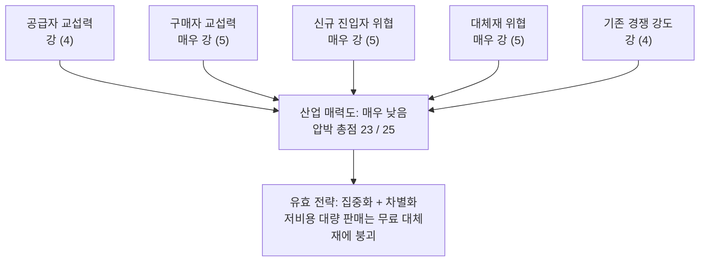

# 사례 01 — AI AX/DX 교육 중심 에듀테크 산업

분석 기준 시점: 2026년 8월 · 적용 방법론: [methodology.md](./methodology.md)

---

## 0. 분석 범위 정의

5가지 힘 분석은 **산업의 경계를 어떻게 그리는지에 따라 결론이 완전히 달라진다.** 그래서 힘을 보기 전에 범위를 먼저 못박는다.

| 항목 | 내용 |
|---|---|
| 시장 정의 | 기업·공공기관 임직원을 'AI를 써서 성과를 내는 인력'으로 전환시키는 교육 서비스 |
| 지리적 범위 | 국내(한국) 중심, 글로벌 플레이어의 국내 진입 포함 |
| 포함 | B2B 기업교육(집합·온라인), 정부 재정지원 훈련(B2G), 구독형 러닝 플랫폼(LXP/LMS+콘텐츠), 성인 대상 부트캠프 |
| 제외 | K-12 사교육 에듀테크, 학위 과정, 어학 |
| 주요 플레이어 | 국내 전문 교육사(패스트캠퍼스·휴넷·엘리스·코드잇 등), 대기업 계열 교육사(멀티캠퍼스 등), 글로벌 플랫폼(Coursera·Udemy Business), 컨설팅펌의 AX 교육 결합 서비스, 그리고 **모델 제공사가 직접 배포하는 공식 교육·인증** |
| 구매 단위 | 기업 HRD 예산, 정부 훈련 예산, 개인 수강료 |

경계에 대한 메모: 이 시장을 "교육 산업"으로 보면 경쟁자가 교육사뿐이지만, **"기업의 AI 역량 확보 수단"으로 보면 컨설팅·SI·툴 벤더가 모두 경쟁자**가 된다. 아래 분석은 후자의 시각을 채택했다. 고객이 지갑을 여는 이유가 '교육'이 아니라 '역량'이기 때문이다.

---

## 1. 다섯 가지 힘 한눈에 보기

압박 점수는 **수익성을 깎아내리는 압력의 크기**다(5 = 압박 최대 = 산업에 최악).

| # | 힘 | 강도 | 압박 점수 | 핵심 근거 한 줄 |
|---|---|---|---|---|
| 1 | 공급자 교섭력 | 강 | 4 | 스타 강사와 모델 제공사가 원가와 커리큘럼 수명을 동시에 쥐고 있다 |
| 2 | 구매자 교섭력 | 매우 강 | 5 | 소수 대기업 HRD와 정부라는 단일 구매자, 그리고 전환비용 거의 0 |
| 3 | 신규 진입자 위협 | 매우 강 | 5 | 자본·설비·특허가 필요 없고, 생성 AI가 콘텐츠 제작 원가를 무너뜨렸다 |
| 4 | 대체재 위협 | 매우 강 | 5 | 무료 콘텐츠·사내 자체 교육·툴 자체의 UX 개선이 교육 수요를 직접 삼킨다 |
| 5 | 기존 경쟁 강도 | 강 | 4 | 참여자 과다에 차별화 난이도 높음. 지금은 고성장이 경쟁 강도를 가려주고 있다 |
| | **합계** | | **23 / 25** | **구조적 매력도: 매우 낮음** |

---

## 2. 힘별 상세 분석

### 2-1. 공급자의 힘 — 강 (4/5)

**공급자가 누구인가**
- **강사·콘텐츠 제작자**: 이 산업의 원재료는 사람이다. AI 실무를 가르칠 수 있는 강사는 희소하고, 몸값이 현업 시장 연봉에 연동돼 움직인다.
- **모델·툴 제공사**: 교육의 *대상 자체*가 남의 제품이다. API 비용, 툴 라이선스, 실습 환경(클라우드·GPU) 비용을 이들이 정한다.
- **콘텐츠 유통 플랫폼**: 자체 채널이 약한 사업자는 플랫폼 수수료를 낸다.

**힘이 센 이유**
- **원가의 대부분을 그들이 차지한다.** 강사료와 콘텐츠 제작비가 매출원가의 큰 몫이며, 이는 방법론에서 말한 "우리 제품 원가의 대부분을 그들의 재료가 차지"하는 전형적 상황이다.
- **전방 통합이 실제로 일어난다.** 두 방향 모두에서 발생한다.
  - 강사 개인이 회사를 건너뛰고 직접 기업에 판매하거나 자기 브랜드를 세운다. 강사가 곧 상품이라 이탈이 곧 매출 이탈이다.
  - 모델 제공사가 **무료 공식 교육·인증 프로그램을 직접 배포한다.** 원재료 공급자가 최종 고객에게 직접, 그것도 공짜로 파는 상황이다.
- **커리큘럼의 유통기한을 공급자가 정한다.** 모델이 한 세대 바뀌면 어제 만든 교안이 폐기된다. 감가상각 속도를 우리가 통제할 수 없다는 뜻이며, 이것이 이 산업 원가 구조의 숨은 함정이다.

**힘이 약해지는 지점(반증)**
- 기초 이론·소프트스킬 영역은 강사 대체가 쉽다.
- 생성 AI로 교안 초안을 자동 생성하면서 '평범한 강사'의 협상력은 오히려 떨어졌다. 힘이 센 것은 **상위 소수의 실무 강사**로 좁혀지고 있다.
- 모델 제공사 간 경쟁(복수 벤더 병기)으로 특정 벤더 종속은 완화 가능하다.

> 한 줄 결론: 원가와 콘텐츠 수명을 모두 외부가 쥐고 있어 **강**. 특히 공급자가 무료로 전방 통합한다는 점이 구조적 약점이다.

### 2-2. 구매자의 힘 — 매우 강 (5/5)

**큰 손님이 소수다**
- B2B에서 실질 구매자는 대기업·금융지주·공공기관의 HRD 부서다. 상위 몇 개 계정이 매출의 큰 비중을 차지하는 사업자가 흔하다.
- B2G는 더 극단적이다. **정부가 사실상 단일 구매자**로서 훈련단가 상한, 과정 인증, 훈련기관 평가를 통해 가격과 품질을 직접 정한다. 정책 문구 한 줄이 다음 해 매출을 바꾼다.
- 조달 방식도 불리하다. 경쟁입찰과 단가 협상이 기본이며, 구매자는 복수 벤더를 항상 옆에 세워둔다.

**제품이 너무 흔하다**
- "프롬프트 활용 기초", "사내 문서로 RAG 만들기", "AI로 보고서 자동화" 같은 과정은 급속히 표준 상품이 됐다. 고객은 목차만 보고 벤더를 갈아탈 수 있다.
- 방법론이 지적한 그대로다. 표준화될수록 구매자 힘은 세진다.

**전환비용이 거의 없다**
- 다음 분기 교육을 다른 벤더에 주는 데 드는 비용이 사실상 0이다. LMS를 도입한 경우에만 약간의 락인이 생기지만, 콘텐츠는 여전히 갈아치우기 쉽다.

**구매자 힘을 낮출 수 있는 유일한 지점**
- 사내 데이터·직무 프로세스에 밀착된 커스텀 AX 프로그램(사내 AI 도입과 묶인 형태)은 벤더 교체 시 재구축 비용이 발생한다. **전환비용을 인위적으로 만들 수 있는 곳은 여기뿐이다.**

> 한 줄 결론: 집중된 구매자 + 표준화된 제품 + 전환비용 0. 세 조건이 동시에 성립하므로 **매우 강**.

### 2-3. 신규 진입자의 위협 — 매우 강 (5/5)

방법론의 진입장벽 세 가지를 그대로 대입하면 이 산업은 세 개 모두 비어 있다.

| 진입장벽 | 이 산업의 상태 |
|---|---|
| 규모의 경제 | **거의 없음.** 필요한 고정투자가 사실상 없다. 큰 회사가 과정 하나를 더 만드는 단가와 1인 사업자의 단가 차이가 크지 않다 |
| 기술적 우위·특허 | **없음.** 커리큘럼은 보호가 불가능하다. 목차가 공개되면 몇 주 안에 복제된다 |
| 채널·브랜드 선점 | **부분적으로만 유효.** 링크드인·유튜브·뉴스레터로 개인이 직접 리드를 확보한다. 오히려 신규 진입자가 더 빠르게 채널을 만든다 |

**AI가 진입장벽을 스스로 허물었다**
- 교안, 실습 자료, 평가 문항, 영상 편집까지 생성 AI로 처리하면서 콘텐츠 제작 원가가 급감했다. 1인 사업자가 대형사와 겉보기 품질이 비슷한 산출물을 낸다.
- 즉 이 산업은 **자기가 가르치는 기술 때문에 자기 진입장벽이 낮아진** 드문 사례다.

**남아 있는 장벽**
- 정부 훈련기관 지정·과정 인증, 대기업 벤더 등록 자격, 대형 레퍼런스와 신뢰.
- 다만 이것들은 **규제·관계형 장벽이지 경제적 장벽이 아니다.** 시간과 서류로 넘을 수 있고, 넘은 뒤에는 초과 수익을 지켜주지 못한다.

> 한 줄 결론: **매우 강.** 이 산업이 성장하면서도 돈이 남지 않는 1차 원인이다.

### 2-4. 대체재의 위협 — 매우 강 (5/5)

먼저 고객의 진짜 욕구를 정확히 써야 한다. 기업이 원하는 것은 **교육을 받는 것이 아니라 임직원이 AI로 실제 성과를 내는 것**이다. 그 욕구를 채워주는 '완전히 다른 것'을 모두 세면 다음과 같다.

| 대체재 | 위협 수준 | 설명 |
|---|---|---|
| 툴 자체의 UX 개선 | **최상** | 도구가 쉬워지면 교육이 필요 없어진다. 시장의 크기 자체를 줄이는 대체재 |
| 사내 자체 교육 | 상 | AI TF·사내 강사 양성으로 자가 공급(후방 통합). 대기업일수록 실행력이 있다 |
| 컨설팅·SI 구축 | 상 | 사람을 가르치는 대신 사내 AI 시스템을 구축해버린다. 같은 예산을 두고 경합한다 |
| 무료 콘텐츠 | 상 | 공식 문서, 유튜브, 벤더 무료 아카데미. 가격 상한을 0 근처로 눌러버린다 |
| LLM에게 직접 물어보기 | 중~상 | 학습 행위 자체가 대체된다. 필요한 순간에 물어보면 되는데 왜 과정을 수강하는가 |
| 채용·외부 인력 조달 | 중 | 역량을 기르는 대신 이미 가진 사람을 사 온다 |

**전환비용이 낮다** — 방법론이 강조한 조건이다. 고객이 대체재로 갈아타는 데 드는 비용이 낮으면 위협은 커진다. 여기서는 유튜브를 켜거나 사내 TF를 만드는 것이 전부다.

> 한 줄 결론: **매우 강.** 특히 '툴이 쉬워지는 것'은 경쟁자가 아니라 산업 자체를 축소시키는 종류의 위협이다.

### 2-5. 산업 내 경쟁 강도 — 강 (4/5)

- **참여자가 과도하게 많다.** 진입이 자유로우니 당연한 결과다.
- **차별화가 어렵다.** 결국 가격과 마케팅으로 싸운다. 퍼포먼스 광고 단가(CAC) 상승이 마진을 직접 깎는다.
- **고정비가 낮아 퇴출은 쉽지만, 그래서 진입도 끝나지 않는다.** 나가는 만큼 들어온다.
- **지금은 고성장이 경쟁 강도를 가려주고 있다.** AX 예산이 커지는 국면에서는 모두가 성장하므로 출혈이 덜 느껴진다. 방법론대로라면 경쟁 강도는 **성장이 멈추는 순간 급격히 올라간다.**
- 선행 사례가 이미 있다. 개발자 부트캠프 시장은 고성장 뒤에 정부 예산·채용 수요가 꺾이면서 단기간에 구조조정을 겪었다. 같은 사이클이 AX 교육에 반복될 가능성을 기본 시나리오로 놓아야 한다.

> 한 줄 결론: **강.** 정확히는 "성장에 가려진 강"이며, 성장률이 꺾이면 매우 강으로 이동한다.

---

## 3. 산업 매력도 종합

**핵심 진단: 시장은 빠르게 커지는데, 그 성장이 이익으로 남지 않는 구조다.**

- 성장률과 수익성은 다른 축이다. 수요가 폭발하는 산업이라도 진입장벽이 없으면 초과 이익은 신규 진입자에게 즉시 분산된다.
- 이 산업의 저수익 원인은 **"아무나 들어올 수 있다"** 한 문장으로 요약된다. 자본도 설비도 특허도 필요 없기 때문이다.

---

## 4. 전략적 시사점

**하면 안 되는 것**
- 범용 온라인 콘텐츠의 저비용 대량 판매. 무료 대체재와 원가 0의 신규 진입자가 있는 곳에서 가격으로 이기는 전략은 성립하지 않는다.
- B2G 매출 의존. 단일 구매자에게 가격 결정권을 넘긴 상태에서 규모를 키우면 리스크만 커진다.

**해야 하는 것 — 집중화(Focus)로 경쟁의 판을 좁힌다**
- **산업·직무 특화**: 제조 공정 품질검사, 금융 규제 준수 문서, 병원 행정처럼 도메인 지식이 있어야 만들 수 있는 과정으로 좁힌다. 도메인 지식이 곧 신규 진입자가 넘기 어려운 유일한 장벽이다.
- **성과 증빙으로 차별화**: 수강 만족도가 아니라 교육 후 업무 지표 변화를 측정해 제시한다. 구매자가 비교할 축을 가격에서 성과로 옮기는 작업이다.
- **전환비용을 인위적으로 만든다**: 사내 역량 진단 데이터 축적, 사내 사례 라이브러리, 직무별 인증 체계. 데이터가 쌓이면 벤더 교체 비용이 생긴다.
- **대체재의 편에 선다**: 교육을 컨설팅·구축의 진입점으로 쓴다. 교육 예산과 경합하던 컨설팅·SI를 경쟁자에서 자기 사업으로 흡수하는 방향이다.
- **공급자 리스크 분산**: 강사 개인 브랜드 의존을 줄이고 커리큘럼을 조직 자산화한다. 모델 벤더는 복수로 병기해 특정 벤더 종속을 피한다.

---

## 5. 검증이 필요한 가정과 수치

이 문서는 구조 분석이며, 아래 항목은 실제 데이터로 확인해야 결론의 신뢰도가 올라간다.

- [ ] 국내 기업교육 시장 중 AI/AX 관련 지출 규모와 성장률
- [ ] 정부 재정지원 훈련의 연도별 예산 추이와 AI 분야 훈련단가 상한
- [ ] 주요 사업자의 매출 대비 상위 고객 집중도, 강사료가 매출원가에서 차지하는 비중
- [ ] 기업 HRD의 벤더 교체 주기(전환비용이 실제로 0에 가까운지)
- [ ] AX 예산이 교육/컨설팅/툴 라이선스로 배분되는 비율 (대체재 경합의 실제 크기)
- [ ] 모델 제공사 무료 교육 프로그램의 국내 기업 채택률
