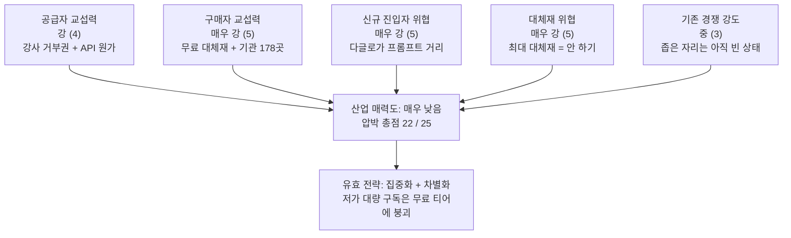

# 사례 01 — 「콕집」이 진입하는 산업: 직업교육 학습자용 AI 학습 보조 도구

> **콕집** — 국비 교육·대학 강의를 녹음·태깅해, **현직자 관점의 우선순위로 복습할 것만 골라주는** 학습 앱

분석 기준 시점: 2026년 8월 · 적용 방법론: [Ch01 방법론](./methodology.md)

**근거 표기** — 🟢 실측 / 🟡 유도 / 🔴 가설

참고 문서
- [참고 사례 — AX/DX 기업교육 산업](./reference-ai-education-edtech.md) (압박 23/25) — 이하 **[REF-E]**. **공급 측 산업**이며 이 문서와 대상이 다르다
- 경쟁 실사·판정 근거 → [간이 딥 리서치](../04-tam-sam-som-market-segment-map/deep-research/kokjip-research.md)
- 수치 원천 → [산정 근거](../04-tam-sam-som-market-segment-map/deep-research/kokjip-sizing-evidence.md)

---

## 0. 분석 범위 정의

5가지 힘은 **산업 경계를 어떻게 긋느냐에 따라 결론이 완전히 달라집니다.** 그래서 힘을 보기 전에 경계를 먼저 못박습니다.

| 항목 | 내용 |
|---|---|
| 시장 정의 | **직업교육을 수강 중인 학습자**가 강의 내용을 소화·복습하는 것을 돕는 소프트웨어 도구 |
| 지리적 범위 | 국내(한국). 글로벌 도구(Otter 등)의 국내 사용 포함 |
| 포함 | 강의 녹음·전사·요약 도구, 학습 우선순위·복습 추천 도구, AI 코스웨어의 학습자 대면 기능, 학습 자료 정리 도구 |
| 제외 | 강의 콘텐츠 자체(교육 공급), LMS(기관 운영 시스템), K-12 학습지, 어학 앱 |
| 주요 플레이어 | 다글로 · 클로바노트 · 에이닷 노트 · 티로 · 노션 · AI 코스웨어 사업자 |
| 구매 단위 | 학습자 개인 구독, 훈련기관·대학의 학습자 라이선스 |

### 이 산업은 [REF-E]와 다른 산업입니다

두 문서를 헷갈리면 안 되므로 관계를 먼저 정리합니다.

| | [REF-E] AX/DX 기업교육 | **본 문서** 학습 보조 도구 |
|---|---|---|
| 파는 것 | **강의 그 자체** | 강의를 **소화하는 것을 돕는 도구** |
| 고객 | 기업 HRD·정부 훈련 예산 | **학습자 본인**과 그를 가르치는 기관 |
| 콕집의 위치 | 이 산업의 **고객사이자 판매 채널**(훈련기관) | **이 산업의 신규 진입자** |

**콕집은 교육을 팔지 않습니다.** 따라서 진입 산업은 [REF-E]가 아니라 이쪽이고, [REF-E]는 **인접한 공급 측 산업**으로 읽어야 합니다. 다만 두 산업은 한 지점에서 직결됩니다 — [REF-E]의 플레이어인 **국비 훈련기관이 이 산업에서는 구매자**입니다. 그래서 [REF-E]가 진단한 "정부가 사실상 단일 구매자"라는 조건이 콕집에게는 **간접적으로**, 그러나 결정적으로 넘어옵니다([§2-2](#2-2-구매자의-힘--매우-강-55)).

**경계에 대한 메모** — 이 시장을 "녹음·요약 앱 시장"으로 보면 경쟁자는 STT 사업자뿐입니다. 그러나 학습자가 지갑을 여는 이유는 녹음이 아니라 **"제한된 시간 안에 취업에 필요한 것만 익히는 것"** 입니다. 그 욕구를 기준으로 경계를 그으면 **아무것도 안 하기·유튜브 로드맵·스터디·LLM에 직접 묻기**가 모두 경쟁 상대가 됩니다. 아래 분석은 후자를 채택했습니다.

---

## 1. 다섯 가지 힘 한눈에 보기

압박 점수는 **수익성을 깎아내리는 압력의 크기**입니다(5 = 압박 최대 = 산업에 최악).

| # | 힘 | 강도 | 압박 점수 | 핵심 근거 한 줄 |
|---|---|---|---|---|
| 1 | 공급자 교섭력 | 강 | 4 | 원가는 모델 API가 쥐고, **원재료(강의 발화)의 접근권은 강사가 거부할 수 있다** |
| 2 | 구매자 교섭력 | 매우 강 | 5 | 개인은 전환비용 0·무료 대체재 보유, 기관은 **178곳뿐인 소수 집중 구매자** |
| 3 | 신규 진입자 위협 | 매우 강 | 5 | 자본·설비 불필요. **기존 STT 사업자가 프롬프트만 바꾸면 도달하는 거리** |
| 4 | 대체재 위협 | 매우 강 | 5 | 동일 기능이 이미 **무료**이고, 최대 대체재는 경쟁사가 아니라 **"그냥 복습을 안 하는 것"** |
| 5 | 기존 경쟁 강도 | 중 | 3 | 정확한 포지션은 아직 비어 있으나, 인접 무료 사업자가 조밀하게 둘러싸고 있다 |
| | **합계** | | **22 / 25** | **구조적 매력도: 매우 낮음** |

---

## 2. 힘별 상세 분석

### 2-1. 공급자의 힘 — 강 (4/5)

**공급자가 누구인가**

| 공급자 | 무엇을 공급하는가 | 대체 가능성 |
|---|---|---|
| **STT·LLM API 제공사** | 음성 전사, 요약, 중요도 판정 추론 | 복수 벤더 존재 — **교체 가능** |
| **강사** | **원재료 그 자체** — 녹음 대상이자, 판정 근거가 되는 실무 발화 | **대체 불가** |
| **훈련기관** | 학습자 접근 경로 | 178곳으로 한정 |
| 앱 마켓 | 결제·유통 | 사실상 복점 |

**힘이 센 이유**

- **원재료 공급자가 거부권을 가지고 있습니다.** 이것이 이 산업 고유의 조건입니다. 강의 녹음의 세계 표준은 **기관 계약 + 강사 개별 opt-in**이며, UCL은 **거부에 이유를 제시할 필요조차 없다**고 명시합니다 🟢. UMass Lowell은 *"No class will be recorded without the expressed consent of the faculty member"* 이고 **녹화물의 지식재산권을 강사가 보유**합니다 🟢. 강사 한 명이 거부하면 그 반 전체에서 제품이 작동하지 않습니다.
- **원가가 사용량에 비례합니다.** 전사·요약·판정이 모두 API 호출이므로 사용자가 늘면 원가가 같이 늡니다. [REF-E]에서 강사 시간이 만들던 "매출과 함께 늘어나는 원가" 구조가 여기서는 **추론 비용**의 형태로 반복됩니다.
- **공급자가 전방 통합합니다.** 모델 제공사가 학습·요약 기능을 직접 배포합니다. 클로바노트는 하이퍼클로바를 가진 네이버 자신의 제품이고, 개인 요금제가 **무료(월 300분, 동의 시 600분)** 🟢 입니다. 원재료 공급자가 최종 고객에게 직접, 그것도 공짜로 파는 상황입니다.

**힘이 약해지는 지점(반증)**

- STT·LLM은 벤더 간 경쟁이 치열하고 단가가 하락 중입니다. 추상화 계층을 두면 교체 가능하므로 **여기의 종속은 설계로 해소됩니다.**
- 강사 발화는 **수집 비용이 0**입니다 🟢 — 녹음이 곧 입력이라 강사에게 아무 입력도 요구하지 않습니다. 즉 비용이 아니라 **권한**만이 문제입니다.
- 강사 동의는 개인이 매번 부탁하는 대화에서 **기관이 차수 시작 시 표준 동의서를 받는 절차**로 바꿀 수 있습니다. 절차화하면 거부 심리가 낮아집니다 🟡.

> 한 줄 결론: **강.** 원가 종속은 설계로 풀리지만, **강사의 거부권은 돈으로 풀리지 않습니다.** 이 산업에서 공급자 리스크의 본체는 가격이 아니라 접근권입니다.

### 2-2. 구매자의 힘 — 매우 강 (5/5)

이 산업의 구매자는 **두 종류이고, 둘 다 강합니다 — 서로 다른 이유로.**

**구매자 ① 학습자 개인 — 지불 의사의 상한이 구조적으로 눌려 있다**

- **같은 기능이 이미 무료입니다.** 클로바노트 개인 무료, 노션 학생 플러스 무료 🟢. 유료의 근거를 만들려면 무료가 못 하는 것을 증명해야 합니다.
- **전환비용이 0을 넘어 음수입니다.** 일반 SaaS는 쓰다 보면 데이터가 쌓여 이탈이 어려워지는데, 이 제품은 **강의가 끝나면 사용 이유 자체가 소멸합니다.** 6개월 과정이 끝나면 붙잡을 근거가 없습니다.
- 지불 능력도 낮습니다. 표적이 **훈련 중인 취업 준비생**입니다.

**구매자 ② 훈련기관 — 소수이고 예산 주기가 정해져 있다**

- KDT 훈련기관은 **178곳뿐입니다** 🟢. 계정 수가 구조적으로 적어 개별 계약의 협상 비중이 큽니다.
- 이들의 예산은 정부 훈련 예산에 연동됩니다 — [REF-E]가 진단한 **"정부가 사실상 단일 구매자"** 조건이 한 단계 건너 콕집에게 도달합니다.

**사용자와 지불자가 분리됩니다**

이 산업의 구조적 핵심입니다. 쓰는 사람(학습자)과 돈 내는 사람(기관)이 다르므로, 제품이 좋아도 **기관이 사는 이유가 따로 있어야** 합니다. [Ch04 산정](../04-tam-sam-som-market-segment-map/case-01-kokjip-lecture-review-prioritizer.md#3-4-괴리의-원인--누가-돈을-내는가가-다른-시장이다)에서 개인 지불 기준과 기관 지불 기준이 **112배** 벌어진 것이 이 분리의 정량적 표현입니다.

**구매자 힘을 낮출 수 있는 지점**

기관에게는 개인에게 없는 **강한 지불 동기**가 하나 있습니다 — KDT 수료생 취업률이 62.6%(2022) → **54.2%(2024)** 로 2년간 **8.4%p 하락**했고 🟢, 훈련기관은 그 성과로 지정·평가받습니다. **"취업률을 방어하는 도구"** 라는 명분은 기관에게 마케팅이 아니라 생존 문제입니다.

> 한 줄 결론: **매우 강.** 개인은 무료 대체재와 소멸하는 사용 동기 때문에, 기관은 소수 집중과 예산 종속 때문에 강합니다. 유일한 지렛대는 **취업률 하락이라는 기관의 통증**입니다.

### 2-3. 신규 진입자의 위협 — 매우 강 (5/5)

방법론의 진입장벽 세 가지를 그대로 대입합니다.

| 진입장벽 | 이 산업의 상태 |
|---|---|
| 규모의 경제 | **거의 없음.** 서버·모델은 종량제다. 1인 개발자와 대형사의 단위 원가 차이가 작다 |
| 기술적 우위·특허 | **없음.** STT는 API로 즉시 조달되고, "중요도 판정"은 프롬프트 수준에서 흉내 가능하다 |
| 채널·브랜드 선점 | **부분적.** 훈련기관 제휴는 시간이 걸리지만 배타적 계약이 아니면 막지 못한다 |

**가장 가까운 위협은 아직 안 들어온 회사가 아니라 이미 옆에 있는 회사입니다.**

다글로는 2017년 출시된 국내 최초 STT 사업자로 **"대학생 맞춤형 AI"를 명시적으로 표방**하며 강의 녹음 → 요약 → **AI 퀴즈 생성**까지 이미 제공합니다 🟢. 콕집이 추가하려는 것은 "현직자 기준 중요도 판정" 한 겹인데, **이는 기술이 아니라 판단 근거 데이터의 문제**이므로 그들이 프롬프트만 바꿔 따라올 수 있습니다 🔴.

**남아 있는 유일한 장벽은 「판정의 근거 데이터」입니다**

[간이 딥 리서치 §4-2](../04-tam-sam-som-market-segment-map/deep-research/kokjip-research.md#4-2-확정--강사-발화로-출발선을-취업-이력으로-벽을)가 근거 조합을 확정했고, 그중 실제로 벽이 되는 것은 **취업 성공자의 학습 이력** 하나입니다 — 우리 안에서만 생성되고, 다글로는 만들 수도 살 수도 없습니다(그들의 사용자는 취업 결과와 연결되지 않습니다). 단 첫 라벨이 **9~12개월 뒤**에야 나오고 차수당 라벨이 **13명**(수강생 25명 × 취업률 54.2%) 🟡 이라, **장벽이 세워지기 전까지의 공백 기간이 존재합니다.**

> 한 줄 결론: **매우 강.** 이 산업에서 초과 이익이 남지 않는 1차 원인이며, 콕집에게는 **"장벽이 완성되기 전에 따라잡히는가"** 라는 시간 경주의 형태로 나타납니다.

### 2-4. 대체재의 위협 — 매우 강 (5/5)

먼저 고객의 진짜 욕구를 정확히 씁니다. 학습자가 원하는 것은 **복습을 잘하는 것이 아니라 제한된 시간 안에 취업에 필요한 것만 익혀 합격하는 것**입니다. 그 욕구를 채우는 '완전히 다른 것'을 모두 세면 다음과 같습니다.

| 대체재 | 위협 수준 | 설명 |
|---|---|---|
| **그냥 복습하지 않기** | **최상** | 복습은 의무가 아니라 선택이다. 시장의 크기 자체를 줄이는 대체재이며, 경쟁사가 아니라 **행동하지 않음**이 최대 경쟁자다 |
| 무료 녹음·요약 도구 | 상 | 클로바노트 개인 무료, 노션 학생 무료 🟢. **가격 상한을 0 근처로 눌러버린다** |
| LLM에 직접 물어보기 | 상 | "이 과정에서 뭐가 중요해?"를 그냥 물으면 된다. 판정 행위 자체가 대체된다 |
| 유튜브·블로그의 취업 로드맵 | 중~상 | "실무에서 중요한 것"을 무료로, 이미 정리된 형태로 제공한다 |
| 강사에게 직접 질문 | 중~상 | 현직자 인사이트의 **원본**이 교실 안에 이미 있다 |
| 스터디·멘토링·커뮤니티 | 중 | 사람이 우선순위를 정해준다 |
| AI 코스웨어의 학습 순서 조정 | 중 | 오답·성취도 기반으로 **부족 개념 보완 순서까지 조정**한다 🟢 |

**전환비용이 낮습니다** — 유튜브를 켜거나 ChatGPT에 묻는 것이 전부입니다.

**다만 대체재 전부가 못 하는 자리가 하나 있습니다.** 위 항목의 우선순위는 **학습자 내부 데이터**(내가 틀린 것)이거나 **강의와 무관한 일반론**(로드맵)입니다. **"이번 주 이 강의에서 나온 이 개념"** 수준의 해상도로 실무 중요도를 판정하는 사업자는 확인되지 않았습니다 🟢. 비전공 전향자는 **자기가 무엇을 모르는지조차 모르므로** 오답 기반 우선순위가 작동하지 않는다는 것이 이 빈자리의 근거입니다.

> 한 줄 결론: **매우 강.** 그리고 가장 중요한 통찰은 **최대 대체재가 무료 앱이 아니라 "아무것도 안 함"** 이라는 것입니다. 경쟁 제품을 이기는 것보다 **복습이라는 행동을 일으키는 것**이 어렵습니다.

### 2-5. 산업 내 경쟁 강도 — 중 (3/5)

- **정확한 포지션은 아직 비어 있습니다.** "국비 직업교육 학습자 × 실무 기준 우선순위" 자리에서 확인된 사업자가 없습니다 🟢.
- **그러나 인접이 조밀합니다.** 다글로(대학생 특화), 클로바노트·에이닷·티로(범용 무료), 노션(정리), AI 코스웨어(기관 판매)가 사방에서 기능을 넓히고 있습니다. 국내 에듀테크 380곳 중 AI 도입 기업이 **82곳** 🟢 입니다.
- **이미 가격 경쟁이 바닥에서 벌어집니다.** 무료 티어가 표준이므로 신규 진입자는 처음부터 0원과 비교당합니다. 출혈이 광고비가 아니라 **무료 제공 원가**의 형태로 발생합니다.
- **시장 국면이 바뀌었습니다.** 에듀테크는 혁신이라는 이름만으로 확산되지 않고 **실제 학습 성과를 입증해야 살아남는 단계**로 진입했습니다 🟢. 성과 증빙 없이 기능만으로는 기관 계약이 나오지 않습니다.

> 한 줄 결론: **중.** 다섯 힘 중 유일하게 압박이 낮은 항목이며, 그 이유는 콕집이 강해서가 아니라 **아직 아무도 이 좁은 자리에 안 왔기 때문**입니다. 즉 이 3점은 자산이 아니라 **유효기간이 있는 기회**입니다.

---

## 3. 산업 매력도 종합

**핵심 진단: 학습 보조 도구를 파는 사업으로는 구조적으로 돈이 남지 않습니다.**

- 압박 22점 중 **15점이 구매자·신규진입·대체재 세 항목**에 몰려 있고, 셋의 공통 원인은 하나입니다 — **이 기능의 시장 가격이 이미 0으로 눌려 있다.**
- [REF-E]의 총점(23/25)과 거의 같지만 **압박의 출처가 다릅니다.** [REF-E]는 "아무나 들어올 수 있다"가 원인이었고, 여기는 **"아무나 들어올 수 있는데 그 위에 사용자와 지불자까지 분리돼 있다"** 가 원인입니다. 후자가 더 다루기 어렵습니다 — 제품을 아무리 잘 만들어도 쓰는 사람의 지갑이 아니기 때문입니다.
- 유일하게 압박이 낮은 항목(경쟁 강도 3)은 **선점의 여지**이지 방어력이 아닙니다.

---

## 4. 전략적 시사점

**하면 안 되는 것**

- **범용 녹음·요약 앱으로 개인 구독을 파는 것.** 무료 대체재와 정면 충돌하며, [Ch04 산정](../04-tam-sam-som-market-segment-map/case-01-kokjip-lecture-review-prioritizer.md#3-4-괴리의-원인--누가-돈을-내는가가-다른-시장이다)에서 이론 2,000억이 실현 59억으로 줄어드는 항목이 정확히 이것입니다.
- **기능 수 경쟁.** 녹음·요약·퀴즈·정리는 모두 무료로 존재하므로, 추가할수록 원가만 늘고 차별화는 생기지 않습니다.

**해야 하는 것 — 다섯 힘에 각각 대응한다**

| 대응 | 어느 힘에 대한 답인가 | 구체 행동 |
|---|---|---|
| **표적을 국비 부트캠프 수강생으로 좁힌다** | 경쟁 강도(3)의 빈자리를 선점 | 복습 부채가 최대이고 실무 판정이 유효한 유일 구간. 공무원 준비생·장기 미취업 청년은 **절박해도 제외**한다 → [Ch04 §2](../04-tam-sam-som-market-segment-map/case-01-kokjip-lecture-review-prioritizer.md#2-market-segment-map) |
| **판정 근거를 자산으로 만든다** | 신규 진입자(5) | 강사 발화를 1차 신호로 쓰되, **취업 결과 라벨**을 첫날부터 적립한다. 벽이 되는 것은 이것 하나다 |
| **지불 주체를 기관으로 옮긴다** | 구매자(5) — 개인 쪽 | 개인의 상한은 월 5,000원으로 고정돼 있다. 기관에는 **취업률 8.4%p 하락**이라는 통증이 있다 |
| **성과 증빙을 산출물로 만든다** | 구매자(5) — 기관 쪽 | 에듀테크가 성과 입증 단계에 들어섰으므로 🟢, 기관용 리포트가 곧 재계약 조건이다 |
| **강사 접근권을 제도로 확보한다** | 공급자(4) | 기관 계약에 **강사 opt-in 표준 동의서**를 포함하고, **녹화물 IP·실연권은 강사에게 남긴다**(UMass·Aberdeen 방식) 🟢 |
| **모델 종속을 설계로 끊는다** | 공급자(4) | STT·LLM 추상화 계층. 단순 전사와 판정 추론에 서로 다른 등급의 모델을 라우팅한다 |
| **단가 구조가 다른 수익원을 연다** | 대체재(5) | 학습 구독의 상한을 못 넘으므로 채용 연계로 이동한다 — 성공 수수료 **연봉 7%** 🟢, 건당 **약 210만 원** 🟡 은 개인 연 구독료의 35배다 |

**대체재(5)에 대한 답은 기능이 아니라 행동 설계입니다.** 최대 대체재가 "그냥 안 하기"이므로, 경쟁 제품과 비교되기 전에 **복습을 시작하게 만드는 것**이 먼저입니다. 강의 중 그 순간에 태깅이 일어나 복습 시점에 기억을 되짚을 필요가 없다는 설계가 여기에 대한 답입니다.

**⚠️ 전략과 충돌하는 위험 하나** — 채용 연계는 단가 문제를 풀지만 **이해상충을 만듭니다.** 우리가 복습 우선순위를 정하고 그 결과물로 우리가 매칭하면, 매칭 성사를 위해 우선순위를 왜곡할 유인이 생깁니다. 학습 도구로서의 중립성이 수익원과 충돌하며, 이는 [Ch04 §7 ④](../04-tam-sam-som-market-segment-map/case-01-kokjip-lecture-review-prioritizer.md#7-전략적-함의)에서도 함정으로 지목됐습니다.

---

## 5. 다음 챕터로 넘기는 것

| 넘기는 결론 | 대상 | 용도 |
|---|---|---|
| 유효 전략 = **집중화 + 차별화**, 저가 대량은 봉쇄 | [Ch02 가치사슬](../02-value-chain/case-01-kokjip-lecture-review-prioritizer.md) | 어느 활동에서 그 전략을 실행할지 |
| 압박 5점 3개(구매자·진입자·대체재)의 방어 지점 | Ch02 §0 | 힘 → 활동 대응표의 입력 |
| **강사 접근권**이 원재료 조달의 핵심 조건 | Ch02 §2-1 | 투입·조달 물류의 설계 제약 |
| 진입장벽 = 판정 근거 데이터 하나뿐 | [Ch03 KSF](../03-ksf/case-01-kokjip-lecture-review-prioritizer-ksf-fit.md) | 축적 루프 KSF의 판정 기준 |
| 표적 = 국비 부트캠프 수강생 | [Ch04 시장 규모](../04-tam-sam-som-market-segment-map/case-01-kokjip-lecture-review-prioritizer.md) | 세그먼트 맵의 주 표적 |
| 지불 주체를 기관으로 이동 | Ch04 §2-4 · [Ch06 전략](../06-market-opportunity-score/case-01-kokjip-lecture-review-prioritizer-strategy.md) | 과금 시점·주체 설계 |

---

## 6. 검증이 필요한 가정

- [ ] 강사의 녹음 동의율 — opt-in 절차를 표준화했을 때 실제 몇 %가 동의하는가 🔴
- [ ] 다글로 등 인접 사업자의 유료 전환율·ARPU (무료 티어 경쟁의 실제 강도) 🔴
- [ ] 훈련기관의 학습 도구 예산 집행 의향과 단가 상한 🔴
- [ ] 강사 발화에서 실무 중요도 신호가 시간당 몇 회 발생하는가 — **하루짜리 실험인데 제품의 축이 여기서 갈립니다** 🔴
- [ ] 유료 서비스가 강의 녹음물을 서버에서 처리하는 것이 사적이용 복제 예외를 벗어나는가 (변호사 확인) 🔴
- [ ] 학습자가 강의 종료 후에도 도구를 계속 쓰는 비율 (전환비용 0 가정의 실측) 🔴

**앞 두 항목이 이 문서의 결론을 가장 크게 흔듭니다.** 강사 동의율이 낮으면 공급자 압박이 4에서 5로 올라가고, 인접 사업자의 유료 전환이 이미 높다면 대체재 압박의 성격이 달라집니다.
