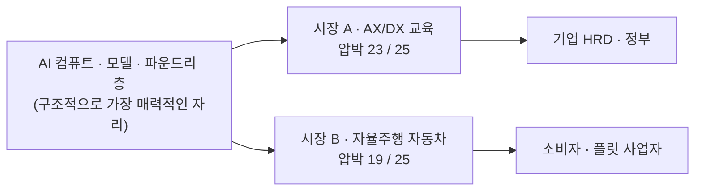

# 비교 분석 — AX/DX 교육 산업 vs 자율주행 자동차 산업

분석 기준 시점: 2026년 8월
- 시장 A: [AI AX/DX 교육 중심 에듀테크 산업](./case-01-ai-education-edtech.md)
- 시장 B: [인공지능 자율주행 중심 자동차 산업](./case-02-autonomous-driving-automotive.md)

---

## 1. 5가지 힘 나란히 보기

압박 점수는 수익성을 깎는 압력의 크기(5 = 최대 압박 = 산업에 최악)이며, 정성 판단을 등급화한 값이다.

| 힘 | 시장 A · AX/DX 교육 | 시장 B · 자율주행 자동차 | 더 불리한 쪽 |
|---|---|---|---|
| 공급자 교섭력 | **강 (4)** — 스타 강사 + 모델 제공사가 원가와 콘텐츠 수명을 쥔다 | **강 (4)** — 컴퓨트 칩·배터리라는 두 급소, 풀스택 전방 통합 | 무승부 |
| 구매자 교섭력 | **매우 강 (5)** — 소수 대기업 HRD + 단일 구매자인 정부, 전환비용 0 | **중 (3)** — 개인은 분산돼 약하지만 "자율주행에 돈 안 낸다"는 선택이 가격 상한 | **A** |
| 신규 진입자 위협 | **매우 강 (5)** — 자본·설비·특허 불필요, AI가 제작 원가를 붕괴시킴 | **중 (3)** — 제조 장벽은 높지만 스택·서비스층과 중국 진영으로 우회 진입 | **A** |
| 대체재 위협 | **매우 강 (5)** — 무료 콘텐츠, 사내 자체 교육, 툴 UX 개선, LLM에 직접 질문 | **강 (4)** — 로보택시·대중교통·원격근무 | **A** |
| 기존 경쟁 강도 | **강 (4)** — 참여자 과다·차별화 난이도. 지금은 고성장이 가려주고 있다 | **매우 강 (5)** — 고정비·퇴출장벽 동시 최고, 정체 시장 + 가격 전쟁 + R&D 군비 경쟁 | **B** |
| **합계** | **23 / 25 (매우 낮음)** | **19 / 25 (낮음)** | |

---

## 2. 가장 중요한 차이 — 같은 '저수익'인데 원인이 정반대다

두 산업 모두 구조적으로 매력적이지 않다. 그런데 **돈이 남지 않는 이유가 서로 거울처럼 반대**다. 이 대비가 이번 비교의 핵심 학습 포인트다.

| 구분 | 시장 A · AX/DX 교육 | 시장 B · 자율주행 자동차 |
|---|---|---|
| 저수익의 근본 원인 | **장벽이 없어서** — 누구나 들어와 초과 이익을 즉시 분산시킨다 | **장벽이 비싸서** — 벽을 세우고 유지하는 비용(설비·R&D·퇴출 불가)이 이익을 먹는다 |
| 지배적인 힘 | 신규 진입자 + 대체재 + 구매자 (외부에서 밀려온다) | 기존 경쟁 강도 (내부에서 서로 깎는다) |
| 필요 자본 | 거의 없음 | 조 단위 |
| 퇴출 난이도 | 매우 쉬움 (그래서 진입도 끝나지 않는다) | 매우 어려움 (그래서 과잉 설비가 시장에 남는다) |
| 시장 성장률 | 매우 높음 | 성숙·정체 (성장은 전동화·신흥국에 국한) |
| 성장과 수익의 관계 | 성장이 이익으로 남지 않는다 | 성장 자체가 없다 |
| 이익 변동의 트리거 | 성장률 둔화 (그 순간 경쟁 강도가 폭발) | 가동률 하락 (그 순간 가격 전쟁) |
| 사이클 속도 | 6~12개월 (모델 세대 교체 주기) | 5~10년 (차량 개발 주기) |

**한 문장 요약**
> A는 문이 열려 있어서 가난하고, B는 문을 잠그는 값이 비싸서 가난하다.

성장률이 높은 산업이 좋은 산업은 아니라는 점이 A에서, 진입장벽이 높은 산업이 좋은 산업은 아니라는 점이 B에서 각각 확인된다. **매력도를 결정하는 것은 성장률도 장벽의 높이도 아니라, 벌어들인 돈을 누가 가져가는지의 구조다.**

---

## 3. 성장률과 진입장벽으로 본 위치

| | **낮은 진입장벽** | **높은 진입장벽** |
|---|---|---|
| **높은 성장률** | **← 시장 A** 수요는 폭발하지만 이익이 신규 진입자에게 즉시 분산된다. 이익이 남는 창은 짧고, 그 창을 늘리는 방법은 도메인 특화뿐이다 | 가장 매력적인 자리 (예: 두 시장의 *공급자* 층) |
| **낮은 성장률** | 최악의 자리 가격 경쟁만 남는다 | **← 시장 B** 벽이 지켜주지만 벽의 유지비와 퇴출 불가능성이 이익을 상쇄한다 |

---

## 4. 공통점 — 두 산업이 똑같이 겪는 세 가지

### 4-1. 가치가 둘 다 '위쪽'으로 흘러간다

두 산업을 나란히 놓으면 같은 그림이 보인다. AI 컴퓨트와 모델을 공급하는 층이 두 산업 모두의 강한 공급자다.

두 시장을 분석해서 얻은 가장 실용적인 결론은 **"둘 다 아니라 그들의 공급자 쪽에 돈이 남는다"**는 것이다. 5가지 힘 분석의 목적이 "어느 산업에서 싸울지 고르는 것"이라면, 이 그림은 그 질문에 대한 답 하나를 이미 제시한다. AI 붐의 수혜를 산업 구조 관점에서 보면 응용 계층보다 컴퓨트·모델 계층이 유리하다.

### 4-2. 대체재를 산업이 스스로 만든다

- A: 가르치는 대상인 AI 툴이 쉬워질수록 교육 수요가 사라진다. 자기가 잘 가르칠수록 시장이 줄어든다.
- B: 자율주행이 완성될수록 로보택시가 자동차 소유를 대체한다. 자기가 성공할수록 판매 대수가 줄어든다.

두 산업 모두 **핵심 역량의 성공이 자기 수요를 침식하는 구조**다. 방법론에서 대체재를 "완전히 다른 종류인데 같은 욕구를 채우는 것"으로 정의했는데, 여기서는 그 대체재가 외부 침입자가 아니라 산업 자신의 산출물이다.

### 4-3. 강한 공급자가 전방 통합으로 고객을 직접 노린다

- A: 모델 제공사가 무료 공식 교육·인증을 직접 배포한다.
- B: 칩 벤더가 풀스택 턴키를 팔아 완성차를 조립 공정으로 밀어낸다.

방법론이 공급자의 힘에서 마지막에 언급한 "우리를 건너뛰고 우리 고객에게 직접 판다"가 두 산업에서 동시에 진행 중이다.

---

## 5. 두 시장의 연결 지점

두 시장은 별개가 아니다. **B의 전환이 A의 최우량 수요를 만든다.**

- 완성차와 부품사가 소프트웨어 중심 차량(SDV)으로 전환하면서 기계공학 인력을 SW·AI 인력으로 재교육해야 한다. 예산 규모가 크고, 사내 데이터·규제·안전 도메인이 필수라 아무나 들어오기 어렵다.
- 즉 **A의 유효 전략(도메인 집중화)의 최적 대상 중 하나가 B**다. 자동차 도메인 특화 AI 교육은 A의 진입장벽 부재 문제를 우회하는 구체적인 방법이 된다.
- 반대 방향의 함의도 있다. B가 정체·구조조정 국면에 들어가면 A의 해당 세그먼트 예산이 먼저 삭감된다. 도메인 집중화는 그 도메인의 사이클 리스크를 함께 사는 일이다.

---

## 6. 전략 결론 — 어디서, 어떻게 싸울 것인가

둘 다 결론이 **집중화**로 수렴한다. 그런데 집중화를 택하는 이유가 다르다.

| | 시장 A | 시장 B |
|---|---|---|
| 저비용 전략 | **불가.** 무료 대체재와 원가 0의 진입자가 있는 곳에서 가격으로 이길 수 없다 | **조건부 가능.** 이미 규모와 배터리 수직계열화를 확보한 진영만 |
| 차별화 전략 | 성과 증빙, 사내 데이터 밀착 커스텀 | 자율주행 성능, 차량 OS·생태계, 충전·에너지 |
| 집중화 전략 | **핵심 전략.** 산업·직무 도메인으로 좁혀 진입장벽을 인위적으로 만든다 | **가장 승산 높음.** ODD(고속도로·특정 도시), 차종(상용·물류), 지역 규제 선점 |
| 집중화를 택하는 이유 | 넓게 하면 **누구나 따라올 수 있어서** | 넓게 하면 **자본이 못 버텨서** |
| 전환비용 만들기 | 역량 진단 데이터, 사내 사례 자산, 인증 체계 | 차량 OS 락인, OTA 개선 경험, 충전 네트워크 |
| 공급자 대응 | 강사 의존 축소·커리큘럼 조직 자산화, 모델 벤더 복수 병기 | 컴퓨트·배터리 이중 소싱, 핵심 SW 내부 보유 |
| 대체재 대응 | 교육을 컨설팅·구축의 진입점으로 (경쟁하던 대체재를 자기 사업으로 흡수) | 로보택시 사업에 직접 참여 (자기 시장을 잠식할 주체가 자기가 된다) |

**자원 관점의 판단**
- 개인·소규모 조직이 실제로 진입해 실행할 수 있는 시장은 A뿐이다. 단, **범용으로 들어가면 즉시 압박 23/25를 그대로 맞는다.** 특정 산업 도메인 지식이라는 자기 자산이 있을 때만 성립한다.
- B는 대규모 자본을 가진 기존 플레이어의 판이며, 이 시장에 참여할 현실적 경로는 완성차·스택 공급자·로보택시 운영자 중 하나에 **부품·SW·서비스로 붙는 것**이다. 그런데 붙는 순간 구매자가 소수 대기업으로 집중되므로, A에서 본 "구매자 교섭력 5" 문제를 그대로 물려받는다.

---

## 7. 프레임워크 학습 포인트

두 사례를 붙여보니 5가지 힘 모델 자체에 대해 드러나는 것들이 있다.

1. **산업 경계 정의가 결론을 지배한다.** B를 "자동차 제조업"으로 정의하면 진입장벽이 높은 산업이고, "자율주행 스택·서비스"로 정의하면 자산 경량 진입이 가능한 산업이다. A도 "교육 산업"으로 보면 경쟁자가 교육사뿐이지만 "기업 AI 역량 확보 수단"으로 보면 컨설팅·툴 벤더가 전부 경쟁자가 된다. **분석 전에 경계를 못박고, 그 경계를 문서에 남기는 것이 5가지 힘 분석의 절반이다.**

2. **성장률은 다섯 가지 힘에 들어 있지 않다.** A는 고성장 산업인데 압박 총점이 더 높다. 모델이 답하는 질문은 "이 산업이 커지는가"가 아니라 "커진 파이를 우리가 가질 수 있는가"다. 두 질문을 섞으면 A를 매력적인 시장으로 오독한다.

3. **모델은 정태적 스냅샷이라 변화 속도를 담지 못한다.** A의 힘 구조는 모델 세대가 바뀔 때마다 흔들리고(6~12개월), B는 차량 개발 주기로 움직인다(5~10년). 같은 "강 (4)"이라도 그 등급이 유지되는 기간이 열 배 차이 난다. 방법론이 마지막에 "주기적인 피드백 과정이 필요하다"고 한 이유이며, **A는 재분석 주기를 훨씬 짧게 잡아야 한다.**

4. **정부는 다섯 가지 힘 어디에도 딱 들어맞지 않는다.** A에서 정부는 구매자(훈련 예산 집행자)이면서 규제자(훈련기관 인증)다. B에서는 규제자(안전·자율주행 인증)이면서 산업 정책 주체(보조금·관세)다. 여섯 번째 힘으로 따로 세우거나, 최소한 어느 힘에 넣었는지 명시해야 한다. 이번 분석에서는 A는 구매자 항목, B는 진입장벽 항목에 넣었다.

5. **점수 합계는 결론이 아니라 대화용 요약이다.** A 23점, B 19점을 "A가 B보다 4점 나쁘다"로 읽으면 안 된다. 다섯 힘의 가중치가 산업마다 다르고(B에서는 경쟁 강도 하나가 나머지를 압도한다), 등급도 정성 판단이다. 점수는 비교의 출발점이지 판정 결과가 아니다.

---

## 8. 다음 챕터로 넘길 것

| 산출물 | 다음 챕터에서의 쓰임 |
|---|---|
| A의 도메인 집중화 후보(제조·금융·의료·자동차 SDV) | Ch.04 TAM-SAM-SOM 및 세그먼트 맵의 후보 세그먼트 |
| A·B의 힘별 압박 요인 목록 | Ch.03 핵심 성공 요인(KSF) 도출의 입력 |
| B의 ODD·차종별 집중 후보 | Ch.06 시장기회 분석의 기회점수 비교 대상 |
| "고객의 진짜 욕구" 정의(A: 성과 창출 / B: 이동) | Ch.07 JTBD 진술문의 출발점 |
