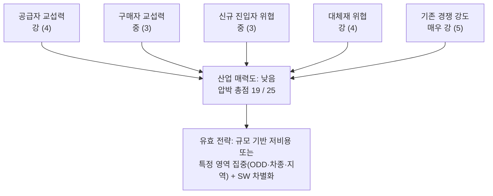

# 사례 02 — 인공지능 자율주행 중심 자동차 산업

> **📌 참고 사례입니다.** 이 저장소의 주 분석 대상은 **「콕집」** 이고, 챕터 01의 주 사례는 → **[콕집이 진입하는 산업 — 학습 보조 도구](./case-01-kokjip-lecture-review-prioritizer.md)** 입니다.
>
> 이 문서는 콕집과 무관한 산업을 분석한 **대조군**입니다. 5가지 힘이 도메인에 종속되지 않는 틀임을 확인하고, 구조가 정반대인 산업(높은 진입장벽·규모의 경제)과 대비해 콕집이 놓인 조건을 선명하게 만드는 것이 목적입니다.

분석 기준 시점: 2026년 8월 · 적용 방법론: [methodology.md](./methodology.md)

---

## 0. 분석 범위 정의

| 항목 | 내용 |
|---|---|
| 시장 정의 | 자율주행(L2+ ADAS ~ L4)을 핵심 경쟁축으로 삼는 승용차 완성차 사업 |
| 지리적 범위 | 글로벌(북미·중국·유럽 중심), 국내 완성차 관점 병기 |
| 포함 | 완성차 제조·판매, 완성차에 탑재되는 자율주행 스택(칩·SW·센서), 자율주행 기능의 구독·옵션 매출 |
| 인접 시장(대체재로 취급) | 로보택시 운영 서비스, 승차공유, 대중교통, 상용차·물류 자율주행 |
| 주요 플레이어 | 완성차(테슬라·현대차그룹·토요타·GM·폭스바겐·BYD 등 중국 EV 진영), 스택 공급자(엔비디아·모빌아이·퀄컴·중국 반도체 진영), Tier 1(보쉬·컨티넨탈·현대모비스), 로보택시 운영자(웨이모·바이두 등) |

경계에 대한 메모: 같은 대상을 **"자동차 제조업"**으로 보면 진입장벽이 높은 산업이고, **"자율주행 스택·서비스"**로 보면 제조 없이 진입 가능한 산업이다. 두 층의 힘 구조가 다르므로 아래에서는 필요할 때마다 **[제조층]**과 **[스택·서비스층]**을 구분해 표기한다. 5가지 힘 분석에서 이 구분을 생략하면 결론이 통째로 틀어진다.

---

## 1. 다섯 가지 힘 한눈에 보기

| # | 힘 | 강도 | 압박 점수 | 핵심 근거 한 줄 |
|---|---|---|---|---|
| 1 | 공급자 교섭력 | 강 | 4 | 컴퓨트(칩)와 배터리라는 두 급소를 소수 공급자가 쥐고 있고, 이들이 풀스택으로 전방 통합한다 |
| 2 | 구매자 교섭력 | 중 | 3 | 소비자 개인은 분산돼 힘이 약하지만, 자율주행 기능에 돈을 낼 의사가 낮아 실질 가격 상한을 만든다 |
| 3 | 신규 진입자 위협 | 중 | 3 | 제조 진입장벽은 여전히 매우 높으나, 스택·서비스층과 중국 진영 쪽으로 벽이 뚫렸다 |
| 4 | 대체재 위협 | 강 | 4 | 로보택시가 성공하면 '자동차 소유' 자체를 대체한다. 자기 시장의 대체재에 스스로 투자하는 구조 |
| 5 | 기존 경쟁 강도 | 매우 강 | 5 | 고정비·퇴출장벽이 동시에 높은 데다 성장 정체 + 중국발 가격 전쟁 + AI 개발비 군비 경쟁 |
| | **합계** | | **19 / 25** | **구조적 매력도: 낮음** |

---

## 2. 힘별 상세 분석

### 2-1. 공급자의 힘 — 강 (4/5)

**공급자 지도**

| 공급자 | 힘 | 이유 |
|---|---|---|
| 자율주행 컴퓨트 칩 | **매우 강** | 사실상 표준 위치를 점한 소수 벤더. 대안이 있어도 SW 스택을 재작성해야 하므로 전환비용이 막대하다 |
| 파운드리 | **매우 강** | 선단 공정을 사실상 한 회사에 의존한다 |
| 배터리 셀 | **강** | 전기차 원가의 가장 큰 단일 항목. 소수의 대형 셀 업체에 집중돼 있다 |
| 라이다·카메라 등 센서 | 중 (약화 중) | 중국 공급자 경쟁으로 단가가 빠르게 내려가면서 힘이 줄고 있다 |
| 자율주행 SW 엔지니어 | 강 | 희소 인력. 인건비가 개발비를 밀어올린다 |

**방법론의 세 조건을 그대로 대입하면**
- **원가의 대부분을 그들이 차지한다**: 전기차에서 배터리와 반도체를 합치면 원가 비중이 압도적이다. 완성차가 "우리는 조립만 한다"는 말이 나오는 이유다.
- **바꿀 때 큰 추가 비용이 든다**: 컴퓨트 플랫폼 교체는 인지·판단 SW를 다시 검증해야 하는 일이다. 차량 개발 주기 전체가 흔들린다.
- **전방 통합 위협이 이론이 아니라 현실이다**: 칩 벤더가 하드웨어에 SW·시뮬레이션·검증까지 묶은 **풀스택 턴키**를 판다. 이 경우 완성차는 차체와 브랜드만 남기고 자율주행 경쟁력을 외주하게 된다. 더 극단적으로는, 중국에서 기술 공급자의 브랜드가 완성차 브랜드보다 앞에 노출되는 사례까지 나왔다. **공급자가 고객의 브랜드 가치를 흡수하는 형태의 전방 통합**이다.

**완성차의 방어 수단**
- 자체 추론 칩 설계, 자체 차량용 OS, 배터리 내부화·이중 소싱, 수직계열화.
- 방어에는 조 단위 투자와 규모가 필요하다. 즉 **공급자 힘을 낮추는 비용 자체가 진입장벽이자 고정비 부담**으로 되돌아온다.

> 한 줄 결론: **강.** 급소가 둘(컴퓨트·배터리)이고, 둘 다 전방 통합 의지를 가진 공급자가 쥐고 있다.

### 2-2. 구매자의 힘 — 중 (3/5)

**힘이 약한 근거**
- 최종 구매자는 수천만 명의 개인이다. 방법론 기준으로 "큰 손님이 소수"인 상황의 정반대이므로 개별 교섭력은 약하다.
- 브랜드·디자인·잔존가치처럼 가격 외 구매 요인이 살아 있어 완전한 가격 경쟁은 아니다.

**힘이 강해지는 근거**
- **정보 투명성**: 실거래가, 리뷰, 스펙 비교가 완전히 공개돼 개인이 사실상 시장가로 협상한다.
- **낮은 전환비용**: 다음 차를 다른 브랜드에서 사는 데 드는 비용이 거의 없다.
- **자율주행 기능에 대한 낮은 지불 의사**: 이것이 이 힘의 핵심이다. 완성차는 자율주행에 막대한 개발비를 쓰지만, 옵션·구독 형태의 유료 채택률은 기대보다 낮은 것으로 알려져 있다. **개발비는 확정 지출이고 회수는 구매자 선택에 달려 있다.** 구매자가 "그 값은 안 낸다"고 말할 수 있는 상태는 실질적으로 강한 교섭력이다.
- **중간 구매자**: 딜러망, 렌터카·리스·플릿 사업자, 모빌리티 운영사는 대량 구매자로서 실제 협상력을 가진다. 로보택시 운영자가 차량을 대량 발주하는 구조로 가면 이 층의 힘은 더 세진다.

**전환비용이 오르는 추세**
- 차량 OS·앱 생태계, OTA 이력, 충전 네트워크, 구독 서비스가 쌓이면서 브랜드 락인이 조금씩 생기고 있다. 자율주행 성능 자체가 락인 요인이 되면 이 힘은 약해진다.

> 한 줄 결론: **중.** 개인의 힘은 약하지만 "자율주행에 돈을 안 낸다"는 집단적 선택이 가격 상한으로 작동한다.

### 2-3. 신규 진입자의 위협 — 중 (3/5)

**[제조층] 장벽은 여전히 매우 높다**

| 진입장벽 | 상태 |
|---|---|
| 규모의 경제 | **매우 강하게 작동.** 일정 생산량을 넘지 못하면 대당 원가가 맞지 않는다. 방법론의 교과서적 사례 |
| 기술·특허 | 강. 다만 EV 파워트레인은 내연기관보다 구조가 단순해 과거보다 낮아졌다 |
| 채널·브랜드 | 매우 강. 판매망과 A/S망, 잔존가치 신뢰를 새로 만드는 데 수년이 걸린다 |
| 규제·인증 | 매우 강. 안전 인증과 자율주행 관련 규제 대응은 그 자체가 비용 장벽이다 |

2010년대 후반 이후 다수의 신흥 EV 업체가 양산의 벽을 넘지 못하고 사라진 것이 이 장벽의 실증이다.

**그런데 두 방향에서 벽이 뚫렸다**
- **중국 진영**: 이미 규모의 경제와 배터리 수직계열화를 확보한 상태로 글로벌 시장에 들어온다. 신규 진입자가 규모의 경제를 *갖고* 들어오면 그 장벽은 무력화된다. 가전 기업이 짧은 기간에 프리미엄 EV 양산에 성공한 사례도 나왔다.
- **[스택·서비스층]은 자산 경량 진입이 가능하다**: 로보택시 사업자는 차를 만들지 않는다. 공장 없이 SW와 운영으로 진입해 완성차의 미래 수익 풀(이동 서비스)을 먼저 점유한다. 여기서는 규모의 경제가 아니라 **데이터·주행 마일리지·규제 승인 이력**이 새로운 진입장벽이며, 이 장벽은 선점한 쪽이 압도적으로 유리하다.
- 자본시장 접근성도 변수다. AI 서사로 대규모 조달이 가능한 국면에서는 자본 장벽이 일시적으로 낮아진다.

> 한 줄 결론: **중.** "제조로 들어오기는 어렵지만, 제조를 건너뛰고 들어올 수 있다"가 이 힘의 요약이다.

### 2-4. 대체재의 위협 — 강 (4/5)

고객의 욕구를 정확히 쓰면 "차를 소유하는 것"이 아니라 **"원할 때 A에서 B로 이동하는 것"**이다.

| 대체재 | 위협 수준 | 설명 |
|---|---|---|
| **로보택시 / 무인 승차공유** | **최상** | 마일당 비용이 자가용 보유 비용 아래로 내려가는 순간 소유의 근거가 사라진다 |
| 대중교통(특히 한국) | 상 | 고밀도 도시에서는 이미 강력한 대체재다. 방법론의 KTX 예시와 같은 층위 |
| 승차공유·구독·차량공유 | 중~상 | 소유를 이용으로 바꾼다 |
| 자전거·개인형 이동장치 | 중 | 단거리 수요를 잠식한다 |
| 원격근무·화상회의 | 중 | 이동 욕구 자체를 없앤다. 가장 눈에 안 띄는 대체재 |

**이 산업 분석에서 가장 중요한 한 문장**
> L4 자율주행이 성공하면, 그것은 자동차 산업의 신제품이 아니라 **자동차 소유의 대체재**가 된다.

완성차는 자율주행에 투자하면서 동시에 자기 시장을 대체할 기술에 투자하고 있다. 성공해도 판매 대수는 줄고(공유 차량의 높은 가동률이 필요 차량 수를 줄인다), 실패하면 개발비를 회수하지 못한다. 이 딜레마가 자율주행 시대 완성차 수익성의 본질적 압박 요인이다.

**전환비용**
- 도시 거주 1인 가구에게 로보택시 전환비용은 앱 설치가 전부다(낮음 = 위협 큼).
- 지방·다인 가구·화물 적재 수요에서는 전환비용이 높다(위협 작음). 지역별로 위협 강도가 갈린다.

> 한 줄 결론: **강.** 그리고 이 산업의 대체재는 외부에서 오는 것이 아니라 산업 스스로 개발하고 있다.

### 2-5. 산업 내 경쟁 강도 — 매우 강 (5/5)

방법론이 든 두 조건(성장 정체, 경쟁사 과다)에 자동차 산업 특유의 조건 두 개가 더 붙는다.

- **고정비가 매우 높다**: 공장 가동률을 유지해야 하므로, 수요가 꺾이면 가격을 내려서라도 물량을 밀어낸다. 고정비가 높은 산업의 가격 경쟁은 구조적이다.
- **퇴출장벽이 높다**: 고용·지역 경제·정부 지원 때문에 부실 기업도 시장에 남는다. 나가야 할 공급능력이 나가지 못해 과잉 설비가 유지되고, 경쟁 강도는 계속 높은 상태로 고정된다. **진입장벽이 높은데도 수익성이 낮은 이유가 바로 이것이다.**
- **성장 정체**: 글로벌 신차 수요는 성숙 단계다. 성장은 전기차 전환과 일부 신흥 시장에 국한된다. 정체된 파이를 나누는 싸움은 곧 점유율 싸움이고, 점유율 싸움은 가격 싸움이 된다.
- **과잉 설비 기반 가격 전쟁**: 특정 지역의 생산 능력 과잉이 수출을 통해 전 세계 가격을 끌어내린다.
- **경쟁축이 AI로 옮겨가며 군비 경쟁이 됐다**: 자율주행 개발비는 매년 확정적으로 지출되지만 회수 시점은 불확실하다. 안 쓰면 도태되고, 쓰면 마진이 깎인다. 광고·신제품 출시 경쟁이 R&D 경쟁으로 형태만 바뀐 채 이익을 갉아먹는다.

> 한 줄 결론: **매우 강.** 이 산업의 낮은 수익성을 만드는 1차 원인이다.

---

## 3. 산업 매력도 종합

**핵심 진단: 진입장벽이 높은데도 수익성이 낮다.** 장벽을 세우고 유지하는 비용(설비·R&D·퇴출 불가능성) 자체가 이익을 먹기 때문이다. 여기에 자율주행이 두 개의 압박을 새로 추가했다.

1. 컴퓨트 공급자라는 새로운 강한 공급자가 가치사슬 상단에 등장했다.
2. 로보택시라는 자기 시장의 대체재를 산업이 직접 키우고 있다.

---

## 4. 전략적 시사점

**저비용 전략** — 규모 없이는 성립하지 않는다. 이미 규모와 배터리 수직계열화를 확보한 진영이 아니라면 이 축에서 이기기 어렵다.

**차별화 전략** — 차별화의 원천이 하드웨어에서 SW로 완전히 이동했다.
- 자율주행 실주행 성능, OTA로 개선되는 경험, 차량 OS와 앱 생태계, 충전·에너지 서비스.
- 차별화가 성공하면 구매자의 전환비용이 올라가 2-2의 힘을 직접 약화시킨다. 자율주행 투자의 진짜 명분은 '기능 판매'가 아니라 **락인 형성**에서 찾아야 한다.

**집중화 전략** — 현실적으로 가장 승산이 높은 축이다.
- **ODD를 좁힌다**: 도시 전역 L4를 노리기보다 고속도로 전용, 특정 도시, 항만·산업단지 간선처럼 조건이 통제된 구간을 먼저 수익화한다.
- **차종을 좁힌다**: 상용·물류 차량은 운전 인력비 절감이라는 명확한 지불 근거가 있다. 승용차의 낮은 지불 의사 문제를 우회한다.
- **지역을 좁힌다**: 규제 승인과 데이터 축적이 장벽이 되는 시장을 선점한다.

**공급자 대응** — 컴퓨트·배터리 이중 소싱, 핵심 SW 스택의 내부 보유. 턴키 채택은 개발 속도를 사지만 차별화 근거를 파는 거래라는 점을 계산에 넣어야 한다.

**대체재 대응** — 로보택시를 막을 수 없다면 그 시장의 참여자가 된다. 자기 시장을 잠식할 주체를 자기가 되는 것이 유일한 방어다.

---

## 5. 검증이 필요한 가정과 수치

- [ ] 전기차 원가에서 배터리·반도체가 차지하는 실제 비중(최신 기준)
- [ ] 자율주행 옵션·구독의 실제 유료 채택률과 지역별 차이
- [ ] 주요 완성차의 자율주행·SW 연간 개발비와 손익 반영 방식
- [ ] 로보택시의 마일당 운영비용 추이, 자가용 총소유비용(TCO)과의 교차 시점
- [ ] 완성차 산업 ROIC 대 자본비용 비교(실제로 초과 수익이 나는지)
- [ ] 글로벌 생산 능력 과잉 규모와 가동률
- [ ] 국내 시장 특유의 조건: 대중교통 대체 강도, 자율주행 규제 진행 상황
