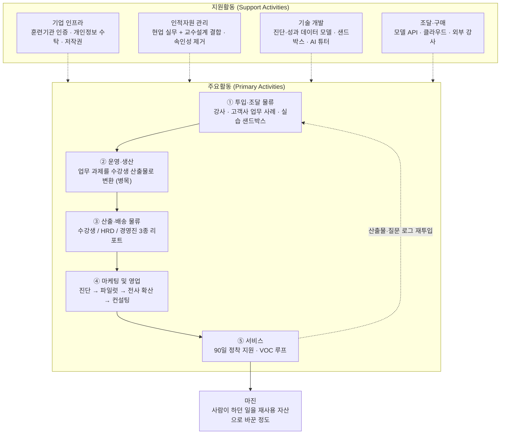

# 사례 01 — AI AX/DX 교육 사업자의 가치사슬

분석 기준 시점: 2026년 8월
- 적용 방법론: [Ch02 가치사슬 방법론](./methodology.md)
- 선행 분석: [Ch01 5가지 힘 — AX/DX 교육 산업](../01-porters-five-forces/case-01-ai-education-edtech.md) (압박 총점 23/25)

---

## 0. 분석 대상 정의

가치사슬은 산업이 아니라 **기업**의 내부 활동을 보는 도구다. 그래서 분석 대상 기업 모델을 먼저 고정한다.

| 항목 | 내용 |
|---|---|
| 분석 대상 | 특정 산업 도메인에 집중하는 국내 B2B AX/DX 교육 사업자 |
| 왜 이 모델인가 | Ch01에서 범용 교육 사업은 진입장벽 부재(5) + 무료 대체재(5)에 그대로 노출된다는 결론이 나왔다. **도메인 집중화 + 성과 증빙**만이 유효 전략이었으므로, 그 전략을 실행하는 기업의 사슬을 설계한다 |
| 사업 구성 | ① 역량 진단, ② 직무·도메인별 교육 프로젝트, ③ 구독형 학습 플랫폼, ④ 사내 AI 도입 컨설팅(업셀) |
| 주 고객 | 대기업·중견기업의 HRD 부서 및 현업 부서장 |
| 규모 가정 | 임직원 50~150명, 전속 강사 소수 + 현업 겸임 강사 네트워크 |

### Ch01 압박을 가치사슬 어디서 방어하는가

5가지 힘 분석에서 나온 압박은 조직 안의 특정 활동으로 내려와야 대응이 된다. 이 표가 두 챕터를 잇는 연결점이다.

| Ch01 압박 요인 | 점수 | 방어 담당 활동 |
|---|---|---|
| 신규 진입자 위협 | 5 | 투입·조달(도메인 강사·고객사 사례 확보), 기술개발(진단·성과 데이터 모델) |
| 구매자 교섭력 | 5 | 산출·배송(경영진 성과 리포트), 기술개발(진단 데이터 축적으로 전환비용 형성) |
| 대체재 위협 | 5 | 운영·생산(사내 데이터 실습·코칭 — 무료 콘텐츠가 못 하는 영역) |
| 공급자 교섭력 | 4 | 투입·조달(강사 이원화·복수 모델 벤더), 인적자원(속인성 제거) |
| 기존 경쟁 강도 | 4 | 마케팅·영업(레퍼런스 기반 영업으로 CAC 억제), 기술개발(재사용률로 원가 우위) |

---

## 1. 가치사슬 개요도

**읽는 법**
- **가치가 만들어지는 지점은 ②다.** 고객사의 실제 업무 과제를 수강생 산출물로 바꾸는 구간이며, 무료 강의라는 대체재가 따라올 수 없는 유일한 곳이다.
- **병목도 ②다.** 생산량이 강사 시간에 묶여 있어 매출이 늘면 인건비가 같이 늘고, 규모의 경제가 생기지 않는다.
- **③은 배송이 아니라 성과 증빙이다.** 경영진용 리포트가 다음 계약을 만들기 때문에 실질적으로 ④의 일부로 작동한다.
- **순환 고리(⑤→①)** 는 수강생 산출물과 질문 로그를 콘텐츠 개선으로 되돌린다. 후발 진입자와 격차를 만드는 유일한 축적 구조다.
- **지원활동이 이 사슬의 원가 구조를 정한다.** 특히 기술개발의 재사용 자산화 수준이 ②의 병목을 풀 수 있는지를 결정한다.

---

## 2. 주요활동(Primary Activities) 분석

### 2-1. 투입·조달 물류 (Inbound Logistics)
**이 사업에서의 실체**: 강사·콘텐츠·실습환경, 그리고 **고객사의 실제 업무 사례와 데이터**를 확보하는 활동.

**설계 🏗️**
- **핵심 투입자원 세 가지**: ① 도메인 실무 경험이 있는 강사·현업 전문가 풀, ② 고객사의 실제 업무 문서·프로세스·사례(가장 희소하고 복제 불가능한 자원), ③ 실습 샌드박스(모델 API·GPU·고객사 유사 데이터 환경).
- **고객사 데이터 확보 경로**: 방법론의 "고객 동의 기반 데이터 확보"에 대응한다. 계약 단계에서 NDA·데이터 처리 위탁 계약·마스킹 규칙을 함께 체결해, 교육 설계 전에 업무 문서 샘플을 합법적으로 받는 절차를 만든다.
- **자체 확보 vs 외부 조달 기준**: 도메인 지식·진단 체계·성과 측정 모델은 내부 자산화. 범용 기술 강의, LMS, 영상 제작은 외부 조달. 경쟁력의 원천만 안으로 가져온다.
- **강사 확보 구조**: 전속 소수(품질 기준 유지) + 현업 겸임 네트워크(도메인 최신성) 이원화. 한쪽만으로는 품질과 최신성을 동시에 못 잡는다.
- **파트너 참여 유인**: 현업 강사에게는 부수입과 개인 브랜딩, 고객사에게는 자사 사례가 사내 교육 자산으로 남는 구조.

**개선 🚀**
- **콘텐츠 최신성 관리**: 모델 세대가 바뀌면 어떤 모듈이 영향받는지 태깅해 두고 부분 갱신한다. **콘텐츠 감가상각을 통제하는 능력이 이 사업 원가 관리의 핵심**이다(Ch01 2-1의 "커리큘럼 유통기한을 공급자가 정한다"에 대한 직접 대응).
- **공급자 의존도 축소**: 모델 벤더를 복수로 병기하고, 실습 코드를 특정 API에 직접 묶지 않도록 추상화한다. 강사 개인 의존은 강의를 모듈 단위로 분해해 교체 가능성을 확보하는 방식으로 낮춘다.
- **중복 수집 제거**: 진단 데이터를 한 번 받아 교육 설계·성과 측정·후속 컨설팅 제안까지 재사용한다. 고객사에 같은 자료를 두 번 요청하는 순간 신뢰와 리드타임이 동시에 손실된다.
- **데이터 재활용 루프**: 수강생 산출물과 질문 로그를 익명화해 커리큘럼 개선, 오답 패턴 분석, AI 튜터 학습에 재투입한다. 이것이 시간이 갈수록 후발 진입자와 벌어지는 격차를 만든다.
- **최소 수집과 개인화의 균형**: 성과 측정에 필요한 최소 항목만 정의하고, 개인 식별 정보 없이 직무 단위로 집계한다.

**핵심 지표**: 상위 3인 강사 매출 의존도, 모듈 재사용률, 콘텐츠 갱신 리드타임, 고객사 사례 확보 건수, 모델 벤더별 비용 분산

### 2-2. 운영·생산 (Operations)
**이 사업에서의 실체**: 교육 시간을 파는 것이 아니라, **고객사의 업무 과제를 수강생이 실제로 해결한 산출물로 바꾸는** 생산 과정.

**설계 🏗️**
- **핵심 변환 과정**: "AI를 배웠다"가 아니라 "수강생이 자기 업무 과제 하나를 AI로 해결했다"를 산출물로 정의한다. 이 정의를 바꾸는 것만으로 무료 강의라는 대체재와 다른 제품이 된다.
- **처리 흐름 설계**: 사전 역량 진단 → 직무별 반 편성 → 과제 선정(수강생 본인 업무에서) → 사내 데이터 기반 실습 → 산출물 리뷰 → 현업 적용 코칭 → 성과 측정.
- **안전·품질 통제**: 실습 환경에서 고객사 데이터가 외부 모델로 나가지 않도록 격리, AI 산출물의 사실 오류 검증 절차, 강사 간 품질 편차 관리(공통 채점 기준).
- **수요 급증 대응**: 대규모 동시 교육 시 조교 풀, 자동 채점, AI 튜터로 확장한다. 강사 수에 선형으로 묶이면 성수기 수주를 거절해야 한다.
- **자동화와 사람의 경계**: 지식 전달·채점·질의응답은 자동, 산출물 코칭과 현업 적용 판단은 사람. 사람이 개입하는 지점이 곧 가격 근거다.

**개선 🚀**
- **측정 대상을 바꾼다**: 수강 완료율이 아니라 **현업 적용률**을 핵심 지표로 둔다. 완료율은 고객사가 돈을 낸 이유를 설명하지 못한다.
- **이탈 구간 분석**: 경험상 이탈은 '첫 실습 과제 제출' 단계에 몰린다. 과제 난이도 계단을 낮추고 예시 산출물을 먼저 보여주는 것이 가장 효과가 큰 개선이다.
- **AI 튜터 도입이 최대 마진 레버**: 1:N 코칭의 한계를 넘어야 강사 인건비의 매출 비례 구조를 깰 수 있다.
- **재작업·수동처리 축소**: 반 편성, 출결, 산출물 취합, 채점 집계의 수작업을 없앤다. 운영 인력의 시간이 마진을 직접 먹는다.
- **속도와 품질 동시 확보**: 신규 과정을 소규모 파일럿으로 먼저 검증한 뒤 전사 확산한다.

**핵심 지표**: 현업 적용률, 실습 완주율, 강사별 성과 분산, 클래스당 운영 원가, AI 튜터 처리 문의 비율, 과정 개발 리드타임

### 2-3. 산출·배송 물류 (Outbound Logistics)
**이 사업에서의 실체**: 교육 결과를 **세 종류의 수신자**에게 각각 다른 형태로 전달하는 활동. 이 활동이 재구매를 결정한다.

**설계 🏗️**
- **수신자 분리**: 수강생(개인 피드백·인증), HRD 담당자(진행률·이수 현황·예산 집행 근거), 경영진(투자 대비 성과). **경영진용 산출물이 다음 계약을 만든다**는 점에서 이 활동은 마케팅의 일부이기도 하다.
- **전달 형식**: 진단 전후 역량 비교, 산출물 포트폴리오, 직무별 역량 히트맵, 업무 시간 절감 추정치.
- **채널 구분**: 사내 협업툴 연동(일상 알림), 이메일(주간 요약), 분기 리뷰 미팅(경영진 대면). 방법론의 채널 역할 구분에 대응한다.
- **한계와 비용의 설명**: 교육으로 해결되는 것과 안 되는 것(도구 미도입, 데이터 미비, 프로세스 문제)을 명시한다. 과대 약속은 다음 분기 해지로 돌아온다.

**개선 🚀**
- **성과 리포트 자동 생성**: 수작업 리포트는 이 사업에서 마진을 가장 조용히 먹는 항목이다. 진단·산출물·설문 데이터를 템플릿에 자동 결합한다.
- **정보 우선순위**: 경영진에게는 1페이지 요약, HRD에게는 운영 상세. 같은 문서를 돌리면 양쪽 모두 안 읽는다.
- **인증 체계를 고객사 제도에 편입**: 수료 인증을 사내 직무 등급·승진 요건과 연결한다. 성공하면 **벤더 교체 비용이 처음으로 발생한다.** Ch01의 구매자 교섭력 5점을 낮추는 가장 현실적인 수단이다.
- **알림 과다 축소, 접근성 확보**: 현업이 바쁜 시간대의 푸시를 줄이고, 비개발 직군이 이해할 수 있는 언어로 리포트를 쓴다.

**핵심 지표**: 리포트 생성 소요시간, 경영진 리포트 열람률, 재계약률, 인증의 사내 제도 편입 건수

### 2-4. 마케팅 및 영업 (Marketing & Sales)
**설계 🏗️**
- **핵심 고객 판별**: HRD 부서 외에 **현업 부서장**을 별도 고객으로 세운다. 현업 예산이 더 크고 성과 지향적이므로, 가격 경쟁에서 벗어날 수 있는 구매자다.
- **사용 이유 한 문장**: "우리 업무로, 우리 데이터로, 성과가 증명되는 교육." 세 조건 중 하나라도 빠지면 무료 콘텐츠와 비교 대상이 된다.
- **확장 경로 설계**: 진단(저가·저위험 진입) → 파일럿 교육 → 전사 확산 → 사내 AI 도입 컨설팅. Ch01에서 대체재였던 컨설팅·구축을 자기 매출로 흡수하는 경로다.
- **채널 역할**: 업종 세미나·협회·레퍼런스 소개가 주력. B2B 고관여 상품에서 퍼포먼스 광고의 효율은 낮다.
- **신뢰 전달**: 보안 체계, 데이터 처리 절차, 강사 실무 이력이 곧 신뢰 자산이다.

**개선 🚀**
- **CAC와 LTV**: 레퍼런스 기반 유입으로 CAC를 억제하고, 계정 내 확산(land & expand)으로 LTV를 늘린다. 신규 계정 획득보다 기존 계정 내 두 번째 부서 확보가 항상 싸다.
- **파일럿 이후 잔존**: 파일럿에서 전사 확산으로 넘어가는 전환율이 이 사업의 생존 지표다.
- **교차 이용**: 교육 → 진단 구독 → 컨설팅의 교차율 관리.
- **이해상충 관리**: 특정 툴 벤더의 리셀러 수익과 객관적 교육 내용이 충돌할 수 있다. 제휴 관계를 고객사에 공개하는 원칙을 세운다. 방법론의 "광고·추천과 객관적 정보 제공 사이의 이해상충" 항목이 교육에서는 이 형태로 나타난다.

**핵심 지표**: 파일럿→전사 전환율, 계정당 확산 부서 수, 레퍼런스 유입 비중, CAC 회수 기간, 계정별 순매출 유지율(NRR)

### 2-5. 서비스 (Service)
**설계 🏗️**
- **사고 유형 정의**: 실습 중 고객사 데이터 유출, AI 오정보로 인한 업무 오류, 이수 요건 분쟁, 강사 품질 클레임.
- **셀프 해결 수단**: 사후 학습 자료, 사내 Q&A 채널, 검증된 프롬프트·템플릿 라이브러리.
- **자동 상담과 전문가의 구분**: 일반 사용법은 AI 조교, 도메인·규제·보안 질의는 전문가로 라우팅한다.
- **사고 대응 절차**: 데이터 사고 시 조사·통지·재발방지. 고객사 입장에서는 교육 벤더도 개인정보 처리 수탁자이므로 사고 대응 체계 유무가 벤더 선정 기준에 들어간다.
- **VOC 연결 체계**: 문의를 커리큘럼 백로그로 자동 분류한다.

**개선 🚀**
- **반복 문의를 제품에서 제거**: 같은 질문이 세 번 나오면 교재나 실습 설계를 고친다. 상담 확충으로 대응하면 원가만 늘어난다.
- **문의 전 탐지**: 실습 진도 정체, 로그인 중단, 산출물 미제출을 이탈 신호로 잡아 먼저 연락한다.
- **AI 조교의 오답 방지**: 검증된 사내 지식베이스로 응답 범위를 제한하고, 도메인 판단이 필요한 질문은 사람으로 넘긴다.
- **측정 대상**: 응답 속도가 아니라 실제 해결률과 **교육 후 90일 적용 유지율**을 본다.
- **원인 분류**: 민원을 커리큘럼·플랫폼·강사·고객사 환경 문제로 분류해 책임 소재를 명확히 한다.

**핵심 지표**: 90일 적용 유지율, 반복 문의 유형 수, 문제 해결률, 문의당 원가

---

## 3. 지원활동(Support Activities) 분석

### 3-1. 기업 인프라 (Firm Infrastructure)
**설계 🏗️**
- **법인·조직 경계**: 정부 재정지원 훈련은 훈련기관 지정·회계 요건·단가 규제가 별도로 걸린다. 민간 B2B 사업과 원가·조직을 분리해야 규제 부담이 전체 사업으로 번지지 않는다.
- **규제 대응 범위**: 훈련기관 인증 요건, 훈련생 개인정보, 고객사 데이터 수탁 처리자 지위, 교안·이미지·AI 생성물의 저작권.
- **거버넌스**: 신규 과정 출시 전 법률·개인정보·저작권·품질 검토 게이트를 둔다.

**개선 🚀**
- **성장지표와 리스크지표 충돌 기준**: 수강생 수·매출 vs 적용률·데이터 안전. 판단 기준을 사전에 문서화하지 않으면 성수기마다 품질이 밀린다.
- **B2G 의존도 상한 정책**: Ch01에서 정부는 사실상 단일 구매자였다. 매출 비중 상한을 정책으로 못박는 것이 리스크 관리다.
- **사고 대응 지휘체계**: 고객사 데이터 사고 시 통지·조사·보고 라인을 미리 정한다.

### 3-2. 인적자원 관리 (Human Resource Management)
**설계 🏗️**
- **필요 인재**: 도메인 현업 출신 강사, 교수설계자, 플랫폼·데이터 엔지니어, 성과측정 애널리스트.
- **역량 결합**: 방법론의 "도메인 전문성 + 제품 개발 역량 결합"은 여기서 **"현업 실무 경험 + 교수설계 역량 결합"**으로 구체화된다. 현업 전문가는 가르치는 법을 모르고, 교수설계자는 도메인을 모른다. 이 둘을 페어로 묶는 제도가 품질을 만든다.
- **책임 소재**: 과정별 오너를 지정해 커리큘럼·성과·수익을 함께 책임지게 한다.

**개선 🚀**
- **속인성 제거**: 강사 개인의 지식을 교안·실습·평가 문항으로 조직 자산화한다. Ch01에서 강사는 강한 공급자였고, 그 힘의 근원은 지식이 개인에게만 있다는 사실이다.
- **평가 반영 항목**: 매출과 수강생 수 외에 현업 적용률과 재계약률을 넣는다.
- **번아웃 관리**: 기업교육은 상·하반기 집중이라는 극심한 계절성이 있다. 성수기 대응 인력 계획이 없으면 품질과 인력이 동시에 무너진다.

### 3-3. 기술 개발 (Technology Development)
**설계 🏗️**
- **경쟁력을 만드는 기술 네 가지**: ① 역량 진단·성과 측정 데이터 모델, ② 고객사 데이터 안전 실습 샌드박스, ③ AI 튜터·자동 채점, ④ 콘텐츠 모듈 관리 시스템.
- **자체 vs 외부 기준**: LMS·영상 플랫폼은 외부. 진단과 성과 데이터 모델은 자체. 후자가 축적되면 경쟁자가 복제할 수 없는 유일한 자산이 된다.
- **결합도 낮추기**: 과정이 늘어날 때 시스템이 복잡해지지 않도록 콘텐츠를 모듈 단위로 관리한다.
- **기술 자산 관리**: 교안·실습 코드·평가 문항·프롬프트를 버전 관리 대상으로 다룬다.

**개선 🚀**
- **중복 제작 제거**: 과정별로 처음부터 만드는 관행이 원가의 큰 부분이다. 모듈 재사용률을 핵심 지표로 관리한다.
- **모델 세대 교체 대응**: 실습 코드와 교안이 특정 모델·API에 하드코딩되지 않도록 추상화 계층을 둔다. 공급자 교체 비용을 스스로 낮추는 작업이다.
- **생성 콘텐츠 검증**: AI로 만든 교안·문항의 사실 오류 검증 절차. 교육 콘텐츠의 오류는 신뢰를 직접 훼손한다.
- **AI 적용 범위**: 교안 초안, 자동 채점, 개인화 학습 경로, 산출물 1차 리뷰.

### 3-4. 조달·구매 (Procurement)
**설계 🏗️**
- **조달 대상**: 모델 API·GPU·클라우드, LMS/LXP, 화상·녹화 도구, 외부 강사, 실습용 데이터셋.
- **평가 기준**: 가격만이 아니라 보안(고객사 데이터를 다루는가), 가용성, 규제 준수, 데이터 학습 사용 여부.
- **협상력 확보**: 분산된 모델 API 사용량을 전사 단위로 집계해 연간 약정으로 전환한다. 부서별 개별 결제는 협상력을 스스로 버리는 일이다.
- **공급 중단 대비**: 주 모델 벤더 장애 시 대체 경로를 실습 환경에 미리 구성한다.

**개선 🚀**
- **단가 최적화**: 작업 난이도에 따라 저비용 모델로 라우팅한다. 자동 채점·요약에 최고가 모델을 쓰는 것이 대표적 낭비다.
- **종속 회피**: 단일 클라우드·단일 LMS 종속도를 점검하고 전환 계획을 문서로 갖는다.
- **계약 조항**: 데이터 반환·삭제, 학습 사용 금지, 보안 감사권, 장애 대응 SLA.
- **공급자 리스크 모니터링**: 외부 강사의 경업, 솔루션 벤더의 재무 상태를 주기적으로 점검한다.

---

## 4. 마진 구조 진단

전체 구조는 [§1 가치사슬 개요도](#1-가치사슬-개요도)를 참조한다. 여기서는 그 사슬에서 돈이 어디로 새고 어디서 남는지만 정리한다.

**가치가 새는 지점**
- 강사료가 매출에 비례해 늘어나 규모의 경제가 생기지 않는다. 이 사업의 가장 근본적인 원가 문제다.
- 수작업 성과 리포트와 운영 잡무.
- 과정별 중복 제작, 낮은 모듈 재사용률.
- 모델 세대 교체로 인한 콘텐츠 조기 폐기.

**마진이 생기는 지점**
- 모듈·평가 문항·프롬프트의 재사용.
- AI 튜터·자동 채점으로 강사 시간 대체.
- 진단·성과 데이터 축적(경쟁자 복제 불가 + 고객 전환비용 형성).
- 교육에서 컨설팅·구축으로의 업셀.

> **핵심 문장**: 이 사업의 수익성은 강의를 잘하는 정도가 아니라, **사람이 하던 일을 재사용 가능한 자산으로 바꾼 정도**로 결정된다. 서비스업을 제품업 쪽으로 얼마나 옮겼는지가 곧 마진율이다.

**활동 간 연결에서 나오는 마진**
- 투입(고객사 사례) → 운영(그 사례로 실습) → 산출(성과 증빙) → 영업(다음 부서 확산): 이 네 활동이 하나의 고리로 돌아갈 때만 도메인 집중화 전략이 작동한다. 한 군데만 끊어져도 범용 교육사와 같은 조건으로 되돌아간다.
- 서비스(질문 로그) → 투입(콘텐츠 개선): 시간이 갈수록 후발 진입자와 격차를 만드는 유일한 순환 구조다.

---

## 5. 검증이 필요한 가정

- [ ] 실제 매출원가 구조에서 강사료·콘텐츠 제작비·플랫폼 비용의 비중
- [ ] 모듈 재사용률의 현실적 상한(도메인 특화와 재사용은 상충한다)
- [ ] 현업 적용률을 고객사가 실제로 인정하는 측정 방식
- [ ] 인증이 고객사 사내 제도에 편입되는 데 걸리는 기간과 성공률
- [ ] AI 튜터가 대체할 수 있는 코칭 비율의 실측치
- [ ] 성수기 집중도(월별 매출 분포)와 그에 따른 인력 유휴 원가
