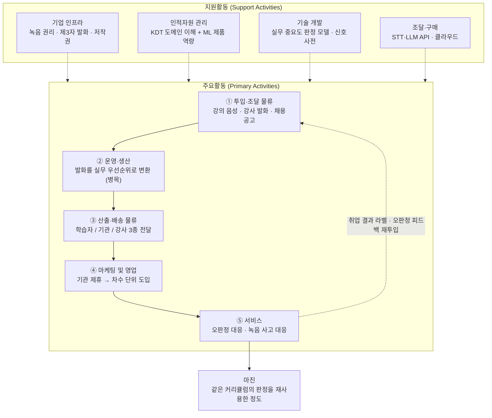

# 사례 01 — 「콕집」의 가치사슬

> **콕집** — 국비 교육·대학 강의를 녹음·태깅해, **현직자 관점의 우선순위로 복습할 것만 골라주는** 학습 앱

분석 기준 시점: 2026년 8월
- 적용 방법론: [Ch02 가치사슬 방법론](./methodology.md)
- 선행 분석: [Ch01 5가지 힘 — 학습 보조 도구 산업](../01-porters-five-forces/case-01-kokjip-lecture-review-prioritizer.md) (압박 총점 22/25) — 이하 **[1K]**
- 참고: [참고 사례 — AX/DX 교육 사업자의 가치사슬](./reference-ai-education-edtech.md) — **교육을 파는 쪽**의 사슬이며 대상이 다르다

**근거 표기** — 🟢 실측 / 🟡 유도 / 🔴 가설

---

## 0. 분석 대상 정의

가치사슬은 산업이 아니라 **기업**의 내부 활동을 보는 도구입니다. 그래서 대상 기업 모델을 먼저 고정합니다.

| 항목 | 내용 |
|---|---|
| 분석 대상 | 국비 직업훈련 학습자를 표적으로 하는 **학습 우선순위 도구 사업자**(초기 스타트업) |
| 왜 이 모델인가 | [1K]에서 저가 대량 구독은 무료 티어에 붕괴하고 **집중화 + 차별화**만 유효 전략으로 남았다. 그 전략을 실행하는 조직의 사슬을 설계한다 |
| 사업 구성 | ① 강의 녹음·태깅(무료), ② 실무 기준 우선순위 복습(유료 핵심), ③ 커리큘럼 연동 리마인드, ④ 포트폴리오 소재 도출·채용 연계(확장) |
| 주 사용자 / 주 지불자 | **사용자 = 국비 부트캠프 수강생 / 지불자 = 훈련기관** — 둘이 분리된다는 것이 이 사슬의 지배 조건 |
| 규모 가정 | 10~20명. 제품·ML 중심, 영업은 기관 대상 소수 정예 🔴 |

### [1K]의 압박을 가치사슬 어디서 방어하는가

5가지 힘에서 나온 압박은 조직 안의 특정 활동으로 내려와야 대응이 됩니다. 이 표가 두 챕터를 잇는 연결점입니다.

| [1K] 압박 요인 | 점수 | 방어 담당 활동 |
|---|---|---|
| 구매자 교섭력 | 5 | 산출·배송(기관용 취업률 방어 리포트 — 재계약을 만드는 산출물), 마케팅·영업(지불 주체를 기관으로 이동) |
| 신규 진입자 위협 | 5 | 기술개발(실무 중요도 판정 모델), 투입·조달(취업 결과 라벨 적립 — **유일하게 복제 불가한 자산**) |
| 대체재 위협 | 5 | 운영·생산(강의 중 태깅으로 "안 하기"를 이김), 산출·배송(행동을 일으키는 전달 설계) |
| 공급자 교섭력 | 4 | 투입·조달(강사 opt-in 절차 표준화), 조달·구매(모델 추상화 계층), 기업 인프라(녹음 권리·저작권) |
| 기존 경쟁 강도 | 3 | 마케팅·영업(기관 채널 선점 — 유효기간이 있는 기회) |

---

## 1. 가치사슬 개요도

**읽는 법**

- **가치가 만들어지는 지점은 ②입니다.** 녹음·전사·요약은 무료 대체재가 이미 덮었으므로([1K] 2-4), 유료의 근거는 **"이 세그먼트가 실무에서 중요한가"를 판정하는 구간** 하나뿐입니다.
- **병목도 ②입니다.** 단 병목의 성격이 둘로 갈립니다 — **품질 병목**은 판정 근거의 신뢰도이고, **원가 병목**은 사용량에 비례하는 추론 비용입니다. 전자는 제품의 존폐를, 후자는 마진율을 결정합니다.
- **③은 배송이 아니라 두 개의 다른 설득입니다.** 학습자에게는 "지금 이것부터 보라"는 행동 유발이고, 기관에게는 "우리가 취업률을 방어했다"는 성과 증빙입니다. 후자가 다음 계약을 만들므로 실질적으로 ④의 일부로 작동합니다.
- **순환 고리(⑤→①)가 이 사업의 유일한 축적 구조입니다.** 취업 결과 라벨이 쌓이면 강사 발화 신호의 가중치를 교정할 수 있고, 이것은 **경쟁자가 살 수도 만들 수도 없는 자산**입니다 — 그들의 사용자는 취업 결과와 연결되지 않기 때문입니다.
- **지원활동 중 기업 인프라가 이례적으로 무겁습니다.** 다른 SaaS와 달리 **원재료 자체가 타인의 저작물이자 제3자의 음성**이라, 법적 설계가 비용 센터가 아니라 **사업 가능 여부의 전제**입니다.

---

## 2. 주요활동(Primary Activities) 분석

### 2-1. 투입·조달 물류 (Inbound Logistics)
**이 사업에서의 실체**: 강의 음성과 그 안의 **강사 발화**, 그리고 실무 중요도를 판정할 **외부 기준 데이터**를 합법적으로 확보하는 활동.

**설계 🏗️**
- **핵심 투입자원 네 가지**: ① 강의 음성(학습자 단말에서 발생), ② **강사 발화**(판정의 1차 신호), ③ 채용공고의 기술 수요(근거 표시용), ④ **취업 결과 라벨**(지금은 적립만, 9~12개월 뒤 가중치 교정용).
- **왜 강사 발화인가**: 판정 근거 후보 4개를 비교한 결과입니다 — 현직자 커뮤니티·기술 문서는 **LLM이 이미 사전학습으로 보유**해 증분 가치가 없고 ToS·저작권 위험만 남으며, 취업 성공자 이력은 최고의 자산이지만 **지금 제품을 만들 수 없습니다.** 강사 발화만 **「즉시 + 고해상도 + 수집 비용 0」** 을 동시에 만족합니다 🟢 → [판정 근거 비교](../04-tam-sam-som-market-segment-map/deep-research/kokjip-research.md#4-1-판정-근거-후보-4개의-비교)
- **동의 확보 경로 — 이 사슬의 최대 제약**: 방법론의 "고객 동의가 필요한 데이터를 어떤 경로로 확보할 것인가"가 여기서는 **강사 동의**로 나타납니다. 세계 표준은 **기관 계약 + 강사 개별 opt-in**이며, 기관 계약이 동의를 일괄 처리해주지는 **않습니다** 🟢. UCL은 거부에 이유가 필요 없다고 명시합니다. 따라서 기관 계약은 동의를 **면제**하는 것이 아니라 **표준화**하는 장치로 설계합니다 — 차수 시작 시 표준 동의서를 받는 절차로 바꾸면 매번 학습자가 부탁하는 대화가 사라집니다.
- **강사가 참여할 유인**: 녹화물의 **IP·실연권을 강사에게 남기고**(UMass·Aberdeen 방식 🟢), **이유 없는 거부권을 명시**합니다. 거부 가능성을 보장하는 쪽이 도입 저항이 낮습니다.
- **제3자 음성 처리**: Q&A에 섞이는 다른 수강생의 음성은 약관으로 방어되지 않습니다 — 제3자는 약관의 당사자가 아니기 때문입니다. **비강사 발화 미저장** 또는 강사 발화만 전사하도록 화자 분리를 투입 단계에 둡니다.
- **자체 확보 vs 외부 조달**: 판정 모델과 **KDT 도메인 신호 사전**은 내부 자산화. STT 엔진, 채용공고 수집, 인프라는 외부 조달. 경쟁력의 원천만 안으로 가져옵니다.

**개선 🚀**
- **취업 결과 라벨의 회수 권리를 첫 계약에 넣습니다.** 나중에 추가하려면 이미 체결한 기관 계약을 다시 열어야 합니다. 차수당 라벨이 **13명**(수강생 25명 × 취업률 54.2%) 🟡 뿐이라 통계적 유의성까지 2~3년이 걸리므로, **첫날부터 모으지 않으면 벽은 영영 세워지지 않습니다.**
- **공급자 의존도 축소**: STT·LLM을 특정 벤더에 하드코딩하지 않고 추상화합니다([1K] 공급자 교섭력 4점에 대한 직접 대응).
- **중복 수집 제거**: 같은 커리큘럼을 도는 다른 차수·다른 기관의 강의를 **매번 처음부터 처리하지 않습니다.** KDT 과정은 표준 커리큘럼을 공유하므로 과정 단위로 판정 결과를 캐싱할 수 있고, 이것이 §4의 마진 구조를 지배합니다.
- **신호가 안 나올 때의 대체 경로**: 강사 발화의 실무 중요도 신호가 시간당 0.2회 수준이면 ④ 단독으로 성립하지 않으므로 채용공고의 비중을 올려야 합니다 🔴. **이 분기를 미리 설계에 넣어둡니다.**

**핵심 지표**: 강사 동의율, 시간당 실무 신호 발생 횟수, 과정 단위 판정 재사용률, 취업 결과 라벨 누적 건수, 화자 분리 정확도

### 2-2. 운영·생산 (Operations)
**이 사업에서의 실체**: 녹음 파일을 파는 것이 아니라, **강의 발화를 「지금 이것부터 복습하라」는 순서로 변환하는** 생산 과정.

**설계 🏗️**
- **핵심 변환 과정**: 음성 → 전사 → 강의 세그먼트 분할 → **실무 중요도 판정** → 학습자 상황(진도·잔여 시간) 반영 → 우선순위 목록. 이 중 **판정만이 유료의 근거**이고 나머지는 전부 무료 대체재가 이미 합니다.
- **판정 신호의 정의**: *"이건 실무에서 안 씁니다"* · *"이건 면접에서 물어봅니다"* 같은 강사 발화가 그대로 현직자 판정 신호이며, 타임스탬프가 붙어 세그먼트 우선순위로 직접 환산됩니다 🟢.
- **처리 흐름**: 강의 중 실시간 태깅(AI + 사용자) → 강의 종료 시 요약 + 우선순위 → 커리큘럼 연동 리마인드 → 복습 완료 기록.
- **자동화와 사람의 경계**: 전사·요약·1차 판정은 자동, **우선순위의 최종 수용 여부는 학습자**가 정합니다. 판정을 강제하지 않고 근거를 함께 보여주는 이유는 오판정의 책임 구조 때문이기도 합니다.
- **품질 통제**: 판정 근거를 항상 함께 표시합니다 — "강사가 이 부분을 3회 강조", "채용공고 N건이 이 기술을 요구". 근거 없는 우선순위는 학습자가 신뢰하지 않고, 기관에도 설명할 수 없습니다.
- **수요 급증 대응**: 국비 차수는 **동시에 시작해 동시에 끝납니다.** 개강일·시험 전 주에 부하가 몰리는 계절성이 구조적이므로 배치 처리와 큐를 전제로 설계합니다.

**개선 🚀**
- **측정 대상을 바꿉니다**: 녹음 시간이나 요약 생성 수가 아니라 **「추천한 것을 실제로 복습한 비율」**을 핵심 지표로 둡니다. [1K] 2-4의 최대 대체재가 "그냥 안 하기"였으므로, 행동이 일어나지 않으면 판정 품질은 의미가 없습니다.
- **원가 병목의 해체**: 전사와 판정에 같은 등급의 모델을 쓰는 것이 대표적 낭비입니다. 단순 전사는 저가 모델로, 판정 추론만 고급 모델로 라우팅합니다. **매출이 늘면 추론비가 같이 느는 구조를 깨는 것이 최대 마진 레버**입니다.
- **이탈 구간**: 이탈은 '첫 강의 녹음 시작' 앞에 몰릴 것으로 봅니다 🔴 — 강사에게 동의를 구해야 한다는 심리적 장벽이 여기 있습니다. 기관 표준 동의서가 이 구간을 없애는 장치입니다.
- **오판정의 축적**: 학습자가 "이건 안 중요한데"라고 표시한 건을 판정 모델 개선에 되돌립니다.

**핵심 지표**: 추천 복습 실행률, 판정 수용률(오판정 신고 비율), 세션당 추론 원가, 처리 지연 시간, 강의 1시간당 유효 우선순위 항목 수

### 2-3. 산출·배송 물류 (Outbound Logistics)
**이 사업에서의 실체**: 같은 분석 결과를 **세 종류의 수신자**에게 각각 다른 형태로 전달하는 활동. 이 활동이 재계약을 결정합니다.

**설계 🏗️**
- **수신자 분리**: 학습자(오늘 볼 것 3개 + 근거), **훈련기관**(차수별 복습 참여율·취업 준비 상태), 강사(내 강의에서 학습자가 어디서 막혔는가).
- **기관용 산출물이 이 사업의 계약을 만듭니다**: KDT 취업률이 62.6% → **54.2%** 로 2년간 8.4%p 하락했고 🟢 훈련기관은 그 성과로 지정·평가받습니다. 기관에게 필요한 것은 앱 사용 통계가 아니라 **"이 도구를 도입해서 무엇이 나아졌는가"** 입니다.
- **에듀테크 시장이 성과 입증 단계에 들어섰습니다** 🟢. 기능 소개서로는 기관 계약이 나오지 않으므로, 성과 리포트를 **판매 자료가 아니라 제품의 일부**로 만듭니다.
- **행동을 일으키는 전달**: 학습자에게는 목록이 아니라 **"지금 15분, 이것"** 형태로 좁혀 보냅니다. 선택지가 많으면 "안 하기"로 되돌아갑니다.
- **한계의 설명**: 판정이 강사 발화에 의존하므로 **강사가 언급하지 않은 중요 개념은 놓칠 수 있다**는 점을 명시합니다. 채용공고 레이어가 이 누락을 보완하는 장치입니다.

**개선 🚀**
- **기관 리포트 자동 생성**: 수작업 리포트는 초기 조직에서 마진을 가장 조용히 먹습니다. 차수 단위로 자동 생성합니다.
- **알림 과다 축소**: 국비 수강생은 하루 8시간 수업 중입니다. 수업 시간 푸시는 오히려 이탈을 만듭니다.
- **전환비용을 여기서 처음 만듭니다**: 복습 이력과 포트폴리오 소재가 학습자에게 **누적 자산**으로 남으면, 강의가 끝나도 계정을 유지할 이유가 생깁니다. [1K] 2-2가 지적한 "강의가 끝나면 사용 이유가 소멸"하는 구조에 대한 유일한 대응입니다.

**핵심 지표**: 기관 리포트 열람률, 차수 재계약률, 학습자 D+7 잔존율, 과정 종료 후 30일 잔존율, 리포트 생성 소요시간

### 2-4. 마케팅 및 영업 (Marketing & Sales)
**설계 🏗️**
- **핵심 고객 판별**: 사용자는 학습자지만 **구매 결정자는 훈련기관 운영자**입니다. 기관은 **178곳** 🟢 뿐이라 계정 단위 영업이 가능한 규모이고, 이는 소수라서 불리한 조건이자 **전수 접촉이 가능하다**는 유리한 조건이기도 합니다.
- **사용 이유 한 문장**: 기관에게는 *"수료생 취업률을 방어하는 도구"*, 학습자에게는 *"뭐부터 봐야 할지 정해준다"*. 같은 제품이지만 파는 문장이 다릅니다.
- **확장 경로**: 무료 개인 사용 → 기관 파일럿(1개 차수) → 기관 전 차수 → 채용 연계. 차수가 6개월 단위로 끝나므로 **파일럿의 결과가 나오는 주기도 6개월**이라는 점이 영업 사이클을 지배합니다.
- **채널 역할**: 기관 제휴·국비 강사 채널이 주력, 에브리타임(MAU **289만** 🟡)은 개인 유입, HRD는 보류.

**개선 🚀**
- **CAC와 LTV**: 기관 1곳이 연 **211명** 🟡 을 태우므로 계정 단위 획득 효율이 개인 획득보다 압도적으로 높습니다. 다만 계약 사이클이 길어 초기 현금흐름은 개인 쪽에서 나옵니다.
- **무료 기간 이후 잔존**: 이 제품의 무료→유료 전환은 통상 SaaS보다 어렵습니다. 무료 대체재가 이미 있는 데다 **사용 기간 자체가 6개월로 끝나기** 때문입니다.
- **이해상충 관리**: 채용 연계를 붙이는 순간 **우선순위 판정의 중립성이 수익원과 충돌**합니다. 매칭 파트너와의 관계를 학습자에게 공개하는 원칙을 미리 세웁니다.

**핵심 지표**: 기관 파일럿→전 차수 전환율, 기관당 활성 학습자 비율, 개인 유료 전환율, 강사 추천 유입 비중, CAC 회수 기간

### 2-5. 서비스 (Service)
**설계 🏗️**
- **사고 유형 정의**: ① **오판정**(중요한 것을 안 중요하다고 표시), ② 녹음 관련 분쟁(강사·다른 수강생), ③ 개인정보·음성 데이터 사고, ④ 전사 오류.
- **오판정이 가장 중요한 사고 유형입니다.** 이 제품은 학습자의 **시간 배분을 대신 결정**하므로, 틀린 우선순위는 단순 불편이 아니라 **시험·취업 결과에 직접 손해**를 입힙니다. 따라서 판정은 항상 근거와 함께 제시하고 학습자가 뒤집을 수 있게 둡니다.
- **데이터 봉쇄를 서비스 약속으로 만듭니다**: **음성 전사 후 즉시 폐기 · AI 학습 미사용 · 반출 기능 부재**를 명시합니다. 티로가 이것을 엔터프라이즈 판매 근거로 전면에 쓰고 있고 🟢, 다글로 수준(품질 개선 목적 수집 + AssemblyAI·OpenAI 등 외부 전송 🟢)으로는 기관 법무를 통과하기 어렵습니다.
- **사고 대응 절차**: 제3자 음성 관련 이의가 들어오면 즉시 해당 구간 삭제. Otter.ai는 2025년 8월 이후 관련 집단소송 4건이 병합됐고 🟢, 쟁점은 **비사용자의 대화를 녹음·전사했다**는 것입니다. 우리 맥락에서는 Q&A에 섞이는 다른 수강생의 음성이 정확히 같은 구조입니다.

**개선 🚀**
- **문의 전 탐지**: 녹음 중단, 복습 미실행, 앱 미실행을 이탈 신호로 잡아 먼저 접촉합니다.
- **반복 문의를 제품에서 제거**: "왜 이게 우선순위인가"라는 문의가 반복되면 상담이 아니라 **근거 표시 UI**를 고칩니다.
- **VOC를 판정 모델로 되돌립니다**: 오판정 신고가 §2-1의 순환 고리에 들어가는 두 번째 입력입니다.
- **측정 대상**: 응답 속도가 아니라 **오판정 재발률**과 **과정 종료 후 30일 잔존율**을 봅니다.

**핵심 지표**: 오판정 신고율·재발률, 녹음 관련 이의 건수, 음성 데이터 사고 0건 유지, 문제 해결률

---

## 3. 지원활동(Support Activities) 분석

### 3-1. 기업 인프라 (Firm Infrastructure)
**설계 🏗️**
- **이 사업에서는 법적 설계가 전제 조건입니다.** 원재료가 **타인의 저작물(강의)이자 제3자의 음성**이므로, 다른 SaaS라면 나중에 붙이는 항목이 여기서는 제품 출시 전에 확정돼야 합니다.
- **미해결 쟁점 하나**: 국내 대학 안내가 서로 갈립니다 — 한쪽은 *"교수 동의 없는 녹음은 복제권 침해"*, 다른 쪽은 *"저작권법 제30조 사적이용이므로 학습 목적 개인 녹음은 가능"* 🟢. 공통되는 것은 **배포·거래는 명확히 침해**이고 **영리 목적이 개입되면 사적이용 예외가 흔들린다**는 것입니다. **유료 서비스가 그 파일을 서버에서 처리하는 행위**는 학습자 개인의 녹음과 별개 주체의 별개 복제이므로 여기에 걸립니다 🔴 — **변호사 확인 항목이며 첫 기관 계약 전 필수**입니다.
- **거버넌스**: 신규 기능 출시 전 개인정보·저작권 검토 게이트. 특히 음성 데이터 처리 경로 변경은 반드시 통과시킵니다.
- **채용 연계의 별도 요건**: 직업소개 관련 법적 요건이 학습 앱과 완전히 다릅니다 🔴. 사업화 전 확인 대상입니다.

**개선 🚀**
- **성장지표와 리스크지표의 충돌 기준**: 사용자 수 vs 음성 데이터 최소 보유. 판단 기준을 미리 문서화하지 않으면 성장 압력이 올 때마다 데이터 정책이 밀립니다.
- **기관 의존도 상한**: 178곳이라는 소수 구매자 구조에서 상위 몇 곳에 매출이 집중되면 가격 결정권을 넘기게 됩니다.

### 3-2. 인적자원 관리 (Human Resource Management)
**설계 🏗️**
- **필요 인재**: ML 엔지니어(음성·NLP), 제품 엔지니어, **KDT 도메인을 아는 사람**, 기관 영업, 개인정보·법무 자문.
- **역량 결합**: 방법론의 "도메인 전문성과 제품 개발 역량 결합"은 여기서 **"실무 현직 감각 + ML 제품 역량"** 으로 구체화됩니다. 무엇이 실무에서 중요한지 아는 사람이 없으면 **판정 모델의 정답을 정의할 수 없습니다.** 이 사업에서 도메인 인력은 지원 인력이 아니라 **핵심 생산 설비**입니다.
- **책임 소재**: 판정 품질의 최종 책임자를 명시합니다. 오판정은 여러 활동에 걸쳐 있어 주인이 없으면 방치됩니다.

**개선 🚀**
- **속인성 제거**: 도메인 담당자의 판단을 **신호 사전과 라벨링 기준 문서**로 조직 자산화합니다. 그 사람이 나가면 판정 기준이 사라지는 구조를 피합니다.
- **평가 반영 항목**: 사용자 수 외에 **추천 복습 실행률**과 오판정률을 넣습니다.

### 3-3. 기술 개발 (Technology Development)
**설계 🏗️**
- **경쟁력을 만드는 기술 네 가지**: ① **실무 중요도 판정 모델**, ② **KDT 도메인 신호 사전**(강사 발화에서 중요도 신호를 뽑는 규칙), ③ 화자 분리(제3자 발화 배제), ④ 과정 단위 판정 캐시.
- **자체 vs 외부 기준**: STT 엔진·인프라는 외부. **판정 모델과 신호 사전은 자체.** 후자가 축적되면 경쟁자가 복제할 수 없는 유일한 자산이 됩니다.
- **다글로도 원리상 강사 발화를 쓸 수 있습니다**(녹음을 갖고 있으므로). 격차는 세 가지에서 생깁니다 — ㉠ 대학생 일반 강의를 겨냥해 **「실무 중요도」 축 자체가 없고**, ㉡ 발화에서 신호를 뽑으려면 **KDT 도메인에 특화된 신호 사전**이 필요하며, ㉢ 무엇보다 **취업 결과 라벨을 만들 수 없습니다** 🟢.
- **기술 자산 관리**: 판정 프롬프트·신호 사전·라벨링 기준을 코드와 동일하게 버전 관리합니다. 판정 기준이 바뀌면 과거 결과의 해석도 바뀌기 때문입니다.

**개선 🚀**
- **모델 세대 교체 대응**: 판정 로직이 특정 모델의 특성에 묶이지 않도록 추상화하고, 모델 교체 시 **판정 결과 회귀 테스트**를 돌립니다.
- **추론 단가 최적화**: 작업 난이도에 따라 모델을 라우팅합니다(§2-2).
- **판정의 검증 체계**: 생성 결과의 오류 검증이 여기서는 **"판정이 실제 실무 중요도와 일치하는가"** 의 형태입니다. 취업 결과 라벨이 쌓이기 전까지는 현직자 표본 검토로 대체합니다 🔴.

### 3-4. 조달·구매 (Procurement)
**설계 🏗️**
- **조달 대상**: STT API, LLM API, 클라우드·스토리지, 채용공고 데이터.
- **평가 기준**: 가격만이 아니라 **데이터 학습 사용 여부**와 리전. 기관 판매를 하려면 "고객 데이터를 모델 학습에 쓰지 않는다"를 계약으로 확보해야 합니다 — 티로가 이것을 판매 근거로 씁니다 🟢.
- **협상력 확보**: 사용량이 차수에 몰려 있으므로 예측 가능한 피크를 근거로 약정 단가를 협상합니다.
- **공급 중단 대비**: 주 STT 벤더 장애 시 대체 경로. 강의는 **다시 열리지 않으므로** 녹음 실패는 복구 불가능한 손실입니다.

**개선 🚀**
- **단가 최적화**: 전사·요약·판정의 등급 분리(§2-2).
- **종속 회피**: 단일 모델 벤더 종속도를 점검하고 전환 계획을 문서로 갖습니다([1K] 공급자 4점).
- **계약 조항**: 데이터 반환·삭제, **학습 사용 금지**, 보안 감사권.

---

## 4. 마진 구조 진단

전체 구조는 [§1 가치사슬 개요도](#1-가치사슬-개요도)를 참조합니다. 여기서는 돈이 어디로 새고 어디서 남는지만 정리합니다.

**가치가 새는 지점**
- **추론 원가가 사용량에 비례합니다.** 매출이 늘면 원가가 같이 늘어 규모의 경제가 생기지 않습니다. 참고 사례의 강사 인건비와 **구조가 동일**합니다 — 서비스업의 근본 문제가 형태만 바꿔 반복됩니다.
- 같은 커리큘럼을 매 차수·매 기관마다 처음부터 처리하는 중복 연산.
- 수작업 기관 리포트.
- **강사 동의 확보에 드는 반복 협상 비용** — 절차화되지 않으면 계정마다 다시 발생합니다.

**마진이 생기는 지점**
- **과정 단위 판정 재사용.** KDT는 표준 커리큘럼을 공유하므로, 한 차수에서 만든 판정을 다른 기관·다음 차수에 재사용할 수 있습니다. **기관이 늘수록 한 건당 판정 원가가 떨어지는 유일한 구조**입니다.
- 전사·판정의 모델 등급 분리.
- 기관 라이선스(연 1,000만 원 🔴)는 개인 구독(연 6만 원 🔴)보다 계정당 획득 효율이 압도적으로 높습니다.
- 취업 결과 라벨의 축적 — 원가를 낮추지는 않지만 **경쟁자가 복제할 수 없는 자산**이라 가격 방어력을 만듭니다.

> **핵심 문장**: 이 사업의 수익성은 판정을 잘하는 정도가 아니라, **한 번 만든 판정을 몇 명이 다시 쓰는가**로 결정됩니다. 커리큘럼이 표준화된 국비 교육을 표적으로 삼은 것은 시장 크기 때문만이 아니라 **재사용 가능성 때문에도** 옳은 선택입니다.

**활동 간 연결에서 나오는 마진**
- **투입(강사 발화) → 운영(판정) → 산출(기관 성과 리포트) → 영업(다음 차수 계약)**: 이 네 활동이 한 고리로 돌 때만 집중화 전략이 작동합니다. 기관 리포트가 끊기면 **범용 녹음 앱과 같은 조건**으로 되돌아갑니다.
- **서비스(취업 결과·오판정) → 투입(가중치 교정)**: 시간이 갈수록 후발 진입자와 벌어지는 유일한 순환 구조입니다. 다만 **첫 라벨까지 9~12개월**이 걸리므로, 이 고리는 **지금 돌리기 시작해야 나중에 존재합니다.**

---

## 5. 검증이 필요한 가정

- [ ] 강의 1시간당 실무 중요도 신호가 몇 회 발생하는가 (판정 모델 성립의 전제) 🔴
- [ ] 강사 opt-in 절차를 표준화했을 때의 실제 동의율 🔴
- [ ] 과정 단위 판정 재사용률의 현실적 상한 — 같은 KDT 과정이라도 강사가 다르면 발화가 다르다 🔴
- [ ] 학습자 1인·1개월당 실제 추론 원가 🔴
- [ ] 훈련기관이 성과 리포트를 재계약 근거로 실제 인정하는가 🔴
- [ ] 유료 서비스의 강의 녹음물 서버 처리가 사적이용 예외를 벗어나는가 (변호사) 🔴
- [ ] 과정 종료 후 학습자 잔존율 — 전환비용 설계의 유효성 🔴

**첫 두 항목이 이 사슬의 존폐를 가릅니다.** 신호가 나오지 않거나 강사가 동의하지 않으면 ②의 투입이 사라지고, 그러면 나머지 활동은 전부 무료 대체재와 같은 제품이 됩니다.
