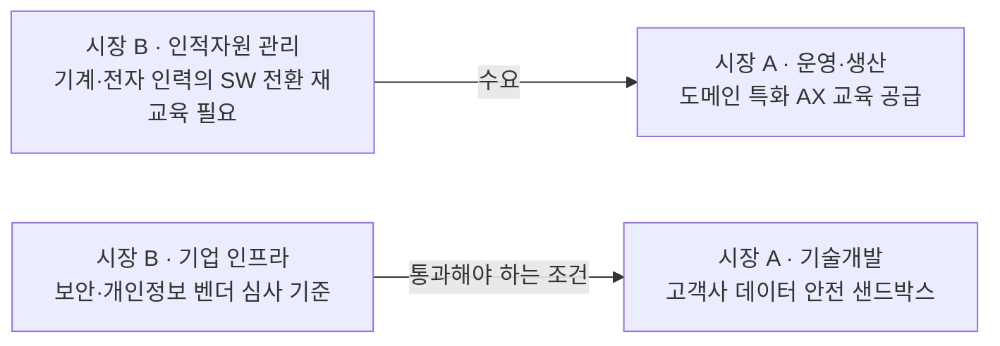

# 비교 분석 — AX/DX 교육 사업자 vs 자율주행 완성차 기업의 가치사슬

분석 기준 시점: 2026년 8월
- 시장 A: [AX/DX 교육 사업자의 가치사슬](./case-01-ai-education-edtech.md)
- 시장 B: [자율주행 완성차 기업의 가치사슬](./case-02-autonomous-driving-automotive.md)
- 선행 비교: [Ch01 5가지 힘 비교](../01-porters-five-forces/comparison-edtech-vs-automotive.md)

---

## 1. 분석 대상 비교

| 항목 | 시장 A · AX/DX 교육 사업자 | 시장 B · 자율주행 완성차 |
|---|---|---|
| 조직 규모 | 임직원 50~150명 | 수만 명 |
| 자산 성격 | 자산 경량(사람·콘텐츠) | 자산 중량(공장·설비·개발조직) |
| 사슬의 길이 | 짧고 얇다 | 길고 두껍다 |
| 사슬의 겹 | 한 겹(서비스 전달) | **두 겹(물리 사슬 + 데이터 사슬)** |
| 사슬의 회전 주기 | 프로젝트 단위 수 주~수 개월 | 차량 개발 수 년 / OTA 수 주 |
| Ch01 전략 결론 | 도메인 집중화 + 성과 증빙 | ODD·차종 집중화 + SW 차별화 |

---

## 2. 주요활동 나란히 보기

| 활동 | 시장 A에서의 실체 | 시장 B에서의 실체 | 결정적 차이 |
|---|---|---|---|
| **투입·조달** | 강사·고객사 업무 사례·실습 샌드박스 | 반도체·배터리·센서 + 주행 데이터 | A는 사람과 지식, B는 물성과 데이터. **둘 다 "데이터가 새 원재료"라는 점은 동일** |
| **운영·생산** | 업무 과제를 수강생 산출물로 변환 | 부품을 차량으로 + 데이터를 검증된 모델로 | A의 병목은 강사 시간, B의 병목은 **검증** |
| **산출·배송** | 수강생·HRD·경영진 3종 리포트 | 차량 인도 + OTA 기능 전달 | 둘 다 "전달이 곧 다음 매출". A는 성과 증빙이, B는 OTA가 전환비용을 만든다 |
| **마케팅·영업** | 진단→파일럿→전사→컨설팅 | 판매→구독→플릿 서비스 | A는 계정 내 확산, B는 차량 1대의 수익 확장. 방향은 같고 축이 다르다 |
| **서비스** | 90일 정착 지원·VOC 루프 | 예측 정비·OTA 리콜·사고 대응 | B에서는 서비스가 **원가 절감 수단**(OTA 리콜), A에서는 **재구매 근거**(적용 유지율) |

## 3. 지원활동 나란히 보기

| 활동 | 시장 A | 시장 B | 비교 |
|---|---|---|---|
| **기업 인프라** | 훈련기관 인증, 개인정보 수탁, 저작권 | 안전 인증(ISO 26262·SOTIF), UN R155/156/157, 리콜 권한 | 둘 다 규제가 활동을 규정한다. B는 규제 대응 역량 자체가 **진입장벽**(Ch01 신규 진입자 방어) |
| **인적자원** | 도메인 실무 + 교수설계 결합 | 차량공학 + SW 개발 결합 | 같은 문제의 다른 판본: **서로 다른 주기로 일하는 두 직군을 한 팀으로 만드는 것** |
| **기술 개발** | 진단·성과 데이터 모델, 샌드박스, AI 튜터 | 차량 OS, 인지 모델, 검증 툴체인 | 둘 다 **재사용률**이 마진의 결정 변수. A는 모듈 재사용, B는 플랫폼 재사용 |
| **조달·구매** | 모델 API·클라우드·외부 강사 | 반도체·배터리·학습 컴퓨트 | 둘 다 종속 회피와 단가의 상충. B는 이중 소싱의 대가로 단가 상승을 감수 |

---

## 4. 가장 중요한 차이 — 마진 레버가 서로 정반대 방향이다

Ch01에서 두 산업은 "저수익의 원인이 정반대"였다. 가치사슬로 내려오면 그 대비가 **개선 방향의 정반대**로 다시 나타난다.

| | 시장 A | 시장 B |
|---|---|---|
| 현재 사업의 성격 | 서비스업(사람이 매출을 만든다) | 제조업(제품이 매출을 만든다) |
| 마진을 늘리는 방향 | **서비스업 → 제품업** | **제품업 → 서비스업** |
| 구체적으로 | 강사가 하던 일을 모듈·AI 튜터·자동 리포트로 자산화 | 팔고 끝나던 차량을 OTA·구독·플릿 서비스로 연장 |
| 원가 성격 | 인건비(변동비) — 규모의 경제가 생기지 않는다 | 고정비 — 규모의 경제가 지배한다 |
| 그래서 필요한 것 | 매출과 인건비의 연결을 끊는 것 | 판매 시점 이후의 매출을 만드는 것 |
| 실패 시 결과 | 매출이 늘어도 마진이 그대로 | 가동률이 떨어지는 순간 적자 |

> **A는 사람이 하던 일을 제품으로 바꿔야 하고, B는 제품 팔고 끝나던 것을 서비스로 바꿔야 한다.** 두 기업이 서로를 향해 걸어가는 중이며, 만나는 지점이 "재사용 가능한 자산 + 판매 후 반복 매출"이라는 같은 형태다.

---

## 5. 병목과 최중요 활동

| 구분 | 시장 A | 시장 B |
|---|---|---|
| 병목 활동 | 운영·생산 (강사 시간에 생산량이 묶인다) | 운영·생산 중 **검증** (안전 검증이 배포 속도를 정한다) |
| 병목을 푸는 수단 | AI 튜터·자동 채점으로 사람 시간 대체 | 시뮬레이션 비중 확대로 실도로 검증 대체 |
| 가장 중요한 지원활동 | 기술개발(재사용 자산) + 인적자원(속인성 제거) | 기술개발(플랫폼·검증) + **기업 인프라(안전 거버넌스)** |
| 지원활동이 결정하는 것 | 강사 없이도 품질이 유지되는가 | 일정과 안전이 충돌할 때 무엇이 이기는가 |
| 무너지는 경로 | 스타 강사 이탈 → 매출 이탈 | 검증 미달 출시 → 사고 → 리콜·브랜드 손상 |

병목이 둘 다 **운영·생산**에 있다는 점이 흥미롭다. 그런데 A의 병목은 사람의 시간이라는 물리적 한계이고, B의 병목은 안전이라는 **의도적으로 설치한 제약**이다. B의 병목은 없애는 것이 목표가 아니라 원가를 낮추는 것이 목표다.

---

## 6. 두 사슬의 공통 구조 네 가지

### 6-1. 마지막 활동이 첫 활동으로 되돌아가는 루프가 경쟁력의 원천이다
- A: 서비스(수강생 산출물·질문 로그) → 투입(콘텐츠 개선)
- B: 서비스(필드 데이터) → 투입(모델 학습)

두 사례의 §1 가치사슬 개요도에서 ⑤에서 ①로 되돌아가는 점선으로 표시한 부분이다. 이 루프의 회전 속도가 후발 진입자와 벌어지는 격차를 만들며, **선형 가치사슬 모델이 잘 담지 못하는 부분**이기도 하다.

### 6-2. AI가 강한 공급자이면서 동시에 원가 절감 수단이다
- A: 모델 벤더는 콘텐츠 수명을 정하는 공급자인데, 동시에 AI 튜터·자동 채점으로 마진을 만들어주는 도구다.
- B: 컴퓨트 공급자는 가장 강한 공급자인데, 동시에 시뮬레이션·라벨링 자동화로 검증 원가를 줄여준다.

Ch01에서 "가치가 위쪽으로 흘러간다"고 정리한 구조가, 내부 활동 관점에서는 **같은 상대에게 비용을 내면서 그 상대의 도구로 원가를 줄이는** 형태로 나타난다. 종속을 완전히 피할 수는 없으므로 남는 선택은 추상화 계층으로 교체 가능성을 유지하는 것뿐이다.

### 6-3. 판매 이후 활동에서 전환비용을 만든다
- A: 인증 체계를 고객사 사내 제도에 편입 → 벤더 교체 비용 발생
- B: OTA·차량 OS·충전 생태계 → 브랜드 전환 비용 발생

Ch01에서 두 시장 모두 전환비용이 낮아 구매자가 강했다. 그 힘을 낮추는 작업은 예외 없이 **산출·배송과 서비스 활동**에서 일어난다.

### 6-4. "속도 vs 안전·품질" 거버넌스 충돌이 동일하게 존재한다
- A: 성수기 수주 소화 vs 교육 품질·데이터 안전
- B: 출시 일정 vs 검증 완료

두 사례 모두 지원활동의 기업 인프라 항목에서 이 질문이 나왔다. 판단 기준을 사전에 문서화하지 않으면 항상 속도가 이기며, 그 대가는 A에서는 재계약 실패로, B에서는 사고와 리콜로 청구된다.

---

## 7. Ch01과 Ch02의 정합성 점검

5가지 힘에서 확인한 압박이 가치사슬의 어느 활동으로 방어되는지 한 표로 모으면, 두 챕터가 하나의 분석으로 이어진다.

| Ch01 압박 요인 | 시장 A 방어 활동 | 시장 B 방어 활동 |
|---|---|---|
| 공급자 교섭력 | 투입·조달(강사 이원화, 복수 모델 벤더) / 인적자원(속인성 제거) | 조달(이중 소싱) / 기술개발(하드웨어 추상화) |
| 구매자 교섭력 | 산출·배송(경영진 성과 리포트, 인증 제도 편입) | 산출·배송(OTA로 인도 후 가치 추가) |
| 신규 진입자 위협 | 투입·조달(고객사 사례 확보) / 기술개발(진단 데이터 축적) | 기업 인프라(안전 인증 역량) / 운영(양산 품질) |
| 대체재 위협 | 운영·생산(사내 데이터 실습·코칭) / 마케팅(컨설팅 흡수) | 마케팅·영업(플릿·모빌리티 직접 참여) |
| 기존 경쟁 강도 | 기술개발(모듈 재사용) / 마케팅(레퍼런스 영업으로 CAC 억제) | 기술개발(플랫폼 재사용·검증 자동화) / 운영(가동률) |

**읽는 방법**: Ch01은 "어느 산업에서 싸울지"를 정하고, Ch02는 "그 산업에서 어떻게 싸울지"를 활동 단위로 배정한다. 위 표에서 특정 압박에 대응하는 활동이 비어 있다면, 그 압박은 조직 안에 주인이 없는 리스크다.

---

## 8. 두 시장의 접점 — 가치사슬 관점에서 다시 보기

Ch01 비교에서 "B의 SDV 전환이 A의 최우량 수요를 만든다"고 정리했다. 가치사슬로 내려오면 그 접점이 정확히 어느 활동인지 보인다.

- **수요 방향**: B의 인적자원 관리 활동이 A의 운영·생산 활동을 구매한다. A의 도메인 집중화 전략에서 자동차·SDV는 예산 규모가 크고 도메인 장벽이 높은 세그먼트다.
- **조건 방향**: 다만 B의 기업 인프라(보안·개인정보 벤더 심사)를 통과하지 못하면 A는 아예 입찰에 들어가지 못한다. A의 기술개발 활동에서 샌드박스와 데이터 통제를 갖추는 것이 이 세그먼트 진입의 전제 조건이다.
- **리스크**: 도메인 집중화는 그 도메인의 사이클을 함께 사는 일이다. B가 구조조정 국면에 들어가면 재교육 예산이 먼저 삭감된다.

---

## 9. 프레임워크 학습 포인트

1. **가치사슬은 기업 단위 도구다.** 이번 분석에서 두 시장 모두 대표 기업 모델을 먼저 정의해야 했다. "산업의 가치사슬"이라는 표현은 성립하지 않으며, 대상 기업의 규모·사업 구성이 달라지면 같은 산업에서도 사슬이 전혀 다르게 그려진다.

2. **활동 구분은 원래 제조업 기준이라 서비스·디지털 사업에서 흐려진다.** A의 산출·배송 물류는 물리적 배송이 없고 리포트 전달이며, 성격상 마케팅과 겹친다. B에서는 OTA가 산출·배송이면서 동시에 서비스이자 마케팅이다. **활동 이름에 집착하기보다 "무엇이 어디서 만들어지고 어디서 전달되는가"를 잡는 것**이 중요하다.

3. **마진은 활동의 합이 아니라 활동 사이의 연결에서 나온다.** 두 사례 모두 마지막에 별도 절을 둬야 했던 이유다. A는 투입→운영→산출→영업의 고리가 하나로 돌 때만 도메인 집중화가 작동하고, B는 SDV 아키텍처(지원활동)가 없으면 OTA 리콜(주요활동의 원가 절감)이 불가능하다.

4. **지원활동을 비용 센터로 보면 분석이 틀어진다.** 두 사례에서 마진을 실제로 결정한 것은 기술개발(재사용률)과 기업 인프라(거버넌스)였다. 지원활동은 주요활동의 원가 구조 자체를 정의한다.

5. **질문표는 중립으로 두고, 답할 때 도메인 언어로 구체화한다.** 예를 들어 "고객 동의가 필요한 데이터를 어떤 경로로 확보할 것인가"는 A에서 "고객사 동의 기반 업무 사례 확보", B에서 "차량 주행 데이터 수집 동의"가 됐다. **질문의 의도(희소 자원을 합법적으로 확보하는 경로가 있는가)는 산업과 무관하게 유효했다.** 두 사례를 같은 질문표로 분석할 수 있었던 것이 이번 비교가 성립한 이유이며, 질문을 특정 산업 용어로 고정하면 이 재사용성이 사라진다.

6. **Ch01과 Ch02는 반드시 연결해서 읽어야 한다.** 7절 표처럼 압박 요인과 방어 활동을 매핑하지 않으면, 가치사슬 분석은 활동 나열로 끝나고 전략과 연결되지 않는다.

---

## 10. 다음 챕터로 넘길 것

| 산출물 | 다음 챕터에서의 쓰임 |
|---|---|
| 두 사례의 활동별 핵심 지표 | Ch03 KSF 도출의 후보군 — 지표 중 "이걸 못 하면 지는 것"만 남기면 KSF가 된다 |
| 병목 활동(A: 강사 시간 / B: 검증 원가) | Ch03에서 KSF의 우선순위 판단 근거 |
| 마진이 새는 지점 목록 | Ch06 시장기회 분석에서 개선 기회의 크기 산정 |
| A의 고객 세분(HRD vs 현업 부서장) | Ch04 세그먼트 맵, Ch05 페르소나의 구분 축 |
| B의 고객 세분(개인·플릿·로보택시 운영자) | Ch04 세그먼트 맵 — 지불 근거가 다른 세그먼트 |
| 두 사슬의 데이터 피드백 루프 | Ch07 JTBD — 고객이 반복적으로 해결하려는 과업의 단서 |
