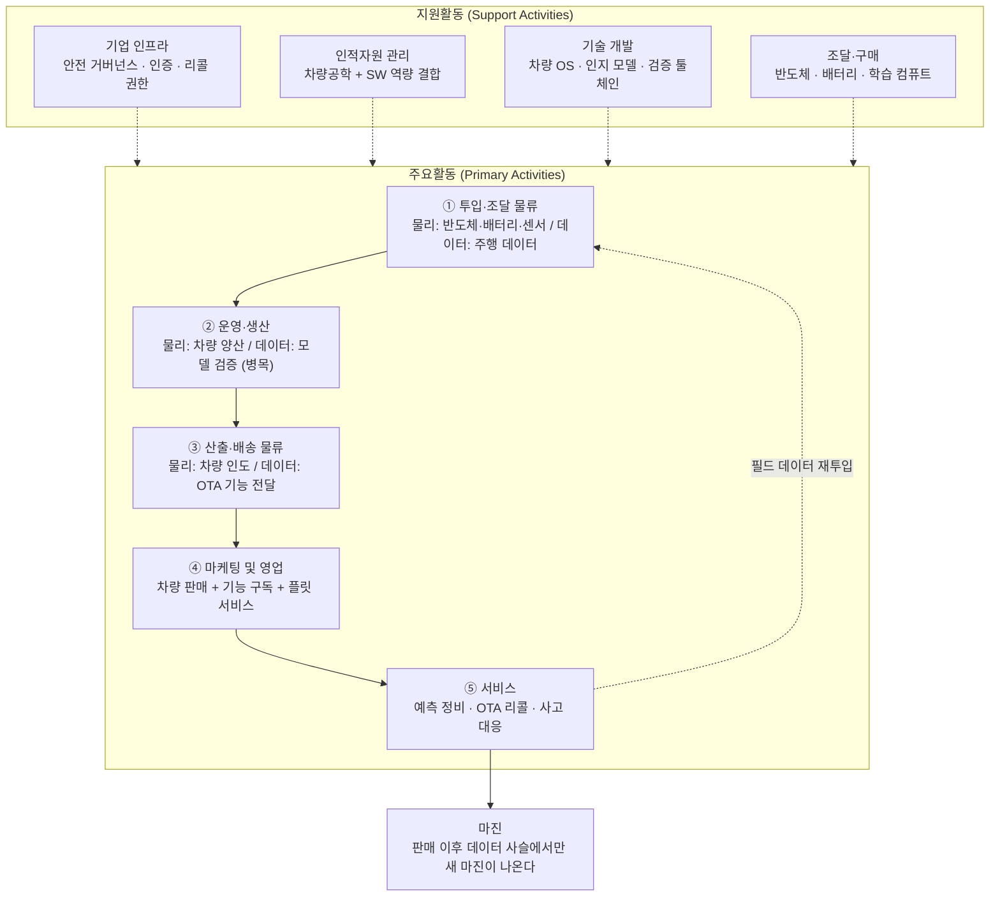

# 사례 02 — 자율주행 중심 완성차 기업의 가치사슬

> **📌 참고 사례입니다.** 이 저장소의 주 분석 대상은 **「콕집」** 이고, 챕터 02의 주 사례는 → **[콕집의 가치사슬](./case-01-kokjip-lecture-review-prioritizer.md)** 입니다.
>
> 이 문서는 콕집과 무관한 산업의 **대조군**입니다. 제조·데이터 두 겹 사슬을 다뤄 가치사슬 도구가 도메인에 종속되지 않음을 확인하는 것이 목적입니다.

분석 기준 시점: 2026년 8월
- 적용 방법론: [Ch02 가치사슬 방법론](./methodology.md)
- 선행 분석: [Ch01 5가지 힘 — 자율주행 자동차 산업](../01-porters-five-forces/reference-autonomous-driving-automotive.md) (압박 총점 19/25)

---

## 0. 분석 대상 정의

| 항목 | 내용 |
|---|---|
| 분석 대상 | 자율주행을 핵심 경쟁축으로 삼는 종합 완성차 기업(연 수백만 대 규모, 국내 완성차 관점) |
| 왜 이 모델인가 | Ch01에서 저비용은 규모 진영만, 차별화는 SW, 승산 높은 축은 ODD·차종 집중화로 결론이 났다. 이 세 결론을 실행하는 기업의 내부 활동을 설계한다 |
| 사업 구성 | ① 차량 제조·판매, ② 자율주행·SW 개발, ③ 기능 옵션·구독, ④ 정비·부품, ⑤ 플릿·모빌리티 서비스 |
| 제외 | 제조를 하지 않는 순수 로보택시 운영자(Ch01에서 대체재로 분류) |

### 이 사업의 가치사슬은 두 겹이다

일반 제조업 가치사슬은 조달 → 생산 → 물류 → 판매 → 서비스로 한 방향으로 흐른다. 자율주행이 들어오면 여기에 **판매 이후에 작동하는 두 번째 사슬**이 겹친다.

| | 물리 사슬 | 데이터 사슬 |
|---|---|---|
| 흐름 | 부품 → 조립 → 출고 → 딜러 → 고객 | 주행 데이터 → 학습 → 검증 → OTA → 개선된 차량 |
| 작동 시점 | 판매까지 | **판매 이후 계속** |
| 원가 성격 | 고정비·변동비 | 개발비·컴퓨트·검증비 |
| 개선 여지 | 수십 년간 최적화되어 여지가 적음 | 크게 남아 있음 |

**이 구분을 하지 않으면 자율주행 시대 완성차의 가치사슬 분석은 성립하지 않는다.** 아래 각 활동에서 두 사슬을 구분해 표기한다.

### Ch01 압박을 가치사슬 어디서 방어하는가

| Ch01 압박 요인 | 점수 | 방어 담당 활동 |
|---|---|---|
| 기존 경쟁 강도 | 5 | 기술개발(플랫폼 재사용·검증 자동화), 운영(가동률·시뮬레이션 비중) |
| 공급자 교섭력 | 4 | 조달(이중 소싱·장기계약), 기술개발(하드웨어 추상화·자체 칩) |
| 대체재 위협(로보택시) | 4 | 마케팅·영업(플릿·모빌리티 사업 직접 참여) |
| 구매자 교섭력 | 3 | 산출·배송(OTA로 인도 후 가치 추가 → 전환비용 형성) |
| 신규 진입자 위협 | 3 | 기업 인프라(안전 인증·규제 대응 역량), 운영(양산 품질) |

---

## 1. 가치사슬 개요도

**읽는 법**
- **노드마다 물리 사슬과 데이터 사슬이 병기되어 있다.** ①~③에서 두 사슬이 겹치고, 데이터 사슬은 차량이 팔린 뒤에도 계속 작동한다.
- **병목은 ②의 검증이다.** 안전 검증이 배포 속도를 정한다. 없애는 것이 목표가 아니라 원가를 낮추는 것이 목표라는 점에서 다른 병목과 성격이 다르다.
- **순환 고리(⑤→①)** 는 필드 데이터를 모델 학습으로 되돌린다. 이 고리의 회전 속도가 자율주행 성능 격차의 원천이다.
- **지원활동 중 기술개발이 ⑤의 원가를 직접 정한다.** SDV 아키텍처가 없으면 OTA 리콜이 불가능하고, 리콜 원가를 줄일 방법도 사라진다.
- **물리 사슬은 이미 최적화가 끝났다.** 새 마진은 ③ 이후 구간(OTA·구독·서비스)에서만 나온다.

---

## 2. 주요활동(Primary Activities) 분석

### 2-1. 투입·조달 물류 (Inbound Logistics)
**실체**: 부품·모듈 조달(물리) + **주행 데이터 수집**(데이터). 자율주행 시대에는 데이터가 원재료 목록에 새로 추가된다.

**설계 🏗️**
- **핵심 투입자원**: ① 자율주행 컴퓨트(SoC), ② 배터리 셀, ③ 센서(카메라·레이더·라이다), ④ **주행 데이터**, ⑤ 정밀 지도, ⑥ 자율주행 SW·AI 인력.
- **데이터 확보 방식**: 방법론의 "고객 동의 기반 데이터 확보"가 여기서는 양산차 섀도우 모드 수집 동의로 나타난다. 차량 외부 영상의 개인정보(보행자 얼굴·번호판) 처리 근거, 국가별 데이터 국외 이전 규제, 동의 철회 시 처리 절차를 함께 설계해야 한다.
- **자체 확보 vs 외부 조달 기준**: 인지·판단 SW와 차량 OS는 자체(차별화 원천). 컴퓨트는 초기 외부 조달 후 물량 확보 시 자체 설계 검토. 정밀 지도는 제휴.
- **파트너 참여 유인**: 스택 공급자에게는 대량 물량과 공동 개발 기회, 데이터 파트너에게는 필드 데이터 접근권.

**개선 🚀**
- **데이터 품질과 원가의 동시 관리**: 전량 수집은 저장·통신 비용을 감당할 수 없다. **희소한 엣지 케이스만 선별 수집**하는 트리거 설계가 데이터 사슬 원가 관리의 핵심이다. 같은 상황의 10만 번째 데이터는 가치가 0에 가깝다.
- **공급자 종속 완화**: 컴퓨트 이중 소싱과 하드웨어 추상화 계층으로 칩 교체 가능성을 확보한다. Ch01의 공급자 교섭력 4점에 대한 직접 대응이며, 전방 통합(풀스택 턴키)에 잠식되지 않는 유일한 방어다.
- **공급 중단 대비**: 반도체 부족 사태에서 확인된 리스크다. 핵심 부품 재고 정책, 대체 부품 사전 인증, 설계 단계에서의 부품 이중화.
- **데이터 재활용**: 필드 데이터를 인지 모델 학습, 시뮬레이션 시나리오 생성, 품질 보증, 예측 정비에 동시에 쓴다. 한 번 수집한 데이터가 몇 개 활동에 재사용되는지가 데이터 사슬의 효율을 결정한다.

**핵심 지표**: 부품 이중 소싱 비율, 엣지케이스 수집 효율(유효 데이터 비율), 대당 데이터 저장·전송 원가, 라인 정지 시간, 부품 단가 추이

### 2-2. 운영·생산 (Operations)
**실체**: 두 개의 생산 라인이 병행한다. 차량 조립(물리)과 **검증된 자율주행 모델의 생산**(데이터).

**설계 🏗️**
- **핵심 변환 과정**: 부품 → 차량, 그리고 데이터 → 검증된 주행 모델. 후자가 새 경쟁축이며, 여기서는 "검증"이 생산 공정에 해당한다.
- **처리 흐름**: 플랫폼 개발 → 차량 양산 → 출고 → 데이터 수집 → 모델 학습 → 시뮬레이션 검증 → 실차 검증 → 단계적 OTA 배포.
- **안전·품질 통제**: 기능안전(ISO 26262), 의도된 기능의 안전성(SOTIF, ISO 21448), 사이버보안 관리체계와 SW 업데이트 관리체계(UN R155/R156), L3 관련 인증(UN R157). 방법론의 "인증·보안·품질 검증·규제 준수" 항목이 이 산업에서는 이 규제군으로 구체화된다.
- **수요 변동 대응**: 혼류 생산과 유연한 라인 편성으로 가동률을 방어한다. 고정비가 높은 산업에서 가동률은 곧 손익이다.
- **자동화와 사람의 경계**: 데이터 라벨링은 자동화 후 표본 검수, 안전 판정과 배포 승인은 사람. 시뮬레이션과 실도로 검증의 비율도 이 경계에 해당한다.

**개선 🚀**
- **검증 원가가 최대 절감 대상**: 실도로 검증은 자율주행 개발비에서 큰 비중을 차지한다. 시뮬레이션 비중을 높이고 실차 검증을 위험 시나리오에 집중시키는 것이 개발비 군비 경쟁(Ch01 경쟁 강도 5점)에서 버티는 방법이다.
- **핵심 성능 지표 개선**: 주행거리당 개입 횟수, 오작동률, OTA 배포 성공률.
- **결함 조기 검출**: 양산 후 발견되는 결함의 원가는 설계 단계 대비 수십 배다. 품질 원가를 앞단으로 옮긴다.
- **배포 속도와 안전의 동시 확보**: 단계적 배포(카나리), 자동 롤백, 지역·ODD 단위 점진 개방. SW 조직의 주 단위 배포 문화와 차량 안전 검증의 월 단위 주기를 잇는 장치다.
- **수동처리 축소**: 라벨링, 시나리오 작성, 회귀 테스트의 자동화 비율.

**핵심 지표**: 1만km당 개입 횟수, 시뮬레이션/실도로 검증 비율, 대당 검증 원가, OTA 배포 주기·성공률, 공장 가동률, 초기 품질 지수

### 2-3. 산출·배송 물류 (Outbound Logistics)
**실체**: 차량 물류·딜러 인도(물리) + **OTA를 통한 기능 전달**(데이터). 판매 시점에 끝나지 않는다.

**설계 🏗️**
- **두 개의 배송 경로**: 공장 → PDI → 딜러 → 고객(물리), 그리고 클라우드 → 차량(디지털).
- **자율주행 기능 전달 형태**: 하드웨어 선탑재 후 소프트웨어 활성화, 옵션 일시불 또는 구독, ODD 확대에 따른 지역별 단계 개방.
- **고객 이해 확보**: 방법론의 "비용과 위험을 충분히 설명" 항목이 이 산업에서 가장 무거운 항목이다. L2와 L3의 **운전 책임 경계**를 고객이 오해하면 사고와 규제 제재로 직결된다. 명칭·마케팅 문구·HMI 경고가 전부 이 항목에 걸린다.
- **파트너 정보 제공**: 딜러 진단 도구, 보험사용 주행 데이터, 플릿 관제 API.

**개선 🚀**
- **인도 후 가치 추가**: OTA로 기능이 개선되는 차량은 잔존가치가 방어되고, 이는 재구매 시 브랜드 전환비용으로 작동한다. Ch01 구매자 교섭력(3)을 낮추는 핵심 수단이다.
- **활성화율 개선**: 기능이 탑재되어 있어도 켜지지 않으면 매출이 되지 않는다. 온보딩 UX와 무료 체험 설계가 곧 SW 매출이다.
- **상태·조치 안내**: 기능 제한이나 OTA 실패 시 현재 상태와 다음 조치를 차내에서 안내한다.
- **알림 과다 축소와 접근성**: 경고 남발은 경고 무시를 낳는다. 고령 운전자를 포함한 HMI 이해 가능성을 확보한다.

**핵심 지표**: OTA 도달률·성공률, 기능 활성화율, 구독 유지율, 인도 리드타임, 기능 오해로 인한 사고·신고 건수

### 2-4. 마케팅 및 영업 (Marketing & Sales)
**설계 🏗️**
- **핵심 고객 세분화**: 개인 리테일, 플릿·리스, 로보택시 운영자, B2B 물류. Ch01의 집중화 결론에 따르면 **지불 근거가 명확한 쪽은 플릿과 상용**이다. 인건비·사고율 절감이 ROI로 계산되기 때문이다.
- **사용 이유**: 개인에게는 편의와 안전, 플릿에게는 운영비 절감. 같은 기능을 파는데 구매 논리가 완전히 다르므로 영업 조직도 분리해야 한다.
- **수익 모델 설계**: 차량 판매 + 기능 구독 + 서비스 과금(마일당). 대체재인 로보택시 모델을 자기 매출 구조 안에 미리 넣는 설계다.
- **채널 역할**: 딜러(체험·인도), 직판·온라인(가격 투명성), 시승(기능 신뢰 형성).

**개선 🚀**
- **유료 전환율 제고**: Ch01에서 확인된 낮은 지불 의사를 우회하는 방법은 **제3자 편익을 지불 근거로 만드는 것**이다. 보험료 할인 연계, 사고율 감소 데이터 제공, 플릿 운영비 절감 보증이 그 예다.
- **과대광고 억제**: 자율주행 성능 과장은 소송·조사·리콜 비용으로 되돌아온다. 마케팅 ROI 계산에 규제 리스크를 포함해야 한다.
- **LTV 확장**: 차량 1대에서 SW 구독·충전·보험·정비·중고차 순환으로 매출을 늘린다.
- **프로모션 후 잔존**: 무료 체험 종료 후 유지율이 기능 가치의 진짜 측정치다.

**핵심 지표**: 기능 부착률, 구독 유지율, 대당 SW 매출, 플릿 계약 대수, 시승→구매 전환율, 마케팅 관련 규제 이슈 건수

### 2-5. 서비스 (Service)
**설계 🏗️**
- **사고·장애 유형**: 자율주행 관련 사고 조사, 기능 오작동, 리콜, 사이버 침해, OTA 실패, 배터리 이상.
- **셀프 해결 수단**: 앱 자기진단, 원격 진단, 차내 안내.
- **자동과 전문의 구분**: 원격 진단은 자동, 사고 조사는 전문 조직(EDR·주행 로그 분석)이 담당한다.
- **사고 대응 절차**: 조사 → 보상 → 당국 신고 → 재발방지 → OTA 배포. 자율주행에서는 이 절차의 속도와 투명성이 브랜드 생존과 직결된다. 방법론의 "사고 발생 시 조사·보상·신고·재발방지" 항목이 가장 무겁게 걸리는 지점이다.
- **파트너 지원**: 딜러 정비 교육, 부품 공급, 플릿 사업자 기술 지원.

**개선 🚀**
- **리콜을 OTA로 해결하는 비율 확대**: 입고 리콜과 OTA 리콜의 원가 차이는 수십 배다. **마진에 가장 직접적으로 기여하는 개선 항목**이다.
- **문의 전 탐지**: 필드 데이터로 고장·이상 패턴을 사전 탐지해 예측 정비로 전환한다.
- **측정 대상**: 상담 처리시간이 아니라 1회 방문 해결률과 재입고율.
- **원인 분류**: 민원을 HW·SW·제휴사·사용자 오해·정책 문제로 분류한다. 특히 '사용자 오해'로 분류된 건수는 산출·배송 활동(기능 설명)의 실패 신호다.
- **맥락 유지**: 앱·콜센터·서비스센터 간 차량·정비 이력이 이어져야 한다.

**핵심 지표**: OTA 리콜 비율, 대당 보증수리비, 1회 방문 해결률, 예측 정비 적중률, 사고 조사 소요기간

---

## 3. 지원활동(Support Activities) 분석

### 3-1. 기업 인프라 (Firm Infrastructure)
**설계 🏗️**
- **법인·조직 경계**: 완성차, SW 자회사, 모빌리티 서비스 법인, 반도체·배터리 계열이 각각 무엇을 책임지는가. 책임·데이터·브랜드 경계를 명시해야 한다. Ch01에서 확인된 **공급자가 브랜드를 흡수하는 위험**은 이 경계가 흐릴 때 발생한다.
- **거버넌스**: 안전 관련 사안의 이사회 보고 체계, 사이버보안 관리체계(CSMS), SW 업데이트 관리체계(SUMS), 리콜 결정 권한, 내부감사.
- **규제 대응**: 자율주행 인증, UN 규정, 개인정보(차량 외부 영상), 국가별 데이터 이전, 제조물책임.
- **검토 절차**: 신규 기능 출시 전 안전·법률·보안·개인정보 게이트.

**개선 🚀**
- **가장 중요한 거버넌스 질문**: 출시 일정(성장지표)과 검증 완료(안전지표)가 충돌할 때 무엇이 이기는가. 이 기준이 문서로 없으면 항상 일정이 이긴다. 자율주행에서 그 결과는 사고와 리콜이다.
- **안전·보안 조직의 초기 참여**: 설계 완료 후 검토가 아니라 요구사항 정의 단계부터 참여시킨다.
- **사고 대응 지휘체계**: 사고·침해 발생 시 판단 권한과 대외 커뮤니케이션 주체를 사전에 정한다.
- **계열사 간 데이터 활용**: 차량 데이터를 보험·모빌리티 계열이 쓸 때 고객 동의 범위를 일관되게 관리한다.

### 3-2. 인적자원 관리 (Human Resource Management)
**설계 🏗️**
- **필요 인재**: 자율주행 SW·AI, 데이터 엔지니어, 기능안전·SOTIF 전문가, 차량 SW 아키텍트. 기존 기계·전자·생산 인력과 함께 일해야 한다.
- **역량 결합**: 방법론의 "도메인 전문성 + 제품 개발 역량 결합"은 여기서 **"차량공학 + 소프트웨어 개발 역량 결합"**이 된다. 연 단위 차량 개발 주기와 주 단위 SW 배포 주기가 충돌하는 것이 이 조직의 핵심 갈등이다.
- **책임 소재**: 기능별 오너와 안전 최종 승인권자를 분리해 지정한다.

**개선 🚀**
- **기존 인력의 SW 전환 재교육**: 이것이 **시장 A(AX/DX 교육)의 최우량 수요**다. 두 시장이 만나는 지점이며, Ch01 비교 문서 5절에서 지적한 연결점이 조직 내부에서는 이 활동으로 나타난다.
- **인재 확보 경쟁**: SW·AI 인력은 테크 기업과 보상 경쟁을 해야 한다. 완성차의 보상 체계로는 불리하므로 별도 트랙이 필요하다.
- **평가 반영**: 출시 실적 외에 품질·안전·재발방지 기여를 넣는다.
- **속인성과 의사결정 속도**: 조직 규모가 커질수록 자율주행 판단 권한이 분산돼 결정이 늦어진다.

### 3-3. 기술 개발 (Technology Development)
**설계 🏗️**
- **경쟁력의 원천**: E/E 아키텍처, 차량 OS, 인지·판단 모델, 시뮬레이션·검증 툴체인, 데이터 파이프라인.
- **자체 vs 외부 기준**: 풀스택 턴키 채택은 개발 속도를 사는 대신 차별화 근거를 파는 거래다. Ch01 결론과 직결되므로, 무엇을 턴키로 받고 무엇을 지킬지의 선이 곧 이 기업의 전략이다.
- **결합도 낮추기**: SDV 아키텍처로 하드웨어와 소프트웨어를 분리하고, 하드웨어 추상화 계층으로 칩 교체 가능성을 유지한다.
- **가용성·복구성**: 안전 필수 기능의 이중화, 저하 모드(degraded mode) 설계, OTA 실패 시 롤백.
- **기술 자산 관리**: 코드·데이터셋·모델·시나리오·API를 버전 관리 대상 자산으로 다룬다. 특히 검증 시나리오 라이브러리는 축적되는 자산이다.

**개선 🚀**
- **차종별 중복 개발 제거**: 플랫폼 재사용률이 이 산업 개발비 관리의 핵심이다. 차종이 늘어날 때 개발비가 선형으로 늘면 규모의 경제가 사라진다.
- **검증 자동화**: 회귀 테스트와 시나리오 생성을 자동화해 배포 주기를 단축한다.
- **모델 편향·엣지케이스 관리**: 특정 지역·기후·도로 유형에서의 성능 저하를 추적한다.
- **생성형 AI 활용과 검증**: 시나리오 생성, 라벨링, 코드 생성에 활용하되 안전 관련 산출물은 별도 검증 게이트를 통과시킨다.
- **API 변경 시 파트너 비용**: 플릿·보험·정비 파트너의 연동 비용을 최소화한다.

### 3-4. 조달·구매 (Procurement)
**설계 🏗️**
- **조달 대상**: 반도체, 배터리 셀, 센서, 학습용 GPU·클라우드, 정밀 지도, 통신 회선, 라벨링 서비스.
- **평가 기준**: 가격 + 공급 안정성 + 보안 + 규제 준수 + 지정학 리스크.
- **협상력 확보**: 물량 집중은 단가를 낮추지만 종속을 키운다. 이 상충을 장기계약, 지분 투자, 합작으로 관리한다.
- **공급 중단 대비**: 이중 소싱, 대체 부품 사전 인증, 전략 재고.
- **외부 처리 데이터 통제**: 라벨링 업체가 다루는 주행 영상의 개인정보 통제 조항.

**개선 🚀**
- **학습 컴퓨트 비용 최적화**: 자율주행 모델 학습비는 이제 조달의 주요 항목이다. 예약 용량과 온디맨드 조합, 학습 효율(데이터당 성능 향상)을 함께 관리한다.
- **단일 클라우드 종속 회피와 전환 계획**.
- **계약 조항**: 데이터 반환·삭제, 보안 감사권, 장애 대응 SLA, 원자재 가격 연동.
- **공급자 리스크 모니터링**: 재무 상태, 보안 사고 이력, 수출 규제·관세 변화.

---

## 4. 마진 구조 진단

전체 구조는 [§1 가치사슬 개요도](#1-가치사슬-개요도)를 참조한다. 여기서는 그 사슬에서 돈이 어디로 새고 어디서 남는지만 정리한다.

**가치가 새는 지점**
- 자율주행 검증 비용(실도로 주행, 시나리오 작성, 회귀 테스트).
- 차종별 중복 개발.
- 리콜·보증 수리(입고 리콜은 원가가 크다).
- 공장 가동률 미달과 재고.
- 딜러 유통 단계의 마진 잠식.
- 부품 이중 소싱이 만드는 단가 상승(공급자 힘 방어의 대가).

**마진이 생기는 지점**
- 플랫폼·모듈 재사용.
- OTA로 처리하는 리콜과 기능 개선.
- SW 구독·기능 매출(증분 원가가 0에 가깝다).
- 예측 정비와 부품 순환.
- 플릿·모빌리티 서비스의 마일당 매출.

> **핵심 문장**: 물리 사슬은 이미 수십 년간 최적화되어 개선 여지가 얇다. **새 마진은 판매 이후에 작동하는 데이터 사슬에서만 나온다.** 그래서 이 기업의 가치사슬은 무게중심을 판매 시점 이후로 옮기는 중이며, 자율주행 투자의 회수도 그 축에서 이루어진다.

**활동 간 연결에서 나오는 마진**
- 투입(엣지케이스 선별 수집) → 운영(시뮬레이션 검증) → 산출(단계적 OTA) → 서비스(필드 데이터 회수) → 다시 투입: 이 순환의 회전 속도가 곧 자율주행 성능 개선 속도이며, 경쟁사와 벌어지는 격차의 원천이다.
- 서비스(OTA 리콜) ↔ 기술개발(SDV 아키텍처): 아키텍처가 OTA를 지원하지 못하면 리콜 원가를 줄일 수 없다. 지원활동이 주요활동의 원가 구조를 직접 결정하는 대표 사례다.

---

## 5. 검증이 필요한 가정

- [ ] 자율주행 개발비에서 검증(실도로·시뮬레이션)이 차지하는 실제 비중
- [ ] 시뮬레이션이 실도로 검증을 대체할 수 있는 현실적 한계
- [ ] 차종 간 플랫폼 재사용률의 실측치와 상한
- [ ] OTA로 해결 가능한 리콜의 비율과 규제 인정 범위
- [ ] 대당 SW·구독 매출과 그 증분 이익률
- [ ] 엣지케이스 선별 수집이 학습 효율을 실제로 얼마나 높이는지
- [ ] 기존 인력의 SW 전환 재교육 성공률과 소요 기간
