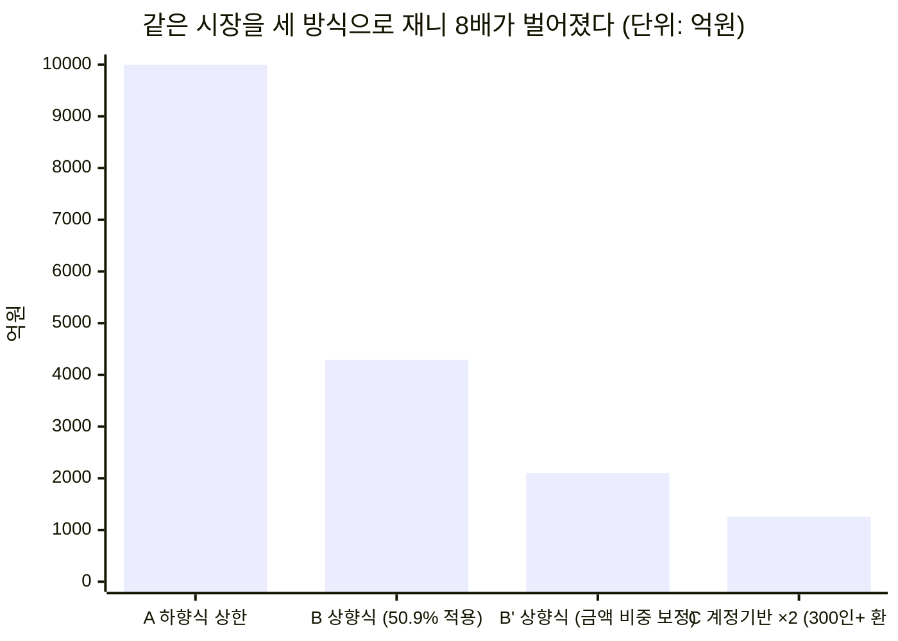
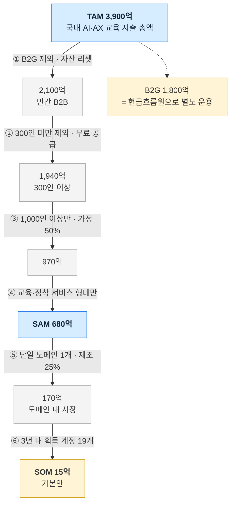

# 사례 01 — AI AX/DX 교육 시장의 TAM-SAM-SOM 과 세그먼트 맵

분석 기준 시점: 2026년 8월 · 적용 방법론: [Ch04 방법론](./methodology.md)

근거 문서
- [Ch01 5가지 힘](../01-porters-five-forces/case-01-ai-education-edtech.md) — 이하 **[1A]**
- [Ch02 가치사슬](../02-value-chain/case-01-ai-education-edtech.md) — **[2A]**
- [Ch03 KSF](../03-ksf/new-entrant-top5-ksf.md) — **[3]**
- [딥 리서치 본문](./deep-research/case-ai-ax-edtech.md) — **[R]**

원천 데이터·계산 감사·미확정 항목 → **[deep-research/market-sizing-evidence.md](./deep-research/market-sizing-evidence.md)**

---

## 0. 결론 먼저

| 층 | 값 | 한 줄 근거 |
|---|---|---|
| **TAM** | **약 3,900억 원/년** | 국내 기업·기관의 AI/AX 교육 지출 총액 (민간 2,100억 + 정부 1,800억) |
| **SAM** | **약 680억 원/년** | 그중 B2G 제외 · 1,000인 이상 기업 · 교육·정착 서비스 형태 |
| **SOM** | **약 15억 원/년** (3년차, 기본안) | 단일 도메인 1개 × 계정 19개 × 계정당 8,000만 원 |

**가장 중요한 발견은 값이 아니라 값이 갈린 이유입니다.** 같은 시장을 세 방식으로 재니 **최대 8배**가 벌어졌고, 원인은 **"AI 교육이 2026년 투자 1순위(50.9%)"라는 수치를 금액 비중으로 읽으면 안 된다**는 것이었습니다([§3-4](#3-4-괴리의-원인--509는-금액-비중이-아니다)).

---

## 1. 욕구 정의와 시장 경계

방법론의 첫 규칙 — **제품이 아니라 욕구로 경계를 그린다.**

> **욕구**: 기업이 임직원의 AI 활용 역량을 확보해 **업무 성과를 내려는 지출.**

[1A]가 정의한 고객의 진짜 욕구("교육을 받는 것이 아니라 임직원이 AI로 실제 성과를 내는 것")를 그대로 승계합니다. 따라서 같은 욕구에 지출되는 다른 형태가 모두 TAM에 들어갑니다.

| 구분 | 포함 | 제외 |
|---|---|---|
| **넓은 TAM**(AI 역량 확보 지출 전체) | 교육 서비스 · AI 툴 라이선스 · 컨설팅·구축 · AI 인재 채용비 | — |
| **본 산정의 TAM**(교육·정착 서비스) | B2B 기업교육(집합·온라인) · 구독형 러닝 플랫폼 · 정부 재정지원 훈련(B2G) · 정착·성과 계측 서비스 | 툴 라이선스 · 에이전트 구축 수임 · 채용비 · K-12 · 학위과정 · 어학 |

**두 개의 TAM을 함께 제시하는 이유**는 [1A]의 대체재 위협 5/5가 여기서 금액으로 나타나기 때문입니다. 좁은 TAM만 보면 시장이 작아 보이고, 넓은 TAM만 보면 우리가 팔 수 없는 것까지 세는 셈이 됩니다.

**넓은 TAM 추정 — 약 3~6조 원** (강한 가정 위의 값). 2026년 정부 AI 예산 9.9조 원의 부문 배분(인재양성 13.6% · AX 25.7% · 인프라 24.7% · 기술개발 28.8%)을 민간 배분의 **대리 지표**로 쓰면, 교육이 13.6%라면 전체는 교육의 약 7.4배입니다. 정부 배분을 민간에 대입하는 것이므로 자릿수 감각으로만 씁니다.

---

## 2. Market Segment Map

### 2-1. 축을 고른 근거

방법론의 기준 — **축은 처분이 갈리는 곳이어야 한다.** 두 축을 골랐습니다.

| 축 | 왜 이 축인가 | 근거 |
|---|---|---|
| **가로: 기업 규모** | 지불 능력이 규모에서 갈리고, **1,000인 미만은 정부 무료 공급이 덮는다** — 처분이 정반대가 된다 | 교육훈련비 300인 미만은 300인 이상의 **15.2%** · KOSA AI AX 공동훈련센터 1,000인 미만 무료([R] 5-6) |
| **세로: AI 성숙 단계** | 미도입·일부 부서·전사 도입에서 **팔 물건 자체가 다르다** | 활용 기업 중 전사 25.0% / 일부 부서 75.0%([R] 3-3) · 도입 실행률 대기업 76% / 중견 50% / 중소 46% |

업종을 축으로 쓰지 않았습니다. 처분이 갈리지 않기 때문입니다 — 업종은 SOM 단계의 도메인 선택에서 다시 등장합니다.

### 2-2. 세그먼트 좌표

```mermaid
quadrantChart
    title 세그먼트 맵 — 기업 규모 × AI 성숙 단계
    x-axis 300인 미만 --> 1000인 이상
    y-axis AI 미도입 --> 전사 도입 완료
    quadrant-1 계측·확산 수요 (교육 수요는 낮음)
    quadrant-2 자가 공급·무료 공급 영역
    quadrant-3 툴 도입이 선행 과제
    quadrant-4 주 표적 — 도입했으나 안 퍼짐
    S1 대기업 전사도입: [0.85, 0.88]
    S2 중견 전사도입: [0.52, 0.80]
    S4 대기업 일부부서: [0.86, 0.45]
    S5 중견 일부부서: [0.55, 0.42]
    S6 중소 일부부서: [0.16, 0.38]
    S7 대기업 미도입: [0.80, 0.10]
    S9 중소 미도입: [0.14, 0.08]
```

> 사분면 라벨은 **처분**입니다. 우하단(예산 있음 + 도입했으나 미확산)이 주 표적입니다.

### 2-3. 칸별 크기·근거·처분

방법론이 요구한 세 열입니다. **처분 열이 이 표의 존재 이유**입니다.

| # | 세그먼트 | 크기(추정) | 근거 | **처분** |
|---|---|---|---|---|
| **S4** | **1,000인 이상 × 일부 부서만 도입** | 종사자 약 **146만 명** · 기업 약 **1,500개** | 1,000인 이상 종사자 194만 명 추정 × 도입률 76% × 일부 부서 비중 75%… 실제로는 **활용 기업의 75%가 일부 부서 단계**([R] 3-3) | **주 표적.** "도입했는데 퍼지지 않는다"는 문제의 실제 소유자이고, 예산과 무료 공급 회피 조건을 동시에 만족 |
| S1 | 1,000인 이상 × 전사 도입 | 종사자 약 **49만 명** | 194만 × 76% × 25% | **2순위.** 교육 수요는 낮으나 **정착률 계측·성과 리포팅** 수요는 오히려 높다. 제품의 계측 절반만 판다 |
| S5 | 300~999인 × 일부 부서 | 미확정 | 중견 도입률 50% | **보류.** 예산 편성 여력 확인 필요 — AI 교육 5,000만 원 이상 편성이 중견은 **14%**(대기업 38%) |
| S2 | 300~999인 × 전사 도입 | 미확정 | 동일 | 보류 |
| S7 | 1,000인 이상 × 미도입 | 소수 | 도입률 76% → 미도입 24% | **제외.** 툴 도입이 선행 과제이며 그것은 SI·툴 벤더의 영역 |
| S6 | 300인 미만 × 일부 부서 | 종사자 약 **1,005만 명** | 2,185만 × 46% | **제외.** 교육훈련비가 300인 이상의 15.2%이고 KOSA 무료 공급이 같은 구성을 덮는다 |
| S9 | 300인 미만 × 미도입 | 종사자 약 **1,180만 명** | 2,185만 × 54% | **제외.** 동일 + 도입 자체가 선행 |
| S3/S8 | 중소·중견 잔여 칸 | 미확정 | — | 제외 (동일 사유) |

**칸 하나가 표적이고 나머지는 전부 보류 또는 제외입니다.** [3] KSF1("교두보의 극단적 협소화")이 세그먼트 맵에서는 이런 모양으로 나타납니다.

---

## 3. TAM 산정 — 세 방식 병치

방법론의 요구대로 방식을 셋으로 재고 결과를 나란히 둡니다.

### 3-1. 방식 A — 하향식

| 단계 | 값 | 출처 |
|---|---|---|
| 국내 이러닝 수요 총액 | 5조 7,078억 원 (2023) | 이러닝산업 실태조사 |
| − 개인 지출 | −2조 9,717억 원 | 동일 |
| = 기업·교육기관·공공 | 2조 7,361억 원 | 계산 |
| × 기업 비중 (가정 50%) | 약 1조 3,700억 원 | **가정** |
| + 집합교육 보정 (이러닝은 온라인 한정) | 기업교육 전체 **1.5~2.0조 원** | **추정** |
| × AI 교육 비중 50.9% | **7,600억~1조 원** | 휴넷 371개사 |

### 3-2. 방식 B — 상향식

| 단계 | 값 | 출처 |
|---|---|---|
| 전체 종사자 | 2,573.1만 명 (2024) | 전국사업체조사 |
| 300인 이상 (종사자의 15.1%) | 약 **388만 명** | 동일 |
| 300인 미만 | 약 **2,185만 명** | 계산 |
| 1인당 연 교육비 (300인 이상) | **20만 원** (응답 최다 구간 10~30만 원의 중앙) | 휴넷 설문 |
| 1인당 연 교육비 (300인 미만) | **3.04만 원** (300인 이상의 15.2%) | 기업체노동비용조사 |
| 기업교육 전체 | 7,760억 + 664억 = **8,424억 원** | 계산 |
| × AI 교육 비중 50.9% | **4,288억 원** | 휴넷 |

### 3-3. 방식 C — 계정 기반

| 단계 | 값 | 출처 |
|---|---|---|
| 1,000인 이상 기업 수 | **약 2,000개**(가정) — 범위 3,538개(공시대상기업집단 소속회사)~6,354개(300인 이상 사업체) | **가정 + 범위** |
| AI 교육 예산 5,000만 원 이상 편성 (대기업) | **38%** | 팀스파르타 330명 조사 |
| 5,000만 원 이상 편성 기업 소계 | 2,000 × 38% × 5,000만 = **380억 원** | 계산 |
| 나머지 62% (평균 2,000만 원 가정) | **248억 원** | **가정** |
| 1,000인 이상 소계 | **약 630억 원** | 계산 |



### 3-4. 괴리의 원인 — 50.9%는 금액 비중이 아니다

**방식 B와 C가 3배 이상 벌어집니다.** 멈추고 이유를 찾았습니다.

| 대조 | 값 |
|---|---|
| 방식 B가 함의하는 1,000명 기업의 AI 교육 예산 | 1,000명 × 20만 원 × 50.9% = **1억 200만 원** |
| 실측: 대기업의 AI 교육 예산 편성 규모 | **5,000만 원 이상이 38%** — 즉 다수가 5,000만 원 미만 |
| 실측을 1인당으로 환산 | 5,000만 원 ÷ 1,000명 = **5만 원/인** |
| 1인당 전체 교육비 대비 | 5만 원 ÷ 20만 원 = **25%** |

> **"2026년 가장 많이 투자할 교육 분야 = AI 교육 50.9%"는 우선순위 응답 비중이며, 금액 비중은 약 25% 수준입니다.**

우선순위 응답과 예산 배분은 다른 것입니다. AI 교육이 1순위여도 그것이 예산의 절반을 받는다는 뜻은 아닙니다. [R] §5-1이 이미 "예산 총액은 늘지 않았다"고 확인했으니, 1순위 항목조차 절대 금액은 제한됩니다.

**따라서 금액 산정에는 25%를 적용합니다.**

### 3-5. TAM 확정

| 구성 | 값 | 산정 |
|---|---|---|
| 민간 300인 이상 | **1,940억 원** | 388만 명 × 20만 원 × 25% |
| 민간 300인 미만 | **166억 원** | 2,185만 명 × 3.04만 원 × 25% |
| **민간 소계** | **약 2,100억 원** | |
| 정부(B2G) | **약 1,800억 원** | KDT 'AI 캠퍼스' 1,300억 + 2026 추경 524억 |
| **TAM** | **약 3,900억 원/년** | |

**교차 검증** — 글로벌 AI 기반 기업교육 시장은 2026년 $7.49B(약 10.3조 원, 1,380원 환산)입니다.

| 비교 | 값 | 판정 |
|---|---|---|
| TAM 전체 / 글로벌 | 3,900억 / 10.3조 = **3.8%** | 한국 GDP 세계 비중(약 1.6%)의 2배 이상 — **B2G 비중이 46%로 유난히 크기 때문** |
| 민간만 / 글로벌 | 2,100억 / 10.3조 = **2.0%** | GDP 비중과 같은 자릿수 — **교차 검증 통과** |

민간 시장은 국제 비교상 정상 범위이고, **한국 시장의 특이점은 정부 예산이 시장의 절반에 가깝다는 것**입니다. 이것이 [R] 정제 1의 "현금은 B2G, 자산은 B2B"를 금액으로 뒷받침합니다.

---

## 4. TAM → SAM — 필터 체인

곱셈이 아니라 조건 통과로 깎습니다. 각 필터에 통과율과 근거를 병기합니다.

| # | 필터 | 통과율 | 근거 | 잔존 |
|---|---|---|---|---|
| — | TAM | — | §3-5 | **3,900억 원** |
| ① | **B2G 제외** | 54% | 매년 재입찰로 전환비용·축적 루프가 리셋됨([R] 정제 1). 현금흐름원으로만 쓰고 SAM에는 넣지 않는다 | **2,100억 원** |
| ② | **300인 미만 제외** | 92% | 교육훈련비가 300인 이상의 15.2%이고 KOSA 무료 공급이 덮는다([R] 5-6) | **1,940억 원** |
| ③ | **1,000인 이상만** | 50%(가정) | 300인 이상 종사자 중 1,000인 이상 비중을 절반으로 가정. **미확정 — §6 1순위** | **970억 원** |
| ④ | **제품 형태 필터** | 70%(가정) | 에이전트 구축 수임·자체 LMS·툴 라이선스를 의도적으로 팔지 않음([R] 7-5) | **680억 원** |
| | **SAM** | | | **약 680억 원/년** |



---

## 5. SOM 산정 — 아래에서 쌓기

목표 점유율에서 역산하지 않고 **계정 수 × 단가 × 달성률**로 쌓습니다.

### 5-1. 획득 가능 계정 수

| 단계 | 값 | 근거 |
|---|---|---|
| 1,000인 이상 기업 | 약 2,000개(가정) | §3-3 |
| × 도메인 필터 (제조업 가정) | 25% → **500개** | 단일 도메인 진입([3] KSF1) |
| × S4 세그먼트 비중 (도입했으나 일부 부서만) | 76% × 75% = 57% → **285개** | [R] 3-3 |
| × 3년 내 도달·전환 가능 | 6~7% → **약 19개** | 컨시어지 운영 한계(사당 3개월) + B2B 영업 사이클 |

### 5-2. 계정당 단가

| 근거 | 값 |
|---|---|
| [R] 5-2 교육비 항목 계정당 상한(추정) | 2,500만~5,000만 원 |
| 실측: 대기업 38%가 AI 교육 예산 5,000만 원 이상 편성 | **상한 추정이 맞았음을 확인** |
| PoC 성공 기준의 후속 계약 목표 | **8,000만 원/년** |

교육비 천장(3,500만 원)을 넘는 근거는 **청구 예산 항목을 도입·운영비로 옮기는 것**이며, 그것이 PoC의 1차 합격 조건입니다([R] 7-4).

### 5-3. 3안

| 시나리오 | 계정 수 | 계정당 | **SOM(3년차)** | SAM 대비 |
|---|---|---|---|---|
| 보수 | 12개 | 6,000만 원 | **7.2억 원** | 1.1% |
| **기본** | **19개** | **8,000만 원** | **15.2억 원** | **2.2%** |
| 공격 | 28개 | 1억 원 | **28.0억 원** | 4.1% |

**기본안 15억은 [R] 5-2가 계산한 "연 매출 30억을 만들려면 대기업 계정 약 86개"의 절반 규모입니다.** 단일 도메인에 머무는 한 30억이 상한에 가깝고, **두 번째 도메인을 여는 시점이 곧 성장 한계에 닿는 시점**입니다.

---

## 6. 신뢰 구간과 미확정 항목

**추정과 실측을 구분해 표기했습니다.** 아래는 값이 흔들리면 결론이 바뀌는 순서입니다.

| # | 항목 | 현재 처리 | 영향 |
|---|---|---|---|
| 1 | **1,000인 이상 국내 기업 수** | **가정 2,000개** (범위 3,538~6,354) | SAM·SOM에 **선형 영향**. 실제가 4,000개면 SOM은 2배 |
| 2 | 300인 이상 종사자 중 1,000인 이상 비중 | 가정 50% | SAM 필터 ③에 선형 영향 |
| 3 | AI 교육 금액 비중 25% | 두 조사의 교차에서 **유도** | TAM 전체에 선형 영향. 직접 실측 필요 |
| 4 | 제품 형태 통과율 70% | 가정 | SAM에 선형 영향 |
| 5 | 이러닝 수요 중 기업 비중 50% | 가정 | 방식 A에만 영향(교차 검증용이라 결론에는 무영향) |
| 6 | 1인당 연 교육비 20만 원 | 응답 구간의 중앙값 | 방식 B에 선형 영향 |

**항목 1과 3이 이 챕터의 핵심 미확정 값입니다.** 둘 다 [딥 리서치 로그](./deep-research/research-log.md#4-미해소-항목)가 미해소로 지목했던 것이며, 이번 산정에서 **범위까지는 좁혔으나 확정하지 못했습니다.**

상세 감사표와 계산 재현 → [deep-research/market-sizing-evidence.md](./deep-research/market-sizing-evidence.md)

---

## 7. 전략적 함의

**① 시장은 작습니다.** TAM 3,900억, SAM 680억. [1A]가 "성장하지만 이익이 남지 않는다"고 했고 [R]이 "예산 총액은 늘지 않았다"고 했는데, Ch04는 여기에 **절대 규모의 한계**를 더합니다. 이 시장에서 유니콘은 나오지 않습니다.

**② 그래서 협소화가 손해가 아닙니다.** SAM 680억에서 단일 도메인으로 좁히면 170억이 됩니다. 넓게 가도 680억이 상한이고, 넓게 가면 12개 사업자와 정면으로 부딪칩니다([R] 5-6). **좁히는 비용이 낮고 넓히는 이익이 작다** — 이것이 [3] KSF1을 금액으로 정당화합니다.

**③ B2G를 SAM에서 뺀 대가가 46%입니다.** TAM의 46%가 정부 예산이고 그것을 SAM에서 제외했습니다. 이 선택이 옳으려면 B2G를 **현금흐름원으로 별도 운용**해야 하며, 그러지 않으면 시장의 절반을 스스로 버리는 것입니다([R] 정제 1).

**④ 성장 경로는 도메인 확장뿐입니다.** 단일 도메인 SOM 상한이 약 30억이므로, 그 이상은 ① 두 번째 도메인 ② 계정당 단가 인상(성과 연동) ③ 해외 중 하나입니다. 세 경로 모두 Ch06 기회점수에서 비교 대상이 됩니다.

---

## 8. 다음 챕터로 넘기는 값

| 넘기는 값 | 대상 | 용도 |
|---|---|---|
| **S4 세그먼트** (1,000인 이상 × 일부 부서만 도입) | **Ch05 페르소나** | 페르소나의 소속 조직 조건. 1차 고객은 현업 부서장([R] 7-3) |
| S1 세그먼트(전사 도입 완료) | Ch05 | 2순위 페르소나 — 계측만 구매하는 고객 |
| SAM 680억 · 도메인 내 170억 | **Ch06 기회점수** | 시장 크기 항의 입력 |
| 도메인 확장 · 단가 인상 · 해외 3경로 | Ch06 | 비교 대상 기회 후보 |
| "도입했으나 일부 부서에 머문다"는 상태 | **Ch07 JTBD** | 과업 진술의 상황(Situation) 절 |
| 미확정 항목 1·3 | 다음 리서치 | 확정 시 SOM이 추정에서 산술로 |

---

## 9. 자기점검 (방법론 §5)

| 검증 질문 | 결과 |
|---|---|
| TAM이 고객 지출인가 | ○ 욕구 기준으로 경계를 그리고 공급자 매출(이러닝 산업 5.6조)은 교차 검증용으로만 사용 |
| SAM 필터에 통과율과 근거가 붙었는가 | ○ 4개 필터 전부 (단 ③④는 가정임을 표기) |
| SOM이 계정 수 × 단가로 쌓였는가 | ○ 목표 점유율 역산 없음 |
| 산정 방식 2개 이상 병치 + 괴리 설명 | ○ 3방식, 괴리 원인을 §3-4에서 규명 |
| 세그먼트 맵의 모든 칸에 처분이 있는가 | ○ 표적 1 · 2순위 1 · 보류 2 · 제외 나머지 |
| 추정치와 실측치가 구분되는가 | ○ 가정 항목을 §6에 6건 전량 명시 |
| 미확정 항목이 결론의 어디를 흔드는지 적었는가 | ○ 항목별 영향 방향까지 표기 |
