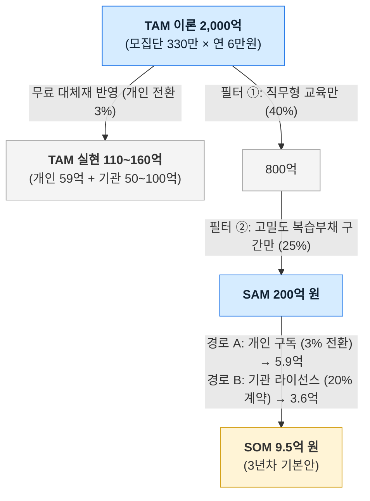

# 04. 시장 규모 및 세그먼트 분석 통합본 (Integrated Market Sizing)

> **문서명:** 04-tam-sam-som-market-segment-map / integrated-market-sizing.md  
> **문서 목적:** TAM-SAM-SOM 시장 규모 산정, 4×3 세그먼트 맵, 단위 경제성(Unit Economics) 및 딥 리서치 실사 데이터를 하나로 통합한 기준 문서  
> **기준 시점:** 2026년 8월  
> **근거 표기:** 🟢 실측·사실 / 🟡 해석·추론 / 🔴 미검증 가설  

---

## 1. 세그먼트 맵 및 표적 고객 선정 (Segment Map)

### 1-1. 축 선정 근거: 복습 부채의 크기(X) × 현직자 인사이트 유효성(Y)
- **가로축 (복습 부채의 크기):** 강의 밀도 × 훈련 기간. 문제의 크기를 직접 대리함 (하루 8시간 6개월 과정 = 최대치).
- **세로축 (현직자 인사이트 유효성):** 실무 중심 직무 교육에서는 유효하나, **정답과 합격선이 정형화된 시험(공무원/자격증)에서는 무효**함.
- *(※ 취업 절박도를 축으로 쓰지 않은 이유: 절박도를 쓰면 공시생이 주 표적에 들어오나, 공시생은 콕집의 뺄셈 방식이 작동하지 않는 집단임)*

```mermaid
quadrantChart
    title 세그먼트 맵 — 복습 부채 × 현직자 인사이트 유효성
    x-axis 복습 부채 작음 --> 복습 부채 큼
    y-axis 인사이트 무효 --> 인사이트 유효
    quadrant-1 주 표적 (L1 국비 부트캠프, L2 사설 부트캠프)
    quadrant-2 보류 (L6 직장인 재교육)
    quadrant-3 제외 (L7 장기 미취업 청년)
    quadrant-4 제외 (L5 공무원·자격증 준비생)
    L1 국비 부트캠프 수강생: [0.92, 0.90]
    L2 사설 부트캠프 수강생: [0.86, 0.87]
    L3 대학 취업준비 학년: [0.55, 0.70]
    L4 대학 저학년: [0.48, 0.38]
    L5 공무원·자격증 준비생: [0.66, 0.12]
    L6 직장인 재교육: [0.24, 0.60]
    L7 장기 미취업 청년: [0.07, 0.55]
```

### 1-2. 세그먼트별 크기 및 처분 요약

| 세그먼트 | 모집단 규모 | 처분 | 선정 / 제외 근거 | 근거 등급 |
|---|---|:---:|---|:---:|
| **L1. 국비 부트캠프 (KDT 등)** | **연 37,628명** (2024) | **주 표적 (Core)** | 복습 부채 최대(일 8h) + 실무 직무 교육 + **훈련기관(178곳) 제휴 채널 명확** | 🟢 통계 |
| **L2. 사설 부트캠프 수강생** | 미확정 (소규모) | **2순위** | 자비 수백만 원 지출로 지불 의사 최고, 단 시장 규모 제한적 | 🔴 추정 |
| **L3. 대학 취업준비생 (3~4학년)** | 에브리타임 289만 MAU 중 일부 | **3순위** | 에브리타임 채널 접근 용이하나 복습 부채가 KDT 대비 분산됨 | 🟡 추론 |
| **L4. 대학 저학년** | 대학 재학생 | **보류** | 당장의 복습 부채 및 취업 지불 동기 미약 | 🟡 추론 |
| **L5. 공무원·자격증 준비생** | 취업준비자의 18.2% (약 10.5만) | **제외 (Out)** | **정답이 정해진 시험으로 현직자 인사이트 무효** (방식 불일치) | 🟢 통계 |
| **L6. 직장인 재교육** | 직장인 교육 인원 | **보류** | 일상 업무 병행으로 강의 밀도 및 복습 부채 작음 | 🟡 추론 |
| **L7. 장기 미취업 청년** | **60만 5,000명** (1년 이상) | **제외 (Out)** | 절박도는 최대이나 **태깅할 원천 강의가 없음** (제품 미작동) | 🟢 통계 |

---

## 2. TAM-SAM-SOM 3단계 시장 규모 산정

### 2-1. 지불 주체별 112배 단가 괴리와 실현 TAM
- **개인 지불 기준 이론 TAM (방식 B):** 330만 명 × 연 6만 원 = **약 2,000억 원**
- **무료 대체재 제약 (클로바노트/노션 학생 무료 🟢):** 개인 유료 전환율 3% 적용 시 개인 실현 시장은 **약 59억 원**으로 급감 🔴.
- **기관 지불 기준 시장 (방식 C):** KDT 훈련기관 178곳 × 연 1,000만 원 = **약 18억 원** 🔴.
- **실현 가능 TAM 총합:** **약 110억 ~ 160억 원** (개인 59억 + 국비/대학 기관 50~100억)

### 2-2. SAM 및 SOM 산정 필터 체인



| 구분 | 규모 (금액) | 산정 근거 및 조건 | 근거 등급 |
|---|---|---|:---:|
| **TAM (이론)** | **약 2,000억 원** | 청년 표적 모집단 330만 명 × 연 6만 원 | 🟡 계산 |
| **TAM (실현)** | **약 110~160억 원** | 개인 실현(3% 전환) 59억 + 국비/대학 기관 시장 50~100억 | 🟡 추론 |
| **SAM** | **약 200억 원** | TAM 이론치 중 직무형 교육(40%) 및 고밀도 복습 부채 구간(25%) 필터링 | 🔴 가설 |
| **SOM (3년차)** | **약 9.5억 원** | - 경로 A (개인 구독): 33만 명 × 30% 도달 × 3% 전환 × 연 6만 원 = **5.9억 원**<br>- 경로 B (기관 B2B): 178개 기관 × 20%(36곳) 계약 × 연 1,000만 원 = **3.6억 원** | 🔴 가설 |

---

## 3. 확장 비즈니스 모델: 채용 연계 단가 분석

- **채용 플랫폼 수수료 실측 (원티드 🟢):** 합격자 연봉의 7% (신입 3,000만 원 가정 시 **건당 210만 원** 🟡).
- **단위 경제성 비교:** 건당 210만 원은 개인 연 구독료(6만 원)의 **35배**.
- **KDT 취업자 기준 잠재 매출 (연 20,394명 취업 성공자 🟢 기반):**
  - 성사율 1%: 4.3억 원 / **성사율 3%: 12.8억 원** (SOM 9.5억을 단독 초과)
- **구조적 한계 및 이해상충:** 채용 매칭 매출을 추구할 경우 학습자에게 공정한 우선순위를 제공해야 하는 학습 도구로서의 중립성과 충돌함. 현 단계에서는 VP에 직접 포함하지 않고 데이터 적립 대상으로 관리.

---

## 4. 기존 가정을 수정하게 만든 핵심 발견 (Key Pivot Insights)

1. **국비 교육기관의 위상 반전: [홍보 채널 ❌ → 주 판매 채널 ✅]**
   - 초기 워크숍 안에서는 기관을 "홍보 채널"로 보았으나, 개인 지불 한계(무료 번들로 0원 수렴)와 기관의 지불 동기(KDT 취업률 8.4%p 급락 🟢) 분석 결과 **기관이 핵심 B2B 지불자**여야 함이 규명됨.
2. **절박함이 아닌 '제품 작동 조건' 중심의 타깃 협소화:**
   - 절박도가 가장 높은 공시생(10.5만)과 장기 미취업 청년(60.5만)을 과감히 제외함. 콕집은 강의 음성이라는 원천 데이터가 있고 현직자 판단이 유효한 직무형 교육에서만 작동하기 때문임.
3. **SOM의 62%가 개인 전환율 3%라는 가장 취약한 가정에 의존:**
   - SOM 9.5억 중 5.9억이 개인 구독에서 나옴. 개인 유료 전환율이 1%로 하락 시 SOM은 5.6억으로 축소되므로, 기관 연계 일괄 배포를 통한 개인 도달 극대화가 필수적임.

---

## 5. 최종 VPS v2.0에 미치는 영향 및 연결

- **포지셔닝 정합성:** '시간 예산(가치 A)'과 '출처 기반 우선순위(가치 B)'를 분리하고, B2C 구독보다는 B2B 기관 라이선스 및 기관 일괄 배포를 통한 진입 구조 확립.
- **Feature 우선순위:** 단순 퀴즈·요약(무료 대체재 영역)을 제거하고, 취업률 방어 및 학습 시간 단축에 직결되는 P0 기능(강사 발화 태깅 + 오디오 동기화)에 집중.
