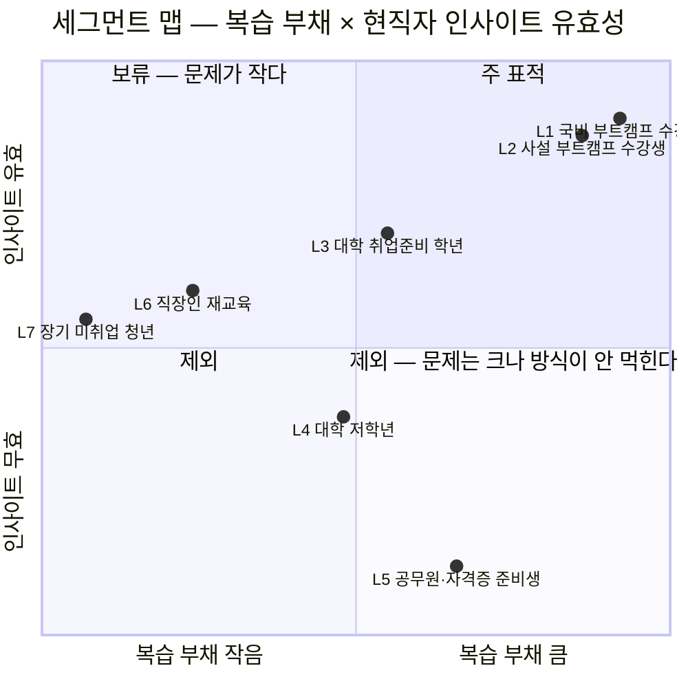
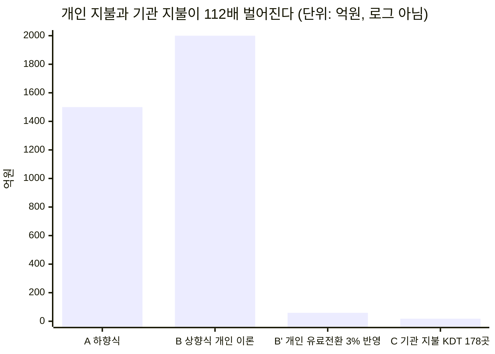
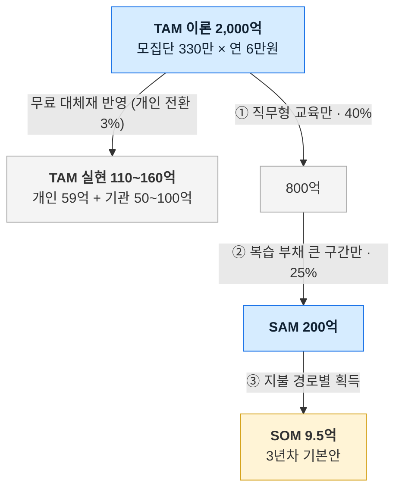

# 사례 01 — 「콕집」의 TAM-SAM-SOM 과 세그먼트 맵

> **콕집** — 국비 교육·대학 강의를 녹음·태깅해, **현직자 관점의 우선순위로 복습할 것만 골라주는** 학습 앱

분석 기준 시점: 2026년 8월 · 적용 방법론: [Ch04 방법론](./methodology.md)

근거 문서
- [Ch01 5가지 힘 — 콕집이 진입하는 산업(학습 보조 도구)](../01-porters-five-forces/case-01-kokjip-lecture-review-prioritizer.md) (압박 22/25) — 이하 **[1K]**
- [Ch01 참고 사례 — AX/DX 교육 산업(공급 측)](../01-porters-five-forces/reference-ai-education-edtech.md) — 이하 **[1A]**
- 원천 데이터·계산 감사 → **[산정 근거](./deep-research/kokjip-sizing-evidence.md)**
- 경쟁 실사·채용 연계 단가 → **[간이 딥 리서치](./deep-research/kokjip-research.md)**

---

## 0. 분석 대상 서비스

창업 교육 워크숍에서 직접 정리한 아이템 정의를 그대로 가져왔습니다.

| 항목 | 내용 |
|---|---|
| **솔루션명** | **콕집** — "이것만 콕 집어서 복습해" |
| **핵심 가치** | 학습 내용 중 **현직자 인사이트로 우선순위를 정해** 복습을 도와줌 |
| **서비스 내용** | ① 강의 중 녹음 + 실시간 복습 태깅(AI·사용자) → ② 강의 후 태깅 요약 + **현직자 인사이트 기반 우선순위**로 재복습 → ③ (유료) 커리큘럼에 맞춘 복습 리마인드 → ④ (유료) 복습 내용에서 **포트폴리오 소재 도출·프로젝트 매칭** |
| **제품 차별성** | AI가 강의 자료·음성·텍스트를 분석해 **"현직자라면 이걸 중요하게 볼 것"** 이라는 판단을 대신 내려줌. 강의 중 그 순간에 태깅되므로 복습 시점에 기억을 되짚을 필요가 없음 |
| **가격 모델** | 무료 / 유료(월·과목 수 기준) |
| **홍보 채널** | 국비 교육기관 제휴 · 국비 강사 채널 · 에브리타임 · HRD |
| **해결하려는 상태** | Before: 강의·자료가 매일 쌓여 복습을 미루고, 나중에 무엇부터 볼지 몰라 처음부터 자료를 다시 뒤짐 → After: 우선순위 높은 것만 복습하고 **남은 시간을 취업 준비에 재배분** |

### 이 서비스가 놓인 산업 조건

이 서비스가 진입하는 산업은 **직업교육 학습자용 학습 보조 도구**이며 [1K]가 그 구조를 분석했습니다(압박 22/25). 교육을 파는 [1A]의 산업과는 대상이 다르지만 한 지점에서 직결됩니다 — **[1A]의 플레이어인 국비 훈련기관이 여기서는 구매자**입니다. 두 분석에서 확인된 세 가지 조건이 이 산정을 지배합니다.

| 조건 | 내용 | 이 산정에 미치는 영향 |
|---|---|---|
| **정부 훈련 예산이 시장을 만든다** | KDT 예산 3,068억(2022) → **4,731억(2024)**, 2026년 AI 캠퍼스 연 1,300억 🟢 | 표적 세그먼트(국비 교육 수강생)의 모집단이 정책으로 정해진다 |
| **무료 공급이 가격 상한을 누른다** | [1K] 2-4·[1A] 2-4가 진단한 구조. 이 서비스에서는 클로바노트 개인 무료·노션 학생 무료가 그 역할 🟢 | 개인 지불의 상한이 구조적으로 낮다([§3-4](#3-4-괴리의-원인--누가-돈을-내는가가-다른-시장이다)) |
| **훈련기관은 취업률로 평가받는다** | KDT 수료생 취업률 62.6%(2022) → **54.2%(2024)**, -8.4%p 🟢 | 기관의 지불 동기가 개인보다 강하다([§2-4](#2-4-지불-주체는-별도-축이다)) |

---

## 1. 욕구 정의와 시장 경계

방법론의 첫 규칙 — **제품이 아니라 욕구로 경계를 그린다.**

> **욕구**: 제한된 시간 안에 **취업에 필요한 것만 익혀 합격하려는** 노력과 지출.

"복습을 잘하고 싶다"가 아닙니다. 복습은 수단이고 목적은 **합격**입니다. 이 정의를 채택하면 같은 욕구에 지출되는 다른 형태가 모두 TAM에 들어옵니다.

| 구분 | 포함 | 제외 |
|---|---|---|
| **넓은 TAM**(합격에 쓰는 지출 전체) | 추가 강의 수강 · 스터디·과외 · 학습 보조 도구 · 스터디카페(시간 확보) · 취업 컨설팅 | — |
| **본 산정의 TAM**(학습 우선순위·복습 보조 도구) | 복습 우선순위 앱 구독 · 녹음·요약 도구 · 교육기관이 수강생에게 제공하는 학습 보조 라이선스 | 강의 자체 · 자격증 응시료 · 채용 서비스(단, [§7](#7-전략적-함의)에서 별도 논의) |

**경계에 대한 메모** — 이 제품은 **강의가 있어야 작동합니다.** 태깅할 대상이 없으면 가치가 0입니다. 따라서 "취업 준비생 전체"가 아니라 **"현재 강의를 듣고 있는 학습자"** 가 시장의 경계입니다. 절박하지만 강의를 듣지 않는 집단(1년 이상 미취업 청년 60.5만 명 🟢)은 시장 밖입니다.

---

## 2. Market Segment Map

### 2-1. 축을 고른 근거

방법론의 기준 — **축은 처분이 갈리는 곳이어야 한다.**

| 축 | 왜 이 축인가 |
|---|---|
| **가로: 복습 부채의 크기** | 강의 밀도 × 기간. **제품이 해결할 문제의 크기**를 직접 나타낸다. 하루 8시간 6개월 부트캠프가 최대, 강의가 없으면 0 |
| **세로: 현직자 인사이트의 유효성** | **제품의 핵심 가치가 먹히는지**를 가른다. 실무 직무 교육은 "현직자라면 뭘 볼까"가 성립하지만, **정답이 정해진 시험(공무원·자격증)에서는 무효**다 |

**취업 절박도를 축으로 쓰지 않았습니다.** 처음에는 절박도를 세로축으로 잡았는데, 그러면 공무원 준비생이 우상단(주 표적)에 들어옵니다. 절박하고 복습 부채도 크지만 **우리 방식이 통하지 않는 집단**입니다. 축이 처분을 가르지 못하면 잘못 고른 축입니다.

### 2-2. 세그먼트 좌표

### 2-3. 칸별 크기·근거·처분

| # | 세그먼트 | 크기 | 근거 | **처분** |
|---|---|---|---|---|
| **L1** | **국비 부트캠프(KDT 등) 수강생** | KDT **3.76만 명/년** 🟢 · 국비 훈련 전체는 미확정 🔴 | KDT 참여 22,394명(2022)→37,628명(2024) | **주 표적.** 복습 부채 최대(하루 8시간·6개월) + 실무 직무 + **기관 제휴 채널이 명확**(훈련기관 178곳) |
| L2 | 사설 유료 부트캠프 수강생 | 미확정 🔴 | 팀스파르타·코드잇 등 | **2순위.** 자비 수백만 원을 낸 집단이라 지불 의사가 가장 높다. 다만 규모가 작다 |
| L3 | 대학 취업준비 학년(3~4학년) | 에브리타임 MAU **289만 명** 중 일부 🟡 | 누적 가입 700만 명, 재학생 10명 중 9명 이상 사용 | **3순위.** 에브리타임이 채널로 명시돼 접근은 쉬우나 복습 부채가 중간 |
| L4 | 대학 저학년 | 동일 모집단 | — | **보류.** 문제가 작고 지불 동기가 약하다 |
| L5 | 공무원·자격증 준비생 | 취업시험 준비자 중 공무원 **18.2%** 🟢 | 취업시험 준비 분야: 일반기업체 36.0%, 일반직공무원 18.2% | **제외.** 부채는 크지만 **정답이 정해진 시험이라 현직자 인사이트가 무효**. 우리 핵심 가치가 작동하지 않는다 |
| L6 | 직장인 재교육(HRD 경로) | 미확정 | — | **보류.** 강의 밀도가 낮아 복습 부채가 작다. 홍보 채널로 언급됐으나 표적으로는 약하다 |
| L7 | 장기 미취업 청년 | **60.5만 명** 🟢 | 1년 이상 미취업 청년 | **제외.** 절박도는 최대지만 **태깅할 강의가 없다.** 제품이 작동하지 않는다 |

**L5와 L7이 이 세그먼트 맵의 핵심입니다.** 둘 다 절박하고 규모도 크지만 제외됩니다 — **절박함은 시장의 조건이 아니고, 제품이 작동하는지가 조건**입니다.

### 2-4. 지불 주체는 별도 축이다

세그먼트는 **사용자**를 나눴고, 돈을 내는 주체는 다릅니다. 이것이 이 서비스의 구조적 핵심 질문입니다.

| 지불 주체 | 지불 동기 | 단가 상한 | 처분 |
|---|---|---|---|
| **학습자 개인** | 복습 시간 절약 | **월 5,000원 안팎** — 클로바노트 개인 무료, 노션 학생 플러스 무료 🟢가 상한을 누른다 | 보조 수익 |
| **국비 훈련기관** | **취업률 방어** — KDT 수료생 취업률이 62.6%(2022)→**54.2%(2024)** 로 2년간 8.4%p 하락 🟢. 훈련기관은 성과로 지정·평가받는다 | 기관당 연 1,000만 원 이상 🔴 | **주 판매 채널** |
| 대학(교수학습개발센터) | 재학생 만족도·취업률 | 미확정 🔴 | 보류 |
| 기업 HRD | 재직자 교육 효율 | 미확정 | 제외(L6 사유) |

> **스크린샷은 국비 교육기관 제휴를 "홍보 채널"로 적었습니다. 산정 결과는 그것이 홍보가 아니라 주 판매 채널이어야 함을 보여줍니다** — 이유는 [§3-4](#3-4-괴리의-원인--누가-돈을-내는가가-다른-시장이다)에 있습니다.

---

## 3. TAM 산정 — 세 방식 병치

### 3-1. 방식 A — 하향식

| 단계 | 값 | 출처 |
|---|---|---|
| 개인 이러닝 지출 총액 (2023) | 2조 9,717억 원 (+7.3%) | 이러닝산업 실태조사 🟢 |
| × 직무·취업 목적 비중 (가정 50%) | 약 1조 4,900억 원 | **가정** 🔴 |
| × 학습 보조 도구 비중 (가정 10%) | **약 1,500억 원** | **가정** 🔴 |

### 3-2. 방식 B — 상향식 (개인 지불 기준)

| 단계 | 값 | 출처 |
|---|---|---|
| 국비 직업훈련 수강생 | KDT 3.76만 명 + 기타 국비 훈련 → **약 20~40만 명** | KDT 실측 🟢 + 추정 🔴 |
| 대학 재학생 | 약 **289만 명** | 에브리타임 MAU 대리 🟡 |
| 취업시험 준비생(비수강 포함) | 약 **58만 명** | 청년층 797.4만 × 비경활 50.5% × 준비자 14.5% 🟡 |
| 중복 제외 모집단 | **약 330만 명** | 추정 🔴 |
| × 1인당 연 지불 가능액 | **6만 원** (월 5,000원) | 유사 도구 가격대 🔴 |
| **TAM(이론 최대)** | **약 2,000억 원** | 계산 |

두 방식이 1,500억~2,000억으로 **같은 자릿수**입니다. 여기까지는 교차 검증을 통과합니다.

### 3-3. 방식 C — 계정 기반 (기관 지불 기준)

| 단계 | 값 | 출처 |
|---|---|---|
| KDT 훈련기관 수 | **178곳** | 🟢 |
| 기관당 연 수강생 | 37,628 ÷ 178 ≈ **211명** | 계산 🟡 |
| 기관당 연 라이선스 단가 | **1,000만 원** (211명 × 월 3,000원 × 6개월 = 380만 원 대비 정액 프리미엄) | **가정** 🔴 |
| **KDT 기관 시장 전체** | **약 17.8억 원** | 계산 |

### 3-4. 괴리의 원인 — 누가 돈을 내는가가 다른 시장이다

**방식 B(2,000억)와 방식 C(17.8억)가 112배 벌어집니다.** 멈추고 이유를 찾았습니다.

| 대조 | 내용 |
|---|---|
| 방식 B의 전제 | 모집단 330만 명이 **각자 월 5,000원을 낸다** |
| 실제 제약 | **같은 기능이 이미 무료다** — 클로바노트 개인 요금제 무료(월 300~600분), 노션 학생 플러스 무료 🟢 |
| 따라서 개인 유료 전환 | 프리미엄 앱 통상 3~5% → 330만 × 3% × 6만 원 = **약 59억 원** 🔴 |
| 방식 C가 작은 이유 | KDT 기관이 **178곳뿐**이다. 계정 수가 구조적으로 적다 |

> **두 개의 결론이 동시에 나옵니다.**
>
> **① 녹음·요약은 지불 근거가 아닙니다.** 무료 대체재가 이미 그 자리를 덮고 있습니다. 유료 근거는 **"현직자 인사이트 기반 우선순위"** 하나에만 있습니다 — 스크린샷이 핵심 가치를 여기에 둔 것은 옳은 선택입니다.
>
> **② 개인 구독만으로는 사업 규모가 안 나옵니다.** 이론 2,000억이 실현 59억으로 줄어듭니다. 규모를 만들려면 **지불 주체를 기관으로 옮겨야** 하고, 기관에는 강력한 동기가 있습니다 — **취업률이 2년간 8.4%p 하락**했고 훈련기관은 그 성과로 평가받습니다.

### 3-5. TAM 확정

| 구성 | 값 | 산정 |
|---|---|---|
| 개인 지불 (유료 전환 3%) | **약 59억 원** | 330만 명 × 3% × 6만 원 🔴 |
| 국비 훈련기관 (KDT 178곳) | **약 18억 원** | 178곳 × 1,000만 원 🔴 |
| 국비 훈련기관 (KDT 외 국비·대학 포함) | **약 30~80억 원** | 기관 수 미확정 🔴 |
| **TAM(실현 가능 기준)** | **약 110~160억 원** | |
| 참고 — TAM(이론 최대) | 2,000억 원 | 무료 대체재를 무시했을 때의 값 |

**교차 검증** — 글로벌 코딩 부트캠프 시장은 2023년 $899M → 2030년 $2,411M(CAGR 15%) 🟢입니다. 부트캠프 **교육 자체**의 글로벌 시장이 약 1.2조 원(2023, 1,380원 환산)인데, 그 학습자를 위한 **보조 도구** 시장이 국내에서 110~160억이라는 것은 자릿수상 무리가 없습니다. 보조 도구는 통상 본 시장의 수 % 수준입니다.

---

## 4. TAM → SAM — 필터 체인

곱셈이 아니라 조건 통과로 깎습니다.

| # | 필터 | 통과율 | 근거 | 잔존 |
|---|---|---|---|---|
| — | TAM (이론 최대) | — | §3-2 | **2,000억 원** |
| ① | **직무형 교육 학습자만** | 40% 🔴 | 공무원·자격증·어학 시험은 **정답이 정해져 현직자 인사이트가 무효**(L5 제외 사유) | **800억 원** |
| ② | **복습 부채가 큰 구간만** | 25% 🔴 | 국비·사설 부트캠프 + 대학 취업준비 학년. 저학년·직장인은 문제가 작다(L4·L6 보류) | **200억 원** |
| | **SAM** | | | **약 200억 원/년** |

---

## 5. SOM 산정 — 두 지불 경로를 각각 쌓는다

목표 점유율에서 역산하지 않고 **경로별로 아래에서 쌓습니다.**

### 5-1. 경로 A — 학습자 개인 유료 구독

| 단계 | 값 | 근거 |
|---|---|---|
| SAM 내 모집단 | 약 **33만 명** | SAM 200억 ÷ 연 6만 원 |
| × 3년 내 인지·설치 도달 | 30% 🔴 | 기관 제휴·에브리타임·강사 채널 3경로 |
| × 유료 전환 | 3% 🔴 | 무료 대체재 존재로 낮게 잡음 |
| × 연 6만 원 | | |
| **경로 A** | **약 5.9억 원** | |

### 5-2. 경로 B — 국비 훈련기관 라이선스

| 단계 | 값 | 근거 |
|---|---|---|
| KDT 훈련기관 | **178곳** 🟢 | |
| × 3년 내 계약 | 20% → **36곳** 🔴 | B2B 영업 사이클 + 기관 예산 주기 |
| × 기관당 연 1,000만 원 | | 🔴 |
| **경로 B** | **약 3.6억 원** | |

### 5-3. 3안

| 시나리오 | 개인 전환 | 기관 계약 | **SOM(3년차)** | SAM(200억) 대비 |
|---|---|---|---|---|
| 보수 | 2% → 3.9억 | 15% (27곳) → 2.7억 | **6.6억 원** | 3.3% |
| **기본** | **3% → 5.9억** | **20% (36곳) → 3.6억** | **9.5억 원** | **4.8%** |
| 공격 | 5% → 9.9억 | 30% (53곳) → 5.3억 | **15.2억 원** | 7.6% |

**기본안 9.5억의 62%가 개인 구독에서 나옵니다.** 그런데 개인 구독은 무료 대체재와 정면으로 경쟁하는 가장 불확실한 항목입니다. **즉 SOM의 다수가 가장 약한 가정 위에 서 있습니다** — 이것이 [§7](#7-전략적-함의)의 결론을 만듭니다.

---

## 6. 신뢰 구간과 미확정 항목

**추정과 실측을 구분해 표기했습니다.** 값이 흔들리면 결론이 바뀌는 순서입니다.

| # | 항목 | 현재 처리 | 영향 |
|---|---|---|---|
| **1** | **개인 유료 전환율 3%** | 🔴 가설 | SOM의 62%가 여기 걸려 있다. 1%면 SOM 5.6억, 5%면 13.5억 |
| **2** | **기관당 연 라이선스 단가 1,000만 원** | 🔴 가설 | 경로 B에 선형 영향. 기관 지불 의사 실측이 없다 |
| **3** | **국비 훈련기관 총수(KDT 외 포함)** | 🔴 미확정 | KDT 178곳은 실측이나 국민내일배움카드 전체 훈련기관 수는 미확보. 기관 시장의 분모 |
| 4 | 국비 직업훈련 연간 수강생 총수 | 🔴 미확정 | KDT 3.76만 명은 실측. 전체는 미확보 |
| 5 | 모집단 중복 제외 후 330만 명 | 🔴 가설 | 대학생·취준생·훈련생이 겹친다 |
| 6 | 1인당 연 지불액 6만 원 | 🔴 가설 | 유사 도구가 무료라 실측 근거가 약하다 |
| 7 | 직무형 교육 비중 40% · 복습 부채 필터 25% | 🔴 가설 | SAM에 선형 영향 |

**1·2·3이 이 챕터의 핵심 미확정 값입니다.** 셋 다 **인터뷰·실측으로 비교적 쉽게 확인 가능**합니다 — 유료 전환율은 랜딩 테스트, 기관 단가는 훈련기관 5곳 인터뷰, 기관 총수는 HRD-Net 조회로 해결됩니다.

상세 감사표 → [deep-research/kokjip-sizing-evidence.md](./deep-research/kokjip-sizing-evidence.md)

---

## 7. 전략적 함의

**① 학습 보조 구독만으로는 사업이 성립하지 않습니다.** SAM 200억, SOM 9.5억입니다. 그리고 SOM의 62%가 **무료 대체재와 정면 경쟁하는 개인 구독**에 걸려 있습니다. 클로바노트 개인 무료·노션 학생 무료가 이미 "녹음·요약" 자리를 덮었습니다.

**② 그래서 핵심 가치를 우선순위 판단에 둔 것은 옳습니다 — 단 기능 거리가 가깝습니다.** 무료 대체재가 못 하는 것은 **"현직자라면 무엇을 먼저 볼까"** 라는 판단 하나입니다. 다만 [경쟁 실사](./deep-research/kokjip-research.md#1-3단계--경쟁-구도-실사) 결과 **다글로가 이미 "대학생 강의 녹음 → 요약 → AI 퀴즈"를 무료 티어로 제공**하고 있고 🟢, AI 코스웨어들은 **오답·성취도 기반으로 학습 순서를 조정**합니다 🟢.

**차이는 기능이 아니라 판단 근거에 있습니다** — 기존 도구의 우선순위는 **학습자 내부 데이터**(내가 틀린 것)에서 나오고, 콕집은 **외부 기준**(실무에서 중요한 것)에서 나옵니다. 비전공 전향자는 **자기가 무엇을 모르는지조차 모르므로** 오답 기반 우선순위가 작동하지 않습니다. 따라서 **진입장벽은 알고리즘도 태깅 기능도 아니라 「실무에서 중요한 것」의 근거 데이터**입니다. 태깅은 학습자나 AI가 하고 판정은 AI가 대리하므로, 방어력은 **그 판정이 무엇을 근거로 하는가**에만 남습니다.

**근거 조합을 확정했습니다**([근거 비교·확정](./deep-research/kokjip-research.md#4-2-확정--강사-발화로-출발선을-취업-이력으로-벽을)) — **1차 신호는 강의 중 강사 발화**입니다. 녹음이 곧 입력이라 수집 비용이 0이고, 강사에게 아무 입력도 요구하지 않으며, 타임스탬프가 붙어 세그먼트 우선순위로 바로 환산됩니다. **채용공고의 기술 수요**는 방어력이 아니라 **근거 표시·누락 보완** 레이어로 붙입니다. **현직자 커뮤니티·기술 문서는 탈락**했고(LLM이 이미 보유), **취업 성공자의 학습 이력**은 9~12개월 뒤에야 라벨이 생기므로 지금은 **로그로만 적립**해 나중에 발화 신호의 가중치를 교정합니다. **다글로는 발화까지는 흉내낼 수 있어도 취업 결과 라벨은 만들 수 없습니다** — 그들의 사용자는 취업과 연결되지 않습니다.

**③ 국비 교육기관은 홍보 채널이 아니라 주 판매 채널이어야 합니다.** 기관에는 개인보다 강한 지불 동기가 있습니다 — **KDT 취업률이 62.6%→54.2%로 2년간 8.4%p 하락**했고, 훈련기관 178곳은 그 성과로 지정·평가받습니다. "수강생 복습 효율을 올려 취업률을 방어하는 도구"는 기관에게 마케팅이 아니라 생존 문제입니다.

**④ 확장 기능(포트폴리오·프로젝트 매칭)은 확장이 아니라 본 수익원입니다.** 학습 구독의 단가 상한은 월 5,000원으로 고정돼 있는데, 채용 연계는 단가 구조가 다릅니다 — [실측](./deep-research/kokjip-research.md#3-5단계--채용-연계-단가-검증) 결과 **채용 성공 수수료는 합격자 연봉의 7%** 🟢이고, 신입 연봉 3,000만 원 기준 **건당 약 210만 원** 🟡입니다.

| 수익원 | 3년차 규모 | 건당·인당 단가 |
|---|---|---|
| 개인 구독 | 5.9억 원 | 연 6만 원 |
| 기관 라이선스 | 3.6억 원 | 연 1,000만 원 |
| **채용 연계(성사율 3% 가정 🔴)** | **12.8억 원** | **건당 210만 원** |

**건당 210만 원은 개인 연 구독료의 35배입니다.** KDT 연간 취업 성공자 20,394명(37,628 × 54.2%) 중 3%만 매칭되면 학습 구독 전체(9.5억)를 단독으로 넘습니다. 워크숍 정의에서 이것을 "확장(유료)"으로 뒤에 둔 것은 **구조적으로 맞지 않습니다.**

**단 세 개의 함정이 있습니다** — 성사율이 🔴 가설이고, 채용은 별개 사업(기업 고객·법적 요건)이며, 무엇보다 **우리가 정한 우선순위의 결과물을 우리가 매칭하면 매칭 성사를 위해 우선순위를 왜곡할 유인**이 생깁니다. 학습 도구로서의 중립성이 수익원과 충돌합니다.

**⑤ 절박한 집단이 아니라 제품이 작동하는 집단을 골라야 합니다.** 공무원 준비생(취업시험 준비자의 18.2%)과 장기 미취업 청년(60.5만 명)은 절박도가 최대인데 제외됩니다. 전자는 정답이 정해진 시험이라 현직자 인사이트가 무효이고, 후자는 태깅할 강의가 없습니다.

---

## 8. 다음 챕터와 다음 리서치로 넘기는 것

| 넘기는 값 | 대상 | 용도 |
|---|---|---|
| **L1 국비 부트캠프 수강생** (주 표적) | **Ch05 페르소나** | 주인공의 조건 — 하루 8시간·6개월 과정 수강 중 |
| **국비 훈련기관 운영자** (주 지불 주체) | Ch05 | 구매 의사결정자 페르소나 — 취업률 방어 동기 |
| L2 사설 부트캠프 수강생 · L3 대학 취업준비 학년 | Ch05 | 2·3순위 페르소나 |
| SAM 200억 · SOM 9.5억 · 성장 경로(채용 연계) | **Ch06 기회점수** | 시장 크기 항의 입력 |
| "복습을 미루다 무엇부터 볼지 몰라 처음부터 다시 뒤짐" | **Ch07 JTBD** | 과업 진술의 상황(Situation) 절 |

**리서치 진척** — 채용 연계 단가·경쟁 구도와 **판정 근거 조합**은 [간이 딥 리서치](./deep-research/kokjip-research.md)에서 확정했습니다. **남은 1순위는 「강사 발화의 실무 중요도 신호가 실제로 얼마나 나오는가」** 입니다 — KDT 강의 녹취 3~5개로 시간당 발생 횟수를 세면 됩니다. 시간당 2~3회면 6개월 과정에서 수백 개 신호가 쌓여 1차 신호로 성립하고, 0.2회면 채용공고의 비중을 올려야 합니다. **하루짜리 실험인데 제품의 축이 여기서 갈립니다.**

---

## 9. 자기점검 (방법론 §5)

| 검증 질문 | 결과 |
|---|---|
| TAM이 고객 지출인가 | ○ 욕구("합격에 쓰는 지출")로 경계를 그리고, 이러닝 산업 통계는 교차 검증용으로만 사용 |
| SAM 필터에 통과율과 근거가 붙었는가 | ○ 2개 필터. 단 둘 다 🔴 가설임을 표기 |
| SOM이 계정 수 × 단가로 쌓였는가 | ○ 개인·기관 두 경로를 각각 쌓음. 목표 점유율 역산 없음 |
| 산정 방식 2개 이상 병치 + 괴리 설명 | ○ 3방식, 112배 괴리의 원인을 §3-4에서 규명 |
| 세그먼트 맵의 모든 칸에 처분이 있는가 | ○ 표적 1 · 2·3순위 2 · 보류 2 · 제외 2 |
| 추정치와 실측치가 구분되는가 | ○ 🟢🟡🔴 표기 + §6에 🔴 7건 전량 명시 |
| 미확정 항목이 결론의 어디를 흔드는지 적었는가 | ○ 항목별 영향과 확인 방법까지 표기 |
| **축이 처분을 가르는가** | ○ 절박도를 세로축에서 뺀 이유를 §2-1에 기록 — 공무원 준비생이 주 표적에 들어오는 문제 때문 |
