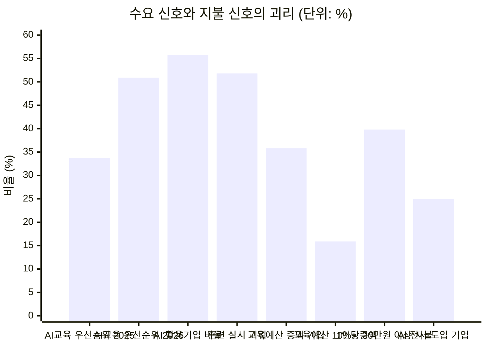

# 딥 리서치 — AI AX/DX 교육 중심 에듀테크 산업

리서치 수행 시점: 2026년 8월 · 적용 방법론: [딥 리서치 7단계](./methodology.md)

선행 문서 — [Ch01 5가지 힘](../01-porters-five-forces/case-01-ai-education-edtech.md)(압박 23/25, 이하 **[1A]**) · [Ch02 가치사슬](../02-value-chain/case-01-ai-education-edtech.md)(**[2A]**) · [Ch03 KSF](../03-ksf/new-entrant-top5-ksf.md)(**[3]**)

분리 문서 — **[세그먼트 지도](./segment-map.md)**(정제 결과 시각화 3장) · **[SRS](./srs-ax-adoption-platform.md)**(7단계 제품 명세) · **[리서치 로그](./research-log.md)**(미해소 항목 · 선행 리서치 대조 · 다음 회차 설계)

---

## 0. 이 리서치가 검증하는 것

Ch01과 Ch02는 구조 분석이었고 둘 다 "검증이 필요한 가정" 체크리스트로 끝났습니다. 이 문서는 그 빈칸을 공개 데이터로 채웁니다.

Ch01의 진단은 한 문장이었습니다. **"시장은 빠르게 커지는데, 그 성장이 이익으로 남지 않는 구조다."** 두 개의 주장이 담겨 있고 각각 검증 대상입니다. 확인해 보니 **첫 번째 주장부터 수정이 필요**했습니다.

---

## 1단계 — 광범위한 탐색

> **던진 질문**: "국내 기업이 AI 역량 확보에 실제로 얼마를 쓰고 있으며, 그 지출이 어디로(교육·툴·컨설팅) 흘러가고, 왜 교육 사업자들은 그 성장을 이익으로 바꾸지 못하는가?"

원인(왜 이익이 안 남는가)과 규모(얼마를 쓰는가)를 한 질문에 결합했습니다. 두 축을 분리하면 원인은 Ch01의 반복이 되고 규모는 맥락 없는 시장조사 숫자가 됩니다.

탐색 결과 이 주제는 **신호가 갈라지는 영역**이었습니다. 확장 신호(교육훈련 실시율 3년 연속 상승, 생성형 AI 활용 기업 과반 돌파, 정부 AI 훈련 예산 증액)와 수축 신호(매출 상위 사업자 역성장, 교육 예산 동결 응답 최다, 1인당 교육비 기대치 연 30만 원 미만)가 공존합니다. 신호가 한 방향이면 확인만 하면 되지만, 갈라지면 그 사이에 구조가 있습니다.

---

## 2단계 — 범위 축소

| 제약 | 확정 내용 | 근거 |
|---|---|---|
| **대상** | 국내 **B2B 기업교육** 중심. B2G·구독형은 보조 축 | [1A] §0 승계. B2C·K-12는 구매 의사결정 구조가 달라 같은 축에 못 놓음 |
| **지역** | 국내(한국). 글로벌은 **비교 기준선**으로만 | 구매 단위(HRD·정부 훈련 예산)가 국가 제도에 종속 |
| **기간** | 2022~2026년 | 생성형 AI 상용화 이전(2022)이 기준선이어야 증가분이 계산됨 |
| **핵심 지표** | **비율 우선, 절대량 보조** | 국내 AI 교육만 분리한 공식 통계가 없음 |

**핵심 지표를 비율로 잡은 것이 가장 중요한 방법론적 결정입니다.** 국내에는 "AX 교육 시장 규모 O조 원" 같은 공식 수치가 없습니다. 없는 숫자를 추정으로 만들면 이후 모든 논증이 그 추정 위에 얹힙니다. 대신 실측 가능한 비율을 쌓아 규모를 후행적으로 좁혔습니다.

**제외**: K-12·AI 디지털교과서(예산 사이클이 별개), B2C 개인 강의([1A]에서 이미 붕괴 결론), 어학·법정의무교육(예산 경합 관계로만 다룸).

---

## 3단계 — 1차 분석: 수요는 실재하는가

### 3-1. 교육 수요가 커지고 있다 (사실)

| 지표 | 2022 | 2023 | 2024(최신) |
|---|---|---|---|
| 재직자 교육훈련 실시 기업 비율 | 39.4% | 43.7% | **51.8%** |
| 원격훈련 도입 기업 비율 | — | 38.6% | **58.4%** (+19.8%p) |
| 현장훈련(OJT) 실시 기업 비율 | — | 60.4% | **71.1%** (+10.7%p) |
| 2026년 훈련 실시 계획 기업 | — | — | **52.8%** |

3년 연속 상승이고 상승폭도 커지고 있습니다. 수요 확대는 논쟁의 여지가 없습니다.

### 3-2. AI가 교육 의제의 1순위가 됐다 (사실)

371개 기업 인사·교육 담당자 조사에서 가장 많이 투자한 교육 분야는 **2025년 AI 교육 33.7%(1위) → 2026년 계획 50.9%(1위)**. 1년 만에 **+17.2%p**로, 기업교육 안에서 AI의 지분이 절반을 넘어섭니다.

### 3-3. 수요의 원인도 확인된다 (사실)

| 지표 | 값 |
|---|---|
| 국내 기업 생성형 AI 활용률 | **55.7%** (2025) → 85% 전망 (2026) |
| 활용 기업 중 **전사** 도입 | **25.0%** (126/503개사) |
| 활용 기업 중 일부 부서만 | 75.0% (378/503개사) |
| 대기업 전사 활용률 | 35.1% (중소·중견의 2배 이상) |
| AI 도입 저해요인 | 1위 **기술·지식·전문성 부족 45%** / 2위 도구·플랫폼 부족 39% / 3위 높은 가격 33% |

**이 리서치 전체를 관통하는 사실이 여기 있습니다.** 도입률 55.7%인데 전사 확산은 25%. 도입 기업의 4분의 3이 일부 부서에서만 쓰고, 그 정체의 1순위 원인으로 기업이 직접 지목한 것이 **전문성 부족(45%)**입니다. 고객의 문제는 "AI를 모른다"가 아니라 **"도입했는데 퍼지지 않는다"** 입니다.

### 3-4. 교육을 해도 적용이 안 된다 (사실)

의사결정권자 330명(HRD 담당자·교육기획자·C레벨) 조사입니다.

| 지표 | 값 |
|---|---|
| AI 교육의 필요성에 동의 | **97%** |
| 교육 시행 기업 중 **실무 적용 애로 경험** | **82%** |
| AI 전환 장애요인 1위 | **직원 간 AI 활용 수준 차이 55%** |
| 현업 적용률 — **전사 동일 교육** | **11%** |
| 현업 적용률 — **역량 진단 기반 수준별 교육** | **32%** |
| AX 성숙도 — IT 대기업 / 제조·생산 중소기업 | 68점 / 28점 |
| AI 도입 실행률 — 대기업 / 중견 / 중소 | 76% / 50% / 46% |

**11%와 32%가 가장 값진 숫자입니다.** 진단 없이 전사에 같은 교육을 뿌리면 적용률 11%, 진단해 수준별로 나누면 32% — **3배 차이**이고 진단·개인화의 효과 크기에 대한 국내 실측치입니다.

동시에 경고입니다. **가장 잘한 경우도 32%**이고 나머지 68%는 여전히 적용되지 않습니다. 뒤의 솔루션 목표치는 이 실측 상한을 알고 세워야 합니다.

### 3-5. 그런데 사업자 실적은 반대 방향이다 (이상 신호)

| 사업자 | 2025 매출 | 전년 대비 | 2025 영업이익 |
|---|---|---|---|
| 멀티캠퍼스 | 3,308억 원 | **-6.2%** | 약 319억 원(역산) / **-18.1%** |
| 데이원컴퍼니 | 1,220.9억 원 | **-4.4%** | 48.5억 원 (상장 후 첫 흑자) |

수요 지표는 전부 상승, 상위 사업자 매출은 하락. **이 모순이 가설이 서는 자리입니다.**

---

## 4단계 — 가설 수립

3단계가 남긴 질문: *"수요가 확실히 커졌는데 왜 파는 쪽 매출은 줄었는가?"*

### 주 가설 (H1) — 대체 성장 가설

> **"AI 교육의 성장은 신규 예산의 유입이 아니라, 고정된 교육 예산 안에서 다른 교육 항목을 밀어낸 자리 이동이다."**
>
> **반증 조건**: 2026년 교육 예산을 늘리겠다는 기업이 과반이면 기각.

### 보조 가설

| # | 가설 | 반증 조건 |
|---|---|---|
| **H2** | 지불 의사 상한은 1인당 연 30만 원이며 이것이 계정당 매출 천장을 만든다 | 연 50만 원 이상 응답이 다수면 기각 |
| **H3** | 성패를 가르는 것은 사업 규모가 아니라 **사업 모델**이다 | 소규모·자산형 사업자도 함께 역성장하면 기각 |
| **H4** | 민간 B2B 예산 정체 중 실제 성장은 **B2G로 이동**했다 | B2G 성장률이 전체와 비슷하면 기각 |
| **H5** | 현업 밀착형 AX 영역(진단·업무 과제 실습·정착 계측)은 **선점되지 않은 빈 땅**이다 | 다수 사업자가 이미 같은 구성으로 영업 중이면 기각 |

**H5는 뒤늦게 추가된 가설입니다.** 처음에는 검증 대상이 아니라 전제로 깔았고, 그 전제 위에 7단계 솔루션을 세운 것을 발견해 [5-6](#5-6-h5-검증--빈-땅이-아니었다)에서 별도 검증했습니다. **결과는 기각**입니다.

H1이 참이면 [1A]의 "시장은 빠르게 커진다"를 **"수요는 커지지만 지출 총액은 커지지 않는다"** 로 수정해야 합니다. 커지는 파이에 들어가는 것과 고정된 파이에서 남의 몫을 빼앗는 것은 완전히 다른 전략을 요구합니다.

---

## 5단계 — 정량 검증

### 5-1. H1 검증 — 예산은 늘지 않는다

371개사의 2026년 교육 예산 계획: 동결 **44.5%** / 0~10% 증가 19.9% / 10% 이상 증가 15.9% / 0~10% 감소 8.6% / 10% 이상 감소 4.3% / 미정 6.7%
→ **증액 35.8% vs 동결·감액 57.4%**

**H1 지지.** 반증 조건("증액이 과반")은 충족되지 않았습니다.

왼쪽 네 개가 수요 신호, 오른쪽 네 개가 지불 신호입니다. 따로 보면 "AI 교육이 뜬다"와 "예산은 빠듯하다"라는 두 개의 사실이지만, 같은 축에 올리면 **하나의 구조**가 됩니다. AI 교육의 성장분 +17.2%p는 새 돈이 아니라 리더십·직무·조직문화 교육에서 빼앗아 온 자리입니다. 신규 진입자에게 이것은 성장 시장 진입이 아니라 **기존 교육 항목과의 예산 쟁탈전**입니다.

### 5-2. H2 검증 — 계정당 매출에는 천장이 있다

1인당 연간 적정 교육비: 10만 원 미만 15.4% / 10~30만 원 **44.5%** / 30~50만 원 26.1% / 50만 원 이상 13.7% → **30만 원 미만 59.9%**

**H2 지지.** 여기서 계정당 매출 상한을 계산할 수 있습니다(실측이 아닌 **구조적 추정**).

| 단계 | 계산 | 결과 |
|---|---|---|
| 1,000명 기업의 연간 교육 예산 | 1,000명 × 20만 원(구간 중앙) | **2.0억 원** |
| 그중 AI 교육 몫 | × 50.9% | **1.02억 원** |
| 복수 벤더 경쟁 반영 | ÷ 2~4개 벤더 | **2,500만~5,000만 원** |
| 연 매출 30억을 만들려면 | ÷ 계정당 3,500만 원 | **약 86개 대기업 계정** |

[1A]가 구매자 교섭력 5/5의 근거로 든 "구매자는 복수 벤더를 항상 옆에 세워둔다"가 여기서 금액으로 번역됩니다. **1,000명 대기업 한 곳에서 뽑을 수 있는 AI 교육 매출이 연 3,500만 원 안팎**이라면, 교육비 항목만으로 의미 있는 규모에 도달하는 경로는 산술적으로 막혀 있습니다. 문제는 제품 품질이 아니라 **청구하는 예산 항목**입니다.

### 5-3. H3 검증 — 규모가 아니라 사업 모델이 갈랐다

| 사업자 | 2025 매출 | 매출 증감 | 영업이익 | 영업이익률 | 지배적 수익 형태 |
|---|---|---|---|---|---|
| 멀티캠퍼스 | 3,308억 원 | **-6.2%** | 약 319억(역산) | 약 9.6% | 대기업 계열 종합 기업교육 |
| 데이원컴퍼니 | 1,220.9억 원 | **-4.4%** | 48.5억 | **4.0%** | B2C 성인교육 중심 |
| 휴넷 | 826.6억 원 | 미확인 | 미확인 | — | 구독형 멤버십·법정의무교육 |
| 팀스파르타 | 733.9억 원 | **+21.0%** | 95.0억 | **12.9%** | 부트캠프 + B2B AI 교육(**B2B 2.5배**) |
| 엘리스그룹 | 395억 원(연결) | 증가 | 52억 | **13.2%** | AI 교육 SaaS·클라우드 |
| 코드잇 | 307억 원 | **2023년 41억 → 7.5배** | 56억 | **18.2%** | 콘텐츠 자산 + 대기업 임직원 AI 교육 |

**H3 지지.** 매출 순서와 이익률 순서가 정확히 반대이고, **경계선이 1,000억 원**입니다. 1,000억 이상 두 곳은 모두 역성장, 1,000억 미만 네 곳은 모두 성장. 규모가 클수록 안 되는 것이 아니라 **큰 사업자들이 파는 것이 축소되는 상품**(범용 집합교육·B2C 성인교육)이라는 뜻입니다. [2A] §4의 진단 — "수익성은 강의를 잘하는 정도가 아니라 **사람이 하던 일을 재사용 가능한 자산으로 바꾼 정도**로 결정된다" — 가 실적으로 확인됐습니다.

**반증도 기록합니다.** 엘리스그룹은 영업이익이 2022년 83억 → 2025년 52억으로 **37% 감소**했고 원인은 감가상각비가 52억 → 126억으로 두 배 이상 늘어난 것입니다. **자산화는 곧바로 마진이 되지 않으며 선투자 구간에서는 오히려 이익을 깎습니다.**

### 5-4. H4 검증 — 성장은 B2G로 이동했다

데이원컴퍼니 2026년 1분기 부문별: **B2G 71억(+97%)** / 글로벌 51억(+33%) / B2B 28억(+24%) / 전사 303억(+12%) / 공헌이익률 53.1%(역대 최고).

**H4 지지.** B2G 성장률은 전사 평균의 8배입니다. 정책 측도 같은 방향입니다 — 2026년 고용노동부 예산 37조 6,761억(+6.6%), K-디지털 트레이닝 'AI 캠퍼스' 연 약 **1,300억 원**(AI 인력 1만 명 목표), 추경 KDT **+524억 원**.

민간 HRD 예산이 44.5% 동결인 동안 정부는 두 자릿수로 증액하고 있습니다. **예산이 실제로 늘어나는 곳은 정부 한 곳뿐입니다.**

### 5-5. 글로벌 기준선 — 성장률과 규모를 혼동하지 않기

| 지표 | 2026년 | 전망 | CAGR |
|---|---|---|---|
| 글로벌 기업교육 시장 전체 | $458.7B | $777.5B (2033) | 7.8% |
| 글로벌 AI 기반 기업교육 | **$7.49B** | $18.19B (2031) | **19.43%** |
| AI 교육의 전체 대비 비중 | **1.63%** | — | — |

성장률만 보면 2.5배 속도지만 **절대 규모는 전체의 1.6%**입니다. [1A] §3이 "성장률과 수익성은 다른 축"이라 경고했고, 여기에 하나를 더합니다 — **성장률과 규모도 다른 축입니다.** 19.43%는 사업계획서를 설득력 있게 만들지만 1.63%는 그 위에 세울 수 있는 사업의 크기를 제한합니다.

### 5-6. H5 검증 — 빈 땅이 아니었다

앞의 다섯 절은 **수요와 지불**을 봤습니다. 확인하지 않은 것이 하나 있었습니다 — **누가 이미 거기서 팔고 있는가.**

| 사업자 | 출신 | 제공 구성 | 청구 예산 | 공개 성과 주장 |
|---|---|---|---|---|
| 멀티캠퍼스 | 기업교육 1위 | KAIST 공동개발 **AX 역량진단(8대 역량·40항목)** → 풀스택 교육 → AI 스튜디오 실습 → **현업 해커톤·적용** | 교육비 | — |
| 팀스파르타 | 코딩 부트캠프 | 진단 기반 수준별 교육 + **에이전트 구축(무료 PoC)** | 교육비 + 구축비 | 실무 적용 성공률 98%, AI 역량 +160% |
| 원티드 AX | HR 플랫폼 | AI 인재 채용 + AX 플랫폼(Ennoia) + **4~9주 업무 중심 실습** + 맞춤 에이전트 개발(평균 6주) | 채용비 + 구축비 | 비개발 직원이 에이전트 150개 이상 구축 |
| 넥스트젠 AI | AX 전문 | **AI-Q·AI Gain으로 AI 활용 수준 L1~L5 등급화**, 분기 평가, 평가·보상·코칭 연결 | 진단·평가 | — |
| 상상력집단 | AX 원스톱 | 실습 교육 + **진단·정착·성과 측정 컨설팅** + AI 구매대행 + 솔루션 개발 | 복합 | — |
| axlab | AX 특화 | 맞춤 기업교육 + AI 전환 컨설팅 + 2~3일 합숙 워크숍 | 교육비 + 컨설팅 | **AI 활용률 8%→67%**, 업무효율 +34% |
| 한국AX교육연구원 | AX 특화 | 교육 + 컨설팅 + 구축, 제조·창업 특화, **현업 적용 결과물(MVP) 도출** | 미공개 | 미공개 |
| SK AX / 애커튼 / JYT AI / MSAP.ai | SI·컨설팅 | AX 전략·로드맵, 진단부터 전사 확산 | 컨설팅·구축비 | — |
| **KOSA AI AX 공동훈련센터** | 협회(정부사업) | **① AI 워크플로 진단 ② 실무자 AI 활용 훈련 ③ 실제 업무 과제 PBL** | **전액 무료**(고용부·산인공) | — |

**H5 기각.** 세 가지가 확인됩니다.

**① 서로 다른 출신이 같은 지점으로 수렴하고 있습니다.** [1A] 2-4는 컨설팅·SI를 교육의 **대체재**로 분류했지만, 실사 결과 이들은 **같은 제품을 파는 직접 경쟁자**가 됐습니다. 반대로 교육사는 컨설팅으로, HR 플랫폼은 교육·구축으로 넘어왔습니다. 대체재와 경쟁자의 경계가 사라진 상태입니다.

**② 기능 단위로 보면 이미 전부 선점돼 있습니다.** 조사한 12개 사업자 중 해당 기능을 공개 자료에서 확인할 수 있었던 곳의 수입니다.

| 기능 | 확인 수 | 상태 |
|---|---|---|
| 직무·역량 진단 | **8** | **레드오션** |
| 자기 업무 과제 기반 실습 | **7** | **레드오션 + 무료 공급 존재** |
| 에이전트·워크플로 구축 | **7** | **레드오션** |
| AI 활용률 계측 | **4** | **레드오션** |
| 성과 측정·ROI 리포트 | **3** | 경쟁 존재 |
| **직무 단위 도메인 깊이** | **1** | 부분 미선점(주장만, 레퍼런스 미공개) |
| **종료 후 유지율(90일) 계측** | **0** | **미선점** |
| **성과 연동 과금(risk-sharing)** | **0** | **미선점** |
| **고객사 귀속 사례 라이브러리** | **0** | **미선점** |

**③ 무료 대체재가 이미 이 영역에 들어와 있습니다.** KOSA AI AX 공동훈련센터는 고용노동부·한국산업인력공단 지원으로 **상시근로자 1,000인 미만 기업 재직자에게 전액 무료**로 진단·훈련·업무 과제 PBL을 제공합니다. 유료 AX 교육의 핵심 구성과 실질적으로 같습니다. [1A] 2-4가 경고한 "무료 콘텐츠가 가격 상한을 0 근처로 눌러버린다"가 범용 강의뿐 아니라 **현업 밀착형 AX 영역에서도 이미 발생**하고 있습니다.

> 5-2의 계정당 상한 계산에 하방 압력이 추가됩니다. 1,000인 미만은 무료 공급이 덮고 있으므로 유료 사업의 실질 표적은 **1,000인 이상 기업**으로 더 좁혀집니다.

---

## 6단계 — 반복 정제

초기 결론은 "AI 교육 시장은 수요는 있으나 돈이 안 된다"였습니다. 세분화해 보니 실행에 쓸 수 없을 만큼 뭉뚱그려져 있었습니다.

정제 결과를 한눈에 보는 3장의 차트는 별도 문서로 분리했습니다 → **[세그먼트 지도](./segment-map.md)**

### 정제 1 — "시장"을 구매 주체로 분해

| 세그먼트 | 예산 방향 | 성장률 | 전환비용 형성 | 신규 진입자 관점 |
|---|---|---|---|---|
| **B2C 성인교육** | 축소 | 역성장 | 없음 | 진입 금지 — 무료 대체재 직접 노출 |
| **B2B (HRD 예산)** | **동결 44.5%** | 저성장 | **가능** | 규모는 안 나오나 **자산이 쌓이는 유일한 곳** |
| **B2B (현업·DX 예산)** | 증가 추정 | 미측정 | 가능 | ~~미탐색 영역~~ → **12개 사업자가 이미 분할 점유**(5-6) |
| **B2G (정부 훈련)** | **증액** | **+97%** | 없음(매년 재입찰) | 현금흐름원. 동시에 **무료 공급으로 민간 단가를 누르는 압력원** |

**[1A] §4의 "B2G 매출 의존 금지"를 수정합니다.** 단일 구매자에게 가격 결정권을 넘긴다는 논거 자체는 여전히 옳습니다. 다만 데이터는 B2G가 **현재 유일하게 예산이 증가하는 세그먼트**임을 보여줍니다.

> **B2G는 의존 대상이 아니라 감가상각 회수 수단이다.** 모델 세대 교체로 콘텐츠가 조기 폐기되는 원가 구조([1A] 2-1, [2A] §4)에서 B2G는 이미 만든 콘텐츠의 제작비를 회수해 준다. 그러나 **전환비용과 축적 루프는 B2G에서 생기지 않는다** — 매년 재입찰로 관계가 리셋된다. 따라서 **현금은 B2G에서, 자산은 B2B에서.**

[3]의 KSF 3번(전환비용)과 4번(축적 루프)은 **B2B 계정에서만 성립합니다.**

### 정제 2 — "돈이 안 된다"를 예산 항목으로 분해

5-2의 계정당 상한 계산은 **우리가 HRD 교육비 항목에서 청구한다는 전제** 위에 서 있었습니다. 이 전제를 풀면 그림이 달라집니다.

| 청구 항목 | 예산 소유자 | 예산 방향 | 계정당 규모(1,000명 기업 추정) | 심사 기준 |
|---|---|---|---|---|
| 교육훈련비 | HRD | **동결** | 2,500만~5,000만 원 | 이수율·만족도 |
| AI 도입·운영비 | DX·IT | 증가 | 교육비의 수 배 | 도입 성과·활용률 |
| 현업 부서 사업예산 | 현업 부서장 | 성과 연동 | 부서 재량 | 업무 지표 개선 |
| 컨설팅·구축비 | 경영기획·DX | 증가 | 교육비의 수 배 | 프로젝트 산출물 |

[1A]는 컨설팅·SI가 "같은 예산을 두고 경합한다"고 했습니다. 정제해 보면 **같은 예산이 아니라 더 큰 예산**입니다. 컨설팅·구축은 교육비가 아닌 도입·운영 예산에서 나가며, 그 예산은 동결되지 않았습니다.

> **정제된 진단: 이 산업이 돈이 안 되는 것이 아니라, 교육비 항목이 돈이 안 되는 것이다.**

[2A] 2-4가 이미 이 경로를 설계했습니다 — "진단 → 파일럿 교육 → 전사 확산 → 사내 AI 도입 컨설팅". 리서치는 그것이 **선택지가 아니라 생존 조건**임을 숫자로 확인했습니다.

### 정제 3 — 고객의 문제를 다시 정의

AI 도입 55.7% / 전사 확산 25.0% / 정체 원인 1위 전문성 부족 45% / 교육 후 적용 애로 82%.

**미해결 과업은 "가르치는 것"이 아니라 "도입한 AI가 실제로 쓰이게 만드는 것"입니다.** 교육은 그 과업의 수단 중 하나일 뿐이며, 고객은 수단이 아니라 결과에 예산을 배정합니다. 이 재정의는 5-2의 천장 문제를 동시에 풉니다 — **"AI 정착률을 올린다"는 도입·운영 예산에서 청구할 수 있는 명분이지만, "AI 교육을 한다"는 교육비 항목을 벗어나지 못합니다.**

### 정제 4 — 차별화 축을 다시 잡는다

정제 2까지의 결론은 "청구 항목을 교육비에서 도입·운영 예산으로 옮기면 된다"였습니다. 5-6은 이것이 **불충분**하다는 것을 보여줍니다. 팀스파르타는 구축비로, 원티드는 채용비·구축비로, SI들은 컨설팅비로 이미 청구하고 있습니다. **예산 항목 이동은 차별화가 아니라 이미 진행된 업계 표준입니다.**

| 차별화 후보 | 상태 | 판정 |
|---|---|---|
| 좋은 커리큘럼 | 목차 공개 시 수주 내 복제([1A] 2-3) | 탈락 |
| 진단 체계 | 멀티캠퍼스 KAIST 8대·40항목, 넥스트젠 L1~L5 | 탈락 — **통과 요건** |
| 업무 과제 기반 실습 | 다수 + KOSA 무료 공급 | 탈락 |
| 활용률 계측 | 넥스트젠·axlab이 이미 판매 언어화 | 탈락 |
| 예산 항목 이동 | 업계가 이미 이동 완료 | 탈락 |
| **종료 후 지속성 계측(90일 유지율)** | 확인된 사업자 없음 | **유효** |
| **성과 연동 과금** | 확인된 사업자 없음 | **유효** |
| **고객사 귀속 자산 구조** | 경쟁사는 자사 플랫폼 락인 지향 | **유효** |
| **직무 단위 도메인 깊이** | 대부분 '직군별·수준별' 범용 축에서 경쟁 | **유효** |

> **경쟁자들은 모두 "교육 중"과 "교육 직후"를 판다. 아무도 "교육이 끝난 뒤"를 팔지 않는다.**

이 명제가 방어력을 갖는 이유는 원가 구조에 있습니다. 90일 유지율을 계측하려면 계약 종료 후에도 고객사 안에 데이터 수집 경로가 남아야 하고, 성과 연동 과금을 하려면 **자기 매출을 고객사 지표에 걸어야** 합니다. 둘 다 단기 매출에 불리해 경쟁자가 자발적으로 하지 않는 일이며, 바로 그래서 신규 진입자가 선점할 수 있는 자리입니다.

단 3-4의 실측 상한(적용률 최선 32%)을 모르고 성과 연동을 걸면 자기 매출을 스스로 깎습니다.

### 정제 5 — 표적 고객 규모를 좁힌다

| 기업 규모 | 무료 공급(KOSA 등) | 유료 사업 성립 |
|---|---|---|
| 1,000인 미만 | **전액 무료 대상** | 성립 어려움 — 가격 상한이 0 |
| 1,000인 이상 | 대상 아님 | **유일한 유료 표적** |

5-2가 1,000명 기업을 기준으로 삼은 것은 우연히 맞았습니다. 다만 이제 그것은 예시가 아니라 **하한선**입니다.

---

## 중간 정산 — 검증 결과와 한계

### 가설 판정

| 가설 | 판정 | 결정적 근거 |
|---|---|---|
| **H1** 성장은 신규 예산이 아닌 자리 이동 | **지지** | AI 교육 비중 +17.2%p vs 예산 증액 35.8%(동결·감액 57.4%) |
| **H2** 1인당 연 30만 원이 계정당 천장을 만든다 | **지지** | 30만 원 미만 59.9% → 계정당 2,500만~5,000만 원(추정) |
| **H3** 규모가 아니라 사업 모델이 성패를 가른다 | **지지(단서)** | 매출 순서와 이익률 순서 역전. 단 엘리스가 자산화 선투자 구간의 이익 감소를 보여줌 |
| **H4** 성장은 B2G로 이동했다 | **지지** | 데이원 B2G +97% vs 전사 +12%, KDT AI캠퍼스 1,300억 |
| **H5** 현업 밀착형 AX는 빈 땅이다 | **기각** | 12개 사업자가 동일 구성으로 영업, **정부 무료 공급까지 존재** |

**H5의 기각이 가장 값진 결과입니다.** 검증 없이 전제로 깔았던 것이 틀렸으므로 솔루션의 차별화 축을 정제 4에서 다시 세웠습니다.

### Ch01의 평가 수정

| 항목 | [1A] 원래 | 리서치 후 |
|---|---|---|
| 기존 경쟁 강도 | 4/5 ("성장에 가려진 강") | **5/5** — AX 영역은 이미 가려지지 않음 |
| 대체재 위협 | 5/5 (컨설팅·SI는 대체재) | 5/5 유지, 성격 변경 — **직접 경쟁자로 전환** |
| **압박 총점** | 23/25 | **24/25** |
| "시장은 빠르게 커진다" | — | **"수요는 커졌으나 교육 예산 총액은 커지지 않았다"** |
| "B2G 매출 의존 금지" | — | **"현금은 B2G, 자산은 B2B"** |

### Ch01·Ch02 체크리스트 해소 현황

| 검증 항목 | 상태 | 결과 |
|---|---|---|
| AI/AX 지출 규모와 성장률 | **부분 해소** | 절대 규모는 공식 통계 부재. 비중(33.7→50.9%)·예산 방향(동결 44.5%)으로 대체 |
| 정부 재정지원 훈련 예산 추이 | **해소** | 고용부 2026년 37.7조(+6.6%), KDT AI캠퍼스 1,300억, 추경 +524억 |
| 교육 후 현업 적용률의 실제 수준 | **해소** | 전사 동일 11%, 진단 기반 수준별 32% |
| 경쟁 사업자의 실제 제공 구성 | **해소** | 12개 사업자 실사 |
| 매출원가 중 강사료 비중 | **간접 해소** | 데이원 공헌이익률 53.1%가 변동비 구조의 대리 지표 |
| 벤더 교체 주기 / 전환비용 | **미해소** | 공개 데이터 없음. 벤더 2~4개 분할을 가정으로 사용 |
| **AX 예산의 교육/컨설팅/툴 배분 비율** | **미해소** | 정성적 구조까지만 확인. **다음 리서치 1순위** |
| 모델 제공사 무료 교육의 채택률 | **미해소** | 단 **협회·정부 채널의 무료 공급은 확인**(KOSA) |

### 이 리서치의 한계

1. **국내 AI 교육 시장의 절대 규모는 미확정입니다.** 5-2의 계정당 상한은 **구조적 추정**이며 벤더 분할 수(2~4개)는 가정입니다.
2. **휴넷 설문(371개사)은 표본 편향 가능성**이 있습니다. 응답 기업이 이미 기업교육에 관심 있는 집단일 수 있어 예산 동결 비율이 실제보다 낙관적일 수 있습니다.
3. **멀티캠퍼스 2025년 영업이익은 감소율에서 역산**한 값이며 공시 원문 대조를 하지 않았습니다.
4. **엘리스그룹 매출은 출처마다 351억(2024)·386억·395억(2025 연결)으로 상이**합니다. 본문은 2025년 연결 기준을 채택했습니다.
5. **B2B 현업·DX 예산 규모는 측정하지 못했습니다.** 정제 2의 핵심 주장이 이 미측정 값 위에 서 있으므로 **첫 PoC가 곧 이 가설의 실증 실험**이 되도록 설계했습니다.
6. **5-6의 경쟁사 정보는 대부분 자사 웹사이트·보도자료 기반입니다.** axlab의 "8%→67%", 팀스파르타의 "98%"는 산식·표본·측정시점이 없는 **판매용 자기 보고**입니다. 3-4의 독립 조사(최선 32%)와 크게 벌어지므로 **마케팅 언어의 증거**로만 읽었습니다.
7. **"미선점" 세 항목은 공개 정보에 없다는 뜻이며, 아무도 하지 않는다는 증명이 아닙니다.** 비공개 계약 형태로 존재할 수 있어 PoC 단계의 경쟁사 조사로 재확인이 필요합니다.
8. **3-4의 조사(330명)는 AI 교육 사업자가 발간한 리포트입니다.** "필요성 동의 97%"처럼 발간 주체 이해관계와 방향이 같은 항목은 상향 편향을 감안했습니다. 다만 "전사 동일 교육 11%"는 발간 주체에게 불리한 수치이므로 상대적으로 신뢰했습니다.

### 1~6단계의 결론

> 팔아야 할 것은 교육이 아니라 **AI 정착률**이고 청구서는 **AI 도입 예산을 쥔 부서**로 보내야 한다. **다만 거기까지는 이미 모두가 와 있다.** 남은 자리는 "교육이 끝난 뒤"를 계측하고 그 결과에 자기 매출을 거는 것뿐이다.

Ch01은 "커지는 파이에서 이익이 안 남는다"고 봤고, 리서치는 **"파이 자체가 안 커졌고, 커진 파이는 옆 접시에 있으며, 그 접시도 이미 붐빈다"** 는 것을 보여줍니다.

**Ch03 KSF와의 접속** — 리서치는 [3]의 5대 KSF를 부정하지 않고 조건을 붙였습니다.

| KSF | 리서치가 추가한 조건 |
|---|---|
| 1. 교두보의 극단적 협소화 | 도메인·**예산 항목**·**기업 규모(1,000인 이상)** 세 축으로. 경쟁 실사 결과 이 KSF의 중요도가 **더 올라갔다** |
| 2. 지불 근거의 선증명 | 지불 주체는 HRD가 아니라 **AI 도입 예산 소유자**. 단 그 이동만으로는 차별화가 안 된다 |
| 3. 전환비용의 인위적 설계 | **B2B 계정에서만 성립.** B2G는 매년 리셋됨 |
| 4. 축적 루프의 조기 가동 | 축적 대상은 콘텐츠도 활용률도 아니라 **종료 후 유지율 시계열** — 경쟁사가 안 가진 유일한 데이터 |
| 5. 원가 결정권의 내부화 | 자산화 선투자는 **일시적 이익 감소를 동반**한다(엘리스 사례) |

---

## 7단계 — 솔루션 도출

가칭 **AX 정착 계측 플랫폼**. 제품 명세(사용자·기능 요구사항·데이터·비기능·수용 기준)는 별도 문서로 분리했습니다 → **[SRS](./srs-ax-adoption-platform.md)**

여기에는 **리서치가 직접 결정한 것**만 남깁니다.

### 7-1. 한 문장 정의

> **하나의 직무에서 AI 정착률을 계약 종료 후 90일까지 계측하고, 그 수치에 자기 매출을 걸고, 축적된 사례를 고객사 자산으로 남기는 플랫폼.**

교육은 제품이 아니라 정착률을 올리는 수단 중 하나로 격하됩니다. 이 격하는 이제 차별화가 아니라 최소 요건입니다 — 멀티캠퍼스도 팀스파르타도 원티드도 같은 방향으로 와 있습니다. **차별화는 "언제까지 책임지는가"와 "무엇을 남기는가"에서만 발생합니다.**

### 7-2. 문제 → 기능 대응

방법론 7단계의 연결 규칙을 적용합니다 — **검증된 문제의 각 항목이 기능에 1:1로 대응해야 하며, 대응되지 않는 기능은 리서치가 아니라 취향에서 나온 것입니다.**

| # | 검증된 문제 | 근거 | 솔루션 기능 |
|---|---|---|---|
| P1 | 도입은 했으나 전사 확산 25% 정체 | 3-3 | 직무 단위 AI 실사용 계측·기준선 대비 추적 |
| P2 | 정체 원인 1위가 전문성 부족 45% | 3-3 | 범용 강의가 아닌 자기 업무 과제 기반 실습 |
| P3 | 교육 예산 동결 57.4% → 계정당 천장 | 5-1·5-2 | 도입·운영 예산 청구용 ROI 리포트 |
| P4 | 전환비용 0 | [1A] 2-2 | 사내 사례 라이브러리 + 인증의 사내 제도 편입 |
| P5 | 시간이 지나도 커지는 자산이 없음 | [3] KSF4 | 정착률·산출물 데이터 축적 루프 |
| P6 | 모델 세대 교체로 콘텐츠 조기 폐기 | [1A] 2-1 | 콘텐츠 모듈 태깅·모델 추상화 계층 |
| P7 | 강사 시간에 매출이 선형으로 묶임 | [2A] §4 | 자동 채점·AI 코칭으로 사람 개입 축소 |
| P8 | B2G는 성장하나 자산이 안 쌓임 | 정제 1 | B2G는 콘텐츠 감가상각 회수 채널로 분리 운영 |
| P9 | 자산화 선투자가 이익을 먼저 깎음 | 5-3 | MVP는 **컨시어지**(수동) 우선, 반복 확인 후 자동화 |
| **P10** | **진단·실습·활용률 계측이 12개 사업자에 선점** | 5-6·정제 4 | 세 기능은 통과 요건으로만. 차별화는 **종료 후 90일 유지율**과 **성과 연동 과금** |
| **P11** | **경쟁사는 자사 플랫폼 락인 지향** | 5-6 | 사례 라이브러리를 **고객사 자산으로 귀속** — 락인을 포기하고 신뢰를 얻는 역방향 설계 |
| **P12** | **1,000인 미만은 무료 공급이 덮고 있음** | 5-6·정제 5 | 표적을 **1,000인 이상**으로 한정 |
| **P13** | **경쟁사 주장(98%·8→67%)과 독립 조사(최선 32%)의 괴리** | 3-4·한계 6 | 리포트에 **산식·표본·측정시점 병기 의무화** — 검증 가능성 자체를 차별화로 |

### 7-3. 경쟁 포지셔닝

| 축 | 멀티캠퍼스 | 팀스파르타 | 원티드 AX | 넥스트젠 | KOSA(무료) | **이 솔루션** |
|---|---|---|---|---|---|---|
| 역량·업무 진단 | ○ | ○ | ○ | ○ | ○ | ○ 통과 요건 |
| 업무 과제 기반 실습 | ○ | ○ | ○ | — | ○ | ○ 통과 요건 |
| 활용률 계측 | — | ○ | — | ○ | — | ○ 통과 요건 |
| 에이전트·워크플로 구축 | ○ | ○ | ○ | — | — | **× 의도적 제외** |
| **종료 후 90일 유지율** | — | — | — | 계약 중 분기평가 | — | **○ 핵심** |
| **성과 연동 과금** | — | — | — | — | — | **○ 핵심** |
| **고객사 귀속 자산** | — | — | × 자사 플랫폼 | — | — | **○ 핵심** |
| **산식·표본 공개 의무** | — | — | — | — | — | **○ 핵심** |
| 도메인 단위 | 직군별 | 수준별 | 직무별 | 직무별 | 직무별 | **단일 직무 심층** |
| 표적 규모 | 대기업 전반 | 전 규모 | 전 규모 | 전 규모 | 1,000인 미만 | **1,000인 이상만** |

**에이전트 구축을 뺀 것이 가장 중요한 선택입니다.** 경쟁자 대부분이 확장한 고단가 영역이지만, 구축을 하면 **자기가 만든 것의 정착률을 자기가 계측하는 이해상충**이 생깁니다. 성과 연동 과금과 산식 공개를 차별화로 삼는 사업은 그 상충을 안을 수 없습니다. 구축은 고객사나 제3자에게 남기고 우리는 계측과 정착만 책임집니다.

### 7-4. PoC 설계

**PoC의 목적은 기능 검증이 아니라 [한계 5](#이-리서치의-한계)가 미측정으로 남긴 값의 실증**입니다. 따라서 1차 성공 기준은 학습 성과가 아니라 **"교육비가 아닌 예산에서 결제가 되는가"** 입니다.

| 항목 | 확정 내용 | 근거 |
|---|---|---|
| 도메인 | **1개만** (후보: 제조 품질검사 / 금융 규제 문서 / 병원 행정) | 경쟁사가 모두 범용 축에 있으므로 도메인 깊이가 유일한 비대칭 |
| 직무 | 도메인 내 **1개** | 계측 기준선이 비교 가능해야 함 |
| **기업 규모** | **상시근로자 1,000인 이상만** | P12 |
| 고객사 / 인원 | **3개사** / 사당 20~40명(해당 직무 전원) | 1개사는 우연을 못 배제, 5개사는 컨시어지 한계 초과 |
| 기간 / 운영 | **12주**(기준선 2 + 운영 8) + 유지 관찰 90일 / **컨시어지** | P9 — 선투자로 이익을 먼저 깎지 않기 위해 |
| 병행 조사 | 경쟁사 5개 이상의 **비공개 계약 형태 확인** | 한계 7 |

**성공 기준 (착수 전 확정)** — [3] KSF2의 "누가·어떤 지표·얼마"를 개발 착수 전에 문서로 확정하라는 요구를 이행합니다.

| 층위 | 지표 | 목표 | 실패 시 판단 |
|---|---|---|---|
| **사업 1차** | 3개사 중 **교육비가 아닌 예산 항목**으로 후속 계약 | **≥ 2개사** | 정제 2 기각 → 방향 재설계 |
| **차별화 1차** | 3개사 중 **성과 연동 조항** 수용 | **≥ 1개사** | 정제 4의 유효 축 붕괴 → 재설계 |
| 사업 2차 | 계정당 후속 계약 금액 | ≥ 8,000만 원/년 | 교육비 천장(3,500만) 미돌파 = 차별화 실패 |
| 성과 | 주 1회 이상 AI 실사용률 | 기준선 대비 **+30%p 또는 40% 이상** | 계측되나 효과 없음 → 학습 설계 재설계 |
| 성과 | 대상 업무 처리시간 절감 | **≥ 20%** | ROI 리포트의 근거 소멸 |
| **지속** | 종료 90일 후 유지율 | **≥ 50%** | 정착이 아니라 이벤트였음 |
| 운영 | 인당 운영 투입 | ≤ 3시간/12주 | 자동화 없이는 확장 불가 |
| 경쟁 | 경쟁사 5개에서 유지율 계측·성과 연동 확인 | **0~1건** | 2건 이상이면 차별화 축 재탐색 |

**목표치를 하향 조정했습니다.** 초안은 실사용률 60%였습니다. 3-4에서 진단 기반 수준별 교육의 적용률 최선값이 **32%**로 확인됐으므로 60%는 업계 최선의 2배를 첫 PoC에서 달성한다는 비현실적 전제였습니다. **40%로 낮추되 그것도 업계 최선을 상회하는 값**입니다. 경쟁사의 "98%", "8%→67%"는 산식이 공개되지 않아 기준으로 쓰지 않았습니다.

**반증을 우선합니다.** **사업 1차와 차별화 1차가 함께 실패하면 나머지가 모두 성공해도 이 솔루션은 기각**입니다. 성과는 좋은데 교육비에서 결제되고 성과 연동도 거부된다면, 잘 만든 교육 상품일 뿐 포화된 시장에서 이길 근거가 없습니다.

### 7-5. 의도적으로 만들지 않는 것

| 제외 항목 | 이유 |
|---|---|
| 범용 AI 강의 카탈로그 | 무료 대체재가 가격 상한을 0 근처로 누른다([1A] 2-4) |
| 자체 LMS | 외부 조달 대상([2A] 2-1). 경쟁력 원천이 아닌 것을 만들면 원가만 늘어난다 |
| 자체 모델 파인튜닝 | 모델 세대 교체 주기가 투자 회수 주기보다 짧다([1A] 2-1) |
| 개인(B2C) 구독 상품 | 역성장 세그먼트이며 계측할 '업무'가 없다(정제 1) |
| B2G 전용 제품군 | B2G는 **감가상각 회수 채널**로만. 전용 개발은 자산이 안 남는 곳에 투자하는 것(P8) |
| 만족도·이수율 대시보드 | 고객사가 돈을 낸 이유를 설명하지 못한다([2A] 2-2) |
| **AI 에이전트·워크플로 구축 수임** | 자기가 만든 것의 정착률을 자기가 계측하는 이해상충 |
| **1,000인 미만 대상 영업** | 정부 무료 공급이 같은 구성을 덮고 있다. 가격 상한 0(P12) |
| **자사 플랫폼 락인** | 경쟁사의 기본 전략이지만 의도적으로 포기. 락인 대신 사내 제도 편입으로 전환비용을 만든다 |
| **검증 불가한 성과 수치 마케팅** | 계측 신뢰도가 유일한 자산인데 그것을 스스로 훼손한다(P13) |

---

## 남은 질문

미해소 항목 전체, 다음 회차의 경쟁사 벤치마크 설계, 선행 리서치(Gemini·GPT)와의 대조, 그리고 이 리서치가 판단을 틀린 경위는 별도 문서로 분리했습니다 → **[리서치 로그](./research-log.md)**

결론의 신뢰도에 가장 큰 영향을 주는 두 항목만 여기 남깁니다.

- [ ] **기업 AI 예산의 교육/툴/구축 배분 비율** — 정제 2의 핵심 주장이 이 미측정 값 위에 서 있다
- [ ] **1,000인 이상 국내 기업의 실제 수** — 정제 5가 표적을 이 구간으로 한정했으므로 **TAM의 분모 그 자체**

---

## 출처

**공공 통계·정책**
- [2025년 기업직업훈련 실태조사 결과 — 고용노동부](https://www.moel.go.kr/info/publicdata/majorpublish/majorPublishView.do?bbs_seq=20260301088&searchDivCd=3) (2024년 기준, 10인 이상 기업)
- [기업직업훈련 실태조사 결과 공표 — 정책브리핑](https://www.korea.kr/briefing/pressReleaseView.do?newsId=156750376) · [기업 51.8%, 재직자 교육훈련 실시 — 헤럴드경제](https://biz.heraldcorp.com/article/10700025)
- [K-디지털 트레이닝 'AI 캠퍼스' — 고용노동부](https://www.moel.go.kr/news/enews/report/enewsView.do?news_seq=18833) · [KDT 추경 +524억 원 — 정책브리핑](https://www.korea.kr/news/policyNewsView.do?newsId=148963353)
- [2024년 이러닝산업 실태조사 — SPRi](https://spri.kr/posts/view/23880?code=stat_sw_e-learning_reports) · [기업체노동비용조사 — 뉴시스](https://www.newsis.com/view/NISX20250930_0003349865)

**기업 조사·설문**
- [휴넷 '2026 기업교육 전망' 설문(371개사) — 에듀플러스](https://www.eduplusnews.com/news/articleView.html?idxno=16925)
- [생성형 AI 활용 국내 기업 55.7% → 85% 전망 — 디지털경제뉴스](http://www.denews.co.kr/news/articleView.html?idxno=33506)
- [기업의 AI 도입 현황 및 촉진 방안 — KIAT 정책브리프 2025-06](https://katechtest.co.kr/assets/upload/information/%5B%EC%A0%95%EC%B1%85%EB%B8%8C%EB%A6%AC%ED%94%84%202025-06%5D%20%EA%B8%B0%EC%97%85%EC%9D%98%20AI%20%EB%8F%84%EC%9E%85%20%ED%98%84%ED%99%A9%20%EB%B0%8F%20%EC%B4%89%EC%A7%84%20%EB%B0%A9%EC%95%88%20%EB%B6%84%EC%84%9D_KIAT.pdf)
- [한국 기업의 AI 도입 요인 — 보안뉴스](https://m.boannews.com/html/detail.html?idx=107290) · [2025 HRD 트렌드 리포트 — 한국생산성본부](https://www.kpc.or.kr/download/pt/KPC_2025_HRD_Trend_Report.pdf)

**사업자 실적**
- [멀티캠퍼스 Snapshot — FnGuide](https://comp.fnguide.com/SVO2/ASP/SVD_Main.asp?pGB=1&gicode=A067280&MenuYn=Y&ReportGB=B&NewMenuID=Y&stkGb=701) · [멀티캠퍼스 1분기 영업이익 47억 — 디지털투데이](https://www.digitaltoday.co.kr/news/articleView.html?idxno=563267)
- [데이원컴퍼니 기업정보 — 혁신의숲](https://www.innoforest.co.kr/company/CP00000793/%EB%8D%B0%EC%9D%B4%EC%9B%90%EC%BB%B4%ED%8D%BC%EB%8B%88) · [1Q 매출 303억·B2G 97% 급성장 — 베타뉴스](https://www.betanews.net/article/view/beta202605180008) · [공헌이익률 역대 최고 — 벤처스퀘어](https://www.venturesquare.net/1083101)
- [휴넷 2025년 재무정보 — 사람인](https://m.saramin.co.kr/job-search/company-info-view/finance?csn=VEZ6R05ScWZydzd2VDI2Wm9NSHluZz09)
- [코드잇 매출 307억·영업이익 56억 — 아웃스탠딩](https://outstanding.kr/press/1828/20260318) · [2년 만에 매출 7.5배 첫 흑자 — 플래텀](https://platum.kr/archives/283645)
- [엘리스그룹 IPO — 디지털데일리](https://www.ddaily.co.kr/page/view/2026060610072367600) · [엘리스그룹 BM 분석 — 데모데이](https://demoday.co.kr/bm-analysis/246)
- [팀스파르타 2025년 매출 2.5배 성장 — 애크로팬](https://kr.acrofan.com/detail.php?number=418122) · [B2B AI 교육 매출 2.5배 — 플래텀](https://platum.kr/archives/278777) · [팀스파르타 재무평가 — 캐치](https://www.catch.co.kr/Comp/CompInfo/LD8514)
- [코드스테이츠 인력 절반 감축 — 한국경제](https://www.hankyung.com/article/202308258485i)

**경쟁 구도 실사 (5-6)**
- [팀스파르타 '2026 기업 AX 벤치마크 리포트'(330명) — beSUCCESS](https://besuccess.com/?p=185237)
- ["배우는 AI에서 실행하는 AI로" 멀티캠퍼스 AX 4단계 — 전자신문](https://www.etnews.com/20260622000408) · [멀티캠퍼스 AX 교육체계](https://www.multicampus.com/b2b/kr/ax/integration/)
- [원티드 AX](https://ax.wanted.co.kr/) · [스파르타AX](https://ax.spartaclub.kr/) · [넥스트젠 AI](https://www.nextgenai.kr/) · [상상력집단](https://imaginationgroup.co.kr/) · [axlab](https://axlab.kr/) · [한국AX교육연구원](https://www.sugolab.kr/education)
- [SK AX](https://www.skax.co.kr/ax-services/ax-consulting) · [애커튼파트너스](https://www.ackerton.com/business/ax)
- [**KOSA AI AX 공동훈련센터 — 1,000인 미만 기업 무료**](https://axedu.kr/ax-center) · ["AI 도입은 끝났다"…가르는 건 활용 역량 — 벤처스퀘어](https://www.venturesquare.net/1104216)

**글로벌 기준선**
- [Corporate Training Market Report 2026-2033 — Grand View Research](https://www.grandviewresearch.com/industry-analysis/corporate-training-market-report) · [AI-Powered Corporate Training Market — Mordor Intelligence](https://www.mordorintelligence.com/industry-reports/ai-powered-corporate-training-market) · [Corporate Training Statistics 2026 — Skillademia](https://www.skillademia.com/statistics/corporate-training-statistics)
