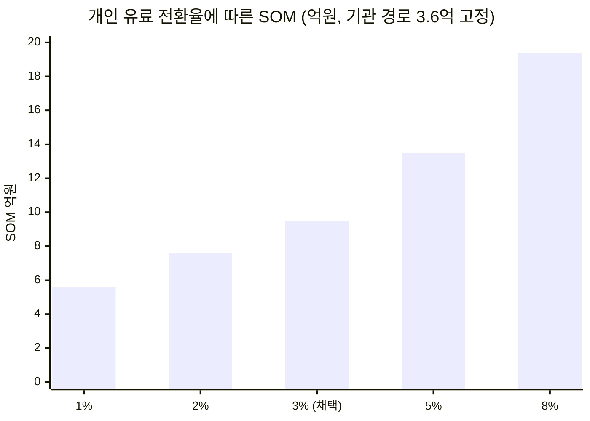

# 「콕집」 시장 규모 산정 근거 — 원천 데이터 · 계산 감사 · 미확정 항목

> **콕집** — 국비 교육·대학 강의를 녹음·태깅해, **현직자 관점의 우선순위로 복습할 것만 골라주는** 학습 앱

기준 시점: 2026년 8월 · 산정 결과: **[Ch04 사례 01 — 콕집](../case-01-kokjip-lecture-review-prioritizer.md)**

이 문서는 **누구든 산정을 재현하고 반박할 수 있게** 하는 것이 목적입니다.

> **표기 규칙** — 🟢 실측(공표 통계·공개 자료) / 🟡 유도(실측 두 개 이상의 교차) / 🔴 가정(근거 없음, 범위만 제시)

---

## 1. 원천 데이터 목록

### 1-1. 국비 직업훈련 (주 표적 세그먼트)

| # | 항목 | 값 | 등급 | 출처 |
|---|---|---|---|---|
| K1 | KDT 참여 인원 (2022) | 22,394명 | 🟢 | 서울경제 |
| **K2** | **KDT 참여 인원 (2024)** | **37,628명** | 🟢 | 동일 |
| K3 | KDT 예산 (2022 → 2024) | 3,068억 → **4,731억 원** | 🟢 | 동일 |
| **K4** | **KDT 수료생 취업률 (2022 → 2024)** | 62.6% → **54.2%** (**-8.4%p**) | 🟢 | 동일 |
| **K5** | **KDT 훈련기관 수** | **178곳** | 🟢 | 부패방지뉴스 |
| K6 | KDT 지원 총액 (2021~2023 상반기) | 4,198억 원 | 🟢 | 동일 |
| K7 | KDT 수료생·취업 (2021~2023) | 수료 16,397명 / 취업 10,476명(63.8%) | 🟢 | 동일 |
| K8 | 2026년 KDT 'AI 캠퍼스' | 연 약 1,300억 원, AI 인력 1만 명 | 🟢 | 고용노동부 |
| K9 | 2026 추경 KDT 증액 | +524억 원 | 🟢 | 정책브리핑 |
| **K10** | **국민내일배움카드 전체 연간 훈련 인원** | **미확정** | 🔴 | 검색으로 미확보 — §5 4순위 |
| **K11** | **국비 훈련기관 총수(KDT 외 포함)** | **미확정** | 🔴 | 기관 시장의 분모 — §5 3순위 |

**K4와 K5가 이 산정의 전략적 핵심입니다.** 취업률이 2년간 8.4%p 하락했고 훈련기관은 178곳뿐입니다. 즉 **지불 동기는 강하고 계정 수는 적습니다** — 기관 판매가 유망하되 규모에 한계가 있다는 두 결론이 여기서 동시에 나옵니다.

### 1-2. 학습자 모집단

| # | 항목 | 값 | 등급 | 출처 |
|---|---|---|---|---|
| P1 | 청년층(15~29세) 인구 | **797만 4,000명** (15세 이상 인구의 17.4%) | 🟢 | 2025년 5월 경제활동인구조사 청년층 부가조사 |
| P2 | 청년층 경제활동 참가율 | 49.5% | 🟢 | 동일 |
| P3 | 청년 비경제활동인구(유도) | 약 **403만 명** | 🟡 | P1 × (1−P2) |
| **P4** | **비경활 중 취업시험 준비자 비율** | **14.5%** | 🟢 | 동일 |
| P5 | 취업시험 준비자 수(유도) | 약 **58만 명** | 🟡 | P3 × P4 |
| **P6** | **취업시험 준비 분야** | 일반기업체 **36.0%** / 일반직공무원 **18.2%** | 🟢 | 동일 |
| **P7** | **1년 이상 미취업 청년** | **60만 5,000명** | 🟢 | 이투데이 |
| P8 | 에브리타임 MAU | **289만 명** (2023) | 🟢 | 디지털데일리 |
| P9 | 에브리타임 누적 가입자 | **700만 명** 돌파 (2024) | 🟢 | 머니투데이 |
| P10 | 에브리타임 잘파세대 사용자 비율 | 85.3% (2025) | 🟢 | 플래텀 |
| **P11** | **중복 제외 후 표적 모집단** | 약 **330만 명** | 🔴 | 추정 — §5 5순위 |

**P6이 세그먼트 제외 근거입니다.** 공무원 준비(18.2%)는 정답이 정해진 시험이라 현직자 인사이트가 무효이므로 제외했고, 일반기업체 준비(36.0%)가 표적에 가깝습니다.

**P7이 시장 경계를 정합니다.** 1년 이상 미취업 청년 60.5만 명은 절박도가 최대이지만 **강의를 듣고 있지 않으므로 태깅 대상이 없습니다.** 제품이 작동하지 않는 집단입니다.

### 1-3. 지불 단가와 무료 대체재

| # | 항목 | 값 | 등급 | 출처 |
|---|---|---|---|---|
| **F1** | **클로바노트 개인 요금제** | **무료** — 월 300분(개인정보 활용 동의 시 600분). **유료는 기업용만 존재** | 🟢 | 네이버웍스 요금 안내 |
| **F2** | **노션 학생·교육자 플랜** | **플러스 요금제 무료** (학교 이메일 인증) | 🟢 | 노션 요금제 정리 |
| F3 | 채택한 1인당 연 지불액 | **6만 원** (월 5,000원) | 🔴 | 유사 도구 가격대 추정 — §5 6순위 |
| F4 | 채택한 개인 유료 전환율 | **3%** | 🔴 | 프리미엄 앱 통상 3~5% 중 하한 — §5 1순위 |
| F5 | 채택한 기관당 연 라이선스 단가 | **1,000만 원** | 🔴 | 기관당 수강생 211명 × 월 3,000원 × 6개월 = 380만 원 대비 정액 프리미엄 — §5 2순위 |

**F1·F2가 이 산정의 가장 중요한 실측입니다.** "녹음 + 요약"이라는 기능 집합은 **이미 무료로 공급되고 있습니다.** 따라서 개인 지불의 상한이 구조적으로 눌려 있고, 유료 근거는 **현직자 인사이트 기반 우선순위** 하나에만 남습니다.

### 1-4. 교차 검증용

| # | 항목 | 값 | 등급 | 출처 |
|---|---|---|---|---|
| X1 | 개인 이러닝 지출 총액 (2023) | 2조 9,717억 원 (+7.3%) | 🟢 | 이러닝산업 실태조사 |
| X2 | 글로벌 코딩 부트캠프 시장 (2023) | **$899M** | 🟢 | 시장보고서 |
| X3 | 동 시장 2030 전망 | $2,411M (CAGR 15%) | 🟢 | 동일 |
| X4 | X2의 원화 환산 | 약 **1조 2,400억 원** (1,380원 기준) | 🟡 | 계산 |

---

## 2. 계산 재현

### 2-1. TAM (방식 B — 상향식, 개인 지불 기준)

```
[모집단]
  국비 직업훈련 수강생   20~40만 명   ← K2 3.76만(KDT 실측) + 기타 국비 추정 🔴
  대학 재학생            289만 명     ← P8 (에브리타임 MAU 대리)
  취업시험 준비생         58만 명      ← P5 (= P3 403만 × P4 14.5%)
  중복 제외 후           약 330만 명   ← P11 🔴

[단가]
  1인당 연 지불 가능액    6만 원       ← F3 🔴

TAM(이론 최대) = 330만 × 6만 원 = 약 2,000억 원
```

### 2-2. TAM (방식 A — 하향식)

```
개인 이러닝 지출        2조 9,717억   ← X1
 × 직무·취업 목적 50%   → 1조 4,900억  🔴
 × 학습 보조 도구 10%   → 약 1,500억   🔴
→ 방식 B(2,000억)와 같은 자릿수. 교차 검증 통과
```

### 2-3. TAM (방식 C — 계정 기반, 기관 지불 기준)

```
KDT 훈련기관              178곳        ← K5 🟢
기관당 연 수강생          211명        ← K2 ÷ K5 🟡
기관당 연 라이선스        1,000만 원    ← F5 🔴
KDT 기관 시장 전체 = 178 × 1,000만 = 약 17.8억 원
```

### 2-4. 괴리 분석 — 112배

```
방식 B (개인 이론)   2,000억
방식 C (기관 실측기반)   17.8억
                    → 112배 차이

원인 1: 방식 B는 무료 대체재를 무시했다
        F1 클로바노트 개인 무료 · F2 노션 학생 무료
        → 유료 전환 3%(F4) 반영 시 2,000억 → 약 59억
원인 2: 방식 C는 계정 수가 구조적으로 적다
        KDT 기관이 178곳뿐 (K5)

결론: 두 방식은 오차가 아니라 서로 다른 시장을 재고 있었다
      → TAM은 두 경로의 합으로 확정
```

### 2-5. TAM 확정과 SAM·SOM

```
[TAM 실현 가능]
  개인 지불   330만 × 3% × 6만 원        = 약 59억
  기관 지불   KDT 178곳 × 1,000만        = 약 18억
             + KDT 외 국비·대학 (미확정) = 약 30~80억 🔴
  TAM        = 약 110~160억 원

[SAM]
  TAM(이론) 2,000억
   ① 직무형 교육만 (×40% 🔴)        → 800억
   ② 복습 부채 큰 구간만 (×25% 🔴)   → 200억
  SAM = 약 200억 원

[SOM — 두 경로를 각각 쌓음]
  경로 A 개인 구독
    SAM 모집단 33만 (= 200억 ÷ 6만)
     × 3년 내 도달 30% 🔴 → 9.9만
     × 유료 전환 3% 🔴    → 2,970명
     × 6만 원             = 약 5.9억
  경로 B 기관 라이선스
    KDT 178곳 × 3년 내 20% 🔴 → 36곳
     × 1,000만 원              = 약 3.6억
  SOM(3년차, 기본) = 약 9.5억 원
```

### 2-6. 교차 검증 — 본 시장 대비 보조 도구 비중

```
글로벌 부트캠프 교육 시장   약 1조 2,400억 (X4, 2023)
국내 보조 도구 TAM          약 110~160억
→ 국내/글로벌 비율을 따지기 전에, 보조 도구가 본 교육 시장의
  수 % 수준이라는 통상 관계와 자릿수상 모순이 없음
→ 다만 이것은 방향 확인이며 정밀 검증은 아니다
```

---

## 3. 무료 대체재가 산정을 지배하는 구조

이 서비스의 산정에서 가장 결정적인 요인이므로 따로 남깁니다.

| 기능 | 무료 공급자 | 지불 근거로 성립하는가 |
|---|---|---|
| 강의 녹음 | 스마트폰 기본 앱, 클로바노트 무료 🟢 | **아니오** |
| 음성→텍스트 변환·요약 | 클로바노트 무료(월 300~600분) 🟢 | **아니오** |
| 노트 정리·자료 보관 | 노션 학생 플러스 무료 🟢 | **아니오** |
| 실시간 태깅 | 부분 대체 가능(타임스탬프 메모) | 약함 |
| **현직자 인사이트 기반 우선순위** | **없음** | **예 — 유일한 유료 근거** |
| **커리큘럼 맞춤 복습 리마인드** | 없음 | 예 |
| **포트폴리오 소재 도출·프로젝트 매칭** | 없음 | 예 — 단가 구조가 다른 시장 |

**[1A] 2-4가 "무료 콘텐츠가 가격 상한을 0 근처로 눌러버린다"고 진단한 구조가 학습자 측 도구에서도 그대로 반복됩니다.** 다만 눌리는 범위가 다릅니다 — 녹음·요약까지는 눌리고, **판단(우선순위)에는 무료 공급자가 없습니다.**

---

## 4. 민감도 분석

SOM의 62%가 개인 유료 전환에 걸려 있으므로 그 변수를 먼저 봅니다.



| 가정 | 채택값 | 범위 | SOM 영향 |
|---|---|---|---|
| **F4** 개인 유료 전환율 | **3%** 🔴 | 1~8% | **5.6억 ~ 19.4억** (3.5배) |
| **F5** 기관당 연 단가 | **1,000만 원** 🔴 | 500만~3,000만 | SOM 7.7억 ~ 16.7억 |
| K5 기관 3년 내 계약률 | 20% 🔴 | 10~40% | SOM 7.7억 ~ 13.1억 |
| P11 모집단 330만 명 | 🔴 추정 | 200만~450만 | SAM 121억 ~ 273억 |
| F3 1인당 연 지불액 6만 원 | 🔴 | 3.6만~12만 | SOM 7.1억 ~ 15.4억 |
| SAM 필터 ①② (40%·25%) | 🔴 | ±50% | SAM 100억 ~ 300억 |

**개인 전환율 하나가 SOM을 3.5배 움직입니다.** 그리고 이 값은 **무료 대체재의 존재 때문에 낙관하기 어려운 항목**입니다 — 랜딩 페이지 테스트로 가장 빨리 확인할 수 있으므로 검증 1순위입니다.

---

## 5. 미확정 항목과 확보 경로

| 순위 | 항목 | 확보 경로 | 난이도 |
|---|---|---|---|
| **1** | **개인 유료 전환율** | 랜딩 페이지 + 가격 제시 A/B 테스트, 또는 베타 사용자 유료 전환 실측 | 낮음 — 직접 실험 가능 |
| **2** | **훈련기관의 지불 의사와 단가** | KDT 훈련기관 5곳 이상 인터뷰. **취업률 방어라는 동기가 실제로 예산으로 이어지는지** 확인 | 낮음 — 인터뷰 |
| **3** | **국비 훈련기관 총수(KDT 외 포함)** | HRD-Net 훈련기관 조회, 고용노동부 직업능력개발 통계 | 낮음 — 조회 |
| **4** | 국민내일배움카드 연간 훈련 인원 | 고용노동부 직업능력개발 통계 연보 | 낮음 — 조회 |
| **5** | 표적 모집단의 중복 제외 후 규모 | 대학생·취준생·훈련생 교차 통계 | 중간 |
| **6** | 학습 보조 앱의 실제 ARPU·전환율 벤치마크 | 앱 분석 서비스(모바일인덱스 등) 유료 데이터 | 중간 |
| **7** | **채용·구인 연계 시장의 단가 구조** | 채용 플랫폼 수수료·성사 단가 조사 | 중간 — **전략적으로는 1순위** |

**7번은 난이도상 뒤에 있지만 전략적으로는 가장 중요합니다.** [Ch04 §7 ④](../case-01-kokjip-lecture-review-prioritizer.md#7-전략적-함의)가 "확장 기능이 본 수익원일 수 있다"고 결론냈고, 그 판단이 이 미확정 값 위에 서 있습니다. 확인되면 SOM의 상한 자체가 바뀝니다.

---

## 6. 출처

**국비 직업훈련**
- [KDT 취업률 2년새 8%P↓ — 서울경제](https://www.sedaily.com/article/14164937) (K1·K2·K3·K4)
- [KDT사업, 8,800억원 쓰고도 10명 중 4명은 취업 실패 — 부패방지뉴스](https://www.bbnnews.co.kr/news/articleView.html?idxno=37601) (K5·K6·K7)
- [K-디지털 트레이닝 'AI 캠퍼스' — 고용노동부](https://www.moel.go.kr/news/enews/report/enewsView.do?news_seq=18833) (K8)
- [KDT 추경 +524억 원 — 정책브리핑](https://www.korea.kr/news/policyNewsView.do?newsId=148963353) (K9)
- [K-디지털 트레이닝 제도 안내 — 고용24](https://m.work24.go.kr/cm/c/f/1100/selecSystInfo.do?systId=SI00000423&systClId=SC00000197)

**학습자 모집단**
- [2025년 5월 경제활동인구조사 청년층 부가조사 결과 — 정책브리핑](https://www.korea.kr/briefing/policyBriefingView.do?newsId=156721665) (P1·P2·P4·P6)
- [졸업 후 1년 넘게 백수 청년 60만 — 이투데이](https://www.etoday.co.kr/news/view/2606622) (P7)
- [에브리타임 MAU 289만·누적 가입 637만 — 디지털데일리](https://m.ddaily.co.kr/page/view/2023022011311623788) (P8)
- [에브리타임 누적가입 700만명 — 머니투데이](https://news.mt.co.kr/mtview.php?no=2024022617174893171) (P9)
- [잘파세대가 가장 많이 쓰는 앱 1위 에브리타임 — 플래텀](https://platum.kr/archives/263552) (P10)

**무료 대체재**
- [클로바노트 이용요금 — 네이버웍스](https://naver.worksmobile.com/pricing/clovanote/) (F1)
- [클로바노트 무료 요금제 300분 제한 총정리 — 스마트테크노트](https://smarttechnote.com/clovanote-guide/) (F1)
- [노션 가격·요금제 총정리 — 공여사들](https://gongysd.com/notion-guide/?bmode=view&idx=168004355) (F2)

**교차 검증**
- [2024년 이러닝산업 실태조사 — SPRi](https://spri.kr/posts/view/23880?code=stat_sw_e-learning_reports) (X1)
- [코딩 부트캠프 시장 규모·성장 분석 — GII](http://www.giikorea.co.kr/report/sky1285916-global-coding-bootcamp-market-size-share-growth.html) (X2·X3)
