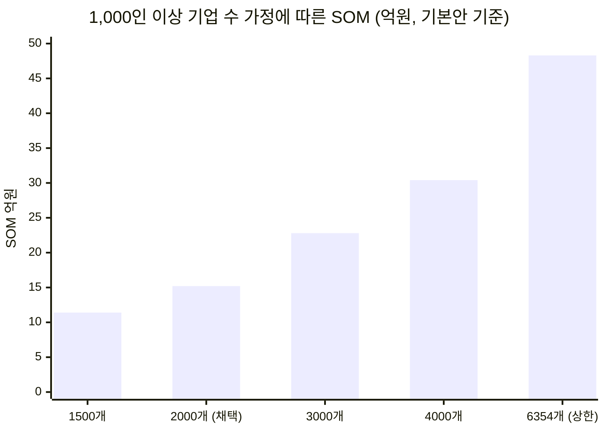

# 시장 규모 산정 근거 — 원천 데이터 · 계산 감사 · 미확정 항목

기준 시점: 2026년 8월 · 산정 결과: **[Ch04 사례 01](../case-01-ai-education-edtech.md)**

이 문서는 **누구든 산정을 재현하고 반박할 수 있게** 하는 것이 목적입니다. 본문이 결론이라면 여기는 그 결론을 지탱하는 숫자와, 지탱하지 못하는 숫자입니다.

> **표기 규칙** — 🟢 실측(공표 통계·공개 조사) / 🟡 유도(실측 두 개 이상의 교차) / 🔴 가정(근거 없음, 범위만 제시)

---

## 1. 원천 데이터 목록

### 1-1. 사업체·종사자 (분모)

| # | 항목 | 값 | 등급 | 출처 |
|---|---|---|---|---|
| D1 | 전체 사업체 수 (2024) | 635만 3,673개 | 🟢 | 전국사업체조사(잠정) |
| D2 | 전체 종사자 수 (2024) | 2,573만 1,105명 | 🟢 | 동일 |
| D3 | 300인 이상 사업체가 차지하는 사업체 수 비중 | **0.1%** | 🟢 | 동일(2023 기준) |
| D4 | 300인 이상 사업체가 차지하는 종사자 비중 | **15.1%** | 🟢 | 동일(2023 기준) |
| D5 | 300인 이상 종사자 수 | 약 **388만 명** | 🟡 | D2 × D4 |
| D6 | 300인 미만 종사자 수 | 약 **2,185만 명** | 🟡 | D2 − D5 |
| D7 | 공시대상기업집단 소속회사 수 (2026) | **3,538개** (102개 집단) | 🟢 | 공정거래위원회 |
| D8 | 300인 이상 사업체 수 | 약 **6,354개** | 🟡 | D1 × D3 |
| **D9** | **1,000인 이상 기업 수** | **약 2,000개** | 🔴 | **미공표.** 범위는 D7~D8 사이 |

**D9가 이 산정의 가장 약한 고리입니다.** 통계청·고용노동부 모두 **300인 이상을 하나로 묶어 공표**하고, 1,000인 이상 구간은 별도 공표하지 않습니다. 고용노동부 사업체노동력조사에 300~499 / 500~999 / 1,000인 이상 구분이 존재하나 원자료 조회가 필요합니다.

- 상한 근거: 300인 이상 사업체 6,354개(D8). 1,000인 이상이 이보다 많을 수 없다.
- 하한 근거: 공시대상기업집단 소속회사 3,538개(D7) 중 상당수가 1,000인 미만이므로 이 값 자체가 하한은 아니지만, 자릿수의 기준점이 된다.
- 채택값 2,000개는 **보수적 가정**이며 §4의 민감도에서 영향 범위를 계산했습니다.

### 1-2. 교육비 단가

| # | 항목 | 값 | 등급 | 출처 |
|---|---|---|---|---|
| E1 | 1인당 월평균 노동비용 (10인 이상 기업, 2024) | 636만 1,000원 (+3.8%) | 🟢 | 기업체노동비용조사 |
| E2 | 300인 이상 1인당 월 노동비용 | 775만 2,000원 | 🟢 | 동일 |
| E3 | 300인 미만 1인당 월 노동비용 | 529만 2,000원 | 🟢 | 동일 |
| E4 | 300인 이상 간접노동비용 | 170만 2,000원 | 🟢 | 동일 |
| E5 | 300인 미만 간접노동비용 | 94만 9,000원 | 🟢 | 동일 |
| **E6** | **교육훈련비 — 300인 미만은 300인 이상의 몇 %인가** | **15.2%** | 🟢 | 동일 |
| E7 | 1인당 연 적정 교육비 응답 분포 | 10만 미만 15.4% / **10~30만 44.5%** / 30~50만 26.1% / 50만 이상 13.7% | 🟢 | 휴넷 371개사 |
| E8 | 채택한 1인당 연 교육비 (300인 이상) | **20만 원** | 🔴 | E7 최다 구간의 중앙값 |
| E9 | 채택한 1인당 연 교육비 (300인 미만) | **3.04만 원** | 🟡 | E8 × E6 |

**교육훈련비의 절대 금액은 공표되지 않았습니다.** 기업체노동비용조사는 교육훈련비를 간접노동비용의 하위 항목으로만 다루며 금액을 따로 밝히지 않습니다. 확보한 것은 **규모별 비율(E6)** 뿐이고, 절대 금액은 설문 응답(E7)에서 가져왔습니다. 성격이 다른 두 출처를 결합했으므로 E8·E9는 정밀도가 낮습니다.

### 1-3. AI 교육 수요·예산

| # | 항목 | 값 | 등급 | 출처 |
|---|---|---|---|---|
| A1 | 2025년 최다 투자 교육 분야 | AI 교육 **33.7%** | 🟢 | 휴넷 371개사 |
| A2 | 2026년 중점 투자 예정 분야 | AI 교육 **50.9%** | 🟢 | 동일 |
| A3 | 2026년 교육 예산 계획 | 동결 44.5% / 증액 35.8% / 감액 12.9% | 🟢 | 동일 |
| **A4** | **AI 교육 예산 5,000만 원 이상 편성** | **대기업 38% · 중견기업 14%** | 🟢 | 팀스파르타 330명 조사 |
| A5 | 국내 기업 생성형 AI 활용률 | 55.7% (2025) → 85% 전망 | 🟢 | 업계 조사 |
| A6 | 활용 기업 중 전사 도입 / 일부 부서 | **25.0% / 75.0%** | 🟢 | 동일(503개사) |
| A7 | AI 도입 실행률 | 대기업 76% / 중견 50% / 중소 46% | 🟢 | 팀스파르타 |
| A8 | 범용 생성형 AI 활용률 | 88% | 🟢 | 동일 |
| A9 | 현업 적용률 | 전사 동일 교육 11% / **직무별 18%** / 진단 기반 32% | 🟢 | 동일 |
| **A10** | **AI 교육의 금액 비중** | **약 25%** | 🟡 | **A4에서 유도 — §3 참조** |

**A4가 이번 리서치의 가장 값진 신규 데이터입니다.** 이전 딥 리서치는 계정당 매출 상한을 2,500만~5,000만 원으로 **추정**했는데, A4는 대기업의 38%가 5,000만 원 이상을 편성한다는 **실측**입니다. 추정 상한이 대체로 맞았음을 확인해 주는 동시에, A10이라는 새 유도값을 만들었습니다.

### 1-4. 정부 예산 (B2G)

| # | 항목 | 값 | 등급 | 출처 |
|---|---|---|---|---|
| G1 | 2026년 정부 AI 예산 총액 | **9.9조 원** (역대 최대) | 🟢 | 국회예산정책처 |
| G2 | 부문 배분 | 기술개발 2.92조(28.8%) / **AX 2.61조(25.7%)** / 인프라 2.51조(24.7%) / **인재양성 1.38조(13.6%)** / 생태계 0.6조 | 🟢 | 동일 |
| G3 | 2026년 고용노동부 예산 | 37조 6,761억 원 (+6.6%) | 🟢 | 고용노동부 |
| G4 | KDT 'AI 캠퍼스' | 연 약 **1,300억 원**, AI 인력 1만 명 | 🟢 | 고용노동부 |
| G5 | 2026 추경 KDT 증액 | **+524억 원** | 🟢 | 정책브리핑 |
| G6 | B2G TAM 채택값 | **약 1,800억 원** | 🟡 | G4 + G5 |

**G2를 민간 예산 배분의 대리 지표로 쓴 것은 강한 가정입니다.** 정부는 인프라·기술개발에 편중될 수밖에 없고 민간의 배분은 다를 수 있습니다. 본문에서 "넓은 TAM 3~6조"를 자릿수 감각으로만 제시한 이유입니다.

### 1-5. 교차 검증용

| # | 항목 | 값 | 등급 | 출처 |
|---|---|---|---|---|
| X1 | 국내 이러닝 산업 총매출 (2023) | 5조 5,946억 원 (+4.6%) | 🟢 | 이러닝산업 실태조사 |
| X2 | 국내 이러닝 수요 총액 (2023) | 5조 7,078억 원 (+5.8%) | 🟢 | 동일 |
| X3 | 개인 이러닝 지출 (2023) | 2조 9,717억 원 (+7.3%) | 🟢 | 동일 |
| X4 | 글로벌 기업교육 시장 (2026) | $458.7B | 🟢 | Grand View Research |
| X5 | 글로벌 AI 기반 기업교육 (2026) | **$7.49B** (CAGR 19.43%) | 🟢 | Mordor Intelligence |
| X6 | X5의 원화 환산 | 약 **10.3조 원** (1,380원 기준) | 🟡 | 계산 |

---

## 2. 계산 재현

### 2-1. TAM

```
[민간 300인 이상]
  종사자         388만 명        ← D5 (= D2 2,573.1만 × D4 15.1%)
  × 1인당 교육비  20만 원         ← E8 🔴
  = 기업교육      7,760억 원
  × AI 금액 비중  25%            ← A10 🟡
  = 1,940억 원

[민간 300인 미만]
  종사자         2,185만 명      ← D6
  × 1인당 교육비  3.04만 원       ← E9 (= E8 × E6 15.2%)
  = 기업교육      664억 원
  × AI 금액 비중  25%
  = 166억 원

[정부 B2G]
  KDT AI캠퍼스   1,300억 원      ← G4
  + 추경         524억 원        ← G5
  = 1,824억 원 ≈ 1,800억 원

TAM = 1,940 + 166 + 1,800 = 약 3,900억 원
```

### 2-2. SAM

```
TAM                3,900억
 ① B2G 제외 (×54%)  → 2,100억    근거: 매년 재입찰로 자산 리셋
 ② 300인 미만 제외   → 1,940억    근거: E6 15.2% + KOSA 무료 공급
 ③ 1,000인 이상만    → 970억      🔴 가정 50%
 ④ 제품 형태 (×70%)  → 680억      🔴 가정
SAM = 약 680억 원
```

### 2-3. SOM

```
1,000인 이상 기업        2,000개    ← D9 🔴
 × 도메인 필터 (제조 25%)  → 500개    🔴 가정
 × S4 비중 (76% × 75%)    → 285개    ← A7 × A6
 × 3년 내 전환 (6.7%)     → 19개     🔴 영업 사이클 기반 가정
 × 계정당 8,000만 원                 ← PoC 후속계약 목표
SOM(3년차, 기본) = 약 15억 원
```

### 2-4. 교차 검증

```
[검증 1 — 글로벌 대비]
  TAM 전체 3,900억 / 글로벌 10.3조 = 3.8%
  민간만  2,100억 / 글로벌 10.3조 = 2.0%
  한국 GDP 세계 비중 ≈ 1.6%
  → 민간은 정상 범위. 전체가 높은 이유는 B2G 비중 46%

[검증 2 — 이러닝 산업 대비 (방식 A)]
  이러닝 수요 5조 7,078억 − 개인 2조 9,717억 = 2조 7,361억
  × 기업 비중 50% 🔴 = 1조 3,700억
  → 집합교육 포함 기업교육 1.5~2.0조로 추정
  vs 방식 B의 기업교육 8,424억
  → 방식 A가 약 2배 큼. 이러닝 수요에 교육기관·공공이 섞여 있고
    기업 비중 50% 가정이 과대일 가능성. 방식 B를 채택
```

---

## 3. A10(AI 교육 금액 비중 25%)의 유도

이 값이 TAM 전체를 좌우하므로 유도 과정을 남깁니다.

| 단계 | 계산 | 값 |
|---|---|---|
| ① 방식 B가 함의하는 1,000명 기업의 AI 교육 예산 | 1,000명 × E8 20만 원 × A2 50.9% | **1억 200만 원** |
| ② 실측 (A4) | 대기업 중 5,000만 원 이상 편성이 38% | 다수가 **5,000만 원 미만** |
| ③ 실측을 1인당으로 | 5,000만 원 ÷ 1,000명 | **5만 원/인** |
| ④ 전체 교육비 대비 | 5만 원 ÷ 20만 원 | **25%** |
| ⑤ 결론 | A2(50.9%)는 **우선순위 응답 비중**, A10(25%)이 **금액 비중** | |

**A2와 A10을 혼동하면 TAM이 2배 부풀려집니다.** 설문의 "가장 많이 투자한 분야"는 **응답자 수 비중**이고 예산 배분율이 아닙니다. [딥 리서치 §5-1](./case-ai-ax-edtech.md#5-1-h1-검증--예산은-늘지-않는다)이 "예산 총액은 늘지 않았다"고 확인했으므로, 1순위 항목조차 절대 금액은 제한됩니다.

**한계**: ③은 "5,000만 원 이상 편성 기업이 38%"라는 분포에서 대표값을 5,000만 원으로 잡은 것이며, 실제 평균은 그보다 높을 수 있습니다(상위 구간이 열려 있음). 즉 **A10 25%는 하한에 가깝습니다.**

---

## 4. 민감도 분석

가정값이 흔들릴 때 SOM이 얼마나 움직이는지입니다.



| 가정 | 채택값 | 범위 | SOM 영향 |
|---|---|---|---|
| **D9** 1,000인 이상 기업 수 | 2,000개 | 1,500~6,354개 | **11.4억 ~ 48.3억** (4.2배) |
| A10 AI 교육 금액 비중 | 25% | 20~40% | TAM 3,400~5,200억, SAM 545~1,090억 |
| 1,000인 이상 종사자 비중 | 50% | 35~65% | SAM 680억 ± 30% |
| 제품 형태 통과율 | 70% | 50~85% | SAM 485~825억 |
| 도메인 필터(제조 비중) | 25% | 15~35% | SOM 9.1~21.3억 |
| 3년 내 전환율 | 6.7% | 4~10% | SOM 9.1~22.7억 |

**D9 하나가 SOM을 4배 이상 움직입니다.** 따라서 이 값의 확정이 다음 리서치의 1순위입니다.

---

## 5. 미확정 항목과 확보 경로

| 순위 | 항목 | 확보 경로 | 난이도 |
|---|---|---|---|
| **1** | **1,000인 이상 기업 수** | 고용노동부 사업체노동력조사 원자료(1,000인 이상 구분 존재) 또는 KOSIS `DT_118N_SAUP50` 규모별 조회 | 낮음 — 조회만 하면 됨 |
| **2** | **기업 AI 예산의 교육/툴/구축 배분 비율** | 민간 조사 필요. 정부 예산 배분(G2)은 대리 지표에 불과 | 높음 — 공개 데이터 없음 |
| 3 | 300인 이상 기업의 1인당 실제 교육훈련비 금액 | 기업체노동비용조사 원자료(교육훈련비 항목 분리) | 중간 |
| 4 | 300~999인(중견) 기업 수와 AI 교육 예산 | 중견기업 실태조사 | 중간 |
| 5 | KOSA 등 정부 무료 공급의 실제 훈련 인원 | 한국산업인력공단 공동훈련센터 실적 | 중간 |
| 6 | 1,000인 이상 기업의 업종 분포 | 전국사업체조사 규모별×산업별 교차표 | 낮음 |

**1번과 6번은 조회만으로 해결됩니다.** 이번 산정에서 확보하지 못한 이유는 KOSIS 규모별 교차표가 웹 검색으로 노출되지 않고 직접 조회가 필요했기 때문입니다. 다음 회차의 첫 작업으로 둡니다.

---

## 6. 이전 딥 리서치와의 대조

[딥 리서치 로그](./research-log.md#4-미해소-항목)가 미해소로 남긴 항목의 진척입니다.

| 미해소 항목 | 이번 진척 |
|---|---|
| **기업 AI 예산의 교육/툴/구축 배분 비율** | **부분 해소** — 정부 예산 배분(인재양성 13.6% : AX 25.7% : 인프라 24.7%)을 대리 지표로 확보. 민간 실측은 여전히 없음 |
| **1,000인 이상 국내 기업의 실제 수** | **범위 확보** — 3,538~6,354개. 확정 실패. 조회 경로는 특정됨(§5 1번) |
| 계정당 단가의 실측 | **해소** — A4(대기업 38%가 5,000만 원 이상 편성)가 이전 추정(2,500만~5,000만 원)을 확인 |
| 교육 후 현업 적용률 | **추가 해소** — 직무별 교육 18%라는 중간값 확보(전사 11% / 진단 기반 32%) |

**새로 발견한 것**: A10 — "AI 교육 1순위 50.9%"는 우선순위 응답 비중이고 금액 비중은 약 25%. 이전 딥 리서치는 50.9%를 금액 비중처럼 사용했으므로([R] 5-2의 계정당 상한 계산), **그 계산은 상한을 약 2배 과대 추정**했습니다. 다만 결론(교육비 항목으로는 규모가 안 나온다)은 오히려 강화됩니다.

---

## 7. 출처

**공공 통계**
- [2024년 전국사업체조사 결과(잠정) — 국가데이터처](https://mods.go.kr/board.es?mid=a10301090300&bid=233&act=view&list_no=438719)
- [전국·산업별·규모별 사업체수 및 종사자수 — KOSIS](https://kosis.kr/statHtml/statHtml.do?orgId=118&tblId=DT_118N_SAUP50)
- [국내기업, 근로자 1명에 월 636만원…교육훈련비 대·중소 격차 커 — 뉴시스](https://www.newsis.com/view/NISX20250930_0003349865)
- [2023 회계연도 기업체노동비용조사 결과 — 정책브리핑](https://www.korea.kr/briefing/pressReleaseView.do?newsId=156653012)
- [2024년 이러닝산업 실태조사 — SPRi](https://spri.kr/posts/view/23880?code=stat_sw_e-learning_reports)
- [2026년 공시대상기업집단 지정 결과 — 공정거래위원회](https://www.ftc.go.kr/www/selectBbsNttView.do?pageUnit=10&pageIndex=1&searchCnd=all&key=12&bordCd=3&searchCtgry=01%2C02&nttSn=47410)

**정부 AI 예산**
- [AI 3대 강국 도약을 위한 예산 현황과 향후 과제 — 국회예산정책처](https://www.nabo.go.kr/board/file/down.do?fid=33319071)
- [2026년 예산안 총괄 분석 III](https://smallake.kr/wp-content/uploads/2025/04/2026%EB%85%84%EB%8F%84_%EC%98%88%EC%82%B0%EC%95%88_%EC%B4%9D%EA%B4%84_%EB%B6%84%EC%84%9D_%E2%85%A2.pdf)
- [K-디지털 트레이닝 'AI 캠퍼스' — 고용노동부](https://www.moel.go.kr/news/enews/report/enewsView.do?news_seq=18833)
- [KDT 추경 +524억 원 — 정책브리핑](https://www.korea.kr/news/policyNewsView.do?newsId=148963353)

**기업 조사**
- [휴넷 '2026 기업교육 전망'(371개사) — 에듀플러스](https://www.eduplusnews.com/news/articleView.html?idxno=16925)
- [**"AI 도입은 끝났다"…기업 경쟁력 가르는 건 '활용 역량'** — 벤처스퀘어](https://www.venturesquare.net/1104216) (A4·A8·A9 출처)
- [팀스파르타 '2026 기업 AX 벤치마크 리포트'(330명) — beSUCCESS](https://besuccess.com/?p=185237)
- [생성형 AI 활용 국내 기업 55.7% → 85% 전망 — 디지털경제뉴스](http://www.denews.co.kr/news/articleView.html?idxno=33506)

**글로벌 기준선**
- [Corporate Training Market Report 2026-2033 — Grand View Research](https://www.grandviewresearch.com/industry-analysis/corporate-training-market-report)
- [AI-Powered Corporate Training Market — Mordor Intelligence](https://www.mordorintelligence.com/industry-reports/ai-powered-corporate-training-market)
