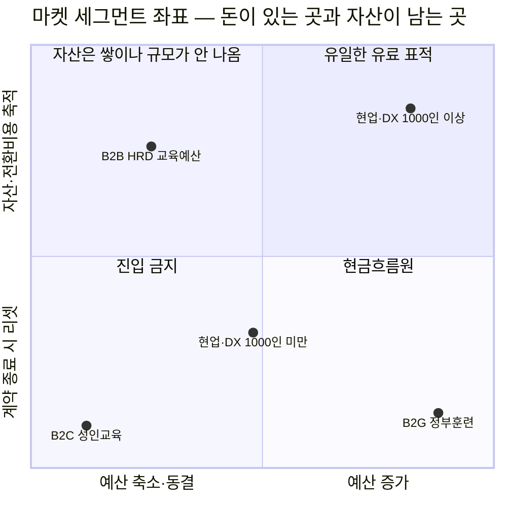
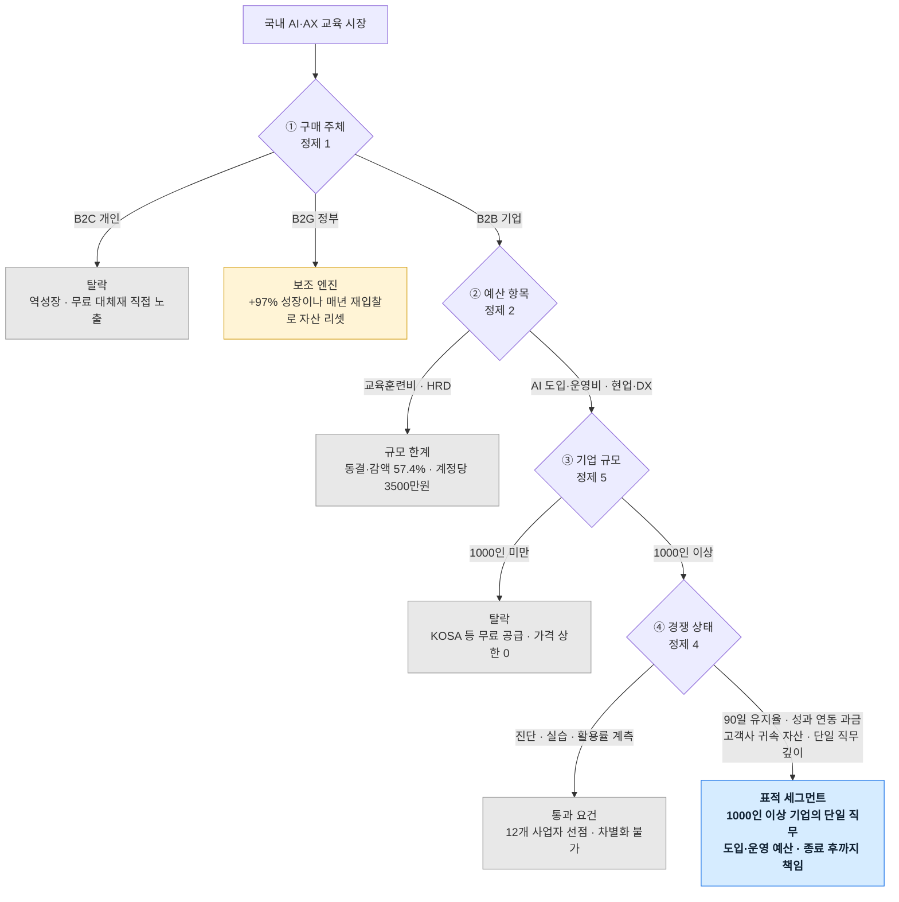
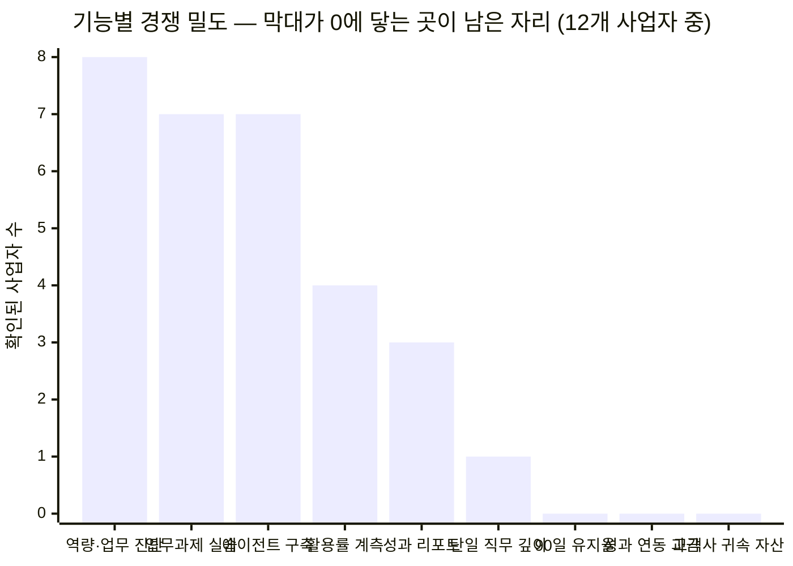

# 마켓 세그먼트 지도 — AI AX/DX 교육 산업

기준 시점: 2026년 8월 · 근거: **[딥 리서치 본문](./case-ai-ax-edtech.md)** 의 5단계 정량 검증과 6단계 정제

이 문서는 리서치가 쪼갠 세그먼트를 **한 번에 이해할 수 있는 형태**로 옮긴 것입니다. 새로운 주장은 없으며 모든 수치의 출처는 본문에 있습니다.

---

## 시각화 형식을 먼저 고른 이유

형식을 정하고 데이터를 끼워 맞추면 **없는 정밀도가 생깁니다.** 그래서 데이터의 구조를 보고 형식을 골랐습니다.

| 형식 | 이 데이터에 맞는가 | 판정 |
|---|---|---|
| **2×2 매트릭스(사분면)** | 세그먼트가 **두 개의 독립 조건**(예산이 늘어나는가 · 자산이 남는가)의 조합으로 정의된다. 이 두 축이 정제 1의 결론 "현금은 B2G, 자산은 B2B"를 그대로 만든다 | **채택 — 주력** |
| **깔때기형 분기도** | 정제 1→2→5가 **순차적 탈락 구조**다. 구매주체 → 예산항목 → 기업규모 → 경쟁상태 순으로 걸러지고 마지막에 하나만 남는다 | **채택 — 논리 추적** |
| **히스토그램(막대)** | 기능별 경쟁 사업자 수는 **단일 값의 순위 비교**다. 막대가 0에 닿는 항목이 곧 빈 자리이므로 공백을 부정할 수 없게 된다 | **채택 — 실행** |
| 산점도·좌표평면 | 2×2 매트릭스가 사분면 라벨까지 붙은 상위 호환 | 매트릭스로 대체 |
| **벤다이어그램** | 세그먼트가 **상호배타적**이어서 교집합이 거의 없다. 겹치는 것은 세그먼트가 아니라 사업자의 영업 범위이며 그것은 지도 3이 대신 보여준다 | 부적합 |
| **트리맵·파이** | 세그먼트별 **절대 규모 비교**에 최적이지만 국내 AI 교육 시장의 절대 규모는 리서치의 미확정 항목이다. 없는 값을 면적으로 그리면 **가장 설득력 있게 거짓말하는 차트**가 된다 | 부적합 |
| **산키(흐름도)** | 예산이 교육비·툴·구축으로 갈라지는 흐름에 최적. 그런데 그 배분 비율이 바로 리서치의 **1순위 미해소 항목**이다 | 보류 — 데이터 확보 후 |
| **히트맵** | 사업자 × 기능 격자에 적합하나 Mermaid에 네이티브 지원이 없고 같은 정보를 히스토그램이 더 단순하게 전달한다 | 히스토그램으로 대체 |

---

## 지도 1 — 세그먼트 좌표 (2×2 매트릭스)

두 축은 리서치가 실제로 측정한 것입니다. 가로축은 **예산이 늘어나는가**(5-1·5-4), 세로축은 **계약이 끝난 뒤 우리 자산이 남는가**(정제 1)입니다.

다섯 점이 네 사분면에 흩어진 것이 핵심입니다. **하나의 시장으로 보였던 것이 실제로는 처분이 정반대인 구역들의 집합**이었습니다.

| 세그먼트 | 위치 근거 | 전략적 처분 |
|---|---|---|
| B2C 성인교육 | 예산 축소 + 계측할 업무 없음 | 진입하지 않는다 |
| B2G 정부훈련 | KDT AI캠퍼스 1,300억·B2G +97% / 매년 재입찰로 관계 리셋 | **현금흐름원.** 콘텐츠 감가상각 회수에만 쓴다 |
| B2B HRD 교육예산 | 동결·감액 57.4% / 사내 제도 편입으로 전환비용 형성 가능 | 자산은 여기서 쌓되 규모를 기대하지 않는다 |
| 현업·DX 1,000인 미만 | 예산은 증가하나 **KOSA 무료 공급이 가격 상한을 0으로** | 표적에서 제외 |
| **현업·DX 1,000인 이상** | 예산 증가 + 자산 축적 가능 | **유일한 유료 표적.** 단 12개 사업자가 이미 진입 |

**우상단이 비어 있지 않다는 것이 리서치 초판과 개정판의 차이입니다.** 초판은 이 칸을 빈 땅으로 봤고, 경쟁 실사는 여기가 가장 붐비는 칸임을 보여줬습니다(가설 H5 기각).

---

## 지도 2 — 왜 하나만 남는가 (탈락 깔때기)

지도 1이 결과라면 이것은 과정입니다. 네 번의 분기에서 후보가 차례로 탈락합니다.

**요점은 탈락 사유가 전부 다르다는 것입니다.** B2C는 수요가 없어서, HRD는 예산이 없어서, 1,000인 미만은 무료 경쟁 때문에, 마지막 분기는 **경쟁자가 이미 있어서** 탈락합니다. 하나만 남는 것이 아니라 **남은 하나 안에서도 대부분이 이미 점유돼 있습니다.**

---

## 지도 3 — 기능별 경쟁 밀도 (히스토그램)

지도 2의 마지막 분기를 확대한 것입니다. 조사한 12개 사업자 중 해당 기능을 공개 자료에서 확인할 수 있었던 곳의 수입니다(카운트 근거는 [본문 5-6](./case-ai-ax-edtech.md#5-6-h5-검증--빈-땅이-아니었다)).

**세 개의 0이 리서치가 도달한 최종 답입니다.** 왼쪽 다섯(8·7·7·4·3)은 이제 차별화가 아니라 통과 요건입니다. 여섯 번째인 단일 직무 깊이는 1이지만 그 한 곳도 레퍼런스를 공개하지 않았으므로 사실상 공백에 가깝습니다. 오른쪽 세 항목을 아무도 하지 않는 이유는 어렵기 때문이 아니라 **단기 매출에 불리하기 때문**입니다. 신규 진입자가 자원 열위를 뒤집을 수 있는 자리는 통상 이런 형태로만 존재합니다.

---

## 세 지도를 함께 읽는 법

같은 시장을 배율만 달리해 본 것입니다.

| 지도 | 답하는 질문 |
|---|---|
| 1. 2×2 좌표 | 어디에 앉을 것인가 |
| 2. 탈락 깔때기 | 왜 거기만 남는가 |
| 3. 경쟁 밀도 | 그 안에서 무엇을 할 것인가 |

순서대로 읽으면 [7단계 솔루션](./case-ai-ax-edtech.md#7단계--솔루션-도출)의 기능 목록과 [SRS](./srs-ax-adoption-platform.md)의 우선순위가 그대로 도출됩니다.
