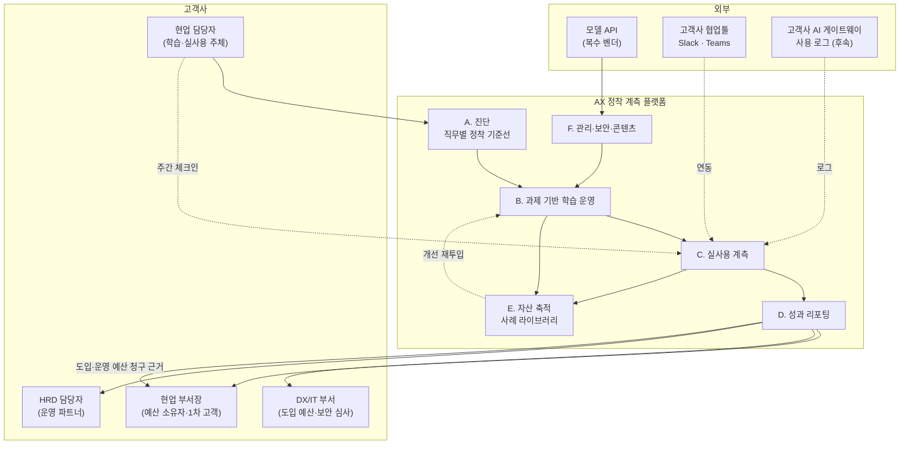

# SRS — AX 정착 계측 플랫폼

버전 0.1 (MVP 기준) · 대상 릴리스: PoC 통과 후 12주 내 MVP

근거 문서 — **[딥 리서치 본문](./case-ai-ax-edtech.md)**(문제 정의·경쟁 포지셔닝·PoC 성공 기준은 그쪽 7단계에 있음) · [Ch02 가치사슬](../02-value-chain/case-01-ai-education-edtech.md)(**[2A]**) · [Ch03 KSF](../03-ksf/new-entrant-top5-ksf.md)(**[3]**) · [세그먼트 지도](./segment-map.md)

이 문서는 **제품 명세만** 담습니다. "왜 이 제품인가"는 본문 7단계에, "어느 세그먼트인가"는 세그먼트 지도에 있습니다.

> **작성 규칙**: 본문 7-2의 문제 목록(P1~P13)에 대응되지 않는 요구사항은 넣지 않습니다. 대응 열이 빈 요구사항은 리서치가 아니라 취향에서 나온 것입니다.

---

## 1. 제품 정의

> **하나의 직무에서 AI 정착률을 계약 종료 후 90일까지 계측하고, 그 수치에 자기 매출을 걸고, 축적된 사례를 고객사 자산으로 남기는 플랫폼.**

교육은 제품이 아니라 정착률을 올리는 수단입니다. 차별화는 **종료 후 90일 유지율 계측(FR-C4) · 성과 연동 과금(FR-D6) · 고객사 귀속 자산(FR-E2) · 산식 공개 의무(FR-D3)** 네 항목에만 있습니다. 나머지는 통과 요건입니다.

---

## 2. 사용자

| ID | 사용자 | 핵심 목표 | 성공의 정의 |
|---|---|---|---|
| U1 | 현업 담당자 (학습자) | 내 업무를 AI로 실제로 처리하기 | 반복 사용할 만한 방법 1개를 얻는다 |
| **U2** | **현업 부서장 (1차 고객·예산 소유자)** | 부서 업무 지표 개선 | 지표 개선을 숫자로 보고할 수 있다 |
| U3 | HRD 담당자 (운영 파트너) | 운영 부담 없이 성과 증빙 확보 | 예산 집행 근거 문서가 자동으로 나온다 |
| U4 | DX/IT 부서 | 도입한 AI의 활용률 제고, 보안 준수 | 활용률 지표와 데이터 처리 근거를 확보한다 |
| U5 | 자사 운영자 | 다수 계정 동시 운영 | 인당 운영 시간이 규모에 비례해 늘지 않는다 |
| U6 | 자사 콘텐츠 담당 | 모델 세대 교체 대응 | 영향받는 모듈만 골라 갱신한다 |

**1차 고객은 U2입니다.** [2A] 2-4가 "현업 예산이 더 크고 성과 지향적"이라고 지목했고, 본문 정제 2가 예산 항목별 상한 차이로 이를 확인했습니다.

---

## 3. 시스템 컨텍스트

**읽는 법**
- **C(실사용 계측)는 가치의 원천이 아니라 통과 요건입니다.** 넥스트젠(AI-Q·AI Gain)과 axlab이 이미 활용률을 판매 언어로 쓰고 있습니다. 계측 안에서 차별화는 **FR-C4(종료 후 90일 유지율) 하나**에만 남아 있습니다.
- **E의 설계 방향이 경쟁사와 반대입니다.** 경쟁사는 자사 플랫폼 락인을 지향하지만 이 제품은 라이브러리를 고객사 자산으로 귀속시킵니다(FR-E2). 락인을 포기하는 대신 데이터 접근 권한과 신뢰를 얻고, [3] KSF3의 전환비용은 **사내 제도 편입**(FR-E3)으로 만듭니다.
- **E → B 되먹임 고리가 유일한 축적 구조**입니다([2A] §1). 여기가 끊기면 계측 기능이 붙은 교육 상품으로 되돌아갑니다.

---

## 4. 기능 요구사항

우선순위: **M**(Must, MVP 필수) / **S**(Should) / **C**(Could, 후속)

### A. 진단 — 정착 기준선 수립

| ID | 요구사항 | 우선순위 | 대응 |
|---|---|---|---|
| FR-A1 | 대상 직무의 **업무 단위(task) 목록**을 등록하고 각 업무의 현재 처리시간·빈도·AI 사용 여부를 기준선으로 수집한다 | M | P1 |
| FR-A2 | 개인이 아닌 **직무 단위로 집계**하며 개인 식별 정보 없이 리포트를 생성할 수 있다 | M | 보안·[2A] 2-1 |
| FR-A3 | 진단 결과를 학습 과제 추천의 입력으로 전달한다 (같은 자료를 두 번 요청하지 않는다) | M | [2A] 2-1 |
| FR-A4 | 동일 직무의 타 고객사 익명 집계값과 비교한 **벤치마크**를 제시한다 | C | P5 축적 효과 |

### B. 과제 기반 학습 운영

| ID | 요구사항 | 우선순위 | 대응 |
|---|---|---|---|
| FR-B1 | 학습자가 **자기 실제 업무 과제**를 등록하고 그 과제를 해결하는 형태로 실습이 진행된다 | M | P2 |
| FR-B2 | 고객사 데이터를 쓰는 실습은 **격리 환경**에서만 수행하고 외부 모델 전송 여부를 정책으로 제어한다 | M | 보안·[2A] 2-2 |
| FR-B3 | 산출물 제출·리뷰 흐름을 제공하고 **첫 과제 제출 단계의 이탈**을 별도 지표로 추적한다 | M | [2A] 2-2 |
| FR-B4 | 자동 채점 및 1차 피드백으로 사람 리뷰 대상을 축소한다 | S | P7 |
| FR-B5 | 진단 결과에 따라 학습자별 과제 난이도·경로를 조정한다 | C | P2 |

### C. 실사용 계측

| ID | 요구사항 | 우선순위 | 대응 |
|---|---|---|---|
| FR-C1 | 학습자의 **주간 실사용 체크인**(어떤 업무에 무엇을 썼는가, 소요 시간)을 수집한다 | M | P1 |
| FR-C2 | 협업툴(Slack/Teams) 연동으로 체크인을 업무 흐름 안에서 수행한다 | M | 응답률 확보 |
| FR-C3 | 기준선 대비 **직무별 실사용률 시계열**을 산출한다 | M | P1·P3 |
| **FR-C4** | 교육 종료 후 **90일 유지율**을 자동 측정한다. 계약 종료 후에도 계측 경로가 유지되도록 데이터 수집 동의를 계약에 포함한다 | M | **P10 — 경쟁사 미선점. 이 제품의 유일한 계측 차별화** |
| FR-C5 | 고객사 AI 게이트웨이·툴 사용 로그를 연동해 자기보고를 교차 검증한다 | C | 신뢰도 |
| FR-C6 | 실사용률 하락·미제출을 **이탈 신호**로 감지해 선제 개입 대상을 알린다 | S | [2A] 2-5 |

### D. 성과 리포팅

| ID | 요구사항 | 우선순위 | 대응 |
|---|---|---|---|
| FR-D1 | **경영진·부서장용 1페이지 리포트** 자동 생성: 기준선 대비 실사용률, 처리시간 절감 추정, 환산 금액, 유지율 | M | P3 |
| FR-D2 | 리포트 수신자를 **3종으로 분리**한다 (학습자 / HRD / 경영진·DX). 같은 문서를 돌리지 않는다 | M | [2A] 2-3 |
| **FR-D3** | 절감 추정의 **계산식·표본수·측정시점·자기보고 여부를 리포트 본문에 병기**한다 | M | **P13 — 경쟁사 성과 주장이 검증 불가하므로 검증 가능성 자체가 차별화** |
| FR-D4 | 리포트 생성은 수작업 없이 완료된다 (목표 5분 이내) | M | [2A] §4 마진 누수 |
| FR-D5 | 교육으로 해결되지 않는 원인(도구 미도입·데이터 미비·프로세스)을 **별도 항목으로 분리 제시**한다 | S | [2A] 2-3 |
| **FR-D6** | **성과 연동 과금 정산 산식을 시스템이 계산한다.** 합의된 기준선·목표·할인율·상하한을 입력받아 청구액을 산출하고 근거 데이터를 함께 출력한다 | M | **P10 — 경쟁사 미선점. 성과 연동의 전제는 산식이 자동 계산 가능해야 한다는 것** |

### E. 자산 축적

| ID | 요구사항 | 우선순위 | 대응 |
|---|---|---|---|
| FR-E1 | 검증된 산출물·프롬프트를 **고객사 사내 사례 라이브러리**로 축적하고 사내 검색을 제공한다 | M | P4 |
| **FR-E2** | 라이브러리는 **고객사 자산으로 계약상 귀속**되며 익명·집계 형태의 재사용 권리를 자사가 보유한다. 자사 플랫폼 밖으로 반출 가능한 포맷을 제공한다 | M | **P11 — 경쟁사의 락인 전략과 반대 방향**, [3] KSF4 |
| FR-E3 | 직무별 인증 체계를 제공하고 **고객사 사내 직무 등급·평가 제도에 편입**할 수 있는 데이터 포맷을 제공한다 | S | P4, [2A] 2-3 |
| FR-E4 | 학습자 질문·오답 패턴을 익명화해 콘텐츠 개선 백로그로 자동 분류한다 | S | P5 순환 고리 |

### F. 관리·보안·콘텐츠 운영

| ID | 요구사항 | 우선순위 | 대응 |
|---|---|---|---|
| FR-F1 | 콘텐츠 모듈에 **의존 모델·API·버전을 태깅**하고 모델 세대 교체 시 영향 모듈을 조회한다 | M | P6 |
| FR-F2 | 모델 호출은 **추상화 계층을 경유**하며 벤더 교체 시 실습 콘텐츠 수정이 발생하지 않는다 | M | P6, [3] KSF5 |
| FR-F3 | 작업 난이도에 따라 저비용 모델로 **라우팅**한다 (자동 채점·요약에 최상위 모델 금지) | S | [2A] 3-4 |
| FR-F4 | 고객사별 데이터 격리, 접근 권한 관리, 데이터 반환·삭제 | M | 보안 |
| FR-F5 | 다계정 동시 운영 대시보드 | S | U5 운영 확장성 |

---

## 5. 데이터 요구사항

**이 스키마가 곧 축적 자산의 형태**이므로 초기 확정이 필요합니다([3] KSF4 — "나중에 추가하려면 이미 체결한 계약을 다시 열어야 한다").

| 엔티티 | 핵심 속성 | 비고 |
|---|---|---|
| `Account` | 고객사, 산업, 규모, 계약 예산항목(교육비/도입운영비/현업예산) | **예산항목 필드가 정제 2 가설의 실증 데이터** |
| `JobRole` | 직무 코드, 도메인, 소속 부서 | 집계의 최소 단위 |
| `Task` | 업무명, 기준 처리시간, 빈도, AI 적용 가능성 등급 | FR-A1 |
| `Baseline` | 직무별 측정 시점, AI 사용률, 평균 처리시간 | 모든 성과 주장의 분모 |
| `UsageCheckin` | 주차, 직무, 사용 업무, 도구, 체감 절감시간, 자기보고 여부 | FR-C1. **개인 식별자 미저장** |
| `Deliverable` | 산출물, 검증 상태, 재사용 가능 여부 | FR-E1 |
| `PromptAsset` | 프롬프트, 적용 업무, 검증자, 모델 버전 | 모델 교체 시 영향 추적 |
| `ContentModule` | 모듈, 의존 모델·API·버전, 최종 갱신일 | FR-F1 |
| `ImpactReport` | 기간, 직무, 실사용률, 절감 추정, 계산 가정 | FR-D1·D3 |

**개인정보 원칙**: 성과 측정에 필요한 최소 항목만 수집하고 리포트는 직무 단위 집계로만 산출합니다([2A] 2-1). 개인 단위 데이터는 학습자 본인 피드백 목적으로만 보관하고 계약 종료 시 삭제합니다.

---

## 6. 비기능 요구사항

| ID | 분류 | 요구사항 |
|---|---|---|
| NFR-1 | 보안 | 고객사 데이터는 테넌트 단위 논리적 격리. 실습 데이터의 외부 모델 전송 여부를 계약 단위로 설정 가능 |
| NFR-2 | 개인정보 | 고객사에 대해 **처리 수탁자** 지위. 위탁 계약·마스킹 규칙·삭제 절차를 제품 기능으로 지원 |
| NFR-3 | 가용성 | 운영 기간 중 업무시간 가용률 99.5%. 주 모델 벤더 장애 시 **대체 모델 자동 전환**(FR-F2 전제) |
| NFR-4 | 성능 | 리포트 생성 5분 이내(FR-D4), 체크인 응답 3초 이내 |
| NFR-5 | 확장성 | 동시 20개 계정 / 2,000명 운영 시 자사 운영 인력 증가가 **선형 이하** |
| NFR-6 | 감사성 | 모든 성과 수치는 원천 데이터로 역추적 가능. 리포트에 산식·표본수·수집방식 병기 |
| NFR-7 | 이식성 | 특정 클라우드·LMS에 종속되지 않음. 고객사 데이터 **반출 포맷 제공** |
| NFR-8 | 접근성 | 비개발 직군이 이해할 수 있는 용어로 UI·리포트 작성 |

---

## 7. 외부 인터페이스

| 인터페이스 | 방향 | 우선순위 |
|---|---|---|
| 모델 API (복수 벤더, 추상화 계층 경유) | 송신 | M |
| Slack / MS Teams (체크인·알림) | 양방향 | M |
| 고객사 SSO (SAML/OIDC) | 수신 | M |
| 고객사 LMS (이수 데이터 반출) | 송신 | S |
| 고객사 AI 게이트웨이 사용 로그 | 수신 | C |
| 고객사 HR 시스템 (직무 등급 연계, FR-E3) | 송신 | C |

---

## 8. 제약 및 가정

**제약**
- 고객사 보안 심사가 도입 리드타임을 지배한다. AI 게이트웨이 로그 연동(FR-C5)을 MVP에 넣으면 일정이 심사에 종속되므로 뺐다.
- 기업교육은 상·하반기 집중이라는 계절성이 있다([2A] 3-2). 운영 인력 계획이 이 곡선을 전제해야 한다.
- 정부 재정지원 훈련(B2G)은 회계·단가 규제가 별도이므로 **원가와 조직을 분리**한다([2A] 3-1).

**가정** (틀리면 설계가 바뀌는 것들)

| # | 가정 | 검증 방법 |
|---|---|---|
| A1 | 현업 부서장이 AI 도입·운영 예산의 실질 집행 권한을 갖는다 | **PoC 사업 1차 기준으로 검증** |
| A2 | 자기보고 기반 실사용률이 의사결정에 쓸 만한 신뢰도를 갖는다 | 표본 실측으로 교차 검증 |
| A3 | 처리시간 절감의 금액 환산을 고객사 재무 부서가 수용한다 | PoC에서 조기 확인 |
| A4 | 도메인 특화와 모듈 재사용률은 상충한다([2A] §5) | 재사용률 상한을 실측해 원가 모델에 반영 |

---

## 9. MVP 범위

| 기능 | MVP | 근거 |
|---|---|---|
| A. 진단 | 포함 (템플릿 기반) | 계측 기준선이 없으면 나머지가 전부 무의미 |
| B. 과제 기반 학습 운영 | 포함 (최소) | P2 |
| C. 실사용 계측 — 자기보고·협업툴 연동 | 포함 | P1 |
| C. 실사용 계측 — **종료 후 90일 유지율** | 포함 | **P10 — 빼면 제품의 근거가 사라짐** |
| C. 실사용 계측 — AI 게이트웨이 로그 연동 | **제외** | 고객사 보안 심사 리드타임이 일정을 지배함 |
| D. 성과 리포팅 (경영진 1페이지) | 포함 | P3 — 재계약을 만드는 산출물 |
| D. **성과 연동 정산 산식(FR-D6)** | 포함 | **P10 — PoC 차별화 기준의 실행 수단** |
| E. 사례 라이브러리 | 포함 (수동 큐레이션, **고객사 귀속**) | P4·P5·**P11** |
| E. AI 튜터 | **제외** | P7의 해법이나 선투자 부담(P9). 반복 문의 패턴 확인 후 착수 |
| F. 콘텐츠 모듈 태깅 | 포함 (메타데이터만) | P6 |
| F. 다중 모델 추상화 계층 | 포함 | P6 — 나중에 넣으면 전면 재작업 |

---

## 10. 수용 기준 (MVP 릴리스 판정)

| # | 기준 |
|---|---|
| AC-1 | 신규 계정의 기준선 수립부터 첫 리포트 발행까지 **자사 운영 투입 8시간 이내** |
| AC-2 | 리포트 생성이 **수작업 0건**으로 완료 (FR-D4) |
| AC-3 | 직무별 실사용률·90일 유지율이 원천 데이터로 역추적 가능 (NFR-6) |
| AC-4 | 모델 벤더 1개를 교체해도 실습 콘텐츠 수정이 **0건** (FR-F2) |
| AC-5 | 고객사 데이터 반출·삭제 요청이 제품 기능으로 처리 (NFR-2·NFR-7) |
| AC-6 | 계정 3개 동시 운영 시 운영 인력 증가 없음 (NFR-5) |

---

## 11. 릴리스 로드맵

| 단계 | 기간 | 산출물 | 게이트 |
|---|---|---|---|
| **0. 도메인 확정** | 2주 | 도메인·직무 1개 확정 문서, 지불 주체 인터뷰 5건 | [3] KSF1·KSF2 충족 |
| **1. PoC (컨시어지)** | 12주 | 3개사 운영, 수작업 계측·리포트 | 본문 7-4의 사업 1차 + 차별화 1차 기준 통과 |
| **2. MVP** | 12주 | FR 중 M 항목 전부 | §10 수용 기준 전부 |
| **3. 확장** | 이후 | AI 튜터(FR-B4), 게이트웨이 연동(FR-C5), 벤치마크(FR-A4) | 반복 문의·요구 패턴 실측 후 착수 |

**단계 3을 뒤로 미룬 것이 이 로드맵의 핵심 결정입니다.** AI 튜터는 [2A]가 "최대 마진 레버"로 지목한 기능이지만, 엘리스그룹 사례(영업이익 -37%, 감가상각 52억→126억)는 자산화 선투자가 이익을 먼저 깎는다는 것을 보여줍니다. **반복 패턴이 데이터로 확인되기 전의 자동화는 감가상각비만 만듭니다.**

---

## 12. KSF 이행 점검

[3]의 5대 KSF가 실제로 실행되는지 확인합니다. 대응되지 않는 KSF가 있으면 아직 미완성이라는 뜻입니다.

| KSF | 리서치가 붙인 조건 | 이 제품에서의 이행 |
|---|---|---|
| 1. 교두보의 극단적 협소화 | 도메인 + **예산 항목** + **기업 규모** 3축 | 로드맵 단계 0(도메인·직무 각 1개) + 청구 항목 고정 + **1,000인 이상 한정**(P12) |
| 2. 지불 근거의 선증명 | 지불 주체는 **AI 도입 예산 소유자** | PoC 성공 기준을 착수 전 확정, 1차 기준을 '예산 항목'과 '성과 연동 조항 수용'으로 이원화 |
| 3. 전환비용의 인위적 설계 | **B2B 계정에서만** 성립 | FR-E3(사내 제도 편입)으로 형성. **플랫폼 락인은 의도적 포기**(FR-E2, P11) |
| 4. 축적 루프의 조기 가동 | 축적 대상은 **종료 후 유지율 시계열** | FR-C4를 축적 자산의 중심에. `Baseline`·`UsageCheckin` 스키마 초기 확정 |
| 5. 원가 결정권의 내부화 | 자산화 선투자는 **이익을 먼저 깎는다** | FR-F2·F3(모델 추상화·라우팅) + 로드맵의 컨시어지 선행 원칙 |

**경쟁 실사 후 KSF의 상대 중요도가 바뀌었습니다.** 초안은 KSF2(지불 근거)를 가장 시급하게 봤습니다. 12개 사업자가 이미 같은 지불 근거를 확보한 것이 확인되면서 **KSF1(협소화)이 다시 1순위**가 됐습니다. 경쟁자 전원이 '직군별·수준별' 범용 축에 있는 상태에서 신규 진입자가 가질 수 있는 비대칭은 단일 직무의 깊이뿐입니다.

---

## 13. 미결 사항

- **성과 연동 과금의 구체적 산식** — FR-D6이 계산 기능을 규정했으나 계수는 미정. 절감 금액의 몇 %를 청구할 것인가, 상·하한은. **본문 3-4의 실측 상한(적용률 최선 32%)을 반영해야 함**
- **계약 종료 후 90일 계측을 위한 데이터 수집 동의의 법적 형태**(FR-C4) — 계약이 끝난 뒤의 처리 근거를 무엇으로 둘 것인가
- 사례 라이브러리의 지식재산권 귀속 — 고객사 자산이면서 자사가 익명 재사용하는 구조의 계약 문구(FR-E2)
- 자기보고 절감시간의 인정 범위 — 고객사 재무 부서가 수용하는 할인율
- B2G 사업의 법인·회계 분리 시점
