# 사례 01-C — 페르소나 스펙트럼별 고객 여정지도

작성 시점: 2026년 8월 · 대상 서비스: **B2B AX 교육 플랫폼**

근거 문서
- [Ch05 여정지도 방법론](./methodology-journey-map.md) — 단계 도출 4신호 · 레인 6개 · 재사용성 판정
- [사례 01-B 페르소나 스펙트럼](./case-01-persona-spectrum.md) — 원본 12종
- [사례 01-A 기본 페르소나](./case-01-personas.md) — 구매 의사결정 관계
- [Ch04 세그먼트·SOM](../04-tam-sam-som-market-segment-map/case-01-ai-education-edtech.md) — **[4]**

---

## 0. 등장 인물 — 누구의 여정인가

여정지도는 사람의 이야기이므로 **코드가 아니라 프로필로** 부릅니다. 아래 열두 명이 이 문서에 등장하며, 본문에서는 오른쪽의 **호칭**으로만 지칭합니다.

### 주인공 네 명 (유형별 1명)

| 유형 | 호칭 | 프로필 |
|---|---|---|
| **Core** | **생산기술팀장** | 1,200명 규모 **자동차 부품사**의 생산기술팀장(42세). 품질검사 리포트·공정 이상 분석을 관장하고, 부서 사업예산과 AI 도입·운영 예산의 실질 집행권을 가짐. 「툴은 이미 있다」 |
| **Adjacent** | **공공기관 교육담당자** | 직원 800명 **준정부기관** 인사혁신부 교육담당(40세). 연간 교육계획과 조달 발주 담당. 「전례가 있는가」 |
| **Extreme** | **폐쇄망 설비담당자** | **반도체 소재 공장** 설비보전 담당(37세). 3교대 근무, 외부 인터넷 차단 구역, 개인 PC 없이 공용 단말 1대를 6명이 공유. 「접속할 방법이 없다」 |
| **Non-user** | **보험사 준법감시인** | **보험사** 준법감시실 부장(48세). 개인정보·감독규정 준수 총괄. 사내 생성 AI 사용을 원칙적으로 제한하는 결정의 주체. 「사고 나면 기관 제재」 |

### 여정에 함께 등장하는 여덟 명

| 호칭 | 프로필 | 이 여정에서의 위치 |
|---|---|---|
| **HRD 파트장** | 금융지주 인재개발원 HRD 파트장(38세). 연간 교육계획·벤더 선정·예산 집행 증빙 담당 | 벤더 선정 실무를 쥔 **게이트키퍼** |
| **DX 팀장** | 유통 대기업 DX추진팀장(45세). 전사 AI 게이트웨이 운영, 라이선스 갱신, 외부 벤더 보안 심사 | **보안 게이트**이자 활용률 압박의 당사자 |
| **품질검사 담당자** | 생산기술팀 소속 품질검사 실무자(31세). 일일 검사 리포트·부적합 이력 정리 | 성과의 **유일한 원천** |
| **AI 챔피언 선임** | 생산기술팀 선임 엔지니어(35세). 공식 직무는 공정 분석이나 팀의 AI 창구 역할, 프롬프트 문의를 하루 5~6건 받음 | 발주를 거치지 않는 **비공식 확산 채널** |
| **대학 CTL 팀장** | 4년제 사립대 교수학습개발센터 팀장(44세). 교원·교직원 역량개발 담당 | Adjacent 분기 — 조달 대신 자율 참여 모집 |
| **로펌 KM 팀장** | 중대형 법무법인 지식관리 팀장(41세). 변호사 200여 명, 서면 템플릿·판례 지식베이스 운영 | Adjacent 분기 — 파트너 설득이 조달을 대체 |
| **25년차 품질보증 실무자** | 제조사 품질보증팀 25년차 실무자(56세). 도메인 지식은 팀 최고, 새 도구 학습에서 반복 실패 | Extreme 분기 — 기술 제약이 아니라 체면이 장벽 |
| **중견기업 AI TF 리더** | 중견 제조사(600명) 경영기획팀 AI TF 리더(39세). 대표 직속 과제로 사내 AI 전환을 맡음 | Non-user 분기 — 자체 제작으로 대체 |

> 원본 12종의 상세 카드(문제·목표·감정·대체 솔루션 전문)와 유형 코드는 [사례 01-B](./case-01-persona-spectrum.md)에 있습니다. **모든 인물은 가상이며 실제 인물·기업과 무관합니다.**

---

## 1. 작성 원칙 — 방법론을 어떻게 적용했는가

방법론의 두 규칙이 이 문서의 구조를 정했습니다.

| 규칙 | 적용 |
|---|---|
| **주인공 1명을 고정한다.** 섞으면 여정이 아니라 평균이 되고, 평균에는 이탈 지점이 없다 | 스펙트럼 4유형에 **각각 주인공 1명**을 세워 여정지도 4개를 그렸습니다. 나머지 여덟 명은 **"어디서 갈라지는가"** 로 붙여 12종 전부를 담았습니다 |
| **범용 5단계를 그대로 쓰지 않는다.** 단계는 경계를 찾은 결과여야 한다 | 네 유형 모두 [4신호](./methodology-journey-map.md#2-2-단계-경계를-찾는-네-가지-신호)로 단계를 새로 도출했고, **그 결과 네 여정은 단계 수도 끝나는 지점도 다릅니다** |

**추정 표기** — 🟢 리서치 수치로 뒷받침 / 🟡 유추 / 🔴 순수 가설(인터뷰 검증 필요)

---

## 2. 네 여정은 다른 곳에서 끝난다

**줄의 길이가 곧 여정의 길이**입니다. 위아래로 훑으면 어느 여정이 어디까지 가는지 모양만으로 보입니다.

```mermaid
graph TB
    subgraph CORE["Core · 생산기술팀장 — 재계약까지 간다"]
        direction LR
        c1["① 성과 부재 자각"] --> c2["② 원인 탐색"] --> c3["③ 벤더 물색"] --> c4["④ 예산 항목 결정"] --> c5["⑤ 승인 게이트 대기"] --> c6["⑥ 착수·실사용 확산"] --> c7["⑦ 성과 보고"] --> c8["⑧ 90일 유지·재계약"]
    end

    subgraph ADJ["Adjacent · 공공기관 교육담당자 — 감사 방어로 끝난다"]
        direction LR
        a1["① 기관장 지시"] --> a2["② 무료 과정 우선 검토"] --> a3["③ 전례 조사"] --> a4["④ 조달 방식 결정"] --> a5["⑤ 공고·입찰 대기"] --> a6["⑥ 집행·운영"] --> a7["⑦ 감사 증빙 정리"]
    end

    subgraph EXT["Extreme · 폐쇄망 설비담당자 — 4단계에서 끊긴다"]
        direction LR
        e1["① 공지 구두 전달"] --> e2["② 접속 시도 → 실패"] --> e3["③ 교대 충돌 확인"] --> e4["④ 비공식 우회"] --> e5(("여정 종료<br/>구매 후 미도달"))
    end

    subgraph NON["Non-user · 보험사 준법감시인 — 구매에 도달하지 않는다"]
        direction LR
        n1["① 검토 요청 수신"] --> n2["② 데이터 흐름 확인"] --> n3["③ 외부 전송 발견"] --> n4["④ 반대·조건부 유보"] --> n5["⑤ 금지 규정 문서화"] --> n6(("재진입 조건<br/>격리 입증 시"))
    end

    classDef core fill:#33BBFF,stroke:#333,color:#111;
    classDef adj fill:#33FFBB,stroke:#333,color:#111;
    classDef ext fill:#FF3322,stroke:#333,color:#fff;
    classDef non fill:#DDDDDD,stroke:#333,color:#111;
    class c1,c2,c3,c4,c5,c6,c7,c8 core;
    class a1,a2,a3,a4,a5,a6,a7 adj;
    class e1,e2,e3,e4,e5 ext;
    class n1,n2,n3,n4,n5,n6 non;
```

### 범용 5단계에서 무엇을 승격·추가했는가

방법론 경고에 따라 **범용 골격을 그대로 쓰지 않았고**, 승격·추가한 단계와 이유를 남깁니다.

| 승격·추가한 단계 | 누구의 여정 | 승격 이유 |
|---|---|---|
| **④ 예산 항목 결정** | 생산기술팀장 | 교육비로 분류되면 계정당 3,500만 원 상한에 갇힌다 🟢([4] 5-2). **이 단계를 틀리면 뒤가 전부 무효** |
| **⑤ 승인 게이트 대기** | 생산기술팀장 | 담당자가 바뀌고(HRD 파트장·DX 팀장) 기다림이 발생한다. 심사 리드타임이 도입 일정을 지배 🟡 |
| **⑧ 90일 유지·재계약** | 생산기술팀장 | 경쟁사 중 **확인된 곳이 0개**인 구간 🟢. 통상 여정지도는 '구매·사용'에서 끝나지만 이 제품의 차별화가 여기 있다 |
| **② 무료 과정 우선 검토** | 공공기관 교육담당자 | 정부 무료 공급이 존재해 **유료 발주의 명분을 이 단계에서 만들어야 한다** 🟢 |
| **⑦ 감사 증빙 정리** | 공공기관 교육담당자 | 공공은 성과 보고가 아니라 **감사 방어**로 여정이 끝난다 🔴 |
| **② 접속 시도 → 실패** | 폐쇄망 설비담당자 | 여정이 여기서 끊긴다. 이 단계의 존재 자체가 발견 🔴 |

---

## 3. Core 여정 — 생산기술팀장

> 자동차 부품사 생산기술팀장. 예산 소유자이자 1차 고객. 「툴은 이미 있다」

### 3-1. 단계별 행동·생각·감정

| 단계 | 행동 | 생각·질문 | 감정 | 접점 (**대안 포함**) | Pain → 기회 |
|---|---|---|---|---|---|
| **① 성과 부재 자각** | 팀 라이선스 사용 로그 확인 — 12명 중 3명만 쓴다 🟢 | "왜 안 쓰지? 교육을 안 해서인가" | **불안** — 도입을 내가 밀었다 | DX 팀장의 활용률 리포트, 팀 회의 | **PP-1** 활용률은 보이는데 원인이 안 보인다 → **직무별 원인 진단을 진입 상품으로** |
| **② 원인 탐색** | 잘 쓰는 직원 셋에게 물어봄. **AI 챔피언 선임**에게 비공식 강의를 시킴 | "사람 문제인가, 도구 문제인가, 업무 문제인가" | **답답함** | **AI 챔피언 선임**, 툴 벤더 무료 웨비나, 컨설팅펌 견적 | **PP-2** 진단 도구가 없어 추측으로 판단 → **저가·저위험 진단으로 먼저 들어간다** |
| **③ 벤더 물색** | 검색·지인 추천으로 제안서 3~5건 수령 | "다 똑같은데 뭘로 고르지" | **피로** | 벤더 웹사이트, 세미나, HRD 추천 리스트, **KOSA 무료 과정** | **PP-3** 12개 사업자가 동일 구성 🟢 → **90일 유지율·성과 연동을 유일한 비교 축으로 제시** |
| **④ 예산 항목 결정** | 교육비 vs 도입·운영비 판단. **HRD 파트장**·재무와 협의 | "교육비로 잡으면 규모가 안 나오는데" | **계산적 긴장** | HRD 파트장, 재무팀 | **PP-4** 교육으로 분류되면 3,500만 원 상한 🟢 → **산출물을 '정착률·업무지표'로 정의해 도입·운영비로 청구** |
| **⑤ 승인 게이트 대기** | 입찰 절차 진행, 보안 심사 자료 제출, **기다림** | "이번 분기 안에 되나. 법무에서 막으면 끝인데" | **초조·무력** ← 최저점 | HRD 파트장(입찰), **DX 팀장**(보안 심사), **보험사 준법감시인** 계열의 법무 | **PP-5** 심사 리드타임이 일정을 지배 🟡 → **표준 보안 답변 패키지를 제안 단계에 선제공** |
| **⑥ 착수·실사용 확산** | 대상 직무 지정, 킥오프, 주간 진행 확인 | "이번엔 진짜 쓰나" | **조심스러운 기대** | 플랫폼, 협업툴 알림, **품질검사 담당자**·**AI 챔피언 선임** | **PP-6** 첫 과제 제출에서 이탈이 몰린다 🟡 → **예시 산출물 선공개 + AI 챔피언을 공식 조력자로 지정** |
| **⑦ 성과 보고** | 1페이지 리포트로 임원 보고 | "이 숫자를 방어할 수 있나" | **긴장 → 안도 또는 실망** | 경영진 분기 리뷰 | **PP-7** 자기보고 수치의 신뢰도를 의심받는다 → **산식·표본·측정시점 병기를 기본값으로** |
| **⑧ 90일 유지·재계약** | 종료 후 유지율 확인, 차년도 예산 요청 | "이벤트였나 정착했나" | 유지 시 **확신** / 하락 시 **배신감** | 유지율 리포트, 성과 연동 정산 | **PP-8** 종료 후엔 아무도 계측하지 않는다 🟢 → **경쟁사 미선점 축. 여기가 제품의 존재 이유** |

### 3-2. 감정의 높낮이와 근거

단계를 세로로 내려 읽는 막대로 그렸습니다. 방법론이 요구한 대로 **근거 없는 감정 값은 두지 않습니다.**

| 단계 | 감정 (1~5) | | 그렇게 본 근거 |
|---|---|---|---|
| ① 성과 부재 자각 | 2 | `██░░░` | 도입을 본인이 밀었기에 원인 불명 상태가 곧 책임 불안으로 읽힌다 |
| ② 원인 탐색 | 2 | `██░░░` | 진단 도구가 없어 추측만 가능하다. 통제감이 없다 |
| ③ 벤더 물색 | 2 | `██░░░` | 제안서가 동일 구성이라 비교 자체가 피로 🟢 |
| ④ 예산 항목 결정 | 3 | `███░░` | 판단할 여지가 있어 통제감이 회복되나, 잘못 고르면 상한에 갇힌다는 압박 |
| **⑤ 승인 게이트 대기** | **1** | `█░░░░` | **최저점** — 통제 불가 + 기다림 + **거부 위험(준법감시인)** 이 겹치는 유일한 구간. 본인이 할 수 있는 일이 없다 |
| ⑥ 착수·실사용 확산 | 3 | `███░░` | 시작됐다는 안도와 "이번엔 진짜 쓰나"의 불확실이 함께 있다 |
| ⑦ 성과 보고 | 3 | `███░░` | 결과에 따라 갈리는 분기점. 보고 직전까지는 긴장 상태 |
| ⑧ 90일 유지·재계약 | 4 | `████░` | 유지되면 다음 예산의 근거가 생긴다. 다만 하락 시 **③보다 낮은 지점으로 떨어진다** 🔴 |

**최저점(⑤)이 우리의 최대 개입 지점(PP-5 보안 답변 선제공)과 일치**합니다. 방법론의 판정 기준을 통과합니다 — 일치하지 않으면 감정 표기를 지워야 합니다.

### 3-3. 같은 조직의 네 사람은 어디서 갈라지는가

**Core의 다섯 사람이 같은 여정을 걷지 않습니다.** 시작 시점과 관여 구간이 다릅니다.

| 인물 | 여정 시작 시점 | 관여 구간 | 갈라지는 이유 |
|---|---|---|---|
| **생산기술팀장** | ① 성과 부재 자각 | ①~⑧ 전 구간 | 주인공. 예산과 보고 책임 |
| **HRD 파트장** | ③ (하반기 계획 수립기에 독립 시작) | ③~⑤, ⑦ | 여정이 **연간 계획 사이클**에 묶여 있어 팀장과 시점이 어긋난다 🟢 |
| **DX 팀장** | ⑤ (라이선스 갱신 심사기에 독립 시작) | ⑤, ⑦ | 보안 심사에서만 등장. **활용률 리포트가 필요할 때 스스로 여정을 시작**한다 |
| **품질검사 담당자** | **⑥ 착수 시점** | ⑥~⑧ | **앞의 다섯 단계를 모른 채 통보받는다.** 자기가 선택하지 않은 일을 배정받는 구조 🟡 |
| **AI 챔피언 선임** | ② (비공식) | ②·⑥에 비공식 관여 | **어느 단계에도 공식 역할이 없다.** 실질 기여는 하는데 여정지도상 위치가 없다 |

> **품질검사 담당자와 AI 챔피언 선임의 위치가 이 여정지도에서 가장 중요한 관찰입니다.**
>
> **품질검사 담당자**는 성과의 유일한 원천인데 **여정의 4분의 3이 지난 뒤에 처음 등장**합니다 — 그때까지 자기 의사가 반영되지 않았으므로 ⑥의 이탈은 자연스러운 결과입니다.
>
> **AI 챔피언 선임**은 확산의 실제 채널인데 **공식 역할이 없어 여정에서 보이지 않습니다** — 제품이 이 역할을 공식화하면 ⑥의 이탈을 줄일 수 있습니다.

---

## 4. Adjacent 여정 — 공공기관 교육담당자

> 준정부기관 인사혁신부 교육담당. 직원 800명. 같은 문제를 **조달·감사 제도 안에서** 겪는다. 「전례가 있는가」

| 단계 | 행동 | 생각·질문 | 감정 | 접점 | Pain → 기회 |
|---|---|---|---|---|---|
| **① 기관장 지시** | 전 직원 AI 교육 지시 접수 | "예산이 어디 있지" | 압박 | 기관장 지시문 | **PP-A1** 목표가 '전 직원'이라 깊이를 포기하게 된다 → **직무 1개 파일럿으로 축소 제안** |
| **② 무료 과정 우선 검토** | KOSA 등 정부 무료 과정 조회 🟢 | "무료가 있는데 왜 돈을 쓰나를 설명해야 한다" | 방어적 | 정부 훈련 포털, 타 기관 담당자 | **PP-A2** 유료 발주의 명분이 없다 → **무료 과정이 못 하는 것(정착 계측·감사 증빙)을 명분으로 제공** |
| **③ 전례 조사** | 타 기관 사례·계약 내역 확인 | "전례가 없으면 위험하다" | 위험 회피 | 타 기관, 조달 정보 공개 | **PP-A3** 신규 벤더는 전례가 없어 배제된다 → **공공 레퍼런스 1건이 진입 조건** |
| **④ 조달 방식 결정** | 수의계약 가능 여부 판단, 나라장터 공고 준비 | "최저가로 가면 품질이 안 되는데" | 체념 | 계약부서, 감사부서 | **PP-A4** 최저가 낙찰이 성과 연동 과금과 상충 → **정량 평가 항목에 유지율을 넣도록 규격서 지원** |
| **⑤ 공고·입찰 대기** | 공고·평가·낙찰 대기 | "일정이 밀리면 연내 집행이 안 된다" | 초조 ← 최저점 | 나라장터 | **PP-A5** 절차 기간이 사업 기간을 잠식 |
| **⑥ 집행·운영** | 교육 운영, 출결·이수 관리 | "문제 없이 끝나야 한다" | 관리 모드 | 플랫폼, 수강자 | **PP-A6** 성과보다 무사 종료가 목표가 된다 → **운영 증빙을 자동 생성해 관리 부담을 없앤다** |
| **⑦ 감사 증빙 정리** | 집행 내역·성과 자료를 감사 대비로 정리 | "이 자료로 지적을 방어할 수 있나" | 불안 → 안도 | 감사부서 | **PP-A7** 정량 성과가 없으면 지적 대상 🔴 → **산식이 공개된 정착률 리포트가 그대로 감사 자료** |

**Core와의 결정적 차이** — 생산기술팀장은 **⑦ 성과 보고**로 정점을 찍고 ⑧에서 재계약을 판정하지만, 공공기관 교육담당자는 **⑦ 감사 방어**로 끝납니다. 즉 **같은 리포트가 한쪽에서는 승진 재료이고 다른 쪽에서는 면책 재료**입니다. 판매 언어를 바꿔야 합니다.

**같은 유형 안의 분기**

| 인물 | 어디가 달라지는가 |
|---|---|
| **대학 CTL 팀장** | ④ 조달 방식 결정이 **없습니다.** 그 자리에 **자율 참여 모집**이 들어가고, 참여율 자체가 성과 지표가 됩니다 |
| **로펌 KM 팀장** | ②·③·④가 **전부 사라지고** **파트너 설득 단계**가 그 자리를 채웁니다. 조달 제도가 아니라 파트너십 합의가 관문입니다 |

> **세 사람을 같은 방식으로 접근할 수 없습니다.** Adjacent를 하나의 시장으로 묶으면 셋 중 누구에게도 맞지 않는 제안서가 나옵니다.

---

## 5. Extreme 여정 — 폐쇄망 설비담당자

> 반도체 소재 공장 설비보전 담당. 3교대, 폐쇄망, 공용 단말. 「접속할 방법이 없다」
> **이 여정은 구매 후 단계에 도달하지 않습니다. 그 사실 자체가 산출물입니다.**

| 단계 | 행동 | 생각·질문 | 감정 | 접점 | Pain → 기회 |
|---|---|---|---|---|---|
| **① 공지 구두 전달** | 조장에게 "AI 교육 대상"이라는 말을 들음 | "또 사무직 얘기겠지" | 무관심 | 조장, 현장 게시판 | **PP-E1** 공지가 개인에게 도달하지 않는다 → **오프라인 전달 경로를 운영에 포함** |
| **② 접속 시도 → 실패** | 공용 단말로 접속 시도 → 외부망 차단으로 실패 🔴 | "역시 안 되네" | **좌절 → 체념** ← 최저점 | 공용 단말, IT 헬프데스크 | **PP-E2** 폐쇄망에서 접속 불가. **개인 계정·개인 학습 이력이 성립하지 않는다** → 사내망 배포판 또는 **오프라인 과제-회수 방식** |
| **③ 교대 충돌 확인** | 교육 일정이 주간조 기준임을 확인 | "야간조는 어차피 못 한다" | 배제감 | 교육 일정표 | **PP-E3** 일정이 주간조 전제 → **비동기 완결 설계 + 교대별 회차** |
| **④ 비공식 우회** | 선임에게 구두로 요령을 전수받음 | "이게 실제로는 더 빠르다" | 체념적 실용 | 선임, 종이 매뉴얼 | **PP-E4** 학습은 일어나는데 **계측이 안 된다** → 오프라인 활동의 계측 대체 수단 필요 |
| — | **여정 종료. ⑤~⑧에 진입하지 못함** | | | | |

> **이 여정지도가 [4]의 SOM 산정을 흔듭니다.**
> 표적 도메인(제조) 안에 **계측이 성립하지 않는 인구**가 존재하고, SOM은 계정당 대상 인원을 "해당 직무 전원"으로 잡았습니다. 폐쇄망·교대근무 인구의 비중만큼 **계정당 대상 인원이 과대 산정**됐을 수 있습니다. 확인 항목으로 [§8](#8-검증이-필요한-가정)에 올립니다.

**같은 유형 안의 분기** — **25년차 품질보증 실무자**는 접속은 되지만 **② 대신 「첫 과제 제출」에서 끊깁니다.** 실패 지점이 기술 제약이 아니라 **공개된 자리에서 평가받는 상황**이라는 점이 다릅니다 🔴. 같은 '극단'이지만 필요한 처방이 정반대입니다 — 한쪽은 접근 경로, 다른 쪽은 체면 보호 동선입니다.

---

## 6. Non-user 여정 — 보험사 준법감시인

> 보험사 준법감시실 부장. **구매에 도달하지 않는 여정**이지만, 재진입 조건이 있습니다. 「사고 나면 기관 제재」

| 단계 | 행동 | 생각·질문 | 감정 | 접점 | Pain → 기회 |
|---|---|---|---|---|---|
| **① 검토 요청 수신** | 현업·DX의 도입 검토 요청 접수 | "또 새로운 걸 들고 왔군" | 경계 | DX 팀장, 현업 부서 | — |
| **② 데이터 흐름 확인** | 어떤 데이터가 어디로 가는지 확인 | "고객 정보가 나가는가" | 집중 | 벤더 제안서, 보안 검토 양식 | **PP-N1** 데이터 흐름도가 제안서에 없다 → **데이터 흐름·보관·삭제를 제안서 기본 항목으로** |
| **③ 외부 전송 발견** | 실습에 사내 데이터 사용 조항 확인 | "감독당국에 이걸 어떻게 설명하나" | **위험 확신** | 감독규정, 법률 검토 | **PP-N2** 실습=데이터 반출로 읽힌다 → **격리 환경·외부 전송 차단을 계약 단위 설정으로 제시** |
| **④ 반대·조건부 유보** | 반대 의견 회신 또는 조건부 유보 | "조건을 못 맞추면 그냥 안 하는 게 낫다" | 완고 | 생산기술팀장·DX 팀장에 회신 | **PP-N3** 여기서 Core 여정 전체가 중단된다 → **⑤ 단계 전에 도달해야 한다** |
| **⑤ 금지 규정 문서화** | 사내 생성 AI 사용 제한 규정 작성 | "선례를 만들면 안 된다" | 방어 완료 | 사내 규정 | **PP-N4** 규정화되면 되돌리는 비용이 급증 🔴 |
| **⑥ 재진입 조건** | 온프레미스·격리 환경 옵션 재검토 | "데이터가 안 나간다는 걸 증명하면" | 조건부 개방 | 재제안 | **기회** — **격리 입증 자료를 ② 시점에 미리 제공**하면 ③~⑤를 건너뛴다 |

> **준법감시인의 ③이 생산기술팀장의 ⑤와 같은 순간입니다.** 두 여정이 여기서 교차하고, 생산기술팀장의 감정 최저점이 곧 준법감시인의 결정 시점입니다. **한 지점에 개입해 두 여정을 동시에 푸는 자리**입니다.

**같은 유형 안의 분기** — **중견기업 AI TF 리더**는 여정이 **①에서 시작하지도 않습니다**(요청 자체를 하지 않음). 대신 **자체 제작이 지연·실패한 시점**에 독립적으로 ③ 벤더 물색으로 진입합니다. 접촉 시점을 우리가 정할 수 없으므로 **"자체 제작보다 빠르다"는 근거를 상시 노출**해 두는 것이 유일한 수단입니다 🔴.

---

## 7. 네 여정을 겹쳐 본 결과 — 개입 우선순위

Pain Point를 그대로 나열하면 20건이 넘습니다. **여정이 교차하는 지점**만 뽑으면 셋으로 줄어듭니다.

| 순위 | 개입 지점 | 겹치는 사람 | 왜 최우선인가 |
|---|---|---|---|
| **1** | **보안 답변을 제안 단계에 선제공** (PP-5·PP-N1·PP-N2) | 생산기술팀장 ⑤ = 준법감시인 ③ = DX 팀장 ⑤ | **세 사람의 여정이 한 순간에 겹친다.** 팀장의 감정 최저점이자 준법감시인의 거부 결정 시점이며, 여기서 막히면 앞의 네 단계가 전부 무효 |
| **2** | **⑥ 착수 시점의 이탈 방어** (PP-6·PP-E2·시니어 분기) | 생산기술팀장 ⑥ = 품질검사 담당자의 여정 시작 = 폐쇄망 설비담당자·25년차 실무자의 실패 지점 | 성과의 **유일한 원천**이 시작되는 지점인데 품질검사 담당자는 여기서 처음 등장하고 극단 사용자는 여기서 탈락한다 |
| **3** | **⑧ 90일 유지 계측** (PP-8) | 생산기술팀장 ⑧ · 공공기관 교육담당자 ⑦(감사 증빙으로 재사용) | 경쟁사 확인 0건 🟢. **Core에서는 재계약 근거, Adjacent에서는 감사 자료**로 같은 산출물이 두 시장에 쓰인다 |

**여정지도가 만든 결론 하나** — 개입 지점 1·2가 **모두 계약 전후의 경계**에 있습니다. 제품 기능이 아니라 **판매·착수 과정의 설계**가 성패를 가른다는 뜻이고, 이는 [4]가 "차별화는 언제까지 책임지는가에서 나온다"고 한 것과 같은 방향입니다.

---

## 8. 검증이 필요한 가정

방법론의 판정 기준(추정과 사실의 표기상 구분)에 따라, **인터뷰 없이는 확정할 수 없는 것**을 밝힙니다.

| 우선순위 | 항목 | 흔들리면 바뀌는 것 |
|---|---|---|
| **1** | **폐쇄망·교대근무 인구가 표적 도메인에서 차지하는 비중** 🔴 | [4]의 **SOM 계정당 대상 인원이 과대**일 수 있다(§5) |
| **2** | 품질검사 담당자가 정말 ⑥에서 처음 등장하는가 🟡 | 사실이면 ⑥ 이탈은 구조적 결과이며, 앞 단계에 실무자 참여를 넣는 설계가 필요 |
| **3** | 준법감시인의 거부권이 실제로 어느 단계에서 작동하는가 🔴 | 개입 지점 1순위의 타이밍이 바뀐다 |
| 4 | ⑤ 승인 게이트의 실제 소요 기간 🟡 | 감정 최저점의 깊이와 영업 사이클 산정 |
| 5 | 공공기관의 감사 증빙 요구 수준 🔴 | Adjacent 진입 가능성 판정 |
| 6 | 생산기술팀장의 감정이 ⑧ 하락 시 ③보다 낮아지는가 🔴 | 성과 연동 과금의 리스크 크기 |

**Adjacent 세 사람과 Extreme·Non-user의 상당 부분이 🔴입니다.** Core 여정은 리서치 수치로 대부분 뒷받침되지만, 나머지 세 유형은 **구조적 추론에 기반한 가설**입니다. 스펙트럼 ②단계 수렴 평가에서 대표 페르소나를 고를 때 이 근거 차이를 감점 요인으로 반영해야 합니다.

---

## 9. 자기점검 (방법론 §8)

| 검증 질문 | 결과 |
|---|---|
| 단계 이름이 고객의 언어인가 | ○ "성과 부재 자각"·"전례 조사"·"접속 시도 → 실패" — 내부 프로세스 이름 아님 |
| 범용 5단계에서 무엇을 승격했고 이유가 있는가 | ○ 6건을 §2에 근거와 함께 명시 |
| 주인공이 1명으로 고정됐는가 | ○ 유형별 1명. 나머지 여덟 명은 "분기"로 분리 |
| 접점에 대안·경쟁 접점이 있는가 | ○ KOSA 무료 과정 · AI 챔피언 선임 · 툴 벤더 웨비나 · 선임 구두 전수 |
| 감정에 근거가 병기됐는가 | ○ §3-2에 8단계 전부 |
| Pain Point에 ID가 있고 기회로 변환됐는가 | ○ PP-1~8, PP-A1~A7, PP-E1~E4, PP-N1~N4 |
| Pain 하나를 백로그로 옮길 수 있는가 | ○ 예: PP-5 → "표준 보안 답변 패키지 작성" |
| 그림을 지워도 표로 남는가 | ○ 모든 여정이 표로 완결. mermaid는 비교용 |
| (B2B) 관여자 전환 지점이 표시됐는가 | ○ §3-3의 시작 시점·관여 구간 표 |
| 추정과 사실이 표기상 구분되는가 | ○ 🟢🟡🔴 + §8 |
| **인물을 코드가 아니라 프로필로 부르는가** | ○ §0에 열두 명 프로필을 밝히고, 본문은 호칭으로만 지칭 |
