# 사례 01-C — 「콕집」 페르소나 스펙트럼별 고객 여정지도

> **콕집** — 국비 교육·대학 강의를 녹음·태깅해, **현직자 관점의 우선순위로 복습할 것만 골라주는** 학습 앱

작성 시점: 2026년 8월

근거 문서
- [Ch05 여정지도 방법론](./methodology-journey-map.md) — 단계 도출 4신호 · 레인 6개 · 재사용성 판정
- [사례 01-B 페르소나 스펙트럼](./case-01-kokjip-lecture-review-prioritizer-persona-spectrum.md) — 원본 12종
- [사례 01-A 기본 페르소나](./case-01-kokjip-lecture-review-prioritizer-personas.md) — 사용·지불·확산 관계
- [Ch04 세그먼트·SOM](../04-tam-sam-som-market-segment-map/case-01-kokjip-lecture-review-prioritizer.md) — **[4]**
- [간이 딥 리서치](../04-tam-sam-som-market-segment-map/deep-research/kokjip-research.md) — **[R]**

---

## 0. 등장 인물 — 누구의 여정인가

**이름과 프로필로** 부릅니다. 모든 인물은 가상입니다. 표적 계정은 **KDT 훈련기관 한 곳의 한 차수(수강생 약 25명)** 이고, 열둘 중 여덟 명이 이 차수 안에 있습니다.

### 주인공 네 명 (유형별 1명)

| 유형 | 호칭 | 프로필 |
|---|---|---|
| **Core** | **김지원** (C1) | KDT 데이터·개발 과정 수강생(28세). 문과 전공 후 전향, 하루 8시간·6개월 과정. 「뭘 먼저 봐야 할지 모르겠다」 |
| **Adjacent** | **한도윤** (A1) | 사설 유료 부트캠프 수강생(29세). 수강료를 본인이 부담. 「돈 낸 만큼 뽑아야 한다」 |
| **Extreme** | **윤태경** (E1) | KDT 수강생(27세). 강사·기관이 강의 녹음을 금지한 과정에 배정됨. 「녹음 금지라고 하셨다」 |
| **Non-user** | **문지훈** (N1) | KDT 과정 강사(41세). 강의 자료 유출 우려로 녹음을 정책으로 금지. 「내 강의가 밖으로 나간다」 |

### 여정에 함께 등장하는 여덟 명

| 호칭 | 프로필 | 이 여정에서의 위치 |
|---|---|---|
| **박성호** (C2) · 기관 운영자 | KDT 훈련기관 운영 책임자(45세). 전국 178곳 중 하나 | **기관 지불자.** 별도 구매 여정을 가짐([§4](#4-지불자-여정--기관-운영자)) |
| **이준혁** (C3) · 현직자 강사 | KDT 과정 강사(38세). 현직 실무자 | **녹음 허용 권한 + 추천 채널.** 태깅은 하지 않는다 |
| **정다은** (C4) · 상위권 수강생 | 같은 차수 스터디 리더(26세) | 비공식 확산 채널 |
| **최유진** (C5) · 취업지원 담당자 | 같은 기관 취업지원 담당(34세) | 확장 기능의 사내 파트너 |
| **강현우** (E2) · 알바 병행 수강생 | 같은 차수 수강생(30세). 강의 후 야간 알바 | Extreme 분기 — 시간이 0 |
| **오세연** (A2) · 대학 4학년 | 졸업 학년(24세). 전공과 취준 병행 | Adjacent 분기 — 부채 중간 |
| **서민재** (A3) · 전환 준비 직장인 | 재직 중 직무 전환 준비(33세) | Adjacent 분기 — 녹화 강의 시청 |
| **배소현** (N2) · 무료 조합 사용자 | 클로바노트+노션+ChatGPT를 이미 쓰는 수강생 | Non-user 분기 — 안 쓴다 |

> 상세 카드(문제·목표·감정·대체 솔루션 전문)는 [사례 01-B](./case-01-kokjip-lecture-review-prioritizer-persona-spectrum.md)에 있습니다. **모든 인물은 가상이며 실제 인물·기업과 무관합니다.**

**추정 표기** — 🟢 실측 / 🟡 유도 / 🔴 순수 가설

---

## 1. 작성 원칙

| 규칙 | 적용 |
|---|---|
| **주인공 1명 고정.** 섞으면 평균이 되고 평균에는 이탈 지점이 없다 | 스펙트럼 4유형에 각각 주인공 1명. 나머지 여덟 명은 **"어디서 갈라지는가"** 로 붙임. 단 **기관 운영자는 구매 여정이 완전히 달라 별도 절**로 분리 |
| **범용 5단계를 쓰지 않는다.** 단계는 경계를 찾은 결과여야 한다 | [4신호](./methodology-journey-map.md#2-2-단계-경계를-찾는-네-가지-신호)로 새로 도출. 그 결과 **네 여정의 단계 수와 끝나는 지점이 모두 다릅니다** |

---

## 2. 네 여정은 다른 곳에서 끝난다

**줄의 길이가 곧 여정의 길이**입니다.

```mermaid
graph TB
    subgraph CORE["Core · 김지원 (전향 수강생) — 취업까지 간다"]
        direction LR
        c1["① 과정 입과"] --> c2["② 진도 추격"] --> c3["③ 복습 부채 자각"] --> c4["④ 도구 탐색"] --> c5["⑤ 우선순위 복습"] --> c6["⑥ 프로젝트 수행"] --> c7["⑦ 수료·포트폴리오"] --> c8["⑧ 면접·취업"]
    end

    subgraph ADJ["Adjacent · 한도윤 (자비 수강생) — 투자 회수 확인으로 끝난다"]
        direction LR
        a1["① 자비 결제 결정"] --> a2["② 본전 의식"] --> a3["③ 복습 부채 자각"] --> a4["④ 유료 도구 즉시 결제"] --> a5["⑤ 복습·프로젝트"] --> a6["⑥ 취업"] --> a7["⑦ 환급 조건 정산"]
    end

    subgraph EXT["Extreme · 윤태경 (녹음 금지반) — 3단계에서 둘로 갈린다"]
        direction LR
        e1["① 과정 입과"] --> e2["② 녹음 금지 공지"] --> e3["③ 규정 준수 → 필기 시도"] --> e4(("이탈<br/>축소판 없으면"))
        e2 --> e5["③' 위반 감수 → 그냥 녹음"] --> e6(("사용은 계속<br/>확산은 죽음"))
    end

    subgraph NON["Non-user · 문지훈 (녹음 금지 강사) — 기관 계약을 막는다"]
        direction LR
        n1["① 도입 안내 수신"] --> n2["② 자료 유출 가능성 검토"] --> n3["③ 녹음 금지 결정"] --> n4["④ 기관 도입 차단"] --> n5(("재진입 조건<br/>봉쇄 설계 · 기관 녹화"))
    end

    classDef core fill:#33BBFF,stroke:#333,color:#111;
    classDef adj fill:#33FFBB,stroke:#333,color:#111;
    classDef ext fill:#FF3322,stroke:#333,color:#fff;
    classDef non fill:#DDDDDD,stroke:#333,color:#111;
    class c1,c2,c3,c4,c5,c6,c7,c8 core;
    class a1,a2,a3,a4,a5,a6,a7 adj;
    class e1,e2,e3,e4,e5,e6 ext;
    class n1,n2,n3,n4,n5 non;
```

### 범용 5단계에서 무엇을 승격·추가했는가

| 승격·추가한 단계 | 누구의 여정 | 승격 이유 |
|---|---|---|
| **③ 복습 부채 자각** | 김지원 | **제품의 진입점.** 입과 직후엔 문제가 없고, 3주차쯤 부채가 임계를 넘으면서 판단 기준이 "따라가기"에서 "골라내기"로 바뀐다 🟡 |
| **④ 도구 탐색** | 김지원 | **무료 대체재와 만나는 지점.** 클로바노트·노션·다글로가 여기서 먼저 발견된다 🟢. 이 단계를 세우지 않으면 경쟁이 여정에서 사라진다 |
| **⑦ 수료·포트폴리오** | 김지원 | 복습 기록이 **취업 자료로 전환되는 순간.** 확장 기능의 진입점이자 되돌릴 수 없는 지점(수료) |
| **① 자비 결제 결정 · ⑦ 환급 조건 정산** | 한도윤 | 지불 구조가 다르면 여정의 시작과 끝이 달라진다. **투자 회수 확인으로 끝난다** 🔴 |
| **② 녹음 금지 공지** | 윤태경 | 여정이 **끊기지 않고 둘로 갈린다**(규정 준수 이탈 / 위반 감수 사용). **이 분기의 존재 자체가 발견** 🔴 |
| **② 자료 유출 가능성 검토** | 문지훈 | 거부 결정이 만들어지는 단계. **여기 도달하기 전에 개입해야 한다** |

---

## 3. Core 여정 — 김지원 (전향 수강생)

> KDT 데이터·개발 과정 수강생. 문과 전공 후 전향. 「뭘 먼저 봐야 할지 모르겠다」

### 3-1. 단계별 행동·생각·감정

| 단계 | 행동 | 생각·질문 | 감정 | 접점 (**대안 포함**) | Pain → 기회 |
|---|---|---|---|---|---|
| **① 과정 입과** | 오리엔테이션, 커리큘럼 확인 | "6개월 뒤엔 취업할 수 있겠지" | **기대와 결심** | 기관 OT, 강사 소개, 동기 단톡 | **PP-1** 아직 문제가 없어 제품 필요를 못 느낀다 → **입과 시점 설치는 기관 도입 경로로만 가능** |
| **② 진도 추격** | 하루 8시간 강의 + 당일 과제 | "따라만 가면 되겠지" | **긴장 속 몰입** | 강의, 과제 제출 시스템 | **PP-2** 복습 없이 진도만 따라가는 습관이 굳는다 → 2주차에 우선순위 개념을 미리 노출 |
| **③ 복습 부채 자각** | 밀린 강의를 세어본다. 몰아서 하려다 **어디서부터 볼지 몰라 처음부터 자료를 뒤진다** 🟡 | "이걸 다 볼 수는 없는데. 뭐가 중요한 거지" | **불안과 자책** ← 진입점 | 동기 단톡, 상위권 동기, 검색 | **PP-3** 중요도 판단 기준이 없다. **실무를 안 해봤으니 오답 기반 도구도 무의미** 🟡 → **현직자 기준 우선순위가 유일한 답. 여기가 제품의 존재 이유** |
| **④ 도구 탐색** | 녹음·요약 앱을 검색해 몇 개 깔아본다 | "무료로도 되는 것 같은데" | **탐색과 안도** | **클로바노트 무료** 🟢 · **노션 학생 무료** 🟢 · **다글로 무료 티어(요약+AI 퀴즈)** 🟢 · 유튜브 | **PP-4** 무료 조합으로 "해결된 것 같은 느낌"이 든다 → **차이를 이 단계에서 보여줘야 한다: "내가 못하는 것"이 아니라 "취업에 필요한 것"** |
| **⑤ 우선순위 복습** | 태깅된 내용을 순위대로 복습, 남은 시간을 이력서에 배분 | "이만큼만 하면 되는 건가" | **통제감 회복** | 앱, 내가 남긴 태그, 리마인드 알림 | **PP-5** 우선순위를 신뢰할 근거가 필요하다 → **판정 근거를 항목마다 함께 표시**(무엇을 보고 실무 중요도로 판단했는지) |
| **⑥ 프로젝트 수행** | 팀 프로젝트에서 배운 것을 실제로 적용 | "배운 걸 지금 써야 하는데 어디 있었지" | **압박과 좌절** ← 최저점 | 팀원, 강사 피드백, 복습 기록 | **PP-6** 필요한 순간에 과거 학습을 못 찾는다 → **프로젝트 시점 리마인드가 가장 값진 기능** |
| **⑦ 수료·포트폴리오** | 수료 자료·포트폴리오 정리 | "남들과 똑같은 포트폴리오인데" | **초조** | 취업지원 담당자, 동기 포트폴리오 | **PP-7** 같은 커리큘럼이라 결과물이 똑같다 🔴 → **복습 기록에서 개인별 서사 추출.** 확장 기능의 진입점 |
| **⑧ 면접·취업** | 지원·면접. 취업률 **54.2%** 🟢의 양쪽 어딘가 | "왜 이걸 중요하게 봤냐고 물으면" | 합격 시 **확신** / 불합격 시 **자기부정** | 채용 담당자, 기관 취업 지원 | **PP-8** 학습 근거를 말로 설명해야 한다 → **"이 항목이 실무에서 왜 중요한지"의 근거가 그대로 면접 답변이 된다** |

### 3-2. 감정의 높낮이와 근거

| 단계 | 감정 (1~5) | | 그렇게 본 근거 |
|---|---|---|---|
| ① 과정 입과 | 4 | `████░` | 6개월 뒤를 기대하는 시점. 아직 문제를 만나지 않았다 |
| ② 진도 추격 | 3 | `███░░` | 벅차지만 따라가고 있다는 감각이 있다 |
| **③ 복습 부채 자각** | **2** | `██░░░` | 밀린 양을 직면하고 **판단 기준이 없다는 것까지 함께 자각**한다 |
| ④ 도구 탐색 | 3 | `███░░` | 무료 도구를 찾아 일시적으로 안도한다 — **이 안도가 전환의 최대 장애** 🟢 |
| ⑤ 우선순위 복습 | 4 | `████░` | 통제감이 돌아온다. 제품이 가치를 내는 구간 |
| **⑥ 프로젝트 수행** | **1** | `█░░░░` | **최저점** — 마감 압박 + 배운 것을 못 찾는 좌절 + 팀에 대한 부담이 겹친다 |
| ⑦ 수료·포트폴리오 | 2 | `██░░░` | 남들과 같은 결과물이라는 자각 🔴 |
| ⑧ 면접·취업 | 결과에 따라 **5 또는 1** | `█████` / `█░░░░` | 취업률 54.2% 🟢 — **절반은 최고, 절반은 최저로 갈린다** |

**최저점(⑥)이 최대 개입 지점(PP-6 프로젝트 시점 리마인드)과 일치**합니다. 방법론의 판정 기준을 통과합니다.

> **④의 "안도"가 이 곡선에서 가장 위험한 지점입니다.** 감정이 올라가는데 그것이 **경쟁 제품으로 해결됐다는 착각**에서 오기 때문입니다. **감정이 좋아지는 구간이 우리에게 나쁠 수 있습니다.**

### 3-3. 같은 차수의 사람들은 어디서 갈라지는가

| 인물 | 여정 시작 시점 | 관여 구간 | 갈라지는 이유 |
|---|---|---|---|
| **김지원** | ① 입과 | ①~⑧ 전 구간 | 주인공 |
| **이준혁** (강사) | **② (기관 도입 시 협조 요청을 받고 진입)** | ② | **녹음을 허용할지만 결정한다.** 거부하면 여정 자체가 없고, 허용하면 이후 단계에 관여하지 않는다 |
| **정다은** (상위권) | ② (스스로 정리 시작) | ③·④에 비공식 관여 | 동기 질문에 답하며 **④의 도구 선택에 영향**을 준다 |
| **최유진** (취업지원) | **⑦ 수료 시점** | ⑦·⑧ | 앞의 여섯 단계를 모른 채 결과물만 받는다. **확장 기능의 요구가 여기서 발생** |
| **강현우** (알바 병행) | ① 입과 | ③에서 이탈 | 우선순위를 알아도 **복습할 시간이 0** → Extreme 분기 |

> **최유진이 ⑦에서 처음 등장하는 것이 확장 기능의 구조적 문제입니다.** 포트폴리오 소재를 뽑으려면 ①~⑥의 복습 기록이 필요한데, **그 가치를 아는 사람은 ⑦에 와서야 나타납니다.** 데이터를 쌓아야 할 시점과 그것을 원하는 사람이 등장하는 시점이 어긋나 있습니다.

---

## 4. 지불자 여정 — 박성호 (기관 운영자)

> 학습자 여정과 **단계가 완전히 달라** 별도로 그립니다. "주인공 1명 고정" 규칙을 지키면서 두 여정을 병렬로 두는 방식입니다.

| 단계 | 행동 | 생각·질문 | 감정 | Pain → 기회 |
|---|---|---|---|---|
| **① 취업률 하락 인지** | 차수별 취업률 집계 — 62.6%→**54.2%** 🟢 | "이대로면 다음 지정 평가가 위험하다" | **압박** | **PP-K1** 하락 원인을 모른다 → **차수 중 조기 신호** 제공 |
| **② 원인 탐색** | 강사 면담, 중도 이탈자 사후 확인 | "강사 문제인가 수강생 문제인가" | **답답함** | **PP-K2** 중도 이탈은 사후에만 드러난다 → 복습 이행률을 조기 지표로 |
| **③ 도구 물색** | 검색·타 기관 사례 확인 | "이런 걸 쓰는 기관이 있나" | **회의** | **PP-K3** 전례가 없으면 도입 근거를 못 만든다 → **첫 레퍼런스 확보가 진입 조건** |
| **④ 차수 도입 결정** | 예산 배분(훈련비 내 또는 운영비) | "정부 훈련비로 처리 가능한가" | **계산** | **PP-K4** 예산 항목이 불명확하다 🔴 → **비용 처리 근거를 제안서에 미리 제시** |
| **⑤ 강사 설득** | 강사에게 녹음·태깅 협조 요청 | "강사가 반대하면 못 한다" | **긴장** | **PP-K5** 강사 거부권이 여기서 작동 → **강사 자산 귀속·삭제 보장을 계약 요건으로** |
| **⑥ 차수 운영** | 이행률 모니터링 | "실제로 쓰고는 있나" | **관망** | **PP-K6** 사용률이 낮으면 예산 낭비로 보고된다 → 이행률 대시보드 |
| **⑦ 취업률 확인** | 수료 후 취업률 집계 | "작년보다 나아졌나" | 개선 시 **안도** / 아니면 **실망** | **PP-K7** 도구 기여분을 분리 증빙하기 어렵다 → **미사용 차수와의 대조 설계** |
| **⑧ 재계약** | 다음 차수 도입 판단 | "계속 쓸 값어치가 있나" | **판정** | **PP-K8** 증빙이 없으면 재계약 근거가 없다 |

**학습자 여정과의 교차점은 두 곳입니다** — 운영자의 ⑤(강사 설득)가 학습자 여정의 ②를 결정하고, 운영자의 ⑦(취업률 확인)이 학습자 여정의 ⑧에서 나옵니다.

---

## 5. Adjacent 여정 — 한도윤 (자비 수강생)

> 사설 유료 부트캠프 수강생. 수강료를 본인이 부담. 「돈 낸 만큼 뽑아야 한다」

| 단계 | 행동 | 생각·질문 | 감정 | Pain → 기회 |
|---|---|---|---|---|
| **① 자비 결제 결정** | 수백만 원 수강료 결제 | "이 돈이면 반드시 취업해야 한다" | **결단과 부담** | **PP-A1** 결제 직후 불안이 최고조 → **학습 효율 도구 수용성이 이때 가장 높다** 🔴 |
| **② 본전 의식** | 강의를 하나도 놓치지 않으려 한다 | "빠짐없이 들어야 손해가 안 난다" | **강박** | **PP-A2** 전부 하려다 우선순위를 못 세운다 → **"덜 하는 것이 이득"이라는 프레임 전환** |
| **③ 복습 부채 자각** | Core와 동일 | 동일 | **초조** | Core PP-3과 동일 |
| **④ 유료 도구 즉시 결제** | 무료 도구를 오래 비교하지 않는다 🔴 | "시간이 돈이다" | **결정 빠름** | **기회** — **유료 전환 저항이 가장 낮다.** 전환율 검증의 **첫 실험 대상** |
| **⑤ 복습·프로젝트** | Core ⑤·⑥과 동일 | 동일 | 동일 | 동일 |
| **⑥ 취업** | 지원·면접 | 동일 | 동일 | 동일 |
| **⑦ 환급 조건 정산** | 취업 성공 시 환급 조건 확인 | "결국 얼마 쓴 셈인가" | **정산 심리** | **PP-A3** 투자 회수 계산이 여정의 끝 → **"복습 시간을 얼마나 줄였는가"를 금액으로 환산해 제시** |

**Core와의 결정적 차이** — Core는 **취업으로 끝나고** 자비 수강생은 **투자 회수 확인으로 끝납니다.** 같은 기능을 팔더라도 **Core에는 "합격"을, 자비 수강생에게는 "낭비 없음"을** 말해야 합니다.

**같은 유형 안의 분기**

| 인물 | 어디가 달라지는가 |
|---|---|
| **대학 4학년** | ①②가 없습니다(결제·본전 의식 없음). 대신 **학기 단위로 ③이 반복**되고, 절박함이 약해 ④에서 무료에 머무릅니다 |
| **전환 준비 직장인** | **③이 가장 강하고 ⑤가 가장 약합니다** — 우선순위 니즈는 최고인데 가용 시간이 1~2시간뿐입니다. 그리고 **녹화 강의를 보므로 "강의 중 태깅"이 성립하지 않아** 제품 흐름을 바꿔야 합니다 🔴 |

---

## 6. Extreme 여정 — 윤태경 (녹음 금지반 수강생)

> 「녹음 금지라고 하셨다」 · **끊기는 게 아니라 규정 위반 부담을 안고 갈라집니다.**

| 단계 | 행동 | 생각·질문 | 감정 | Pain → 기회 |
|---|---|---|---|---|
| **① 과정 입과** | Core와 동일 | 동일 | 기대 | — |
| **② 녹음 금지 공지** | 강사·기관이 녹음 금지를 안내 🔴 | "쓰면 안 되는 건가. 근데 걸릴 일도 없을 것 같은데" | **박탈감과 찜찜함** ← 최저점 | **PP-E1** 금지는 **기술적 차단이 아니라 심리적 부담**이다(적발 수단이 없다 🟡) → **규정 준수형은 이탈하고, 위반형은 불안을 안고 쓴다.** 둘 다 유료 전환은 어렵다 |
| **③-a 규정 준수 분기** | 손으로 필기하며 따라가려다 강의를 놓친다 | "적다 보면 못 듣고, 들으면 못 적는다" | **좌절** | **PP-E2** 필기와 청취가 경합한다 → 강의 후 **강의 자료·판서 업로드만으로 우선순위를 만드는 축소판**(녹음 없이 동작하는 최소 형태) |
| **③-b 위반 감수 분기** | 그냥 녹음하고 쓴다 | "이거 문제 되면 어쩌지" | **불안 동반 사용** | **PP-E3** 제품은 작동하지만 **드러내지 못한다** → 동기 추천·기관 도입으로 이어지지 않는다. 즉 **개인 사용은 살아도 확산이 죽는다** |
| **④~⑧** | ③-b는 Core와 동일하게 진행 · ③-a는 축소판이 없으면 이탈 | | | |

> **처음에는 이 여정을 「③에서 종료」로 썼는데 과장이었습니다.** 강의실에서 개인 기기 녹음을 적발할 방법이 없으므로 제품은 그대로 작동합니다 🟡. 금지가 실제로 죽이는 것은 **사용이 아니라 확산**입니다 — 몰래 쓰는 사람은 동기에게 추천하지 않고, 기관 도입 대화에도 올리지 않습니다.
>
> **금지의 진짜 비용은 기관 조달에서 발생합니다** → [§7 문지훈 여정](#7-non-user-여정--문지훈-녹음을-금지한-강사).

**같은 유형 안의 분기** — **알바 병행 수강생**은 녹음은 되지만 **③에서 다른 이유로 끊깁니다.** 우선순위를 알려줘도 복습할 시간이 0입니다 🔴. 처방이 정반대입니다 — 한쪽은 **대체 입력 경로**, 다른 쪽은 **이동 중 청취 가능한 짧은 브리핑**입니다.

---

## 7. Non-user 여정 — 문지훈 (녹음을 금지한 강사)

> 「내 강의가 밖으로 나간다」 · **개인 사용은 막지 못하고, 기관 계약을 막습니다.**

| 단계 | 행동 | 생각·질문 | 감정 | Pain → 기회 |
|---|---|---|---|---|
| **① 도입 안내 수신** | 기관 운영자로부터 협조 요청 | "또 뭘 하라는 거지" | 경계 | — |
| **② 자료 유출 가능성 검토** | 녹음물이 어디 저장되고 누가 보는지 확인 | "내 판서와 설명이 커뮤니티에 올라가면" | **위험 확신** | **PP-N1** 데이터 귀속·보관·삭제가 안내에 없다 → **강사 자산 귀속·반출 통제·과정 종료 시 삭제를 안내 기본 항목으로** |
| **③ 녹음 금지 결정** | 수강생에게 금지 공지 | "선례를 만들면 안 된다" | 방어 완료 | **PP-N2** 한번 금지하면 되돌리는 비용이 크다 🔴 → **②에 도달하기 전에 개입해야 한다** |
| **④ 기관 도입 차단** | 계약·공식 도입이 멈춘다. **개인 사용은 계속되지만 음지로 내려간다** | — | — | **PP-N3** 막는 대상은 사용이 아니라 **조달**이다. 기관 판매가 규모를 만드는 채널이므로([4] §2-4) 이것으로 충분히 아프다 |
| **⑤ 재진입 조건** | 통제권·삭제가 보장되면 재검토 | "밖으로 안 나간다는 게 보장되면" | 조건부 개방 | **기회** — 봉쇄 설계(음성 전사 후 폐기 · **반출·다운로드·계정 간 공유 기능 부재** · 과정 종료 시 삭제 · 강사·기관의 삭제 요청 화면). **다만 유출은 막아도 복제 자체는 남는다** — 저작권·개인정보 요건은 별도 정리 필요 🔴 |
| **재진입 경로 (실사 반영)** | 기관의 **표준 동의서에 서명**한다. 조건은 IP·실연권 강사 보유 + 언제든 철회 | "규정에 따르는 거면" | **절차로 수용** | **최선의 기회** — 해외 대학의 강의 녹화가 전부 이 구조다([R §5-4](../04-tam-sam-som-market-segment-map/deep-research/kokjip-research.md#5-4-패턴-d--강의-영역에서는-기관이-계약-틀을-만들고-강사-동의는-여전히-개별로-받는다)) 🟢. 계약이 동의를 **대체하지는 않지만**, 개인 간 부탁을 **기관 절차**로 바꾼다 |

> **이 여정의 ②가 기관 운영자 여정의 ⑤(강사 설득)와 같은 순간입니다.** 두 여정이 여기서 교차하고, **한 지점에 개입해 둘을 동시에 푸는 자리**입니다.

**같은 유형 안의 분기** — **무료 조합 사용자**는 ①에서 시작하지도 않습니다(요청 자체가 없음). 대신 **학습자 여정 ④(도구 탐색)에서 이미 무료로 해결했다고 판단**하고 이탈합니다. 전환 논거는 가격이 아니라 **"오답 기반으로는 알 수 없는 것"** 하나뿐입니다.

---

## 8. 여정을 겹쳐 본 결과

### 8-0. 선결 조건 — 개입 이전에 확인할 것

**녹음은 제품 성립 조건이지만 「이진 조건」은 아닙니다.** 개인 사용은 금지로 막히지 않고, 막히는 것은 기관 조달입니다.

| 확인할 것 | 성립하지 않으면 |
|---|---|
| **기관이 이미 강의를 녹화하고 있는 비율** | 표준 동의 절차를 우리가 처음부터 만들어야 한다. 이미 있으면 그 절차에 얹으면 된다 |
| **녹음물 서버 처리의 저작권·개인정보 요건** | 첫 기관 계약의 법무·보안 검토에서 멈춘다 |
| **강사 발화에 실무 중요도 신호가 충분히 담기는지** | 1차 신호가 비면 **우선순위 자체가 만들어지지 않는다**([R §4-2](../04-tam-sam-som-market-segment-map/deep-research/kokjip-research.md#4-2-확정--강사-발화로-출발선을-취업-이력으로-벽을)) |
| 실시간 강의인가 (녹화 강의는 흐름이 다름) | 직장인 세그먼트는 제품 흐름 변경 필요 |

### 8-1. 개입 우선순위

Pain Point 20여 건에서 **여정이 교차하는 지점**만 뽑으면 셋입니다.

| 순위 | 개입 지점 | 겹치는 사람 | 왜 최우선인가 |
|---|---|---|---|
| **1** | **강사 opt-in 표준 동의서 + 봉쇄 설계·삭제 보장을 도입 안내에 선제시** (PP-N1·PP-K5) | 강사 ② = 기관 운영자 ⑤ = 학습자 ② | **조달이 막히는 순간에 개입한다.** 개인 사용은 금지로 죽지 않지만 기관 계약은 죽고, 규모는 기관에서 나온다. 해외 대학의 검증된 형식(**IP·실연권 강사 보유 + 이유 없는 철회 보장**)을 그대로 쓴다 |
| **2** | **④ 도구 탐색 단계에서 무료 조합과의 차이를 보여주기** (PP-4) | 학습자 ④ = 무료 조합 사용자의 이탈 지점 | 감정이 **올라가는** 구간인데 그것이 경쟁 제품으로 해결됐다는 착각에서 온다. [4] SOM의 **62%가 이 전환에 걸려 있다** |
| **3** | **⑥ 프로젝트 시점 리마인드** (PP-6) | 학습자 ⑥(감정 최저점) | 최저점이자 **복습이 실제로 필요해지는 유일한 순간.** 여기서 가치를 증명하면 ⑦⑧의 확장 기능으로 이어진다 |

**여정지도가 만든 결론** — 개입 1·2가 **모두 제품을 쓰기 전**에 있습니다. 제품 기능이 아니라 **도입 안내와 첫 비교 순간의 설계**가 성패를 가릅니다.

---

## 9. 검증이 필요한 가정

| 우선순위 | 항목 | 흔들리면 바뀌는 것 |
|---|---|---|
| **1** | **기관이 이미 강의를 녹화하고 있는 비율** 🔴 | 표준 동의 절차의 존재 여부. 계약이 강사 동의를 대체하지는 않지만([R §5-4](../04-tam-sam-som-market-segment-map/deep-research/kokjip-research.md#5-4-패턴-d--강의-영역에서는-기관이-계약-틀을-만들고-강사-동의는-여전히-개별로-받는다)) 절차가 있으면 마찰이 크게 줄어든다. KDT 훈련기관 5곳 확인으로 충분하다 |
| **1'** | **녹음물 서버 처리의 저작권·개인정보 요건** 🔴 | 봉쇄 설계로 유출은 막아도 **복제 자체**는 남는다. 첫 기관 계약의 법무·보안 검토를 통과할지가 걸려 있다 |
| **2** | **강사 발화의 「실무 중요도 신호」 밀도** 🔴 | 근거 조합은 **강사 발화 1차 + 채용공고 표시 + 취업 이력 교정**으로 확정([R §4-2](../04-tam-sam-som-market-segment-map/deep-research/kokjip-research.md#4-2-확정--강사-발화로-출발선을-취업-이력으로-벽을)). 남은 것은 밀도 — KDT 녹취 3~5개에서 시간당 몇 회인가. 2~3회면 성립, 0.2회면 채용공고 비중을 올려야 한다 |
| **3** | 3주차에 복습 부채가 임계를 넘는다는 시점 가정 🟡 | 진입 시점 설계와 온보딩 타이밍 |
| 4 | ④에서 무료 조합으로 이탈하는 비율 🔴 | SOM의 62%가 여기 걸려 있다 |
| 5 | 기관 운영자가 도구 예산을 집행하는가 🔴 | 규모 논거의 전제 |
| 6 | 취업지원 담당자가 ⑦에서 처음 등장한다는 가정 🟡 | 사실이면 확장 기능의 데이터 축적 시점을 앞당겨야 한다 |
| 7 | 자비 수강생의 지불 저항이 정말 낮은가 🔴 | 첫 유료 실험 대상 선정 |

**Core 여정은 KDT 통계로 일부 뒷받침되지만 Adjacent·Extreme·Non-user는 대부분 🔴 구조적 추론입니다.** 스펙트럼 ②단계 선별에서 이 근거 차이를 감점 요인으로 반영해야 합니다.

---

## 10. 자기점검 (방법론 §8)

| 검증 질문 | 결과 |
|---|---|
| 단계 이름이 고객의 언어인가 | ○ "복습 부채 자각"·"녹음 금지 공지"·"본전 의식" — 내부 프로세스 이름 아님 |
| 범용 5단계에서 무엇을 승격했고 이유가 있는가 | ○ 6건을 §2에 근거와 함께 명시 |
| 주인공이 1명으로 고정됐는가 | ○ 유형별 1명. **기관 운영자만 구매 여정이 달라 별도 절**로 분리 |
| 접점에 대안·경쟁 접점이 있는가 | ○ 클로바노트·노션·**다글로** · 상위권 동기 · 유튜브 |
| 감정에 근거가 병기됐는가 | ○ §3-2에 8단계 전부. **④의 "안도"가 우리에게 나쁘다는 해석까지** 포함 |
| Pain Point에 ID가 있고 기회로 변환됐는가 | ○ PP-1~8, PP-K1~K8, PP-A1~A3, PP-E1~E2, PP-N1~N3 |
| Pain 하나를 백로그로 옮길 수 있는가 | ○ 예: PP-N1 → "강사 자산 귀속·삭제 보장 안내서 작성" |
| 그림을 지워도 표로 남는가 | ○ 모든 여정이 표로 완결 |
| 관여자 전환 지점이 표시됐는가 | ○ §3-3의 시작 시점·관여 구간 표 + §4 지불자 여정 |
| 추정과 사실이 표기상 구분되는가 | ○ 🟢🟡🔴 + §9 |
| 인물을 코드가 아니라 프로필로 부르는가 | ○ §0에 열두 명 프로필, 본문은 호칭으로만 |
| 표적 세그먼트와 페르소나 소속이 일치하는가 | ○ Core 5·Extreme 2·Non-user 1이 **같은 KDT 차수 안**. 다양성은 Adjacent가 담당 |
