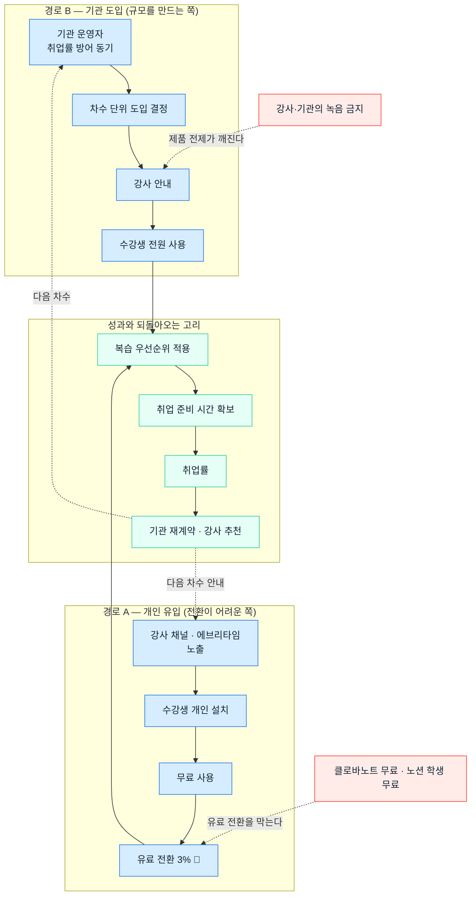

# 사례 01-A — 「콕집」의 기본 페르소나 (세그먼트 기반)

> **콕집** — 국비 교육·대학 강의를 녹음·태깅해, **현직자 관점의 우선순위로 복습할 것만 골라주는** 학습 앱

분석 기준 시점: 2026년 8월

> **이 문서의 위치** — Ch04 세그먼트 맵에서 **사용·지불·영향 역할을 직접 도출**한 결과입니다. 극단·비활성 사용자까지 넓히는 작업은 별도 문서로 진행합니다 → **[사례 01-B 페르소나 스펙트럼](./case-01-kokjip-lecture-review-prioritizer-persona-spectrum.md)** · **[사례 01-C 고객 여정지도](./case-01-kokjip-lecture-review-prioritizer-journey-map.md)**

근거 문서
- [Ch04 TAM-SAM-SOM & 세그먼트 맵](../04-tam-sam-som-market-segment-map/case-01-kokjip-lecture-review-prioritizer.md) — 이하 **[4]**
- 산정 근거 데이터 → [kokjip-sizing-evidence.md](../04-tam-sam-som-market-segment-map/deep-research/kokjip-sizing-evidence.md) — **[E]**
- [Ch01 5가지 힘 — AI/AX 교육 산업](../01-porters-five-forces/case-01-ai-education-edtech.md) — **[1A]**

**근거 표기** — 🟢 실측 / 🟡 유도 / 🔴 가설(인터뷰 검증 필요)

---

## 0. 전제

**아래 세 줄은 [Ch04 콕집 세그먼트 맵](../04-tam-sam-som-market-segment-map/case-01-kokjip-lecture-review-prioritizer.md)에서 확정한 내용을 그대로 가져온 것입니다.** 페르소나는 여기서 다시 정하지 않고, Ch04가 정한 표적·지불 구조·제외 조건 위에서만 뽑습니다.

| 항목 | 내용 |
|---|---|
| **서비스** | **콕집** — 강의 중 녹음·태깅 → **현직자 인사이트 기반 우선순위로 복습**, 확장으로 포트폴리오 소재 도출·프로젝트 매칭 |
| **Ch04가 정한 표적 세그먼트** | **L1 국비 부트캠프(KDT 등) 수강생** 주 표적 · L2 사설 부트캠프 2순위 · L3 대학 취업준비 학년 3순위 ([4] §2-3) |
| **Ch04가 정한 지불 주체 구조** | 개인은 월 5,000원 안팎이 상한(무료 대체재 때문) · **국비 훈련기관이 주 판매 채널** ([4] §2-4) |
| **Ch04가 정한 제외 조건** | 공무원·자격증 준비생(정답이 정해져 **인사이트 무효**) · 장기 미취업 청년(**태깅할 강의가 없음**) |

---

## 1. 페르소나 추출 규칙

**이 서비스는 쓰는 사람과 돈 내는 사람이 다를 수 있습니다.** Ch04가 세그먼트(누가 문제를 갖는가)와 지불 주체(누가 돈을 내는가)를 따로 그린 이유이고, 페르소나도 그 둘을 나눠 뽑아야 합니다.

```
세그먼트 (Ch04)  ×  역할 (사용 · 지불 · 영향)  ×  상황 (그 역할이 압박받는 시점)
                              ↓
                          페르소나
```

**역할만으로는 페르소나가 되지 않습니다.** "부트캠프 수강생"은 역할이고, **"하루 8시간 강의를 듣는데 3주차부터 복습이 밀려 무엇부터 볼지 모르는 KDT 수강생"** 이 페르소나입니다.

### 세그먼트·지불 주체 → 페르소나 매핑

**이름은 모두 가상이며 실제 인물·기업과 무관합니다.** 코드(P1~P6)는 인용용이고, 여정지도와 인터뷰 설계에서는 이름으로 부릅니다 — 상세 스펙트럼은 [01-B](./case-01-kokjip-lecture-review-prioritizer-persona-spectrum.md)와 코드가 일치합니다(P1=C1, P2=C2, P3=C3, P4=A1, P5=A2).

| 출처 | 처분 | 도출된 페르소나 | 이 서비스에서의 위치 |
|---|---|---|---|
| **L1** 국비 부트캠프 수강생 | **주 표적** | **P1 김지원** 복습 부채에 짓눌린 KDT 수강생 | **주 사용자 · 개인 지불자** |
| **지불 주체 — 국비 훈련기관** | **주 판매 채널** | **P2 박성호** 취업률을 방어해야 하는 훈련기관 운영자 | **기관 지불자 · 도입 결정권** |
| L1 생태계 | — | **P3 이준혁** 진도에 쫓기는 KDT 강사 | **영향자(추천 채널) + 녹음 허용 권한** |
| L2 사설 부트캠프 수강생 | 2순위 | **P4 한도윤** 자비로 수백만 원을 낸 수강생 | 지불 의사 최고 |
| L3 대학 취업준비 학년 | 3순위 | **P5 오세연** 취업 준비를 병행하는 4학년 | 에브리타임 채널 |
| 확장 기능의 상대 | 보류 | **P6 신다혜** 지원자를 걸러야 하는 채용 담당자 | 포트폴리오·매칭의 수요자 |
| L5·L7 | 제외 | 안티 페르소나 ([§6](#6-안티-페르소나--의도적으로-겨냥하지-않는-사람)) | — |

**P3는 제품이 작동할지를 결정하지만 제품을 쓰지는 않는 페르소나입니다.** 강사는 **녹음을 허용하거나 금지할 권한**을 쥐고 있고, 동시에 워크숍 정의가 명시한 홍보 채널("국비 강사 채널")입니다. **태깅과 우선순위 판단은 강사가 하지 않습니다** — 태깅은 학습자 또는 AI가 하고, 현직자 관점의 판단은 AI가 대리합니다.

---

## 2. 주 표적 세그먼트(L1)의 페르소나

### P1. 김지원 — 복습 부채에 짓눌린 KDT 수강생 · *주 사용자*

| 항목 | 내용 |
|---|---|
| **이름 · 유형명** | **김지원** (28, 가상) — **복습 부채에 짓눌린 수강생** (The Buried Trainee) |
| **역할** | 국비 지원 부트캠프(KDT) 수강생. 하루 8시간·6개월 과정. 비전공 전향자이거나 실무 경험이 없는 취업 준비자. 연간 KDT 참여 인원 **37,628명** 🟢 |
| **주요 문제** | ① **강의가 매일 쌓인다.** 하루치 복습을 못 끝내고 다음 날 새 강의가 시작된다<br>② 몰아서 하려고 미루면 **무엇부터 볼지 몰라 처음부터 자료를 다시 뒤진다**<br>③ 전부 복습하려면 시간이 없고, 골라서 하려면 **무엇이 중요한지 판단할 기준이 없다** — 실무를 안 해봤기 때문<br>④ 취업률이 떨어지고 있다는 걸 안다 — KDT 수료생 취업률 62.6%(2022)→**54.2%(2024)** 🟢<br>⑤ 복습에 시간을 다 쓰면 이력서·포트폴리오·코딩테스트 준비를 못 한다 |
| **목표** | **우선순위 높은 것만 복습하고 남은 시간을 취업 준비에 재배분**하는 것. 면접에서 "이건 이래서 중요합니다"라고 말할 수 있게 되는 것 |
| **사용 맥락** | **강의 중 실시간**(녹음·태깅) + **귀가 후 1~2시간**(복습) + **프로젝트 착수 직전**(필요한 것만 다시). 스마트폰과 노트북을 병행하고, 무료 도구를 이미 몇 개 깔아본 상태 |
| **핵심 인용** | *"복습을 안 한 게 아니라, 뭘 먼저 봐야 할지 모르겠어요."* |

**지불 능력의 한계** — 개인 지불 상한은 **월 5,000원 안팎**입니다. 클로바노트 개인 요금제가 무료(월 300~600분), 노션 플러스가 학생 무료 🟢이므로 "녹음·요약"에는 돈을 낼 이유가 없습니다. **우선순위 판단에만 지불 근거가 있습니다**([E] §3).

---

### P2. 박성호 — 취업률을 방어해야 하는 훈련기관 운영자 · *기관 지불자*

| 항목 | 내용 |
|---|---|
| **이름 · 유형명** | **박성호** (45, 가상) — **취업률을 방어해야 하는 기관 운영자** (The Placement Defender) |
| **역할** | KDT 훈련기관의 운영 책임자 또는 교육기획 팀장. 전국 **178곳** 🟢 중 하나. 과정 설계·강사 수급·취업 지원·성과 보고를 총괄 |
| **주요 문제** | ① **취업률이 기관의 생존이다.** 2년간 62.6%→54.2%로 8.4%p 하락 🟢하고, 훈련기관은 그 성과로 지정·평가받는다<br>② 수강생이 왜 못 따라오는지 개별로 파악할 방법이 없다. 중도 이탈은 사후에 드러난다<br>③ 강사에게 더 잘 가르치라고 요구할 수는 있어도 **수강생의 복습을 관리할 수단이 없다**<br>④ 정부 예산(KDT 4,731억, 2024 🟢) 안에서 운영하므로 과정당 비용을 늘리기 어렵다<br>⑤ 다른 기관과 커리큘럼이 비슷해 **차별화할 축이 없다** |
| **목표** | **수료생 취업률을 방어·개선**하는 것. 그것을 성과 보고에 쓸 수 있는 형태로 증빙하는 것. 운영 부담을 늘리지 않고 도입하는 것 |
| **사용 맥락** | **과정 개설 준비기**(차수 시작 4~6주 전)에 도구를 검토한다. 도입 결정은 기관 단위이고, 예산은 정부 훈련비 안에서 배분하거나 별도 운영비로 처리한다. 성과는 **수료·취업 시점**에 확인한다 |
| **핵심 인용** | *"강사 바꾸는 것보다 수강생이 복습을 제대로 하게 만드는 게 취업률에 더 빠르게 반영됩니다."* |

**이 페르소나가 규모를 결정합니다.** [4] §3-4가 개인 지불(이론 2,000억 → 실현 59억)과 기관 지불을 갈라 본 결과, **기관 판매가 없으면 사업 규모가 나오지 않습니다.** 다만 계정이 178곳뿐이라 규모에도 한계가 있습니다([E] K5).

---

### P3. 이준혁 — 진도에 쫓기는 KDT 강사 · *영향자 + 녹음 허용 권한*

| 항목 | 내용 |
|---|---|
| **이름 · 유형명** | **이준혁** (38, 가상) — **진도에 쫓기는 현직자 강사** (The Rushed Practitioner-Instructor) |
| **역할** | KDT 과정 강사. 대개 **현직 실무자 또는 실무 경력자**로, 정해진 커리큘럼을 기간 안에 소화해야 한다 |
| **주요 문제** | ① **"이건 실무에서 중요하고 이건 나중에 봐도 된다"를 알고 있지만 수업 중에 다 말해줄 시간이 없다**<br>② 같은 질문을 매 차수 반복해서 받는다<br>③ 수강생이 어디서 막히는지 시험·과제로만 사후에 안다<br>④ 강의 녹음을 허용하면 자료가 외부로 유출될 우려가 있다 🔴 |
| **목표** | 진도를 지키면서도 **중요도 판단을 수강생에게 전달**하는 것. 반복 질문을 줄이는 것. 자기 강의 자산이 통제 없이 퍼지지 않는 것 |
| **사용 맥락** | **차수 시작 시 녹음 허용 여부 결정**과 **수강생에게 도구 안내**(워크숍 정의의 "국비 강사 채널"). 강의 준비 시간이 부족하므로 **강사에게 추가 입력을 요구하는 설계는 성립하지 않는다** |
| **핵심 인용** | *"제가 수업에서 '이건 실무에서 안 씁니다'라고 한 걸 기억하는 수강생이 몇 안 돼요."* |

**이 페르소나는 제품의 관문입니다.** 녹음이 금지되면 태깅할 입력 자체가 없으므로 **해당 차수 전체가 시장에서 빠집니다**(→ [01-B의 Non-user](./case-01-kokjip-lecture-review-prioritizer-persona-spectrum.md)). 즉 강사는 **쓰지 않으면서 성패를 결정**합니다.

**진입장벽은 강사가 아닙니다.** [경쟁 실사](../04-tam-sam-som-market-segment-map/deep-research/kokjip-research.md#1-3단계--경쟁-구도-실사)에서 다글로가 이미 "강의 녹음 → 요약 → AI 퀴즈"를 무료로 제공하는 것이 확인됐으므로 🟢, 방어력은 **AI가 현직자 관점을 얼마나 정확히 대리하는지**에 있고 그것은 **판정의 근거 데이터**에 달려 있습니다. 근거 조합은 **강의 중 강사 발화를 1차 신호로, 채용공고 기술 수요를 근거 표시 레이어로, 취업 성공자 학습 이력을 나중의 교정 라벨로** 확정했습니다([근거 확정](../04-tam-sam-som-market-segment-map/deep-research/kokjip-research.md#4-2-확정--강사-발화로-출발선을-취업-이력으로-벽을)) — **이 결정도 강사에게 추가 입력을 요구하지 않습니다.** 발화는 이미 녹음 안에 있습니다.

---

## 3. 2·3순위 세그먼트의 페르소나

### P4. 한도윤 — 자비로 수백만 원을 낸 사설 부트캠프 수강생 · *2순위*

| 항목 | 내용 |
|---|---|
| **이름 · 유형명** | **한도윤** (29, 가상) — **본인 돈을 낸 수강생** (The Self-Funded Learner) |
| **역할** | 사설 유료 부트캠프 수강생. 수강료를 **자비로 부담**했고, 취업 성공 시 환급·보장 조건이 붙은 과정을 고른 경우도 있다 |
| **주요 문제** | P1과 동일한 복습 부채 + **투자 회수 압박**. "이 돈을 냈으니 반드시 취업해야 한다"는 압력이 학습 방식을 조급하게 만든다 🔴 |
| **목표** | 지불한 만큼 회수하는 것. 학습 효율을 **눈에 보이는 지표**로 확인하는 것 |
| **사용 맥락** | P1과 같으나 **유료 결제 저항이 가장 낮다.** 이미 수백만 원을 쓴 상태라 월 몇천 원의 추가 지출을 상대적으로 쉽게 결정한다 🔴 |
| **핵심 인용** | *"돈 낸 만큼 뽑아야 하는데, 정작 뭘 뽑아야 하는지를 모르겠어요."* |

**규모는 작고 지불 의사는 최고입니다.** 초기 유료 전환율 검증([E] §5 1순위)의 **첫 실험 대상으로 가장 적합**합니다.

### P5. 오세연 — 취업 준비를 병행하는 대학 4학년 · *3순위*

| 항목 | 내용 |
|---|---|
| **이름 · 유형명** | **오세연** (24, 가상) — **강의와 취준을 병행하는 4학년** (The Split-Attention Senior) |
| **역할** | 4년제·전문대 졸업 학년. 전공 강의를 들으면서 취업 준비를 병행. 에브리타임 MAU **289만 명** 🟢 안에 있다 |
| **주요 문제** | ① 전공 강의와 취업 준비 중 **무엇이 취업에 실제로 도움 되는지 판단이 안 선다**<br>② 강의 밀도는 부트캠프보다 낮지만 **분산돼 있어 관리가 더 어렵다**<br>③ 학점과 취업 준비가 경합한다 |
| **목표** | 전공 학습 중 **취업에 쓰일 부분만 골라내는 것.** 학점을 지키면서 시간을 확보하는 것 |
| **사용 맥락** | 학기 중 상시 + **시험 기간·자소서 마감 직전** 집중. 에브리타임을 통한 자연 유입이 주 채널 |
| **핵심 인용** | *"전공 수업 내용이 면접에서 쓸모가 있는지 없는지를 모르겠어요."* |

**복습 부채가 중간이라 문제의 절박함이 약합니다**([4] §2-2). 접근은 쉬우나 전환은 어렵습니다.

---

## 4. 확장 기능의 상대 — *보류*

### P6. 신다혜 — 지원자를 걸러야 하는 채용 담당자

| 항목 | 내용 |
|---|---|
| **이름 · 유형명** | **신다혜** (36, 가상) — **비슷한 지원서를 걸러야 하는 채용 담당자** (The Screener) |
| **역할** | 신입·주니어 채용 담당자. 부트캠프 수료생 지원서를 다수 검토 |
| **주요 문제** | ① 같은 과정을 나온 지원자의 **포트폴리오가 서로 비슷하다** 🔴<br>② 지원자가 무엇을 실제로 이해했는지 서류로 판별하기 어렵다 🔴 |
| **목표** | 지원자의 **실제 학습 궤적과 이해도**를 짧은 시간에 판별하는 것 |
| **사용 맥락** | 채용 공고 마감 직후 서류 검토 기간 |
| **처분** | **조건부 승격.** 단가는 확인됐습니다 — **채용 성공 수수료가 합격자 연봉의 7%**, 신입 기준 **건당 약 210만 원** 🟢으로 개인 연 구독료(6만 원)의 **35배**입니다([4] §7 ④). 다만 **이해상충**이 남습니다 — 우선순위를 정해주는 쪽과 매칭으로 수수료를 받는 쪽이 같으면 우선순위를 왜곡할 유인이 생깁니다. **중립성 확보 방안이 정해지기 전까지 이 페르소나로 제품을 설계하지 않습니다** |

---

## 5. 사용·지불·확산 관계도

이 서비스에는 **두 개의 도입 경로**가 있고, 둘은 서로 독립적으로 작동합니다.



**읽는 법**

| 관찰 | 함의 |
|---|---|
| **경로 B가 규모를 만든다** | 기관이 차수 단위로 도입하면 수강생 전원이 사용자가 된다. 개인 설치·전환 단계를 건너뛴다 |
| **경로 A는 무료 대체재에 막힌다** | 개인 유입은 쉽지만 유료 전환에서 클로바노트·노션과 정면 경쟁한다 🟢. [4]의 SOM 중 62%가 이 경로에 걸려 있고, 그것이 가장 약한 가정이다 |
| **강사가 두 경로 모두를 통과한다** | 경로 B에서는 안내자, 경로 A에서는 노출 채널. **동시에 녹음을 금지할 수 있는 거부권자** |
| **되돌아오는 고리는 취업률 하나** | 기관 재계약과 강사 추천이 모두 취업률에서 나온다. 즉 **취업률에 기여했음을 증빙하지 못하면 재계약 근거가 없다** |

---

## 6. 안티 페르소나 — 의도적으로 겨냥하지 않는 사람

세그먼트를 나누는 목적은 버릴 곳을 정하는 것입니다([4] 방법론 §3-2).

| 안티 페르소나 | 왜 겨냥하지 않는가 |
|---|---|
| **공무원·자격증 시험 준비생** | 취업시험 준비자 중 공무원이 **18.2%** 🟢로 큰 집단이지만, **정답이 정해진 시험이라 "현직자라면 무엇을 볼까"가 무효**다. 우리 핵심 가치가 작동하지 않는다 |
| **장기 미취업 청년** | **60만 5,000명** 🟢으로 절박도가 최대이지만 **강의를 듣고 있지 않아 태깅 대상이 없다.** 제품이 작동하지 않는다 |
| **대학 저학년** | 복습 부채가 작고 취업 절박도가 낮아 지불 동기가 약하다([4] L4) |
| **어학 학습자** | 반복·암기 중심이라 "우선순위 판단"의 가치가 낮다 |
| **녹음·요약만 원하는 사용자** | 그 기능은 이미 무료다 🟢. 우리가 경쟁해야 하는 곳이 아니다 |

---

## 7. 다음 단계

| 다음 산출물 | 이 문서에서 넘기는 입력 |
|---|---|
| **[01-B 페르소나 스펙트럼](./case-01-kokjip-lecture-review-prioritizer-persona-spectrum.md)** | P3(강사)이 **영향자이면서 거부권자**라는 이중성 → Non-user 유형의 실체. 무료 도구로 버티는 수강생 → 전환 대상 |
| **[01-C 고객 여정지도](./case-01-kokjip-lecture-review-prioritizer-journey-map.md)** | **두 경로(기관 도입 · 개인 유입)의 여정이 다르다.** 기관은 차수 준비기에, 개인은 3주차 복습 부채 자각 시점에 시작한다 |
| Ch06 기회점수 | 페르소나별 문제의 빈도 × 불만족도 |
| Ch07 JTBD | P1의 "뭘 먼저 봐야 할지 모르겠다"가 핵심 과업 진술문 |

**검증이 필요한 가정** — 이 페르소나들은 공개 통계와 Ch04 산정 위에서 구성했고 **인터뷰로 검증하지 않았습니다.**

- [ ] **기관 운영자가 취업률 방어를 위해 실제로 도구 예산을 쓰는가** 🔴 — [E] §5 2순위. 이 가정이 틀리면 규모 논거가 무너진다
- [ ] **강사 발화에 「실무 중요도 신호」가 충분히 담기는가** 🔴 — **검증 1순위.** 근거 조합은 확정됐고([근거 확정](../04-tam-sam-som-market-segment-map/deep-research/kokjip-research.md#4-2-확정--강사-발화로-출발선을-취업-이력으로-벽을)) 남은 것은 밀도다. KDT 녹취 3~5개로 시간당 발생 횟수를 센다 — 2~3회면 성립, 0.2회면 채용공고 비중을 올려야 한다
- [ ] **강사가 녹음을 허용하는가** 🔴 — 제품 작동의 이진 조건. 금지 비율이 높으면 대체 입력 경로가 필요하다
- [ ] P1이 무료 도구 대신 유료를 선택하는 지점 🔴 — [E] §5 1순위, 랜딩 테스트로 확인 가능
- [ ] P4(사설 부트캠프)의 지불 저항이 정말 더 낮은가 🔴
