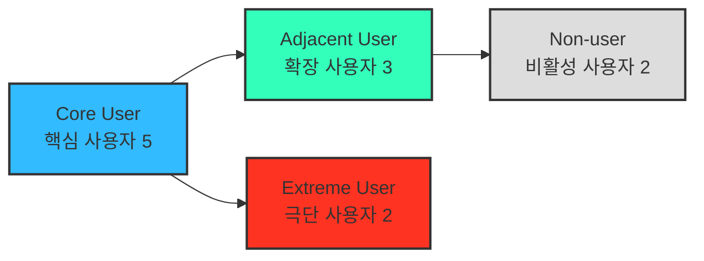
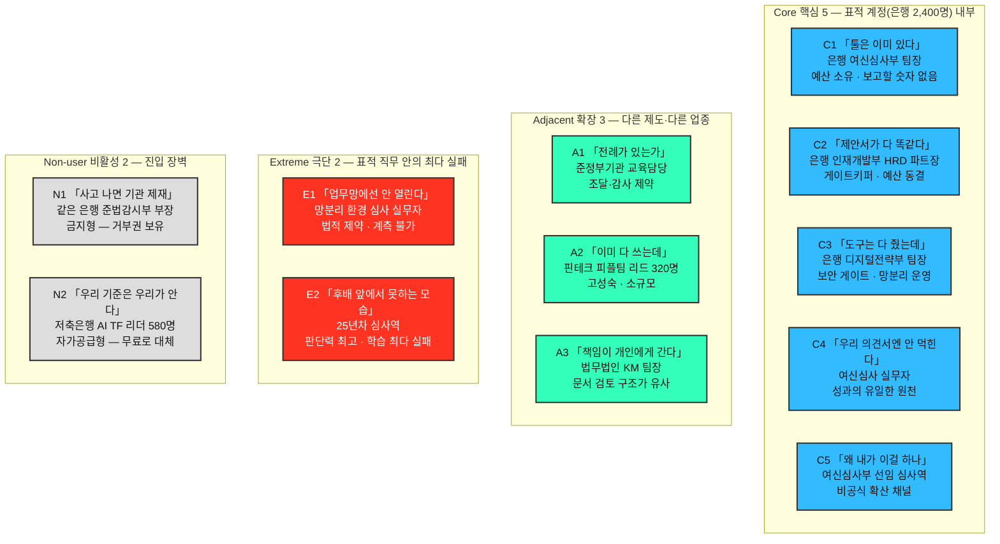
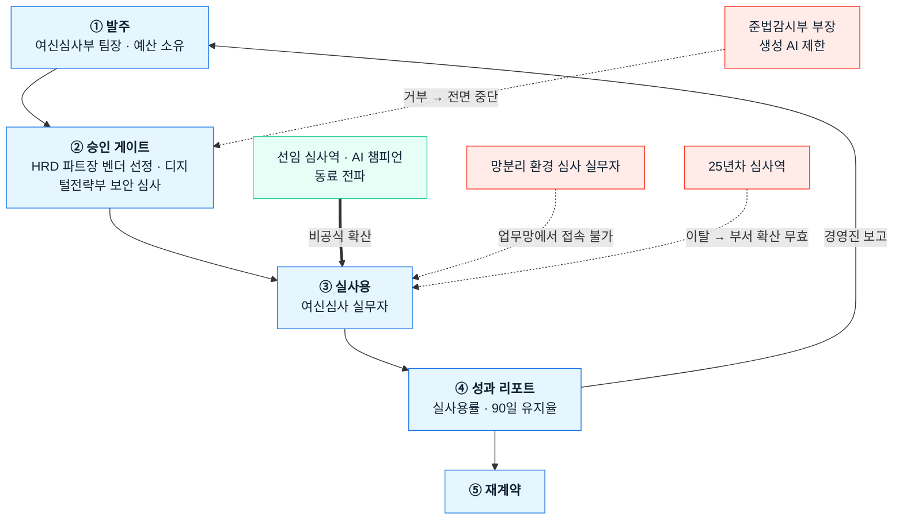

# 사례 01-B — 페르소나 스펙트럼 ①단계: 1차 생성 (Divergent Thinking)

작성 시점: 2026년 8월 · 대상 서비스: **B2B AX 교육 플랫폼**

근거 문서
- [사례 01-A 기본 페르소나](./case-01-personas.md) — 세그먼트에서 도출한 구매·사용 역할
- [Ch04 TAM-SAM-SOM & 세그먼트 맵](../04-tam-sam-som-market-segment-map/case-01-ai-education-edtech.md) — **[4]**
- [딥 리서치 본문](../04-tam-sam-som-market-segment-map/deep-research/case-ai-ax-edtech.md) — **[R]**
- [Ch01 5가지 힘](../01-porters-five-forces/case-01-ai-education-edtech.md) — **[1A]**

---

## 0. 이 문서의 위치와 읽는 법

**5단계 워크플로우 중 ①단계 산출물입니다.**

| 단계 | 상태 | 산출물 |
|---|---|---|
| **① 1차 생성 (Divergent)** | **← 현재** | **원본 12종 — 평가·선별 전** |
| ② 2차 평가 (Convergent) | 미착수 | 유형별 1개씩 4종 대표 선별 |
| ③ 3차 보정 (Contextual) | 미착수 | 서비스 맥락에 맞춘 4종 카드 |
| ④ 4차 검증 (Peer Review) | 미착수 | 실존 확률·근거 리포트 |
| ⑤ 5차 통합 (Spectrum Map) | 미착수 | 관계 구조 시각화 완성 |

> **⚠️ 이 문서를 결론으로 쓰면 안 됩니다.** 발산 단계의 목적은 **가능성을 넓히는 것**이므로, 여기에는 실존 확률이 낮은 페르소나가 의도적으로 섞여 있습니다. 선별은 ②단계, 실존 검증은 ④단계에서 합니다.

**근거 표기** — 🟢 리서치 수치로 뒷받침 / 🟡 리서치에서 유추 / 🔴 순수 가설(④단계 검증 필요)

**식별자는 유형명입니다.** 가상의 사람 이름을 붙이지 않았습니다 — 실제 인물로 오인될 여지를 만들지 않고, **"이 사람이 어떤 유형인가"가 곧 식별자**여야 ②단계 선별에서 유형 간 비교가 가능하기 때문입니다.

### 표적 도메인 — 금융·보험의 규제·심사 문서 업무

[4] §5-4가 확정한 표적입니다. 페르소나 전원이 이 도메인 기준으로 배치돼 있습니다.

| 항목 | 내용 |
|---|---|
| 도메인 | **은행·보험사의 규제·심사 문서 업무** — 여신심사 의견서, 준법 검토, 상품 심사 |
| 표적 계정 예시 | 임직원 **약 2,400명 규모 은행**. Core 5명과 Extreme 2명, Non-user 1명이 **이 한 계정 안에** 있음 |
| 왜 한 계정에 몰아넣었는가 | [3] KSF1의 극단적 협소화를 따르면 **Core는 단일 계정 안의 구매 위원회**여야 정상입니다. 업종 다양성은 Adjacent가 담당합니다 |

---

## 1. 스펙트럼 4유형과 도출 질문

### 도출 핵심 질문에 대한 답

| 질문 | 이 서비스에서의 답 |
|---|---|
| **(확장)** 유사한 제품·서비스를 쓰고 있는 사람은 누구인가 | **같은 문제를 다른 제도 안에서 겪는 조직들.** 공공기관(조달·감사 제약), 핀테크(고성숙·소규모·빠른 의사결정), 법무법인(면허·책임 문제). 문제는 "도입했는데 안 퍼진다"로 동일하나 **구매 절차와 책임 구조가 다르다** |
| **(비활성)** 이 서비스를 **쓸 수 없는** 사람은 누구인가 | 두 종류로 갈린다. **못 쓰는 쪽** — 감독규정·내부 통제로 생성 AI 사용 자체가 금지된 조직. **안 쓰는 쪽** — 자체 교육이나 정부 무료 공급으로 충분하다고 판단한 조직([1A] 2-4의 후방 통합·무료 대체재가 사람으로 나타난 형태) |
| **(극단)** 가장 자주 실패를 경험하는 사람은 누구인가 | **망분리 환경의 심사 실무자**와 **디지털 리터러시가 낮은 시니어 심사역.** 후자는 근거가 있다 — AI 전환 장애요인 1위가 **"직원 간 AI 활용 수준 차이 55%"** 이고, 이들이 그 격차의 하단이다. 전자는 금융권 **망분리 규정**이라는 법적 제약에서 나온다 |

---

## 2. Core User — 핵심 사용자 5

> 표적 계정(임직원 약 2,400명 은행) 안의 다섯 사람. Ch04의 주 표적 세그먼트 **S4**(1,000인 이상 × AI 일부 부서만 도입)에 해당하며, 매출과 사용 빈도의 중심.

### C1. 확산이 멈춘 여신심사부 팀장

| 항목 | 내용 |
|---|---|
| **직무** | 은행 여신심사부 팀장(42세). 기업여신 심사 의견서와 규제 준수 검토를 관장. 부서 사업예산과 AI 도입·운영 예산의 실질 집행권 |
| **문제** | 전사 라이선스는 깔렸는데 팀 14명 중 4명만 쓴다 🟢 (전사 확산 25.0% vs 일부 부서 75.0%). 작년 집합교육 후 심사 업무가 그대로다 🟢 (교육 시행 기업 82%가 실무 적용 애로). 임원 보고에 넣을 숫자가 이수율뿐이다 |
| **목표** | 심사 의견서 작성시간을 분기 내 20% 줄이고 **그 수치를 임원 보고서 1페이지에 넣는 것.** 내년 AI 예산을 지켜내는 것 |
| **감정** | **초조함과 방어.** "내가 도입을 밀었는데 성과가 없으면 내 책임이 된다." 벤더 제안서에 대한 피로 — 다 똑같아 보인다 |
| **대체 솔루션** | 잘 쓰는 직원 넷에게 **비공식 사내 강의를 시킴** · 팀 채널에 프롬프트 공유 · 툴 벤더 무료 웨비나 · 컨설팅펌 견적 문의(비쌈) |

### C2. 성과 증빙을 요구받는 인재개발부 HRD 파트장

| 항목 | 내용 |
|---|---|
| **직무** | 같은 은행 인재개발부 HRD 파트장(38세). 연간 교육계획 수립, 벤더 선정·경쟁입찰, 예산 집행 증빙 담당 |
| **문제** | **예산은 동결인데 AI 교육을 1순위로 올려야 한다** 🟢 (동결 44.5%, AI 교육 우선순위 33.7%→50.9%). 다른 항목을 빼야 넣을 수 있다. 벤더 12곳이 진단·실습·활용률 계측을 동일 구성으로 제안해 선정 근거를 못 만든다 🟢. 전사 공통 교육의 현업 적용률은 11%임을 경험으로 안다 🟢 |
| **목표** | 같은 예산으로 AI 비중을 늘리면서 **경영진 질문("그래서 뭐가 나아졌냐")에 답할 지표**를 확보. 운영 실무 부담을 늘리지 않는 것 |
| **감정** | **피로와 회의.** "작년에도 좋다고 했는데." 동시에 **책임 회피 욕구** — 실패해도 설명 가능한 선정 근거가 필요하다 |
| **대체 솔루션** | 대형 교육사 패키지 재계약(안전한 선택) · 무료 벤더 세미나 · 사내 강사 양성 · 사업주 직업능력개발훈련 환급과정으로 단가 낮추기 |

### C3. 활용률을 방어해야 하는 디지털전략부 팀장

| 항목 | 내용 |
|---|---|
| **직무** | 같은 은행 디지털전략부 팀장(45세). 사내 AI 게이트웨이 운영, 라이선스 구매·갱신, 외부 벤더 보안 심사. **망분리 정책의 실무 운영자** |
| **문제** | 라이선스는 샀는데 활용률이 낮아 **갱신 심사에서 ROI를 설명해야 한다.** 도입 저해요인 1위가 "전문성 부족 45%" 🟢 — IT가 풀 수 없는데 책임은 IT에 온다. 교육 벤더에게 고객정보 인접 데이터를 열어주는 심사가 부담이고, 그 리드타임이 도입 일정을 지배한다 🟡 |
| **목표** | **부서별 활용률을 비교 가능한 지표로 확보**해 라이선스 예산을 방어. 데이터 처리 수탁 근거를 문서로 남기는 것 |
| **감정** | **억울함.** "도구는 다 줬는데 안 쓰는 걸 왜 내가 책임지나." 감독당국 검사에 대한 상시 불안 |
| **대체 솔루션** | 게이트웨이 로그로 자체 활용률 집계 · 사내 위키에 프롬프트 모범사례 축적 · 툴 벤더 관리자 대시보드 · 활용률 낮은 부서 라이선스 회수 |

### C4. 내 업무로 못 옮기는 여신심사 실무자

| 항목 | 내용 |
|---|---|
| **직무** | 여신심사부 실무자(31세). 일일 심사 의견서 작성, 재무제표 검토, 규제 준수 체크리스트 대응 |
| **문제** | ChatGPT는 개인적으로 쓴다 🟢 (범용 AI 활용률 88%). 그런데 **우리 심사 의견서 양식에는 안 먹힌다.** 고객 신용정보를 넣지 말라는 규정이 있어 실습을 실제 업무로 옮길 수 없다. 전사 공통 교육 적용률 11%, 직무별로 나눠도 18% 🟢. 첫 과제 제출 단계에서 포기한 경험 🟡 |
| **목표** | **반복 업무 하나를 실제로 줄이는 것** — 특히 재무제표 요약과 규제 체크리스트 대조. 팀 회의에서 보여줄 결과물 1개 |
| **감정** | **부담과 소외.** "안 쓰면 뒤처진다는데 시간이 없다." 잘 쓰는 동료에 대한 열등감. 새 시스템에 또 로그인해야 한다는 짜증 |
| **대체 솔루션** | 잘 쓰는 동료에게 개인적으로 물어봄 · 유튜브 · 개인 계정으로 몰래 사용(내용 각색) · 그냥 예전 방식 유지 |

### C5. 무보수로 사내 강사가 된 AI 챔피언

| 항목 | 내용 |
|---|---|
| **직무** | 여신심사부 선임 심사역(35세). 공식 직무는 기업여신 심사이나 **실질적으로 팀의 AI 창구** 역할. 프롬프트 문의가 하루 5~6건 |
| **문제** | **내 업무 시간을 남의 질문에 쓴다.** 같은 질문이 반복되는데 정리할 시간이 없다. 내가 만든 방법이 팀 자산으로 안 남는다 🟡. 이 기여가 인사 평가에 반영되지 않는다 🔴 |
| **목표** | 반복 질문을 **한 번 정리해 두고 끝내는 것.** 자기 기여가 조직에 기록되고 평가에 반영되는 것 |
| **감정** | **보람과 번아웃의 공존.** 인정받고 싶은 욕구와 "왜 내가 이걸 하나"라는 억울함 |
| **대체 솔루션** | 팀 위키에 프롬프트 문서 직접 작성 · 사내 메신저 채널 운영 · 결국 방치(질문 무시) |

> **C5는 이번 발산에서 새로 나온 페르소나입니다.** "직원 간 활용 수준 차이 55%"가 장애요인 1위라면 **격차의 상단에 사람이 있다**는 뜻이고, 그 사람이 확산의 실제 채널입니다. [사례 01-A](./case-01-personas.md)에는 없던 인물이며, 확산 설계의 지렛대가 될 수 있어 ②단계 평가에서 우선 검토가 필요합니다.

---

## 3. Adjacent User — 확장 사용자 3

> 문제는 같고 **제도·책임 구조가 다른** 인접 시장. 확장 기회 탐색용. **업종 다양성은 이 유형이 담당합니다.**

### A1. 감사에 대비해야 하는 공공기관 교육담당자

| 항목 | 내용 |
|---|---|
| **직무** | 준정부기관 인사혁신부 교육담당(40세). 직원 800명. 연간 교육계획과 조달 발주 담당 |
| **문제** | 기관장 지시로 전 직원 AI 교육을 해야 하는데 **조달 절차와 감사 대응이 본업의 절반.** 성과를 정량으로 남기지 않으면 감사에서 지적된다 🔴. 무료 정부 과정이 있어 유료 발주의 명분을 별도로 만들어야 한다 🟢 (KOSA 등 무료 공급) |
| **목표** | **감사에 제출할 수 있는 성과 증빙**을 확보. 조달 규정 안에서 문제없이 집행 |
| **감정** | **위험 회피.** "새로운 걸 하다 지적받는 게 가장 무섭다." 전례가 있는지를 먼저 묻는다 |
| **대체 솔루션** | 정부 무료 과정 활용 · 나라장터 공고로 최저가 낙찰 · 타 기관 사례 벤치마킹 · 공공 특화 교육기관 수의계약 |

### A2. 규제 대응 업무가 급증한 핀테크 피플팀 리드

| 항목 | 내용 |
|---|---|
| **직무** | 임직원 **320명 핀테크**의 피플팀 리드(34세). 채용·조직문화·역량개발을 겸함. 전담 HRD 조직 없음 |
| **문제** | **AI는 이미 다 쓴다** — 개발·데이터 직군은 물론 비개발 직군도 일상적으로 쓴다 🟡. 그런데 라이선스 취득·감독규정 대응으로 **규제 문서 업무가 급증**했고, 비개발 직군이 그 문서를 못 다룬다 🔴. 표준 AI 교육은 이미 아는 내용이라 참여율이 안 나온다 🔴 |
| **목표** | **이미 잘 쓰는 조직에 맞는 심화** — 규제 문서 도메인에 특화된 활용법. 최소 인력으로 운영 가능한 형태 |
| **감정** | **자신감과 조급함의 혼합.** "우린 이미 앞서 있다"는 자부심과 규제 대응 인력 부족에 대한 초조 |
| **대체 솔루션** | 사내 스터디 · 컨설팅펌 규제 대응 자문 · 규제 담당 경력자 채용 · 리걸테크 솔루션 |
| **정합성 주의** | **1,000인 미만이고 AI 성숙도가 이미 높습니다.** 즉 [4]의 표적 세그먼트 S4(일부 부서만 도입) 조건을 둘 다 벗어납니다 — 그래서 Core가 아니라 Adjacent입니다. Core로 올리려면 Ch04의 "1,000인 이상 한정" 결정부터 다시 열어야 합니다 |

### A3. 책임 문제에 걸린 로펌 지식관리 담당자

| 항목 | 내용 |
|---|---|
| **직무** | 중대형 법무법인 KM(지식관리) 팀장(41세). 변호사 200여 명. 서면 템플릿·판례 지식베이스 운영 |
| **문제** | 변호사들이 개인적으로 생성 AI를 쓰지만 **오류가 나면 책임이 변호사 개인에게 간다** 🔴. 조직이 공식 지침을 못 만들어 음지 사용이 늘어난다. 파트너별로 방식이 달라 표준화가 안 된다 🔴 |
| **목표** | 검증된 사용 범위와 지침 확립 · 반복 서면 작업의 시간 절감을 **책임 소재가 명확한 방식으로** 확보 |
| **감정** | **양가감정.** 생산성 기회는 크지만 리스크가 개인에게 집중되는 구조에 대한 불편 |
| **대체 솔루션** | 리걸테크 전문 솔루션 도입 검토 · 파트너 개별 판단에 위임 · 사내 가이드라인 문서만 배포 · 사용 금지 |
| **인접성 근거** | 금융 규제 문서와 **법률 문서는 검토 구조가 유사**합니다(근거 조항 대조 → 의견 작성 → 책임 서명). Core에서 만든 자산이 가장 적은 변형으로 이식되는 인접 시장입니다 🟡 |

---

## 4. Extreme User — 극단 사용자 2

> 제약이 가장 심하고 **가장 자주 실패하는** 사람. 이들이 되면 나머지는 대체로 됩니다. **둘 다 표적 직무(여신심사) 안에 있습니다.**

### E1. 망분리에 갇힌 여신심사 실무자

| 항목 | 내용 |
|---|---|
| **직무** | 같은 은행 여신심사부 실무자(34세). 고객 신용정보를 다루므로 **업무망 단말에서 작업.** 금융권 망분리 규정에 따라 업무망은 외부 인터넷·외부 SaaS가 전면 차단됨 |
| **문제** | **업무망에서는 우리 플랫폼이 아예 열리지 않는다** 🔴. 인터넷은 별도 단말로 되지만 **그 단말에는 고객정보를 옮길 수 없다.** 즉 **학습은 인터넷 단말에서, 업무는 업무망에서** 일어나 둘이 만나지 못한다. 협업툴 주간 체크인도 업무망에서 불가 🔴. 실습 결과를 실제 업무에 옮기는 순간 규정 위반이 된다 |
| **목표** | 규정을 어기지 않으면서 **자기 업무에 적용 가능한 방법 하나**를 얻는 것. 두 단말을 왕복하지 않아도 되는 형태 |
| **감정** | **무력감과 이중 구속.** "쓰라고 하면서 쓸 수 없게 해놨다." 규정 위반 우려로 인한 상시 긴장 |
| **대체 솔루션** | 인터넷 단말에서 익힌 뒤 **손으로 옮겨 적기** · 고객정보를 각색해 개인 계정으로 시도 · 선임에게 구두 전수 · 아무것도 안 함 |

> **E1이 도메인 변경으로 드러난 가장 큰 발견입니다.**
> 제조 도메인에서는 폐쇄망·교대근무가 **일부 인구의 제약**이었습니다. 금융에서는 **망분리가 법적 강제**이므로 **표적 직무 전체가 이 제약 아래**에 있을 수 있습니다. 그렇다면 흔들리는 것은 SOM의 대상 인원이 아니라 **제품 설계 자체**입니다 — 협업툴 기반 주간 체크인(FR-C2)과 사내 데이터 실습(FR-B2)이 성립하는지부터 다시 봐야 합니다. [§7](#7-2단계2차-평가로-넘기는-것)의 검증 1순위로 올립니다.

### E2. 학습 자체가 위협인 25년차 심사역

| 항목 | 내용 |
|---|---|
| **직무** | 같은 여신심사부 25년차 심사역(56세). 여신 판단은 팀 최고 수준이고 후배들이 판정을 물어온다 |
| **문제** | **새 도구 학습에서 반복 실패.** 화면 용어를 모르고, 작은 글씨가 안 보이고, 실수하면 되돌리는 법을 모른다 🔴. 젊은 동료 앞에서 못하는 모습을 보이는 것이 가장 큰 저항 요인 🔴. AI 활용 수준 격차의 하단에 있고 🟢 (장애요인 1위 격차 55%), 이 사람의 이탈이 곧 부서 확산 실패 |
| **목표** | **체면을 잃지 않고** 시작하는 것. 자기 심사 판단력이 여전히 가치 있다는 확인. 굳이 안 배워도 되는 근거를 찾고 싶은 마음도 있다 |
| **감정** | **수치심과 방어적 자존심.** "나 없으면 이 여신 판정 못 한다"는 자부심과 "이제 쓸모없어지나"는 두려움의 충돌 |
| **대체 솔루션** | 후배에게 대신 시킴 · 기존 엑셀 서식 고수 · 교육 신청은 하되 불참 · 정년까지 버티기 |

> **E2는 포용적 설계 요구를 만듭니다** — 글자 크기·용어 난이도·실패 복구 경로뿐 아니라 **"공개된 자리에서 평가받지 않는" 학습 동선**이 필요합니다. 동시에 이 사람의 심사 판단 지식은 사례 라이브러리(FR-E1)의 최고 품질 원천일 수 있어, **가르치는 대상이 아니라 지식 제공자로 위치를 바꾸는 설계**가 가능한지가 ②단계 검토 대상입니다.

---

## 5. Non-user — 비활성 사용자 2

> **못 쓰는 쪽**과 **안 쓰는 쪽**으로 갈립니다. 진입 장벽과 거부 요인의 실체.

### N1. 생성 AI를 제한한 준법감시부 부장 *(못 쓴다)*

| 항목 | 내용 |
|---|---|
| **직무** | **같은 은행** 준법감시부 부장(48세). 신용정보법·전자금융감독규정 준수 총괄, 금융감독원 검사 대응. 사내 생성 AI 사용을 **원칙적으로 제한**하는 결정의 주체 |
| **문제** | 고객 신용정보가 외부 모델로 나갈 위험을 감독당국에 설명할 수 없다 🔴. 교육 벤더가 사내 데이터로 실습하겠다는 제안은 **심사 대상 자체가 아니다.** 사고가 나면 기관 제재·과징금으로 직결되므로 편익보다 리스크가 압도적 🔴 |
| **목표** | **리스크를 0으로 유지.** 규정 위반 사례를 만들지 않는 것. AI 도입 요구를 안전하게 지연시키는 것 |
| **감정** | **완고함과 고립감.** "혼자 브레이크를 잡고 있다." 현업의 압박과 감독규정 사이에 끼인 피로 |
| **대체 솔루션** | 온프레미스·사내망 전용 모델 검토(예산 문제로 지연) · 사용 제한 공문 · 비식별 처리 후 제한적 허용 검토 · 도입 무기한 유보 |

> **거부 요인의 실체이고, 도메인을 금융으로 바꾸면서 위상이 올라갔습니다.**
> **같은 계정 안의 인물**이므로 Core 5명이 전원 찬성해도 이 사람이 막으면 계약이 성립하지 않습니다. 제조에서는 다소 추상적이던 거부권이 금융에서는 **감독규정이라는 실체**를 갖습니다. 제품이 격리 환경·외부 전송 차단·처리 수탁 근거(NFR-1·NFR-2)를 갖춘 이유가 이 페르소나입니다.

### N2. 자체 제작으로 해결하겠다는 저축은행 AI TF 리더 *(안 쓴다)*

| 항목 | 내용 |
|---|---|
| **직무** | 임직원 **580명 저축은행** 경영기획팀 AI TF 리더(39세). 대표 직속 과제로 사내 AI 전환을 맡음 |
| **문제** | AI 교육 필요성은 확실히 인식 🟢 (필요성 동의 97%). 그런데 **예산 편성 여력이 없고** 🟢 (중견기업 5,000만 원 이상 편성 14%), 정부 무료 과정이 존재하며 🟢 (1,000인 미만 무료 공급), 무엇보다 **"벤더는 우리 심사 기준을 모른다"** 는 판단으로 자체 커리큘럼을 만들고 있다 🟡 ([1A] 2-4의 사내 자체 교육 = 후방 통합) |
| **목표** | 외부 비용 없이 사내 역량으로 해결 · 대표에게 성과를 직접 보고 · TF 성과로 자기 커리어를 만드는 것 |
| **감정** | **자부심과 과신.** "우리 여신 기준은 우리가 제일 잘 안다." 동시에 시간 부족에 대한 압박 |
| **대체 솔루션** | 정부 무료 과정 수강 후 사내 전파 · 유튜브·도서로 자체 커리큘럼 제작 · 잘하는 직원을 사내 강사로 지정 · 툴 벤더 무료 지원 프로그램 |

> **[1A]가 대체재로 분류한 "사내 자체 교육"이 사람의 얼굴로 나타난 것**이며, [4]가 300~999인 세그먼트를 **보류**로 처분한 이유입니다. 이 페르소나를 고객으로 전환하려면 가격이 아니라 **"자체 제작보다 빠르다"**는 시간 논거가 필요합니다.

---

## 6. 스펙트럼 맵 (①단계 잠정)

초안에서는 **분류(누가 어느 유형인가)와 관계(누가 누구를 막거나 돕는가)를 한 그림에 넣어** 선이 12개 넘게 교차했습니다. 두 개는 성질이 다른 데이터이므로 나눠 그립니다.

### 6-1. 배치도 — 누가 어느 유형인가

각 칸은 **「그 사람의 머릿속 한 문장」 · 조직과 직무 · 한 줄 규정**으로 읽습니다. **네 유형을 위아래로 쌓고 유형 안의 인물은 좌우로 나열**했습니다 — 유형 간 비교는 위아래로, 한 유형의 구성원은 한 줄에서 좌우로 훑습니다.

**Core 5명과 Extreme 2명, Non-user 1명이 한 계정 안에 있는 것은 편향이 아니라 설계입니다.** [3] KSF1의 극단적 협소화를 따르면 Core는 **단일 계정 안의 구매 위원회**여야 하고, 업종 다양성은 Adjacent가 담당합니다. 이전 판에서는 Core에 금융지주·유통이 섞여 표적 도메인 밖 인물이 주력 타깃에 들어가 있었고, 그것이 실제 편향이었습니다.

### 6-2. 관계도 — 계약이 성립하고 성과가 도는 한 줄, 그리고 그것을 끊는 지점

가운데 세로줄이 **정상 경로**이고, 옆에서 들어오는 선이 그 경로를 **돕거나(실선) 끊는(점선)** 지점입니다.

### 6-3. 확장·전환 경로 — 두 줄이면 끝나는 내용

관계도에 넣으면 선만 늘어나므로 표로 남깁니다.

| 방향 | 경로 | 조건 |
|---|---|---|
| **확장** | Core에서 검증한 성과 사례 → **A3 법무법인**(문서 검토 구조가 가장 유사) → **A1 공공기관** → **A2 핀테크** | 문제는 같으나 구매 절차가 다르다. **셋을 같은 방식으로 접근할 수 없다** |
| **전환** | **N2 저축은행 AI TF 리더** → Core(HRD 경로) | 자체 제작이 지연·실패했을 때. 논거는 가격이 아니라 **"자체 제작보다 빠르다"** |

### 이 세 그림에서 읽히는 것 (①단계 잠정)

| 관찰 | 함의 |
|---|---|
| **준법감시부 부장이 Core 전체를 끊는다** | 비활성 사용자가 단순한 미고객이 아니라 **거부권 보유자**다. 금융에서는 그 거부권이 **감독규정**이라는 실체를 갖는다. 보안 요구사항은 기능이 아니라 **진입 조건** |
| **선임 심사역 → 실사용이 유일한 수평 확산 경로** | 발주를 거치지 않고 성과에 기여하는 선이 하나뿐이다. 제품이 이 경로를 흡수하면 확산 비용이 내려간다 |
| **차단 셋이 모두 ③(실사용)에 몰린다** | 계약은 만들 수 있어도 **성과가 만들어지는 한 지점에 리스크가 집중**된다 |
| **망분리가 제품 설계를 흔든다** | 제조 도메인에서는 일부 인구의 제약이었으나, **금융에서는 법적 강제라 표적 직무 전체에 걸릴 수 있다.** 협업툴 체크인·사내 데이터 실습의 성립 여부부터 재검토해야 한다 |

---

## 7. ②단계(2차 평가)로 넘기는 것

### 평가 기준 후보

②단계는 "문제·행동·맥락의 현실성"으로 유형별 1개씩 선별합니다. 이 사례에 맞는 기준을 제안합니다.

| 기준 | 왜 |
|---|---|
| **리서치 수치로 뒷받침되는가** (🟢 비중) | 12종 중 순수 가설(🔴)이 적지 않다. 발산 단계에선 정상이나 선별에서는 감점 요인 |
| **의사결정에 실제로 관여하는가** | 감정이 생생해도 계약·사용에 영향이 없으면 대표 페르소나가 될 수 없다 |
| **표적 도메인(금융 규제·심사 문서) 안에 있는가** | [4] §5-4가 확정한 경계. 밖에 있으면 확장·비활성으로만 다룬다 — **A2 핀테크가 이 기준으로 Adjacent에 남는다** |
| **제품 설계를 바꾸는 요구를 갖는가** | 포용성 관점에서 극단 사용자를 고르는 기준 |

### ④단계 검증이 특히 필요한 항목

- [ ] **금융권 망분리 규정이 표적 직무 전체에 걸리는 범위** 🔴 — **최우선.** 걸리는 범위가 넓으면 협업툴 체크인(FR-C2)·사내 데이터 실습(FR-B2)이 성립하지 않아 제품 설계를 다시 해야 한다
- [ ] **준법감시부의 거부권이 실제로 어느 단계에서 어떻게 작동하는가** 🔴 — 금융권 벤더 심사 절차의 실제 순서
- [ ] **선임 심사역(AI 챔피언)이 실제로 존재하는 규모** 🟡 — 조직당 몇 명인지·공식 역할인지 미확인
- [ ] **A1~A3 인접 시장의 구매 절차** 🔴 — 공공 조달·핀테크 자율 결정·로펌 파트너십은 각각 다른 구조이며 셋을 같은 방식으로 다룰 수 없다
- [ ] E2·A2의 문제 서술은 대부분 🔴 — **인터뷰 없이는 ③단계 보정이 상상에 가까워진다**

### 주의 — 발산 단계의 알려진 편향

1. **감정 서술이 서사적으로 그럴듯한 방향으로 쏠렸습니다.** ④단계에서 실존 확률을 따질 때 "이야기가 좋다"와 "실제로 있다"를 구분해야 합니다.
2. **표적 계정을 은행 하나로 특정한 것은 의도된 설계이지만, 은행과 보험사의 심사 문서 업무가 같은지는 확인하지 않았습니다** 🔴. 다르면 도메인을 "은행 여신심사"로 더 좁혀야 합니다.
3. **A2 핀테크는 리서치 범위 밖**이라 근거가 얇습니다. [4]가 1,000인 이상으로 표적을 한정했으므로 이 인물은 정합성 주의 표시와 함께 Adjacent에만 둡니다.
4. **도메인 변경(제조 → 금융)으로 이 문서의 인물 전원이 교체됐습니다.** 이전 판의 제조 기반 서술과 비교하려면 git 이력을 참조해야 합니다.
