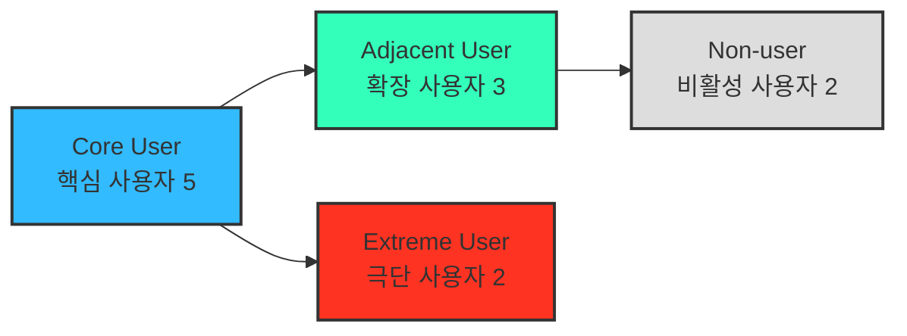
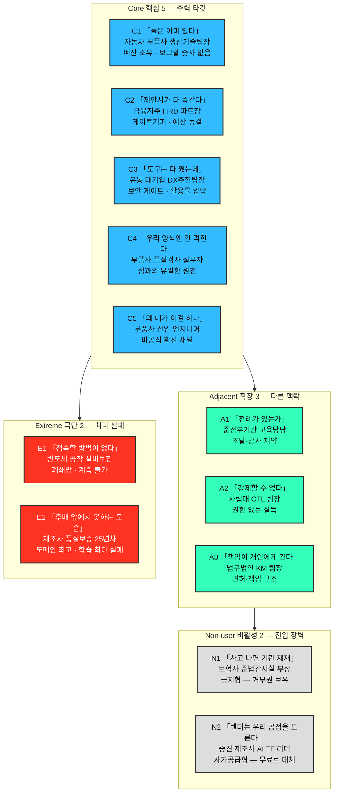
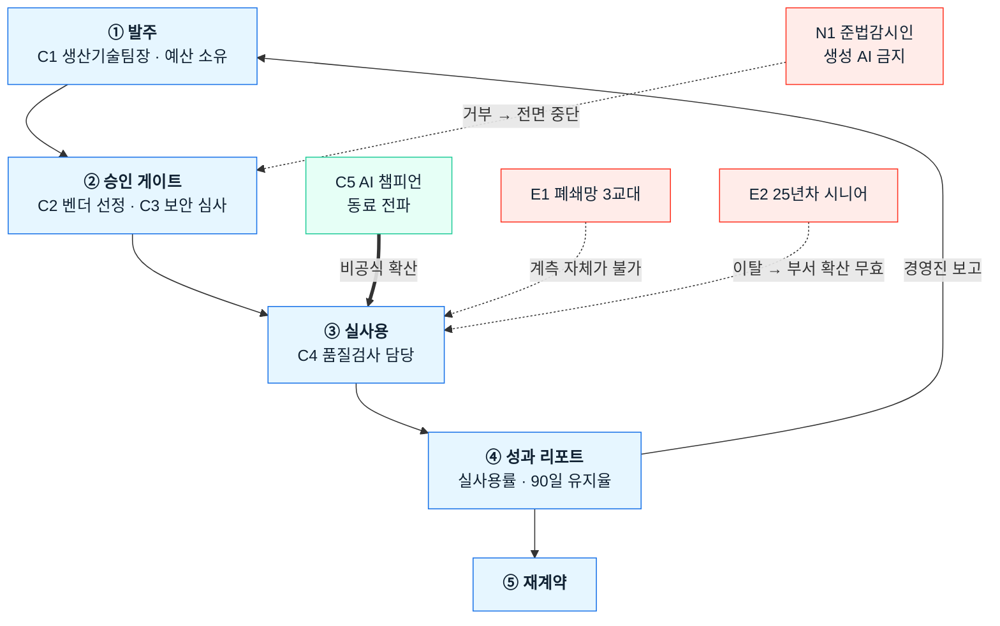

# 사례 01-B — 페르소나 스펙트럼 ①단계: 1차 생성 (Divergent Thinking)

작성 시점: 2026년 8월 · 대상 서비스: **B2B AX 교육 플랫폼**

근거 문서
- [사례 01-A 기본 페르소나](./case-01-personas.md) — 세그먼트에서 도출한 구매·사용 역할
- [Ch04 TAM-SAM-SOM & 세그먼트 맵](../04-tam-sam-som-market-segment-map/case-01-ai-education-edtech.md) — **[4]**
- [딥 리서치 본문](../04-tam-sam-som-market-segment-map/deep-research/case-ai-ax-edtech.md) — **[R]**
- [Ch01 5가지 힘](../01-porters-five-forces/case-01-ai-education-edtech.md) — **[1A]**

---

## 0. 이 문서의 위치와 읽는 법

**5단계 워크플로우 중 ①단계 산출물입니다.**

| 단계 | 상태 | 산출물 |
|---|---|---|
| **① 1차 생성 (Divergent)** | **← 현재** | **원본 12종 — 평가·선별 전** |
| ② 2차 평가 (Convergent) | 미착수 | 유형별 1개씩 4종 대표 선별 |
| ③ 3차 보정 (Contextual) | 미착수 | 서비스 맥락에 맞춘 4종 카드 |
| ④ 4차 검증 (Peer Review) | 미착수 | 실존 확률·근거 리포트 |
| ⑤ 5차 통합 (Spectrum Map) | 미착수 | 관계 구조 시각화 완성 |

> **⚠️ 이 문서를 결론으로 쓰면 안 됩니다.** 발산 단계의 목적은 **가능성을 넓히는 것**이므로, 여기에는 실존 확률이 낮은 페르소나가 의도적으로 섞여 있습니다. 선별은 ②단계, 실존 검증은 ④단계에서 합니다.

**근거 표기** — 🟢 리서치 수치로 뒷받침 / 🟡 리서치에서 유추 / 🔴 순수 가설(④단계 검증 필요)

**식별자는 유형명입니다.** 가상의 사람 이름을 붙이지 않았습니다 — 실제 인물로 오인될 여지를 만들지 않고, **"이 사람이 어떤 유형인가"가 곧 식별자**여야 ②단계 선별에서 유형 간 비교가 가능하기 때문입니다. 조직 규모·연령대는 맥락 판단에 필요한 만큼만 남겼습니다.

---

## 1. 스펙트럼 4유형과 도출 질문

### 도출 핵심 질문에 대한 답

| 질문 | 이 서비스에서의 답 |
|---|---|
| **(확장)** 유사한 제품·서비스를 쓰고 있는 사람은 누구인가 | **같은 문제를 다른 제도 안에서 겪는 조직들.** 공공기관(조달·감사 제약), 대학(교직원 AI 역량), 전문직 서비스 조직(면허·책임 문제). 문제는 "도입했는데 안 퍼진다"로 동일하나 **구매 절차와 책임 구조가 다르다** |
| **(비활성)** 이 서비스를 **쓸 수 없는** 사람은 누구인가 | 두 종류로 갈린다. **못 쓰는 쪽** — 규제·내부 통제로 생성 AI 사용 자체가 금지된 조직. **안 쓰는 쪽** — 자체 교육이나 정부 무료 공급으로 충분하다고 판단한 조직([1A] 2-4의 후방 통합·무료 대체재가 사람으로 나타난 형태) |
| **(극단)** 가장 자주 실패를 경험하는 사람은 누구인가 | **폐쇄망·교대근무 생산 현장 인력**과 **디지털 리터러시가 낮은 시니어 실무자.** 후자는 근거가 있다 — AI 전환 장애요인 1위가 **"직원 간 AI 활용 수준 차이 55%"** 이고, 이들이 그 격차의 하단이다 |

---

## 2. Core User — 핵심 사용자 5

> Ch04의 주 표적 세그먼트 **S4**(1,000인 이상 × AI 일부 부서만 도입) 안의 사람들. 매출과 사용 빈도의 중심.

### C1. 확산이 멈춘 생산기술팀장

| 항목 | 내용 |
|---|---|
| **직무** | 1,200명 규모 자동차 부품사 생산기술팀장(42세). 품질검사 리포트·공정 이상 분석을 관장. 부서 사업예산과 AI 도입·운영 예산의 실질 집행권 |
| **문제** | 전사 라이선스는 깔렸는데 팀 12명 중 3명만 쓴다 🟢 (전사 확산 25.0% vs 일부 부서 75.0%). 작년 집합교육 후 업무가 그대로다 🟢 (교육 시행 기업 82%가 실무 적용 애로). 임원 보고에 넣을 숫자가 이수율뿐이다 |
| **목표** | 검사 리포트 작성시간을 분기 내 20% 줄이고 **그 수치를 임원 보고서 1페이지에 넣는 것.** 내년 AI 예산을 지켜내는 것 |
| **감정** | **초조함과 방어.** "내가 도입을 밀었는데 성과가 없으면 내 책임이 된다." 벤더 제안서에 대한 피로 — 다 똑같아 보인다 |
| **대체 솔루션** | 잘 쓰는 직원 3명에게 **비공식 사내 강의를 시킴** · 팀 회의에서 프롬프트 공유 채널 운영 · 툴 벤더의 무료 웨비나 · 컨설팅펌 견적 문의(비쌈) |

### C2. 성과 증빙을 요구받는 HRD 파트장

| 항목 | 내용 |
|---|---|
| **직무** | 금융지주 인재개발원 HRD 파트장(38세). 연간 교육계획 수립, 벤더 선정·경쟁입찰, 예산 집행 증빙 담당 |
| **문제** | **예산은 동결인데 AI 교육을 1순위로 올려야 한다** 🟢 (동결 44.5%, AI 교육 우선순위 33.7%→50.9%). 다른 항목을 빼야 넣을 수 있다. 벤더 12곳이 진단·실습·활용률 계측을 동일 구성으로 제안해 선정 근거를 못 만든다 🟢. 전사 공통 교육의 현업 적용률은 11%임을 경험으로 안다 🟢 |
| **목표** | 같은 예산으로 AI 비중을 늘리면서 **경영진 질문("그래서 뭐가 나아졌냐")에 답할 지표**를 확보. 운영 실무 부담을 늘리지 않는 것 |
| **감정** | **피로와 회의.** "작년에도 좋다고 했는데." 동시에 **책임 회피 욕구** — 실패해도 설명 가능한 선정 근거가 필요하다 |
| **대체 솔루션** | 대형 교육사 패키지 재계약(안전한 선택) · 무료 벤더 세미나로 예산 절약 · 사내 강사 양성 · 사업주 직업능력개발훈련 환급과정으로 단가 낮추기 |

### C3. 활용률을 방어해야 하는 DX 팀장

| 항목 | 내용 |
|---|---|
| **직무** | 유통 대기업 DX추진팀장(45세). 전사 AI 게이트웨이 운영, 라이선스 구매·갱신, 외부 벤더 보안 심사 |
| **문제** | 라이선스는 샀는데 활용률이 낮아 **갱신 심사에서 ROI를 설명해야 한다.** 도입 저해요인 1위가 "전문성 부족 45%" 🟢 — IT가 풀 수 없는데 책임은 IT에 온다. 교육 벤더에게 사내 데이터를 열어주는 심사가 부담이고, 그 리드타임이 도입 일정을 지배한다 🟡 |
| **목표** | **부서별 활용률을 비교 가능한 지표로 확보**해 라이선스 예산을 방어. 데이터 처리 수탁 근거를 문서로 남기는 것 |
| **감정** | **억울함.** "도구는 다 줬는데 안 쓰는 걸 왜 내가 책임지나." 보안 사고에 대한 상시 불안 |
| **대체 솔루션** | 게이트웨이 로그로 자체 활용률 집계 · 사내 위키에 프롬프트 모범사례 축적 · 툴 벤더의 관리자 대시보드 · 활용률 낮은 부서 라이선스 회수 |

### C4. 내 업무로 못 옮기는 품질검사 담당자

| 항목 | 내용 |
|---|---|
| **직무** | C1 팀의 품질검사 실무자(31세). 일일 검사 리포트 작성, 부적합 이력 정리, 고객사 제출 문서 대응 |
| **문제** | ChatGPT는 개인적으로 쓴다 🟢 (범용 AI 활용률 88%). 그런데 **우리 검사 보고서 양식에는 안 먹힌다.** 사내 데이터를 넣지 말라는 규정이 있어 실습을 실제 업무로 옮길 수 없다. 전사 공통 교육 적용률 11%, 직무별로 나눠도 18% 🟢. 첫 과제 제출 단계에서 포기한 경험 🟡 |
| **목표** | **반복 업무 하나를 실제로 줄이는 것** — 특히 부적합 이력 정리. 팀 회의에서 보여줄 결과물 1개 |
| **감정** | **부담과 소외.** "안 쓰면 뒤처진다는데 시간이 없다." 잘 쓰는 동료에 대한 열등감. 새 시스템에 또 로그인해야 한다는 짜증 |
| **대체 솔루션** | 잘 쓰는 동료에게 개인적으로 물어봄 · 유튜브 · 개인 계정으로 몰래 사용(가명 처리) · 그냥 예전 방식 유지 |

### C5. 무보수로 사내 강사가 된 AI 챔피언

| 항목 | 내용 |
|---|---|
| **직무** | C1 팀의 선임 엔지니어(35세). 공식 직무는 공정 분석이나 **실질적으로 팀의 AI 창구** 역할. 프롬프트 문의가 하루 5~6건 |
| **문제** | **내 업무 시간을 남의 질문에 쓴다.** 같은 질문이 반복되는데 정리할 시간이 없다. 내가 만든 방법이 팀 자산으로 안 남는다 🟡. 이 기여가 인사 평가에 반영되지 않는다 🔴 |
| **목표** | 반복 질문을 **한 번 정리해 두고 끝내는 것.** 자기 기여가 조직에 기록되고 평가에 반영되는 것 |
| **감정** | **보람과 번아웃의 공존.** 인정받고 싶은 욕구와 "왜 내가 이걸 하나"라는 억울함 |
| **대체 솔루션** | 팀 노션에 프롬프트 문서 직접 작성 · 사내 메신저 채널 운영 · 결국 방치(질문 무시) |

> **C5는 이번 발산에서 새로 나온 페르소나입니다.** "직원 간 활용 수준 차이 55%"가 장애요인 1위라면 **격차의 상단에 사람이 있다**는 뜻이고, 그 사람이 확산의 실제 채널입니다. [사례 01-A](./case-01-personas.md)에는 없던 인물이며, 확산 설계의 지렛대가 될 수 있어 ②단계 평가에서 우선 검토가 필요합니다.

---

## 3. Adjacent User — 확장 사용자 3

> 문제는 같고 **제도·책임 구조가 다른** 인접 시장. 확장 기회 탐색용.

### A1. 감사에 대비해야 하는 공공기관 교육담당자

| 항목 | 내용 |
|---|---|
| **직무** | 준정부기관 인사혁신부 교육담당(40세). 직원 800명. 연간 교육계획과 조달 발주 담당 |
| **문제** | 기관장 지시로 전 직원 AI 교육을 해야 하는데 **조달 절차와 감사 대응이 본업의 절반.** 성과를 정량으로 남기지 않으면 감사에서 지적된다 🔴. 무료 정부 과정이 있어 유료 발주의 명분을 별도로 만들어야 한다 🟢 (KOSA 등 무료 공급) |
| **목표** | **감사에 제출할 수 있는 성과 증빙**을 확보. 조달 규정 안에서 문제없이 집행 |
| **감정** | **위험 회피.** "새로운 걸 하다 지적받는 게 가장 무섭다." 전례가 있는지를 먼저 묻는다 |
| **대체 솔루션** | 정부 무료 과정 활용 · 나라장터 공고로 최저가 낙찰 · 타 기관 사례 벤치마킹 · 공공 특화 교육기관 수의계약 |

### A2. 교수 저항에 막힌 대학 교수학습개발센터 팀장

| 항목 | 내용 |
|---|---|
| **직무** | 4년제 사립대 교수학습개발센터 팀장(44세). 교원·교직원 역량개발 담당 |
| **문제** | 대학 AI 기본교육과정 지원 정책에 맞춰 교원 AI 역량 프로그램을 열어야 하는데 🟢 **참여율이 낮고 교수 개개인에게 강제할 수 없다** 🔴. 교직원 행정 자동화 수요는 높은데 예산 항목이 다르다 🔴 |
| **목표** | 자율 참여로도 유지되는 프로그램 · 참여 교원의 실제 수업 변화를 사례로 남기기 |
| **감정** | **무력감.** 권한 없이 설득만 해야 하는 위치. 성과가 나면 인정받지만 실패해도 책임을 못 나눈다 |
| **대체 솔루션** | 외부 특강 초빙 · 타 대학 우수사례 공유 · 자율 스터디 지원금 · 학내 공모전 |

### A3. 책임 문제에 걸린 로펌 지식관리 담당자

| 항목 | 내용 |
|---|---|
| **직무** | 중대형 법무법인 KM(지식관리) 팀장(41세). 변호사 200여 명. 서면 템플릿·판례 지식베이스 운영 |
| **문제** | 변호사들이 개인적으로 생성 AI를 쓰지만 **오류가 나면 책임이 변호사 개인에게 간다** 🔴. 조직이 공식 지침을 못 만들어 음지 사용이 늘어난다. 파트너별로 방식이 달라 표준화가 안 된다 🔴 |
| **목표** | 검증된 사용 범위와 지침 확립 · 반복 서면 작업의 시간 절감을 **책임 소재가 명확한 방식으로** 확보 |
| **감정** | **양가감정.** 생산성 기회는 크지만 리스크가 개인에게 집중되는 구조에 대한 불편 |
| **대체 솔루션** | 리걸테크 전문 솔루션 도입 검토 · 파트너 개별 판단에 위임 · 사내 가이드라인 문서만 배포 · 사용 금지 |

---

## 4. Extreme User — 극단 사용자 2

> 제약이 가장 심하고 **가장 자주 실패하는** 사람. 이들이 되면 나머지는 대체로 된다.

### E1. 폐쇄망 3교대 현장의 설비 담당자

| 항목 | 내용 |
|---|---|
| **직무** | 반도체 소재 공장 설비보전 담당(37세). 3교대 근무. 현장은 **외부 인터넷 차단**, 개인 PC 없음, 공용 단말 1대를 6명이 공유 |
| **문제** | **애초에 접속을 못 한다** 🔴. 교육은 주간조 시간에만 열려 야간조는 참여 불가. 스마트폰은 보안구역 반출 금지. 공용 단말이라 개인 계정·개인 학습 이력이 성립하지 않는다. 온라인 과정을 신청해도 완주율이 0에 가깝다 🔴 |
| **목표** | 근무 교대와 무관하게, **개인 기기 없이도** 자기 업무에 쓸 수 있는 방법 하나를 얻는 것 |
| **감정** | **체념과 배제감.** "우리 현장은 늘 나중이다." 사무직만을 위한 제도라는 인식 |
| **대체 솔루션** | 종이 매뉴얼 · 선임에게 구두 전수 · 퇴근 후 개인 휴대폰으로 유튜브 · 아무것도 안 함 |

> **E1이 이 제품의 설계 한계를 드러냅니다.** 협업툴 기반 주간 체크인(FR-C2)과 개인 단위 실사용 계측(FR-C1)이 **둘 다 성립하지 않는 환경**입니다. 제조 도메인을 표적으로 삼았다면([4] SOM 산정) 이 인구를 어떻게 처리할지 결정해야 하고, 그것이 "표적 도메인 안에 계측 불가 구간이 얼마나 있는가"라는 새 질문을 만듭니다.

### E2. 학습 자체가 위협인 25년차 시니어 실무자

| 항목 | 내용 |
|---|---|
| **직무** | 제조사 품질보증팀 25년차 실무자(56세). 도메인 지식은 팀 최고 수준이고 후배들이 판단을 물어온다 |
| **문제** | **새 도구 학습에서 반복 실패.** 화면 용어를 모르고, 작은 글씨가 안 보이고, 실수하면 되돌리는 법을 모른다 🔴. 젊은 동료 앞에서 못하는 모습을 보이는 것이 가장 큰 저항 요인 🔴. AI 활용 수준 격차의 하단에 있고 🟢 (장애요인 1위 격차 55%), 이 사람의 이탈이 곧 부서 확산 실패 |
| **목표** | **체면을 잃지 않고** 시작하는 것. 자기 도메인 지식이 여전히 가치 있다는 확인. 굳이 안 배워도 되는 근거를 찾고 싶은 마음도 있다 |
| **감정** | **수치심과 방어적 자존심.** "나 없으면 이 판정 못 한다"는 자부심과 "이제 쓸모없어지나"는 두려움의 충돌 |
| **대체 솔루션** | 후배에게 대신 시킴 · 기존 엑셀 서식 고수 · 교육 신청은 하되 불참 · 정년까지 버티기 |

> **E2는 포용적 설계 요구를 만듭니다** — 글자 크기·용어 난이도·실패 복구 경로뿐 아니라 **"공개된 자리에서 평가받지 않는" 학습 동선**이 필요합니다. 동시에 이 사람의 도메인 지식은 사례 라이브러리(FR-E1)의 최고 품질 원천일 수 있어, **가르치는 대상이 아니라 지식 제공자로 위치를 바꾸는 설계**가 가능한지가 ②단계 검토 대상입니다.

---

## 5. Non-user — 비활성 사용자 2

> **못 쓰는 쪽**과 **안 쓰는 쪽**으로 갈립니다. 진입 장벽과 거부 요인의 실체.

### N1. 생성 AI를 금지한 금융사 준법감시인 *(못 쓴다)*

| 항목 | 내용 |
|---|---|
| **직무** | 보험사 준법감시실 부장(48세). 개인정보·감독규정 준수 총괄. 사내 생성 AI 사용을 **원칙적으로 제한**하는 결정의 주체 |
| **문제** | 고객 정보가 외부 모델로 나갈 위험을 감독당국에 설명할 수 없다 🔴. 교육 벤더가 사내 데이터로 실습하겠다는 제안은 **심사 대상 자체가 아니다.** 사고가 나면 기관 제재로 직결되므로 편익보다 리스크가 압도적 🔴 |
| **목표** | **리스크를 0으로 유지.** 규정 위반 사례를 만들지 않는 것. AI 도입 요구를 안전하게 지연시키는 것 |
| **감정** | **완고함과 고립감.** "혼자 브레이크를 잡고 있다." 현업의 압박과 규제 사이에 끼인 피로 |
| **대체 솔루션** | 온프레미스·사내망 전용 모델 검토(예산 문제로 지연) · 사용 금지 공문 · 비식별 처리 후 제한적 허용 검토 · 도입 무기한 유보 |

> **거부 요인의 실체입니다.** 이 사람이 승인하지 않으면 [사례 01-A](./case-01-personas.md)의 P1·P2·P3가 전부 찬성해도 계약이 성립하지 않습니다. 제품이 **격리 환경·외부 전송 차단·처리 수탁 근거**(NFR-1·NFR-2)를 갖춘 이유가 이 페르소나입니다.

### N2. 자체 교육으로 해결하겠다는 사내 AI TF 리더 *(안 쓴다)*

| 항목 | 내용 |
|---|---|
| **직무** | 중견 제조사(600명) 경영기획팀 소속 AI TF 리더(39세). 대표 직속 과제로 사내 AI 전환을 맡음 |
| **문제** | AI 교육 필요성은 확실히 인식 🟢 (필요성 동의 97%). 그런데 **예산 편성 여력이 없고** 🟢 (중견기업 5,000만 원 이상 편성 14%), 정부 무료 과정이 존재하며 🟢 (1,000인 미만 무료 공급), 무엇보다 **"우리 업무는 우리가 제일 잘 안다"** 는 판단으로 자체 커리큘럼을 만들고 있다 🟡 ([1A] 2-4의 사내 자체 교육 = 후방 통합) |
| **목표** | 외부 비용 없이 사내 역량으로 해결 · 대표에게 성과를 직접 보고 · TF 성과로 자기 커리어를 만드는 것 |
| **감정** | **자부심과 과신.** "벤더는 우리 공정을 모른다." 동시에 시간 부족에 대한 압박 |
| **대체 솔루션** | 정부 무료 과정 수강 후 사내 전파 · 유튜브·도서로 자체 커리큘럼 제작 · 잘하는 직원을 사내 강사로 지정 · 툴 벤더 무료 지원 프로그램 |

> **[1A]가 대체재로 분류한 "사내 자체 교육"이 사람의 얼굴로 나타난 것**이며, [4]가 300~999인 세그먼트를 **보류**로 처분한 이유입니다. 이 페르소나를 고객으로 전환하려면 가격이 아니라 **"자체 제작보다 빠르다"**는 시간 논거가 필요합니다.

---

## 6. 스펙트럼 맵 (①단계 잠정)

초안에서는 **분류(누가 어느 유형인가)와 관계(누가 누구를 막거나 돕는가)를 한 그림에 넣어** 선이 12개 넘게 교차했습니다. 두 개는 성질이 다른 데이터이므로 나눠 그립니다.

### 6-1. 배치도 — 누가 어느 유형인가

각 칸은 **「그 사람의 머릿속 한 문장」 · 조직과 직무 · 한 줄 규정**으로 읽습니다. **네 유형을 위아래로 쌓고 유형 안의 인물은 좌우로 나열**했습니다 — 유형 간 비교는 위아래로, 한 유형의 구성원은 한 줄에서 좌우로 훑습니다.

**Core 5가 한 조직 프로필(자동차 부품사·1,200명)에 몰려 있는 것이 이 배치도의 약점입니다.** C2·C3만 다른 업종으로 배치했고 나머지 셋은 같은 회사 안의 인물입니다. 구매 의사결정 구조를 보여주기엔 유리하지만 업종·조직문화 다양성은 부족하며, ②단계에서 대표 페르소나를 고를 때 이 편향을 감점 요인으로 다뤄야 합니다([§7 주의](#주의--발산-단계의-알려진-편향)).

### 6-2. 관계도 — 계약이 성립하고 성과가 도는 한 줄, 그리고 그것을 끊는 지점

가운데 세로줄이 **정상 경로**이고, 옆에서 들어오는 선이 그 경로를 **돕거나(실선) 끊는(점선)** 지점입니다.

### 6-3. 확장·전환 경로 — 두 줄이면 끝나는 내용

관계도에 넣으면 선만 늘어나므로 표로 남깁니다.

| 방향 | 경로 | 조건 |
|---|---|---|
| **확장** | Core에서 검증한 성과 사례 → **A1 공공기관 · A3 로펌** | 문제는 같으나 구매 절차가 다르다. **셋을 같은 방식으로 접근할 수 없다** |
| **전환** | **N2 사내 TF 리더** → Core(C2 경로) | 자체 제작이 지연·실패했을 때. 논거는 가격이 아니라 **"자체 제작보다 빠르다"** |

### 이 세 그림에서 읽히는 것 (①단계 잠정)

| 관찰 | 함의 |
|---|---|
| **N1이 Core 전체를 끊는다** | 비활성 사용자가 단순한 미고객이 아니라 **거부권 보유자**다. 보안 요구사항은 기능이 아니라 **진입 조건** |
| **C5 → S3가 유일한 수평 확산 경로** | 발주(S1)를 거치지 않고 성과에 기여하는 선이 하나뿐이다. 제품이 이 경로를 흡수하면 확산 비용이 내려간다 |
| **차단 셋이 모두 S3(실사용)에 몰린다** | 계약은 만들 수 있어도 **성과가 만들어지는 한 지점에 리스크가 집중**된다 |
| **E1의 존재가 SOM에 영향** | 표적 도메인(제조) 안에 계측이 성립하지 않는 인구가 있다. **계정당 대상 인원이 과대 산정됐을 수 있다** |

---

## 7. ②단계(2차 평가)로 넘기는 것

### 평가 기준 후보

②단계는 "문제·행동·맥락의 현실성"으로 유형별 1개씩 선별합니다. 이 사례에 맞는 기준을 제안합니다.

| 기준 | 왜 |
|---|---|
| **리서치 수치로 뒷받침되는가** (🟢 비중) | 12종 중 순수 가설(🔴)이 적지 않다. 발산 단계에선 정상이나 선별에서는 감점 요인 |
| **의사결정에 실제로 관여하는가** | 감정이 생생해도 계약·사용에 영향이 없으면 대표 페르소나가 될 수 없다 |
| **표적 세그먼트(S4·1,000인 이상) 안에 있는가** | [4]가 확정한 경계. 밖에 있으면 확장·비활성으로만 다룬다 |
| **제품 설계를 바꾸는 요구를 갖는가** | 포용성 관점에서 극단 사용자를 고르는 기준 |

### ④단계 검증이 특히 필요한 항목

- [ ] **C5(AI 챔피언)가 실제로 존재하는 규모** — "격차 상단"의 존재는 유추이고, 조직당 몇 명인지·공식 역할인지는 미확인
- [ ] **E1(폐쇄망 3교대)이 표적 도메인 안에서 차지하는 비중** — 제조 도메인을 골랐다면 SOM 대상 인원에 직접 영향
- [ ] **N1(준법감시인)의 거부권 실효성** — 금융·의료에서 실제로 어느 단계에서 어떻게 작동하는가
- [ ] **A1~A3 인접 시장의 구매 절차** — 공공 조달·대학 예산·로펌 파트너십은 각각 다른 구매 구조이며 세 개를 같은 방식으로 다룰 수 없다
- [ ] E2·A2·A3의 문제 서술은 대부분 🔴 — **인터뷰 없이는 ③단계 보정이 상상에 가까워진다**

### 주의 — 발산 단계의 알려진 편향

1. **Core 5명이 모두 한 회사(자동차 부품사·1,200명) 또는 유사 대기업으로 수렴**했습니다. 업종·조직문화 다양성이 부족합니다.
2. **감정 서술이 서사적으로 그럴듯한 방향으로 쏠렸습니다.** ④단계에서 실존 확률을 따질 때 "이야기가 좋다"와 "실제로 있다"를 구분해야 합니다.
3. **Adjacent 3종은 리서치 범위 밖(공공·대학·전문직)** 이라 근거가 얇습니다. [4] §1이 K-12·학위과정을 명시적으로 제외했으므로 A2는 특히 검증이 필요합니다.
