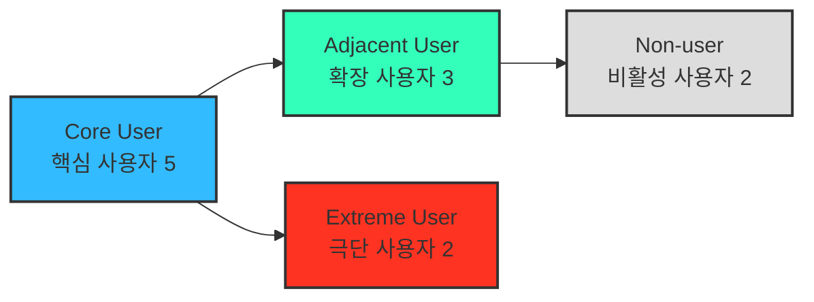
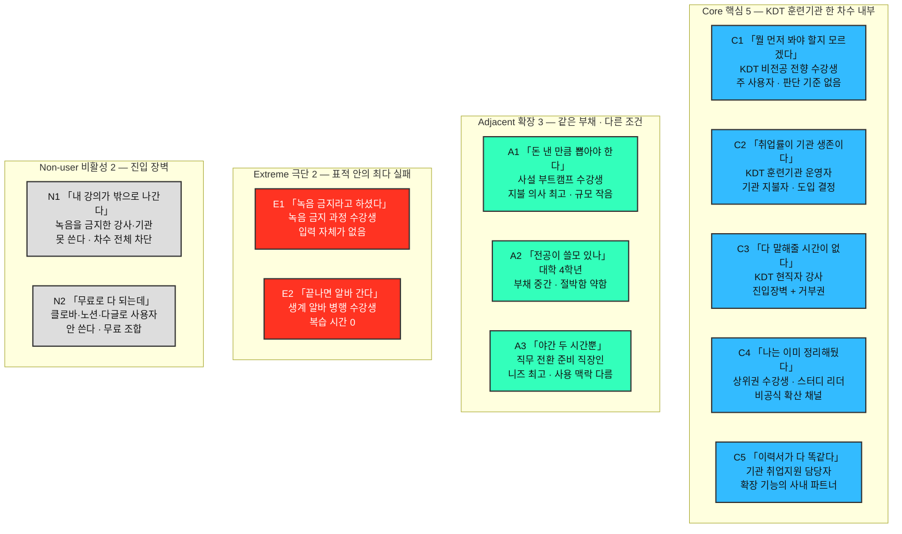
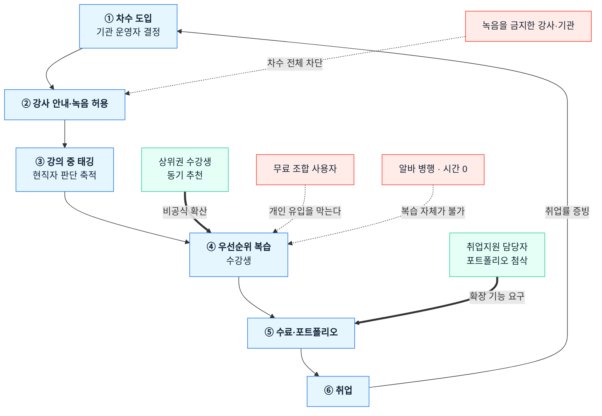

# 사례 01-B — 「콕집」 페르소나 스펙트럼 ①단계: 1차 생성 (Divergent Thinking)

> **콕집** — 국비 교육·대학 강의를 녹음·태깅해, **현직자 관점의 우선순위로 복습할 것만 골라주는** 학습 앱

작성 시점: 2026년 8월

근거 문서
- [사례 01-A 기본 페르소나](./case-01-personas.md) — 세그먼트에서 도출한 사용·지불·영향 역할
- [Ch04 TAM-SAM-SOM & 세그먼트 맵](../04-tam-sam-som-market-segment-map/case-01-kokjip-lecture-review-prioritizer.md) — **[4]**
- [간이 딥 리서치 — 경쟁 실사·채용 단가](../04-tam-sam-som-market-segment-map/deep-research/kokjip-research.md) — **[R]**
- [산정 근거 데이터](../04-tam-sam-som-market-segment-map/deep-research/kokjip-sizing-evidence.md) — **[E]**

---

## 0. 이 문서의 위치와 읽는 법

**5단계 워크플로우 중 ①단계 산출물입니다.**

| 단계 | 상태 | 산출물 |
|---|---|---|
| **① 1차 생성 (Divergent)** | **← 현재** | **원본 12종 — 평가·선별 전** |
| ② 2차 평가 (Convergent) | 미착수 | 유형별 1개씩 4종 대표 선별 |
| ③ 3차 보정 (Contextual) | 미착수 | 서비스 맥락에 맞춘 4종 카드 |
| ④ 4차 검증 (Peer Review) | 미착수 | 실존 확률·근거 리포트 |
| ⑤ 5차 통합 (Spectrum Map) | 미착수 | 관계 구조 시각화 완성 |

> **⚠️ 이 문서를 결론으로 쓰면 안 됩니다.** 발산 단계의 목적은 **가능성을 넓히는 것**이므로 실존 확률이 낮은 페르소나가 의도적으로 섞여 있습니다. 선별은 ②단계, 실존 검증은 ④단계에서 합니다.

**근거 표기** — 🟢 실측 / 🟡 유도 / 🔴 순수 가설(④단계 검증 필요)

**식별자는 유형명입니다.** 가상의 사람 이름을 붙이지 않았습니다 — 실제 인물로 오인될 여지를 만들지 않고, "이 사람이 어떤 유형인가"가 곧 식별자여야 ②단계 선별에서 비교가 가능하기 때문입니다.

### 표적 세그먼트

| 항목 | 내용 |
|---|---|
| 표적 | **국비 부트캠프(KDT) 수강생** — 하루 8시간·6개월. 연간 참여 **37,628명** 🟢 |
| 표적 계정 예시 | **KDT 훈련기관 한 곳의 한 차수(수강생 약 25명)**. Core 5명 전원과 Non-user 1명이 이 안에 있음 |
| 왜 한 차수에 몰아넣었는가 | Ch04가 **기관 판매를 주 채널**로 확정했으므로([4] §2-4), Core는 **한 차수 안에서 도입이 결정되고 사용이 일어나는 사람들**이어야 정합적입니다 |

---

## 1. 스펙트럼 4유형과 도출 질문

| 질문 | 이 서비스에서의 답 |
|---|---|
| **(확장)** 유사한 제품·서비스를 쓰고 있는 사람은 누구인가 | **같은 복습 부채를 다른 조건에서 겪는 학습자.** 사설 유료 부트캠프 수강생(자비 지불), 대학 4학년(부채가 작고 분산), 직무 전환 직장인(가용 시간 극소). 문제는 같고 **지불 구조와 가용 시간이 다르다** |
| **(비활성)** 이 서비스를 **쓸 수 없는** 사람은 누구인가 | **못 쓰는 쪽** — 강의 녹음이 금지된 과정의 수강생·강사. 제품의 전제가 깨진다. **안 쓰는 쪽** — 클로바노트·노션·다글로 무료 조합으로 충분하다고 판단한 학습자 🟢 |
| **(극단)** 가장 자주 실패를 경험하는 사람은 누구인가 | **녹음 금지 과정의 수강생**과 **생계 알바를 병행하는 수강생.** 전자는 입력이 없고, 후자는 **우선순위를 알려줘도 복습할 시간 자체가 0**이다 |

---

## 2. Core User — 핵심 사용자 5

> KDT 훈련기관 한 차수 안의 다섯 사람. 매출과 사용 빈도의 중심.

### C1. 무엇부터 볼지 모르는 비전공 전향 수강생

| 항목 | 내용 |
|---|---|
| **직무** | KDT 데이터·개발 과정 수강생(28세). 문과 전공 후 전향. 하루 8시간·6개월 과정의 3주차 |
| **문제** | 하루치 복습을 못 끝내고 다음 날 새 강의가 시작된다. 몰아서 하려면 **무엇부터 볼지 몰라 처음부터 자료를 다시 뒤진다** 🟡. **실무를 안 해봤으니 중요도 판단 기준 자체가 없다.** 오답 기반 도구는 도움이 안 된다 — **내가 무엇을 모르는지조차 모른다** 🟡. 취업률이 62.6%→54.2%로 떨어진 것을 안다 🟢 |
| **목표** | 우선순위 높은 것만 복습하고 **남은 시간을 이력서·코딩테스트에 재배분**하는 것 |
| **감정** | **불안과 자책.** "남들은 따라가는데 나만 못 하는 건가." 전향자로서의 조바심 |
| **대체 솔루션** | 클로바노트 무료 녹음 🟢 · 노션에 자료만 쌓아두기(안 읽음) 🟢 · 잘하는 동기에게 물어봄 · 유튜브 · 포기하고 진도만 따라감 |

### C2. 취업률로 평가받는 훈련기관 운영자

| 항목 | 내용 |
|---|---|
| **직무** | KDT 훈련기관 운영 책임자(45세). 전국 **178곳** 🟢 중 하나. 과정 설계·강사 수급·취업 지원·성과 보고 총괄 |
| **문제** | **취업률이 기관 생존이다** — 2년간 8.4%p 하락 🟢하고 기관은 그 성과로 지정·평가받는다. 수강생이 왜 못 따라오는지 **중도 이탈 후에야 안다**. 강사에게 잘 가르치라고는 해도 **수강생의 복습을 관리할 수단이 없다**. 정부 훈련비(4,731억, 2024 🟢) 안에서 운영해 과정당 비용을 늘리기 어렵다 |
| **목표** | 취업률 방어·개선을 **성과 보고에 쓸 수 있는 형태로 증빙**하는 것 |
| **감정** | **압박과 무력감.** 결과 책임은 지는데 개입 수단이 없다 |
| **대체 솔루션** | 강사 교체 · 커리큘럼 조정 · 스터디 강제 편성 · 취업 특강 추가 · 아무것도 안 함 |

### C3. 다 말해줄 시간이 없는 현직자 강사

| 항목 | 내용 |
|---|---|
| **직무** | KDT 과정 강사(38세). **현직 실무자 또는 실무 경력자.** 정해진 커리큘럼을 기간 내 소화해야 한다 |
| **문제** | **"이건 실무에서 중요하고 이건 나중에 봐도 된다"를 알지만 수업 중 다 말할 시간이 없다** 🟡. 같은 질문을 매 차수 반복 · 수강생이 어디서 막히는지 과제로만 사후에 안다 · **녹음을 허용하면 강의 자료가 외부로 유출될 우려** 🔴 |
| **목표** | 진도를 지키면서 중요도 판단을 전달하는 것. 반복 질문을 줄이는 것. 자기 강의 자산이 통제 없이 퍼지지 않는 것 |
| **감정** | **아쉬움과 경계심의 공존.** 알려주고 싶은 마음과 자료 유출 우려 |
| **대체 솔루션** | 수업 중 구두 강조 · 별도 정리 자료 배포(준비 시간 부족) · 녹음 금지 공지 |

> **이 페르소나가 제품의 진입장벽입니다.** [R]의 경쟁 실사에서 **다글로가 이미 "대학생 강의 녹음 → 요약 → AI 퀴즈"를 무료 티어로 제공**하는 것이 확인됐습니다 🟢. 녹음·요약·퀴즈는 복제 가능하지만 **현직자 판단의 축적은 강사 네트워크 없이 복제할 수 없습니다.** 동시에 **녹음을 금지할 수 있는 거부권자**이므로, **진입장벽과 거부권이 같은 사람에게** 있습니다.

### C4. 이미 스스로 정리해둔 상위권 수강생

| 항목 | 내용 |
|---|---|
| **직무** | 같은 차수의 상위권 수강생(26세). 관련 전공 또는 독학 경험이 있어 진도를 여유 있게 따라간다. 스터디 리더 역할 |
| **문제** | 동기들의 질문을 하루에 여러 건 받는다 🔴. 자기 정리 노트를 계속 공유하는데 **정리 자체에 자기 시간을 쓴다**. 이 기여가 어디에도 기록되지 않는다 🔴 |
| **목표** | 자기 학습 효율은 유지하면서 **반복 질문을 한 번에 정리해 끝내는 것.** 취업 시 차별화 근거를 만드는 것 |
| **감정** | **보람과 부담의 공존.** 도움을 주는 만족과 "내 시간도 없는데"라는 피로 |
| **대체 솔루션** | 노션에 정리 노트 공유 🟢 · 스터디 채널 운영 · 결국 질문 무시 |

> **확산의 실제 채널입니다.** 기관 도입 경로와 별개로 **이 사람의 추천이 동기 25명에게 직접 도달**합니다.

### C5. 이력서가 다 똑같아 고민하는 취업지원 담당자

| 항목 | 내용 |
|---|---|
| **직무** | 같은 훈련기관의 취업지원 담당자(34세). 수료생 이력서·포트폴리오 첨삭, 기업 연계, 취업률 집계 담당 |
| **문제** | **같은 과정 수료생의 포트폴리오가 서로 비슷하다** 🔴 — 커리큘럼이 같으니 결과물도 같다. 수강생이 무엇을 실제로 이해했는지 알 방법이 없어 **첨삭이 표면적이 된다** 🔴. 취업률 집계 시점에는 이미 늦었다 |
| **목표** | 수료생마다 **다른 이야기를 만들어 줄 재료**를 확보하는 것. 취업률을 앞당겨 관리하는 것 |
| **감정** | **초조함.** 결과가 숫자로 남는데 통제할 수 있는 것은 첨삭뿐 |
| **대체 솔루션** | 개별 면담 · 외부 취업 컨설턴트 · 모의 면접 · 채용 담당자 초청 특강 |

> **확장 기능(포트폴리오 소재 도출)의 사내 파트너입니다.** 복습 기록에서 개인별 서사를 뽑을 수 있다면 **수강생보다 이 사람이 먼저 필요를 느낍니다.**

---

## 3. Adjacent User — 확장 사용자 3

> 같은 복습 부채, 다른 지불 구조와 가용 시간.

### A1. 자비 수백만 원을 낸 사설 부트캠프 수강생

| 항목 | 내용 |
|---|---|
| **직무** | 사설 유료 부트캠프 수강생(29세). 수강료를 **자비 부담**. 취업 성공 시 환급 조건이 붙은 과정도 있다 |
| **문제** | C1과 동일한 복습 부채 + **투자 회수 압박** 🔴. "이 돈을 냈으니 반드시 취업해야 한다"는 압력이 학습을 조급하게 만든다 |
| **목표** | 지불한 만큼 회수. 학습 효율을 **눈에 보이는 지표**로 확인 |
| **감정** | **절박함과 조급함.** 매몰비용을 의식한다 |
| **대체 솔루션** | 무료 도구 조합 · 추가 유료 강의 구매 · 스터디 · 멘토링 서비스 |
| **왜 Adjacent인가** | **유료 결제 저항이 가장 낮아 첫 유료 전환 실험 대상으로 최적**이나 🔴, 규모가 작고 기관 판매 채널이 없습니다. Core는 기관 판매가 되는 KDT로 둡니다 |

### A2. 전공이 취업에 쓸모 있는지 모르는 대학 4학년

| 항목 | 내용 |
|---|---|
| **직무** | 4년제·전문대 졸업 학년(24세). 전공 강의와 취업 준비 병행. 에브리타임 MAU **289만 명** 🟢 안에 있다 |
| **문제** | 전공 강의 내용이 **취업에 실제로 쓰이는지 판단이 안 선다** 🔴. 강의 밀도는 부트캠프보다 낮으나 **분산돼 관리가 더 어렵다**. 학점과 취업 준비가 경합 |
| **목표** | 전공 학습 중 취업에 쓰일 부분만 골라내기. 학점을 지키며 시간 확보 |
| **감정** | **막연한 불안.** 절박하지는 않으나 늘 뒤처지는 느낌 |
| **대체 솔루션** | 선배·취업 커뮤니티 정보 · 무료 녹음 앱 · 스펙 위주 준비 |
| **왜 Adjacent인가** | 복습 부채가 중간이라 **문제의 절박함이 약합니다**([4] §2-2). 접근은 쉬우나 전환은 어렵습니다 |

### A3. 야간 두 시간뿐인 직무 전환 준비 직장인

| 항목 | 내용 |
|---|---|
| **직무** | 재직 중 직무 전환을 준비하는 직장인(33세). 퇴근 후 온라인 과정 수강 |
| **문제** | **가용 시간이 하루 1~2시간**이라 우선순위 판단이 가장 절실하다 🔴. 그런데 강의를 실시간으로 듣지 않아 **"강의 중 태깅"이라는 전제가 약하다**(녹화 강의 시청) |
| **목표** | 최소 시간으로 전환에 필요한 것만 익히기 |
| **감정** | **피로와 초조.** 시간이 없다는 사실 자체가 스트레스 |
| **대체 솔루션** | 배속 시청 · 요약 강의 · 무료 요약 도구 |
| **왜 Adjacent인가** | 니즈는 가장 강하지만 **사용 맥락이 다릅니다** — 실시간 강의가 아니라 녹화 강의이므로 제품 흐름을 바꿔야 합니다 |

---

## 4. Extreme User — 극단 사용자 2

> 표적 세그먼트(KDT 수강생) 안에서 **가장 자주 실패하는** 두 사람.

### E1. 녹음이 금지된 과정의 수강생

| 항목 | 내용 |
|---|---|
| **직무** | KDT 수강생(27세). 강사·기관이 **강의 녹음을 금지**한 과정에 배정됨 🔴 |
| **문제** | **입력 자체가 없다.** 녹음이 안 되면 태깅도, 요약도, 우선순위도 만들어지지 않는다 — **제품의 전제가 깨진다.** 필기로 대체하려면 강의를 놓치고, 필기하면서는 태깅할 여유가 없다. 규정을 어기면 과정 제재 위험 |
| **목표** | 규정을 어기지 않으면서 복습 우선순위를 얻는 것 |
| **감정** | **박탈감.** "옆 반은 되는데 우리 반만 안 된다" |
| **대체 솔루션** | 손 필기 · 강사 배포 자료만 활용 · 동기의 노트 공유 · 아무것도 안 함 |

> **E1이 제품의 설계 한계를 드러냅니다.** 녹음 가능 여부가 제품 작동의 **이진 조건**이므로, 금지 비율이 높으면 **강의 자료·판서 기반 대체 입력 경로**가 없는 한 그 과정은 시장에서 빠집니다. [§7](#7-2단계2차-평가로-넘기는-것)의 검증 1순위입니다.

### E2. 강의 후 알바를 가는 수강생

| 항목 | 내용 |
|---|---|
| **직무** | KDT 수강생(30세). 훈련장려금만으로 생활이 안 돼 **강의 후 야간 알바** 병행 🔴 |
| **문제** | **우선순위를 알려줘도 복습할 시간이 0이다.** 귀가가 자정이고 다음 날 9시에 강의가 시작된다. 이동 시간 30분이 유일한 가용 시간. 중도 이탈 위험군의 실체 |
| **목표** | **이동 중에 소비 가능한 형태**로 최소한만 붙잡는 것. 수료라도 하는 것 |
| **감정** | **체념과 생존 모드.** 학습이 아니라 버티기가 목표가 된다 |
| **대체 솔루션** | 이동 중 배속 청취 · 시험 직전 벼락치기 · 수료 요건만 채우기 |

> **E2는 제품 형태 요구를 만듭니다** — 텍스트 요약이 아니라 **이동 중 청취 가능한 짧은 오디오 브리핑**이 필요합니다. 동시에 **시간이 0에 가까울수록 우선순위의 가치는 최대**가 되므로, 이 사람은 가장 절실한 사용자이기도 합니다.

---

## 5. Non-user — 비활성 사용자 2

### N1. 녹음을 금지한 강사·기관 *(못 쓴다)*

| 항목 | 내용 |
|---|---|
| **직무** | KDT 강사 또는 기관의 교육 운영 책임자. 강의 녹음·촬영을 **정책으로 금지**한 주체 |
| **문제** | 강의 자료·판서·설명이 **외부로 유출되면 강사의 자산이 무력화**된다 🔴. 수강생이 녹음물을 커뮤니티에 올리면 통제할 방법이 없다. 초상권·저작권 분쟁 우려 |
| **목표** | **자기 강의 자산의 통제권 유지.** 분쟁 소지를 만들지 않는 것 |
| **감정** | **방어적.** 편익보다 유출 리스크가 크게 느껴진다 |
| **대체 솔루션** | 녹음 금지 공지 · 자료 워터마크 · 자료 배포 없이 화면만 제공 |

> **거부 요인의 실체입니다.** Core 5명이 전원 찬성해도 이 사람이 막으면 **해당 차수 전체가 시장에서 빠집니다.** 제품이 **강사 자산 귀속·반출 통제·과정 종료 시 삭제**를 계약 요건으로 갖춰야 하는 이유이고, 재진입 조건은 **"강사가 태깅 데이터의 소유자가 되고 녹음물은 과정 종료 시 삭제된다"**는 보장입니다.

### N2. 무료 조합으로 충분하다고 판단한 학습자 *(안 쓴다)*

| 항목 | 내용 |
|---|---|
| **직무** | KDT 또는 대학 수강생. 이미 **클로바노트 + 노션 + ChatGPT** 조합을 쓰고 있다 |
| **문제** | 본인 기준으로 문제가 해결됐다고 느낀다 🟡. 녹음·전사·요약이 **전부 무료로 된다** — 클로바노트 개인 무료(월 300~600분), 노션 학생 플러스 무료 🟢. **다글로는 강의 요약에 AI 퀴즈까지 무료 티어로 제공** 🟢 |
| **목표** | 추가 비용 없이 현 상태 유지 |
| **감정** | **만족과 무관심.** 새 앱을 깔 이유를 못 느낀다 |
| **대체 솔루션** | 이미 대체 솔루션 자체가 정체성 |

> **[R]의 경쟁 실사가 이 페르소나의 근거입니다.** 전환 논거는 가격이 아니라 **"무료 조합이 답하지 못하는 질문"** 하나뿐입니다 — 오답·성취도 기반 도구는 *"내가 못하는 것"* 을 알려주지만 *"취업에 필요한 것"* 은 알려주지 못합니다. **비전공 전향자는 자기가 무엇을 모르는지조차 모르므로** 그 차이가 결정적입니다.

---

## 6. 스펙트럼 맵

### 6-1. 배치도 — 누가 어느 유형인가

각 칸은 **「그 사람의 머릿속 한 문장」 · 소속과 직무 · 한 줄 규정**입니다. 네 유형을 위아래로 쌓고 유형 안의 인물은 좌우로 나열했습니다.

**Core 5명이 한 차수 안에 있는 것은 설계입니다.** Ch04가 기관 판매를 주 채널로 확정했으므로 Core는 **도입 결정(운영자)·입력 공급(강사)·사용(수강생)·확산(상위권)·확장 파트너(취업지원)** 가 한 계정 안에서 맞물리는 사람들이어야 합니다.

### 6-2. 관계도 — 제품이 도는 한 줄과 그것을 끊는 지점

### 6-3. 확장·전환 경로

| 방향 | 경로 | 조건 |
|---|---|---|
| **확장** | KDT에서 검증 → **A1 사설 부트캠프**(지불 의사 최고) → **A2 대학**(에브리타임 채널) → **A3 직장인**(제품 흐름 변경 필요) | 셋의 지불 구조와 사용 맥락이 달라 같은 방식으로 접근할 수 없다 |
| **전환** | **N2 무료 조합 사용자** → Core | 가격이 아니라 **"오답 기반으로는 알 수 없는 것"** 이 유일한 논거 |

### 이 세 그림에서 읽히는 것

| 관찰 | 함의 |
|---|---|
| **강사가 ②를 쥐고 있다** | 진입장벽(현직자 판단)과 거부권(녹음 금지)이 **같은 사람**에게 있다. 강사를 확보하면 방어력이 되고, 놓치면 제품이 성립하지 않는다 |
| **차단 셋 중 둘이 ④(복습)에 몰린다** | 도입은 돼도 복습이 안 일어날 수 있다 — 무료 조합에 익숙한 사람과 시간이 0인 사람 |
| **되돌아오는 고리는 취업률 하나** | ⑥ → ① 재계약이 취업률로만 닫힌다. **취업률 기여를 증빙하지 못하면 다음 차수가 없다** |
| **⑤에 확장 기능의 파트너가 있다** | 포트폴리오 소재 도출은 수강생이 아니라 **취업지원 담당자가 먼저 원한다** |

---

## 7. ②단계(2차 평가)로 넘기는 것

### 평가 기준 후보

| 기준 | 왜 |
|---|---|
| **리서치 수치로 뒷받침되는가**(🟢 비중) | 12종 중 🔴가 적지 않다. 발산에선 정상이나 선별에선 감점 |
| **제품 작동의 전제를 만족하는가** | 녹음 가능·실시간 강의라는 두 전제. A3와 E1이 이 기준으로 갈린다 |
| **표적 세그먼트(KDT) 안에 있는가** | [4]가 확정한 경계 |
| **제품 설계를 바꾸는 요구를 갖는가** | 극단 사용자 선별 기준 |

### ④단계 검증이 특히 필요한 항목

- [ ] **강의 녹음이 금지되는 비율** 🔴 — **최우선.** 제품 작동의 이진 조건이고, 높으면 대체 입력 경로 없이는 시장이 줄어든다
- [ ] **강사가 자기 판단을 데이터로 제공할 의향** 🔴 — 진입장벽의 실체([R] §6 1순위)
- [ ] **기관 운영자가 도구 예산을 실제로 집행하는가** 🔴 — 규모 논거의 전제([E] §5 2순위)
- [ ] 상위권 수강생이 실제로 확산 채널로 작동하는 규모 🔴
- [ ] 생계 알바 병행 수강생의 비중 🔴 — E2가 소수면 오디오 브리핑 투자 근거가 약하다
- [ ] A1~A3의 지불 구조·사용 맥락 차이 🔴

### 주의 — 발산 단계의 알려진 편향

1. **감정 서술이 서사적으로 그럴듯한 방향으로 쏠렸습니다.** ④단계에서 "이야기가 좋다"와 "실제로 있다"를 구분해야 합니다.
2. **수강생 계열 세 명(C1·C4·E2)의 문제 서술이 겹칩니다.** 모두 "시간과 판단 기준"을 다루므로 ②단계에서 대표를 고를 때 중복을 감점해야 합니다.
3. **N2가 가장 위험한 페르소나입니다.** 근거가 🟢(무료 대체재 실측)인 유일한 Non-user이고, [4]의 SOM 중 **62%가 이 사람을 전환시키는 데** 걸려 있습니다.
