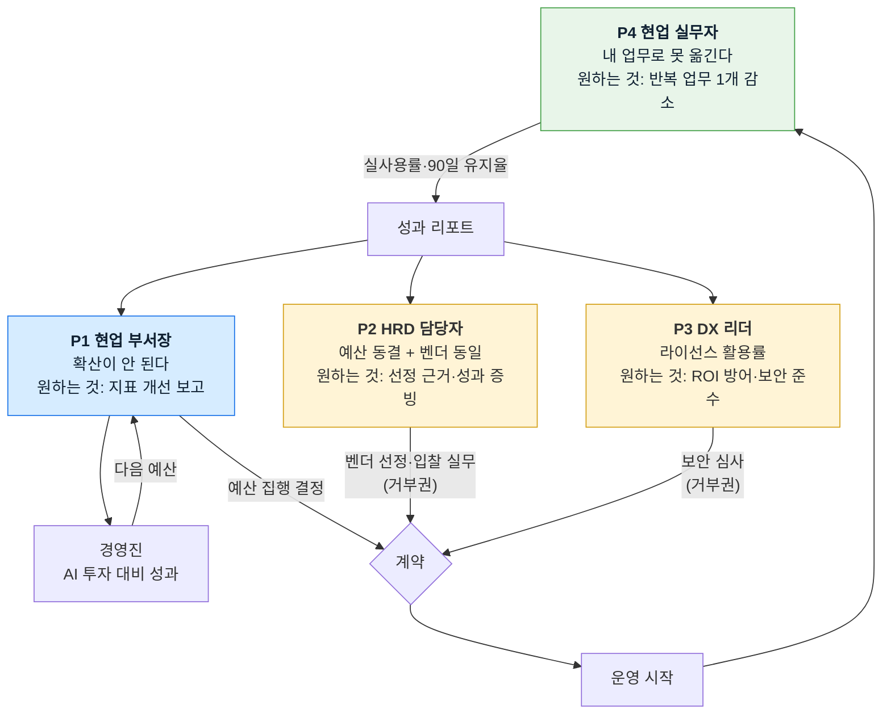

# 사례 01-A — B2B AX 교육 플랫폼의 기본 페르소나 (세그먼트 기반)

분석 기준 시점: 2026년 8월

> **이 문서의 위치** — Ch04 세그먼트 맵에서 **구매·사용 역할을 직접 도출**한 결과입니다. 극단·비활성 사용자까지 넓히는 작업은 별도 문서로 진행합니다 → **[사례 01-B 페르소나 스펙트럼](./case-01-persona-spectrum.md)**
>
> 두 문서의 역할이 다릅니다. **01-A는 계약을 만드는 사람들**(구매 의사결정 관계)이고, **01-B는 서비스를 둘러싼 사용자 다양성**(포용성·확장 기회·거부 요인)입니다.

근거 문서
- [Ch04 TAM-SAM-SOM & 세그먼트 맵](../04-tam-sam-som-market-segment-map/case-01-ai-education-edtech.md) — 이하 **[4]**
- [딥 리서치 본문](../04-tam-sam-som-market-segment-map/deep-research/case-ai-ax-edtech.md) — **[R]**
- [Ch01 5가지 힘](../01-porters-five-forces/case-01-ai-education-edtech.md) — **[1A]**
- [Ch03 KSF](../03-ksf/new-entrant-top5-ksf.md) — **[3]**

> 이 문서는 Ch05의 **페르소나** 부분만 다룹니다. 페르소나 스펙트럼과 고객 여정지도는 별도 작업으로 남겨 두었습니다([§7](#7-다음-단계)).

---

## 0. 전제

| 항목 | 내용 |
|---|---|
| **만들 서비스** | **B2B AX 교육 플랫폼** — 기업 임직원의 AI 활용 역량을 업무 성과로 전환시키는 플랫폼 |
| 승계한 표적 세그먼트 | **S4**(1,000인 이상 × AI 일부 부서만 도입) 주 표적, **S1**(전사 도입 완료) 2순위 ([4] §2-3) |
| 승계한 차별화 축 | 교육 중·직후가 아니라 **종료 후 정착률까지** 책임 ([R] 정제 4) |
| 승계한 제외 조건 | 300인 미만(무료 공급이 덮음) · 에이전트 구축 수임(이해상충) |

---

## 1. 페르소나 추출 규칙

**세그먼트는 회사를 나누지만 제품을 쓰는 건 사람입니다.** Ch04가 남긴 것은 "1,000인 이상 × 일부 부서 도입"이라는 회사의 조건이고, 페르소나는 그 회사 안에서 서로 다른 것을 원하는 사람들입니다.

세 가지를 결합해 추출했습니다.

```
세그먼트 (Ch04)  ×  역할 (조직 내 위치)  ×  상황 (그 역할이 압박받는 시점)
                              ↓
                          페르소나
```

**역할만으로 페르소나를 만들면 안 됩니다.** "HRD 담당자"는 역할이고, "예산은 동결인데 AI 교육을 1순위로 올려야 하는 대기업 HRD 담당자"가 페르소나입니다. 상황이 없으면 그 사람이 왜 지금 우리를 만나는지 설명되지 않습니다.

### 세그먼트 → 페르소나 매핑

| 세그먼트 | 처분 | 도출된 페르소나 | 계약에서의 위치 |
|---|---|---|---|
| **S4** 1,000인 이상 × 일부 부서 도입 | **주 표적** | **P1** 현업 부서장 | **1차 고객 · 예산 소유** |
| | | **P2** 대기업 HRD 담당자 | 운영 파트너 · **게이트키퍼** |
| | | **P3** DX/AI 추진 리더 | 도입 예산 · **보안 게이트** |
| | | **P4** 현업 실무자 | 성패의 **실제 결정자** |
| **S1** 1,000인 이상 × 전사 도입 완료 | 2순위 | **P5** 전사 AX 오너 | 계측만 구매 |
| **S5** 300~999인 × 일부 부서 도입 | 보류 | **P6** 중견기업 HRD 겸임자 | 유료 전환 여력 미확인 |
| S6·S9 300인 미만 | 제외 | 안티 페르소나 ([§6](#6-안티-페르소나--의도적으로-겨냥하지-않는-사람)) | — |

**S4 하나에서 페르소나가 넷 나옵니다.** [1A]가 구매자 교섭력을 5/5로 매긴 이유가 여기서 사람의 얼굴로 나타납니다 — **넷 중 하나만 막아도 계약이 안 됩니다.**

---

## 2. 주 표적 세그먼트(S4)의 페르소나

### P1. 확산 정체에 걸린 현업 부서장 — *1차 고객*

| 항목 | 내용 |
|---|---|
| **유형명** | **확산 정체에 걸린 현업 부서장** (The Stalled Line Manager) |
| **역할** | 1,000인 이상 기업의 현업 부서장(제조 품질·금융 규제문서·병원 행정 등 단일 도메인). 부서 사업예산 집행권과 AI 도입·운영 예산의 실질 결정권을 가짐 |
| **주요 문제** | ① 팀에 AI 툴은 깔렸는데 **몇 명만 쓴다** — 전사 확산은 25.0%에 그치고 75.0%가 일부 부서 단계에 정체([R] 3-3)<br>② 작년에 교육을 보냈지만 업무가 안 바뀜 — 교육 시행 기업의 **82%가 실무 적용 애로**를 경험([R] 3-4)<br>③ 경영진에게 보고할 숫자가 **이수율밖에 없다**<br>④ 부서원 간 활용 수준 격차가 커져 업무 배분이 꼬임 — AI 전환 장애요인 1위가 **직원 간 활용 수준 차이 55%** |
| **목표** | 부서의 업무 지표(처리시간·품질·재작업률) 개선을 **숫자로 보고**하는 것. AI에 쓴 예산의 명분을 확보하고, 다음 분기 예산을 방어하는 것 |
| **사용 맥락** | **분기 실적 리뷰 2~3주 전**에 리포트를 찾는다. 도입·운영 예산 집행 시점(반기 초)에 계약을 결정한다. 리포트는 **1페이지**여야 읽고, 그 이상이면 첨부로 넘긴다. 플랫폼에 직접 로그인하는 빈도는 월 1~2회 |
| **핵심 인용** | *"툴은 이미 있어요. 그걸 팀이 실제로 쓰게 만들어 주는 걸 사고 싶습니다."* |

**왜 1차 고객인가** — [2A] 2-4가 "현업 예산이 더 크고 성과 지향적"이라고 지목했고, [4] 정제 2가 예산 항목별 상한 차이(교육훈련비는 동결, 도입·운영비는 증가)로 이를 금액으로 확인했습니다.

---

### P2. 성과 증빙을 요구받는 대기업 HRD 담당자 — *게이트키퍼*

| 항목 | 내용 |
|---|---|
| **유형명** | **성과 증빙을 요구받는 HRD 담당자** (The Accountable L&D Planner) |
| **역할** | 1,000인 이상 기업(또는 그룹 인재개발원)의 HRD 실무자·팀장. 연간 교육계획 수립, 벤더 선정·경쟁입찰, 예산 집행 증빙을 담당 |
| **주요 문제** | ① **예산은 늘지 않는데 AI 교육을 1순위로 올려야 한다** — 2026년 교육 예산 동결 44.5%, 증액은 35.8%뿐인데 AI 교육 비중은 33.7%→50.9%로 요구됨([R] 5-1). 다른 항목을 **빼야 넣을 수 있다**<br>② 벤더가 다 비슷해 보인다 — 진단·업무 과제 실습·활용률 계측을 **12개 사업자가 동일 구성으로** 제안([R] 5-6)<br>③ 보고할 수 있는 지표가 만족도·이수율뿐이고, 경영진은 "그래서 뭐가 나아졌냐"를 묻는다<br>④ 전사에 같은 교육을 뿌리면 현업 적용률이 **11%**로 떨어진다는 것을 경험으로 안다([R] 3-4) |
| **목표** | 같은 예산으로 AI 교육 비중을 늘리면서 **성과를 증빙**하는 것. 벤더 간 차이를 설명할 수 있는 **선정 근거**를 확보하는 것. 운영 실무 부담을 늘리지 않는 것 |
| **사용 맥락** | **하반기 연간 교육계획 수립기**(9~11월)에 벤더를 탐색하고, 상·하반기 집중 운영 시즌([2A] 3-2)에는 신규 검토 여력이 없다. 예산 집행 증빙 문서가 **자동으로 나와야** 한다. 플랫폼 사용 빈도가 가장 높은 사용자 |
| **핵심 인용** | *"제안서는 다 똑같아요. 작년 대비 뭐가 나아졌는지 숫자로 보여줄 수 있어야 결재가 납니다."* |

**게이트키퍼로 다루는 이유** — 예산의 최종 소유자는 P1이지만 **벤더 등록·경쟁입찰·계약 실무가 P2를 통과**합니다. P2를 설득하지 못하면 P1에게 닿지 못하고, P2만 설득하면 교육훈련비 항목에 갇혀 계정당 3,500만 원 천장([R] 5-2)을 못 넘습니다.

---

### P3. 활용률 압박을 받는 DX/AI 추진 리더 — *보안 게이트*

| 항목 | 내용 |
|---|---|
| **유형명** | **활용률 압박을 받는 DX 리더** (The License Defender) |
| **역할** | DX·AI 전담 조직의 리더 또는 IT 부서장. AI 툴 라이선스 구매·사내 AI 게이트웨이 운영·보안 심사를 담당. AI 도입·운영 예산의 실제 관리자 |
| **주요 문제** | ① **라이선스는 샀는데 활용률이 낮다.** 범용 생성형 AI 활용률은 88%인데 전사 도입은 25%이고, 갱신 심사 때 ROI를 설명해야 한다<br>② 도입 저해요인 1위가 **"AI 기술·지식·전문성 부족 45%"** — IT가 해결할 수 없는 영역인데 책임은 IT에 온다<br>③ 교육 벤더에게 **사내 데이터를 열어주는 보안 심사** 부담. 심사 리드타임이 도입 일정을 지배한다([R] 7-5의 SRS 제약)<br>④ 부서별로 각자 다른 툴을 결제해 협상력이 분산됨([2A] 3-4) |
| **목표** | 도입한 AI의 **활용률을 올려 라이선스 ROI를 방어**하는 것. 데이터 처리 근거와 수탁 계약을 문서로 확보하는 것. 부서별 활용률을 비교 가능한 지표로 갖는 것 |
| **사용 맥락** | **라이선스 갱신 심사 시점**(연 1회)에 활용률 데이터를 급하게 찾는다. 신규 벤더 도입 시 **보안 검토 게이트를 직접 운영**하며, 이 단계에서 데이터 격리·외부 모델 전송 정책·삭제 절차를 확인한다. 통과 못 하면 계약이 멈춘다 |
| **핵심 인용** | *"활용률 숫자를 못 만들면 내년에 라이선스를 줄여야 합니다. 그런데 사내 데이터를 밖으로 보내는 건 안 됩니다."* |

**이 페르소나가 계약의 리드타임을 정합니다.** P1이 사고 싶어 해도 P3의 보안 심사를 통과해야 시작됩니다. 반대로 P3의 문제(활용률 증빙)를 우리가 풀어주면 **P3가 내부 지지자로 전환**됩니다.

---

### P4. 내 업무로 옮기지 못하는 현업 실무자 — *성패의 실제 결정자*

| 항목 | 내용 |
|---|---|
| **유형명** | **내 업무로 옮기지 못하는 실무자** (The Stuck Practitioner) |
| **역할** | 표적 도메인의 현업 실무자(제조 품질검사자, 금융 규제문서 담당, 병원 행정 등). 개인적으로 범용 AI는 써본 상태 — 활용률 88% |
| **주요 문제** | ① **ChatGPT는 쓸 수 있는데 내 업무에 어떻게 붙이는지 모른다.** 교육에서 본 예제와 실제 업무 문서가 다르다<br>② 사내 데이터를 넣으면 안 된다는 규정이 있어 실습을 실제 업무로 옮길 수 없다<br>③ 전사 공통 교육은 내 직무와 무관해 적용률이 11%, 직무별로 나눠도 18%에 그친다([R] 3-4)<br>④ 개인이 찾아낸 방법이 **팀으로 안 퍼진다** — 공유할 자리도, 검증해 줄 사람도 없다<br>⑤ 마감 압박 속에서 학습 시간을 따로 낼 수 없다. 첫 과제 제출 단계에서 이탈이 가장 많다([2A] 2-2) |
| **목표** | **반복 업무 하나를 실제로 줄이는 것.** 팀에 보여줄 수 있는 결과물 하나를 만드는 것. 새 도구를 배우는 부담을 최소화하는 것 |
| **사용 맥락** | **업무 시간 중 짬**에 접속한다. 별도 로그인·별도 앱을 요구하면 안 들어온다 — **협업툴(Slack/Teams) 안에서** 주간 체크인이 완결돼야 응답률이 확보된다. 실습은 자기 실제 업무 문서로 해야 의미가 있고, 그래서 격리 환경이 전제된다 |
| **핵심 인용** | *"강의는 들었어요. 그런데 우리 검사 보고서에는 그게 안 먹혀요."* |

**이 페르소나가 성패를 결정하는 이유** — P4의 실사용률이 곧 우리가 P1에게 팔 지표입니다. P1·P2·P3가 계약을 만들지만 **P4가 안 쓰면 90일 유지율이 0이 되고, 성과 연동 과금 구조에서는 그것이 곧 우리 매출 손실**입니다([R] 정제 4).

---

## 3. 2순위 세그먼트(S1)의 페르소나

### P5. 격차를 진단해야 하는 전사 AX 오너

| 항목 | 내용 |
|---|---|
| **유형명** | **격차를 진단해야 하는 전사 AX 오너** (The Enterprise AX Owner) |
| **역할** | 전사 AI 도입을 이미 완료한 1,000인 이상 기업의 AX 추진 임원 또는 전담 팀장. 전사 AX 로드맵과 예산을 총괄 |
| **주요 문제** | ① **전사에 깔았는데 정말 쓰이는지 모른다.** 도입은 끝났고 다음 단계의 근거가 없다<br>② 부서·직무 간 활용 격차가 크다 — 장애요인 1위가 직원 간 활용 수준 차이 55%, AX 성숙도가 IT 대기업 68점 vs 제조·생산 28점으로 갈린다<br>③ 다음 해 AX 예산을 요청할 **증빙이 없다**<br>④ 교육은 이미 여러 차례 돌렸고 더 필요한지 확신이 없다 |
| **목표** | **직무별 정착률 시계열**을 확보해 부서 간 격차를 진단하는 것. 다음 투자의 우선순위를 데이터로 정하는 것. 경영진 보고 자료를 매 분기 자동으로 얻는 것 |
| **사용 맥락** | **연간 AX 로드맵 수립기**와 **경영진 분기 보고** 시점. 교육 패키지는 필요 없고 **진단·계측·리포팅만 분리 구매**하려 한다. 따라서 별도 상품 구성이 필요하다 |
| **핵심 인용** | *"교육은 충분히 했습니다. 이제 어디가 안 되고 있는지를 알고 싶어요."* |

**제품 구성이 달라야 하는 페르소나입니다.** [4]가 S1을 "제품의 계측 절반만 판다"고 처분한 이유이고, 교육 없이 계측만 파는 상품이 준비되지 않으면 이 세그먼트는 접근 불가입니다.

---

## 4. 보류 세그먼트(S5)의 페르소나

### P6. 예산 여력이 없는 중견기업 HRD 겸임자 — *보류*

| 항목 | 내용 |
|---|---|
| **유형명** | **예산 여력이 없는 HRD 겸임자** (The Constrained Generalist) |
| **역할** | 300~999인 기업에서 인사 업무와 교육을 **겸임**. HRD 전담 조직이 없고 담당자가 1~2명 |
| **주요 문제** | ① 필요성은 확실히 안다 — AI 교육 필요성 동의 **97%**. 그런데 **AI 교육 예산 5,000만 원 이상 편성이 14%뿐**(대기업 38%)<br>② 도입 실행률이 50%로 절반은 아직 AI 자체를 안 쓴다<br>③ 정부 지원 과정을 먼저 찾는다. 다만 무료 공급의 경계가 1,000인이라 이 구간은 **경계선에 걸쳐 혼란**<br>④ 겸임이라 운영에 쓸 시간이 없다 |
| **목표** | **최소 비용으로 시작**하는 것. 정부 지원사업을 최대한 활용하는 것. 운영 손이 거의 안 가는 형태를 찾는 것 |
| **사용 맥락** | **정부 지원사업 공고 시기**에 움직인다. 소수 인원 파일럿부터 시작하려 하고, 컨시어지형 밀착 운영을 감당할 예산이 없다 |
| **처분** | **보류.** 유료 전환 가능성이 낮고(예산 편성 14%) 무료 공급과 경계를 다툰다. 다만 **무료 공급이 이 구간에서 끝나므로**, 1,000인 이상 계정에서 자동화가 완성된 뒤 저비용 셀프서브 형태로 재검토할 후보 |

---

## 5. 구매 의사결정 관계도

S4 한 세그먼트 안에서 네 페르소나가 **서로 다른 것을 원하고, 서로를 막을 수 있습니다.**



**읽는 법**

| 관찰 | 함의 |
|---|---|
| **거부권이 둘(P2·P3)** | 예산 소유자 P1을 설득해도 계약이 성립하지 않는다. 세 사람에게 **서로 다른 자료**가 필요하다 |
| **P4가 리포트의 원천** | P4가 안 쓰면 P1에게 보낼 숫자가 없다. 즉 **가장 아래 사용자가 가장 위 계약을 결정한다** |
| **고리가 P1 → 경영진 → P1로 닫힘** | 재계약은 P1이 경영진 보고에 성공했을 때만 발생한다([2A] 2-3의 "경영진용 산출물이 다음 계약을 만든다") |
| P2만 설득하면 | 교육훈련비 항목에 갇혀 계정당 3,500만 원 천장([R] 5-2) |
| P3를 지지자로 돌리면 | 보안 게이트가 오히려 **도입 예산 통로**가 된다 |

**[3] KSF2("지불 근거의 선증명 — 누가, 어떤 지표가 개선되면, 얼마를 내는가")가 페르소나 층위에서는 이렇게 번역됩니다.** 지불하는 사람(P1), 승인 경로를 쥔 사람(P2·P3), 지표를 만들어내는 사람(P4)이 전부 다르므로 **네 사람 각각에게 다른 약속을 문서로 확정**해야 합니다.

---

## 6. 안티 페르소나 — 의도적으로 겨냥하지 않는 사람

세그먼트를 나눈 목적은 버릴 곳을 정하는 것입니다([4] 방법론 §3-2).

| 안티 페르소나 | 왜 겨냥하지 않는가 |
|---|---|
| **300인 미만 기업의 대표·관리자** | 교육훈련비가 300인 이상의 **15.2%**이고, KOSA AI AX 공동훈련센터가 1,000인 미만에 **전액 무료**로 진단·훈련·업무 과제 PBL을 제공한다([R] 5-6). 가격 상한이 0인 구간 |
| **AI 미도입 조직의 IT 담당자** | 툴 도입이 선행 과제이고 그것은 SI·툴 벤더의 영역. 우리가 파는 것은 도입된 AI의 정착 |
| **개인 수강생** | B2C는 역성장 세그먼트이며 계측할 '업무'가 없다([R] 정제 1) |
| **에이전트 구축을 원하는 DX 조직** | 자기가 만든 것의 정착률을 자기가 계측하는 **이해상충**. 성과 연동 과금과 산식 공개를 차별화로 삼는 사업이 안을 수 없다([R] 7-5) |
| **이수율·만족도만 필요한 HRD** | 그 지표로 평가받게 되면 제품의 차별화(90일 유지율)가 무의미해진다 |

---

## 7. 다음 단계

이 문서는 페르소나까지입니다. Ch05의 나머지 두 산출물과 이후 챕터로 넘길 것을 적어 둡니다.

| 다음 산출물 | 이 문서에서 넘기는 입력 |
|---|---|
| **페르소나 스펙트럼** | P4가 가장 넓은 스펙트럼을 갖는다 — AI 활용 수준 격차가 장애요인 1위(55%)이고, 진단 기반 수준별 교육이 적용률을 11%→32%로 3배 올린다. **스펙트럼의 양 끝(파워 유저 ↔ 첫 접촉)을 정의해야 학습 경로 설계가 가능** |
| **고객 여정지도** | 네 페르소나의 여정이 **다른 시점에 시작한다** — P2는 하반기 계획 수립기, P1은 반기 예산 집행기, P3는 라이선스 갱신기, P4는 운영 시작 후. 접점 설계는 이 시차를 전제해야 한다 |
| **Ch06 기회점수** | 페르소나별 문제의 심각도(빈도 × 불만족도)가 기회점수의 입력 |
| **Ch07 JTBD** | P4의 "내 업무로 못 옮긴다"와 P1의 "확산이 안 된다"가 각각 다른 과업 진술문이 된다 |

**검증이 필요한 가정** — 이 페르소나들은 공개 조사 수치와 선행 챕터 위에서 구성했고, **인터뷰로 검증하지 않았습니다.** 특히 아래 세 가지는 틀리면 페르소나 구조가 바뀝니다.

- [ ] P1(현업 부서장)이 AI 도입·운영 예산의 **실질 집행 권한**을 정말 갖는가 — [R] SRS 가정 A1, PoC 1차 기준으로 검증 예정
- [ ] P2(HRD)가 게이트키퍼인지 아니면 **실질 구매자**인지 — 기업 규모·업종에 따라 갈릴 가능성
- [ ] P3(DX 리더)의 보안 심사가 리드타임을 지배하는 정도 — 도입 일정 산정의 전제
