# Ch05 방법론 — 고객 여정지도 (Customer Journey Map)

> 고객이 **"문제를 인식 → 해결을 탐색 → 구매/사용 → 평가/유지"** 와 같은 과정에서 겪는 **경험·감정·Pain Point를 시각화한 흐름도.**

Ch05의 세 산출물 중 세 번째입니다. 앞의 두 개(페르소나, 페르소나 스펙트럼)는 **"누구인가"** 를 답하고, 여정지도는 **"그 사람이 시간 축에서 무엇을 겪는가"** 를 답합니다.

| 순서 | 산출물 | 답하는 질문 |
|---|---|---|
| 1 | 페르소나 | 누구인가 |
| 2 | 페르소나 스펙트럼 | 그 밖에 누가 더 있는가 (포용성·확장·거부) |
| **3** | **고객 여정지도** | **그 사람이 어떤 순서로 무엇을 겪는가** |

---

## 1. 여정지도가 하는 일

페르소나는 **정지 화면**이고 여정지도는 **동영상**입니다. 같은 Pain Point라도 그것이 **탐색 단계에서 생기는지 사용 단계에서 생기는지**에 따라 해법이 완전히 달라집니다.

| 여정지도가 답하는 것 | 여정지도가 답하지 못하는 것 |
|---|---|
| 언제 이탈하는가 | 몇 명이 이탈하는가 (→ 정량 분석) |
| 그 순간 무엇을 비교하는가 | 시장 전체가 얼마인가 (→ Ch04) |
| 어디에 개입해야 효과가 큰가 | 어느 개입이 가장 이익인가 (→ Ch06 기회점수) |

**여정지도는 개입 지점의 후보를 만드는 도구**이고, 그 후보의 우선순위는 Ch06에서 정합니다.

---

## 2. 단계(Stage) 정의하는 방법

여정지도 작성의 90%는 **단계를 무엇으로 쪼갤지** 결정하는 일입니다. 나머지는 채우기입니다.

### 2-1. 출발점 — 범용 4~5단계

인식(Awareness) → 고려(Consideration) → 구매·결정(Decision) → 사용(Use) → 유지·옹호(Retention·Advocacy)

**이것은 출발점이지 결과물이 아닙니다.** 이 이름을 그대로 쓴 여정지도는 어느 산업에 갖다 놔도 맞고, 그래서 아무것도 알려주지 않습니다.

### 2-2. 단계 경계를 찾는 네 가지 신호

범용 단계를 우리 서비스의 단계로 바꾸려면 **경계가 실제로 바뀌는 지점**을 찾습니다.

| 신호 | 질문 | 왜 경계인가 |
|---|---|---|
| **판단 기준이 바뀐다** | 고객이 비교하는 축이 여기서 달라지는가 | 앞 단계에서 가격을 보다가 뒤 단계에서 신뢰를 본다면 그 사이가 경계 |
| **담당자가 바뀐다** | 여기서 다른 사람이 등장하는가 | **B2B에서 가장 강한 신호.** 실무자 → 부서장 → 구매 → 보안으로 넘어가는 지점 |
| **되돌릴 수 없어진다** | 여기를 넘으면 이전으로 못 돌아가는가 | 계약 체결·데이터 이관·조직 공지 |
| **기다림이 발생한다** | 고객이 여기서 멈춰 대기하는가 | 심사·승인·예산 편성 — 대기 구간이 곧 이탈 구간 |

### 2-3. 단계 수의 실무 기준

- **5~8개**가 실용 범위입니다. 4개 이하면 각 단계가 뭉개져 개입 지점이 안 보이고, 9개 이상이면 읽히지 않습니다.
- 단계 이름은 **고객의 언어**로 씁니다. "리드 획득"은 우리 언어이고 "이게 우리한테 되는지 확인" 이 고객 언어입니다.

### 2-4. B2B 특수 규칙 — 누구의 여정인가를 먼저 고정한다

B2B는 단계마다 관여자가 바뀝니다. 그래서 두 가지를 반드시 정합니다.

1. **주인공 페르소나 1명을 고정한다.** 여러 명을 섞으면 여정이 아니라 평균이 되고, 평균에는 이탈 지점이 없습니다.
2. **관여자 전환 지점을 별도로 표시한다.** 주인공이 바통을 넘기는 순간이 B2B 여정에서 가장 자주 끊기는 곳입니다.

> 참고: [고객 여정의 단계를 정의하는 방법 — IBM](https://www.ibm.com/kr-ko/think/topics/customer-journey-map)

---

## 3. 비즈니스 유형별로 여정은 매우 다르다

**같은 4단계 골격에서 출발해도, 그 산업의 결정적 순간은 산업마다 다릅니다.** 결정적 순간이 단계로 승격되지 않은 여정지도는 그 산업을 설명하지 못합니다.

**세 여정을 위아래로 쌓고 각 여정의 단계는 좌우로** 흐르게 했습니다 — 같은 자리를 위아래로 훑으면 **어느 산업에서 무엇이 단계로 승격되는지**가 보입니다.

```mermaid
graph TB
    subgraph GEN["범용 골격 — 출발점일 뿐"]
        direction LR
        G1["인식"] --> G2["고려"] --> G3["구매"] --> G4["사용"] --> G5["유지"]
    end

    subgraph FUR["가구 — 「실측」·「조립·설치」 승격"]
        direction LR
        F1["필요 발생"] --> F2["공간 실측"] --> F3["비교·선택"] --> F4["구매·배송 예약"] --> F5["조립·설치"] --> F6["사용·후회 검증"]
    end

    subgraph CAR["자동차 — 「비교」·「시승」·「협상」 승격"]
        direction LR
        R1["필요 발생"] --> R2["정보 수집"] --> R3["모델 비교"] --> R4["시승"] --> R5["가격 협상"] --> R6["출고 대기"] --> R7["보유·정비"]
    end

    classDef gen fill:#DDDDDD,stroke:#333,color:#111;
    classDef fur fill:#33FFBB,stroke:#333,color:#111;
    classDef car fill:#33BBFF,stroke:#333,color:#111;
    class G1,G2,G3,G4,G5 gen;
    class F1,F2,F3,F4,F5,F6 fur;
    class R1,R2,R3,R4,R5,R6,R7 car;
```



### 왜 그 단계가 승격되는가

| 시장 | 승격된 단계 | 승격 이유 |
|---|---|---|
| **가구** | **실측** | 이 단계를 틀리면 뒤의 모든 단계가 무효가 된다. 반품의 최대 원인 |
| | **조립·설치** | 구매 후에 노동이 남는다. 만족도가 여기서 결정되는데 판매자는 대개 여기에 없다 |
| **자동차** | **비교** | 대안 수가 많고 비교 축(연비·잔존가치·유지비)이 복잡해 단계 하나로 독립 |
| | **시승** | **정보로 대체할 수 없는 체험.** 여기서 결정이 뒤집힌다 |
| | **협상** | 정가가 없다. 같은 차를 사도 조건이 달라지므로 단계 자체가 가치 |

**우리 서비스에 적용할 때의 질문은 하나입니다** — *"이 산업에서, 이 단계를 틀리면 뒤가 전부 무효가 되는 순간은 어디인가?"*

---

## 4. 여정지도에 채우는 레인(Lane)

가로축이 단계라면 세로축이 레인입니다. **레인은 6개로 충분하고, 마지막 두 개가 이 도구의 존재 이유입니다.**

| # | 레인 | 기록하는 것 | 흔한 실수 |
|---|---|---|---|
| 1 | **단계** | 고객 언어로 된 이름 | 내부 프로세스 이름을 씀 |
| 2 | **행동** | 실제로 하는 일(동사) | 하기를 바라는 일을 씀 |
| 3 | **접점** | 우리를 **또는 대안을** 만나는 곳 | 우리 접점만 그림. 대체재가 사라짐 |
| 4 | **생각·질문** | 그 순간의 판단 기준 | 감정과 뒤섞음 |
| 5 | **감정** | 곡선 + **그렇게 판단한 근거** | 근거 없이 곡선만 예쁘게 그림 |
| 6 | **Pain Point → 기회** | 막히는 지점과 **개입 후보** | Pain만 적고 기회로 변환하지 않음 |

**레인 3(접점)에 대안을 반드시 넣습니다.** Ch01의 대체재 분석이 여정지도에서 다시 쓰이는 자리이고, 고객이 우리 대신 무엇을 쓰는지가 여기서 보입니다.

**레인 5(감정)에는 근거를 병기합니다.** 근거 없는 감정 곡선이 여정지도가 장식으로 전락하는 가장 흔한 경로입니다.

---

## 5. 작성 절차

```
① 주인공 페르소나 1명 확정        ← 섞으면 평균이 된다
② 단계 도출 (§2의 네 신호로)       ← 여기가 작업의 90%
③ 레인 6개 채우기                 ← 대안 접점을 빠뜨리지 않는다
④ 감정 곡선 + 근거 병기
⑤ Pain Point에 ID 부여 → 기회로 변환
⑥ 재사용 가능한 형태로 정리        ← §6의 판정 기준을 통과할 때까지
```

---

## 6. "예쁘면 다 좋은 게 아니라" — 지식으로서의 가치

> ***"예쁘면 다 좋은 게 아니라, 지식으로서 가치있는 부분을 가독성 높고 재사용하기 쉽게 추출하기"***

이 원칙을 판정 가능한 기준으로 옮깁니다.

### 6-1. 재사용성 판정

| 기준 | 통과 조건 |
|---|---|
| **인용 가능한가** | Pain Point마다 ID가 붙어 다른 문서가 `PP-3`처럼 참조할 수 있는가 |
| **백로그로 옮길 수 있는가** | Pain Point 하나를 골라 **그대로 개발·운영 과제로 옮길 수 있는가.** 못 옮기면 관찰이 아니라 감상 |
| **갱신 가능한가** | 고객 인터뷰 1건이 추가됐을 때 **어느 칸을 고쳐야 하는지 즉시 아는가** |
| **표로 환원되는가** | 그림 없이 표만 봐도 내용이 남는가 — 이미지에만 존재하는 정보는 재사용 불가 |

### 6-2. 가독성 판정

| 기준 | 통과 조건 |
|---|---|
| **한 단계씩 읽히는가** | 세로로 한 단계를 훑으면 그 순간의 전모가 잡히는가 |
| **감정 곡선이 주장인가** | 곡선의 최저점이 우리가 개입할 지점과 일치하는가. 무관하면 곡선을 지운다 |
| **아이콘이 정보인가** | 접점 아이콘에 **우선순위**가 있는가. 없으면 나열일 뿐 |

### 6-3. 장식으로 전락한 여정지도의 신호

- 모든 단계의 감정 곡선이 매끄럽게 하강 후 상승한다 (실제 데이터는 그렇게 안 생겼다)
- Pain Point가 단계마다 정확히 2개씩 있다 (균형을 맞추려고 만들어 넣은 것)
- 기회 레인이 비어 있거나 Pain을 그대로 옮겨 적었다
- 대안·경쟁 접점이 하나도 없다

---

## 7. 출력 포맷

```
0. 주인공 페르소나 확정 + 왜 이 사람인가
1. 단계 정의와 그 근거        — 범용 골격에서 무엇을 승격·분할·삭제했는지
2. 여정지도 본표              — 단계 × 레인 6개
3. 감정 곡선 + 근거
4. Pain Point 목록 (ID 부여)
5. 기회 후보와 개입 지점
6. 관여자 전환 지점 (B2B)
7. 검증이 필요한 가정         — 인터뷰로 확인해야 할 칸
```

---

## 8. 검증 질문 (작성 후 자기점검)

- [ ] 단계 이름이 **고객의 언어**인가, 우리 내부 프로세스 이름인가
- [ ] 범용 4단계에서 **무엇을 승격·분할했고 그 이유**가 적혀 있는가
- [ ] 주인공 페르소나가 **1명**으로 고정돼 있는가
- [ ] 접점 레인에 **대안·경쟁 접점**이 들어 있는가
- [ ] 감정 곡선에 **근거**가 병기돼 있는가
- [ ] Pain Point에 **ID**가 있고 **기회로 변환**됐는가
- [ ] Pain Point 하나를 골라 그대로 **백로그 항목으로 옮길 수 있는가**
- [ ] 그림을 지워도 **표만으로 내용이 남는가**
- [ ] (B2B) **관여자 전환 지점**이 표시돼 있는가
- [ ] 추정과 검증된 사실이 **표기상 구분**되는가

---

## 이 챕터의 입력과 출력

| 방향 | 내용 |
|---|---|
| **입력** | [기본 페르소나](./case-01-kokjip-lecture-review-prioritizer-personas.md)(주인공 선정) · [페르소나 스펙트럼](./case-01-kokjip-lecture-review-prioritizer-persona-spectrum.md)(극단 사용자의 여정은 다르게 끊긴다) · Ch01 대체재(접점 레인의 대안) · [Ch04 세그먼트](../04-tam-sam-som-market-segment-map/case-01-kokjip-lecture-review-prioritizer.md)(주인공이 속한 세그먼트) |
| **출력** | Ch06 기회점수(개입 후보의 우선순위) · Ch07 JTBD(단계별 과업 진술문) |

---

## ⚠️ 경고 — 여정지도의 단계는 템플릿이 아니다

> ### **고객 여정지도는 항상 같은 단계로 작성되는 결과물이 아닙니다.**
>
> **매번, 서비스의 특성에 따라 핵심 단계를 새롭게 정의해서 제작해야 합니다.**

이 경고를 문서 맨 끝에 두는 이유는, 여정지도를 만들 때 가장 강한 유혹이 **"인식 → 고려 → 구매 → 사용 → 유지"를 그대로 가져다 채우는 것**이기 때문입니다.

| 하면 안 되는 것 | 왜 |
|---|---|
| 범용 5단계를 그대로 쓰기 | 어느 산업에도 맞고, 그래서 **어느 산업도 설명하지 못한다** |
| 다른 프로젝트의 여정지도 단계를 복사 | 그 산업의 결정적 순간이 우리 산업의 결정적 순간과 다르다 |
| 단계 수를 미리 정해 놓고 시작 | 단계는 **경계를 찾은 결과**여야 한다(§2-2) |
| 우리 세일즈 파이프라인 단계를 그대로 쓰기 | 그것은 **우리의 여정**이고 여정지도는 **고객의 여정**이다 |

**구체적으로 이런 일이 벌어집니다.**

- **가구**를 범용 5단계로 그리면 **「실측」과 「조립·설치」가 사라집니다.** 반품의 최대 원인과 만족도 결정 지점이 동시에 지워집니다.
- **자동차**를 범용 5단계로 그리면 **「시승」과 「협상」이 사라집니다.** 결정이 실제로 뒤집히는 순간과 조건이 갈리는 순간이 지워집니다.
- **학습 도구**를 범용 5단계로 그리면 **「도구 탐색」과 「복습 부채 자각」이 사라집니다.** 무료 대체재와 처음 만나는 순간과 제품이 필요해지는 순간이 동시에 지워집니다.

> **판정법**: 완성한 여정지도의 단계 이름을 다른 산업에 갖다 놔도 그대로 통한다면, **그 여정지도는 우리 서비스를 분석한 것이 아닙니다.** 단계 도출로 되돌아가야 합니다.
