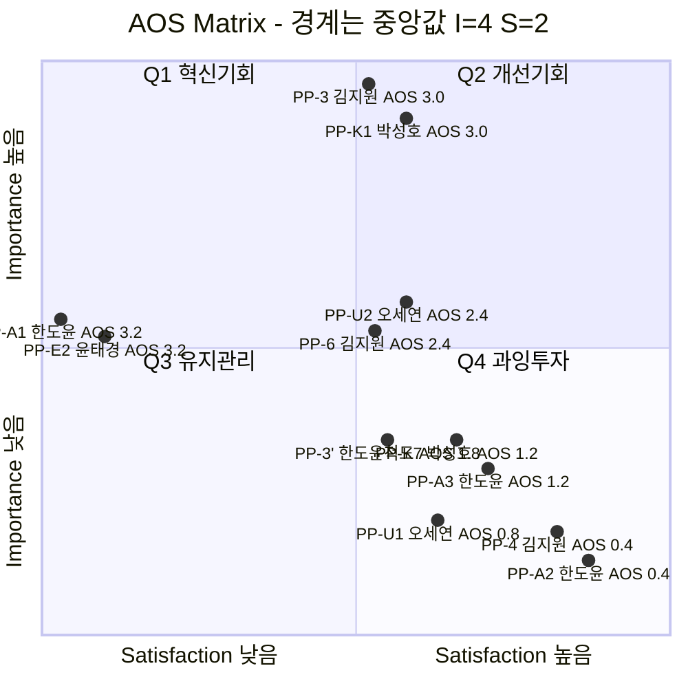

# 사례 01-②③④⑤ — 「콕집」 AOS 산출과 Opportunity Score Matrix

> **콕집** — 국비 교육·대학 강의를 녹음·태깅해, **현직자 관점의 우선순위로 복습할 것만 골라주는** 학습 앱

작성 시점: 2026년 8월

근거 문서
- [Ch06 방법론](./methodology.md) — AOS 수식 · 사분면 정의 · 검증 질문
- [사례 01-① 대표 Pain List](./case-01-kokjip-lecture-review-prioritizer-pain-list.md) — **채점 대상과 Goal의 출처. 이하 [①]**
- [Ch05 사례 01-C 여정지도](../05-persona-spectrum-journey-map/case-01-kokjip-lecture-review-prioritizer-journey-map.md) — **[CJM]**
- [Ch04 세그먼트·SOM](../04-tam-sam-som-market-segment-map/case-01-kokjip-lecture-review-prioritizer.md) — **[4]**

---

## 0. 이 문서의 위치와 채점 규칙

[Ch06 방법론 §6](./methodology.md#6-aos-산출-5단계-워크플로우-step-by-step)의 **②~⑤단계**를 한 번에 수행합니다.

| 단계 | 상태 | 위치 |
|---|---|---|
| ① Pain 리스트 정리 | 완료 | [사례 01-①](./case-01-kokjip-lecture-review-prioritizer-pain-list.md) |
| **② Importance 평가** | **본 문서 §1** | Importance Table |
| **③ Satisfaction 평가** | **본 문서 §2** | Satisfaction Table |
| **④ AOS 계산** | **본 문서 §3** | AOS Table |
| **⑤ Matrix 시각화** | **본 문서 §4** | Opportunity Score Matrix |

**채점 대상은 [①]의 순위 트랙 11건**입니다. 게이트 6건은 점수를 매기지 않고 §6에서 통과 요건으로 관리합니다.

> **PP-U1·PP-U2는 후속 추가분입니다.** [CJM]이 「주인공 1명 고정」 원칙에 따라 대학 페르소나(오세연)에 PP ID를 부여하지 않아 최초 채점에서 빠졌고, 대학이 SAM 모집단의 **62~77%** 라는 것이 확인돼 [① §4-6]에서 승격했습니다. **중앙값(§4-1)은 두 건을 넣어도 바뀌지 않아 기존 9건의 사분면 배치는 그대로입니다.**

### 채점 규칙 세 가지

| # | 규칙 | 근거 |
|---|---|---|
| **1** | **Importance는 「고객이 인식하는」 중요도로 매긴다** | Satisfaction이 정의상 **고객의 인식**이므로, Importance만 객관적 기여도로 매기면 AOS가 두 척도의 혼합이 된다. 우리 관점의 **실제 기여도는 별도 참고 열**로 분리하고 그 **격차**를 §1-5에서 따로 읽는다 |
| **2** | **②와 ③을 다른 패스에서 매긴다** | [방법론 §6] — 한 자리에서 함께 매기면 "중요하니까 만족도도 낮겠지" 편향이 들어가 AOS가 다시 Importance의 함수가 된다 |
| **3** | **페르소나별로 표를 나눈다** | [방법론 §「경고」] — 채점자가 다르면 척도가 다르다. 통합 정렬(§3)은 **비교가 아니라 관측**으로만 읽는다 |

**Importance의 기준선은 [① §2-1]의 페르소나 Goal 5문장**입니다. 각 점수는 *"이 Pain이 그 Goal 달성에 얼마나 중요하다고 **고객이 느끼는가**"* 에 답한 값입니다.

---

## 1. ② Importance Table (1~5)

### 1-1. 김지원 · Core — Goal: **"6개월 안에 채용될 수준에 도달하고 싶다"**

| ID | Pain | **Importance (인식)** | 그렇게 매긴 근거 | 참고: 실제 기여도 | 격차 |
|---|---|:---:|---|:---:|:---:|
| **PP-3** | 무엇이 중요한지 판단할 기준이 없다 | **5** | **고객이 직접 자문한다** — *"이걸 다 볼 수는 없는데. 뭐가 중요한 거지"*. 6개월은 고정이고 강의량도 고정이므로 **버릴 것을 못 정하면 시간 배분 자체가 성립하지 않는다.** 감정 2점 | 5 | 0 |
| **PP-6** | 필요한 순간에 과거 학습을 못 찾는다 | **4** | 절박도는 최고(**감정 최저점 1점**, 마감 압박)이나 **프로젝트 구간에서만 발생**한다. 6개월 전 구간의 배분을 결정하는 PP-3보다 Goal 기여 폭이 좁다 | 4 | 0 |
| **PP-4** | 무료 조합으로 "해결된 것 같은 느낌"이 든다 | **2** | **고객은 이것을 문제로 인식하지 않는다.** 감정 곡선이 ③ 2점 → ④ **3점으로 올라간다**(안도). Goal을 "돈 안 쓰고 효율 확보"로 좁혀 잡으면 오히려 달성에 가깝다 | **5** | **+3** |

### 1-2. 박성호 · 지불자 — Goal: **"다음 차수 취업률을 올려 기관 지정을 유지하고 싶다"**

| ID | Pain | **Importance (인식)** | 그렇게 매긴 근거 | 참고: 실제 기여도 | 격차 |
|---|---|:---:|---|:---:|:---:|
| **PP-K1** | 취업률이 떨어졌는데 원인을 모른다 | **5** | 62.6% → **54.2%** 🟢 실측이고 **지정 평가는 기관 존립 문제**다. 원인을 모르면 개입 자체가 불가능하므로 Goal의 **선행 조건** | 5 | 0 |
| **PP-K7** | 도구 기여분을 분리 증빙할 수 없다 | **3** | 박성호의 Goal은 **취업률 그 자체**이지 증빙이 아니다. 증빙은 재계약 판단용이라 **우리 쪽 관심에 더 가깝다.** 다만 지정 평가 서류에도 쓰이므로 무의미하지는 않다 | 3 | 0 |

### 1-3. 한도윤 · Adjacent — Goal: **"낸 돈이 아깝지 않았다고 스스로 증명하고 싶다"**

| ID | Pain | **Importance (인식)** | 그렇게 매긴 근거 | 참고: 실제 기여도 | 격차 |
|---|---|:---:|---|:---:|:---:|
| **PP-A1** | 결제 직후 불안이 최고조인데 해소할 수단이 없다 | **4** | 수백만 원 자비 결제 직후의 **감정 강도가 가장 높다** 🔴. 고객은 이 시점의 불안 해소를 매우 중요하게 느낀다 | **2** | **−2** |
| **PP-A3** | 투자 회수를 계산할 근거가 없다 | **3** | 여정의 종점이고 *"결국 얼마 쓴 셈인가"* 를 실제로 계산한다. 다만 **사후 계산이라 결과를 바꾸지 못한다** | 2 | −1 |
| **PP-A2** | 전부 하려다 우선순위를 못 세운다 | **2** | **고객은 「빠짐없이 듣기」를 손해 방지 행위로 여긴다.** Pain이 아니라 성실함으로 인식한다 | **4** | **+2** |

### 1-4. 윤태경 · Extreme — Goal: **"규정을 어기지 않으면서 남들만큼의 학습 효율을 얻고 싶다"**

| ID | Pain | **Importance (인식)** | 그렇게 매긴 근거 | 참고: 실제 기여도 | 격차 |
|---|---|:---:|---|:---:|:---:|
| **PP-E2** | 필기와 청취가 경합한다 | **4** | *"적다 보면 못 듣고, 들으면 못 적는다"* — **매 강의 발생하고 즉시 체감**된다. 다만 상위 제약(녹음 금지)이 이미 Goal의 절반을 막고 있어 이 Pain 하나로 Goal이 결정되지는 않는다 | 4 | 0 |

### 1-5. 오세연 · Adjacent(대학) — Goal: **"학점을 지키면서 취업에 쓰일 것만 골라 익히고 싶다"**

| ID | Pain | **Importance (인식)** | 그렇게 매긴 근거 | 참고: 실제 기여도 | 격차 |
|---|---|:---:|---|:---:|:---:|
| **PP-U2** | 학점과 취업 준비가 같은 시간을 두고 경합한다 | **4** | **페르소나 Goal의 정면이다.** 오세연만 목표가 둘이고, 시험 기간마다 **실제로 충돌해 선택을 강요당한다.** 카드에도 문제로 명시돼 있다 | 4 | 0 |
| **PP-U1** | 강의가 학기·과목 단위로 분산돼 총량이 파악되지 않는다 | **2** | 카드의 감정이 ***"막연한 불안 — 절박하지 않으나 늘 뒤처지는 느낌"*** 이다. **문제로 명명조차 하지 못한다.** [스펙트럼]도 *"복습 부채가 중간이라 절박함이 약하다"* 고 적었다 | **4** | **+2** |

> **오세연의 Goal이 둘이라 채점 기준선도 둘입니다.** PP-U2는 **두 목표의 경합 그 자체**라 Importance가 높고, PP-U1은 **어느 쪽 목표에도 직접 닿지 않아** 인식이 낮습니다 — 분산은 취업에도 학점에도 즉각적인 손해를 만들지 않고 **누적으로만 나타납니다.**

### 1-6. 인식 격차 — 이 표에서 먼저 읽어야 할 것

**열한 건 중 다섯에서 고객의 인식과 실제 기여도가 갈립니다.** 격차의 **부호**가 처방을 바꿉니다.

| 방향 | 항목 | 의미 | 처방 |
|---|---|---|---|
| **+3** | **PP-4** | **과소 인식이 가장 크다.** 무료 조합이 못 주는 것(현직자 기준)을 고객이 모른다 | **기능이 아니라 프레이밍.** ④ 도구 탐색 단계에서 차이를 보여주는 설계 |
| **+2** | **PP-A2** | Goal("빠짐없이 뽑아내기")이 **Pain의 원인**이라 Pain으로 인식되지 않는다 | **프레임 전환** — "덜 하는 것이 이득" |
| **+2** | **PP-U1** | 손해가 **누적으로만 나타나** 그 순간에는 문제로 보이지 않는다 | **누적된 총량을 보여주는 것** 자체가 개입. 기능보다 **가시화** |
| **−2** | **PP-A1** | **과대 인식.** 불안 해소가 실제 투자 회수를 만들지는 않는다 | **기능이 아니라 온보딩 메시지.** 여기에 개발 자원을 태우면 안 된다 |
| **−1** | PP-A3 | 사후 계산이라 결과를 못 바꾼다 | 리텐션·추천 소재로만 |

**격차가 0인 여섯 건(PP-3 · PP-6 · PP-K1 · PP-K7 · PP-E2 · PP-U2)이 「기능으로 푸는」 항목입니다.** 나머지 다섯은 점수가 어떻게 나오든 **제품 기능의 문제가 아닙니다.**

---

## 2. ③ Satisfaction Table (1~5)

**Importance를 매긴 표를 덮고 다시 시작합니다**(채점 규칙 2). 각 점수는 *"[①]의 「현재 대체 수단」이 이 Pain을 얼마나 잘 해결해 주고 있다고 **고객이 느끼는가**"* 입니다.

| ID | 페르소나 | 현재 대체 수단 | **Satisfaction** | 그렇게 매긴 근거 |
|---|---|---|:---:|---|
| **PP-3** | 김지원 | 동기 단톡 질문 · 상위권 동기(정다은) · 검색 | **2** | 정다은이 실제로 답해 주므로 **작동은 한다**([CJM §3-3]). 그러나 **정다은도 실무 경험이 없어 현직자 기준이 아니고**, 매번 물을 수도 없다. 감정 2점 |
| **PP-6** | 김지원 | 자기 복습 기록 뒤지기 · 팀원·강사에게 물어보기 | **2** | 감정 **최저점 1점**이지만 팀원·강사 피드백이 접점에 있고 **일부는 실제로 해결된다.** 1점과 2점 사이의 경계 판단 |
| **PP-4** | 김지원 | **클로바노트 무료 + 노션 학생 무료 + 다글로 무료 티어 + ChatGPT** 🟢 | **4** | **무료이고 실재하며 고객이 안도한다**(감정 3점). Goal을 "돈 안 쓰고 효율 확보"로 보면 **잘 충족된다.** 요약·AI 퀴즈까지 무료 티어에 있다 🟢 |
| **PP-K1** | 박성호 | 차수 종료 후 취업률 집계 · 강사 면담 | **2** | 집계 자체는 정확하지만 **둘 다 사후**다. Goal이 *"차수가 끝나기 전에 되돌리는 것"* 이므로 그 기준으로는 거의 충족되지 않는다 |
| **PP-K7** | 박성호 | 정성 보고 · 담당자 소견 | **3** | 기여분 분리는 전혀 안 되지만 **관행상 정성 보고로 통과된다.** 그래서 불만의 절박도가 낮다 |
| **PP-A1** | 한도윤 | 없음 (커리큘럼 재확인 정도) | **1** | **대체 수단이 사실상 존재하지 않는다.** 결제 직후의 불안을 해소해 주는 것이 아무것도 없다 🔴 |
| **PP-A2** | 한도윤 | 무차별 전량 수강 = "빠짐없이 듣기" | **4** | **Goal 기준으로는 전량 수강이 달성 행위 그 자체**다([① §2-4] 셋째). 고객은 만족한다 |
| **PP-A3** | 한도윤 | 환급 조건 확인 · 수기 계산 | **3** | 환급 조건이 명문화돼 있어 **금액 정산은 실제로 된다.** 다만 "복습 시간을 얼마나 줄였는가"는 나오지 않는다 |
| **PP-E2** | 윤태경 | 손 필기 | **1** | *"적다 보면 못 듣고, 들으면 못 적는다"* — **대체 수단이 정의상 실패한다.** 감정 좌절 |
| **PP-U1** | 오세연 | 과목별 자료 개별 보관 · **노션 학생 무료** 🟢 수기 정리 · 무료 녹음 앱 | **3** | **강의 밀도가 낮아 수기 정리로 감당된다.** 부트캠프의 하루 8시간과 다르다. 노션 학생 플러스가 **무료** 🟢라 비용 장벽도 없다. 카드의 *"절박하지 않다"* 가 이 점수의 근거 |
| **PP-U2** | 오세연 | **한쪽을 포기하기** — 스펙 위주 준비(학점 포기) 또는 학점 우선(취업 미루기) | **2** | **해결이 아니라 회피다.** 포기한 쪽의 손실이 그대로 남는다. 다만 실제로 많은 학생이 이렇게 넘어가 졸업하므로 1점은 아니다 |

**대체 수단이 「없음」인 두 건(PP-A1 · PP-E2)이 1점을 받았고, 이것이 AOS 상위를 만듭니다.** 대체재 부재는 기회이지만, [방법론 §「경고」]대로 **그 시장이 크다는 뜻은 아닙니다.**

---

## 3. ④ AOS Table

### 3-1. 계산

`AOS = Importance × (1 − Satisfaction / 5)` — [방법론 §1-2](./methodology.md#1-2-aos--불만족을-중요도와-분리해서-계산한다)

**AOS 내림차순 정렬.**

| 순위 | ID | 페르소나 | I | S | **1 − S/5** | **AOS** | 계산 |
|:---:|---|---|:---:|:---:|:---:|:---:|---|
| **1** | **PP-A1** | 한도윤 | 4 | 1 | 0.8 | **3.20** | 4 × (1 − 0.2) |
| **1** | **PP-E2** | 윤태경 | 4 | 1 | 0.8 | **3.20** | 4 × (1 − 0.2) |
| **3** | **PP-3** | 김지원 | 5 | 2 | 0.6 | **3.00** | 5 × (1 − 0.4) |
| **3** | **PP-K1** | 박성호 | 5 | 2 | 0.6 | **3.00** | 5 × (1 − 0.4) |
| **5** | **PP-6** | 김지원 | 4 | 2 | 0.6 | **2.40** | 4 × (1 − 0.4) |
| **5** | **PP-U2** | 오세연 | 4 | 2 | 0.6 | **2.40** | 4 × (1 − 0.4) |
| **7** | PP-K7 | 박성호 | 3 | 3 | 0.4 | **1.20** | 3 × (1 − 0.6) |
| **7** | PP-A3 | 한도윤 | 3 | 3 | 0.4 | **1.20** | 3 × (1 − 0.6) |
| **9** | PP-U1 | 오세연 | 2 | 3 | 0.4 | **0.80** | 2 × (1 − 0.6) |
| **10** | PP-4 | 김지원 | 2 | 4 | 0.2 | **0.40** | 2 × (1 − 0.8) |
| **10** | PP-A2 | 한도윤 | 2 | 4 | 0.2 | **0.40** | 2 × (1 − 0.8) |

> **AOS의 실질 범위는 0 ~ 4.0**입니다([방법론 §2](./methodology.md#2-aosadjusted-opportunity-score의-정의)). 최고값 3.20은 이론 최대의 80% 수준입니다.

### 3-2. 군집 — 점수 차이가 큰 곳에서만 선을 긋는다

**1~5 정수 척도에서 동점은 필연입니다.** 열한 건 중 네 쌍이 동점이므로 **순위 숫자가 아니라 군집 사이의 간격**을 읽습니다.

| 군집 | AOS | 항목 | 간격 |
|---|---|---|---|
| **상위 6건** | 3.20 ~ 2.40 | PP-A1 · PP-E2 · PP-3 · PP-K1 · PP-6 · **PP-U2** | ↓ **1.20** ← 최대 간격 |
| **중위 3건** | 1.20 ~ 0.80 | PP-K7 · PP-A3 · **PP-U1** | ↓ 0.40 |
| **하위 2건** | 0.40 | PP-4 · PP-A2 | — |

**상위 6건과 중위 3건 사이의 1.20이 이 목록에서 유일하게 신뢰할 만한 경계입니다.** 상위 5건 안의 3.20 대 3.00(0.20 차이)은 [방법론 §「경고」]대로 **채점자의 기분 차이와 구분되지 않으므로 순위로 읽지 않습니다.**

### 3-3. 참고 — PP-3의 척도 간 재채점

[① §4-3]에서 예고한 대로 **같은 Pain을 두 척도로 채점**했습니다.

| 척도 | Goal | I | S | AOS | 차이 |
|---|---|:---:|:---:|:---:|---|
| **김지원** (Core) | 6개월 안에 채용될 수준 도달 | 5 | 2 | **3.00** | 기준 |
| **한도윤** (Adjacent) | 낸 돈이 아깝지 않았다고 증명 | **3** | 2 | **1.80** | **−1.20** |

**한도윤에게는 「우선순위 판단」 자체가 김지원만큼 절박하지 않습니다.** PP-A2가 보여주듯 그는 **버리는 것에 저항**하기 때문입니다. 한도윤 척도에서 상위는 PP-A1(3.20)이고 PP-3′는 그 절반입니다.

> **확장 순서에 대한 함의** — 같은 제품을 팔아도 **소구점을 바꿔야 합니다.** 김지원에게는 "무엇을 버릴지 정해준다", 한도윤에게는 "낸 돈이 헛되지 않다는 확신"입니다. [CJM §5]의 결론(*"Core에는 합격을, 자비 수강생에게는 낭비 없음을"*)이 숫자로 재현됐습니다.

---

## 4. ⑤ Opportunity Score Matrix — 중앙값 기준

### 4-1. 사분면 경계값 산출

**경계는 각 지표의 중앙값**을 씁니다. 채점 대상 **11건**으로 계산하며, 재채점 항목 PP-3′는 같은 Pain의 중복이므로 **중앙값 계산에서 제외**하고 참고 점으로만 표시합니다.

| 지표 | 정렬된 값 (n=11) | **중앙값 (6번째)** |
|---|---|:---:|
| **Importance** | 2, 2, 2, 3, 3, **4**, 4, 4, 4, 5, 5 | **4** |
| **Satisfaction** | 1, 1, 2, 2, 2, **2**, 3, 3, 3, 4, 4 | **2** |

> **PP-U1·PP-U2를 추가해도 중앙값은 I=4 · S=2 그대로입니다.** PP-U2(4, 2)가 두 중앙값 위에 정확히 얹히고 PP-U1(2, 3)이 양쪽 꼬리를 균형 있게 늘렸기 때문입니다. **기존 9건의 사분면 배치는 하나도 바뀌지 않았습니다.**

**High/Low 판정 규칙: 중앙값 이상(≥) = High, 미만(<) = Low.** 중앙값에 정확히 걸린 항목은 §4-4에 따로 표시합니다.

### 4-2. Matrix

> **좌표는 중앙값이 정확히 0.5에 오도록 구간별로 정규화했습니다.** mermaid의 사분면 분할선이 0.5에 고정돼 있기 때문이며, **원본 점수는 아래 표가 기준**입니다. 겹치는 점은 식별을 위해 미세하게 어긋나 있습니다.

### 4-3. 사분면 배치

| 사분면 | 조건 (중앙값 기준) | 항목 | AOS | 전략 행동 |
|---|---|---|---|---|
| 🔥 **Q1 혁신기회** | I ≥ 4 **&** S < 2 | **PP-A1** · **PP-E2** | 3.20 · 3.20 | **JTBD 인터뷰 대상, MVP 실험 우선** |
| 💎 **Q2 개선기회** | I ≥ 4 **&** S ≥ 2 | **PP-3** · **PP-K1** · **PP-6** · **PP-U2** | 3.00 · 3.00 · 2.40 · 2.40 | 지속적 개선 필요 |
| ⚫ **Q3 유지관리** | I < 4 **&** S < 2 | **없음** | — | — |
| ⚠️ **Q4 과잉투자** | I < 4 **&** S ≥ 2 | PP-K7 · PP-A3 · **PP-U1** · **PP-4** · **PP-A2** | 1.20 · 1.20 · 0.80 · 0.40 · 0.40 | 자원 분배 재검토 |

**Q3가 비어 있는 것은 데이터의 성질입니다.** "덜 중요한데 대체 수단도 없는" 문제가 없다는 뜻이고, [①]에서 **Goal에 닿지 않는 Pain을 선별 단계에서 이미 걸러냈기** 때문입니다.

### 4-4. 경계 항목 — 중앙값 위에 정확히 놓인 것들

**1~5 정수 척도에서 중앙값은 반드시 실제 데이터 값과 겹칩니다.** 열한 건 중 **일곱 건이 어느 한 축의 경계선 위에** 있습니다.

| 항목 | I=4 경계 | S=2 경계 | 비고 |
|---|:---:|:---:|---|
| **PP-6** | ● | ● | **두 중앙값의 교차점에 정확히 놓인다.** 사분면 배치가 판정 규칙(≥/<)에 전적으로 의존한다 |
| **PP-U2** | ● | ● | **PP-6과 좌표가 완전히 같다**(4, 2). 두 Pain은 페르소나도 내용도 다른데 **채점 결과가 구분되지 않는다** |
| PP-A1 | ● | | I가 경계 |
| PP-E2 | ● | | I가 경계 |
| PP-3 | | ● | S가 경계 |
| PP-K1 | | ● | S가 경계 |

**PP-3과 PP-K1이 Q2(개선기회)에 배치된 것은 판정 규칙의 산물입니다.** 두 항목의 Satisfaction 2점은 **절대 기준으로는 명백히 낮은데**, 이 데이터셋의 중앙값이 2이기 때문에 "High Satisfaction" 쪽으로 넘어갔습니다.

> [방법론 §4-3](./methodology.md#4-3-주의--사분면-위치와-aos-등급은-항상-일치하지-않는다)이 경고한 상황이 그대로 발생했습니다 — **AOS 3.00인 PP-3이 AOS 2.40인 PP-6과 같은 사분면에 있고, AOS 3.20인 PP-A1과는 다른 사분면에 있습니다.** 위치는 *왜* 그 점수가 나왔는지를 설명할 뿐이고, **실행 순서는 §3-1의 AOS 내림차순이 정합니다.**

### 4-5. 민감도 — 중앙값 대신 절대 중점(3, 3)을 쓰면

경계 선택이 결과를 얼마나 바꾸는지 확인합니다.

| 항목 | **중앙값 기준** (I=4, S=2) | **절대 중점 기준** (I=3, S=3) | 이동 |
|---|---|---|:---:|
| PP-3 (5, 2) | Q2 개선기회 | **Q1 혁신기회** | **이동** |
| PP-K1 (5, 2) | Q2 개선기회 | **Q1 혁신기회** | **이동** |
| PP-6 (4, 2) | Q2 개선기회 | **Q1 혁신기회** | **이동** |
| PP-U2 (4, 2) | Q2 개선기회 | **Q1 혁신기회** | **이동** |
| PP-U1 (2, 3) | Q4 과잉투자 | Q4 과잉투자 | — |
| PP-K7 (3, 3) | Q4 과잉투자 | **Q2 개선기회** | **이동** |
| PP-A3 (3, 3) | Q4 과잉투자 | **Q2 개선기회** | **이동** |
| PP-A1 (4, 1) | Q1 혁신기회 | Q1 혁신기회 | — |
| PP-E2 (4, 1) | Q1 혁신기회 | Q1 혁신기회 | — |
| PP-4 (2, 4) | Q4 과잉투자 | Q4 과잉투자 | — |
| PP-A2 (2, 4) | Q4 과잉투자 | Q4 과잉투자 | — |

**열한 건 중 여섯 건이 사분면을 갈아탑니다.** 그런데 **AOS 값과 순위는 하나도 바뀌지 않습니다** — 경계는 AOS 계산에 들어가지 않기 때문입니다.

> **이것이 사분면을 우선순위 결정에 쓰면 안 되는 이유입니다.** 같은 데이터가 경계 선택만으로 "혁신기회 5건"이 되기도 하고 "혁신기회 2건"이 되기도 합니다. **중앙값 기준을 채택한 이유는 이 데이터셋 안에서의 상대 위치를 보기 위해서이고, 절대적 판정이 아닙니다.**

---

## 5. 해석 — 이 표에서 실제로 읽어야 할 다섯 가지

**① 상위 6건과 나머지 5건 사이가 유일하게 신뢰할 만한 경계입니다.** AOS 2.40과 1.20 사이의 1.20이 최대 간격이고, 그 위의 여섯 건이 실행 후보입니다. 상위 6건 안의 0.20 차이는 순위로 읽지 않습니다.

**② AOS 공동 1위 PP-E2가 게이트 하나를 엽니다.** PP-E2(필기와 청취 경합)의 해법은 [CJM §6]이 말한 *"강의 자료·판서 업로드만으로 우선순위를 만드는 축소판"* — **녹음 없이 동작하는 최소 형태**입니다. 그런데 이것이 그대로 **게이트 PP-E1(녹음 금지)의 통과 수단**이 됩니다. 순위 트랙 1위가 게이트를 여는 구조이며, 두 트랙이 만나는 유일한 지점입니다.

**③ 다만 PP-E2의 시장 크기는 미확정입니다.** [방법론 §「경고」]대로 AOS에는 규모도 지불 의사도 들어 있지 않습니다. **녹음 금지 과정의 비율이 🔴 미확정**([CJM §9] 1순위 검증 항목)이므로, PP-E2가 1위라는 사실만으로 개발 순서를 확정하면 안 됩니다. **[CJM §9]의 「기관 강의 녹화 비율」 확인이 이 항목의 전제입니다.**

**④ AOS 1위 PP-A1은 기능으로 풀 항목이 아닙니다.** §1-5에서 **격차 −2(과대 인식)** 로 표시된 항목입니다. 고객은 결제 직후 불안을 크게 느끼지만 **불안 해소가 실제 투자 회수를 만들지는 않습니다.** 처방은 개발이 아니라 **온보딩 메시지**이고, 근거 등급도 🔴 가설입니다. **AOS 1위에 개발 자원을 태우면 안 되는 사례**이며, 인식 격차 열이 없었다면 그대로 최우선 개발 항목이 됐을 것입니다.

**⑤ Q4(과잉투자)의 네 건 중 둘은 「기회 없음」이 아닙니다.** PP-4(AOS 0.40)와 PP-A2(AOS 0.40)는 [① §6]에서 **해석 유보 항목**으로 미리 지정해 둔 것입니다. 점수가 낮은 이유는 대체 수단이 충분해서가 아니라 **고객이 Pain으로 인식하지 않아 Importance가 낮게 나왔기 때문**입니다(격차 +3, +2). 특히 **PP-4는 [4] SOM의 62%가 걸린 항목**입니다.

> **⑤가 이 문서의 가장 중요한 결과입니다.** AOS는 **고객이 인식한 대로** 순위를 매기므로, **인식되지 않은 문제는 구조적으로 하위에 놓입니다.** 그래서 [CJM §8-1]이 개입 1·2순위로 꼽은 것들(강사 동의 · 무료 조합과의 차이)이 여기서는 게이트 트랙과 최하위에 각각 흩어져 있습니다. **AOS 순위표만 보고 로드맵을 짜면 [CJM]이 찾아낸 두 개의 최우선 개입이 통째로 빠집니다.**
>
> **AOS의 용도는 「기능 개발 순서」이고, 「사업 우선순위」가 아닙니다.**

**⑥ 대학(오세연) 2건을 넣어도 상위 군집의 구성이 바뀌지 않습니다.** PP-U2가 2.40으로 PP-6과 동점으로 합류하고 PP-U1은 0.80으로 중위에 붙습니다. **SAM 모집단의 62~77%를 차지하는 집단을 추가했는데 순위표가 거의 그대로인 것**이 AOS의 성질을 보여줍니다 — **AOS에는 집단 크기가 들어가지 않습니다.** 대학이 몇 명이든 오세연 한 사람의 체감만 반영됩니다.

> **PP-U2와 PP-6은 좌표가 (4, 2)로 완전히 같습니다.** 「학점과 취업 준비의 경합」과 「프로젝트 시점에 과거 학습을 못 찾음」은 페르소나도 내용도 처방도 다른데 **AOS가 구분하지 못합니다.** 1~5 정수 척도 두 개로는 열한 건을 변별하기에 해상도가 부족하다는 뜻이고, **이 차이는 DOS의 Market Relevance에서만 드러납니다**(PP-U2 0.70 vs PP-6 0.54 → [DOS 사례](./case-01-kokjip-lecture-review-prioritizer-dos.md)).

### 종합 처분

| 처분 | 항목 | 근거 |
|---|---|---|
| **기능으로 개발** | **PP-3 · PP-6 · PP-K1 · PP-U2** | 상위 군집 · **인식 격차 0** · Q1/Q2 |
| **조건부 개발** | **PP-E2** | AOS 공동 1위 + 게이트 해제 효과. **단 시장 크기 확인이 선행** |
| **메시지·프레이밍으로** | **PP-4 · PP-A2 · PP-A1 · PP-U1** | 인식 격차 ±2 이상. **점수와 무관하게 기능이 답이 아님** |
| **후순위** | PP-K7 · PP-A3 | 중위 군집 · 인식과 실제가 모두 낮음 |

---

## 6. 게이트 트랙 — 점수 없이 관리하는 6건

[방법론 §5-1]대로 **AOS를 매기지 않습니다.** [① §2-4]에서 확인했듯 PP-E3·PP-N3는 **Goal의 주어가 고객이 아니라 우리**여서 채점 자체가 성립하지 않습니다.

| 게이트 | 통과 요건 | 상태 |
|---|---|---|
| **PP-N1** (강사 자산 통제) | 강사 IP·실연권 보유 · 반출 통제 · 과정 종료 시 삭제가 **도입 안내 첫 장**에 있는가 | 미착수 |
| **PP-K5** (강사 거부권) | **기관 표준 동의서** 양식 존재 + 이유 없는 철회 보장([R §5-4] 해외 대학 형식) | 미착수 |
| **PP-N2** (되돌림 비용) | 금지 결정 **이전에** 안내가 도달하는 영업 순서인가 | 미착수 |
| **PP-E1** (녹음 금지) | 규정 준수형이 쓸 수 있는 축소판이 있는가 | **← PP-E2 개발 시 해소** |
| **PP-E3** (확산 사망) | 기관 공식 도입 여부 | PP-K5에 종속 |
| **PP-N3** (조달 차단) | — | PP-N1·N2에 종속 |

**독립 게이트는 셋(PP-N1 · PP-K5 · PP-N2)뿐이고 나머지는 종속입니다.** 셋 모두 **강사 동의 절차 하나**의 다른 얼굴이며([① §5]), [CJM §8-1] 개입 1위가 이 셋을 동시에 엽니다.

---

## 7. 다음으로 넘기는 것

| 대상 | 내용 |
|---|---|
| **Ch07 JTBD 인터뷰** | **Q1 배치 2건(PP-A1 · PP-E2)이 [방법론 §4-2]의 인터뷰 우선 대상.** 둘 다 근거가 🔴/미표기라 **인터뷰로 검증할 가치가 가장 큰 항목**이기도 하다 |
| **인터뷰 후 재채점** | Job Statement 단위로 ②~④를 다시 돈다([방법론 §5]의 2차 통과). **인식 격차가 큰 PP-4·PP-A2가 재채점의 핵심 대상** |
| **선행 검증** | **기관의 강의 녹화 비율** 🔴 — 게이트 3건과 PP-E2의 전제. KDT 훈련기관 5곳 확인 |
| **규모 결합** | 상위 5건에 **[4]의 세그먼트별 크기**를 붙여야 실행 결정이 된다([방법론 §「경고」]) |

---

## 8. 자기점검 ([방법론 §8](./methodology.md#8-검증-질문-작성-후-자기점검))

| 검증 질문 | 결과 |
|---|---|
| AOS 수식에 **Importance가 한 번만** 들어갔는가 | ○ `I × (1 − S/5)` 만 사용. `I + (I − S)` 형태 없음 |
| Satisfaction이 **대체 솔루션의 만족도**인가 | ○ §2에 11건 전부 비교 대상 명시. 「없음」 2건도 명시 |
| Importance와 Satisfaction을 **분리해서** 매겼는가 | ○ §1과 §2를 다른 패스로 수행(채점 규칙 2) |
| 각 Pain이 **특정 페르소나에 귀속**됐는가 | ○ §1을 페르소나별 표 5개로 분리 |
| 소망이 Pain으로 섞이지 않았는가 | ○ [① §1] 선별 기준 1에서 제거 완료 |
| **제약 조건이 순위표에 섞이지 않았는가** | ○ 게이트 6건은 §6에서 점수 없이 관리 |
| **AOS 내림차순으로 정렬**됐는가 | ○ §3-1. **사분면 라벨로 순서를 정하지 않음**(§4-3 명시) |
| 점수 차이가 **판단을 바꿀 만큼 큰가** | ○ §3-2에서 군집으로 처리. **0.20 차이는 순위로 읽지 않음을 명시** |
| **추정과 확인된 사실이 구분**되는가 | ○ 근거 열 + 🔴 표기 + §7의 선행 검증 항목 |
| **사분면 경계 규칙이 명시**됐는가 | ○ §4-1 중앙값 산출 + ≥/< 판정 규칙 + §4-4 경계 항목 + §4-5 민감도 |
| (추가) **채점 관점이 일관**되는가 | ○ Importance·Satisfaction 모두 **고객 인식 기준**. 우리 관점은 §1의 참고 열로 분리 |
