# 사례 01-① — 「콕집」 대표 Pain List

> **콕집** — 국비 교육·대학 강의를 녹음·태깅해, **현직자 관점의 우선순위로 복습할 것만 골라주는** 학습 앱

작성 시점: 2026년 8월

근거 문서
- [Ch06 방법론](./methodology.md) — AOS 산출 5단계 워크플로우
- [Ch05 사례 01-C 여정지도](../05-persona-spectrum-journey-map/case-01-kokjip-lecture-review-prioritizer-journey-map.md) — **채점 원재료의 출처. 이하 [CJM]**
- [Ch05 사례 01-B 페르소나 스펙트럼](../05-persona-spectrum-journey-map/case-01-kokjip-lecture-review-prioritizer-persona-spectrum.md) — 4유형 분류
- [Ch04 세그먼트·SOM](../04-tam-sam-som-market-segment-map/case-01-kokjip-lecture-review-prioritizer.md) — **[4]**

---

## 0. 이 문서의 위치

[Ch06 방법론 §6](./methodology.md#6-aos-산출-5단계-워크플로우-step-by-step)의 **① Pain 리스트 정리** 단계 산출물입니다.

| 단계 | 상태 | 산출물 |
|---|---|---|
| **① Pain 리스트 정리** | **본 문서** | **대표 Pain 15건 + Goal + 트랙 분리** |
| ②~⑤ Importance · Satisfaction · AOS · Matrix | 완료 | [사례 01-②③④⑤ AOS Matrix](./case-01-kokjip-lecture-review-prioritizer-aos-matrix.md) |

[CJM]의 Pain Point **22건**에서 **페르소나 5명 × 3건 = 15건**을 대표로 추립니다.

---

## 1. 선별 기준 — 22건을 15건으로 줄인 방법

Adjacent·Extreme·Non-user는 [CJM]에 이미 정확히 3건씩 있어 선별이 필요 없었습니다. **실제 선별 작업은 Core(8건 → 3건)와 지불자(8건 → 3건)에서 일어났고**, 네 가지 기준을 순서대로 적용했습니다.

| # | 기준 | 질문 | 근거 |
|---|---|---|---|
| **1** | **기존 생태계의 Pain인가** | 우리 제품 **없이도** 지금 겪고 있는 문제인가 | [방법론 §5](./methodology.md#5-평가-대상-정의--무엇을-재료로-점수화하는가) — "기존 솔루션 생태계 하에서 겪고 있는 Pain" |
| **2** | **여정의 방향이 갈리는가** | 여기서 진입·이탈·전환이 결정되는가 | [CJM §8-1] 개입 우선순위 |
| **3** | **감정 곡선의 극점인가** | 최저점 또는 위험한 고점과 일치하는가 | [CJM §3-2] |
| **4** | **판정 가능한가** | 해결됐는지 아닌지 판정할 수 있는 형태인가 | [방법론 §5-1] 유효성 3조건 |

**기준 1이 가장 많이 걸러냈습니다.** "우선순위를 신뢰할 근거가 필요하다"(PP-5)처럼 **제품을 이미 쓰는 상황에서만 생기는 Pain**은 Satisfaction을 매길 대체 솔루션이 존재하지 않아 채점 자체가 불가능합니다.

---

## 2. 마스터 차트 — 대표 Pain 15건과 Goal

### 2-1. 페르소나별 Goal — Importance를 매길 기준선

[방법론 §6](./methodology.md#6-aos-산출-5단계-워크플로우-step-by-step)의 ②단계 프롬프트는 *"각 Pain이 **고객의 목표 달성에** 얼마나 중요한지"* 를 묻습니다. **목표가 적혀 있지 않으면 Importance는 매길 수 없습니다** — 무엇에 비추어 중요한지가 없기 때문입니다. 그래서 채점 전에 각 페르소나가 이루려는 진보를 한 문장으로 고정합니다.

Goal은 [CJM]에 명시돼 있지 않아 **여정의 종점과 감정 곡선에서 역산했습니다.** 각 여정이 어디서 끝나는가 — 그것이 그 사람이 이루려던 것입니다.

| 페르소나 | **Goal (여정 전체에서 이루려는 것)** | 역산 근거 | 제품과의 관계 |
|---|---|---|---|
| **김지원** · Core | **"6개월 안에 채용될 수준에 도달하고 싶다"** | 여정이 ⑧ 면접·취업에서 끝난다 | 돕는다 |
| **박성호** · 지불자 | **"다음 차수의 취업률을 올려 기관 지정을 유지하고 싶다"** | ①이 취업률 하락 인지, ⑧이 재계약 판단 | 돕는다 |
| **한도윤** · Adjacent | **"낸 돈이 아깝지 않았다고 스스로 증명하고 싶다"** | 여정이 ⑦ 환급 조건 **정산**에서 끝난다 | 돕는다 |
| **윤태경** · Extreme | **"규정을 어기는 사람이 되지 않으면서 남들만큼의 학습 효율을 얻고 싶다"** | ②의 감정이 **박탈감과 찜찜함** — 효율과 준법을 동시에 원한다 | 돕는다 (조건부) |
| **문지훈** · Non-user | **"내 강의 자산이 통제 범위 밖으로 나가지 않게 지키고 싶다"** | ⑤ 재진입 조건이 *"밖으로 안 나간다는 게 보장되면"* | **위협한다** |

**Core와 Adjacent의 Goal이 갈리는 지점이 [CJM §5]의 결론과 정확히 맞습니다** — 김지원은 **합격**을 원하고 한도윤은 **낭비 없음**을 원합니다. 같은 기능을 팔아도 말해야 할 것이 다릅니다.

### 2-2. 마스터 차트

**정렬 순서: 페르소나(Core → 지불자 → Adjacent → Extreme → Non-user) → 여정 단계 순.**

Goal 열은 **그 Pain이 좌절시키고 있는 구체적 목표**입니다. 페르소나 Goal(§2-1)을 그 단계의 상황으로 좁힌 것이며, **Pain의 부정문이 아닙니다** — 그 이유는 §2-4에서 다룹니다.

| ID | 페르소나 · 단계 | **Goal (이루려는 진보)** | Pain (막고 있는 것) | 현재 대체 수단 = **Satisfaction 비교 대상** | 근거 | 트랙 |
|---|---|---|---|---|---|---|
| **PP-3** | 김지원 · ③ 복습 부채 자각 | **"남은 시간에 무엇을 버릴지 정하고 싶다"** | 밀린 강의 중 **무엇이 중요한지 판단할 기준이 없다** | 동기 단톡 질문 · 상위권 동기(정다은)에게 물어보기 · 검색 | 🟡 | 순위 |
| **PP-4** | 김지원 · ④ 도구 탐색 | **"돈을 더 쓰지 않고 학습 효율을 확보하고 싶다"** | 무료 조합으로 **"해결된 것 같은 느낌"** 이 들어 유료를 검토하지 않는다 | **클로바노트 무료 + 노션 학생 무료 + 다글로 무료 티어 + ChatGPT** | 🟢 | 순위 |
| **PP-6** | 김지원 · ⑥ 프로젝트 수행 | **"마감 안에 배운 것을 실제로 적용하고 싶다"** | 필요한 순간에 **과거 학습을 찾지 못한다** | 자기 복습 기록 뒤지기 · 팀원·강사에게 물어보기 | — | 순위 |
| **PP-K1** | 박성호 · ① 취업률 하락 인지 | **"차수가 끝나기 전에 하락을 되돌리고 싶다"** | 취업률이 떨어졌는데 **원인을 모른다** (62.6% → **54.2%**) | 차수 종료 후 취업률 집계 · 강사 면담 (**둘 다 사후**) | 🟢 | 순위 |
| **PP-K5** | 박성호 · ⑤ 강사 설득 | **"강사와의 관계를 망가뜨리지 않고 도입하고 싶다"** | **강사 거부권이 도입을 멈춘다** | 개인 간 부탁 (**표준 동의 절차 없음**) | — | **게이트** |
| **PP-K7** | 박성호 · ⑦ 취업률 확인 | **"예산 집행을 정당화할 숫자를 갖고 싶다"** | 도구의 **기여분을 분리 증빙할 수 없다** | 정성 보고 · 담당자 소견 | — | 순위 |
| **PP-A1** | 한도윤 · ① 자비 결제 결정 | **"이 돈이 헛되지 않으리라는 확신을 빨리 얻고 싶다"** | 수백만 원 결제 직후 **불안이 최고조인데 해소할 수단이 없다** | 없음 (커리큘럼 재확인 정도) | 🔴 | 순위 |
| **PP-A2** | 한도윤 · ② 본전 의식 | **"낸 돈만큼 빠짐없이 뽑아내고 싶다"** ⚠️ | **전부 하려다 우선순위를 못 세운다** | 무차별 전량 수강 = "빠짐없이 듣기" | — | 순위 |
| **PP-A3** | 한도윤 · ⑦ 환급 조건 정산 | **"결국 얼마를 벌었는지 금액으로 정산하고 싶다"** | **투자 회수를 계산할 근거가 없다** | 환급 조건 확인 · 수기 계산 | — | 순위 |
| **PP-E1** | 윤태경 · ② 녹음 금지 공지 | **"규정을 어기는 사람이 되고 싶지 않다"** | 금지는 기술적 차단이 아니라 **심리적 부담**이다 — 준수형은 이탈, 위반형은 불안 사용 | 없음 (준수 또는 위반 둘 중 하나) | 🟡 | **게이트** |
| **PP-E2** | 윤태경 · ③-a 규정 준수 | **"강의를 놓치지 않으면서 기록도 남기고 싶다"** | **필기와 청취가 경합한다** — 적으면 못 듣고 들으면 못 적는다 | 손 필기 | — | 순위 |
| **PP-E3** | 윤태경 · ③-b 위반 감수 | **해당 없음** — 이것은 **우리의** Goal이다 ⚠️ | 제품은 작동하지만 **드러내지 못해 확산이 죽는다** | 몰래 사용 (추천·기관 대화에 올리지 않음) | — | **게이트** |
| **PP-N1** | 문지훈 · ② 자료 유출 검토 | **"내 판서와 설명이 어디 남고 누가 보는지 통제하고 싶다"** | **데이터 귀속·보관·삭제가 도입 안내에 없다** | 없음 → **금지가 유일한 방어 수단** | — | **게이트** |
| **PP-N2** | 문지훈 · ③ 녹음 금지 결정 | **"한번 낸 방침을 번복해 권위를 잃고 싶지 않다"** | 한번 금지하면 **되돌리는 비용이 크다** | 해당 없음 (되돌릴 절차 자체가 없음) | 🔴 | **게이트** |
| **PP-N3** | 문지훈 · ④ 기관 도입 차단 | **해당 없음** — 이것은 **우리의** Goal이다 ⚠️ | 막히는 것은 사용이 아니라 **조달**이다 | 해당 없음 | — | **게이트** |

> **근거 열의 「—」는 [CJM]에 등급 표기가 없는 항목입니다.** [CJM §9]의 총평 — *"Adjacent·Extreme·Non-user는 대부분 🔴 구조적 추론"* — 이 적용되므로, **② Importance 평가에서 이 8건은 추정으로 취급하고 점수 옆에 근거 등급을 반드시 병기합니다.**
>
> **Goal 열 전체가 추론입니다.** [CJM]에는 Pain만 있고 Goal은 없습니다. **⚠️ 표시 3건은 그중에서도 특별히 취급이 필요한 항목**이며 §2-4에서 다룹니다.

### 2-3. 트랙 요약

| 트랙 | 건수 | 처리 방식 |
|---|---|---|
| **순위** | **9건** | PP-3 · PP-4 · PP-6 · PP-K1 · PP-K7 · PP-A1 · PP-A2 · PP-A3 · PP-E2 → **AOS 채점 후 내림차순 정렬** |
| **게이트** | **6건** | PP-K5 · PP-E1 · PP-E3 · PP-N1 · PP-N2 · PP-N3 → **점수를 매기지 않고 통과 요건으로 관리** |

**[방법론 §5-1](./methodology.md#5-1-앞선-분석-결과-중-무엇을-사용하는가)의 규칙을 항목 단위로 적용했습니다.** Extreme·Non-user라고 전부 게이트로 보내지 않고, **PP-E2(필기와 청취 경합)는 순위 트랙에 남겼습니다** — 이것은 자격 요건이 아니라 "녹음 없이 동작하는 축소판"이라는 **제품 기회의 크기** 문제이기 때문입니다.

### 2-4. 해설 — Goal 열을 채우자 드러난 것

**Goal 열은 정보를 하나 더 적은 것이 아니라, Pain 목록을 검사하는 도구로 작동했습니다.** 채우는 과정에서 네 가지가 드러났습니다.

**첫째, Goal은 Pain의 부정문이 아닙니다.** PP-3의 Goal을 "판단 기준을 갖고 싶다"로 쓰면 그것은 목표가 아니라 **우리 제품의 기능 설명**입니다. 고객은 판단 기준을 원한 적이 없습니다 — [CJM §3-1]에서 김지원이 실제로 한 말은 *"이걸 다 볼 수는 없는데"* 이고, 원하는 것은 **버릴 것을 정하는 일**입니다. 이 구분이 중요한 이유는 Importance 채점에서 갈리기 때문입니다. Goal을 기능으로 쓰면 "그 기능이 얼마나 중요한가"를 묻게 되고, 그것은 **우리가 만들고 싶은 것의 중요도**이지 고객의 중요도가 아닙니다. 열다섯 건 모두 **제품 이름과 기능 명칭이 들어가지 않는 문장**으로 썼습니다.

**둘째, Goal 칸이 비는 항목은 애초에 고객의 Pain이 아니었습니다.** PP-E3(*"드러내지 못해 확산이 죽는다"*)과 PP-N3(*"막히는 것은 조달이다"*)에 고객 Goal을 붙이려다 실패했습니다. 윤태경은 몰래 쓰는 데 아무 불편이 없고 — 그의 Goal(효율 + 준법)은 위반 분기에서 이미 절반 달성됐습니다 — **확산이 죽어서 손해를 보는 것은 우리**입니다. PP-N3도 같습니다. 이 두 건은 [CJM]이 관찰한 사실이지만 **관찰의 시점이 고객이 아니라 사업자**이며, 그래서 Importance·Satisfaction 어느 쪽도 매길 수 없습니다. §2-3에서 게이트로 분류한 것이 옳았다는 근거가 **Goal 열에서 독립적으로 나왔습니다.** [방법론 §5-1]이 "기회의 크기가 아니라 자격 요건"이라고 말한 것의 정체가 이것입니다 — **Goal의 주어가 고객이 아닌 항목.**

**셋째, Goal이 Pain의 원인인 경우가 있습니다.** PP-A2에서 한도윤의 Goal은 *"낸 돈만큼 빠짐없이 뽑아내고 싶다"* 이고, Pain은 *"전부 하려다 우선순위를 못 세운다"* 입니다. **Goal을 그대로 달성시켜 주면 Pain이 커집니다.** [CJM §5]의 기회 칸이 기능이 아니라 *"「덜 하는 것이 이득」이라는 프레임 전환"* 인 이유가 여기 있습니다. 이런 항목은 Satisfaction 채점에서도 주의가 필요합니다 — 전량 수강은 **Goal 기준으로는 만족스러운 대체 수단**이기 때문에, 고객에게 물으면 만족도가 높게 나오고 AOS는 낮게 나옵니다. **AOS가 낮게 나오는 것이 오답이 아니라, 이 항목은 점수가 아니라 설득의 문제라는 신호입니다.**

**넷째, Goal이 우리 제품과 어긋나는 항목이 둘 있습니다.** PP-4에서 김지원의 Goal은 *"돈을 더 쓰지 않고 학습 효율을 확보하고 싶다"* 입니다. 무료 조합은 **그 Goal을 충실히 달성시켜 줍니다.** [4] SOM의 62%가 걸린 항목의 Satisfaction이 높게 나올 수밖에 없는 구조적 이유이며, 개입이 제품 기능이 아니라 **Goal 자체를 바꾸는 일**("내가 못하는 것"이 아니라 "취업에 필요한 것")이어야 하는 이유입니다. 문지훈은 더 극단적입니다 — §2-1의 다섯 명 중 **혼자만 제품이 Goal을 위협하는 관계**이고, 그래서 그의 Pain은 전부 게이트가 됐습니다. 뒤집으면 **게이트를 여는 방법도 여기서 나옵니다**: 문지훈을 설득하는 것이 아니라, **제품이 그의 Goal(자산 통제)을 침해하지 않음을 증명하는 것** — 봉쇄 설계와 삭제 보장이 기능이 아니라 통과 요건인 이유입니다.

> **요약하면, Goal 열은 세 가지를 걸러냅니다** — ① 기능을 목표로 착각한 항목 ② 주어가 고객이 아닌 항목 ③ Goal 달성이 Pain을 키우는 항목. 열다섯 건 중 **다섯 건(PP-E3 · PP-N3 · PP-A2 · PP-4 · 문지훈 3건 전체)이 여기에 걸렸고**, 걸린 항목은 전부 **점수를 매기기 전에 취급 방식을 먼저 정해야 하는 것들**이었습니다.

---

## 3. 여정 축 위의 배치

**각 여정에서 대표 3건이 어디에 있는지**만 남긴 도면입니다. 회색은 대표에서 탈락한 단계입니다.

```mermaid
graph TB
    subgraph CORE["Core · 김지원 — 8단계 중 ③④⑥"]
        direction LR
        cx1["①②"]:::out --> c3["③ 복습 부채 자각<br/><b>PP-3</b> 판단 기준 없음"]:::pick --> c4["④ 도구 탐색<br/><b>PP-4</b> 무료 조합 착각"]:::pick --> cx2["⑤"]:::out --> c6["⑥ 프로젝트 수행<br/><b>PP-6</b> 과거 학습 못 찾음"]:::pick --> cx3["⑦⑧"]:::out
    end

    subgraph PAY["지불자 · 박성호 — 8단계 중 ①⑤⑦"]
        direction LR
        k1["① 취업률 하락<br/><b>PP-K1</b> 원인 모름"]:::pick --> kx1["②③④"]:::out --> k5["⑤ 강사 설득<br/><b>PP-K5</b> 거부권"]:::gate --> kx2["⑥"]:::out --> k7["⑦ 취업률 확인<br/><b>PP-K7</b> 기여분 증빙 불가"]:::pick --> kx3["⑧"]:::out
    end

    subgraph ADJ["Adjacent · 한도윤 — 7단계 중 ①②⑦"]
        direction LR
        a1["① 자비 결제<br/><b>PP-A1</b> 불안 최고조"]:::pick --> a2["② 본전 의식<br/><b>PP-A2</b> 전부 하려 함"]:::pick --> ax["③④⑤⑥"]:::out --> a3["⑦ 환급 정산<br/><b>PP-A3</b> 회수 근거 없음"]:::pick
    end

    subgraph EXT["Extreme · 윤태경 — 분기 전체가 대표"]
        direction LR
        e1["② 녹음 금지 공지<br/><b>PP-E1</b> 심리적 부담"]:::gate --> e2["③-a 준수<br/><b>PP-E2</b> 필기·청취 경합"]:::pick
        e1 --> e3["③-b 위반<br/><b>PP-E3</b> 확산 사망"]:::gate
    end

    subgraph NON["Non-user · 문지훈 — 5단계 중 ②③④"]
        direction LR
        n1["② 유출 검토<br/><b>PP-N1</b> 귀속·삭제 부재"]:::gate --> n2["③ 금지 결정<br/><b>PP-N2</b> 되돌림 비용"]:::gate --> n3["④ 도입 차단<br/><b>PP-N3</b> 조달이 막힘"]:::gate
    end

    classDef pick fill:#33BBFF,stroke:#333,color:#111;
    classDef gate fill:#FF3322,stroke:#333,color:#fff;
    classDef out fill:#EEEEEE,stroke:#BBB,color:#888;
```

**파랑 = 순위 트랙(AOS 채점) · 빨강 = 게이트 트랙(통과 요건) · 회색 = 탈락 단계**

**게이트가 특정 구간에 몰려 있습니다.** 여섯 건 중 다섯이 **문지훈 여정 전체와 박성호 ⑤** 에 있고, 이 둘은 [CJM §7]이 밝힌 대로 **같은 순간**입니다. 즉 게이트는 여섯 개가 아니라 **하나의 관문이 여섯 얼굴로 나타난 것**입니다.

---

## 4. 페르소나별 — 왜 이 셋인가, 무엇을 뺐는가

### 4-1. 김지원 (Core) — 8건 → 3건

| 채택 | 이유 |
|---|---|
| **PP-3** | **제품의 존재 이유이자 여정의 진입점.** [CJM §3-2] 감정 2점 구간이며, 밀린 양이 아니라 **판단 기준 부재**를 자각하는 순간 |
| **PP-4** | **[CJM §8-1] 개입 우선순위 2위.** [4] SOM의 **62%가 이 전환에 걸려 있다.** 감정이 **올라가는** 구간이라 더 위험 — 경쟁 제품으로 해결됐다는 착각에서 온 안도 |
| **PP-6** | **[CJM §3-2] 감정 최저점(1점)이자 [CJM §8-1] 개입 3위.** 복습이 실제로 필요해지는 유일한 순간 |

| 탈락 | 기준 | 이유 |
|---|---|---|
| PP-1 (아직 필요를 못 느낌) | 4 | Pain이 아니라 **상태**다. 해결 여부를 판정할 수 없다 |
| PP-2 (진도만 따라가는 습관) | 2 | **PP-3의 전조**다. 같은 문제를 두 번 채점하게 된다 |
| PP-5 (우선순위를 신뢰할 근거 필요) | **1** | **제품을 이미 쓰는 상황의 Pain.** 비교할 대체 솔루션이 없어 Satisfaction을 매길 수 없다 |
| PP-7 (포트폴리오가 똑같다) | 1 | 확장 기능 영역. 🔴 순수 가설이고 기존 생태계 Pain이 아니다 |
| PP-8 (학습 근거를 설명해야 함) | 2 | PP-7과 같은 확장 영역. 별도 여정으로 다뤄야 한다 |

### 4-2. 박성호 (지불자) — 8건 → 3건

**도입 전 · 도입 중 · 도입 후를 하나씩** 뽑아 구매 여정 전체가 커버되게 했습니다.

| 채택 | 구간 | 이유 |
|---|---|---|
| **PP-K1** | 도입 **전** | **구매 동기의 근원.** 취업률 62.6%→54.2% 🟢 실측이 있고, 이 하락이 지정 평가 압박으로 이어진다 |
| **PP-K5** | 도입 **중** | **[CJM §8-1] 개입 우선순위 1위.** 문지훈 여정 ②와 같은 순간 → **게이트 트랙** |
| **PP-K7** | 도입 **후** | **재계약(LTV)을 결정한다.** "미사용 차수와의 대조 설계"라는 검증 가능한 형태의 기회가 붙어 있다 |

| 탈락 | 이유 |
|---|---|
| PP-K2 (중도 이탈이 사후에만 드러남) | PP-K1과 같은 문제의 다른 얼굴 — **둘 다 "조기 신호 부재"** |
| PP-K3 (전례가 없으면 도입 근거를 못 만듦) | 첫 레퍼런스 확보는 **영업 과제**이지 제품이 푸는 Pain이 아니다 |
| PP-K4 (예산 항목 불명확) 🔴 | 실질적 조달 장애물이지만 **순수 가설.** ②단계 이전에 사실 확인이 먼저 |
| PP-K6 (사용률이 낮으면 예산 낭비로 보고) | PP-K7의 전조 |
| PP-K8 (증빙이 없으면 재계약 근거 없음) | **PP-K7의 결과.** 원인 쪽인 K7을 채점한다 |

### 4-3. 한도윤 (Adjacent) — 3건 그대로

[CJM §5]에 PP-A1·A2·A3 세 건이 있어 선별이 필요 없었습니다. **셋이 결제 → 사용 → 정산으로 여정을 정확히 삼등분**합니다.

> **PP-3(판단 기준 부재)은 [CJM §5]에서 "Core와 동일"로 표시된 공유 항목입니다.** 대표 3건에 넣지 않고, **[방법론 §5-1]의 규칙대로 Core에서 채점한 뒤 Adjacent 척도로 재채점**합니다 — 같은 Pain이라도 자비 지불자에게는 Importance가 달라지기 때문입니다. **이 재채점 결과의 차이가 확장 순서를 정합니다.**

### 4-4. 윤태경 (Extreme) — 3건 그대로

PP-E1·E2·E3이 [CJM §6]에 그대로 있습니다. **세 건이 트랙으로 갈리는 것이 이 페르소나의 특징입니다** — E1(금지 자체)과 E3(확산 사망)은 게이트이고, E2(필기·청취 경합)만 제품 기회입니다.

> **같은 유형의 강현우(알바 병행)는 대표에서 제외했습니다.** [CJM §6]대로 **처방이 정반대**(대체 입력 경로 ↔ 짧은 브리핑)라 같은 Pain으로 묶으면 둘 다 흐려집니다. 별도 페르소나로 세울지는 ②단계 이후 판단합니다.

### 4-5. 문지훈 (Non-user) — 3건 그대로

PP-N1·N2·N3이 [CJM §7]에 그대로 있고, **셋 다 게이트**입니다.

> **N2·N3은 엄밀히는 Pain이 아니라 조건 서술입니다** — N2는 개입 **타이밍**("②에 도달하기 전에 개입해야 한다"), N3는 차단의 **대상**("사용이 아니라 조달")을 말합니다. 게이트 트랙은 점수가 아니라 통과 요건을 관리하는 자리이므로 이 형태로 두는 편이 정확합니다.

---

## 5. 교차 Pain — 한 번 풀면 둘이 풀리는 자리

| 교차 지점 | 겹치는 Pain | 겹치는 사람 |
|---|---|---|
| **강사 동의 절차** | **PP-K5 = PP-N1** (같은 순간) | 문지훈 ② = 박성호 ⑤ = 김지원 ② |
| **무료 조합과의 첫 비교** | **PP-4 = 배소현(N2)의 이탈 지점** | 김지원 ④ = 무료 조합 사용자의 판단 시점 |
| **판단 기준 부재** | **PP-3 = 한도윤 ③** | Core와 Adjacent가 공유 |

**게이트 6건이 사실상 1건이라는 것이 이 문서의 핵심 발견입니다.** PP-K5·PP-E1·PP-E3·PP-N1·PP-N2·PP-N3 여섯이 모두 **강사가 녹음을 허용하는가**라는 한 관문의 앞뒤이며, [CJM §8-1] 개입 1위(**강사 opt-in 표준 동의서 + 봉쇄 설계**)가 이 여섯을 동시에 엽니다.

---

## 6. ② Importance 평가로 넘기는 것

| 넘기는 것 | 내용 |
|---|---|
| **채점 대상** | **순위 트랙 9건** (PP-3 · PP-4 · PP-6 · PP-K1 · PP-K7 · PP-A1 · PP-A2 · PP-A3 · PP-E2) |
| **채점 기준선** | **§2-1의 페르소나 Goal 5문장.** Importance는 *"이 Pain이 **그 Goal 달성에** 얼마나 중요한가"* 로만 묻는다. Goal을 보지 않고 매긴 점수는 채점자의 인상이다 |
| **척도 분리 규칙** | **페르소나별로 표를 따로 돌린다.** 김지원·박성호·한도윤·윤태경은 채점 척도가 다르므로 [방법론 §「경고」]대로 한 표에 섞어 정렬하지 않는다 |
| **해석 유보 항목** | **PP-A2 · PP-4** — Goal 기준으로는 대체 수단이 이미 만족스러운 항목(§2-4 셋째·넷째). **AOS가 낮게 나와도 「기회 없음」으로 읽지 않는다** |
| **재채점 항목** | **PP-3** — Core 척도와 Adjacent 척도로 각각 채점해 차이를 본다 |
| **게이트 트랙** | **6건은 점수를 매기지 않는다.** 통과 요건 체크리스트로 별도 관리 |
| **근거 등급 병기 의무** | 근거 열이 「—」인 8건은 추정임을 점수 옆에 표기 |
| **③단계 준비 완료** | 마스터 차트의 **「현재 대체 수단」 열이 그대로 Satisfaction의 비교 대상**이 된다 |

### ②단계 이전에 확인이 필요한 것

| 항목 | 걸린 Pain | 확인하지 않으면 |
|---|---|---|
| **④에서 무료 조합으로 이탈하는 비율** 🔴 | PP-4 | [4] SOM의 62%가 걸린 항목의 Satisfaction을 추측으로 매기게 된다 |
| **자비 수강생의 지불 저항** 🔴 | PP-A1 · PP-A3 | Adjacent 3건 전부가 가설 위에 얹힌다 |
| **기관의 강의 녹화 비율** 🔴 | 게이트 6건 전부 | 이미 녹화 중이면 게이트가 **계약 한 번으로 일괄 처리**되어 트랙 구성이 바뀐다 |

> 세 항목 모두 [CJM §9]의 검증 목록에 있습니다. **셋 중 「기관의 강의 녹화 비율」이 가장 값싸고(KDT 훈련기관 5곳 확인) 가장 크게 바꿉니다** — 게이트 트랙 전체의 존폐가 여기 걸려 있습니다.

---

## 7. 자기점검 ([방법론 §8](./methodology.md#8-검증-질문-작성-후-자기점검) 중 ①단계 해당분)

| 검증 질문 | 결과 |
|---|---|
| 각 Pain이 **특정 페르소나에 귀속**돼 있는가 | ○ 15건 전부. 집단 평균 Pain 없음 |
| **Goal이 명시**돼 Importance를 매길 기준선이 있는가 | ○ 페르소나 5문장(§2-1) + Pain별 13건(§2-2). **나머지 2건은 「해당 없음」으로 명시** |
| Goal에 **제품 이름·기능 명칭이 들어가지 않았는가** | ○ 전 항목. Goal을 Pain의 부정문으로 쓰지 않음(§2-4 첫째) |
| Goal의 **주어가 고객인가** | ○ 검사 결과 **PP-E3 · PP-N3 두 건이 우리 관점**이었고, 게이트 트랙으로 분리(§2-4 둘째) |
| Satisfaction의 **비교 대상이 명시**돼 있는가 | ○ 마스터 차트 「현재 대체 수단」 열. 대체 수단이 없는 4건은 "없음"으로 명시 |
| **"우리 제품이 있으면 좋겠다" 형태**가 섞이지 않았는가 | ○ 선별 기준 1로 PP-5를 걸러냄 |
| Extreme·Non-user의 **제약 조건이 별도 트랙**인가 | ○ 게이트 6건 분리. **단, 유형이 아니라 항목 단위로 판정**해 PP-E2는 순위에 남김 |
| **추정과 사실이 표기상 구분**되는가 | ○ 🟢🟡🔴 + 「—」(미표기)를 §2 각주에서 처리 |
| 원본을 **인용·추적할 수 있는가** | ○ 전 항목이 [CJM]의 `PP-*` ID를 그대로 유지 |
| 중복 채점이 없는가 | ○ PP-K2/K1, PP-K6/K7, PP-K8/K7, PP-2/PP-3의 중복을 탈락 사유로 명시 |
