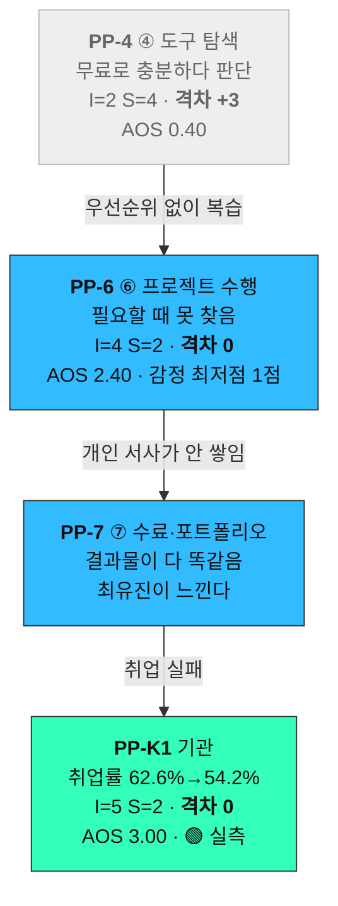
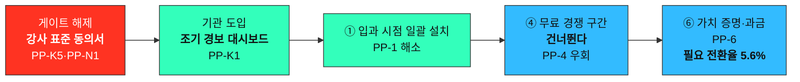

# 사례 01-⑦ — 「콕집」 전략 함의: 점수표가 실제로 시키는 것

> **콕집** — 국비 교육·대학 강의를 녹음·태깅해, **현직자 관점의 우선순위로 복습할 것만 골라주는** 학습 앱

작성 시점: 2026년 8월

근거 문서
- [사례 01-⑥ DOS](./case-01-kokjip-lecture-review-prioritizer-dos.md) — **[⑥]**
- [사례 01-②③④⑤ AOS Matrix](./case-01-kokjip-lecture-review-prioritizer-aos-matrix.md) — **인식 격차의 출처. 이하 [AOS]**
- [사례 01-① 대표 Pain List](./case-01-kokjip-lecture-review-prioritizer-pain-list.md) — **[①]**
- [Ch05 여정지도](../05-persona-spectrum-journey-map/case-01-kokjip-lecture-review-prioritizer-journey-map.md) — **[CJM]**
- [Ch04 TAM-SAM-SOM](../04-tam-sam-som-market-segment-map/case-01-kokjip-lecture-review-prioritizer.md) — **[4]**

---

## 0. 이 문서의 위치

①~⑥이 **점수를 만들었다면** 이 문서는 그 점수를 **실행 결정으로 옮깁니다.** [Ch06 방법론]의 워크플로우에는 없는 단계이고, [방법론 §「경고」]가 *"AOS의 용도는 기능 개발 순서이지 사업 우선순위가 아니다"* 라고 한 그 간극을 메우는 자리입니다.

**표기 규칙** — 이 문서는 근거의 성격을 셋으로 구분합니다.

| 표기 | 의미 |
|---|---|
| **[표]** | ①~⑥의 점수·계산에서 직접 나오는 것 |
| **[추론]** | 표를 근거로 한 저자의 판단. 반증 가능하지만 아직 검증 안 됨 🔴 |
| **[가정]** | 이것이 틀리면 해당 절이 무너지는 전제 |

---

## 1. 세 개의 질문, 하나의 자산

사업 쪽에서 반복해서 나오는 질문은 셋입니다.

1. **현직자 기준 우선순위**라는 차별점을 사용자가 어떻게 느끼게 할 것인가
2. **국비 교육기관**을 어떻게 공략할 것인가
3. **무료 대체재**가 있는데 사람들이 유료를 쓸 것인가

**셋 다 같은 자산 하나에 걸려 있습니다.**

| 질문 | 답 | 성립 조건 |
|---|---|---|
| 차별점을 어떻게 느끼게 하나 | **버리라고 말한다**(§3) | 버릴 **근거**가 있어야 |
| 기관을 어떻게 공략하나 | **차수 중 조기 경보를 판다**(§4) | 이행률이 **의미**를 가져야 |
| 무료를 어떻게 이기나 | **④에서는 이기지 않는다**(§5) | 기관이 살 **이유**가 있어야 |

**「현직자 기준 중요도 신호」가 있으면 셋 다 성립하고, 없으면 셋 다 동시에 무너집니다.** [4] §3-4가 *"유료 근거는 현직자 인사이트 기반 우선순위 하나에만 있다"* 고 한 것의 실무적 의미입니다. **§7의 검증이 마케팅·영업보다 먼저인 이유이기도 합니다.**

---

## 2. 인식 격차의 사슬 — 안 느끼는 문제는 하류에서 팔린다

### 2-1. 문제 제기 — PP-4는 왜 계속 최하위인가

**[표]** PP-4(무료 조합으로 "해결된 것 같은 느낌")는 모든 지표에서 바닥입니다.

| 지표 | 값 | 순위 |
|---|---|---|
| AOS | **0.40** | 공동 최하위 (11건 중 10위) |
| DOS (SAM) | **−2.00** | **최하위** |
| DOS (SOM) | **−1.24** | **최하위** |
| 인식 격차 | **+3** | **최대** |

그런데 [CJM §8-1]은 이 항목을 **개입 우선순위 2위**로 꼽았고, *"[4] SOM의 62%가 이 전환에 걸려 있다"* 고 적었습니다.

**먼저 그 62%의 정체를 정확히 해야 합니다.** 62%는 *"PP-4를 풀면 생기는 돈"* 이 아니라 **개인 구독 경로의 비중**(5.9억 ÷ 9.5억)이고, PP-4는 그 앞을 막고 선 장애물의 이름입니다. 그리고 5.9억은 **전환율 3%** 라는 [4]에서 가장 약한 🔴 가정 위에 있습니다 — [4] §6이 *"1%면 SOM 5.6억, 5%면 13.5억"* 이라고 적어둔 그 항목입니다.

> **점수가 낮은 것은 채점 오류가 아니라 정확한 결과입니다.** [AOS]의 채점 규칙 1대로 Importance를 **고객 인식 기준**으로 매겼고, 고객은 ④ 시점에 이것을 문제로 느끼지 않습니다. **감정 곡선이 ③ 2점 → ④ 3점으로 올라갑니다**([CJM §3-2]). 안도하는 사람에게 *"당신은 지금 실수하는 중"* 이라고 말하는 것이 제품이 할 수 있는 가장 어려운 일입니다.

### 2-2. 사슬 — 인식 격차가 0이 되는 지점을 찾는다

**[표]** [AOS §1-6]의 인식 격차 열을 [CJM]의 여정 순서에 올려놓으면 사슬이 보입니다.

**회색이 안 느껴지는 원인, 파랑·초록이 강하게 느껴지는 결과입니다.**

**[표] 사슬에서 인식 격차가 0인 지점이 둘이고, 둘 다 상위 군집입니다** — PP-6(AOS 2.40)과 PP-K1(AOS 3.00). **[추론]** 우연이 아니라고 봅니다. **인식되지 않는 원인은 인식되는 결과를 낳고, 값은 결과에 붙습니다.**

### 2-3. 결정적으로 — 무료 조합은 PP-6를 풀지 못한다

**[표]** [①]의 「현재 대체 수단」 열을 비교하면 갈리는 지점이 나옵니다.

| | PP-4 (④ 도구 탐색) | PP-6 (⑥ 프로젝트 수행) |
|---|---|---|
| 대체 수단 | 클로바노트 · 노션 · 다글로 · ChatGPT 🟢 | 자기 복습 기록 뒤지기 · 팀원·강사에게 묻기 |
| Satisfaction | **4** — 잘 작동한다 | **2** — 거의 작동하지 않는다 |
| 무료 도구의 역할 | 녹음·전사·요약을 **다 해준다** | **저장은 하지만 그 순간에 꺼내주지 않는다** |

**④에서는 무료가 우리만큼 잘하고, ⑥에서는 무료가 아예 못 합니다.** 차이가 벌어지는 지점이 ④가 아니라 ⑥이었습니다.

> **[추론] 그러므로 ④에서 무료와 차별점을 설명하려던 시도 자체가 잘못된 전장 선택입니다.** ④ 시점에 고객이 원하는 것은 「녹음·요약」이고 무료가 그것을 잘합니다. 차이를 설명할 언어가 없는 게 아니라 **차이가 아직 발생하지 않았습니다.**

---

## 3. 차별점 — "보여주기"가 아니라 "버리라고 말하기"

### 3-1. 왜 설명으로는 안 되는가

**[추론]** 무료 요약 도구도 *"핵심만 뽑아드립니다"* 라고 말합니다. 고객 귀에 우리 문장과 구분되지 않습니다.

진짜 차이는 여기 있다고 봅니다 — **요약 도구는 「이건 안 봐도 된다」고 말하지 않습니다.** 요약은 정보를 압축할 뿐 **버리라고 지시하지 않습니다.** 근거가 없어 그 말에 책임을 질 수 없기 때문입니다.

**[표] 그런데 김지원이 실제로 원한 것은 PP-3의 Goal 그대로 「남은 시간에 무엇을 버릴지 정하는 것」이었습니다.** [CJM §3-1]의 발화도 *"이걸 다 볼 수는 없는데"* 입니다. **요약을 원한 적이 없습니다.**

### 3-2. 구체적 형태

| | 첫 화면 |
|---|---|
| 무료 도구 | *"오늘 강의 요약 10줄"* |
| **콕집** | ***"오늘 강의 47분 중 32분은 안 봐도 됩니다. 남은 15분이 채용공고 상위 20%에 나오는 항목입니다"*** |

**[추론]** 이것은 요약 도구가 만들 수 없는 문장이고, 3초 안에 차이가 납니다. 다만 **말하려면 근거를 함께 보여야 합니다** — [①]에서 채점 대상에서 뺀 PP-5(*"우선순위를 신뢰할 근거가 필요하다"*)가 **설계 요건으로는 여기서 되살아납니다.**

### 3-3. 증명은 고객의 데이터로

**[추론]** 개입 지점은 [CJM §8-1] 개입 2위 그대로 **④ 도구 탐색 단계**인데, 목적이 다릅니다 — **파는 게 아니라 심는 것**입니다(§5-1).

> **"클로바노트로 뽑은 요약본을 붙여넣어 보세요"** → 그 위에 **버릴 것을 표시**해 돌려줍니다.

**남의 결과물을 입력으로 받는 것을 두려워할 이유가 없습니다.** 우리가 파는 것은 전사가 아니고, 이 방식이면 **비교가 우리 주장이 아니라 고객 자신의 데이터로 이뤄집니다.** 인식 격차 +3인 항목에서 마케팅 카피는 작동하지 않습니다 — **믿음을 깨는 것은 본인 데이터뿐입니다.**

---

## 4. 기관 공략 — 학습 도구가 아니라 조기 경보

### 4-1. 판매 논리를 뒤집는다

**[표]** 박성호의 Goal은 [① §2-1]대로 *"다음 차수 취업률을 올려 기관 지정을 유지하는 것"* 이지 복습이 아닙니다.

**[추론] 복습 도구로 팔면 "수강생이 알아서 할 일"이 되고 예산 항목이 나오지 않습니다.** PP-K4(예산 항목 불명확)가 🔴로 남은 것이 이 구조 때문이라고 봅니다.

**[표]** 주목할 것은 PP-K1의 Satisfaction을 2로 준 근거입니다 — 대체 수단 둘(차수 종료 후 취업률 집계 · 강사 면담)이 **둘 다 사후**입니다. 원인을 아는 시점에 차수는 이미 끝나 있습니다.

| | 현재 판매 논리 | **제안** |
|---|---|---|
| 주 상품 | 수강생 학습 앱 | **차수 중 조기 경보 대시보드** |
| 부가 | 기관 대시보드 | 수강생 앱 (**데이터 수집 수단**) |
| 사는 이유 | 학습 지원 | **개입 가능한 시점에 개입 가능한 정보** |
| 예산 항목 | 훈련비 내 학습 지원 🔴 | **운영·성과 관리** |
| 대응 Pain | PP-3 (수강생) | **PP-K1 (지불자)** |

**[추론]** *"3주차에 복습 이행률 40% 미만 8명"* 은 **차수가 끝나기 전에 손쓸 수 있는 정보**입니다. PP-K1의 Goal(*"차수가 끝나기 전에 하락을 되돌리고 싶다"*)에 정면으로 닿는 유일한 형태입니다.

### 4-2. 계약 설계 시점에 심어야 하는 두 가지

**둘 다 나중에 소급해서 만들 수 없습니다.**

**① 미사용 차수와의 대조 설계 (PP-K7)**

**[표]** PP-K7은 `I = S = 3` 이라 **DOS가 두 버전 모두 0.00**입니다([⑥ §1-1]). 지표상 보이지 않는데 **재계약을 결정합니다.**

**[추론]** 처방은 [CJM §4]가 이미 적어둔 *"미사용 차수와의 대조 설계"* 입니다. **첫 계약부터 한 기관 안에서 A차수 도입 / B차수 미도입으로 시작하면 1년 뒤 증빙이 자동으로 생깁니다.** 계약이 끝난 뒤에는 만들 수 없습니다.

**② 강사 표준 동의서를 제안서 첫 장에 (PP-K5 · PP-N1)**

**[표]** [① §5]에서 확인했듯 **게이트 6건은 사실상 강사 동의 하나**이고, 그것이 막는 것은 개인 사용이 아니라 **조달**입니다(PP-N3).

**[추론] 영업 제안서의 첫 장이 가격표가 아니라 강사 동의서여야 합니다.** 이상하게 들리지만 분석이 일관되게 그쪽을 가리킵니다 — [CJM §8-1] 개입 1위가 *"강사 opt-in 표준 동의서 + 봉쇄 설계·삭제 보장을 도입 안내에 **선제시**"* 였고, PP-N2가 *"한번 금지하면 되돌리는 비용이 크다"* 이므로 **금지 결정 이전에 도달해야** 합니다.

형식은 [Ch04 딥리서치 §5-4]의 해외 대학 표준을 그대로 씁니다 🟢 — **IP·실연권 강사 보유 + 이유 없는 철회 보장.**

---

## 5. 무료 대체재 — ④에서는 이기지 않는다

### 5-1. 과금 시점을 ④에서 ⑥으로 옮긴다

**[추론]** ④에서는 **설치만 시키고 과금하지 않습니다.** 무료 티어의 역할은 클로바노트를 이기는 것이 아니라 **⑥까지 살아남는 것**입니다.

그리고 ⑥에서, 마감에 몰려 *"배운 걸 지금 써야 하는데 어디 있었지"* 하는 **감정 최저점(1점)** 에 *"3주 전 강의 12분에 있습니다"* 를 보여주고 받습니다. **그 시점 고객은 대체 수단이 없고(S=2) 이미 아파본 사람입니다.**

### 5-2. 산술 — 될 만한가

**[표]** [4] 기본안과 대조합니다. 단가는 [4]의 연 6만 원을 그대로 씁니다.

| | ④ 시점 과금 ([4] 기본안) | ⑥ 시점 과금 |
|---|---|---|
| 과금 모수 | SAM **33만 명 전원** | 프로젝트 있는 과정 **17.8만 명** (PP-6의 MR 0.54) |
| 매출 잠재 | 198억 | 106.9억 |
| 목표 | — | **5.94억** (= [4] 경로 A) |
| **필요 전환율** | **3%** | **모수 대비 5.6%** |

**모수가 절반으로 줄어드니 전환율이 올라야 본전입니다.** 그런데 **⑥ 시점에 우리를 쓰고 있어야** 과금할 수 있으므로 설치율이 결정적입니다.

| ⑥ 시점 설치율 | 과금 모수 | 매출 잠재 | **5.94억에 필요한 전환율** |
|---|---|---|---|
| 30% (개인 자율 설치) | 5.35만 명 | 32.1억 | **18.5%** |
| 50% | 8.91만 명 | 53.5억 | **11.1%** |
| **100% (기관이 ①에 일괄 설치)** | **17.8만 명** | **106.9억** | **5.6%** |

> **[추론] 이 표가 §6의 결론을 만듭니다.** 개인 자율 설치에 의존하면 18.5%를 뚫어야 하는데 [4]가 인용한 프리미엄 앱 통상 전환율은 3~5%입니다. **기관이 입과 시점에 깔아주면 필요 전환율이 5.6%까지 내려갑니다** — 통상치 상단과 붙는 수준입니다.
>
> **[가정] 감정 최저점에 대체재가 없는 순간의 전환율이 통상치보다 높다는 것은 검증되지 않았습니다** 🔴. §7-②가 이것을 확인합니다.

### 5-3. 개인 유료의 실험실은 한도윤 하나

**[표]** PP-A1은 **AOS 1위(3.20)** 이고 대체 수단이 **없으며(S=1)**, [4] §2-3이 *"자비 수백만 원을 낸 집단이라 지불 의사가 가장 높다"* 고 한 세그먼트입니다.

**[표] 그런데 DOS는 0.14로 규모가 SAM의 4.5%뿐입니다.**

**[추론] 그러므로 매출원이 아니라 유료 전환 실험실로 써야 합니다.** 여기서 안 팔리면 어디서도 안 팔립니다. 다만 **[AOS §5-④]가 지적한 대로 PP-A1 자체는 인식 격차 −2(과대 인식)라 기능이 아니라 온보딩 메시지**이므로, 실험 대상은 PP-A1이 아니라 **이 세그먼트에게 파는 PP-3·PP-6**입니다.

### 5-4. 대가 — [4]를 다시 짜야 한다

**정직하게 적어둡니다.** 과금 시점을 옮기면 [4] §5-1의 경로 A 산정이 **전제부터 달라집니다**(모수가 33만 → 17.8만, 전환 시점이 ④ → ⑥). [⑥ §2-2]에서 지적한 경로 A 산식 문제(5.9억 vs 1.78억)와 함께 **[4] SOM을 재산정해야 합니다.**

---

## 6. 순서 — 기관 도입이 개인 전환의 전제다

**[표]** §5-2의 표가 보여주듯 필요 전환율이 18.5% ↔ 5.6%로 **3배 이상 갈리고, 그 차이를 만드는 것이 설치율**입니다.

**[표]** 그리고 설치를 앞당기는 경로는 [CJM]에 이미 적혀 있습니다 — **PP-1: *"입과 시점 설치는 기관 도입 경로로만 가능"***.

**[추론] 기관 공략과 무료 경쟁은 별개 문제가 아니었습니다.** 기관 도입이 개인 전환의 **전제조건**이고, 이 순서가 뒤집히면 둘 다 실패합니다. 개인 시장을 먼저 열려고 하면 ④에서 무료와 정면으로 붙게 되는데, **그 싸움은 인식 격차 +3이 말하듯 이길 수 없습니다.**

### 종합 처분

| 항목 | AOS | DOS(SAM) | **처분** |
|---|---|---|---|
| **PP-3** | 3.00 | **3.00** | **핵심 기능.** 두 지표 모두 1위, 분모를 바꿔도 불변 |
| **PP-K1** | 3.00 | 0.33 | **기관 상품의 본체**(조기 경보). SOM 기준으로는 1.14로 3.5배 |
| **PP-6** | 2.40 | 1.08 | **과금 지점.** 무료가 못 푸는 유일한 곳 |
| **PP-U2** | 2.40 | 1.40 | 대학 확장 시 진입점. **근거가 가장 얇음**([⑥ §9]) |
| **PP-E2** | 3.20 | 0.60 | 축소판 = **게이트 PP-E1 해제 수단**. 시장 크기 🔴 |
| **PP-A1** | 3.20 | 0.14 | **실험실**(§5-3). 매출원 아님 |
| **PP-K7** | 1.20 | **0.00** | **지표에 안 보이나 재계약 결정.** 계약 설계에 심는다(§4-2) |
| **PP-4** | 0.40 | **−2.00** | **파는 항목이 아니라 진단명.** §6의 우회로 해소 |
| **PP-U1** | 0.80 | −0.70 | 대학 CJM 없이는 판단 보류 |
| PP-A3 · PP-A2 | 1.20 · 0.40 | 0.00 · −0.09 | 후순위 |

> **PP-4에 대한 결론** — **마케팅비를 쓰지 않습니다.** 62%는 PP-4에서 거두는 것이 아니라 **PP-6(개인)과 PP-K1(기관)에서 거둡니다.** 표가 이 항목을 계속 최하위로 밀어내는 것은 오류가 아니라 *"여기서 싸우지 말라"* 는 신호입니다.

---

## 7. 지금 확인할 것 — 싸고 크게 바꾸는 두 가지

**둘 다 열 명 안쪽, 며칠이면 됩니다. 그리고 둘 다 마케팅·영업보다 먼저입니다.**

### ① 강사 발화의 「실무 중요도 신호」 밀도

| | |
|---|---|
| **출처** | [CJM §9] 검증 2순위 |
| **방법** | KDT 녹취 3~5개에서 강사가 실무 중요도를 언급하는 횟수를 센다 |
| **판정** | **시간당 2~3회면 성립.** 0.2회면 채용공고 데이터 비중을 올려야 하고, **그러면 「현직자 기준」이라는 표현 자체를 바꿔야 한다** |
| **흔들리면** | **§1의 세 답이 동시에 무너진다.** 버릴 근거가 없으면 §3이 성립하지 않고, 우선순위가 없으면 이행률이 의미를 잃어 §4가 무너지고, 무료와의 차이가 사라져 §5가 무너진다 |

### ② ⑥ 시점 지불 의사 (수료생 회고)

| | |
|---|---|
| **방법** | **KDT 수료생 10명**에게 회고로 묻는다. *"프로젝트 때 배운 걸 못 찾아 헤맨 적 있나요? 몇 번, 얼마나요?"* → *"그때 3주 전 강의 어디에 있는지 바로 알려주는 게 있었다면 얼마까지 냈을 것 같나요?"* |
| **왜 회고인가** | **겪지 않은 사람에게 묻는 가상 질문은 쓸모없습니다.** 이미 ⑥을 지나온 사람은 기억이 선명해 답이 신뢰할 만합니다 |
| **판정** | §5-2의 필요 전환율(설치율 100% 기준 **5.6%**)과 대조 |
| **흔들리면** | 과금 시점 이동 전략이 성립하지 않고, **[4] SOM의 개인 경로를 접어야 한다** |

### 그다음

| 순위 | 항목 | 출처 |
|---|---|---|
| 3 | **기관의 강의 녹화 비율** — 게이트 6건 전체의 전제 | [⑥ §9] |
| 4 | 기관 예산 항목 (운영·성과 관리로 잡히는가) | PP-K4 🔴 |
| 5 | 대학 CJM (PP-U1·U2의 근거 보강) | [⑥ §9] 1' |

---

## 8. 이 문서가 서 있는 가정

**반증되면 해당 절이 무너집니다.** 순서는 파급력 순입니다.

| # | 가정 | 무너지면 | 근거 등급 |
|---|---|---|---|
| **1** | 강사 발화에 실무 중요도 신호가 충분히 담긴다 | **§3·§4·§5 전부.** 제품의 존재 근거 자체 | 🔴 §7-① |
| **2** | ⑥ 시점의 전환율이 ④ 시점 통상치(3~5%)보다 유의하게 높다 | **§5 전체.** 과금 시점 이동 | 🔴 §7-② |
| **3** | 기관이 ① 입과 시점에 일괄 설치해 준다 | **§6.** 필요 전환율이 5.6% → 18.5%로 3배 | 🔴 |
| **4** | 기관이 「조기 경보」에 예산을 배정한다 | **§4.** 기관 상품의 형태 | 🔴 PP-K4 |
| **5** | 프로젝트 시점 리마인드가 실제로 작동한다 | **§5-1.** 아직 만들어본 적 없음 | 🔴 |
| **6** | 이행률이 취업률의 선행 지표다 | **§4-1.** 인과가 증명된 적 없음 — PP-K7이 정확히 그 문제 | 🔴 |

> **여섯 개 전부 🔴입니다.** 이 문서는 **점수표에서 논리적으로 도출된 전략 가설**이지 검증된 결론이 아닙니다. **§7의 두 확인이 1·2번을 동시에 다루므로 거기서부터 시작합니다.**
