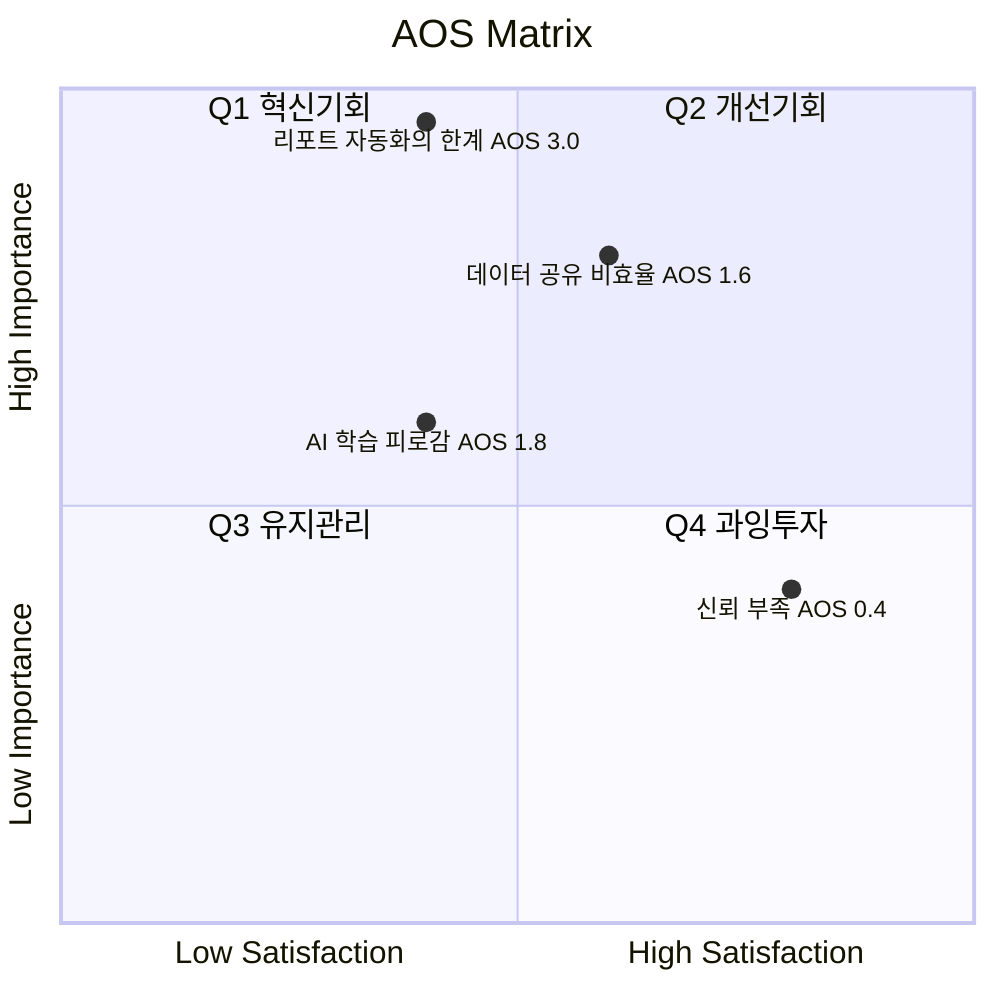

# Ch06 방법론 — 시장기회 분석: 기회점수(OS) 기반 우선순위 판단

> 시장 기회를 **정량적인 숫자로 파악할 수 있는 "시장 기회 점수"** 를 다룹니다.

Ch05까지가 **"고객이 어디서 무엇을 겪는가"** 를 찾아냈다면, Ch06은 그렇게 모인 Pain 후보들에 **점수를 매겨 순서를 정합니다.**

```
Pain 후보 (Ch05)  →  Importance · Satisfaction 평가  →  AOS 계산  →  내림차순 정렬 + Matrix 배치
```

Ch05 여정지도가 "개입 지점의 **후보**를 만드는 도구"였으므로, 이 챕터는 그 후보 중 **어디부터 손대는가**를 답합니다.

---

## 1. 기회점수(OS)와 조정형 기회점수(AOS)

### 1-1. 전통적 OS의 문제 — 중요도가 두 번 반영된다

전통적 기회점수 OS의 수식에서는 **고객의 불만족 수준을 계산할 때 기대치(중요도)와 만족도 지표를 직접 사용**합니다.

```
OS = Importance(기대치) + ( Importance(기대치) − Satisfaction(만족도) )
                            └────── 불만족도 ──────┘
   = Importance × 2 − Satisfaction
```

이 경우 고객이 문제(Pain, Goal, Job)에 대해 가지고 있는 **기대치(중요도)가 두 번 반영됩니다.** Importance가 두 번 들어가면 **실제 시장 감각을 왜곡하는 문제**가 발생합니다.

### 1-2. AOS — 불만족을 중요도와 분리해서 계산한다

조정형 기회점수 AOS는 그 수식을 개선해, **고객의 불만족 수준을 고객의 기대치·중요도와 관계 없는 방법**으로 구합니다. 비율 계산 형태 `(1 − Satisfaction / 5)` 로 도출한 뒤, 거기에 Importance를 곱해 **현실적 혁신기회 강도**를 산출합니다.

```
AOS = Importance × ( 1 − Satisfaction(rate) / 5 )
```

### 1-3. 두 수식이 갈리는 지점

수식 차이가 실제로 순위를 뒤집는지 확인합니다.

| Pain | Importance | Satisfaction | OS = 2I − S | AOS = I × (1 − S/5) |
|---|---|---|---|---|
| **A** 매우 중요하지만 **이미 잘 해결됨** | 5 | 5 | **5.0** | **0.0** |
| **B** 중간 중요도이지만 **거의 미해결** | 3 | 1 | **5.0** | **2.4** |

**OS는 두 항목을 동점으로 처리합니다.** 이미 완벽히 해결된 A에 자원을 태울 이유가 없는데도 OS는 A와 B를 구분하지 못합니다. Importance가 두 번 들어가 A의 점수를 떠받치기 때문입니다.

AOS는 A를 **0으로 떨어뜨립니다.** 충족되지 않은 영역이 없으면 중요도가 아무리 높아도 기회가 아니라는 판단이 수식에 들어 있습니다. **이것이 "실제 시장 감각에 더 가까운 계산"의 의미입니다.**

---

## 2. AOS(Adjusted Opportunity Score)의 정의

| 항목 | 설명 |
|---|---|
| **Importance** | 고객에게 Pain/Goal이 얼마나 중요한가 (1~5점) |
| **Satisfaction** | 현재 이 Pain이 얼마나 잘 해결되고 있는가 (1~5점) |
| **1 − Satisfaction/5** | 충족되지 않은 영역(**Unmet Need**)의 비율 |
| **AOS** | **"중요하지만 덜 해결된 문제"의 강도** |

**Satisfaction은 우리 제품의 만족도가 아니라 「현재 고객이 쓰고 있는 대체 솔루션」의 만족도입니다.** 아직 제품이 없어도 채점이 가능하며, 오히려 제품 이전 단계에서 채점해야 의미가 있습니다.

> **점수 범위** — Satisfaction이 1~5점 척도이므로 Unmet 비율의 최댓값은 `1 − 1/5 = 0.8`입니다. 따라서 **AOS의 실질 범위는 0 ~ 4.0**이며, 5점 만점이 아닙니다. 절대 임계값을 정할 때 이 범위를 기준으로 삼습니다.

---

## 3. 점수 해석 예시

| Pain / Goal | Importance | Satisfaction | 1 − Satisfaction (rate) | AOS | 해석 |
|---|---|---|---|---|---|
| 리포트 자동화의 한계 | 5 | 2 (40%) | 0.6 | 5 × (1 − 0.4) = **3.0** | 명확한 혁신 기회 |
| AI 학습 피로감 | 3 | 2 (40%) | 0.6 | 3 × (1 − 0.4) = **1.8** | 부분적 개선 기회 |
| 데이터 공유 비효율 | 4 | 3 (60%) | 0.4 | 4 × (1 − 0.6) = **1.6** | 유지관리 대상 |
| 신뢰 부족 | 2 | 4 (80%) | 0.2 | 2 × (1 − 0.8) = **0.4** | 저기회 영역 |

> **해석 열의 등급은 절대 기준이 아니라 이 목록 안에서의 상대 순위입니다.** 1.8과 1.6처럼 0.2 차이로 등급이 갈리는 경계는 유의미하지 않습니다. **실행 순서를 정하는 것은 등급 이름이 아니라 AOS 내림차순 정렬입니다.**

---

## 4. AOS 시각화 — 사분면 Matrix

### 4-1. 축

- **X축: Satisfaction (충족도)**
- **Y축: Importance (중요도)**
- **버블 크기: AOS**



| 사분면 | 위치 | 조건 |
|---|---|---|
| 🔥 **Q1 혁신기회** | 좌상 | High Importance + **Low Satisfaction** |
| 💎 **Q2 개선기회** | 우상 | High Importance + High Satisfaction |
| ⚫ **Q3 유지관리** | 좌하 | Low Importance + Low Satisfaction |
| ⚠️ **Q4 과잉투자** | 우하 | Low Importance + High Satisfaction |

### 4-2. 사분면 해석 방법

| 사분면 | 조건 | 의미 | 전략 행동 |
|---|---|---|---|
| **Q1** | High AOS | 혁신기회 (High Importance + Low Satisfaction) | **JTBD 인터뷰 대상, MVP 실험 우선** |
| **Q2** | 중간 AOS | 개선기회 | 지속적 개선 필요 |
| **Q3** | Low AOS | 유지 / 보완 | UX·마케팅 최적화 중심 |
| **Q4** | 0 근처 | **과잉투자 위험** | 자원 분배 재검토 |

**Q4가 이 그림의 숨은 산출물입니다.** 중요하지도 않은데 이미 잘 해결돼 있다는 것은 그동안 그쪽에 자원이 과하게 들어갔다는 뜻이고, 회수 대상이 됩니다.

### 4-3. 주의 — 사분면 위치와 AOS 등급은 항상 일치하지 않는다

사분면은 **(I, S) 위치**로 나누고, 해석 등급은 **AOS 값**으로 나눕니다. 두 기준은 어긋날 수 있습니다.

- 「AI 학습 피로감」(I=3, S=2)은 위치상 좌상단(Q1)이지만 AOS는 1.8로 중위권입니다.
- 「데이터 공유 비효율」(I=4, S=3)은 위치상 우상단(Q2)이지만 AOS는 그보다 낮은 1.6입니다.

**어긋나는 지점이 오히려 정보입니다.** 위치는 *왜* 그 점수가 나왔는지(중요도 부족인가, 이미 충족되어 있는가)를 설명하고, **실행 순서는 AOS 내림차순이 정합니다.** 사분면을 우선순위 결정에 쓰면 안 됩니다 — 설명용입니다.

---

## 5. 평가 대상 정의 — 무엇을 (재료로) 점수화하는가

우리가 설계한 솔루션에 대한 **페르소나 스펙트럼과 고객 여정 지도**에 대하여, **기존 솔루션 생태계 하에서 고객이 겪고 있는 Pain/Job 상황**을 평가합니다.

| 분석 단계 | 평가 단위 = 고객 타겟 | 평가 대상 = Pain 정의 내용 |
|---|---|---|
| **페르소나 단계** | 각 페르소나의 주요 Pain·Goal | "이 사람에게 가장 중요한 고통은 무엇인가?" |
| **고객 여정 지도** | 여정 단계별 Pain Point / 개선기회 | "고객 여정 중 어디서 좌절이 가장 큰가?" |
| **JTBD 인터뷰 사전 단계** | Job Statement 단위 | "이 고객이 진보를 이루기 위해 수행하는 일(Job)은 무엇인가?" |

**AOS는 두 번 돕니다.** 1차는 JTBD 인터뷰 **전에** — 누구를 인터뷰할지 고르기 위해 Ch05 Pain에 점수를 매깁니다. 2차는 인터뷰 **후에** — 나온 Job Statement에 다시 점수를 매겨 MVP 범위를 정합니다.

### 5-1. 앞선 분석 결과 중 무엇을 사용하는가?

**Q. 페르소나가 도출되기 전, "문제정의"·"Segment" 단계의 Pain List를 사용하면 어떻게 될까요?**

**Importance를 매길 주체가 사라집니다.** Importance는 *"누구에게"* 중요한지가 정해져야 매길 수 있는 값인데, 세그먼트 단계의 Pain은 집단을 뭉뚱그린 것이라 점수가 **평균값**이 됩니다. AOS는 극단(High Importance + Low Satisfaction)을 찾아내는 도구이므로, 평균을 넣으면 도구가 무력화됩니다 — Ch05 여정지도에서 *"여러 명을 섞으면 평균이 되고, 평균에는 이탈 지점이 없다"* 고 했던 것과 같은 구조입니다.

> 다만 세그먼트 단계의 Pain List는 **누락 점검용**으로 유효합니다. 세그먼트 Pain에는 있는데 페르소나 Pain에는 없는 항목이 있다면, 그것은 페르소나 정의가 좁았다는 신호입니다.

**Q. 페르소나 Spectrum 4가지 중 어떤 페르소나가 가진 Pain List를 사용해야 할까요?**

| 스펙트럼 유형 | AOS에서의 취급 |
|---|---|
| **Core User** (핵심) | **기본 채점 대상.** MVP가 먼저 이겨야 하는 곳이므로 여기의 AOS 순위가 곧 개발 순서 |
| **Adjacent User** (확장) | **같은 Pain 리스트를 따로 채점.** 문제는 같아도 I·S가 달라지므로, 그 차이가 확장 순서를 정한다 |
| **Extreme User** (극단) | **AOS로 순위를 매기지 않고 「제약 조건」으로 다룬다.** 점수가 낮아도 통과 못 하면 시장이 닫히는 항목이 여기 있다 |
| **Non-user** (비활성) | 못 쓰는 사람과 안 쓰는 사람을 분리한다. **「안 쓴다」는 대체재 Satisfaction이 높다는 뜻**이므로 그대로 Satisfaction 근거로 쓰인다 |

**핵심은 Extreme·Non-user의 Pain을 AOS 순위표에 섞지 않는 것입니다.** 이들의 Pain은 대개 *"기회의 크기"* 가 아니라 *"자격 요건"* 이며, 점수로 정렬하면 우선순위 아래로 밀려 내려간 뒤 실제로는 사업 전체를 멈춰 세웁니다.

**Q. 몇 개를 점수화하는가?**

분석 & 기획 단계에서는 **최대한 많은 "유효한" 문제들에 시장기회 점수를 매겨서 내림차순으로 정렬해 봅니다.** "유효한"의 조건은 셋입니다.

1. **귀속** — 특정 페르소나에게 귀속되어 있는가 (누구의 Pain인지 없으면 채점 불가)
2. **근거** — 관찰·인터뷰·발언에 근거가 있는가 (우리가 상상한 Pain은 제외)
3. **판정 가능성** — 해결됐는지 아닌지를 판정할 수 있는 형태로 서술됐는가

**"우리 제품이 있으면 좋겠다"는 Pain이 아니라 소망입니다.** 이 형태가 목록에 들어오면 Satisfaction이 자동으로 1점이 되어 AOS를 인위적으로 끌어올립니다.

---

## 6. AOS 산출 5단계 워크플로우 (Step-by-Step)

| 단계 | 설명 | AI 지원 프롬프트 | 산출물 |
|---|---|---|---|
| **① Pain 리스트 정리** | Persona/CJM에서 Pain·Goal 정리 | "각 페르소나의 주요 Pain/Goal을 표로 정리해줘." | Pain List |
| **② Importance 평가** | 고객 입장에서 중요도 평가 (1~5) | "각 Pain이 고객의 목표 달성에 얼마나 중요한지 1~5로 평가해줘." | Importance Table |
| **③ Satisfaction 평가** | 현재 충족 수준 평가 (1~5) | "현재 사용 중인 대체 솔루션의 만족도를 1~5로 평가해줘." | Satisfaction Table |
| **④ AOS 계산** | `AOS = Importance × (1 − Satisfaction/5)` | "위 표에 AOS 계산식을 적용하고 결과를 내줘." | AOS Table |
| **⑤ Matrix 시각화** | X: Satisfaction, Y: Importance, Bubble: AOS | "AOS 기준으로 기회가 큰 항목 순으로 정렬하고, Matrix 사분면에 배치해줘." | **(Adjusted) Opportunity Score Matrix** |

**②와 ③을 한 번에 매기지 않습니다.** 같은 자리에서 두 점수를 함께 매기면 "중요하니까 만족도도 낮겠지" 하는 편향이 들어가고, 그 순간 AOS는 다시 Importance의 함수가 됩니다 — §1-1에서 고치려던 바로 그 문제입니다. **표를 두 번 돌립니다.**

---

## 7. 출력 포맷

```
1. 채점 대상 확정            — 어느 페르소나 · 어느 여정 단계의 Pain인가
2. Pain List                 — ID · 출처(PP-* 등) · 귀속 페르소나
3. Importance Table          — 점수 + 그렇게 매긴 근거
4. Satisfaction Table        — 점수 + 「무엇과 비교한 만족도인가」(대체 솔루션 명시)
5. AOS Table                 — 계산 결과, AOS 내림차순 정렬
6. AOS Matrix                — 사분면 배치 (설명용)
7. 별도 트랙: 제약 조건       — Extreme·Non-user에서 온 「통과 요건」
8. 다음 단계로 넘기는 값       — Ch07 JTBD 인터뷰 대상 · MVP 실험 순서
```

---

## 8. 검증 질문 (작성 후 자기점검)

- [ ] AOS 수식에 **Importance가 한 번만** 들어갔는가 (`I + (I − S)` 형태로 쓰지 않았는가)
- [ ] Satisfaction이 **대체 솔루션의 만족도**인가, 우리 제품에 대한 기대인가
- [ ] Satisfaction 열에 **비교 대상(무료 조합·엑셀·수작업 등)이 명시**돼 있는가
- [ ] Importance와 Satisfaction을 **분리해서** 매겼는가
- [ ] 각 Pain이 **특정 페르소나에 귀속**돼 있는가 (집단 평균이 아닌가)
- [ ] "우리 제품이 있으면 좋겠다" 형태의 **소망이 Pain으로 섞여 있지 않은가**
- [ ] Extreme·Non-user의 **제약 조건**이 AOS 순위표에 섞이지 않고 별도 트랙에 있는가
- [ ] 결과가 **AOS 내림차순으로 정렬**돼 있는가 (사분면 라벨로 순서를 정하지 않았는가)
- [ ] 상위 항목과 하위 항목의 점수 차이가 **판단을 바꿀 만큼** 큰가 (0.2 차이로 결론을 내리지 않았는가)
- [ ] 채점 근거가 **추정인지 인터뷰로 확인된 사실인지** 표기상 구분되는가

---

## 이 챕터의 입력과 출력

| 방향 | 내용 |
|---|---|
| **입력** | [Ch05 페르소나](../05-persona-spectrum-journey-map/case-01-kokjip-lecture-review-prioritizer-personas.md)(Importance의 주체) · [Ch05 페르소나 스펙트럼](../05-persona-spectrum-journey-map/case-01-kokjip-lecture-review-prioritizer-persona-spectrum.md)(어느 유형의 Pain을 쓸지) · [Ch05 여정지도](../05-persona-spectrum-journey-map/case-01-kokjip-lecture-review-prioritizer-journey-map.md)의 **Pain Point `PP-*`**(채점 원재료) · [Ch04 세그먼트](../04-tam-sam-som-market-segment-map/case-01-kokjip-lecture-review-prioritizer.md)(누락 점검 + 세그먼트별 시장 크기) · Ch01 대체재(Satisfaction의 비교 대상) |
| **출력** | Ch07 JTBD(인터뷰 대상 선정 → 이후 Job Statement 재채점) · MVP 실험 순서 · 자원 회수 대상(Q4) |

---

## ⚠️ 경고 — AOS는 순위를 주지, 크기를 주지 않는다

> ### **AOS가 높다는 것은 「그 문제가 덜 풀렸다」는 뜻이지, 「그 시장이 크다」는 뜻이 아닙니다.**

AOS의 두 입력 어디에도 **시장 규모도 지불 의사도 들어 있지 않습니다.** 소수의 사람이 절박하게 겪는 문제와 다수가 절박하게 겪는 문제가 같은 AOS를 받습니다.

| 하면 안 되는 것 | 왜 |
|---|---|
| AOS 1위 항목을 곧바로 사업 아이템으로 확정 | 규모 판단은 **Ch04(TAM-SAM-SOM)** 의 몫이다. AOS는 순서만 준다 |
| 서로 다른 페르소나의 AOS를 한 표에 섞어 정렬 | 채점자가 다르면 척도가 다르다. **같은 페르소나 안에서만 비교 가능** |
| 소수점 차이로 순위를 확정 | 1~5점 척도에서 0.2 차이는 채점자의 기분 차이와 구분되지 않는다 |
| 근거 없이 매긴 점수를 그대로 사용 | 점수는 **판단을 기록한 것이지 측정한 것이 아니다.** 근거 열이 없으면 숫자는 장식 |

**판정법**: AOS 상위 항목을 골랐을 때 *"이걸 푸는 사람이 몇 명이고 얼마를 낼 수 있는가"* 에 답할 수 없다면, **Ch04로 되돌아가 그 항목의 시장 크기를 붙인 다음** 실행을 결정합니다.

> **그 「되돌아가는 절차」를 수식 안으로 넣은 것이 [DOS(시장 가중형 기회점수)](./methodology-dos.md)입니다.** `DOS = (Importance − Satisfaction) × Market Relevance` — 고객 미충족에 시장 파급력을 곱해, AOS가 답하지 못한 **규모**를 순위에 반영합니다.
