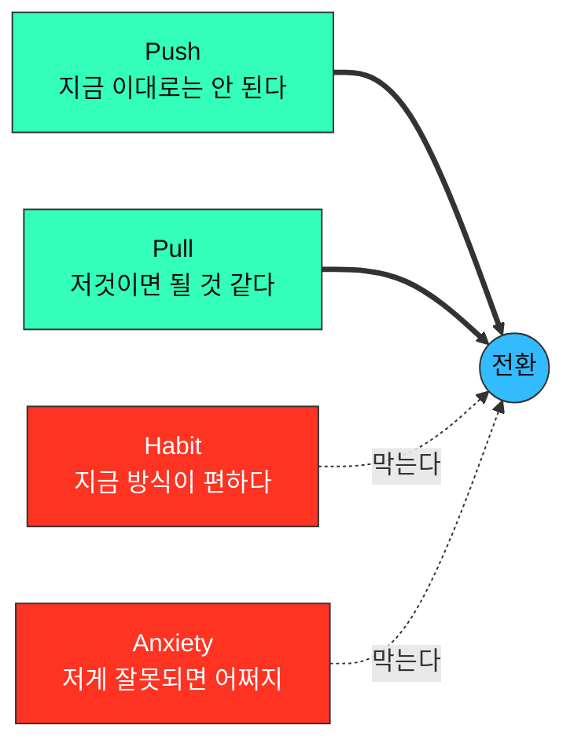

# Ch07 방법론 — JTBD(Jobs-To-Be-Done) 분석: 전환 행동 기반 인터뷰

> 고객이 **"어떤 상황에서, 어떤 진보(progress)를 이루려고, 무엇을 버리고 무엇으로 옮겨 갔는가"** 를 재구성해 **해결해야 할 과업(Job)** 을 정의합니다.

Ch05가 **"고객이 어디서 무엇을 겪는가"** 를, Ch06이 **"그 중 어디부터 손대는가"** 를 답했다면, Ch07은 **"고객이 실제로 무엇을 하려던 것인가"** 를 답합니다.

```
Ch06 상위 Pain (인터뷰 대상 선정)  →  전환 사건 재구성  →  4대 동인 채집  →  Job Statement  →  Ch06 재채점
```

**이 챕터의 산출물은 「기능 목록」이 아니라 「전환의 인과」입니다.** Ch06의 AOS는 *고객이 인식한 대로* 점수를 매기므로 인식되지 않은 문제를 구조적으로 하위에 놓습니다([Ch06 사례 §5 ⑤](../06-market-opportunity-score/case-01-kokjip-lecture-review-prioritizer-aos-matrix.md)). **인터뷰는 그 인식 자체가 어떻게 만들어졌는지를 캐내는 자리**이고, 그래서 점수로는 보이지 않던 항목이 여기서 1순위로 올라올 수 있습니다.

---

## 1. 인터뷰 준비 및 구조

### 1-1. 시간 배정

클래식한 **생성 연구(generative research)** 세션과 유사하게, 인터뷰 시간은 보통 **60분에서 90분**을 배정합니다. 이 기법에 익숙하지 않은 경우 **편안함을 느끼는 데 시간이 걸리기** 때문입니다.

| 배정 | 의미 |
|---|---|
| **60~90분** | 기본 배정. 앞의 10~15분은 라포 형성에 쓰이고 회수되지 않는다 |
| **30분 이하** | **성립하지 않는다.** 참가자가 편해지기 전에 끝나고, 남는 것은 표면적 답변뿐 |

### 1-2. 고유한 참가자 모집 (Recruiting)

**JTBD의 핵심은 전환 행동(switching behavior)을 이해하는 것**이므로, 특히 다음 **세 그룹**을 스크리닝하여 모집합니다.

| # | 모집 그룹 | 이 그룹에서만 나오는 것 |
|---|---|---|
| **1** | **최근에 우리 제품/서비스를 사용하기 시작한 사람들** | 무엇이 그들을 **밀어냈고**(Push) 무엇이 **끌어당겼는가**(Pull) |
| **2** | **최근에 우리 제품/서비스 사용을 중단한 사람들** | 우리가 **되돌려 보낸 이유**. 습관과 불안이 어디서 이겼는가 |
| **3** | **우리 제품/서비스에 대해 아직 들어본 적이 없는 사람들** | **대체재의 실제 만족도.** 우리를 모르는 채로 문제를 어떻게 처리하고 있는가 |

이들을 통해 사람들이 우리 제품/서비스로 **전환하거나 떠나는 이유**, 그리고 **경쟁 제품으로 이끄는 푸시/풀(Pushes/Pulls) 요소**를 이해하고자 합니다.

> **세 그룹 중 하나만 모으면 인터뷰가 자기 확인으로 끝납니다.** 사용 시작 그룹만 모으면 "왜 좋았는지"만 모이고, 그것은 이미 이긴 싸움의 기록입니다. **중단·미인지 그룹이 전환의 반대 방향을 알려주는 유일한 통로입니다.**

### 1-3. 제품이 아직 없을 때 — 세 그룹을 무엇으로 치환하는가

**세 그룹의 정의는 「우리 제품」을 기준으로 쓰여 있으므로, 제품이 없으면 그대로 쓸 수 없습니다.** 이때 기준을 **「고객이 지금 쓰는 대체 솔루션」** 으로 옮깁니다. 전환 행동을 보는 것이 목적이고, 전환의 대상이 우리일 필요는 없습니다.

| 원래 그룹 | 제품 이전 단계의 치환 |
|---|---|
| 최근 사용 시작 | **대체 솔루션으로 최근 옮겨 온 사람** (예: 무료 조합을 최근에 갖추기 시작한 학습자) |
| 최근 사용 중단 | **대체 솔루션을 깔았다가 안 쓰게 된 사람** — 이탈은 이미 일어났고 대상만 다르다 |
| 아직 못 들어봄 | **문제를 겪지만 아무 도구도 쓰지 않는 사람** |

---

## 2. 심층 목표 파헤치기 (Focus on Deeper Goals)

### 2-1. 표면적 답변 피하기

**단순히 사용자에게 왜 다른 제품으로 전환했는지 직설적으로 묻는 것을 피해야 합니다.** 그렇게 하면 **행동을 유도하는 더 깊은 목표에 도달할 수 없습니다.**

| 피해야 할 질문 | 왜 | 대체 질문 |
|---|---|---|
| "왜 A에서 B로 바꾸셨어요?" | **답이 사후 합리화로 나온다.** 이유를 정리해 말해 주지만 그것은 당시의 판단이 아니다 | "바꾸기로 결정한 날, 그 직전에 무슨 일이 있었어요?" |
| "이 기능이 있으면 쓰시겠어요?" | 미래 가정에 대한 답은 **예측이 아니라 예의**다 | "지금은 그 상황에서 실제로 뭘 하세요?" |
| "무엇이 불편하세요?" | 불편은 얼마든지 만들어낼 수 있다 | "마지막으로 그게 막혔던 게 언제였어요?" |

### 2-2. '전환 사건'에 집중

인터뷰이는 **대화의 방향을 이끌도록 허용하되**, 연구자는 참가자가 변화를 일으키게 된 **'전환 사건(switch event)'** 에 초점을 맞춰야 합니다.

**「허용하되 초점을 맞춘다」가 이 기법의 난이도 전부입니다.** 대화를 통제하면 스토리가 나오지 않고, 통제를 놓으면 전환 사건에 도달하지 못합니다. 실무적으로는 **주제는 열어 두고 시점만 붙잡습니다** — 무슨 이야기를 해도 좋지만, *"그게 언제였어요?"* 로 계속 되돌립니다.

### 2-3. 스토리텔링 유도

깊은 목표와 행동을 이해하기 위해서는 **사용자가 무언가를 하기로 결정한 배경에 대한 이야기를 하도록 유도**해야 합니다. 생성 연구와 마찬가지로 질문을 심층적으로 파고들어야 하지만, **특정 방식으로 진행해야 합니다** — 의견이 아니라 **사건**을 캐야 합니다.

> **판정법**: 참가자의 답에 **날짜·장소·등장인물·그때 한 행동**이 없으면, 그것은 아직 스토리가 아니라 의견입니다.

---

## 3. 핵심 질문 전략 (Interview Scripting)

연구자는 다음과 같은 주요 질문을 포함하여 대화의 맥락을 잡을 수 있으며, 이는 **대안 및 맥락 파악에 중점**을 둡니다.

### 3-1. 대안 및 맥락 파악 질문

| # | 질문 | 채집하는 것 |
|---|---|---|
| 1 | 제품/서비스를 시도하기 **전에 다른 어떤 해결책을 고려**했습니까? | 경쟁 집합(실제 비교군) |
| 2 | 이러한 해결책을 고려할 때 **무엇을 찾고 있었습니까**? | 평가 기준 |
| 3 | **무엇을 해결하려고** 했습니까? | Job의 원형 |
| 4 | 이 제품/서비스들을 **어떻게 찾아보았는지** 이야기해 주십시오. | 탐색 채널 |
| 5 | **실제로 사용해 본** 다른 해결책은 무엇입니까? | 고려와 사용의 격차 |
| 6 | 시도하거나 사용해 본 다른 해결책 중에서 **좋았던 점과 싫었던 점**은 무엇입니까? | Pull과 Push |
| 7 | 이 제품/서비스를 **사용할 수 없었다면 대신 무엇을 했을 것**입니까? | 진짜 대체재 |
| 8 | **주변 사람들이** 시도하거나 사용해 본 해결책은 무엇입니까? | 준거 집단·확산 경로 |
| 9 | **과거와 비교했을 때 지금 무엇을 하고 있습니까**? | 전환의 전후 대조 |

**7번이 Ch06 Satisfaction의 비교 대상을 확정하는 질문입니다.** 우리가 표에 적어 둔 「현재 대체 수단」이 맞는지는 이 답으로만 검증됩니다.

### 3-2. 맥락 및 감정적 질문

**경쟁사 및 잠재적인 전환 행동을 파악한 후에는** 더 감정적인 질문을 통해 깊이 파고들기 시작합니다.

| # | 질문 | 채집하는 것 |
|---|---|---|
| 1 | 문제를 해결할 무언가가 **필요하다는 것을 언제 처음 깨달았습니까**? | **First Thought — 전환 타임라인의 시작점** |
| 2 | 고려 중인 선택에 대해 **다른 사람과 이야기했습니까? 대화는 어땠습니까**? | 사회적 승인·반대 |
| 3 | 이 제품/서비스를 사용하면 **어떤 모습일지 상상했습니까**? | 기대한 진보의 그림 |
| 4 | 제품/서비스로부터 **무엇을 원했습니까**? | Pull |
| 5 | 이 제품/서비스를 구매/사용하는 것에 대해 **불안감(anxiety)이 있었습니까**? | Anxiety |
| 6 | 사용하는 것에 대해 **걱정하게 만드는 요소**가 있었습니까? | Anxiety의 구체적 출처 |

**순서가 규칙입니다.** 감정 질문을 먼저 하면 참가자가 자기 서사를 먼저 만들고, 그 뒤의 사실 답변이 모두 그 서사에 맞춰집니다. **대안·맥락 → 감정** 순서를 지킵니다.

### 3-3. 스토리텔링을 위한 연상 유도

사용자의 기억은 **사람, 장소, 냄새 또는 소리와의 연상**을 통해 회상되는 경우가 많습니다.

- **그때는 하루 중 몇 시였습니까?**
- **집에 있었습니까, 직장에 있었습니까?**
- **뒤에서 TV가 켜져 있었습니까?**
- **당신은 어떤 상태였습니까 (who they were)?**

> **이 네 질문은 정보를 얻으려고 묻는 것이 아닙니다.** TV가 켜져 있었는지는 분석에 쓰이지 않습니다. **기억을 여는 열쇠**로 쓰이며, 참가자가 "아, 그때…" 하고 장면을 떠올리는 순간부터 답의 성질이 의견에서 사건으로 바뀝니다.

---

## 4. 경청해야 할 4가지 전환 동인 (Listening for the Switch)

인터뷰를 진행하는 동안, **전환을 유도한 동기나 페인 포인트(pain points)에 귀 기울여야** 합니다.

| 동인 | 물어야 할 것 |
|---|---|
| **상황의 푸시 (Push)** | 특정 상황 중 **무엇이 그들을 새로운 해결책을 찾도록 이끌었습니까**? |
| **새로운 해결책의 풀 (Pull)** | 새로운 해결책의 **어떤 점이 그것을 시도하고 싶게 만들었습니까**? |
| **발목을 잡는 습관 (Habits)** | 새로운 해결책을 시도하는 것을 **방해할 수 있는 그들의 습관**은 무엇이었습니까? |
| **새로운 해결책에 대한 불안감 (Anxieties)** | 새로운 해결책을 시도하거나 사용하는 것에 대해 **어떤 불안감을 느꼈습니까**? |

### 4-1. 네 동인을 읽는 법 — 두 개는 밀고, 두 개는 붙잡는다

네 동인은 대등한 목록이 아니라 **서로 반대 방향으로 작용하는 두 쌍**입니다.



**전환은 `Push + Pull > Habit + Anxiety` 일 때만 일어납니다.** 그래서 인터뷰에서 **네 개를 다 채집하지 못하면 처방을 쓸 수 없습니다** — Pull만 모으면 "기능을 더 넣자"로 끝나고, 정작 전환을 막은 것이 Habit·Anxiety였다면 기능을 아무리 넣어도 움직이지 않습니다.

| 무엇이 부족했는가 | 처방의 종류 |
|---|---|
| **Push가 약하다** | 문제를 **가시화**한다 (기능이 아니다) |
| **Pull이 약하다** | 제품·기능·메시지 |
| **Habit이 강하다** | 기존 습관 **안에** 들어가는 설계 (전환 비용 제거) |
| **Anxiety가 강하다** | 보장·증거·되돌릴 수 있음 (환불·삭제·통제권) |

### 4-2. 채집 기록표

인터뷰 1건마다 이 표를 채웁니다. **빈 칸이 있는 채로 인터뷰를 끝내면 그 인터뷰는 미완성입니다.**

| 동인 | 참가자 발언 (원문) | 시점·장면 | 등급 |
|---|---|---|---|
| Push | | | |
| Pull | | | |
| Habit | | | |
| Anxiety | | | |

---

## 5. Job Statement로 옮기기

인터뷰의 최종 산출물은 **과업 진술문(Job Statement)** 입니다. 4대 동인 채집표를 아래 형식으로 압축합니다.

```
[상황]일 때, 나는 [동기·진보]하고 싶다. 그래서 [기대 결과]할 수 있게.
When ___ , I want to ___ , so I can ___ .
```

| 규칙 | 이유 |
|---|---|
| **[상황]에 시점·장소·계기가 들어간다** | 상황이 없으면 그것은 Job이 아니라 취향이다 |
| **[동기]에 제품 이름과 기능 명칭이 들어가지 않는다** | [Ch06 §2-4 첫째](../06-market-opportunity-score/case-01-kokjip-lecture-review-prioritizer-pain-list.md)와 같은 규칙 — 기능을 목표로 쓰면 우리의 중요도를 재게 된다 |
| **[기대 결과]가 판정 가능하다** | 달성 여부를 판정할 수 없으면 재채점도 검증도 불가능하다 |
| **참가자의 말에서 나온 단어를 쓴다** | 우리 어휘로 번역하는 순간 원본 추적이 끊긴다 |

---

## 6. 출력 포맷

```
0. 인터뷰 대상 확정        — 누구를, 왜 (Ch06의 어느 항목을 검증하러 가는가)
1. 모집 스크리너           — 세 그룹(시작·중단·미인지)의 판별 문항
2. 공통 문항지             — 전 대상에게 같은 순서로 묻는 것
3. 대상별 문항지           — 그 사람에게만 유효한 분기 문항
4. 인터뷰 응답 기록        — 발언 원문 (요약하지 않은 것)
5. 4대 동인 채집표         — 대상 1명당 1표
6. Job Statement           — 대상별 1~3문
7. Ch06 재채점 대상        — 인터뷰로 점수가 바뀌어야 하는 항목
8. 검증되지 않고 남은 가정  — 다음 회차로 넘기는 것
```

---

## 7. 검증 질문 (작성 후 자기점검)

- [ ] 세 그룹(**사용 시작 · 중단 · 미인지**)이 모집에 다 들어갔는가 (제품이 없으면 §1-3의 치환형으로)
- [ ] 인터뷰 시간이 **60~90분**으로 배정됐는가
- [ ] **"왜 바꾸셨어요?"** 형태의 직설적 전환 질문을 쓰지 않았는가
- [ ] 질문 순서가 **대안·맥락 → 감정** 인가 (감정을 먼저 묻지 않았는가)
- [ ] 참가자의 답에 **날짜·장소·등장인물·행동**이 있는가 (의견이 아니라 사건인가)
- [ ] **연상 유도 질문**(시각·장소·상태)이 스크립트에 있는가
- [ ] **4대 동인 네 칸이 다 채워졌는가** — Pull만 모이지 않았는가
- [ ] 「**쓸 수 없었다면 대신 무엇을 했겠는가**」를 물어 진짜 대체재를 확인했는가
- [ ] Job Statement에 **제품 이름·기능 명칭이 들어가지 않았는가**
- [ ] Job Statement의 **[상황]에 시점·계기**가 있는가
- [ ] 응답을 **요약하지 않은 원문**으로 남겼는가
- [ ] 인터뷰 결과가 **Ch06 재채점으로 되돌아가는 경로**가 적혀 있는가

---

## 이 챕터의 입력과 출력

| 방향 | 내용 |
|---|---|
| **입력** | [Ch06 AOS Matrix](../06-market-opportunity-score/case-01-kokjip-lecture-review-prioritizer-aos-matrix.md)의 **Q1 항목**(인터뷰 우선 대상) · [Ch06 Pain List](../06-market-opportunity-score/case-01-kokjip-lecture-review-prioritizer-pain-list.md)의 **페르소나 Goal과 「현재 대체 수단」**(질문의 검증 대상) · [Ch05 페르소나 스펙트럼](../05-persona-spectrum-journey-map/case-01-kokjip-lecture-review-prioritizer-persona-spectrum.md)(모집 3그룹의 실체) · [Ch05 여정지도](../05-persona-spectrum-journey-map/case-01-kokjip-lecture-review-prioritizer-journey-map.md)(전환 사건이 놓일 시점) |
| **출력** | **Job Statement** → Ch06 2차 채점(AOS 재산출) · MVP 범위 · 게이트 통과 요건의 사실 확인 · Ch04 가정 검증 결과 |

**Ch06과 Ch07은 한 방향이 아니라 고리입니다.** Ch06이 인터뷰 대상을 골라 주고, 인터뷰가 Job Statement를 만들어 Ch06으로 되돌아가 다시 채점됩니다([Ch06 방법론 §5](../06-market-opportunity-score/methodology.md#5-평가-대상-정의--무엇을-재료로-점수화하는가) — *"AOS는 두 번 돈다"*).

---

## ⚠️ 경고 — 인터뷰는 「의견 수집」이 아니라 「사건 재구성」이다

> ### **참가자가 무엇을 원한다고 말했는지는 JTBD의 산출물이 아닙니다. 참가자가 언제·무엇 때문에·무엇을 버리고 무엇으로 옮겼는지가 산출물입니다.**

| 하면 안 되는 것 | 왜 |
|---|---|
| 기능 목록을 보여주고 선호를 묻기 | **컨셉 테스트이지 JTBD가 아니다.** 좋아 보이는 것과 돈을 내고 바꾸는 것은 다른 행동이다 |
| "있으면 쓰시겠어요?"로 수요 확인 | 미래 행동에 대한 자기 보고는 **일관되게 과대추정**된다 |
| 응답을 요약해 저장 | 요약은 우리 어휘로의 번역이다. **Job Statement는 참가자의 단어로만 쓸 수 있다** |
| Pull만 채집하고 끝내기 | 전환을 막은 것이 Habit·Anxiety였다면 **기능을 넣어도 움직이지 않는다**(§4-1) |
| 사용 시작 그룹만 인터뷰 | 이미 이긴 싸움의 기록만 모인다. **중단·미인지 그룹에만 있는 정보가 있다**(§1-2) |

**판정법**: 인터뷰가 끝난 뒤 **「그 사람이 며칠에 무엇을 해서 무엇을 그만뒀는지」를 한 문장으로 쓸 수 없다면**, 그 인터뷰는 의견 수집이었습니다. 4대 동인 채집표(§4-2)의 「시점·장면」 열이 비어 있는지로 확인합니다.
