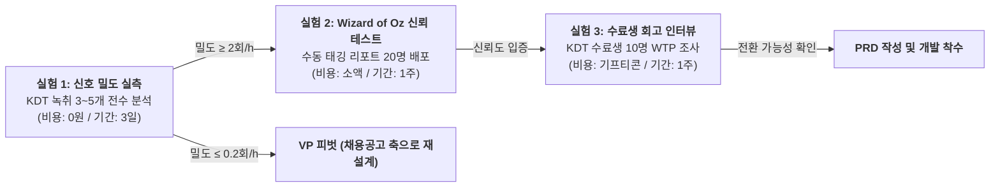

# KOKJIP-VPS-v2_0-rooted

> **문서명:** KOKJIP-VPS-v2_0-rooted (Value Proposition Statement 기준 문서)  
> **문서 목적:** PRD(제품 요구사항 정의서) 작성 및 제품 방향 의사결정의 공식 근거 기준 수립  
> **기준 시점:** 2026년 8월  
> **상태:** 조건부 가치 가설 확립 단계 (선행 핵심 가설 실측 전 PRD 동결)  
> **근거 표기 체계:** 🟢 **실측·사실** (공개 통계·경쟁 실사·정량 지표) / 🟡 **추론** (실측 기반 계산·구조적 논리 도출) / 🔴 **미검증 가설** (선행 검증 대상)

---

## 1. Executive Summary & One-Line Positioning

### 1-1. 한 줄 포지셔닝 (One-Line Positioning)

> **콕집은 AI가 학습 내용의 중요도를 임의로 판단하는 서비스가 아니라, 강의 중 강사가 실무 중요도를 직접 언급한 순간을 근거(Provenance)로 삼아, 학습자가 가진 남은 시간 안에서 가장 먼저 볼 것만 짚어주는 학습 우선순위 서비스다.**

### 1-2. 제품의 본질과 세 가지 가치목표(A·B·C) 위상 정립

```text
[A안: 시간 프레이밍] ──(전달 형식)──> "남은 시간 안에 끝낸다" (진입 마케팅/UI)
         │
         ▼
[B안: 출처 기반 우선순위] ──(코어 가치)──> "강사가 실무 중요도를 직접 말한 순간" (차별화 본체)
         │
         ▼
[C안: 취업 결과 데이터] ──(보류 자산)──> "합격자 학습 이력" (9~12개월 후 가중치 보정용)
```

1. **가치 B (출처 기반 우선순위 · Core Value) — 코어 가치목표 (조건부 확정)**
   - AI의 알고리즘 지능이 아니라 **"강사 발화의 실무 강조 신호(Instructor Signal Provenance)"**를 판정 근거로 사용한다.
   - AI는 가치를 스스로 생성하는 주체가 아니라 강사의 전문적 판단을 추출·재사용하는 도구다.
2. **가치 A (시간 예산 절약 · Delivery Framing) — 진입 프레이밍 (종속 요소)**
   - 최상위 고객 Pain(PP-3: "남은 시간에 무엇을 버릴지 결정")에 접근하는 인터페이스이자 메시징이다.
   - 시간 입력 자체는 범용 AI 프롬프트로 재현 가능하므로 독립 가치가 될 수 없으며, B의 판정 근거를 소비하기 쉬운 형태로 전달하는 껍질로 정의한다.
3. **가치 C (취업/시험 결과 연계 · Outcome Evidence) — 현 단계 VP에서 전면 제외**
   - 9~12개월의 시차, 차수당 13명(25명 × 취업률 54.2% 🟢)이라는 극소 표본 문제, 채용 시장 진입 시 발생하는 중립성 훼손(이해상충) 및 'AI 역량 증명' 시장의 5개 관문 차단 🟢으로 인해 현재 VP에서 제외하고 데이터 로그 적립 대상으로만 관리한다.

---

## 2. 누구의 어떤 문제를 해결하는가 (Target Customer & Problem)

### 2-1. 표적 고객: 극단적 교두보 협소화 (KSF 1 충족)

**주 표적 (Core Persona):** 고밀도 직무형 부트캠프(K-Digital Training, AI·SW·데이터 과정 3~6개월 차)에 참여 중인 비전공 취업준비생 (대표 페르소나: 김지원, 20대 후반)

| 타깃 선정 조건 | 선정 및 제외 이유 | 근거 등급 |
|---|---|---|
| **일 6~8시간 고밀도 연강** | 매일 6~8시간의 녹음·코드가 쌓여 복습 부채가 누적되어야 우선순위 선별 Pain 발생 | 🟢 사실 |
| **직무형 교육 (개발/AI/데이터)** | '실무에서 쓰이는 것'과 '이론' 간 괴리가 커 현직자 강사의 팁이 결정적 가치를 지님 | 🟢 사실 |
| **자격증/공시생 제외 (버린 집단)** | 정답과 합격선이 정해진 시험은 강사의 주관적 실무 팁이 무효하므로 배제 | 🟢 사실 |
| **장기 미취업 청년 제외 (버린 집단)** | 태깅할 원천 강의가 없어 제품이 0원에서 동작하지 않으므로 배제 | 🟢 사실 |

### 2-2. 고객 여정(CJM) 기반 4단계 Pain & Needs

```text
[1. 수업 직후] ──────> [2. 복습 계획] ──────> [3. 복습 실행] ──────> [4. 맥락 검증]
 (방대한 분량)          (어디서부터?)          (탐색 시간 낭비)       (환각·의도 오해)
```

| CJM 단계 | 고객이 겪는 실제 Pain | 고객의 본질적 Needs (Desired Outcome) | 대체 수단 만족도 (S) |
|---|---|---|:---:|
| **1. 수업 직후** | 하루 8시간 분량의 녹음/자료 누적으로 압도감 발생 | 오늘 반드시 복습해야 할 핵심 분량만 1차 추출 | S=3 (보통) |
| **2. 복습 계획** | 일반 AI 요약은 교재 수준 이론만 나열하고 실무 팁을 누락 | "강사가 면접·실무에서 쓰인다고 한 내용"만 선별 | S=2 (불만) |
| **3. 복습 실행** | "강사가 중요하다고 했던 부분"을 찾으려 2배속 재청취로 시간 허비 | 실무 강조 발화 지점으로 즉시 1클릭 이동 | S=2 (불만) |
| **4. 맥락 검증** | AI 텍스트 요약만 보면 코드 작성 맥락이나 강사 뉘앙스 오해 | 요약 텍스트와 원천 오디오의 1:1 동기화 검증 | S=1 (매우불만) |

### 2-3. 핵심 Pain의 구조 (PP-3)

> **핵심 Pain (PP-3): "남은 시간에 무엇을 버릴지 정하고 싶다."**  
> 🟢 **실측 근거:** 17개 대표 Pain 중 **AOS 3.00, DOS(SAM) 3.00으로 두 지표 모두 공동 1위**.

- **문제의 본질:** 학습자가 겪는 고통은 '정보량 부족'이나 '요약 부재'가 아니다. **"제한된 시간 안에서 무엇을 우선하고 무엇을 버려야 하는지 스스로 판단할 수 없다"는 인지 비용과 불안감**이다.
- 비전공자는 자신이 무엇을 모르는지조차 모르기 때문에, 기존 AI 코스웨어의 '오답 기반 약점 보완' 방식이 성립하지 않는다. 외부 현직자의 기준이 주입되어야 한다.

---

## 3. 고객 Desired Outcome & JTBD

### 3-1. 궁극적 Outcome vs 중간 기여 Outcome

- **궁극적 Desired Outcome:** 제한된 6개월 안에 기업이 채용할 수준의 실무 역량에 도달하는 것.
- **KOKJIP 직접 기여 Outcome:** 불필요한 강의 구간 탐색 시간을 제거하고, 강사가 강조한 실무 핵심 구간을 남은 시간 안에 완벽히 학습하여 과제와 프로젝트에 즉시 적용하는 것.

### 3-2. JTBD (Job-to-be-Done) 체계

```text
[Core Functional Job]
When: 하루 8시간 강의를 듣고 복습할 시간이 1~2시간밖에 없을 때,
I want to: 강사가 '실무 관점'이나 '면접 단골'이라고 직접 언급한 핵심 발화 구간만 선별하여,
So I can: 교과서적 이론 대신 현직자의 실무 노하우를 빠르게 체득하고 과제에 적용할 수 있다.

[Supporting Job (Time Framing)]
When: 전체 오디오를 다 들을 수 없을 때,
I want to: 강사 강조 발화가 태깅된 타임스탬프를 통해 원천 오디오로 즉시 이동하여,
So I can: 탐색 시간을 아끼고 100% 원문 맥락을 검증할 수 있다.

[Emotional Job]
"강사님이 지나가듯 말한 실무 알짜 팁을 놓쳤을까 봐 불안한 마음(FOMO)" 없이 확신을 갖고 복습한다.

[Social Job]
단순 암기 수강생이 아닌, 실무 감각과 우선순위를 이해하는 준비된 지원자로 인식된다.
```

---

## 4. 기존 대안과 한계 (Competitors & Alternatives)

### 4-1. 7개 경로 8개 경쟁 사업자 실사 결과

| 경쟁 경로 | 사업자 | 규모 및 비즈니스 모델 | 콕집 관점의 위협 및 한계 | 근거 |
|---|---|---|---|:---:|
| **A. 정면 경쟁** | **다글로** | 시리즈B 60억(누적 200억) 🟢<br>B2C 구독 + B2B API | "대학생 맞춤형 AI" 표방, 퀴즈 생성 보유 🟢. 그러나 **실무 중요도 축이 없고** 범용 받아쓰기 엔진에 집중 | 🟢 실측 |
| **B. 무료 번들** | **클로바노트** | 가입자 100만, 노트 3,000만 🟢<br>개인 완전 무료(300~600분) | 네이버 인프라로 원가 수직계열화. **카테고리 가격을 0원으로 고정** 🟡. 단, 우선순위 판정 기능 없음 | 🟢 실측 |
| **B. 무료 번들** | **Gemini Notebook** | 3,000만 유저, 60만 조직 🟢<br>Google 생태계 무료 | 소스 그라운딩, 학습가이드·퀴즈·마인드맵 무료 배포 🟢. **콕집이 팔려던 산출물이 이미 0원에 공급됨** | 🟢 실측 |
| **C. 카테고리 리더** | **Otter.ai** | ARR 1억 달러($100M) 돌파 🟢<br>프리미엄 SaaS ($16.99~) | 교육 라인 운영하나, **비사용자(제3자 수강생) 녹음으로 집단소송 직면** 🟢 → 동의·프라이버시 규범 선결정 | 🟢 실측 |
| **D. 신뢰 특화** | **티로(Tiro)** | 시드 8억, 재구독률 90% 🟢<br>B2B/엔터프라이즈 SaaS | **"데이터 미보유/학습 미사용/즉시 파기"**를 세일즈 무기로 삼음 🟢. 기관 보안 심사 기준을 높여놓음 | 🟢 실측 |
| **E. 습관 선점** | **노션(Notion)** | 1억 사용자, 포춘500 50% 🟢<br>학생·교원 Plus 무료 🟢 | 학생 때 무료로 습관을 장악. 정리 도구로서의 전환비용 형성 🟡 | 🟢 실측 |
| **F. 지불자 장악** | **엘리스** | 2024 매출 351억, 영업익 134억 🟡<br>시리즈C 200억, 50개 대학 🟢 | **콕집의 지불자(178개 KDT 기관·대학)를 LXP로 이미 장악한 플랫폼** 🟢. 강력한 유통 통로이자 잠재 경쟁 | 🟢 실측 |
| **G. 공급자 통합** | **패스트캠퍼스** | 2025 매출 1,239억, 영업익 46억 🟢<br>코스닥 상장사 (데이원컴퍼니) | KDT 훈련 직접 운영. AI 교육 매출 51.4% 🟢. 필요 시 학습 보조 도구를 자체 개발(후방통합)할 위험 🟡 | 🟢 실측 |

### 4-2. 왜 무료 AI 및 요약 도구로는 고객 문제가 해결되지 않는가

```text
[일반 무료 요약 도구 / 범용 LLM]         [KOKJIP (출처 기반 우선순위)]
- "오늘 강의 요약 10줄입니다."            - "오늘 8시간 중 5시간은 기본 문법입니다.
- 무엇을 버려야 할지 말하지 못함          남은 3시간 중 강사가 '실무 필수'라 강조한
  (근거가 없어 임의 삭제 책임 회피)         8개 구간(47분 분량)부터 먼저 보세요."
- 환각(Hallucination) 위험 상존           - 요약 클릭 시 원천 발화 타임스탬프로 즉시 이동
```

1. **"버릴 것을 지시하지 못함":** 요약 도구는 정보를 압축할 뿐 "이건 안 봐도 된다"고 지시하지 못한다. 버릴 근거가 없기 때문이다.
2. **출처와 맥락의 단절:** LLM 요약 텍스트는 원천 오디오와 단절되어 있어, 강사가 어떤 뉘앙스와 예외 조건으로 말했는지 검증하려면 결국 전체 오디오를 뒤져야 한다.
3. **신뢰 구조의 결핍:** 학습자는 "AI가 중요하다고 요약했다"보다 "강사가 직접 실무에서 쓰인다고 강조했다"를 신뢰한다.

---

## 5. KOKJIP Core Value Proposition & 차별점

### 5-1. Value Proposition Statement

> **"하루 8시간의 강의를 모두 복습할 수 없는 부트캠프 수강생에게, 콕집은 강사가 실무와 면접에서 중요하다고 직접 강조한 발화를 근거로 복습 우선순위를 추출하여, 남은 시간 예산 안에서 취업에 직결되는 핵심 구간부터 1클릭으로 탐색·학습할 수 있게 돕는다."**

### 5-2. 차별화의 핵심 메커니즘 (Provenance vs Intelligence)

```text
[기존 에듀테크 / AI 도구]               [KOKJIP]
 입력 데이터 (강의 음성/자료)              입력 데이터 (강의 음성)
         │                                       │
         ▼                                       ▼
  AI의 지능적 판단                       강사의 구어체 강조 신호 포착
 ("AI가 보기에 중요함")                   ("실무에선 이거 씁니다", "면접 단골")
         │                                       │
         ▼                                       ▼
 텍스트 요약본 생성                       원천 오디오 타임스탬프 동기화 (Audio Provenance)
 (근거 불명, 신뢰 부족)                   (판단 주체: 강사 / AI: 신호 추출기)
```

- **판단 출처(Provenance)의 차별화:** AI 지능의 우수성을 자랑하지 않고, **AI가 판단 주체에서 물러나 강사의 실제 발화를 근거로 제시**함으로써 신뢰성을 확보한다.
- **3청중(학습자·강사·기관) 동시 안전성 달성:**
  - **학습자:** 실무 현직자인 강사의 권위에 기반한 명확한 복습 우선순위 획득.
  - **강사:** 강의 평가나 자의적 편집이 아니라, 강사 자신의 발화 권위를 존중·증폭하므로 거부감 최소화.
  - **기관:** 강사와의 마찰 없이 수강생 복습 이행률 및 취업률 방어 수단 확보.

### 5-3. 4대 판정 근거 후보 비교 및 시점별 로드맵

| 근거 후보 | 확보 시점 | 해상도 | 방어력 | 설명력 | 전략적 처분 |
|---|:---:|:---:|:---:|:---:|---|
| **① 채용공고 기술 수요** | 즉시 🟢 | 중 (기술 스택) | 거의 0 | 최고 | **신뢰/설명 레이어**로 상시 결합 |
| **② 커뮤니티/기술문서** | 즉시 | 중 | 0 | 중 | **탈락** (LLM 사전학습과 중복, 저작권 위험) |
| **③ 취업 성공자 학습이력** | 9~12개월 후 | 최고 | **최고** | 최고 | **로그 적립 후 차기 가중치 교정용** |
| **④ 강사 강의 발화** | **즉시 🟢** | **최고** | **중** | **높음** | **MVP 핵심 1차 판정 신호 (채택)** |

---

## 6. 가치 주장과 근거 수준 (Grounding Matrix)

| # | 핵심 판단 및 가치 주장 | 근거 수준 | 구체적 근거 및 출처 |
|---|---|:---:|---|
| 1 | 학습자는 남은 시간에 무엇을 버릴지 결정하고 싶어 한다 | 🟢 **실측** | PP-3 Pain AOS 3.00, DOS(SAM) 3.00 공동 1위 |
| 2 | KDT 부트캠프 취업률 하락으로 기관의 위기감이 극에 달했다 | 🟢 **실측** | 고용노동부 공시 KDT 취업률: 2022년 62.6% → 2024년 54.2% (8.4%p 급락) |
| 3 | 경쟁 8개사 중 강의의 '뺄셈(버릴 것)'을 선언한 곳은 없다 | 🟢 **실측** | 8개 사업자 가치 선언 실사 완료 (시간 입력 도구 0곳) |
| 4 | 무료 번들(클로바노트·노션·Gemini)로 인해 개인 가격은 0원에 수렴한다 | 🟢 **실측** | 네이버 300~600분 무료, Google 소스 그라운딩·퀴즈 무료 배포 |
| 5 | 단순 시간 입력만으로 우선순위를 만드는 것은 차별성이 없다 | 🟡 **추론** | 범용 AI 프롬프트 한 줄로 재현 가능한 구조 |
| 6 | 강사 발화 출처 제시가 AI 요약보다 사용자 신뢰도가 높을 것이다 | 🟡 **추론** | 비전공자의 현직자 권위 의존 심리 및 포트폴리오 면접 대응 구조 |
| 7 | 원천 오디오 타임스탬프 동기화가 탐색 시간을 유의미하게 단축한다 | 🟡 **추론** | STT 전사 텍스트 클릭 시 해당 재생 지점 1:1 매핑 UI 구조 |
| 8 | **실제 직무 강의에서 강사 실무 강조 발화가 충분히 자주 발생한다** | 🔴 **가설** | **핵심 선행 가설 1 (Signal Density) — 시간당 2~3회 발생 여부 미실측** |
| 9 | **수강생이 강사 발화 기반 우선순위를 보고 실제 복습 행동을 변경한다** | 🔴 **가설** | **핵심 선행 가설 2 (Evidence Trust) — 사용자 행동 변화 미검증** |
| 10 | **프로젝트 마감 시점(CJM 6단계)에 수강생의 유료 지불 의사(WTP)가 발생한다** | 🔴 **가설** | **비즈니스 가설 — 5.6% 전환율 달성 여부 미실측** |
| 11 | **훈련기관이 '차수 중 조기 경보 대시보드'에 운영 예산을 배정한다** | 🔴 **가설** | **B2B 가설 — 연 1,000만 원 단가 수용성 미실측** |

---

## 7. 핵심 미검증 가설 및 검증 계획 (Validation Plan)

### 7-1. 우선순위 가설 3선

```text
[가설 1: Signal Density (존재 조건)] ──> [가설 2: Evidence Trust (신뢰 조건)] ──> [가설 3: Monetization (지불 조건)]
강사 발화에 실무 신호가 있는가?          학습자가 이를 믿고 행동하는가?            어느 시점에 돈을 내는가?
(시간당 ≥ 2회)                           (A/B 비교 시 선호 및 실행)                 (⑥단계 전환율 ≥ 5.6%)
```

#### 가설 1. 강사 발화 신호 밀도 (Signal Density — 최우선 병목)
> **가설:** 직무형(KDT 등) 강의에서 강사가 실무 중요도나 주의점을 직접 언급하는 신호가 시간당 평균 2회 이상 발생한다.  
> **파급력:** 참이면 B가 코어 가치가 됨. 거짓(≤0.2회)이면 B안 붕괴 및 채용공고 데이터 기반으로 전면 피벗 필요.

#### 가설 2. 출처 신뢰 및 행동 변화 (Evidence Trust)
> **가설:** 학습자는 "AI가 추천한 요약"보다 "강사의 실무 언급 타임스탬프"에 유의미하게 더 높은 신뢰를 보내며, 실제 복습 순서를 바꾼다.

#### 가설 3. ⑥단계(프로젝트 수행) 과금 전환율 (Monetization Timing)
> **가설:** 무료 도구로 만족하는 ④단계(도구 탐색)에서는 과금이 불가능하지만, 과거 배운 내용을 못 찾아 헤매는 ⑥단계(프로젝트)에서는 5.6% 이상의 유료 전환율이 발생한다.

---

### 7-2. 구체적 검증 실험 설계 (PRD 전 실행)



| 실험 | 검증 대상 | 방법 | 성공 판정 기준 | 실패 시 대응 경로 |
|---|---|---|---|---|
| **실험 1**<br>Signal Density | 가설 1 | KDT 실제 강의 녹취 3~5개(15~25시간 분량)에서 강사 구어체 실무 강조 신호 전수 카운팅 | **시간당 ≥ 2.0회:** B가치 확정<br>**시간당 0.5~1.9회:** 신호 정의 확장<br>**시간당 ≤ 0.2회:** B가치 기각 | B가치 폐기, ①채용공고 데이터 기반 '채용 시장 요구도' 축으로 VP 전면 재작성 |
| **실험 2**<br>Evidence Trust | 가설 2 | 20명 수강생 대상 Wizard of Oz 프로토타입 배포: [A안: 일반 AI 요약] vs [B안: 강사 발화 인용+타임스탬프 리포트] 블라인드 A/B 테스트 | 70% 이상이 B안 선택, B안 제공 시 복습 완료 시간 30% 이상 단축 | 단순 강사 인용 외에 채용공고 연계 데이터 시각화 추가 보완 |
| **실험 3**<br>⑥단계 WTP | 가설 3 | KDT 수료생 10명 심층 인터뷰: "프로젝트 진행 시 과거 강의 탐색 고통 경험 회고" 및 특정 시점 유료 결제 의사 확인 | 10명 중 6명 이상이 프로젝트 시점 기능에 월 5,000원~10,000원 지불 의사 표명 | 개인 B2C 구독 포기, 기관 B2B 라이선스 단일 모델로 전환 |

---

## 8. MVP Job-Feature Map & 개발 범위 (Scope)

### 8-1. Pain → Outcome → Value → Feature 정렬 맵

| Customer Pain | Desired Outcome | KOKJIP Value | 구현 Feature | MVP 우선순위 |
|---|---|---|---|:---:|
| **밀린 강의 중 무엇이 중요한지 모름 (PP-3)** | 오늘 반드시 볼 핵심만 선별 | 강사 발화 출처 기반 실무 중요도 판정 | **강사 구어체 강조 신호 텍스트 태깅 엔진** | **P0 (필수)** |
| **AI 요약의 환각·의도 오해 불안** | 강사 발화 원문 맥락을 즉시 확인 | Audio Provenance (출처 신뢰) | **태그 클릭 시 1:1 오디오 즉시 재생 앵커** | **P0 (필수)** |
| **2배속 재청취로 인한 시간 낭비** | 중요 구간으로 즉시 이동 | Time-Anchored Navigation | **Audio-Text 동기화 타임라인 플레이어** | **P0 (필수)** |
| **남은 시간에 맞춘 학습 분량 압축** | 가용 시간 내 학습 완료 | 가용 시간 맞춤형 필터링 | **가용 시간(예: 30분) 입력 슬라이더 UI** | **P1 (차기)** |
| **텍스트 외 강사 억양/음량 강조 누락** | 비언어적 강조점 포착 | 하이브리드 중요도 감지 | **음향(Acoustic) 피치/데시벨 분석 엔진** | **P1 (차기)** |
| **프로젝트 시점 복습 내용 망각 (PP-6)** | 프로젝트 구현 중 과거 팁 즉시 호출 | 맥락 재소환 | **프로젝트 키워드 기반 강의 구간 역검색** | **P1 (차기)** |
| **강의 자료 유출 및 저작권 분쟁 우려** | 강사/기관의 안심 도입 | Data Containment (신뢰 입장료) | **음성 전사 후 원본 즉시 폐기 & AI 학습 미사용** | **P0 (필수)** |

### 8-2. MVP 포함/제외 범위 명세

- **P0 (MVP 포함 — 가설 1·2 검증 최소 기능):**
  1. 강의 오디오 업로드 및 STT 전사 파이프라인
  2. 규칙/키워드 기반 강사 실무 강조 발화 태깅 엔진
  3. 태그-오디오 1:1 동기화 웹 플레이어 (클릭 시 해당 초로 즉시 점프)
  4. 데이터 보안 정책 (전사 완료 즉시 원본 오디오 휘발성 삭제)
- **P1 (Should-Have — 검증 후 추가):** 가용 시간 입력 필터, 프로젝트 역검색, 음향 분석.
- **P2 / 제외 (Out of Scope):**
  - AI 퀴즈/플래시카드 생성 (Gemini Notebook/다글로가 무료 제공하므로 중복 탈락)
  - 취업 포트폴리오 자동 완성 및 기업 채용 매칭 (가치 C 제외 원칙)
  - 강사별 평가 등급 산출 (공급자 이탈을 초래하므로 절대 금지)

---

## 9. 비즈니스 모델 및 시장 진입 전략 (Go-to-Market)

### 9-1. 무료 경쟁 회피와 과금 전환 사슬

```text
[개인 자율 설치 경로 (실패 경로)]
 ④ 도구 탐색 (클로바노트 무료 만족, 인식격차 +3) ──> ⑥ 프로젝트 (설치율 30%) ──> 필요 전환율 18.5% (달성 불가능)

[기관 연계 일괄 설치 경로 (승리 경로)]
 ① 입과 시점 기관 일괄 배포 ──> ④ 무료 경쟁 구간 통과 ──> ⑥ 프로젝트 고통 (설치율 100%) ──> 필요 전환율 5.6% (달성 가능)
```

- **④단계(도구 탐색)에서의 싸움 포기:** 네이버 클로바노트·노션 무료 조합으로 만족하고 있는 ④단계에서는 마케팅비를 쓰지 않는다.
- **⑥단계(프로젝트 수행, Pain PP-6, S=2)에서의 과금:** 배운 내용을 프로젝트에 적용하지 못해 고통받는 시점에 개인 유료 전환을 유도한다.
- **기관 B2B 도입의 본질:** 기관 도입은 단순 매출처가 아니라 **수강생 100% 설치를 확보하여 개인 유료 전환율 문턱을 18.5%에서 5.6%로 낮추는 필수 관문**이다.

### 9-2. B2B 기관 판매 논리의 재정의 (조기 경보 대시보드)

- **기관의 Goal:** 수료생 취업률 방어 (KDT 취업률 62.6% → 54.2% 급락 대응) 및 훈련기관 평가 등급 유지.
- **판매 상품의 전환:**
  - ❌ "수강생용 복습 앱을 사주세요" → 예산 항목 없음, 수강생 자율에 맡김.
  - ✅ **"차수 중 복습 이탈자를 사전에 감지하는 조기 경보 대시보드"** → 운영·성과관리 예산에서 집행 가능.

### 9-3. 법적·제도적 게이트 통과 설계 (Otter.ai 소송 교훈 반영)

1. **강사 표준 동의 절차:** UMass·UCL 글로벌 표준을 적용하여 **"녹화물 IP·실연권은 강사 보유 + 이유 없는 거부권 보장"**을 영업 제안서 1페이지에 명시 🟢.
2. **제3자 리스크 차단:** Q&A 시 섞이는 비사용자(타 수강생) 음성은 전사 대상에서 제외하거나 비강사 음성 즉시 비식별화 (Otter.ai 집단소송 리스크 선제 방어) 🟢.
3. **데이터 완전 봉쇄:** 음성 전사 후 즉시 폐기, LLM 학습 미사용 원칙 고수 (티로 모델 벤치마킹) 🟢.

---

## 10. 커뮤니케이션 가드레일 (Communication Guardrails)

KOKJIP의 대외 커뮤니케이션, 마케팅 문구, 내부 제품 용어는 다음 기준을 엄격히 준수한다.

| ❌ 절대 금지 표현 (Prohibited) | 사유 | ✅ 공식 권장 표현 (Recommended) |
|---|---|---|
| "AI가 강의에서 중요한 내용을 골라줍니다." | AI 임의 판단으로 오인, 신뢰도 하락 및 범용 AI와 차별점 소멸 | **"강사님이 실무에서 중요하다고 강조한 부분을 다시 찾아드립니다."** |
| "강의에서 불필요한/버릴 내용을 잘라냅니다." | 강사 권위 훼손 및 교육기관 반발 초래 | **"학습자의 남은 시간에 맞춰 가장 먼저 볼 구간을 정해드립니다."** |
| "콕집을 쓰면 AI가 취업을 보장합니다." | 인과관계 입증 불가 (가치 C 배제 원칙 위반) | **"현직자 강사의 실무 감각과 면접 팁을 놓치지 않고 복습합니다."** |
| "AI가 요약 노트와 퀴즈를 만들어 드립니다." | Gemini Notebook/다글로 등 무료 기능과 혼동 유발 | **"강사의 실제 발화를 근거로 복습 우선순위를 세워드립니다."** |

---

## 11. Strategic Verdict & 다음 단계 의사결정 (Next Decisions)

### 11-1. 최종 전략 판정 (Verdict)

> **판정: Conditional Go (조건부 추진)**  
> 고객 Pain(PP-3, PP-6, PP-K1)은 강력하며, '출처(Provenance) 기반 뺄셈'이라는 차별화 논리는 경쟁 8개사 대비 구조적으로 유효하다. 그러나 **핵심 존재 조건인 '강사 발화 신호 밀도'와 '사용자 행동 변화'가 실측되지 않은 상태에서 PRD 및 개발로 직행하는 것은 자본 낭비**다.

### 11-2. 다음 단계 액션 및 게이트 의사결정

```text
[Step 1: 선행 가설 실측] ─────> [Gate 판정] ─────> [Step 2: PRD 확정 및 MVP 개발]
 1) KDT 녹취 3~5개 신호 밀도      밀도 ≥ 2회/h: Go      - P0 기능 중심 PRD 작성
 2) 20명 대상 Wizard of Oz         신호 부재 시: Pivot    - 1클릭 Audio-Sync 플레이어 구현
 3) 수료생 10명 WTP 인터뷰
```

1. **즉각 실행 과제:**
   - 실제 KDT 강의 녹취 데이터 3~5개를 확보하여 **실무 중요도 신호 밀도(Signal Density)**를 3일 내 전수 측정한다.
   - 수동으로 태깅한 리포트로 타깃 수강생 20명에게 Wizard of Oz 테스트를 수행하여 **출처 신뢰 및 복습 행동 변화**를 측정한다.
2. **게이트 기준 (PRD 착수 조건):**
   - **강사 신호 밀도 시간당 ≥ 2.0회 & B안 신뢰 선호도 ≥ 70% 충족 시:** 본 VPS를 확정 기준선으로 삼고 즉시 PRD 작성 및 개발 스프린트 진입.
   - **신호 밀도 시간당 ≤ 0.2회 미달 시:** B안을 폐기하고 채용공고 기반 '산업 기술 수요'를 축으로 하는 대체 가치 제안으로 피벗.
