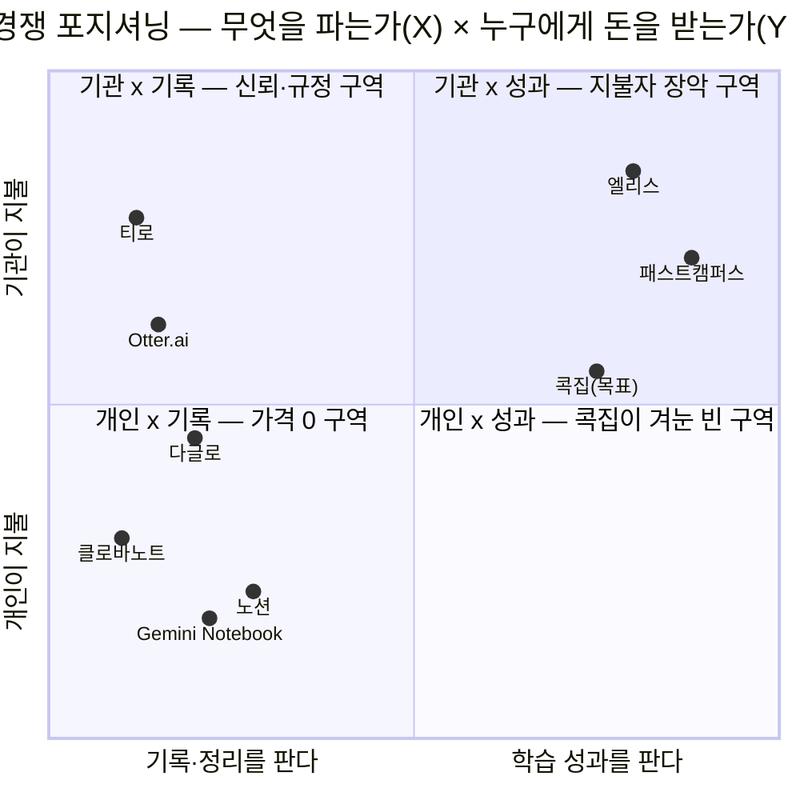

# 사례 01 — 「콕집」의 경쟁 지형과 경쟁사 가치 선언 브리핑

> **콕집** — 국비 교육·대학 강의를 녹음·태깅해, **현직자 관점의 우선순위로 복습할 것만 골라주는** 학습 앱

분석 기준 시점: 2026년 8월 · 입력 문서: [Ch01 5가지 힘](../01-porters-five-forces/case-01-kokjip-lecture-review-prioritizer.md) · [Ch04 딥리서치 경쟁 실사](../04-tam-sam-som-market-segment-map/deep-research/kokjip-research.md) · [Ch06 전략 함의](../06-market-opportunity-score/case-01-kokjip-lecture-review-prioritizer-strategy.md)

**근거 표기** — 🟢 실측(공개 자료로 확인) / 🟡 추론(실측에서 계산·논리로 도출) / 🔴 가설(이어붙일 실측이 없음)

> **이 문서가 다루는 것과 다루지 않는 것**
> 다루는 것: 경쟁 사업자 8곳의 **규모·비즈니스 모델·전략 특징**, 핵심 가치와 직결된 사업 활동, 그리고 그 활동에서 **역산한 가치 선언문**.
> 다루지 않는 것: 각 사의 **공식 미션·슬로건 원문**. §5의 가치 선언문은 회사가 스스로 선포한 문장이 아니라 **관측된 사업 활동에서 이 문서가 도출한 것**이며, 등급은 전부 🟡입니다. 이 구분을 흐리면 브랜딩 분석이 아니라 홍보 문구 수집이 됩니다.

---

## 0. 앞 챕터에서 이어받은 것

경쟁자를 세기 전에, **어디까지가 경쟁인지**를 앞 챕터가 이미 못박아 두었습니다. 그 판정을 그대로 승계합니다.

| 이어받은 판정 | 출처 | 이 문서에서의 역할 |
|---|---|---|
| 산업 경계 = **"학습자를 겨냥해 설계되었는가"** | [Ch01 §0](../01-porters-five-forces/case-01-kokjip-lecture-review-prioritizer.md#0-분석-범위-정의) | 경쟁자 목록을 **내부/대체재/채널**로 3분 |
| 차별화 축은 기능이 아니라 **AI 판정의 근거 데이터** 하나 | [딥리서치 §4](../04-tam-sam-som-market-segment-map/deep-research/kokjip-research.md#4-6단계--차별화-축-재정의) | 각 사의 활동을 **"판정 근거를 갖고 있는가"** 로 심문 |
| 사용자(학습자)와 지불자(훈련기관)가 **분리**된다 | [Ch01 §2-2](../01-porters-five-forces/case-01-kokjip-lecture-review-prioritizer.md#2-2-구매자의-힘--매우-강-55) | **지불자를 이미 소유한 사업자**를 별도 경쟁 축으로 승격 |
| 최대 대체재는 경쟁사가 아니라 **"그냥 복습을 안 하는 것"** | [Ch01 §2-4](../01-porters-five-forces/case-01-kokjip-lecture-review-prioritizer.md#2-4-대체재의-위협--매우-강-55) | 종합 분석에서 **행동 유발**을 가치 선언의 축으로 검토 |

**이 문서가 앞 챕터에서 한 걸음 나가는 지점** — Ch01·Ch04는 경쟁자를 **기능 목록**으로 셌습니다("녹음을 하는가, 요약을 하는가"). 이 문서는 같은 대상을 **가치 선언**으로 다시 셉니다("이 회사는 무엇을 파는 회사라고 스스로 정의했는가"). 기능은 복제되지만 선언은 사업 구조에 묶여 있어 쉽게 바뀌지 않으므로, **경쟁자가 우리 자리로 넘어올 수 있는지**를 판별하는 데는 후자가 더 정확합니다.

---

## 1. 경쟁자 선정 — 왜 이 8곳인가

같은 "경쟁"이라도 **우리를 위협하는 경로가 다릅니다.** 경로를 먼저 나누고, 각 경로에서 가장 큰 사업자를 뽑았습니다.

| # | 경쟁 경로 | 이 경로에서 뽑은 사업자 | 위협의 형태 |
|---|---|---|---|
| **A** | **정면 경쟁** — 학습자를 겨냥한 강의 녹음·요약 도구 | **다글로**(액션파워) | 기능 거리가 한 걸음. 프롬프트 한 겹이면 우리 자리 |
| **B** | **무료 번들** — 같은 기능을 공짜로 배포하는 플랫폼 | **클로바노트**(네이버) · **Gemini Notebook**(Google) | 카테고리 가격을 0으로 고정 |
| **C** | **카테고리 정의자** — 이 시장의 규범과 기대치를 만든 글로벌 리더 | **Otter.ai** | 제품 표준·법적 규범을 우리 대신 결정 |
| **D** | **신뢰 특화** — 데이터를 갖지 않는 것을 파는 B2B | **티로**(더플레이토) | 기관 판매의 심사 기준을 올려놓음 |
| **E** | **습관 선점** — 학생 시절 무료로 들어와 정리 습관을 가져감 | **노션**(Notion Labs) | 우리가 진입하기 전에 "정리하는 곳"이 이미 정해짐 |
| **F** | **지불자 장악** — 우리의 지불자(훈련기관·대학)를 이미 고객으로 가진 플랫폼 | **엘리스**(엘리스그룹) | 판매 채널이자 경쟁자. **동시에** 우리 유통 경로를 소유 |
| **G** | **공급자의 후방통합** — 교육을 파는 회사가 학습 도구를 자체 조달 | **패스트캠퍼스**(데이원컴퍼니) | 고객이 되기를 그만두고 직접 만듦 |

**제외한 것과 그 이유**

| 제외 대상 | 이유 |
|---|---|
| 에이닷 노트 | 티로·클로바노트와 **같은 경로 B/D**에서 더 작은 사례. 새로운 위협 유형을 추가하지 않음 |
| AI 코스웨어 일반(K-12 중심) | 판정 근거가 **오답·성취도**라 [딥리서치 §1](../04-tam-sam-som-market-segment-map/deep-research/kokjip-research.md#1-3단계--경쟁-구도-실사)에서 축이 다름이 이미 확인됨. 대표로 **엘리스**만 남김 |
| 유튜브 로드맵·스터디·"그냥 안 하기" | **기업이 아니므로** 가치 선언 도출 대상이 아님. Ch01 §2-4에서 대체재로 이미 계산됨 |
| 원티드 등 채용 플랫폼 | 콕집의 **수익원 파트너 후보**이지 학습 도구 경쟁자가 아님 → [딥리서치 §3](../04-tam-sam-som-market-segment-map/deep-research/kokjip-research.md#3-5단계--채용-연계-단가-검증) |

> **경로 F·G가 이 문서의 새 발견입니다.** Ch01·Ch04의 경쟁 실사는 **도구만** 셌습니다. 그러나 사용자와 지불자가 분리된 시장에서 진짜 경쟁은 **"지불자의 예산을 이미 쓰고 있는 자"** 와 벌어집니다. 엘리스와 데이원컴퍼니는 도구 기능으로는 우리와 겹치지 않지만, **우리가 팔러 갈 훈련기관의 문 안쪽에 이미 앉아 있습니다.**

---

## 2. 경쟁 브리핑 표

**규모 지표는 회사마다 공개 수준이 달라 가용한 최선의 지표를 씁니다.** 상장사는 공시 실적, 비상장사는 투자·사용자·매출 성장률입니다. 서로 다른 단위를 억지로 같은 축에 놓지 않았습니다.

### 2-1. 국내 사업자

| 사업자 | 비즈니스 규모 | 핵심 비즈니스 모델 | 사업 전략의 특징 | 출처 |
|---|---|---|---|---|
| **다글로** (주식회사 액션파워) *비상장 · 2016 설립* | 시리즈B **60억 원**(2026.03), **누적 투자 200억 원** 돌파 🟢 다글로 매출 **전년 대비 약 4배**, B2B 부문 **약 40% 성장** 🟢 누적 음성 처리량 **1,300만 시간**(2025 기준) 🟢 | **B2C 구독 + B2B API 이원 구조.** 다글로 개인 구독(프리미엄 티어)과 다글로 API·온프레미스 STT 엔진 판매를 병행 🟢 | **자체 E2E 음성인식 엔진의 한국어 정확도**를 기술 자산으로 삼고, B2C로 저변·데이터를, B2B로 수익을 회수. 금융·공공·의료·미디어(DB생명·한글과컴퓨터·대구시청·서울대병원·KT스카이라이프)로 산업 무차별 확장 🟢. **"대학생 강의 정리"는 다수 유스케이스 중 하나로 콘텐츠 마케팅** 🟢 | [시리즈B 60억·누적 200억](https://www.venturesquare.net/1042133) · [머니투데이](https://www.mt.co.kr/future/2026/03/05/2026030508344192225) · [다글로 API](https://actionpower.kr/daglo-api) · [요금제 공식 안내](https://daglo.ai/page/4aeb50cf-9048-4f31-83f6-3665d31c8ba9) · [대학생 학습 콘텐츠](https://daglo.ai/blog/college-study-ai-tools) · [클로바 vs 다글로](https://actionpower.kr/article/40) · [기업정보(THE VC)](https://thevc.kr/actionpower) |
| **클로바노트** (네이버 / 네이버클라우드) *상장 대기업 사업부* | 출시 1년 만에 **가입자 100만 명**(2021.11) 🟢 출시 3년 만에 **누적 노트 3,000만 개**(2023.09) 🟢 모회사는 국내 최대 인터넷 기업 | **개인 완전 무료 + 기업용 유료.** 개인은 월 **300분**(데이터 활용 동의 시 600분) 무료, 수익은 **네이버웍스 클로바노트** 기업 요금제(Lite 월 2만 원~)에서 회수 🟢 | **원가 수직계열화로 무료를 지속 가능하게 만든 구조.** 하이퍼클로바X를 자사가 보유해 추론 원가가 내부 비용. 개인 무료는 시혜가 아니라 **카테고리 가격을 0으로 고정해 유료 진입자를 봉쇄하는 장치**이며 🟡, 수익은 보안·감사·관리자 대시보드가 필요한 **기업 도메인**에서 발생 🟢 | [클로바노트 이용요금](https://naver.worksmobile.com/pricing/clovanote/) · [제품 소개](https://naver.worksmobile.com/products/clovanote/) · [가입자 100만 돌파(네이버 공식)](https://navercorp.com/media/pressReleasesDetail?seq=30608) · [누적 노트 3,000만(전자신문)](https://www.etnews.com/20230922000166) · [서비스 이용약관](https://terms2.line.me/ClovaNote_Terms?lang=ko) |
| **티로 (Tiro)** (주식회사 더플레이토) *비상장 · 2024 설립* | 시드 **8억 원**(2025.03, 스마일게이트인베스트먼트·매쉬업벤처스) 🟢 누적 가입자 **1.5만 명 이상**, **연 수억 원** 매출, **구독 갱신율 90% 이상** 🟢 | **개인·팀 구독(SaaS) → 엔터프라이즈 확장.** 다국어 실시간 기록 + 사용자 양식에 맞춘 문서 자동 생성 🟢 | **"데이터를 갖지 않는다"를 제품 사양이자 영업 무기로 전환.** 음성 데이터 즉시 폐기 · 전 구간 암호화 · **고객 데이터를 AI 모델 학습에 미사용**을 전면에 내걸고 기업 시장 판매 🟢. 광고 없이 전문가 입소문으로만 성장, **갱신율 90%가 규모 대신 내세우는 지표** 🟢 | [시드 8억(플래텀)](https://platum.kr/archives/254067) · [전자신문](https://www.etnews.com/20250306000244) · [유니콘팩토리](https://www.unicornfactory.co.kr/article/2025030610191997023) · [Tiro Docs — 데이터 처리 정책](https://docs.tiro.ooo/ko/guide/start/ai-connect) · [App Store 제품 설명](https://apps.apple.com/kr/app/id6503079839) |
| **엘리스** (주식회사 엘리스그룹) *비상장 · 2015 설립* | 2024 매출 **351억 원**, 영업이익 **134억 원**(영업이익률 38%) 🟡 시리즈C **200억 원**(버텍스 그로쓰·알토스벤처스) 🟢 **연평균 성장률 111% 이상** 🟢 엘리스LXP **1,800여 기관 · 누적 사용자 130만 명** 🟢 | **3중 수익 구조.** ① 교육기관·대학·기업에 **엘리스LXP 플랫폼 라이선스** ② **엘리스트랙**으로 KDT 국비 부트캠프 **직접 운영**(정부 훈련 예산 수취) ③ GPU 클라우드·모듈형 데이터센터 **AI 인프라** 🟢 | **"가르치는 일"과 "가르칠 도구"를 한 회사가 동시에 판매.** 서울대·고려대·연세대·카이스트 등 **50여 대학**에 LXP 공급 🟢 + 자체 KDT 훈련기관 운영. **콕집의 지불자(훈련기관·대학)를 이미 고객으로 확보한 유일한 사업자**이며, 최근 축은 교육을 넘어 **AI 인프라(부산 데이터센터)로 상방 확장** 🟢 | [시리즈C 200억(엘리스 뉴스룸)](https://elice.io/ko/resources/newsroom/global_investment) · [인베스트뉴스](https://www.investnews.co.kr/news/articleView.html?idxno=3001118) · [매출·영업이익 분석](https://demoday.co.kr/bm-analysis/246) · [기업정보(혁신의숲)](https://www.innoforest.co.kr/company/CP00000298/%EC%97%98%EB%A6%AC%EC%8A%A4%EA%B7%B8%EB%A3%B9) · [엘리스트랙 KDT](https://elice.training/) · [엘리스 KDT 포털](https://kdt.elice.io/) · [한국경제 인터뷰](https://www.hankyung.com/amp/202604152218r) |
| **패스트캠퍼스** (주식회사 데이원컴퍼니) *코스닥 상장 A373160 · 2025.01 상장* | 2024 매출 **1,276.6억 원** / 영업손실 3.5억 원 🟢 2025 매출 **1,239억 원** / 영업이익 **46억 원**(사상 최대) / 순이익 47억 원 🟢 **공헌이익률 50% 돌파** 🟢 B2B 분기 매출 22억→36억→**52억**(2025 1~3Q) 🟢 | **성인 실무교육 콘텐츠 판매 + B2B 기업교육 + 국비(KDT) 훈련.** 패스트캠퍼스·콜로소 등 브랜드 포트폴리오로 학습 콘텐츠 자체를 판매 🟢 | **"매출 확대"에서 "수익성"으로 체질을 전환한 상장사.** 2025년 기업 출강 약 400건 중 **AI 교육이 건수 56.7%·매출 51.4%** 🟢 — 커리큘럼을 AI로 갈아끼워 단가를 방어. 학습 보조 도구는 **구매 대상이 아니라 자체 조달 대상**이 되기 쉬운 위치 🟡 | [2024 실적(ZDNet)](https://zdnet.co.kr/view/?no=20250217225734) · [2025 흑자전환(머니투데이)](https://www.mt.co.kr/future/2026/02/03/2026020309443038708) · [공헌이익률 50%(벤처스퀘어)](https://www.venturesquare.net/1036728/) · [AI 교육 매출 51.4%(AI타임스)](https://www.aitimes.com/news/articleView.html?idxno=207473) · [inews24](https://www.inews24.com/view/1944357) · [재무제표(FnGuide)](https://comp.fnguide.com/SVO2/ASP/SVD_Main.asp?pGB=1&gicode=A373160&cID=&MenuYn=Y&ReportGB=&NewMenuID=101&stkGb=701) · [KDT 국비 부트캠프](https://fastcampus.co.kr/b2g_nbacademy) |

### 2-2. 글로벌 사업자

| 사업자 | 비즈니스 규모 | 핵심 비즈니스 모델 | 사업 전략의 특징 | 출처 |
|---|---|---|---|---|
| **Gemini Notebook** (구 NotebookLM · Google) *빅테크 사업부* | 사용자 **3,000만 명**, **60만 개 이상 조직**(2026.07 개명 시점) 🟢 2023.07 출시 → 3년 만의 규모 사용자 구성: 학생 43% · 교육자 26% · 연구자 18% 🔴(집계 매체 추정치) | **무료 기본 + Google One/Gemini 구독 상방.** Google 계정만 있으면 무료, 고급 기능은 Gemini 유료 구독으로 연결 🟢 | **"소스 그라운딩"을 제품 정체성으로 선언.** 사용자가 올린 자료 **안에서만** 답하고 인용을 표시해 환각을 통제하는 것이 차별점이며, 대학 교수학습센터가 이를 이유로 권장 🟢. **학습 가이드·단답 퀴즈·플래시카드·마인드맵·오디오 개요를 무료로 제공** 🟢 — 콕집이 유료로 팔려는 산출물 대부분이 여기서 0원. 2026.07 **Gemini 브랜드로 흡수**되어 생태계 유입 장치로 재배치 🟢 | [학생용 공식 페이지](https://notebooklm.google/students?hl=ko) · [제품 페이지](https://notebooklm.google/?hl=ko) · [개명·30M 사용자(TechCrunch)](https://techcrunch.com/2026/07/16/google-continues-its-renaming-streak-by-turning-notebooklm-to-gemini-notebook/) · [9to5Google](https://9to5google.com/2026/07/16/notebooklm-gemini-notebook/) · [30M·60만 조직(PPC Land)](https://ppc.land/google-kills-notebooklm-name-moving-30-million-users-to-gemini-notebook/) · [성균관대 CTL 교수학습 가이드](https://ctl.skku.edu/ctl/teaching.do?mode=view&articleNo=59379&article.offset=0&articleLimit=10) |
| **Otter.ai** (Otter.ai, Inc. / 미국) *비상장 · 2016 설립* | **ARR 1억 달러 돌파**(2025.03, 2024년 말 8,100만 달러) 🟢 누적 사용자 **2,500만 명 이상** 🟢 누적 투자 **약 7,000만 달러** 🟢 | **프리미엄 SaaS 계층 과금.** Basic 무료(월 300분·파일당 30분) / Pro $16.99 / Business $30(5석 최소) / Enterprise 별도 🟢. **.edu 이메일 학생 20% 할인** 🟢 | **회의에서 벌고 교육으로 저변을 넓히는 이중 포지셔닝.** 교육 전용 제품 라인을 별도 운영해 **실시간 자막·슬라이드 캡처·자동 요약·강의 노트 협업**을 제공 🟢. 다만 **비사용자(제3자) 녹음**을 둘러싼 집단소송이 `In re Otter.AI Privacy Litigation`으로 병합(2025.08~)되어 🟢, **이 카테고리 전체의 동의·프라이버시 규범을 사실상 선결정** — 콕집의 강의실 Q&A 녹음이 정확히 같은 구조 | [교육 전용 페이지](https://otter.ai/education) · [교육 AI 노트테이커](https://otter.ai/education-agent) · [ARR 1억 달러(Otter 공식)](https://otter.ai/blog/otter-ai-breaks-100m-arr-barrier-and-transforms-business-meetings-launching-industry-first-ai-meeting-agent-suite) · [2025 결산(Business Wire)](https://www.businesswire.com/news/home/20251222704206/en/Otter.ai-Caps-Transformational-2025-with-100M-ARR-Milestone-Industry-first-AI-Meeting-Agents-and-Global-Enterprise-Expansion/) · [요금제](https://otter.ai/pricing) · [기업 데이터(Sacra)](https://sacra.com/c/otter/) · [집단소송 분석(National Law Review)](https://natlawreview.com/article/ai-notetaking-tools-under-fire-lessons-otterai-class-action-complaint) · [이용약관](https://otter.ai/terms-of-service) |
| **Notion** (Notion Labs, Inc. / 미국) *비상장 · 2013 설립* | 전 세계 사용자 **1억 명 돌파**(2024) 🟢 유료 고객 **400만 이상**, 포춘 500의 **50% 이상** 사용 🟡 기업가치 **100억~110억 달러**, ARR 4억~6억 달러 추정 🔴(집계 매체 추정치) | **좌석 단위 구독 + AI 애드온.** Free / Plus / Business / Enterprise 계층, AI는 상위 플랜에 결합 🟢 | **"학생일 때 무료, 일할 때 유료"의 생애주기 설계.** 대학 이상 학생·교원에게 **Education Plus를 무료**로 제공하되(학교 이메일 인증, WHED 등재 기관 한정) **AI 고급 기능은 유료 플랜에 유보** 🟢. 유료 광고 없이 커뮤니티·템플릿 확산으로 1억 사용자에 도달 — **획득 비용을 콘텐츠로 대체한 성장 모델** 🟡 | [교육 플랜 공식 안내](https://www.notion.com/help/notion-for-education) · [요금제](https://www.notion.com/pricing) · [사용자·매출 통계(Latka)](https://getlatka.com/companies/notion) · [통계 집계(TapTwice Digital)](https://taptwicedigital.com/stats/notion) · [1억 사용자 집계(Super)](https://super.so/blog/notion-stats) |

> **규모 지표의 한계를 명시합니다.** 노션의 ARR·기업가치와 Gemini Notebook의 사용자 구성비는 **회사가 공시한 값이 아니라 집계 매체의 추정**이라 🔴입니다. 엘리스의 2024 실적(351억/134억)은 감사보고서 원문이 아니라 **2차 분석 매체 인용**이라 🟡입니다. **표에서 의사결정에 쓸 수 있는 것은 🟢 항목뿐이며**, 상장사인 데이원컴퍼니만 공시 기반 완전 실측입니다.

### 2-3. 규모·모델 한눈에 대조

| 사업자 | 규모 급 | 개인 가격 | 진짜 돈이 나오는 곳 | 콕집과의 거리 |
|---|---|---|---|---|
| 다글로 | 시리즈B(누적 200억) | 무료 티어 + 구독 | **B2B API·엔진** | **가장 가까움** — 기능 한 겹 |
| 클로바노트 | 대기업 사업부 | **완전 무료** | 기업용(네이버웍스) | 가까움 — 가격을 0으로 고정 |
| Gemini Notebook | 빅테크 사업부 | **무료** | Gemini 구독 생태계 | 가까움 — **산출물이 겹침** |
| Otter.ai | ARR 1억 달러 | 무료 300분 + $16.99 | 기업·엔터프라이즈 | 중간 — 교육은 부차 라인 |
| 티로 | 시드 8억 | 구독 | 팀·엔터프라이즈 | 중간 — **기관 심사 기준 상향** |
| 노션 | 1억 사용자 | **학생 무료** | 좌석 구독·AI | 멂 — 그러나 **습관을 선점** |
| 엘리스 | 매출 351억·시리즈C 200억 | (개인 판매 아님) | **기관 라이선스·국비 훈련** | 멂 — 그러나 **지불자를 소유** |
| 패스트캠퍼스 | 매출 1,239억(상장) | 강의 판매 | 콘텐츠·B2B·국비 | 멂 — 그러나 **후방통합 가능** |

---

## 3. 경쟁 포지셔닝 — 두 축으로 본 지형

**이 그림이 말하는 것 세 가지**

1. **왼쪽 아래(개인 × 기록)에 무료 사업자가 몰려 있습니다.** 클로바노트·Gemini Notebook·노션이 전부 여기에 있고, 셋 다 개인에게 **0원**을 받습니다. 이 구역에서는 가격 경쟁이 불가능합니다.
2. **오른쪽(성과를 판다)에는 교육 사업자만 있습니다.** 엘리스·패스트캠퍼스는 취업과 성과를 말하지만, 그들이 파는 것은 **교육 그 자체**입니다. **"교육을 팔지 않으면서 성과를 파는"** 자리는 비어 있습니다.
3. **콕집의 목표 좌표는 아무도 서 있지 않은 곳입니다.** 그러나 그 이유가 "어렵기 때문"인지 "돈이 안 되기 때문"인지는 이 그림이 답하지 않습니다 — [Ch01 §2-5](../01-porters-five-forces/case-01-kokjip-lecture-review-prioritizer.md#2-5-산업-내-경쟁-강도--중-35)가 **"유효기간이 있는 기회"** 라고 판정한 것과 같은 유보입니다.

---

## 4. 기업별 핵심 가치와 직결된 주요 사업 활동

**여기서 보는 것은 "무슨 기능이 있는가"가 아닙니다.** 각 사가 **자원을 실제로 어디에 쓰는가** — 무료로 푸는 것, 돈을 받는 것, 거절하는 것 — 를 봅니다. 선언은 말이 아니라 **자원 배분**에 남기 때문입니다.

### 4-1. 다글로(액션파워) — 정확도로 먹고살고, 학습은 여러 용도 중 하나다

| 활동 | 관측 내용 | 이 활동이 드러내는 핵심 가치 |
|---|---|---|
| **자체 E2E 음성인식 엔진 개발** | 한국어 인식 정확도를 글로벌 경쟁사 대비 8~10%, 국내 대비 2~5% 우위로 주장 🟢 | **"한국어를 가장 정확하게 받아적는다"** 가 회사 정체성의 중심. 학습이 아니라 **정확도**가 자산 |
| **B2C·B2B 이원 구조** | 다글로 개인 구독과 다글로 API·온프레미스 엔진 판매를 병행. B2B 부문 전년 대비 40% 성장 🟢 | 개인 서비스는 **엔진의 쇼케이스이자 데이터 소스**, 수익 회수는 산업 고객 |
| **산업 무차별 확장** | 금융·소프트웨어·공공·의료·통신 미디어 전 영역 고객사 확보 🟢 | 특정 도메인에 헌신하지 않음 — **"모든 음성"** 이 시장 |
| **무료 티어의 경계 설정** | 모바일 직접 녹음 전사는 **무제한 무료**, 파일·유튜브 업로드는 월 4시간, 퀴즈 생성 월 10회로 제한 🟢 | 무료로 푸는 것은 **전사**, 아끼는 것은 **추론(요약·퀴즈·채팅)**. 원가 구조를 그대로 노출 |
| **"대학생 학습" 콘텐츠 마케팅** | 대학생 강의 정리·A+ 후기 형태의 블로그 콘텐츠 운영 🟢. 단 **2026년 4월 기준 대학생 인증 상시 할인 플랜은 없음**, 시즌 프로모션만 🟢 | **대학생은 표적이 아니라 유입 세그먼트.** 전용 가격을 만들지 않았다는 것이 헌신 수준의 증거 |

> **콕집에 대한 함의** — 다글로는 우리와 가장 가깝지만, **"학습자에게 헌신한 회사"는 아닙니다.** 전용 요금제를 만들지 않은 것이 그 증거입니다. 우리가 걸어야 할 것은 기능 속도가 아니라 **"이 회사는 학습자만 본다"는 선언의 배타성**입니다 🟡.

### 4-2. 클로바노트(네이버) — 공짜로 계속 줄 수 있는 이유는 AI 모델이 자기 것이라서다

| 활동 | 관측 내용 | 이 활동이 드러내는 핵심 가치 |
|---|---|---|
| **개인 완전 무료 유지** | 월 300분, 데이터 활용 동의 시 600분. 개인용 유료 플랜 자체가 없음 🟢 | **기록 행위에는 값을 매기지 않는다** — 카테고리 가격을 0으로 고정 |
| **데이터 활용 동의를 시간으로 교환** | 동의하면 300분 → 600분 🟢 | 무료의 대가가 **데이터**임을 가격표에 명시. 정직하되, 기관 법무에는 약점 |
| **수익은 기업 도메인에서 회수** | 네이버웍스 클로바노트 Lite 월 2만 원~, 관리자 대시보드·보안·감사 기능 🟢 | **개인에게 못 받는 돈을 조직에서 받는다** — 지불 주체 이전 전략 |
| **자사 모델 보유** | 하이퍼클로바X 기반 요약·하이라이트 🟢 | 추론 원가가 **내부 비용**이므로 무료를 무한히 버틸 수 있음. 신생 진입자가 복제 불가능한 유일 조건 |
| **책임의 이용자 이전** | 약관상 적법한 환경에서의 이용 책임·제3자 권리 침해 금지를 이용자에게 부과 🟢 | 녹음 동의 문제를 **제품이 아니라 약관으로** 처리 → [딥리서치 §5-1](../04-tam-sam-som-market-segment-map/deep-research/kokjip-research.md#5-1-패턴-a--범용-녹음-서비스는-해결하지-않고-약관으로-넘긴다) |

> **콕집에 대한 함의** — 이 구조 때문에 **"우리가 더 싸게"는 성립하지 않습니다.** 동시에 **약관 이전 방식은 기관 계약에서 통하지 않으므로**([딥리서치 §5-1](../04-tam-sam-som-market-segment-map/deep-research/kokjip-research.md#5-1-패턴-a--범용-녹음-서비스는-해결하지-않고-약관으로-넘긴다)), 네이버가 강의실로 정면 진입하려면 우리와 같은 동의 설계 비용을 치러야 합니다 🟡.

### 4-3. Gemini Notebook(Google) — 콕집이 팔려던 것을 이미 공짜로 나눠주고 있다

| 활동 | 관측 내용 | 이 활동이 드러내는 핵심 가치 |
|---|---|---|
| **소스 그라운딩** | 사용자가 올린 자료 안에서만 답하고 인용을 표시 🟢. 대학 교수학습센터가 **환각 우려가 낮다는 이유로** 권장 🟢 | **"확인 가능한 답"** 이 제품 정체성. 정확성이 아니라 **검증 가능성**을 판다 |
| **학습 산출물 무료 제공** | 학습 가이드, 단답 퀴즈(10문항), 서술형 문제, 플래시카드, 마인드맵, 오디오 개요 🟢 | **콕집이 유료로 팔려던 산출물 대부분이 여기서 0원** — 기능 차별화가 붕괴하는 지점 |
| **학생 전용 랜딩 운영** | `notebooklm.google/students` 별도 페이지 🟢 | 학생을 **명시적 표적으로 선언** — 다글로보다 한 걸음 더 나간 헌신 표시 |
| **Gemini 브랜드로 흡수** | 2026.07.16 NotebookLM → Gemini Notebook 개명, 3,000만 사용자·60만 조직 이관 🟢 | 독립 제품이 아니라 **생태계 유입 장치**로 재배치. 단독 수익화 의사가 없다는 신호 🟡 |

> **콕집에 대한 함의** — 이 회사는 **수익을 목적으로 이 제품을 운영하지 않습니다.** 그래서 가격으로도, 기능으로도 이길 수 없습니다. **다만 Gemini Notebook은 "무엇이 중요한지"를 판정하지 않습니다** — 올린 자료를 충실히 요약할 뿐, **자료 밖의 기준(현직자 실무 중요도)을 갖고 있지 않습니다.** [딥리서치 §4](../04-tam-sam-som-market-segment-map/deep-research/kokjip-research.md#4-6단계--차별화-축-재정의)가 확정한 차별화 축이 여기서도 유지됩니다 🟡.

### 4-4. Otter.ai — 이 시장을 처음 열었고, 소송도 처음 맞았다

| 활동 | 관측 내용 | 이 활동이 드러내는 핵심 가치 |
|---|---|---|
| **교육 전용 제품 라인** | 실시간 자막, 슬라이드 자동 캡처, 강의 후 자동 요약, 노트 내 하이라이트·댓글·태그 협업 🟢 | **"수업 중에 받아적지 말라"** — 필기 노동의 제거가 선언의 핵심 |
| **접근성을 전면에 배치** | 실시간 캡션을 포용성·접근성 근거로 제시 🟢 | 편의가 아니라 **권리** 프레임. 대학 구매 명분을 만드는 포지셔닝 |
| **회의에서 벌고 교육에서 넓힌다** | ARR 1억 달러의 주력은 기업 회의, 학생은 .edu 20% 할인 🟢 | 교육은 **수익원이 아니라 저변**. 다글로와 같은 구조 |
| **동의 문제를 약관으로 이전** | 녹음 대상자 고지·동의 확보를 전적으로 사용자 책임으로 규정 🟢 | 클로바노트와 동일 패턴 |
| **그 이전이 실패한 결과** | 비사용자(제3자) 녹음·전사에 대한 집단소송 병합, CIPA 법정손해 **위반 1건당 $5,000** 🟢 | **약관은 제3자에게 효력이 없다** — 카테고리 전체의 규범 비용을 선지불 |

> **콕집에 대한 함의** — Otter의 소송은 **우리 강의실 Q&A 구조와 정확히 동일**합니다([딥리서치 §5-2](../04-tam-sam-som-market-segment-map/deep-research/kokjip-research.md#5-2-패턴-b--그-책임-이전이-실제로-방어막이-되지는-못한다)). 즉 이 회사는 경쟁자이자 **우리가 밟지 말아야 할 지뢰를 먼저 밟아준 선행 사례**입니다. **비강사 발화 미저장** 설계의 근거가 여기서 나옵니다.

### 4-5. 티로(더플레이토) — 데이터를 안 가져가는 것을 파는 회사

| 활동 | 관측 내용 | 이 활동이 드러내는 핵심 가치 |
|---|---|---|
| **음성 데이터 즉시 폐기** | 전사 후 음성 미저장, 저장 데이터 전 구간 암호화 🟢 | **"우리는 당신의 목소리를 갖지 않는다"** — 데이터 미보유가 곧 제품 사양 |
| **AI 학습 미사용 명문화** | 고객 데이터를 모델 학습에 사용하지 않음을 전면 고지 🟢 | 클로바노트의 "동의하면 300분 더"와 **정반대 방향의 선택** |
| **엔터프라이즈 판매 근거로 전환** | 위 두 항목을 기업 영업의 핵심 소구점으로 사용 🟢 | 규제 준수를 비용이 아니라 **매출 원인**으로 전환 |
| **규모 대신 갱신율을 지표로 제시** | 가입자 1.5만·연 수억 원 매출이지만 **갱신율 90% 이상**을 전면에 🟢 | 성장 서사가 아니라 **신뢰 축적** 서사 |

> **콕집에 대한 함의** — 티로는 규모가 가장 작지만 **기관 판매의 심사 기준을 올려놓은 사업자**입니다. 훈련기관 법무는 이제 "데이터를 어떻게 처리하는가"를 물을 것이고, [딥리서치 §5-6](../04-tam-sam-som-market-segment-map/deep-research/kokjip-research.md#5-6-우리-설계에-그대로-반영할-것)이 이를 필수 스펙으로 반영한 근거가 이것입니다.

### 4-6. 노션(Notion Labs) — 학생 무료는 인심이 아니라 계산이다

| 활동 | 관측 내용 | 이 활동이 드러내는 핵심 가치 |
|---|---|---|
| **Education Plus 무료 배포** | 대학 이상 학생·교원에게 Plus를 무료. 학교 이메일만 인정하고 **학생증·기타 서류는 불허**, WHED 등재 기관 한정 🟢 | 관대함이 아니라 **엄격하게 검증된 세그먼트에만 여는 문** |
| **AI는 유료에 유보** | 교육 플랜에 고급 AI(에이전트·회의 노트 AI 등)는 미포함 🟢 | 무료로 주는 것은 **저장·정리**, 아끼는 것은 **추론**. 다글로와 동일한 원가 논리 |
| **광고 없는 확산** | 유료 광고 없이 커뮤니티·템플릿으로 1억 사용자 도달 🟡 | 획득 비용을 **콘텐츠 자산**으로 대체 |
| **학생 조직에는 인원 무제한** | 검증된 학생 단체는 **멤버 수 제한 없는** Plus 워크스페이스 🟢 | 개인이 아니라 **집단 단위로 습관을 이식** |

> **콕집에 대한 함의** — 노션은 [Ch01 §2-2](../01-porters-five-forces/case-01-kokjip-lecture-review-prioritizer.md#2-2-구매자의-힘--매우-강-55)가 지적한 **"강의가 끝나면 수요가 소멸한다"** 는 문제를 정반대로 풉니다. 학생 시절에 무료로 습관을 만들고 **직장에서 유료로 회수**합니다. 콕집이 학습 종료 후 수요 소멸을 막으려면 이 설계를 참조해야 합니다 🟡 — 다만 콕집의 산출물(복습 우선순위)이 취업 후에도 쓰이는지는 미검증 🔴입니다.

### 4-7. 엘리스(엘리스그룹) — 우리가 팔러 갈 기관에 이미 들어가 있다

| 활동 | 관측 내용 | 이 활동이 드러내는 핵심 가치 |
|---|---|---|
| **엘리스LXP 기관 판매** | 서울대·고려대·연세대·카이스트 등 **50여 대학** 포함 **1,800여 기관**, 누적 사용자 **130만 명** 🟢 | **학습자가 아니라 기관이 고객** — 콕집이 가려던 문 안쪽에 이미 있음 |
| **KDT 부트캠프 직접 운영** | 엘리스트랙으로 고용노동부 KDT 훈련 과정 운영, 반기 단위 수백 명 규모 모집 🟢 | 플랫폼 공급자이면서 **훈련기관 그 자체** — 두 역할을 겸함 |
| **온라인 실습 + 오프라인 취업지원 결합** | 엘리스LXP 온라인 학습 + 엘리스랩(서울·부산) 오프라인 취업 지원·팀 프로젝트 🟢 | 학습의 종착지를 **취업**으로 명시 |
| **AI 인프라로 상방 확장** | GPU 클라우드, 모듈형 데이터센터(PMDC), 부산 AI 데이터센터 계획 🟢 | 교육을 발판으로 **인프라 사업자**로 이동 — 교육에 갇히지 않겠다는 선언 |
| **높은 수익성** | 2024 영업이익률 약 38% 🟡 | 기관 판매 모델이 **개인 구독보다 구조적으로 남는다**는 실증 |

> **콕집에 대한 함의 — 이 문서에서 가장 무거운 발견입니다.** [Ch04 §3-4](../04-tam-sam-som-market-segment-map/case-01-kokjip-lecture-review-prioritizer.md#3-4-괴리의-원인--누가-돈을-내는가가-다른-시장이다)가 "기관을 주 판매 채널로 삼아야 한다"고 뒤집었는데, **그 채널의 상당 부분을 엘리스가 이미 점유하고 있습니다.** 훈련기관에 학습 도구를 파는 일은 빈 시장이 아니라 **기존 벤더를 교체하는 일**입니다 🟡. 다만 엘리스LXP의 판정 축은 **실습·성취도**이지 **현직자 실무 중요도**가 아니라는 점에서 차별화 축은 유지됩니다 🟡.

### 4-8. 패스트캠퍼스(데이원컴퍼니) — 사 줄 회사이면서, 직접 만들어 버릴 수도 있는 회사

| 활동 | 관측 내용 | 이 활동이 드러내는 핵심 가치 |
|---|---|---|
| **수익성 중심 체질 전환** | 2024 영업손실 3.5억 → 2025 영업이익 **46억**(사상 최대), **공헌이익률 50% 돌파** 🟢 | 성장이 아니라 **단위 경제**가 경영의 기준. 외부 도구 구매에 인색해질 조건 |
| **커리큘럼을 AI로 교체** | 2025년 기업 출강 약 400건 중 AI 교육이 건수 **56.7%**, 매출 **51.4%** 🟢 | 파는 것은 콘텐츠지만, **팔리는 이유는 시의성** — 최신 실무 주제로 단가 방어 |
| **B2B 급성장** | 2025 B2B 분기 매출 22억 → 36억 → **52억** 🟢 | 개인 수강생에서 **기업 예산**으로 무게중심 이동 |
| **국비(KDT) 훈련 운영** | 내일배움카드 연계 국비지원 부트캠프 운영 🟢 | 엘리스와 동일하게 **콕집의 지불자이자 잠재 경쟁자** |
| **상장사로서의 공시 의무** | 코스닥 A373160 🟢 | 실적이 분기마다 공개됨 — **경쟁 관측 비용이 가장 낮은 상대** |

> **콕집에 대한 함의** — 이 회사는 콕집의 **가장 이상적인 고객**이자 **가장 위험한 후방통합 주체**입니다. 공헌이익률 50%를 지키는 회사는 외부 도구에 라이선스료를 내기보다 **자체 제작을 검토**합니다 🟡. 우리가 팔아야 할 것은 기능이 아니라 **그들이 자체 제작으로는 만들 수 없는 것** — 즉 여러 기관에 걸쳐 축적된 **취업 결과 라벨**입니다([딥리서치 §4-2](../04-tam-sam-som-market-segment-map/deep-research/kokjip-research.md#4-2-확정--강사-발화로-출발선을-취업-이력으로-벽을)). 한 기관은 자기 수강생 데이터만 갖지만, 우리는 기관 간 데이터를 갖습니다 🟡.

---

## 5. 경쟁사별 가치 선언문 도출

**도출 방법** — §4에서 관측한 자원 배분(무료로 푼 것 / 돈을 받은 것 / 거절한 것)을 근거로, **그 회사가 실제로 행동으로 선언하고 있는 것**을 한두 문장으로 압축했습니다. 공식 슬로건 인용이 아니며, 등급은 전부 **🟡 추론**입니다.

### 5-0. 여덟 줄로 먼저 보기

| # | 사업자 | **한 마디로 하면** | 콕집에게 무슨 뜻인가 |
|---|---|---|---|
| ① | **다글로** | 학습 앱이 아니라 **받아쓰기 회사**다 | 대학생 전용 요금제조차 안 만들었다 → **"학습자만 본다"가 우리 무기** |
| ② | **클로바노트** | 녹음은 공짜, 돈은 **회사에서** 받는다 | 모델이 자기 것이라 무료를 무한히 버틴다 → **"더 싸게"는 불가능** |
| ③ | **Gemini Notebook** | **올려준 자료 안에서만** 대답한다 | 자료 밖 기준(현직 실무 중요도)은 **구조적으로 못 다룬다** |
| ④ | **Otter.ai** | 수업 시간에 **받아적지 마세요** | 녹음당하는 사람을 안 챙겨 소송당했다 → **우리가 피할 지뢰** |
| ⑤ | **티로** | 당신 목소리를 **저장하지 않는다** | 기관에 팔려면 필수. **차별점이 아니라 입장료** |
| ⑥ | **노션** | 학생 땐 공짜, **취직하면** 유료 | 강의 끝나면 수요가 사라지는 문제를 **정반대로 푼 참고 설계** |
| ⑦ | **엘리스** | 강의도 하고 **그 시스템도 판다** | **우리가 팔러 갈 문 안쪽에 이미 앉아 있다** |
| ⑧ | **패스트캠퍼스** | **잘 팔리는 강의를 제일 빨리** 만든다 | 최고의 고객이자 **최대의 후방통합 위험** |

아래는 각 줄의 근거와 해설입니다.

### ① 다글로 (액션파워) — **"우리는 학습 앱이 아니라, 말을 글로 바꾸는 회사입니다"**

> **"사람이 한 말을 한국어에서 가장 정확하게 글로 바꿔 드립니다.**
> **강의든 회의든 상담이든 가리지 않습니다 — 우리에게 학생은 여러 손님 중 하나입니다."**

**해설** — 이 회사의 자산은 학습 노하우가 아니라 **인식 정확도**입니다. 대학생을 향해 콘텐츠를 만들면서도 **대학생 전용 요금제를 끝내 만들지 않았다는 사실**이 헌신의 수준을 보여줍니다. 다글로에게 강의는 회의·인터뷰·상담과 나란한 유스케이스이고, 그래서 **콕집이 다투어야 할 것은 다글로의 기술이 아니라 다글로의 우선순위**입니다. 다만 이 선언은 언제든 갱신될 수 있습니다 — B2B 40% 성장이 꺾이는 순간 B2C 세그먼트 전용화가 전략 후보로 올라옵니다 🔴.

### ② 클로바노트 (네이버) — **"녹음은 공짜로 드리고, 돈은 회사에서 받습니다"**

> **"받아적는 일에는 돈을 받지 않습니다.**
> **우리가 파는 것은 녹음이 아니라, 그 녹음이 안전하게 보관되는 회사용 시스템입니다."**

**해설** — 개인 무료가 지속 가능한 이유는 관대함이 아니라 **하이퍼클로바X를 자사가 소유해 추론 원가가 내부 비용이기 때문**입니다. 이 선언의 진짜 기능은 시장 확대가 아니라 **가격 봉쇄**입니다 — 후발 진입자가 "기록"으로 과금할 수 없게 만들어 놓고, 자신은 조직 단위 관리·보안·감사에서 회수합니다. **콕집이 "기록"으로 시작하는 순간 이 선언의 사정권 안에 들어갑니다.**

### ③ Gemini Notebook (Google, 구 NotebookLM) — **"당신이 올린 자료 안에서만 대답합니다"**

> **"우리는 당신이 올린 자료 밖의 이야기는 하지 않습니다.**
> **모든 답에 출처를 붙이고, 그 '확인할 수 있음'이 우리가 드리는 전부입니다."**

**해설** — 이 선언의 강함과 약함이 같은 문장에 들어 있습니다. **자료 안에서만 답한다**는 원칙이 대학 교수학습센터의 신뢰를 얻은 근거이자, 동시에 **자료 밖의 기준을 절대 도입하지 않겠다는 자기 제한**입니다. "이 개념이 현직 실무에서 중요한가"는 강의 자료 안에 없는 정보이므로, **구조적으로 Gemini Notebook이 답할 수 없는 질문**입니다. 콕집의 차별화 축이 빅테크의 무료 공세에도 살아남는 이유가 여기에 있습니다 🟡 — 다만 Google이 이 원칙을 완화하면 즉시 사라지는 안전지대입니다 🔴.

### ④ Otter.ai — **"수업 시간에 받아적지 마세요"**

> **"회의실에서든 강의실에서든, 사람이 손으로 받아적는 일을 없앱니다.**
> **듣는 데만 집중하세요 — 기록은 우리가 합니다."**

**해설** — 이 카테고리의 문법을 만든 회사의 선언입니다. 접근성·포용성을 전면에 세워 **편의가 아니라 권리**로 프레임을 옮긴 것이 대학 구매의 명분을 만들었습니다. 그러나 이 선언에는 **"녹음되는 사람"이 빠져 있습니다.** 말하는 사람의 동의를 약관으로 이전한 결과가 집단소송이었고, CIPA 법정손해는 **위반 1건당 $5,000**입니다. **콕집에게 Otter는 경쟁자이자 규범의 선행 사례**입니다 — 이 회사가 지불한 비용이 우리 설계(비강사 발화 미저장·강사 opt-in)의 근거입니다.

### ⑤ 티로 (더플레이토) — **"당신 목소리를 우리 서버에 남기지 않습니다"**

> **"녹음 파일은 글로 바꾼 즉시 지웁니다. AI 학습에도 쓰지 않습니다.**
> **우리는 정리된 기록을 팔지, 당신의 데이터를 가져가지 않습니다."**

**해설** — 가장 작은 회사가 가장 선명한 선언을 갖고 있습니다. 클로바노트가 **"동의하면 300분을 더 준다"** 며 데이터를 대가로 받는 바로 그 지점에서, 티로는 **정반대 방향**을 택하고 그것으로 기업 시장을 팝니다. 규모 지표 대신 **갱신율 90%**를 내세우는 것도 같은 선언의 연장입니다. **콕집이 훈련기관 법무를 통과하려면 이 선언과 같은 수준의 약속이 필요하며**, 그것은 이제 차별점이 아니라 **입장료**입니다.

### ⑥ 노션 (Notion Labs) — **"학생일 땐 공짜, 취직하면 돈을 받습니다"**

> **"학생인 동안에는 값을 받지 않습니다.**
> **여기에 쌓아 둔 것을 일하면서도 계속 쓰게 될 때, 그때 값을 받습니다."**

**해설** — 학생 무료를 **비용이 아니라 투자**로 회계하는 선언입니다. 학교 이메일만 인정하고 학생증조차 받지 않는 엄격한 검증은, 이 무료가 **아무에게나 여는 문이 아니라 정확히 겨냥된 획득 채널**임을 보여줍니다. **콕집에게 이 선언은 거울입니다** — 우리 제품은 [Ch01 §2-2](../01-porters-five-forces/case-01-kokjip-lecture-review-prioritizer.md#2-2-구매자의-힘--매우-강-55)가 진단했듯 **전환비용이 쌓이기 전에 수요가 소멸**하는데, 노션은 같은 세그먼트에서 정확히 그 문제를 푸는 설계를 이미 실행 중입니다.

### ⑦ 엘리스 (엘리스그룹) — **"강의도 우리가 하고, 그 강의가 돌아가는 시스템도 우리가 팝니다"**

> **"가르치는 일, 가르칠 때 쓰는 도구, 그것이 돌아갈 서버까지 다 만듭니다.**
> **우리는 교육에 참가하는 회사가 아니라, 교육이 올라서는 바닥이 되려 합니다."**

**해설** — 이 회사만 **경쟁의 층위 자체를 바꿉니다.** 훈련기관에 플랫폼을 팔면서 자신도 훈련기관을 운영하고, 다시 그 아래 GPU 인프라까지 내려갑니다. 콕집에게 이 선언이 위험한 이유는 기능이 겹쳐서가 아니라 **우리가 팔러 갈 문 안쪽에 이미 계약이 있기 때문**입니다. 다만 이 선언에는 빈틈이 있습니다 — **"바닥"을 자처하는 회사는 특정 학습자의 특정 고민에 밀착하지 않습니다.** 엘리스LXP의 판정 축은 여전히 **실습·성취도**이고, **현직자 실무 중요도**는 그들의 선언 밖에 있습니다 🟡.

### ⑧ 패스트캠퍼스 (데이원컴퍼니) — **"지금 배워야 돈이 되는 것을 제일 빨리 강의로 만듭니다"**

> **"직업을 바꾸는 순간에 필요한 것을 팝니다.**
> **무엇이 필요한지는 시장이 정하고, 우리는 그걸 누구보다 빨리 강의로 만듭니다."**

**해설** — 상장 이후 이 회사의 선언은 **규모에서 단위 경제로** 옮겨갔습니다(영업이익 46억, 공헌이익률 50%). 출강 교육의 절반 이상을 AI로 갈아끼운 속도가 이 선언의 실행 증거입니다. **콕집에게 이 회사는 양날**입니다 — 가장 이상적인 지불자이면서, 공헌이익률을 지키기 위해 **외부 도구 구매 대신 자체 제작을 택할 가장 큰 유인을 가진 상대**이기도 합니다. 우리가 팔아야 할 것은 기능이 아니라 **한 기관이 혼자서는 만들 수 없는 것** — 기관을 가로지르는 취업 결과 데이터입니다 🟡.

---

## 6. 종합 분석

### 6-1. 여덟 개의 선언을 한 줄로 줄이면 네 개의 층이 나온다

| 층 | 선언의 요지 | 해당 사업자 | 이 층에서 돈이 나오는 방식 |
|---|---|---|---|
| **기록 층** | "받아적는 노동을 없앤다" | 다글로 · 클로바노트 · Gemini Notebook · Otter | **개인에게는 0원**, 조직·API·생태계에서 회수 |
| **신뢰 층** | "당신의 데이터를 갖지 않는다" | 티로 | 규제 준수를 판매 근거로 전환 |
| **습관 층** | "학생일 때 무료, 일할 때 유료" | 노션 | 생애주기에 걸친 LTV |
| **지불자 층** | "가르치는 일과 도구를 함께 판다" | 엘리스 · 패스트캠퍼스 | **기관·정부 예산** |

### 6-2. 여덟 개 선언 어디에도 없는 문장이 하나 있다

**전부 "더 잘 기록하고, 더 잘 이해하게 한다"고 말합니다. 아무도 "덜 공부하게 한다"고 말하지 않습니다.**

| 선언에 들어 있는 것 | 여덟 곳 중 몇 곳 | 선언에 없는 것 |
|---|---|---|
| 기록·전사·요약 | 4곳(기록 층 전부) | — |
| 정확성·검증 가능성 | 3곳(다글로·Gemini·티로) | — |
| 데이터 보호 | 2곳(티로·클로바노트 일부) | — |
| 취업·커리어 성과 | 2곳(엘리스·패스트캠퍼스) | **단, 둘 다 "교육을 팔면서"** |
| **버릴 것을 정해주기** | **0곳** | ← **여기가 비어 있다** |

이것이 [딥리서치 §4](../04-tam-sam-som-market-segment-map/deep-research/kokjip-research.md#4-6단계--차별화-축-재정의)가 확정한 차별화 축을 **가치 선언의 언어로 재확인**한 결과입니다. 기존 사업자의 선언은 모두 **덧셈**입니다(더 기록하고, 더 요약하고, 더 정리한다). 콕집이 겨눈 자리는 **뺄셈**입니다(무엇을 안 봐도 되는지 정해준다). 그리고 **뺄셈을 선언하려면 뺄 근거가 있어야 하므로**, 이 선언은 기능으로 흉내 낼 수 없습니다 🟡.

### 6-3. 그러나 빈자리가 곧 기회는 아니다 — 세 가지 유보

**① 빈자리의 이유가 확인되지 않았습니다.** 여덟 곳 모두가 뺄셈을 선언하지 않은 것이 **못 해서**인지 **돈이 안 돼서**인지는 이 실사로 답이 나오지 않습니다 🔴. Gemini Notebook은 **원칙 때문에** 못 하지만(자료 밖 기준 미도입), 다글로가 안 하는 것은 원칙이 아니라 **우선순위** 문제입니다 — 즉 다글로 쪽 빈자리는 **언제든 닫힙니다**.

**② 지불자 층이 이미 점유되어 있습니다.** [Ch04](../04-tam-sam-som-market-segment-map/case-01-kokjip-lecture-review-prioritizer.md)가 "기관이 주 판매 채널이어야 한다"고 뒤집었을 때, 그 채널이 비어 있다고 가정했습니다. **엘리스LXP가 1,800여 기관·50여 대학에 이미 들어가 있다는 사실은 그 가정을 수정합니다** 🟢. 기관 판매는 **빈 시장 개척이 아니라 벤더 교체 영업**이고, 교체 영업은 신생 기업에게 훨씬 어렵습니다.

**③ 무료 층이 산출물까지 잠식했습니다.** Ch01·Ch04는 무료 대체재가 **녹음·요약**을 잠식했다고 봤습니다. 이번 실사는 한 걸음 더 나간 사실을 확인했습니다 — **Gemini Notebook이 퀴즈·플래시카드·학습 가이드·오디오 개요까지 무료로 배포합니다** 🟢. 즉 **가격이 0으로 눌린 범위가 입력(녹음)에서 산출물(학습 자료)까지 넓어졌습니다.** 콕집의 유료 근거는 이제 **"판정" 한 가지로 더 좁아졌습니다.**

### 6-4. 뺄셈 선언에는 치명적인 부작용이 있다 — 비어 있는 데는 이유가 있을 수 있다

§6-2는 "여덟 곳 중 뺄셈을 선언한 곳이 0"이라는 사실에서 **빈자리 = 기회**를 읽었습니다. 그러나 **아무도 그 말을 하지 않는 이유가 못 해서가 아니라 하면 안 되기 때문일 가능성**을 검토하지 않았습니다. 검토하면 다음이 나옵니다.

| 상대 | 뺄셈 선언이 그 상대에게 들리는 방식 | 그 상대가 쥔 힘 |
|---|---|---|
| **훈련기관 (지불자)** | *"당신들이 짠 커리큘럼의 상당 부분은 안 봐도 된다"* = **커리큘럼 감사 보고서** | 예산 집행 결정권. KDT 기관은 **강사 섭외·과정 편성 자체가 평가받는 성과**다 |
| **강사 (원재료 공급자)** | *"내 강의에서 버릴 부분을 앱이 고른다"* | **이유 없는 거부권** — [Ch01 §2-1](../01-porters-five-forces/case-01-kokjip-lecture-review-prioritizer.md#2-1-공급자의-힘--강-45)의 공급자 4점을 지탱하는 바로 그 힘 |

**이것이 마케팅 문제가 아닌 이유** — 이 선언은 [Ch01 §2-1 공급자 힘(4)](../01-porters-five-forces/case-01-kokjip-lecture-review-prioritizer.md#2-1-공급자의-힘--강-45)과 [§2-2 구매자 힘(5)](../01-porters-five-forces/case-01-kokjip-lecture-review-prioritizer.md#2-2-구매자의-힘--매우-강-55)를 **동시에 자극합니다.** 강사가 녹음을 거부하면 원재료가 끊기고, 기관이 사지 않으면 지불자가 없습니다. 즉 **차별화를 얻는 대가로 조달과 유통을 한꺼번에 잃을 수 있는 문장**이었습니다 🟡.

**수요가 있어도 팔면 안 되는 경우가 있습니다.** 기관은 오히려 이 데이터를 원할 수 있습니다 — 외부 섭외 강사의 재계약·교체 판단 근거가 되기 때문입니다 🔴. 그러나 그것을 판매 포인트로 삼는 순간 강사 동의율이 무너지고, 동의가 무너지면 **제품 자체가 작동하지 않습니다.** 지불자 수요가 아니라 **공급자 제약이 이 선언의 상한을 결정합니다.**

### 6-5. 그러나 뺄셈을 버릴 필요는 없다 — 뺄셈의 **목적어**를 바꾸면 된다

문제는 뺄셈이라는 동사가 아니라 **그 동사의 목적어**입니다.

| | 목적어 | 무엇이 유한하다고 말하는가 | 상대가 받는 인상 |
|---|---|---|---|
| ✕ 위험한 문장 | **"강의에서** 버릴 것을 고른다" | **강의의 가치** | 감사(audit) |
| ○ 같은 기능, 다른 문장 | **"당신의 남은 시간에서** 무엇을 먼저 볼지 정한다" | **학습자의 시간** | 개인화 |

**메커니즘은 완전히 동일합니다**(우선순위 판정). 바뀌는 것은 무엇이 희소 자원으로 지목되는가뿐입니다 — 강의의 가치가 유한하다고 말하면 강의 평가가 되고, 학습자의 시간이 유한하다고 말하면 개인화가 됩니다. 그리고 **학습자의 시간이 유한하다는 것은 아무도 반박하지 않는 전제**입니다 🟡.

**콕집에는 이 재프레임을 뒷받침하는 구조적 근거가 이미 있습니다.**

[딥리서치 §4-2](../04-tam-sam-som-market-segment-map/deep-research/kokjip-research.md#4-2-확정--강사-발화로-출발선을-취업-이력으로-벽을)가 판정 근거를 **④ 강사 발화 1차**로 확정해 두었습니다. 이 사실 자체가 방어 논리가 됩니다 —

> **콕집은 강사를 평가하지 않습니다. 콕집의 우선순위는 강사가 한 말에서 나옵니다.**

*"이건 실무에서 안 씁니다"* · *"이건 면접에서 물어봅니다"* 같은 발화를 타임스탬프로 되살리는 것이므로, 제품은 강사의 권위를 **깎는 것이 아니라 증폭합니다.** 강사에게는 *"당신이 강조한 말이 학습자에게 실제로 도달했는지 보여준다"*, 기관에게는 *"실무 신호가 많이 나오는 강사가 좋은 강사라는 증빙"* 으로 번역됩니다 🟡.

**주의 — 이 방어는 판정 근거의 구성이 바뀌면 무너집니다.** 무게가 ④(강사 발화)에서 ①(채용공고)로 옮겨가는 순간 **강의 밖의 기준으로 강의를 재단하는 구조**가 되어 위 논리가 성립하지 않습니다. [§4-2의 "④ 1차 · ① 설명 레이어"](../04-tam-sam-som-market-segment-map/deep-research/kokjip-research.md#4-2-확정--강사-발화로-출발선을-취업-이력으로-벽을) 구성은 데이터 전략일 뿐 아니라 **브랜딩 전략이기도 합니다** 🟡.

**청중별로 선언을 나눕니다 — 코어는 하나, 발화는 셋**

| 청중 | 그들에게 하는 선언 | 근거 |
|---|---|---|
| **학습자**(사용자) | "다 볼 시간은 없다. **지금 붙잡을 것**만 골라준다" | [Ch06 Pain 우선순위](../06-market-opportunity-score/case-01-kokjip-lecture-review-prioritizer-pain-list.md) |
| **훈련기관**(지불자) | "수료생이 복습을 포기하지 않게 해 **취업률을 방어한다**" | [Ch01 §2-2](../01-porters-five-forces/case-01-kokjip-lecture-review-prioritizer.md#2-2-구매자의-힘--매우-강-55) — 취업률 62.6% → 54.2% 🟢 |
| **강사**(공급자) | "**당신이 강조한 말**이 학습자에게 도달했는지 보여준다" | [딥리서치 §4-2 ④](../04-tam-sam-som-market-segment-map/deep-research/kokjip-research.md#4-2-확정--강사-발화로-출발선을-취업-이력으로-벽을) |

**절대 만들면 안 되는 산출물** — 기관 리포트에 **강사별·과목별 "저중요도 구간 비율"** 을 노출하는 것. 같은 데이터라도 이 형태로 보여주는 순간 제품은 강의 평가 도구가 되고 §6-4의 두 반발이 그대로 발생합니다. **기관 리포트의 집계 단위는 강사가 아니라 학습자여야 합니다** 🟡.

### 6-6. 이 분석이 콕집의 가치 선언에 요구하는 것

경쟁사 여덟 곳의 선언을 겹쳐 놓으면, 콕집의 선언이 **피해야 할 문장**과 **써야 할 문장**이 자동으로 갈립니다.

| 쓰면 안 되는 문장 | 이유 |
|---|---|
| "강의를 녹음하고 요약해 드립니다" | **기록 층 4곳의 선언과 정면 충돌**하며, 그중 3곳이 무료 |
| "AI가 퀴즈와 학습 자료를 만들어 드립니다" | **Gemini Notebook이 무료로 배포 중** 🟢 |
| "학습을 더 효율적으로" | 여덟 곳 전부가 이미 하는 말. **변별력 0** |
| "취업까지 책임집니다" | **엘리스·패스트캠퍼스의 자리**이며, 그들은 교육 자체를 판다. 정면으로 서면 진다 |
| **"강의에서 버릴 것을 골라 드립니다"** | **§6-4** — 지불자(기관)에게는 커리큘럼 감사로, 공급자(강사)에게는 자기 강의 평가로 들린다. **차별화의 대가로 유통과 조달을 동시에 잃는다** |

| 써야 하는 문장의 조건 | 근거 |
|---|---|
| **덧셈이 아니라 뺄셈일 것 — 단 목적어는 「강의」가 아니라 「학습자의 시간」** | §6-2(여덟 곳 중 0곳) + **§6-5의 수정** |
| **판정의 근거를 문장 안에 담을 것** — "현직자가 실제로 말한 것을 기준으로" | 근거 없는 뺄셈은 프롬프트로 복제됨 → [딥리서치 §4](../04-tam-sam-som-market-segment-map/deep-research/kokjip-research.md#4-6단계--차별화-축-재정의) |
| **강사를 판정의 대상이 아니라 근거로 세울 것** | §6-5. 공급자 거부권(Ch01 §2-1 4점)을 자극하지 않는 유일한 화법 |
| **청중별로 발화를 나눌 것** — 학습자/기관/강사 3층 | §6-5. 사용자와 지불자가 분리된 시장의 필연 |
| **교육을 팔지 않는다고 명시할 것** — 중립적 판정자 위치 | 엘리스·패스트캠퍼스와의 구분선. 동시에 **채용 연계 시 이해상충 경고**와 충돌하므로 신중 → [딥리서치 §3-3](../04-tam-sam-som-market-segment-map/deep-research/kokjip-research.md#3-3-다만-이-값에는-세-개의-함정이-있습니다) |
| **데이터를 갖지 않겠다고 약속할 것** | 티로가 올려놓은 기관 판매의 **입장료** 🟢 |

**한 줄로** — 이 실사가 콕집에게 남기는 결론은 **"경쟁자를 이기는 선언"이 아니라 "경쟁자 여덟 곳 누구도 말하지 않은 문장을 찾는 것"** 이고, 그 문장은 **덜 보게 만드는 것**에 관한 것이어야 합니다. 다만 **덜 보게 하는 대상이 「강의」가 되는 순간 지불자와 공급자를 동시에 잃으므로**(§6-4), 대상은 **학습자의 시간**이어야 하고 **판정의 근거는 강사 자신의 말**이어야 합니다(§6-5). **그 근거를 밝힐 수 없으면 선언이 아니라 광고**가 됩니다.

---

## 7. 미해소 항목

| 순위 | 항목 | 확보 경로 |
|---|---|---|
| **1** | **엘리스LXP를 도입한 KDT 훈련기관의 실제 수** 🔴 — 대학 50여 곳은 확인됐으나 **KDT 훈련기관 178곳 중 몇 곳인지**가 미확인. 이 값이 콕집의 기관 SOM을 직접 깎는다 | 훈련기관 인터뷰 · HRD-Net 교차 조회 |
| **2** | 다글로·Otter의 **학습 세그먼트 매출 비중** 🔴 — "교육은 부차 라인"이라는 이 문서의 판정이 여기에 걸려 있다 | 앱 분석 유료 데이터 · IR 자료 |
| **3** | 훈련기관이 학습 도구를 **자체 제작 vs 구매** 중 무엇을 택하는가 🔴 — 데이원컴퍼니의 후방통합 위험 평가에 필요 | 훈련기관 인터뷰(Ch04 딥리서치 §7-4와 병합 가능) |
| **4** | Gemini Notebook의 **한국어 강의 음성 처리 품질** 🔴 — 무료 잠식 범위가 국내 강의에서도 동일한지 미확인 | 1일 실측 비교(다글로·클로바노트·Gemini 3자 대조) |
| **5** | **훈련기관이 「복습 우선순위 도구」를 커리큘럼 감사로 인식하는가** 🔴 — §6-4의 반발 가설이 실제인지 미검증. 반대로 **강사 평가 데이터를 원한다**고 답할 가능성도 있고, 그 경우 팔면 안 되는 이유(공급자 이탈)를 별도로 설명해야 한다 | **훈련기관 인터뷰에 문항 추가** — "수강생이 강의의 일부를 건너뛰도록 돕는 도구를 도입하시겠습니까"를 직접 묻는다 |
| **6** | **강사가 「내 발화가 판정 근거」라는 설명을 받았을 때 동의율이 올라가는가** 🔴 — §6-5 재프레임의 실효성. [Ch01 §6](../01-porters-five-forces/case-01-kokjip-lecture-review-prioritizer.md#6-검증이-필요한-가정)의 동의율 항목과 병합 가능 | 강사 5~10명 대상 **두 가지 설명문 A/B 제시** |
| 7 | 노션·Otter의 학생 → 직장인 **전환율** 🔴 — 습관 층 전략의 실효성 검증 | 공개 자료 없음. 참고 사례 조사 필요 |
| 8 | 엘리스 2024 실적(351억/134억)의 **감사보고서 원문** 🟡 → 🟢 승격 | DART 조회 |

> **1번이 이 문서의 결론을 가장 크게 흔듭니다.** 엘리스가 KDT 훈련기관 상당수에 이미 들어가 있다면 [Ch04](../04-tam-sam-som-market-segment-map/case-01-kokjip-lecture-review-prioritizer.md)의 기관 SOM 3.6억(연 1,000만 원 × 36곳)은 **빈 시장 가정 위에 선 값**이 되고, 벤더 교체 비용만큼 하향되어야 합니다.

---

## 8. 앞 챕터로 되돌리는 것

| 되돌리는 결론 | 반영 대상 |
|---|---|
| **기관 채널이 비어 있지 않다** — 엘리스LXP가 1,800여 기관·50여 대학 점유 🟢 | [Ch04 §7](../04-tam-sam-som-market-segment-map/case-01-kokjip-lecture-review-prioritizer.md#7-전략적-함의) 기관 SOM 가정에 **벤더 교체 비용** 반영 |
| **무료 잠식 범위가 산출물까지 확대** — Gemini Notebook이 퀴즈·플래시카드·학습 가이드 무료 배포 🟢 | [Ch01 §2-4 대체재](../01-porters-five-forces/case-01-kokjip-lecture-review-prioritizer.md#2-4-대체재의-위협--매우-강-55) 목록에 **Gemini Notebook 추가**, 압박 근거 강화 |
| **새로운 경쟁 경로 2개** — 지불자 장악(F) · 공급자 후방통합(G) | [Ch01 §0 분류 규칙](../01-porters-five-forces/case-01-kokjip-lecture-review-prioritizer.md#0-분석-범위-정의)에 **채널 겸 경쟁자** 범주 신설 검토 |
| **차별화 축은 선언 차원에서도 유효** — 여덟 곳 중 "뺄셈"을 선언한 곳 0 🟡 | [딥리서치 §4](../04-tam-sam-som-market-segment-map/deep-research/kokjip-research.md#4-6단계--차별화-축-재정의) 판정 유지, 근거 보강 |
| **데이터 미보유 약속은 차별점이 아니라 입장료** 🟢 | [딥리서치 §5-6](../04-tam-sam-som-market-segment-map/deep-research/kokjip-research.md#5-6-우리-설계에-그대로-반영할-것) 3번 항목의 우선순위 상향 |
| **학습 종료 후 수요 소멸에 대한 참조 설계 존재**(노션 모델) 🟡 | [Ch01 §2-2](../01-porters-five-forces/case-01-kokjip-lecture-review-prioritizer.md#2-2-구매자의-힘--매우-강-55) 전환비용 논의에 대안 경로 추가 |
| **차별화 축의 발화가 공급자·지불자를 동시에 자극한다** — 뺄셈의 목적어를 「강의」에서 **「학습자의 시간」**으로 이동, 판정 근거는 **강사 자신의 말**로 세운다([§6-5](#6-5-그러나-뺄셈을-버릴-필요는-없다--뺄셈의-목적어를-바꾸면-된다)) 🟡 | [Ch01 §4 전략적 시사점](../01-porters-five-forces/case-01-kokjip-lecture-review-prioritizer.md#4-전략적-시사점) — "강사 접근권을 제도로 확보한다"에 **화법 제약** 추가 · [Ch05 여정지도](../05-persona-spectrum-journey-map/case-01-kokjip-lecture-review-prioritizer-journey-map.md) 기관·강사 접점 메시지 수정 |
| **기관 리포트의 집계 단위는 강사가 아니라 학습자** — 강사별 저중요도 비율 노출 금지 🟡 | [Ch06 전략](../06-market-opportunity-score/case-01-kokjip-lecture-review-prioritizer-strategy.md) — 기관용 성과 리포트 산출물 정의에 **금지 항목**으로 명시 |

---

## 9. 출처

### 다글로 · 액션파워
- [「다글로」 액션파워, 시리즈B 60억 유치 — 벤처스퀘어](https://www.venturesquare.net/1042133)
- [「다글로」 액션파워, 시리즈B 60억 유치…"AI 워크플로우 시장 공략" — 머니투데이](https://www.mt.co.kr/future/2026/03/05/2026030508344192225)
- [다글로 API — 액션파워 공식](https://actionpower.kr/daglo-api)
- [요금제 및 결제 — 다글로 공식 안내](https://daglo.ai/page/4aeb50cf-9048-4f31-83f6-3665d31c8ba9)
- [대학생 공부 도우미 AI: 강의 녹음 → 핵심 요약 → 퀴즈까지 — 다글로 블로그](https://daglo.ai/blog/college-study-ai-tools)
- ['AI 녹음' 최강자들의 대결…클로바 vs 다글로 — 액션파워](https://actionpower.kr/article/40)
- [액션파워(다글로) 기업정보 — THE VC](https://thevc.kr/actionpower)
- [액션파워(다글로) 기업정보 — 혁신의숲](https://www.innoforest.co.kr/company/CP00000193/%EC%95%A1%EC%85%98%ED%8C%8C%EC%9B%8C)

### 클로바노트 · 네이버
- [클로바노트 이용요금 — 네이버웍스](https://naver.worksmobile.com/pricing/clovanote/)
- [클로바노트 제품 소개 — 네이버웍스](https://naver.worksmobile.com/products/clovanote/)
- [네이버 클로바노트, 출시 1년 만에 100만 가입자 돌파 — NAVER Corp. 공식](https://navercorp.com/media/pressReleasesDetail?seq=30608)
- [네이버, 클로바노트 출시 3년 만에 누적 노트 3,000만개 넘어 — 전자신문](https://www.etnews.com/20230922000166)
- [클로바노트 서비스 이용약관](https://terms2.line.me/ClovaNote_Terms?lang=ko)

### Gemini Notebook (구 NotebookLM) · Google
- [학생을 위한 AI 학습 도구 — Google 공식](https://notebooklm.google/students?hl=ko)
- [Gemini Notebook 제품 페이지 — Google 공식](https://notebooklm.google/?hl=ko)
- [Google renames NotebookLM to Gemini Notebook — TechCrunch](https://techcrunch.com/2026/07/16/google-continues-its-renaming-streak-by-turning-notebooklm-to-gemini-notebook/)
- [Google renames NotebookLM to Gemini Notebook — 9to5Google](https://9to5google.com/2026/07/16/notebooklm-gemini-notebook/)
- [30M 사용자·60만 조직 이관 — PPC Land](https://ppc.land/google-kills-notebooklm-name-moving-30-million-users-to-gemini-notebook/)
- [환각 걱정 덜하며 생성형 AI 활용하기: NotebookLM — 성균관대 교수학습혁신센터](https://ctl.skku.edu/ctl/teaching.do?mode=view&articleNo=59379&article.offset=0&articleLimit=10)

### Otter.ai
- [Lecture Notes for Students & Teachers — Otter.ai 공식](https://otter.ai/education)
- [AI Education Notetaker — Otter.ai 공식](https://otter.ai/education-agent)
- [Otter.ai Breaks $100M ARR Barrier — Otter.ai 공식 블로그](https://otter.ai/blog/otter-ai-breaks-100m-arr-barrier-and-transforms-business-meetings-launching-industry-first-ai-meeting-agent-suite)
- [Otter.ai Caps Transformational 2025 with $100M ARR Milestone — Business Wire](https://www.businesswire.com/news/home/20251222704206/en/Otter.ai-Caps-Transformational-2025-with-100M-ARR-Milestone-Industry-first-AI-Meeting-Agents-and-Global-Enterprise-Expansion/)
- [Pricing — Otter.ai 공식](https://otter.ai/pricing)
- [Otter revenue, funding & news — Sacra](https://sacra.com/c/otter/)
- [AI Notetaking Tools Under Fire: Lessons from the Otter.ai Class Action Complaint — National Law Review](https://natlawreview.com/article/ai-notetaking-tools-under-fire-lessons-otterai-class-action-complaint)
- [Terms of Service — Otter.ai](https://otter.ai/terms-of-service)

### 티로 · 더플레이토
- [AI 노트테이커 「티로」, 8억원 규모 시드투자 유치 — 플래텀](https://platum.kr/archives/254067)
- [AI 노트테이커 「티로」, 8억원 규모 시드투자 유치 — 전자신문](https://www.etnews.com/20250306000244)
- [AI 요약노트 「티로」 개발사 더플레이토, 8억 시드투자 유치 — 유니콘팩토리](https://www.unicornfactory.co.kr/article/2025030610191997023)
- [AI 노트테이커 「티로」, 8억 규모 시드투자 유치 — 아시아경제](https://www.asiae.co.kr/article/2025030609090985358)
- [데이터 처리 정책 — Tiro Docs](https://docs.tiro.ooo/ko/guide/start/ai-connect)
- [티로 Tiro — App Store 제품 설명](https://apps.apple.com/kr/app/id6503079839)

### 노션 · Notion Labs
- [Notion for students & education — Notion 공식 도움말](https://www.notion.com/help/notion-for-education)
- [Notion Pricing Plans — Notion 공식](https://www.notion.com/pricing)
- [Notion Revenue, ARR & Valuation — Latka](https://getlatka.com/companies/notion)
- [Notion Statistics: Revenue, Valuation, Users — TapTwice Digital](https://taptwicedigital.com/stats/notion)
- [Notion has 100 Million Users — Super.so](https://super.so/blog/notion-stats)

### 엘리스 · 엘리스그룹
- [엘리스그룹, 글로벌 투자사로부터 시리즈C 투자 유치 — 엘리스 뉴스룸(공식)](https://elice.io/ko/resources/newsroom/global_investment)
- [엘리스그룹, 200억 실탄 확보… AI 데이터센터 구축 및 글로벌 확장 — 인베스트뉴스](https://www.investnews.co.kr/news/articleView.html?idxno=3001118)
- [엘리스그룹 비즈니스모델 분석: AI 교육 SaaS로 매출 351억 — 데모데이](https://demoday.co.kr/bm-analysis/246)
- [엘리스그룹 기업정보(매출·투자·고용) — 혁신의숲](https://www.innoforest.co.kr/company/CP00000298/%EC%97%98%EB%A6%AC%EC%8A%A4%EA%B7%B8%EB%A3%B9)
- [개발자 올인원 국비 부트캠프, 엘리스트랙 — 공식](https://elice.training/)
- [엘리스 KDT 포털 — 공식](https://kdt.elice.io/)
- ["AI 인프라부터 GPU 활용까지 K기술로" — 한국경제](https://www.hankyung.com/amp/202604152218r)
- [엘리스트랙, 하반기 교육 과정 훈련생 530명 모집 — 애크로팬](http://mkr.acrofan.com/article_sub3.php?number=350714)

### 패스트캠퍼스 · 데이원컴퍼니
- [데이원컴퍼니, 작년 매출 1,277억원·영업손실 3.5억원 — ZDNet Korea](https://zdnet.co.kr/view/?no=20250217225734)
- [데이원컴퍼니, 지난해 영업이익 46억원…흑자전환 성공 — 머니투데이](https://www.mt.co.kr/future/2026/02/03/2026020309443038708)
- [데이원컴퍼니, 영업이익 46억 원·공헌이익률 50% 돌파 — 벤처스퀘어](https://www.venturesquare.net/1036728/)
- [데이원컴퍼니, 2025년 영업이익 사상 최대 — 디스커버리뉴스](https://www.discoverynews.kr/news/articleView.html?idxno=1084271)
- [패스트캠퍼스 "기업 AI 교육 비중 절반 넘어…매출 견인" — AI타임스](https://www.aitimes.com/news/articleView.html?idxno=207473)
- [패스트캠퍼스 기업 교육, AI 교육 매출 비중 51.4% — inews24](https://www.inews24.com/view/1944357)
- [데이원컴퍼니(A373160) 기업정보 — FnGuide](https://comp.fnguide.com/SVO2/ASP/SVD_Main.asp?pGB=1&gicode=A373160&cID=&MenuYn=Y&ReportGB=&NewMenuID=101&stkGb=701)
- [국비지원 실무교육 아카데미 — 패스트캠퍼스 공식](https://fastcampus.co.kr/b2g_nbacademy)
- [데이원컴퍼니(패스트캠퍼스) 기업정보 — THE VC](https://thevc.kr/day1company)

### 앞 챕터 내부 참조
- [Ch01 5가지 힘 — 콕집이 진입하는 산업](../01-porters-five-forces/case-01-kokjip-lecture-review-prioritizer.md)
- [Ch04 TAM-SAM-SOM · 세그먼트 맵](../04-tam-sam-som-market-segment-map/case-01-kokjip-lecture-review-prioritizer.md)
- [Ch04 딥리서치 — 경쟁 실사와 채용 연계 단가](../04-tam-sam-som-market-segment-map/deep-research/kokjip-research.md)
- [Ch06 전략 함의](../06-market-opportunity-score/case-01-kokjip-lecture-review-prioritizer-strategy.md)
