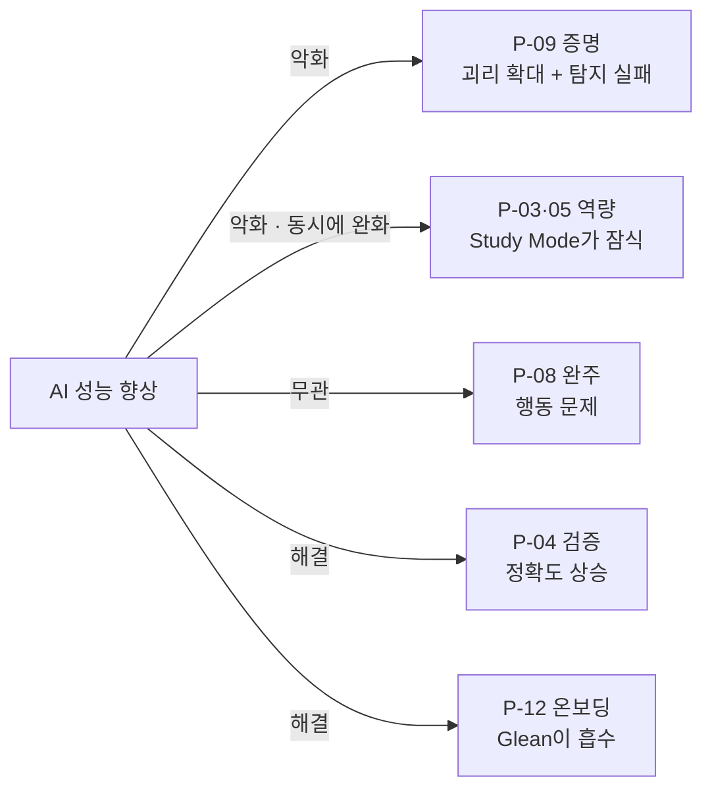

# 부록 A-2 — Pain 14건의 AI 대체 가능성과 사업성 비교

입력: [Pain 인벤토리 14건](./pain-inventory-post-ai-era.md) · 조사 시점: 2026년 8월

**근거 표기** — 🟢 실측 / 🟡 추론 / 🔴 가설 / ⚪ 2차 매체·정성 관찰 · **[불확실]** = 근거를 확보하지 못해 판정을 보류한 항목

---

## 0. 이 문서의 규칙

**추측으로 평가하지 않습니다.** 각 Pain에 대해 **실제로 운영 중인 서비스와 공개된 시장 수치**를 찾아 붙였고, 찾지 못한 항목은 빈칸으로 두지 않고 **[불확실]** 로 표기했습니다.

| 지키는 규칙 | 왜 |
|---|---|
| **"AI가 못 할 것이다"를 근거로 쓰지 않는다** | 실제 제품(Study Mode·Learning Mode·Gemini Notebook)이 무엇을 하는지로만 판단 |
| **"이런 서비스는 없다"를 부재의 증명으로 쓰지 않는다** | 데스크 조사 범위 안에서의 **미발견**으로만 적는다 |
| **시장 규모는 출처의 성격을 함께 적는다** | 공시·공식 발표 🟢 / 집계 매체·시장조사 기관 추정 ⚪ |
| **지불 의사는 "실제로 돈이 흐르는 사례"로만 인정한다** | 설문·의향은 근거로 쓰지 않는다 |

### 0-1. 이번 조사에서 가장 크게 드러난 공백

> **P-03·P-05(역량이 안 남는다)의 지불 의사를 뒷받침하는 실제 사례를 하나도 찾지 못했습니다.** 관련 도구는 전부 무료이거나(Anki·freeCodeCamp·Exercism) 학습 콘텐츠 판매 모델입니다. **"역량이 안 남는 문제 자체에 돈을 낸 사례"는 미발견입니다** → [§7](#7-불확실-항목--근거를-확보하지-못한-것)

---

## 1. 먼저 확정 — 범용 AI가 2026년 현재 실제로 하는 것

판정의 기준선입니다. **회사가 출시했다고 발표한 기능만** 적었습니다.

| 제품 | 확인된 기능 | 가격·규모 | 근거 |
|---|---|---|---|
| **ChatGPT Study Mode** | 직답 대신 단계 분해·유도 질문·힌트 중심 튜터링 | **전 플랜 무료 제공** 🟢 | [Tom's Guide 비교 테스트](https://www.tomsguide.com/ai/i-tested-chatgpt-5-study-mode-vs-claude-learning-mode-with-7-prompts-heres-the-winner) |
| **Claude Learning Mode** | 소크라테스식 접근 — 질문하고 가정에 반박하며 단계 유도 | 2026.08.14 배포 🟢 | [Tom's Guide](https://www.tomsguide.com/ai/claudes-new-learning-modes-take-on-chatgpts-study-mode-heres-what-they-do) |
| **Claude for Education** | 대학 전용판 + Learning Mode. **Northeastern·LSE·Champlain College 전 캠퍼스 계약**, Stanford 2026.06.30부터 | 기관 계약 🟢 | [Investing.com](https://kr.investing.com/news/company-news/article-93CH-1426966) · [Stanford UIT](https://uit.stanford.edu/service/claude) |
| **ChatGPT Edu** | 대학 기관판. **서울대 전 구성원 도입** 🟢 | 기관 계약 | [대학저널](https://m.dhnews.co.kr/news/view/1065573113363004) |
| **Gemini Notebook** | 자료 기반 퀴즈·플래시카드·학습 가이드·마인드맵·오디오 개요 | **무료**, 사용자 3,000만 명 🟢 | [Ch08 §4-3](../08-competitor-value-declaration/case-01-kokjip-lecture-review-prioritizer-competitor-briefing.md#4-3-gemini-notebookgoogle--콕집이-팔려던-것을-이미-공짜로-나눠주고-있다) |

> **주목할 점 — 빅3가 「학습 방식」 자체를 제품화했습니다.** Study Mode·Learning Mode는 단순 답변이 아니라 **"답을 바로 주지 않는 것"** 을 기능으로 팝니다. 이는 [인벤토리 §5 덩어리 A](./pain-inventory-post-ai-era.md#5-살아남은-것을-묶으면-세-덩어리다)(했는데 안 남았다)를 **AI 제공사가 스스로 겨누고 있다**는 뜻입니다 🟢. 덩어리 A의 사업성 판정에서 이 사실이 가장 무겁게 작용합니다.

---

## 2. Pain별 해결 수준 — AI와 기존 서비스가 어디까지 하는가

**해결 수준 표기** — ●● 충분히 해결 / ● 부분 해결 / ○ 거의 미해결

| # | Pain | 범용 AI | 기존 전용 서비스 | 실제 서비스 사례(근거) | **구분** |
|---|---|:-:|:-:|---|---|
| P-01 | 무엇을 배울지 정하기 | **●●** | ●● | Study Mode의 학습 계획 수립 기능 🟢 | **AI로 충분히 해결** |
| P-02 | 적성 판단 | ● | ●● | **잡다(JOBDA)** 역량검사 기반 매칭 플랫폼 🟢 | **기존 서비스로 해결** |
| **P-03** | 이해 착시(내 것이 됐는지 모름) | **●** | ● | **Anki**(미국 의대생 86.2% 사용·66.5% 매일 사용) 🟢 · **Quizlet** 활성 사용자 6,000만+ ⚪ · Gemini Notebook 퀴즈 무료 🟢 · **Study/Learning Mode가 직접 겨냥** 🟢 | **별도 해결책 필요 — 단 AI가 잠식 중** |
| **P-04** | AI 답을 검증할 실력이 없다 | ○ | **[불확실]** | 현직자용 AI 코드리뷰는 존재하나 **초보 대상 검증 보조 서비스는 미발견** | **별도 해결책 필요(불확실)** |
| **P-05** | 손으로 해본 경험 결핍 | ● | ● | **Exercism**(무료·83개 언어·8,600+ 연습·사람 멘토링) 🟢 · **Boot.dev** $49/월 🟢 · **freeCodeCamp** 무료 🟢 · **코드잇** 누적 수강생 51만+ 🟢 | **별도 해결책 필요 — 실습 공급은 이미 포화** |
| P-06 | 쓰면 안 늘고 안 쓰면 못 따라감 | ● | ○ | AI 활용 가이드는 무료 콘텐츠로 범람. **기관 지침은 부재**(교수진 80%) 🟢 | 상위 프레임 — 제품 단위 아님 |
| P-07 | 망각 | ●● | **●●** | 플래시카드 시장 **약 20억 달러·활성 사용자 1억+**, 학생이 매출 55%+ ⚪ | **AI·기존 서비스로 충분히 해결** |
| **P-08** | 혼자서는 안 한다 | ○ | **●●** | **Duolingo** DAU **5,650만**·2025 매출 **10.4억 달러**·DAU/MAU **41.0%**(교육 앱 통상 10~15%) 🟢 · **챌린저스**(화이트큐브)는 **습관 형성에서 뷰티 커머스로 피벗** 🟢 | **별도 해결책 필요 — 그러나 경쟁 최상 + 이탈 사례 존재** |
| **P-09** | 내가 했다는 것을 못 믿게 한다 | **○** | **●**(채용 시점만) | **HackerRank** 표절 탐지 93% 주장·MOSS+행동 레이어 🟢 · **CodeSignal** Suspicion Score + 브라우저 프록터링 🟢 · **Karat** ARR $73.6M(2024)·기업가치 $1.1B 🟢 · **Turnitin AI 탐지는 25개+ 대학이 금지·제한** 🟢 | **별도 해결책 필요 — 가장 크게 미해결** |
| P-10 | 자소서·이력서 문장 | **●●** | ●● | AI 자소서 서비스 범람 🟢 | **AI로 충분히 해결** |
| P-11 | 수료증이 실력을 증명 못 함 | ○ | **●●** | **오픈배지**: 발행 단체 850여·배지 1.4만 종·**누적 160만 개**, 도입 대학 115→**150개** 🟢 | **기존 서비스가 선점** |
| P-12 | 배운 것과 사내 실무의 간격 | ● | **●●** | **Glean** ARR **$300M**(2026.05)·기업가치 **$7.2B**·권한 인식 지식그래프 🟢 | **기존 서비스가 장악 — AI 발전으로 더 해결됨** |
| P-13 | 2026 KDT 자부담 도입 | — | — | 최대 10%·상한 60만 원 🟢 | Pain 아님(시장 조건) |
| P-14 | 기관·강사도 기준을 모른다 | ○ | **○** | **Turnitin AI 탐지 실패가 이 Pain의 미해결을 증명** — ESL 오탐 최대 61%, Turnitin 스스로 ±15%p 변동 인정 🟢 | **별도 해결책 필요 — B2B** |

---

## 3. 구분 결과

### 3-1. AI(또는 기존 서비스)로 충분히 해결되는 문제 — 6건

| Pain | 무엇이 해결했나 | 왜 사업 기회가 아닌가 |
|---|---|---|
| P-01 무엇을 배울지 | Study Mode 학습 계획 | **무료 기본 기능** |
| P-07 망각 | Anki·Quizlet·Gemini Notebook | **시장이 성숙**(20억 달러 규모·사용자 1억+ ⚪)하고 무료 티어가 두껍다 |
| P-10 자소서 문장 | 모든 LLM | **텍스트 생성은 AI의 본령** |
| P-02 적성 판단 | 잡다 등 역량검사 플랫폼 | 기존 사업자 존재 + 지불 의사 미약 |
| P-11 수료증 | 오픈배지(누적 160만 개) | **표준·검증 인프라는 규모 게임** — 신생 진입자 불리 🟡 |
| P-12 온보딩 갭 | Glean(ARR $300M) | **AI가 사내 데이터에 연결될수록 더 해결된다** — 시간이 우리 편이 아니다 |

### 3-2. AI가 있어도 별도 해결책이 필요한 문제 — 5건

| Pain | 왜 AI로 안 되는가(범주) | 남아 있는 정도 |
|---|---|---|
| **P-09** 증명 붕괴 | **㉡ 제3자 신뢰** — 신뢰는 자기 선언으로 성립하지 않는다 | **최대** — 아래 §5-1이 근거 |
| **P-03** 이해 착시 | **㉣ 관측** — AI는 내가 말 안 하면 내가 못 한다는 것을 모른다 | 상 — **단 AI가 스스로 잠식 중** |
| **P-05** 수행 경험 결핍 | **㉢ 행동 + ㉣ 관측** | 상 — 실습 공급은 이미 포화 |
| **P-08** 완주 실패 | **㉢ 행동 유발** | 상 — **단 경쟁 최상** |
| **P-14** 기관 기준 부재 | **㉡ 신뢰**(제도적 판정) | 상 — 탐지 기술이 실패로 실증됨 |
| P-04 AI 답 검증 | ㉣ 관측 | **[불확실]** — 대안 서비스 존재 여부 미확인 |

---

## 4. 사업성 비교 — 8기준

**5건 + P-04**만 비교합니다(§3-1의 6건은 탈락). 각 칸은 §5의 근거를 요약한 것입니다.

| 기준 | **P-09 증명** | **P-03+P-05 역량** | **P-08 완주** | **P-14 기관 기준** | P-04 검증 |
|---|---|---|---|---|---|
| **① 심각도** | **최상** — 실패 시 **취업 자체를 잃는다**. 신입 채용 비중 26% 🟢 | 상 — 수료는 하지만 면접에서 드러남 | 상 — 중도포기 시 훈련비+**자부담 최대 60만 원** 전액 손실 🟢 | 중 — 기관 평판·분쟁 | 중 |
| **② 발생 빈도** | 지원 건마다(취업 시즌 집중) | **최상 — 과제마다·주 단위** | **최상 — 매일** | 학기마다 | 상시 |
| **③ 현재 대안** | HackerRank·CodeSignal 프록터링 · Karat 인터뷰 대행 · Turnitin AI 탐지 · 모의면접(Exponent) · 커밋 로그 공개 | Anki·Quizlet · Exercism·Boot.dev·freeCodeCamp · **Study/Learning Mode** | **Duolingo형 스트릭** · 환급반 · 스터디·디스코드 · **부트캠프 등록 자체** | Turnitin AI 탐지 · 교수 개별 재량 · 정부 가이드라인 준비 중 | **[불확실]** |
| **④ 대안의 한계** | **탐지는 실패 중**(25개+ 대학 금지) · **HackerRank 스스로 "어떤 소스를 썼는지 식별 불가" 명시** 🟢 · **검증이 채용 시점 1회 시험에만 존재** | **AI 제공사가 직접 이 자리에 들어왔다**(Study/Learning Mode 무료) · 실습 플랫폼은 **AI 사용을 막지 못함** **[불확실]** | **강제성은 복제가 쉽다** · 국내 대표 사업자가 **습관 사업을 버리고 피벗** 🟢 | 탐지 정확도가 원리적으로 확보되지 않음(오탐 ESL 최대 61%) 🟢 | — |
| **⑤ 지불 주체** | **기업(채용) + 개인(준비)** — 둘 다 존재 | **개인** — 그리고 2026년부터 자부담으로 지불자화 🟢 | 개인 | **기관(대학·훈련기관)** | 개인 |
| **⑥ 지불 의사(실증)** | **○ 실증** — Karat ARR $73.6M 🟢 · HackerRank·CodeSignal 유료 운영 🟢 · 모의면접 유료 시장 존재 | **✕ 미실증** — 관련 도구가 전부 무료·콘텐츠 판매 모델. **직접 사례 미발견** | **◎ 실증** — Duolingo 매출 10.4억 달러 🟢 · 환급반·부트캠프 | ○ 실증 — Turnitin이 기관 유료 판매 | **[불확실]** |
| **⑦ 경쟁 강도** | **중** — 채용 시점 시험·탐지에 몰려 있고 **학습 기간 누적 관측은 미발견** | **상** — 무료 실습 플랫폼 + **빅3가 직접 진입** | **최상** — Duolingo(DAU/MAU 41%)·챌린저스·열품타·스터디 무한 공급 | 중 — Turnitin 사실상 독점이나 신뢰 붕괴 중 | **[불확실]** |
| **⑧ AI 발전 시 지속 가능성** | **최상 — AI가 좋아질수록 심해진다.** 산출물과 역량의 괴리가 커지고 **탐지는 더 실패한다** 🟡 | **중 — 양방향.** 괴리는 커지지만 **AI가 학습 모드로 스스로 완화한다** 🟡 | **상 — AI와 무관.** 행동 문제는 모델 성능으로 안 풀린다 🟡 | 상 — 생성 품질이 오르면 탐지가 더 어려워짐 🟡 | **하 — AI 정확도가 오르면 문제가 줄어든다** 🟡 |

### 4-1. 8번 기준이 순위를 뒤집습니다

**①~⑦만 보면 P-08(완주)이 가장 좋아 보입니다** — 빈도 최상, 지불 의사 유일하게 ◎. 그런데 ⑦ 경쟁 강도가 최상이고, 무엇보다 ⑧에서 갈립니다.

**시간이 우리 편인 것은 P-09 하나입니다.** P-04·P-12는 AI가 좋아지면 문제 자체가 줄어들고, P-03은 AI 제공사가 스스로 파고들고 있으며, P-08은 AI와 무관하므로 **AI를 만들 이유가 없는 사업**입니다.

---

## 5. 기준별 상세 근거

### 5-1. P-09 — "검증은 이미 산업이다. 단 채용 시점의 1회 시험으로만 존재한다"

**존재하는 것 — 규모가 확인된 산업입니다**

| 사업자 | 무엇을 하는가 | 규모 | 근거 |
|---|---|---|---|
| **HackerRank** | MOSS 기반 코드 유사도(≥10줄에서 75% 이상 시 플래그) + **행동 레이어**(탭 전환·복붙·웹캠 스냅샷·키스트로크 타이밍). 표절 탐지 **93% 정확도** 주장 | 기업 유료 | [HackerRank 자체 발표](https://www.hackerrank.com/writing/plagiarism-detection-accuracy-2025-hackerrank-93-percent-vs-codesignal) 🟢 |
| **CodeSignal** | **Suspicion Score** — 전체 제출물 DB 대조 + 웹 크롤링 + 복붙 텔레메트리. 브라우저 프록터링은 **카메라·마이크·전체화면 공유를 시험 내내 요구** | 기업 유료 | [탐지 방식 정리](https://www.aceround.app/blog/hackerrank-cheating-detection-explained/) ⚪ |
| **Karat** | 기술 면접 자체를 대행(Interviewing-as-a-Service) | **2024 ARR $73.6M** ⚪ · 시리즈C $110M @ **기업가치 $1.1B**, 누적 투자 $248M, 누적 인터뷰 15만 건 🟢 | [Business Wire](https://www.businesswire.com/news/home/20211013005399/en/Karat-Pioneers-the-Interviewing-Cloud-to-Transform-Technical-Hiring-Secures-$110M-in-Series-C-Funding) · [Latka](https://getlatka.com/companies/karat) |
| **Turnitin** | AI 생성 텍스트 탐지 | 기관 유료 | — |

**그런데 세 가지 한계가 실증됐습니다**

| 한계 | 근거 |
|---|---|
| **① 탐지는 무엇을 썼는지 식별하지 못한다** — HackerRank 자체 문서가 *"어떤 소스를 사용했는지 식별하는 것은 불가능하다"* 고 명시. 유사성만 표시하며 **다른 사람 코드인지, AI인지, 독자적으로 비슷하게 쓴 것인지 확정할 수 없다.** 모든 플래그는 자동 탈락이 아니라 **사람 검토로 넘어간다** | [탐지 방식 분석](https://www.aceround.app/blog/hackerrank-cheating-detection-explained/) ⚪ |
| **② 탐지는 기관에서 퇴출되고 있다** — **25개 이상의 주요 대학**(MIT·Yale·NYU·UC Berkeley·Toronto·UBC·Manchester 등)이 AI 탐지 도구를 **금지 또는 대폭 제한**. ESL 작문 오탐률 **최대 61%**, Turnitin 스스로 **±15%p 변동** 인정 | [오탐률 비교](https://gradpilot.com/news/ai-detector-false-positive-rates-compared) · [대학 대응 정리](https://tohuman.io/blog/ai-detection-false-positives-2026) ⚪ |
| **③ 우회 산업이 반대편에 형성됐다** — 프록터링 우회를 상품화한 서비스가 공개적으로 영업 중 | [Interview Coder](https://www.interviewcoder.co/blog/how-companies-detect-ai-cheating-interviews) · [LinkJob](https://www.linkjob.ai/interview-questions/hackerrank-how-to-cheat/) ⚪ |

> **이것이 P-09 판정의 핵심입니다.** 산업의 접근은 두 갈래인데 **둘 다 막혔습니다** — **탐지**(Turnitin·MOSS)는 원리적으로 실패하고 있고, **관측**(프록터링·Karat)은 **채용 시점의 1회 시험**으로만 존재합니다.
>
> **그리고 "학습 기간 전체에 걸친 누적 관측"을 제공하는 사업자를 이번 조사 범위에서 찾지 못했습니다.** 가장 가까운 것은 **WakaTime**(90개+ IDE에서 코딩 시간 자동 추적, GitHub·GitLab 연동)이지만, **생산성 대시보드로 포지셔닝돼 있고 채용 신뢰 자산으로 성립한 사례는 확인되지 않았습니다** **[불확실]**([WakaTime](https://wakatime.com/)).
>
> **미발견은 부재의 증명이 아닙니다.** 다만 **탐지의 실패가 공개적으로 실증됐다는 사실**은, 대안이 **"사후 탐지"에서 "사전 누적 기록"으로 이동할 유인이 시장에 이미 있다**는 것을 뜻합니다 🟡.

### 5-2. P-03+P-05 — "AI 제공사가 직접 이 자리에 들어왔다"

**기존 서비스는 두 층으로 존재합니다**

| 층 | 사업자 | 규모 | 가격 |
|---|---|---|---|
| **정착(암기)** | **Anki** — 미국 의대생 **86.2%가 사용, 66.5%가 매일 사용** ⚪ · **Quizlet** 활성 사용자 **6,000만 명 이상** ⚪ | 플래시카드 시장 **약 20억 달러**, 활성 사용자 **1억 명 이상**, **학생이 매출 55%+** ⚪([시장조사](https://www.archivemarketresearch.com/reports/flashcard-app-558570)) | Anki 무료·오픈소스 |
| **수행(실습)** | **Exercism** — 무료·83개 언어·**8,600+ 연습문제**·**사람 멘토링 무료** 🟢 · **Boot.dev** $49/월 · **freeCodeCamp** 전부 무료(인증까지) | 국내: **코드잇** 2025 상반기 매출 **139억 원**·영업이익 32억·누적 수강생 **51만+** 🟢 · **인프런** 누적 수강생 **1,400만** ⚪ | 무료~$49/월 |

**결정적인 것은 AI 제공사의 진입입니다**

- ChatGPT Study Mode가 **전 플랜 무료로** 직답 대신 단계 유도를 제공합니다 🟢
- Claude Learning Mode가 **소크라테스식으로 가정에 반박**합니다 🟢
- **Claude for Education이 대학과 전 캠퍼스 계약**을 맺고 있고(Northeastern·LSE·Champlain, Stanford 2026.06.30), **ChatGPT Edu는 서울대 전 구성원에 도입**됐습니다 🟢

> **즉 "AI가 대신 해줘서 역량이 안 남는다"는 문제를 AI 제공사가 자기 제품으로 겨누고 있습니다.** 이는 단순 경쟁이 아니라 **원인 제공자가 해결자를 자칭하는 구조**이고, 무료이며 기관 계약까지 들어갔습니다.
>
> **남는 공백은 하나입니다 — 어느 제품도 「학습자가 실제로 무엇을 스스로 할 수 있는지」를 관측하지 않습니다**(㉣). Study Mode는 대화 안에서만 유도하고, Exercism은 문제를 풀렸는지만 보며 **AI로 풀었는지는 확인하지 않습니다** **[불확실 — 각 플랫폼의 AI 사용 정책을 확인하지 못했습니다]**.
>
> **⚠️ 그러나 지불 의사가 전혀 실증되지 않았습니다.** 이 층의 서비스는 무료(Anki·Exercism·freeCodeCamp)이거나 **학습 콘텐츠를 파는 모델**(코드잇·인프런)입니다. **"역량이 안 남는다는 문제 자체에 돈을 낸 사례"는 미발견입니다.**

### 5-3. P-08 — "돈은 확실히 흐르지만, 국내 대표 사업자가 그 사업을 버렸다"

**성공 사례 — 규모가 압도적입니다**

| 지표 | 값 | 근거 |
|---|---|---|
| Duolingo DAU | **5,650만 명**(2025) | ⚪ [Duolingo 통계 집계](https://sqmagazine.co.uk/duolingo-statistics/) |
| Duolingo 매출 | **10.4억 달러**(2025) | ⚪ 동일 |
| **DAU/MAU 비율** | **41.0%**(2026 Q1) — **교육 앱 통상 10~15%** | ⚪ 동일 |
| 7일 스트릭 보유자의 익일 재방문 | 미보유자 대비 **2.4배** | ⚪ 동일 |
| 이탈률 | 47%(2020) → **28%**(2026 핵심 시장) | ⚪ 동일 |

**그런데 국내에서 같은 문제를 정면으로 판 사업자는 이탈했습니다**

| 사업자 | 무슨 일이 있었나 | 근거 |
|---|---|---|
| **챌린저스**(화이트큐브) | 2018년 **"돈을 걸고 습관을 형성하는 플랫폼"** 으로 출발 → **2023년 초 뷰티 득템 앱으로 피벗** 🟢 | [플래텀](https://platum.kr/archives/249818) · [머니투데이](https://www.mt.co.kr/industry/2025/01/08/2025010809383172690) |
| | **2024 매출 150억 원·영업이익 23억 원은 뷰티 커머스(CPA/CPS 광고)로 낸 것** 🟢. 즉 **습관 형성 자체로는 규모를 만들지 못했다** 🟡 | 동일 |
| **열품타** | 2018년 출시, 공부 시간 측정 + 그룹 공유. **사용자 규모·수익 지표를 확인하지 못했습니다** **[불확실]** | [나무위키](https://namu.wiki/w/%EC%97%B4%EC%A0%95%20%ED%92%88%EC%9D%80%20%ED%83%80%EC%9D%B4%EB%A8%B8) ⚪ |

> **두 사실을 함께 읽어야 합니다.** Duolingo는 **습관 설계를 콘텐츠(어학)에 붙여** 10억 달러를 만들었고, 챌린저스는 **습관 설계 단독으로 팔다가 커머스로 옮겼습니다.**
>
> **함의 — P-08은 「독립 사업」이 아니라 「부착 기능」일 가능성이 높습니다** 🟡. 강제성 자체에는 진입장벽이 없고(스터디·챌린지·타이머 무한 공급), **무엇에 붙느냐가 수익을 결정합니다.**

### 5-4. P-14 — "탐지의 실패가 이 Pain의 미해결을 증명한다"

교수진 **약 80%가 소속 기관이 AI 활용 방법을 명확히 제시하지 않았다**고 답했고 🟢, 그 공백을 메우려던 도구(Turnitin AI 탐지)는 **25개 이상 대학에서 금지·제한**됐습니다 🟢. 정부는 **채용 분야 AI 활용 가이드라인**을 준비 중입니다 🟢([그리팅 HR](https://blog.greetinghr.com/recruitment-procedure-act-ai-hiring-2026/)).

> **판정 — 미해결이 확실하고 지불 주체(기관)도 명확하지만, 표적이 학습자가 아닙니다.** 그리고 [Ch08 §4-7](../08-competitor-value-declaration/case-01-kokjip-lecture-review-prioritizer-competitor-briefing.md#4-7-엘리스엘리스그룹--우리가-팔러-갈-기관에-이미-들어가-있다)의 엘리스처럼 **기관 채널을 이미 가진 사업자와 같은 판**에서 싸워야 합니다.

### 5-5. P-12 — "AI가 좋아지면 사라지는 문제"

**Glean**이 권한 인식 지식그래프로 사내 앱(Slack·Drive·Jira)을 인덱싱해 **ARR $300M(2026.05)·기업가치 $7.2B**에 도달했습니다 🟢([TechCrunch](https://techcrunch.com/2026/05/28/gleans-top-line-crosses-300m-as-ai-budget-cutting-becomes-its-major-selling-point/) · [Glean 공식](https://www.glean.com/press/glean-surpasses-200m-in-arr-for-enterprise-ai-doubling-revenue-in-nine-months)).

> **㉠ 권한·폐쇄 데이터라는 AI 공백은 「모델의 한계」가 아니라 「연결의 문제」였습니다.** 연결되면 해결되고, 실제로 연결되고 있습니다. **AI 발전에 따른 지속 가능성이 가장 낮은 항목입니다.**

---

## 6. 종합 — 순위와 판정

| 순위 | Pain | 판정 | 결정적 근거 |
|:-:|---|---|---|
| **1** | **P-09 증명 붕괴** | **최우선 후보** | 심각도 최상 + 지불 의사 실증(Karat ARR $73.6M) + 지불 주체 이중(기업·개인) + **AI가 좋아질수록 심해짐** + **탐지의 실패가 공개 실증** + 학습 기간 누적 관측은 미발견 |
| **2** | **P-03+P-05 역량 미형성** | **조건부 후보** | 빈도 최상이고 ㉣ 관측 공백은 실재. **그러나 ⑥ 지불 의사가 전혀 실증되지 않았고**, **빅3가 무료·기관 계약으로 직접 진입** |
| **3** | **P-08 완주 실패** | **단독 사업으로는 비추천** | 지불 의사는 유일하게 ◎이지만 **경쟁 강도 최상 + 국내 대표 사업자가 피벗으로 이탈**. **부착 기능으로만 유효** |
| 4 | P-14 기관 기준 부재 | 후보(B2B) | 미해결 확실·지불 주체 명확. 단 표적이 기관이고 기존 플랫폼 사업자와 동일 판 |
| 5 | P-04 AI 답 검증 | 보류 | **대안 존재 여부 자체가 [불확실]**, 그리고 **AI 발전이 문제를 줄인다** |
| 6 | P-12 온보딩 | 탈락 | Glean이 ARR $300M로 장악, **AI 발전이 해결 방향** |
| 7 | P-11 자격 · P-01 · P-02 · P-07 · P-10 | 탈락 | 기존 서비스·AI가 충분히 해결 |

### 6-1. 조합이 순위보다 중요합니다

**P-09(증명)과 P-03·P-05(역량)는 같은 데이터 하나로 동시에 겨눌 수 있습니다** — [인벤토리 §5-1](./pain-inventory-post-ai-era.md#5-1-a와-c는-같은-원인의-앞뒤다)이 지목한 **「수행 과정의 기록」** 입니다.

| | 같은 기록이 학습자에게 | 같은 기록이 기업에게 |
|---|---|---|
| 쓰임 | **P-03·P-05** — 내가 무엇을 스스로 할 수 있는지 보여준다 | **P-09** — 이 사람이 실제로 했다는 증거가 된다 |
| 지불 의사 | **✕ 미실증** | **○ 실증**(Karat·HackerRank·모의면접) |

> **이 표가 가장 실무적인 결론입니다.** 두 Pain은 **같은 자산을 요구하지만 지불 의사는 한쪽에만 실증됐습니다.** 따라서 **학습자 가치는 무료로 제공하고 지불은 기업에서 받는 구조**가 이 조사가 지지하는 유일한 형태입니다 🟡 — 이는 [Ch08 §4-2](../08-competitor-value-declaration/case-01-kokjip-lecture-review-prioritizer-competitor-briefing.md#4-2-클로바노트네이버--공짜로-계속-줄-수-있는-이유는-ai-모델이-자기-것이라서다)의 클로바노트 구조와 같습니다.

### 6-2. 이 결론이 무너지는 조건

| 조건 | 무너지는 것 |
|---|---|
| **기업이 "과정 기록"을 채용 판단에 반영하지 않는다** | P-09 전체. **㉡ 신뢰는 기업이 인정해야만 성립** — 우리가 만들 수 없다 🔴 |
| **학습자가 과정 관측을 감시로 느낀다** | P-09·P-03 동시. 수집 자체가 불가능해짐 🔴 |
| **HackerRank·CodeSignal이 누적 관측으로 확장한다** | 경쟁 강도 ⑦이 중 → 최상. 이들은 **이미 기업 고객과 관측 인프라를 둘 다 갖고 있다** 🔴 |
| **빅3가 학습 로그를 제품화한다** | P-03 전체. Claude for Education·ChatGPT Edu가 **이미 기관 계약을 갖고 있다** 🔴 |

**세 번째와 네 번째가 가장 위험합니다.** 우리가 겨눈 공백은 **기존 사업자가 한 걸음 거리에 있는 자리**이고, 이는 [Ch01 §2-5](../01-porters-five-forces/case-01-kokjip-lecture-review-prioritizer.md#2-5-산업-내-경쟁-강도--중-35)가 다글로에 대해 내린 판정 — *"유효기간이 있는 기회"* — 와 같은 구조입니다.

---

## 7. 불확실 항목 — 근거를 확보하지 못한 것

**아래는 판정에 영향을 주지만 이번 조사로 확인되지 않았습니다. 추정으로 메우지 않았습니다.**

| # | 항목 | 왜 중요한가 | 확보 경로 |
|:-:|---|---|---|
| **1** | **P-03·P-05의 지불 의사** — "역량이 안 남는 문제"에 돈을 낸 실제 사례 | **이 문서의 2순위 판정 전체가 여기에 걸려 있다.** 미실증이면 조건부 후보가 아니라 탈락 | 학습자 인터뷰(지출 이력 직접 확인) |
| **2** | **기업이 「과정 기록」에 지불할 의향** | 1순위 판정의 전제. ㉡ 신뢰는 기업이 인정해야 성립 | 채용 담당자 3~5명 실험 → [인벤토리 §7-2](./pain-inventory-post-ai-era.md#7-2-1일짜리-실험-3개) |
| **3** | **학습 기간 누적 관측 서비스의 실제 부재** | 미발견일 뿐 부재의 증명이 아니다 | 해외 스타트업 DB(Tracxn·Crunchbase) 키워드 탐색 |
| **4** | **WakaTime류 도구가 채용 신뢰 자산으로 쓰인 사례** | 있으면 P-09의 경쟁 강도가 올라간다 | 채용 담당자 인터뷰 |
| **5** | **실습 플랫폼(Exercism·Boot.dev·freeCodeCamp)의 AI 사용 정책** | P-05의 대안 한계 판정이 여기서 갈린다 | 각 플랫폼 정책 문서 직접 확인 |
| **6** | **P-04의 대안 서비스 존재 여부** | 5순위 판정을 확정할 수 없다 | 초보자용 코드 검증 도구 탐색 |
| **7** | **열품타의 사용자·수익 규모** | P-08 국내 경쟁 강도 정밀화 | 앱 분석 유료 데이터 |
| **8** | **그렙(프로그래머스)·인프런의 매출** | 국내 평가·학습 시장 규모 | DART 조회 |
| **9** | **모의면접 시장 규모** — 글로벌 1.3억 달러(2026)→2.6억(2035), CAGR 8%는 **시장조사 기관 추정** ⚪이고 국내 규모는 미확인 | P-09의 개인 지불 규모 상한 | 국내 시장조사·플랫폼 공시 |

### 7-1. 2차 자료에 의존한 수치 (신뢰도 주의)

**아래는 회사 공시·공식 발표가 아니라 집계 매체·시장조사 기관의 추정입니다.** 방향은 참고하되 의사결정 근거로 쓰기 전 원본 확인이 필요합니다.

| 수치 | 출처 성격 |
|---|---|
| Duolingo DAU 5,650만 · 매출 10.4억 달러 · DAU/MAU 41.0% | 통계 집계 사이트 ⚪ |
| Karat 2024 ARR $73.6M | 집계 매체(Latka) ⚪ — 단 시리즈C $110M·기업가치 $1.1B는 공식 발표 🟢 |
| Quizlet 활성 사용자 6,000만+ · 플래시카드 시장 20억 달러 | 시장조사·비교 매체 ⚪ |
| Anki 미국 의대생 86.2% 사용 | 비교 매체 인용 ⚪ |
| 인프런 누적 수강생 1,400만 | 2차 매체 ⚪ |
| Turnitin 오탐률·대학 25곳+ 금지 | 종합 매체 ⚪ — 개별 대학 발표 원본은 미확인 |

---

## 8. 출처

### 범용 AI의 학습 제품
- [ChatGPT-5 Study Mode vs Claude Learning Mode 비교 테스트 — Tom's Guide](https://www.tomsguide.com/ai/i-tested-chatgpt-5-study-mode-vs-claude-learning-mode-with-7-prompts-heres-the-winner)
- [Claude's new 'learning modes' — Tom's Guide](https://www.tomsguide.com/ai/claudes-new-learning-modes-take-on-chatgpts-study-mode-heres-what-they-do)
- [앤트로픽, 고등 교육 기관 겨냥 'Claude for Education' 공개 — Investing.com](https://kr.investing.com/news/company-news/article-93CH-1426966)
- [Claude for Education — Stanford University UIT](https://uit.stanford.edu/service/claude)
- [교육을 위한 Claude 소개 — Anthropic(한국어 자료)](https://library.gongbuhow.com/docs/anthropic/news/introducing-claude-for-education/)
- [서울대, 전 구성원 대상 'ChatGPT Edu' 도입 — 대학저널](https://m.dhnews.co.kr/news/view/1065573113363004)

### 증명·검증 산업 (P-09)
- [Plagiarism Detection Accuracy 2025: HackerRank 93% vs CodeSignal — HackerRank 공식](https://www.hackerrank.com/writing/plagiarism-detection-accuracy-2025-hackerrank-93-percent-vs-codesignal)
- [Does HackerRank Detect Cheating? Copy-Paste, Tabs & AI (2026) — AceRound](https://www.aceround.app/blog/hackerrank-cheating-detection-explained/)
- [How Companies Detect AI Cheating in Interviews (2026) — Interview Coder](https://www.interviewcoder.co/blog/how-companies-detect-ai-cheating-interviews)
- [Karat Secures $110M in Series C Funding (기업가치 $1.1B) — Business Wire](https://www.businesswire.com/news/home/20211013005399/en/Karat-Pioneers-the-Interviewing-Cloud-to-Transform-Technical-Hiring-Secures-$110M-in-Series-C-Funding)
- [Karat Revenue 2024: $73.6M ARR — Latka](https://getlatka.com/companies/karat)
- [Karat 2026 Company Profile — Tracxn](https://tracxn.com/d/companies/karat/__R0uEnJ_0WyJ1yY238p217x-5RUmNubDarm_FryntpYI)
- [AI Detector False Positive Rates Compared (2026) — GradPilot](https://gradpilot.com/news/ai-detector-false-positive-rates-compared)
- [AI Detection False Positives: GPTZero & Turnitin Flag Humans — ToHuman](https://tohuman.io/blog/ai-detection-false-positives-2026)
- [Turnitin AI Detection Statistics: Every Published Number (2026) — DetectionDrama](https://detectiondrama.com/turnitin-ai-detection-statistics/)
- [WakaTime — 코딩 시간 자동 추적](https://wakatime.com/) · [WakaTime FAQ](https://wakatime.com/faq)
- [Mock Interviews & Coaching — Exponent](https://www.tryexponent.com/practice) · [Pramp is Now Exponent Practice](https://blog.pramp.com/pramp-is-now-exponent-practice-improved-peer-mock-interviews-d05b9d3abde1)
- [Mock Interview System Market Trend & Growth — Business Research Insights](https://www.businessresearchinsights.com/market-reports/mock-interview-system-market-113195) ⚪

### 정착·실습 서비스 (P-03·P-05·P-07)
- [Flashcard App 시장 분석 및 전망 2025-2033 — Archive Market Research](https://www.archivemarketresearch.com/reports/flashcard-app-558570) ⚪
- [Anki vs Quizlet (2026) 비교 — LearnLog](https://learnlog.app/vs/anki-vs-quizlet/) ⚪
- [Best Flashcard Apps: Anki vs RemNote vs Quizlet — Notigo](https://notigo.ai/blog/best-flashcard-apps-students-anki-remnote-quizlet-2025) ⚪
- [16+ Best online coding courses 2026 (Exercism·Boot.dev 사양) — Boot.dev](https://www.boot.dev/blog/education/best-online-coding-courses-2026)
- [7 Best Boot.dev Alternatives in 2026 — Scrimba](https://scrimba.com/articles/best-boot-dev-alternatives-2026/) ⚪
- [코드잇, 상반기 매출 139억·영업이익 32억 — 네이트 뉴스](https://news.nate.com/view/20250724n08289)
- [코드잇, 1분기 매출 64억 (전년 대비 67% 성장) — 플래텀](https://platum.kr/archives/258973)
- [인프랩(인프런) 기업정보 — THE VC](https://thevc.kr/inflab) · [코드잇 기업정보 — THE VC](https://thevc.kr/codeit)
- [그렙(프로그래머스) 기업정보 — 원티드](https://www.wanted.co.kr/company/1797) · [그렙 채용 페이지](https://grepp.oopy.io/)

### 완주·습관 (P-08)
- [Duolingo Statistics 2026: Users, Revenue, Engagement — SQ Magazine](https://sqmagazine.co.uk/duolingo-statistics/) ⚪
- [Duolingo Statistics 2026 — Axis Intelligence](https://axis-intelligence.com/duolingo-statistics/) ⚪
- [뷰티 앱으로 피봇한 '챌린저스', 2024년 연 매출 150억 원 — 플래텀](https://platum.kr/archives/249818)
- [챌린저스, 뷰티 득템 앱으로 성공적인 피벗 — 머니투데이](https://www.mt.co.kr/industry/2025/01/08/2025010809383172690)
- [화이트큐브, 습관 형성 플랫폼 챌린저스로 2023년 첫 연간 흑자 — 테크42](https://www.tech42.co.kr/%ED%99%94%EC%9D%B4%ED%8A%B8%ED%81%90%EB%B8%8C-%EC%8A%B5%EA%B4%80-%ED%98%95%EC%84%B1-%ED%94%8C%EB%9E%AB%ED%8F%BC-%EC%B1%8C%EB%A6%B0%EC%A0%80%EC%8A%A4%EB%A1%9C-2023%EB%85%84-%EC%B2%AB-%EC%97%B0/)
- [열정 품은 타이머 — 나무위키](https://namu.wiki/w/%EC%97%B4%EC%A0%95%20%ED%92%88%EC%9D%80%20%ED%83%80%EC%9D%B4%EB%A8%B8) ⚪

### 온보딩·자격·기관 (P-12·P-11·P-14)
- [Glean's top line crosses $300M — TechCrunch](https://techcrunch.com/2026/05/28/gleans-top-line-crosses-300m-as-ai-budget-cutting-becomes-its-major-selling-point/)
- [Glean Surpasses $200M in ARR — Glean 공식](https://www.glean.com/press/glean-surpasses-200m-in-arr-for-enterprise-ai-doubling-revenue-in-nine-months)
- [Glean revenue, funding & news — Sacra](https://sacra.com/c/glean/)
- [오픈 배지 도입 대학 115개→150개 — 한국대학신문](https://news.unn.net/news/articleView.html?idxno=545050)
- [오픈배지 서비스 소개 — 한국오픈배지](https://www.kopenbadge.com/badge/serviceintroduction.do)
- [잡다 — 역량검사 기반 매칭 플랫폼](https://www.jobda.im/)
- [2026년 채용절차법, AI 채용은 어디까지 규제될까? — 그리팅 HR](https://blog.greetinghr.com/recruitment-procedure-act-ai-hiring-2026/)
- [2026 AI 채용 전략(역량 검증에 AI 전적 신뢰 15%) — 그리팅 HR](https://blog.greetinghr.com/2026-ai-recruitment-trends/)

### 부록 A 내부 참조
- [부록 A 개요](./README.md) · [방법론](./methodology-zero-based-pain-discovery.md) · [Pain 인벤토리 14건](./pain-inventory-post-ai-era.md)
