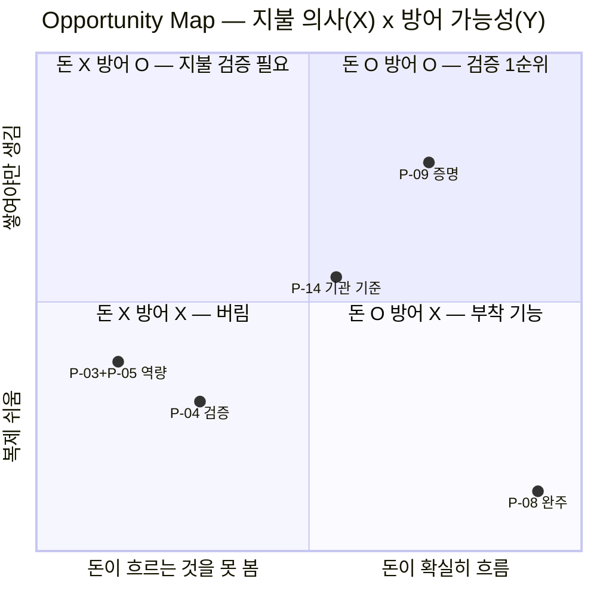
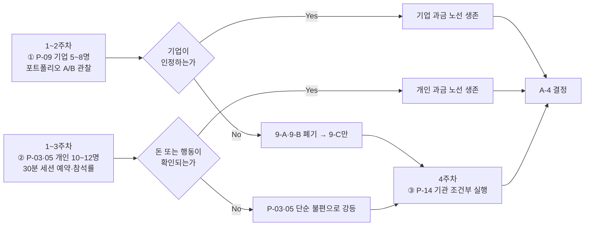
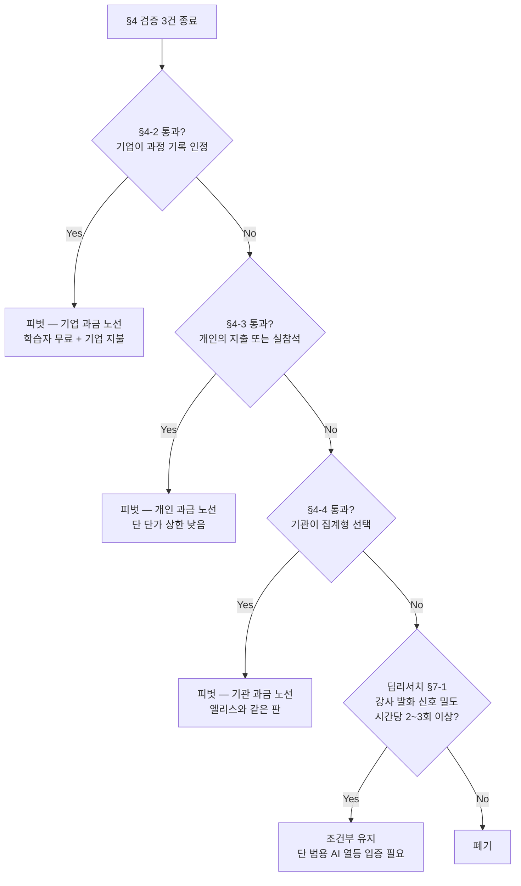

# 부록 A-3 — Opportunity Map · 검증 과제 · 콕집 존폐 판단 기준

입력: [A-1 Pain 인벤토리 14건](./pain-inventory-post-ai-era.md) · [A-2 AI 대체 가능성과 사업성 비교](./ai-substitutability-and-viability.md)
작성 시점: 2026년 8월

**근거 표기** — 🟢 실측 / 🟡 추론 / 🔴 가설 / ⚪ 2차 매체 · **[불확실]** = 근거 미확보

---

## 0. 이 문서가 하는 일과 하지 않는 일

| 한다 | 하지 않는다 |
|---|---|
| Pain을 **5축으로 비교**해 순위를 매긴다 | **무엇을 만들지 결정하지 않는다** |
| 검증 가치가 높은 문제를 **2~3개 고른다** | 고른 문제를 "우리 아이템"으로 확정하지 않는다 |
| 각 문제에 **가능한 서비스 방향을 복수로** 늘어놓는다 | **한 방향을 선택하지 않는다** — §3의 모든 안은 **가설이며 검증 대상**이다 |
| **누구에게 무엇을 묻고 무엇을 관찰할지**를 정한다 | 인터뷰 결과를 미리 상상하지 않는다 |
| 콕집 유지·피벗·폐기의 **판단 기준**을 못박는다 | **지금 존폐를 결정하지 않는다** → [§5-5](#5-5-지금-결정하면-안-되는-이유) |

> **§3의 서비스 방향은 결론이 아니라 「검증 대상을 구체화하기 위한 도구」입니다.** 방향이 없으면 무엇을 물어봐야 할지 정할 수 없어서 적은 것이고, **검증 전에 어느 하나를 고르면 A-1 §1의 격리 절차가 무의미해집니다.**

---

## 1. Opportunity Map

### 1-1. 채점 기준 (앵커)

**점수는 절대값이 아니라 순위 비교용입니다.** 각 축의 5점이 무엇인지 먼저 못박습니다.

| 축 | 1점 | 5점 |
|---|---|---|
| **① 심각도** | 불편하지만 잃는 것 없음 | **실패 시 취업·수료 자체를 잃음** |
| **② 지불 의사** | 돈이 흐른 사례를 못 찾음 | **동일 문제에 대규모 매출이 실증됨** |
| **③ AI 대체 가능성** *(낮을수록 좋음)* | 원리적으로 AI가 못 함 | **이미 무료 기본 기능** |
| **④ 경쟁 강도** *(낮을수록 좋음)* | 사업자 미발견 | **대형 사업자 밀집 + 무료 공급** |
| **⑤ 방어 가능성** | 하루면 복제됨 | **시간·데이터·관계가 쌓여야만 생김** |

### 1-2. 점수표

**확신도** = 이 점수를 뒷받침하는 근거의 등급. 확신도가 낮은 점수는 **검증 전까지 의사결정에 쓸 수 없습니다.**

| Pain | ①심각도 | ②지불의사 | ③AI대체 *(낮을수록 good)* | ④경쟁강도 *(낮을수록 good)* | ⑤방어 | **확신도** |
|---|:-:|:-:|:-:|:-:|:-:|---|
| **P-09 증명 붕괴** | **5** 🟢 | **4** 🟢 | **1** 🟡 | 3 🟡 | **4** 🟡 | **②는 "채용 검증"에 대한 실증이고 "과정 기록"에 대한 것이 아님** ⚠ |
| **P-03+P-05 역량 미형성** | 4 🟢 | **1** 🔴 | 4 🟢 | 4 🟢 | 2 🟡 | **②가 0건 실증 — 이 문서 최대 공백** ⚠ |
| **P-08 완주 실패** | 4 🟢 | **5** 🟢 | 1 🟡 | **5** 🟢 | **1** 🟢 | 높음 — 성공·실패 사례 양쪽 확보 |
| **P-14 기관 기준 부재** | 3 🟡 | 3 🟢 | 2 🟡 | 3 🟡 | 3 🟡 | 중간 |
| P-04 AI 답 검증 | 3 🟡 | — | 4 🟡 | — | — | **[불확실] — 대안 존재 여부 미확인** |

**점수의 근거 (A-2에서 승계)**

| 칸 | 근거 |
|---|---|
| P-09 ①=5 | 실패 시 취업 자체를 잃음. 신입 채용 비중 **26%**(경력 74%) 🟢 |
| P-09 ②=4 | Karat **ARR $73.6M**·기업가치 $1.1B, HackerRank·CodeSignal 유료 운영 🟢 — **단 이는 「채용 시점 시험」에 대한 지불** |
| P-09 ③=1 | **㉡ 제3자 신뢰는 자기 선언으로 성립하지 않음.** 탐지는 오히려 실패 중(25개+ 대학 금지, ESL 오탐 최대 61%) 🟢 |
| P-09 ④=3 | 채용 시점에는 밀집, **학습 기간 누적 관측은 미발견**(부재 증명 아님) 🟡 |
| P-09 ⑤=4 | 시간에 걸쳐서만 쌓이는 관측 데이터 + 기업 신뢰의 양면성 🟡. **단 HackerRank·CodeSignal이 기업 고객과 관측 인프라를 이미 둘 다 보유** 🔴 |
| P-03·05 ②=1 | 관련 도구가 전부 무료(Anki·Exercism·freeCodeCamp)이거나 콘텐츠 판매 모델. **문제 자체에 지불한 사례 미발견** |
| P-03·05 ③=4 | Study Mode **전 플랜 무료**, Claude Learning Mode, Claude for Education·ChatGPT Edu **기관 계약** 🟢 |
| P-08 ②=5 | Duolingo **DAU 5,650만·매출 10.4억 달러** ⚪ + 환급반·부트캠프 |
| P-08 ④⑤ | **챌린저스가 습관 형성을 버리고 뷰티 커머스로 피벗** 🟢 — 복제 용이성의 직접 실증 |

### 1-3. 두 축으로 본 지도

### 1-4. 이 지도가 말하는 세 가지

**① 돈이 흐르는 곳과 이길 수 있는 곳이 어긋나 있습니다.**
P-08은 지불 의사 5점인데 방어 가능성 1점입니다. **챌린저스가 습관 사업을 버린 것**이 그 1점의 실증입니다 🟢. 반대로 P-03·P-05는 방어 가능성이 그럭저럭이지만 **돈이 흐른 증거가 0건**입니다.

**② 유일하게 두 축이 동시에 오른쪽 위인 것은 P-09입니다.** 그런데 그 4점(지불 의사)은 **「채용 시점 시험」에 대한 실증**이지 **「과정 기록」에 대한 실증이 아닙니다.** 이 구분이 이 문서 전체에서 가장 중요한 단서이며, [§4-2](#4-2-검증-과제-1--p-09-기업이-과정-기록을-인정하는가)의 검증이 정확히 그 간극을 겨눕니다.

**③ 세 Pain이 같은 자산 하나를 요구합니다.**

| 같은 자산 | 학습자에게(P-03·05) | 기업에게(P-09) | 기관에게(P-14) |
|---|---|---|---|
| **수행 과정의 관측 기록** | 내가 스스로 뭘 할 수 있는지 | 이 사람이 실제로 했다는 증거 | 우리 수강생이 AI를 어떻게 썼는지 |
| 지불 의사 | **✕ 미실증** | **○ 실증(간접)** | ○ 실증(Turnitin 기관 판매) |

> **하나의 자산 · 세 개의 지불 주체 — 이것이 이 지도의 구조적 발견입니다.** 어느 하나를 고르는 문제가 아니라, **같은 데이터로 세 문 중 어느 문이 열리는지를 순서대로 두드리는 문제**입니다 🟡.

---

## 2. 검증 대상 선정 — 2+1

**선정 기준은 "가장 유망한 것"이 아니라 「불확실성 × 의사결정 영향」입니다.** 이미 답이 나온 것은 검증할 가치가 없습니다.

| Pain | 불확실성 | 결과가 바꾸는 의사결정 | **검증 가치** |
|---|---|---|---|
| **P-03+P-05** | **최상** — 지불 실증 0건 | 통과하면 개인 과금 노선이 열리고, **실패하면 즉시 탈락** | **★★★** |
| **P-09** | 상 — "채용 검증"과 "과정 기록"의 간극이 미확인 | 통과하면 **기업 과금 노선**이 열림. 이 문서 1순위의 전제 | **★★★** |
| **P-14** | 중 | 위 둘이 막혔을 때의 **대안 경로**. 같은 자산을 기관에 파는 길 | **★★**(조건부) |
| P-08 | **낮음** — 답이 이미 나옴(돈은 흐르나 못 이김) | 검증해도 판단이 안 바뀜 | ★ |
| P-04·P-12·P-11 | — | A-2에서 탈락·보류 | — |

> **선정 — ① P-09(기업) · ② P-03+P-05(개인) · ③ P-14(기관, 조건부).**
> P-08은 **독립 검증 대상에서 제외**하되, ①②의 제품 안에 **부착 기능으로 넣었을 때 유지율이 오르는지**만 딸려서 관찰합니다([§4-5](#4-5-p-08은-따로-검증하지-않고-딸려서-관찰한다)).

---

## 3. 문제별 가능한 서비스 방향 — **전부 가설입니다**

> ⚠️ **아래 8개 방향 중 어느 것도 선택된 것이 아닙니다.** 검증 질문을 구체화하기 위해 늘어놓은 것이며, **§4의 검증이 끝나기 전에는 하나로 좁히지 않습니다.** 방향마다 **"이 방향이 틀렸다는 신호"** 를 함께 적어 둔 이유가 이것입니다.

### 3-1. P-09 (증명) — 세 방향

| 안 | 방향 | 지불 주체 | 이 방향이 틀렸다는 신호 |
|---|---|---|---|
| **9-A** | **학습 기간 누적 관측 → 채용용 과정 증빙.** 학습 중 수행 궤적(막힌 지점·직접 작성 비율·재시도)을 쌓아 지원 시 함께 제출 | **기업** | 채용 담당자가 *"어차피 그것도 조작 가능하지 않나"* 라고 답하면 즉시 붕괴 |
| **9-B** | **기존 검증 사업자에 데이터 공급**(B2B2B). HackerRank·Karat·잡다 등이 이미 가진 기업 채널에 학습 기간 신호를 얹음 | 검증 사업자 | 그들이 *"우리가 직접 만들면 된다"* 고 답하면 성립 불가 — **실제로 인프라를 이미 보유** 🔴 |
| **9-C** | **개인용 「과정 회상」 도구.** 면접 전에 내가 그때 무엇을 왜 그렇게 했는지 되짚어 설명할 수 있게 함 | **개인** | 모의면접(Exponent 등)으로 대체된다고 답하면 차별성 없음 |

### 3-2. P-03+P-05 (역량) — 두 방향

| 안 | 방향 | 지불 주체 | 이 방향이 틀렸다는 신호 |
|---|---|---|---|
| **3-A** | **「AI 없이 할 수 있는가」 주기 확인.** 2주 전 AI로 넘어간 지점을 골라 도움 없이 재현하게 하고 결과를 기록 | 개인 | *"굳이 다시 하고 싶지 않다"* 가 다수면 실행률이 안 나옴. **불쾌한 진실을 파는 사업의 한계** |
| **3-B** | **「학습 부채」 대시보드.** AI 의존 구간을 누적 표시해 갚아야 할 목록으로 보여줌 | 개인 | Study Mode·Learning Mode가 대화 안에서 같은 것을 무료로 하면 소멸 🟢 |

### 3-3. P-14 (기관 기준) — 두 방향

| 안 | 방향 | 지불 주체 | 이 방향이 틀렸다는 신호 |
|---|---|---|---|
| **14-A** | **기관용 AI 사용 실태 리포트.** 탐지가 아니라 **집계** — 어느 구간에서 학습자들이 AI에 의존했는지 | 훈련기관·대학 | 기관이 *"우리는 탐지를 원한다"* 고 답하면 방향이 어긋남. 그리고 **탐지는 실패가 실증됨** 🟢 |
| **14-B** | **AI로 안 풀리는 과제 설계 지원** | 기관·강사 | 강사가 *"과제는 내가 만든다"* 고 답하면 수요 없음 |

> **⚠️ 14-A에는 [Ch08 §6-4](../08-competitor-value-declaration/case-01-kokjip-lecture-review-prioritizer-competitor-briefing.md#6-4-뺄셈-선언에는-치명적인-부작용이-있다--비어-있는-데는-이유가-있을-수-있다)와 같은 함정이 있습니다.** 학습자의 AI 의존을 기관에 보고하는 순간 **학습자에게는 감시 도구**가 됩니다. 집계 단위를 개인이 아니라 **구간·과목**으로 두지 않으면 3-A·9-A의 데이터 수집 자체가 불가능해집니다 🟡.

---

## 4. 검증 과제

### 4-1. 공통 원칙 — 무엇을 묻지 않는가

| 금지 | 대신 |
|---|---|
| *"이런 서비스가 있으면 쓰시겠어요?"* | *"지난번에 그 문제로 **실제로 무엇을 하셨나요?**"* |
| *"얼마면 내시겠어요?"* | *"그것 때문에 **돈을 쓴 적 있나요? 무엇에 얼마요?**"* |
| 기능 설명 후 반응 수집 | **행동 요청 후 실행률 측정**(결제 시도·데이터 제출 동의·일정 예약) |

**그리고 검증 전에 임계값을 먼저 적습니다.** 사후에 정하면 어떤 결과든 통과로 해석됩니다.

### 4-2. 검증 과제 ① — P-09: 기업이 「과정 기록」을 인정하는가

**가장 먼저 해야 합니다.** 이 답이 부정이면 9-A·9-B·9-C가 동시에 죽습니다.

| 항목 | 내용 |
|---|---|
| **대상** | 개발·데이터 직군 **채용 담당자 또는 실무 면접관 5~8명**. 조건 — **최근 6개월 내 신입·주니어 서류 심사 경험** |
| **묻는 것(행동)** | ㉠ *"AI로 만든 것 같다는 이유로 실제로 탈락시킨 적이 있나요? **그때 무엇을 보고 판단하셨나요?**"* ㉡ *"그 판단을 위해 **추가로 요구한 자료가 있나요?**"* ㉢ *"프록터링·코딩테스트 외에 **돈을 쓰고 있는 검증 수단이 있나요?**"* |
| **관찰할 행동** | 실제 지원자 포트폴리오 2건을 준비해 **하나에만 과정 기록(작업 시점·재시도 횟수·직접 작성 비율)을 첨부**하고, **어느 쪽을 먼저 열어보는지·서류 통과 판단이 바뀌는지**를 관찰 |
| **통과 임계값** | **8명 중 5명 이상**이 판단이 바뀐다고 답하고, **그중 2명 이상이 "그 자료를 요구할 의향"을 구체적 절차로 말할 것** |
| **탈락 신호** | *"조작 가능하지 않나"* 가 과반이면 **9-A·9-B 폐기**. 이 경우 남는 것은 9-C(개인용)뿐 |
| **기간·비용** | 2주 · 사례비 실비 |

**추가로 반드시 물어야 할 것** — **9-B의 생사가 걸린 질문**입니다.

> *"HackerRank·CodeSignal 같은 곳이 학습 기간 데이터까지 준다면 별도 업체 것을 쓰실 건가요?"*
> → *"기존 업체 것을 쓰겠다"* 가 다수면 **9-B는 성립하지 않습니다.** A-2 §6-2가 지목한 **가장 위험한 조건**입니다 🔴.

### 4-3. 검증 과제 ② — P-03+P-05: 개인이 「역량이 안 남는 문제」에 돈을 쓴 적이 있는가

**A-2에서 지불 실증이 0건이었던 항목입니다. 이 검증은 살리는 것이 아니라 죽이기 위한 것입니다.**

| 항목 | 내용 |
|---|---|
| **대상** | **KDT·부트캠프 수강 중 또는 수료 6개월 이내 10~12명.** 조건 — **AI 도구를 주 3회 이상 학습에 사용** |
| **묻는 것(행동)** | ㉠ *"AI로 넘어간 개념을 나중에 다시 붙잡으려고 **실제로 무엇을 하셨나요?**"* ㉡ *"그 때문에 **강의를 다시 듣거나 자료를 다시 산 적이 있나요? 몇 번, 얼마요?**"* ㉢ *"AI를 일부러 안 쓰기로 한 적 있나요? **얼마나 갔나요? 왜 깨졌나요?**"* |
| **관찰할 행동** | **소액 결제 의향이 아니라 실행을 본다.** *"2주 전 개념을 AI 없이 다시 해보는 30분 세션"* 을 제안하고 **일정을 실제로 잡는 비율**을 측정. 그다음 **당일 실제 참석률**을 측정 |
| **통과 임계값** | ㉠ 재수강·재구매 등 **금전 지출 경험자가 12명 중 4명 이상**, **또는** ㉡ 세션 **예약률 50% 이상 + 실참석률 60% 이상** |
| **탈락 신호** | 지출 경험 1~2명 + 실참석률 30% 미만 → **P-03·P-05는 「단순 불편」으로 강등**하고 3-A·3-B 폐기 |
| **왜 참석률인가** | *"실력을 기르고 싶다"* 는 거의 100% 동의하는 문장입니다. **말과 행동이 갈리는 유일한 지점이 「불편한 30분을 실제로 앉는가」입니다** 🟡 |
| **기간·비용** | 3주 · 사례비 |

### 4-4. 검증 과제 ③ — P-14: 기관이 원하는 것이 「집계」인가 「탐지」인가 *(조건부)*

**①②가 모두 막혔을 때만 실행합니다.**

| 항목 | 내용 |
|---|---|
| **대상** | **KDT 훈련기관 운영·교육 담당자 4~6명** |
| **묻는 것(행동)** | ㉠ *"수강생의 AI 사용 때문에 **실제로 커리큘럼이나 평가를 바꾼 적이 있나요?**"* ㉡ *"AI 탐지 도구를 **검토하거나 구매한 적이 있나요? 결과는요?**"* ㉢ *"수료생 취업률 방어를 위해 **작년에 추가로 지출한 항목**은 무엇인가요?"* |
| **관찰할 행동** | **집계 리포트 목업**과 **탐지 리포트 목업**을 나란히 보여주고 **어느 쪽을 더 오래 보는지·어느 쪽을 사내 공유하겠다고 하는지** |
| **통과 임계값** | 6명 중 **4명 이상이 집계형을 선택**하고, **2명 이상이 파일럿 참여에 서면 동의** |
| **탈락 신호** | 탐지형 선호가 과반 → **14-A 폐기**(탐지는 실패가 실증된 길 🟢) |

### 4-5. P-08은 따로 검증하지 않고 딸려서 관찰한다

**독립 사업으로는 A-2에서 이미 판정이 났습니다**(경쟁 최상 + 챌린저스 피벗). 다만 **부착 가치**는 ①②의 실험 안에서 공짜로 측정됩니다.

> 4-3의 30분 세션을 **혼자 하는 조건**과 **2~3인이 같은 시간에 함께 하는 조건**으로 나눠 배정하고, **참석률 차이**를 봅니다. 차이가 크면 P-08은 **독립 제품이 아니라 ①②의 필수 부착 기능**임이 확인됩니다 🟡.

### 4-6. 4주 일정과 선행 관계

**①과 ②는 병렬로 돌립니다.** 서로의 결과에 의존하지 않고, ③만 조건부입니다.

---

## 5. 콕집 유지 · 피벗 · 폐기 판단

### 5-1. 세 갈래의 정의를 먼저 못박는다

| 갈래 | 정의 |
|---|---|
| **유지** | 관측 대상 = **강사 발화**, 가치 = **강의 복습 우선순위**를 그대로 두고 개선 |
| **피벗** | 관측 대상을 **학습자 수행**으로 옮김. 문제·고객·수익원이 함께 바뀜 |
| **폐기** | 이 문제 영역에서 나감 |

### 5-2. 각 갈래가 성립하는 조건

| 갈래 | **성립 조건 (전부 충족해야 함)** | 현재 상태 |
|---|---|---|
| **유지** | ㉠ 강사 발화의 실무 중요도 신호가 **시간당 2~3회 이상**([딥리서치 §7-1](../04-tam-sam-som-market-segment-map/deep-research/kokjip-research.md#7-미해소-항목)) ㉡ **훈련기관이 그 자체로 지불** ㉢ 범용 AI에 같은 질문을 했을 때 **명확히 열등한 답이 나옴** | **㉢이 이미 부정적** — 실무 관행 지식은 사전학습에 있음(딥리서치 §4-1 후보 ② 방어력 0) 🟢. ㉠㉡은 미검증 🔴 |
| **피벗** | ㉠ §4-2 또는 §4-3 **중 하나 이상 통과** ㉡ 관측 데이터 수집이 **감시로 인식되지 않음** ㉢ 승계 가능한 자산이 **의미 있는 수준** | ㉠㉡ 미검증 🔴 · ㉢은 아래 §5-3에서 계산 |
| **폐기** | §4-2·§4-3·§4-4 **셋 다 탈락** | 미검증 |

### 5-3. 피벗 시 무엇이 넘어가고 무엇이 안 넘어가는가

**"피벗"이라는 말이 실제보다 연속성을 크게 들리게 합니다. 자산을 하나씩 세어 봅니다.**

| 자산 | 승계 | 근거 |
|---|:-:|---|
| KDT·부트캠프 도메인 지식 (Ch01~07 전체) | **○** | 표적 세그먼트가 그대로 유지됨 |
| 훈련기관 접점·판매 채널 이해 | **○** | P-14 경로에서 그대로 쓰임 |
| 시장 규모·페르소나·JTBD 산출물 | **△** | 문제가 바뀌면 Pain 목록은 재작성 필요 |
| 음성 전사·처리 파이프라인 | **△** | 관측 대상이 음성이 아니라 **수행 로그**로 바뀜 |
| **강사 opt-in 동의 체계**(딥리서치 §5-4) | **✕** | 강사를 녹음하지 않으면 불필요 |
| **강의 중요도 판정 로직** | **✕** | 판정 대상이 강의가 아니라 사람이 됨 |
| **"복습 우선순위"라는 가치 선언** | **✕** | Ch08 §6-8의 A안·B안이 A-1 §6-3에서 부정됨 |

> **승계율이 낮습니다.** 넘어가는 것은 **도메인 지식과 채널 이해**이고, **제품의 핵심 자산은 거의 넘어가지 않습니다.** 즉 이것은 **기능 조정이 아니라 사실상 재창업에 가깝고**, 그렇다면 **"피벗이니까 이어서 한다"가 아니라 "새로 시작해도 이 문제를 고를 것인가"로 물어야 합니다** 🟡.

### 5-4. 결정 트리

### 5-5. 지금 결정하면 안 되는 이유

**세 갈래 중 어느 것도 지금 판단할 근거가 없습니다.**

| 갈래 | 지금 결정하면 무엇을 근거로 하는가 |
|---|---|
| **유지** | 딥리서치 §7-1(신호 밀도)이 **여전히 🔴**. **1일짜리 실험인데 아직 안 했습니다** |
| **피벗** | §4-2·§4-3이 **전부 미실행**. 특히 P-03·P-05는 **지불 실증 0건**이라 지금 피벗하면 **근거 없는 이동** |
| **폐기** | 위 둘을 안 해보고 폐기하면 **1일·2주짜리 실험을 아낀 대가로 방향 전체를 버리는 것** |

> **가장 값싼 순서는 이것입니다** — **딥리서치 §7-1의 1일 실험(강사 발화 신호 밀도)을 먼저 하고**, 그 결과와 무관하게 **§4-2·§4-3을 병렬로 2~3주 돌립니다.** 셋 다 합쳐 **한 달 안에 끝나고**, 그 뒤에는 §5-4의 트리가 **기계적으로** 답을 냅니다.
>
> **현재 시점에서 말할 수 있는 것은 이것뿐입니다** — **「유지」의 성립 조건 ㉢(범용 AI 대비 명확한 열등 답변)이 이미 부정적입니다** 🟢. 따라서 **가장 열려 있는 것은 피벗이고, 가장 닫혀 있는 것은 유지입니다.** 다만 [§5-3](#5-3-피벗-시-무엇이-넘어가고-무엇이-안-넘어가는가)이 보여주듯 그 피벗은 **승계 자산이 적은 피벗**입니다.

---

## 6. 이 문서의 한계

- **§1의 점수는 A-2의 근거를 순위로 압축한 것이며, 확신도가 낮은 칸이 결론을 좌우합니다.** 특히 P-09의 지불 의사 4점은 **"채용 검증"에 대한 실증**이지 **"과정 기록"에 대한 실증이 아닙니다.**
- **§3의 8개 방향은 전부 미검증 가설입니다.** 어느 것도 선택되지 않았고, §4의 결과 없이 하나를 고르면 안 됩니다.
- **§4의 임계값은 판단 근거가 아니라 사전 약속입니다.** 표본이 5~12명이라 통계적 유의성이 없으며, **"확실히 아니다"를 걸러내는 용도**이지 "확실히 맞다"를 증명하지 못합니다.
- **§5-3의 승계 판정은 이 문서의 추론(🟡)입니다.** 실제 코드·계약·데이터를 열어 확인한 것이 아닙니다.
- **관측 데이터의 개인정보·동의 요건을 전혀 다루지 않았습니다** — [A-1 §7-3 7번](./pain-inventory-post-ai-era.md#7-3-미해소-항목). 9-A·3-A·14-A 모두 여기서 막힐 수 있습니다 🔴.
