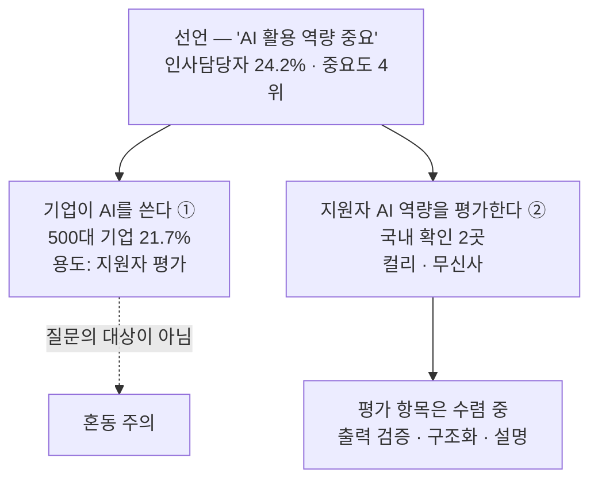

# 부록 A-4 — P-09 가설 재검토: 한국 채용시장은 「의심」이 아니라 「활용 역량」으로 가고 있는가

재검토 대상: [A-1 P-09](./pain-inventory-post-ai-era.md#p-09--내가-만든-것을-ai가-만들었다고-의심받는다-1순위-결과-최대) — *"내가 만든 것을 AI가 만들었다고 의심받는다"*
조사 시점: 2026년 8월 · **국내 자료 우선**

**근거 표기** — 🟢 실측(공시·공식 발표·조사기관 원자료) / 🟡 추론 / 🔴 가설 / ⚪ 2차 매체 · **[불확실]**

---

## 0. 결론 먼저

| 질문 | 답 |
|---|---|
| **기업이 「AI를 잘 활용해 문제를 푸는 역량」을 실제로 평가하는가?** | **일부는 그렇다. 그러나 매우 소수다.** 국내에서 **실제 전형에 반영한 것이 확인된 곳은 컬리·무신사 2곳** 🟢 |
| **A-1의 P-09 프레임은 맞았는가?** | **절반만 맞았다.** 「의심받는다」는 방향은 **시장의 진행 방향과 역행**한다. 시장은 의심에서 **허용 + 활용 과정 평가**로 가고 있다 🟢 |
| **그럼 P-09를 버려야 하는가?** | **아니다. 목적어를 바꿔야 한다.** *"AI를 안 썼다는 결백 증명"* → **"AI를 이렇게 썼다는 협업 기록"** → [§6](#6-p-09-가설-재정의) |
| **가장 위험한 것은?** | **선언과 실제의 간극이 매우 크다.** 중요하다는 응답은 24.2%인데 실제 평가 반영은 국내 2곳이다. **시장이 아직 안 열렸을 위험** → [§5](#5-선언과-실제의-간극) |

---

## 1. 먼저 용어를 나눈다 — "AI 채용"은 네 가지 다른 것을 가리킨다

**이 구분을 하지 않으면 자료를 읽을 수 없습니다.** 국내 기사에서 "AI 채용"·"AI 역량검사"라는 말이 서로 다른 네 가지에 붙어 있고, **그중 이 질문의 대상은 ②뿐입니다.**

| # | 가리키는 것 | 주체 | 국내 확산 정도 |
|:-:|---|---|---|
| ① | **AI가 지원자를 평가한다** — AI 역량검사·AI 면접·서류 자동 검토 | 기업이 AI를 씀 | **넓다** — 500대 기업 중 21.7% 🟢 |
| ② | **지원자의 AI 활용 역량을 평가한다** | 지원자가 AI를 씀 | **좁다** — 확인된 국내 사례 2곳 🟢 |
| ③ | **전형 중 AI 사용을 허용/금지하는 규칙** | 규칙 | **대부분 금지** ⚪ |
| ④ | **AI 사용을 부정행위로 탐지한다** | 통제 | 글로벌 플랫폼 중심([A-2 §5-1](./ai-substitutability-and-viability.md#5-1-p-09--검증은-이미-산업이다-단-채용-시점의-1회-시험으로만-존재한다)) |

> **⚠️ 한국어 용어가 함정을 만듭니다.** **「AI 역량검사」는 ①입니다** — 지원자의 AI 활용 역량을 재는 것이 아니라, **AI가 지원자의 성향·인지 특성을 재는 것**입니다. 현대차그룹의 AI 역량검사는 마이다스인 솔루션으로 *자기소개 → 기본질문 → 성향파악 → 상황대처 → 보상선호 → 전략게임 → 심층질문* 순으로 진행되며, **긍정성·적극성·전략성·성실성 4대 역량과 36개 세부 역량**을 측정합니다 ⚪. **AI와 무관한 인적성 검사를 AI가 대신 하는 것**입니다.
>
> 업계에서도 혼란이 지적됐습니다 — *「AI 역량검사는 면접이 아니다」* ([THE AI 기자수첩](https://www.newstheai.com/news/articleView.html?idxno=4260)) ⚪.
>
> **A-1의 P-09는 ④(탐지)를 전제로 쓰였습니다.** 이번 재검토가 겨누는 것은 ②이고, 둘은 방향이 반대입니다.

---

## 2. 선언 층위 — 무엇이 「중요하다」고 말해지는가

| 조사 | 표본 | 결과 |
|---|---|---|
| **원티드랩 2026 채용 트렌드 서베이** 🟢 | **국내 기업 153곳 인사담당자** | 2026년 가장 중요한 역량(복수 응답): **직무 전문성 64.7%** > 팀워크·협업 37.9% > 조직 기여 의지 28.1% > **AI·데이터 활용 역량 24.2% (4위)** |
| 동 조사 | 동일 | 가장 적극 채용할 연차 — **4~7년차 49.7%**, 1~3년차 19.6%, 8~11년차 17.6%, **신입 12.4%** |
| 2026 채용 키워드 ⚪ | — | *"직무 전문성 + 검증된 경험 + AI 활용 역량"* |
| AI 역량 인재 수요 ⚪ | — | 전년 대비 **230% 증가** — **2차 매체 인용이며 원자료 미확인** **[불확실]** |

> **선언 층위에서도 AI 활용 역량은 1위가 아닙니다.** 24.2%로 **4위**이고, 1위(직무 전문성 64.7%)와 **2.7배 차이**입니다 🟢. *"AI 활용이 가장 중요해졌다"* 는 기사 제목과 실제 응답 순위가 다릅니다.
>
> **그리고 신입 채용 의향은 12.4%로 최하위**입니다. **P-09의 표적(신입·주니어)이 서 있는 문 자체가 가장 좁습니다** 🟢 — [A-1 §1-4](./pain-inventory-post-ai-era.md#1-4-동시에-출구취업가-좁아졌다)의 *"경력 74% vs 신입 26%"* 와 같은 방향입니다.

---

## 3. 실제 평가 층위 — 전형에 실제로 반영된 사례

**여기서부터가 선언이 아닙니다.** 전형 단계·평가 항목·인원이 공개된 것만 셌습니다.

### 3-1. 국내 — 확인된 것은 2곳

| 기업 | 무엇을 했나 | 평가 대상 | 근거 |
|---|---|---|---|
| **무신사** | **'AI 네이티브' 신입 개발자 66명 선발.** 1차 코딩테스트 **1,700여 명** → 2차 **AI 도구 활용 능력 검증 400명** → 3차 오프라인 면접 **100명**. *"단순 코딩 실력을 넘어 **AI 도구를 얼마나 능숙하게 활용해 실무 문제를 해결하는지**"* 를 중점 평가 🟢 | **Codex 활용 능력**, 일반 코테와 **병행** | [무신사 뉴스룸 보도자료](https://newsroom.musinsa.com/newsroom-menu/2026-0330) ※ 페이지 직접 열람은 리다이렉트로 실패, 보도자료 요약 기준 |
| **컬리** | **코딩테스트에 생성형 AI 챗봇 사용 허용** 🟢 | **AI 활용 과정**을 평가 | [잡코리아 분석](https://www.jobkorea.co.kr/goodjob/tip/view?News_No=22546) · [사용자 제보](https://www.threads.com/@aicoffeechat/post/DKtCKwwzsD_/) ⚪ |

> **무신사 사례가 이 재검토에서 가장 무거운 근거입니다.** 지원자 1,700명 → 400명 → 100명 → 66명이라는 **단계별 인원이 공개된 실제 전형**이고, **2차 전형 자체가 AI 도구 활용 능력 검증**입니다. 선언이 아니라 **집행된 평가**입니다 🟢.
>
> 다만 **"AI 활용 능력을 어떤 기준으로 채점했는가"** 는 공개되지 않았습니다 **[불확실]**.

### 3-2. 해외 — 평가 항목이 수렴하고 있다

| 기업 | 방식 | **평가 포인트** |
|---|---|---|
| **구글** | Gemini 활용 코드 이해 평가 **파일럿**, 일반 코테와 **별도** | **코드 이해 · 프롬프트 구성 · 출력 검증** |
| **메타** | CoderPad 내 AI 채팅 제공, 일반 코테와 병행하며 **일부 대체** | **코드베이스 파악 · 버그 수정 · 검증** |
| **쇼피파이** | 개인 IDE와 AI 도구 **자유 사용**, **일반 코테 없이 AI 코딩 2회만** | **문제 구조화 · 설계 판단 · 테스트 작성** |
| **캔바** | Copilot·Cursor·Claude 등 **자유 사용 기대**, 일반 코테 **대체** | **요구사항 구조화 · 코드 검증 · 완성도** |

*출처: [잡코리아 「AI 활용 코딩 테스트 분석(2026)」](https://www.jobkorea.co.kr/goodjob/tip/view?News_No=22546)* ⚪

### 3-3. 평가 항목을 겹쳐 보면 하나로 모인다

네 기업이 쓰는 단어가 다르지만 **겹치는 축은 하나입니다.**

| 반복되는 평가 항목 | 등장 |
|---|---|
| **출력 검증 / 코드 검증** | 구글 · 메타 · 캔바 · 컬리 |
| **요구사항·문제 구조화** | 쇼피파이 · 캔바 |
| **코드 이해 / 코드베이스 파악** | 구글 · 메타 |
| 설계 판단 · 테스트 작성 | 쇼피파이 |
| 프롬프트 구성 | 구글 |

> **시장이 실제로 사는 역량은 「AI를 빨리 쓰는 것」이 아니라 「AI 출력을 검증하고 설명하는 것」입니다** 🟢. 잡코리아의 정리도 같습니다 — *"AI 없이 얼마나 빨리 짜는가"* 보다 *"AI가 만든 코드를 이해하고 판단할 수 있는가"*.
>
> **이 발견이 A-2의 판정 하나를 뒤집습니다** → [§7](#7-이-재검토가-a-2a-3에-되돌리는-수정)

---

## 4. 반대 증거 — 국내 다수는 여전히 금지한다

**한쪽 방향만 보면 안 됩니다.**

| 관측 | 근거 |
|---|---|
| **국내 대부분 기업은 코딩테스트에서 AI 사용을 여전히 금지**하며, **네이버·카카오도 금지** ⚪ | [코딩 테스트 — 나무위키](https://namu.wiki/w/%EC%BD%94%EB%94%A9%20%ED%85%8C%EC%8A%A4%ED%8A%B8) |
| 삼성·SK하이닉스·현대차 등 **2026 상반기 대기업 공채는 알고리즘 코딩테스트 체제 유지**. **AI 허용을 명시한 공식 발표는 확인되지 않음** **[불확실 — 부재의 증명 아님]** | [2026 상반기 대기업 공채 정리](https://www.codetree.ai/blog/2026-%EC%83%81%EB%B0%98%EA%B8%B0-%EB%8C%80%EA%B8%B0%EC%97%85-%EA%B3%B5%EC%B1%84-%EB%AA%A8%EC%9D%8C-%EC%82%BC%EC%84%B1%C2%B7%ED%98%84%EB%8C%80%EC%B0%A8%C2%B7sk%ED%95%98%EC%9D%B4%EB%8B%89%EC%8A%A4/) ⚪ |
| 명시가 없으면 **리크루터에게 직접 물어보라**는 것이 실무 조언 — **정책이 표준화되지 않았다는 뜻** ⚪ | 동일 |
| **SK하이닉스는 채용에서 학력 제한을 전면 철폐** — 실력 중심 개편이지만 **AI 활용 역량 평가와는 다른 축** 🟢 | [SK하이닉스 뉴스룸](https://news.skhynix.co.kr/ai-talent-recruit-2026_yb/) |

> **즉 국내는 「금지가 기본, 허용이 예외」입니다.** 컬리·무신사는 **선도 사례이지 표준이 아닙니다** 🟡.

---

## 5. 선언과 실제의 간극

**같은 축을 세 층위로 세어 봅니다.**

| 층위 | 측정값 | 성격 |
|---|---|---|
| **선언** — "AI 활용 역량이 중요하다" | 인사담당자 **24.2%**(153곳 중, **4위**) 🟢 | 의견 |
| **기업이 AI를 쓴다(①)** | 500대 기업 중 **21.7%**(86곳)가 채용에 AI 도구 사용. 용도는 **AI 기반 인적성·역량검사 69.8%**, 지원서류 검토 46.5%, AI 면접 결과 활용 46.5% 🟢 | **지원자를 평가하는 도구** — 질문의 대상 아님 |
| **지원자의 AI 역량을 실제 평가한다(②)** | **국내 확인 2곳**(컬리·무신사) 🟢 | **집행된 평가** |

> **간극의 크기 자체가 이 재검토의 결론입니다.** 방향은 확실히 ②로 가고 있지만(무신사가 66명을 실제로 그렇게 뽑았고, 해외 4곳의 평가 항목이 수렴하고 있음), **국내 시장의 두께는 아직 2곳입니다.**
>
> **이는 두 가지로 읽힙니다** — ㉠ **선점 기회**(아직 아무도 도구를 안 만들었다) ㉡ **타이밍 위험**(시장이 아직 안 열려 매출이 안 난다). **어느 쪽인지는 이 문서가 답할 수 없고, [§8](#8-검증-과제-수정)의 질문이 답합니다** 🟡.

---

## 6. P-09 가설 재정의

### 6-1. 무엇이 틀렸는가

| | **기존 P-09 (A-1)** | **수정 P-09** |
|---|---|---|
| 문제 정의 | *"내가 만든 것을 **AI가 만들었다고 의심받는다**"* | *"**AI와 함께 일한 방식**을 보여줄 방법이 없다"* |
| 요구하는 증거 | **"AI를 안 썼다"** = 결백 증명 | **"AI를 이렇게 썼다"** = 협업 기록 |
| 시장 방향과의 관계 | **역행** — 시장은 허용으로 가고 있다 🟢 | **일치** — 구글·메타·캔바·컬리·무신사의 평가 항목과 같은 축 🟢 |
| 데이터 수집 난이도 | **높음** — 결백은 원리적으로 증명하기 어렵다 | **낮음** — **학습자가 감출 이유가 없다** |
| 감시 프레임 위험 | **높음** — "너를 감시해 부정을 잡는다" | **낮음** — "네가 잘한 것을 보여준다" 🟡 |

### 6-2. 이 수정이 실무적으로 바꾸는 것

**[A-3 §6](./opportunity-map-and-validation-plan.md#6-이-문서의-한계)이 최대 위험으로 지목한 항목이 크게 줄어듭니다.**

> *"수행 과정을 관측한다는 것은 학습자를 감시한다는 뜻이 될 수 있고, 그렇게 느껴지는 순간 아무도 쓰지 않습니다."*

**탐지 프레임에서는 이 위험이 구조적입니다** — 잡으려고 보는 것이기 때문입니다. **협업 기록 프레임에서는 성격이 반대입니다** — 프롬프트를 어떻게 짰고, 어디서 AI 출력을 의심했고, 무엇을 고쳤는지는 **지원자가 자랑하고 싶은 자산**입니다 🟡.

**그리고 무엇을 기록해야 하는지도 바뀝니다.**

| | 탐지 프레임이 요구한 것 | 협업 프레임이 요구하는 것 |
|---|---|---|
| 기록 대상 | 타이핑 속도·붙여넣기·탭 전환 (=**부정 신호**) | **프롬프트 · AI 출력에 대한 수정 이력 · 검증 시도 · 폐기한 답** |
| 학습자의 태도 | 회피 | **제출 유인** |
| 채용 측 사용법 | 걸러내기 | **판별하기**(잘 쓴 사람 vs 받아쓴 사람) |

### 6-3. 그러나 두 가지 유보

**① 이건 여전히 「기업이 인정해야만」 성립합니다.** ㉡ 제3자 신뢰라는 조건은 변하지 않았습니다. 협업 기록이라도 **기업이 안 보면 가치가 0**입니다.

**② 무신사·컬리는 「자체 전형 안에서」 이미 관측하고 있습니다.** 2차 전형에서 AI 도구 활용 능력을 직접 검증한다는 것은, **그 시점의 관측을 회사가 직접 한다는 뜻**입니다 🟢. 외부 기록이 필요한 이유를 따로 만들어야 합니다 — **A-2가 지적한 *"학습 기간 전체의 누적"* 이 그 답이 될 수 있으나 미검증입니다** 🔴.

---

## 7. 이 재검토가 A-2·A-3에 되돌리는 수정

### 7-1. P-04의 판정을 수정해야 합니다 ★

**A-2는 P-04(AI 답이 맞는지 검증할 실력이 없다)를 5순위로 내리고 이유를 이렇게 적었습니다.**

> *"⑧ AI 발전 시 지속 가능성 = 하 — AI 정확도가 오르면 문제가 줄어든다"*

**이번 조사는 정반대 신호를 보여줍니다.** 채용 시장이 실제로 평가하는 항목이 **출력 검증 · 코드 이해 · 설명 능력**으로 수렴하고 있습니다(§3-3) 🟢.

| | A-2의 관점 | 이번 재검토의 관점 |
|---|---|---|
| P-04를 무엇으로 봤나 | **학습자의 불편** — "내가 못 믿겠다" | **역량의 정의** — "검증할 줄 아는 게 실력이다" |
| AI 정확도가 오르면 | 불편이 준다 → 문제 소멸 | **구별이 어려워진다 → 판별 수요는 오히려 는다** 🟡 |

> **판정 수정 — P-04는 「불편」으로는 약하지만 「역량 신호」로는 강합니다.** 독립 Pain으로 다시 세우는 것이 아니라 **P-09의 평가 항목**으로 흡수하는 것이 맞습니다 🟡. 즉 *"이 사람이 AI 출력을 검증할 줄 아는가"* 는 **학습자에게 파는 기능이 아니라 기업에게 파는 신호**입니다.

### 7-2. A-3 §3의 서비스 방향 수정

| 안 | 기존 | 수정 |
|---|---|---|
| **9-A** | 학습 기간 누적 관측 → **"직접 했다"는 증빙** | **"AI와 이렇게 일했다"는 협업 기록** — 프롬프트·수정 이력·검증 시도·폐기한 답 |
| **9-C** | 개인용 과정 회상 도구 | **유지**, 단 회상 대상이 *"내가 왜 그렇게 했나"* 에서 *"AI 출력의 무엇을 의심하고 고쳤나"* 로 이동 |
| **신규 9-D** | — | **"AI 활용 전형" 대비·연습 도구.** 컬리·무신사형 2차 전형이 늘어난다는 가정 위의 안. **⚠️ 시장 두께가 국내 2곳이라 가장 위험한 안** 🔴 |

### 7-3. Opportunity Map 점수 조정

| Pain | 축 | 기존 | 수정 | 근거 |
|---|---|:-:|:-:|---|
| **P-09** | AI 대체 가능성 *(낮을수록 good)* | 1 | **1 유지** | ㉡ 신뢰 조건 불변 |
| **P-09** | 경쟁 강도 *(낮을수록 good)* | 3 | **2로 하향** | 탐지 사업자(HackerRank·Turnitin)는 **협업 기록 축과 방향이 반대**라 직접 경쟁이 아님 🟡 |
| **P-09** | 지불 의사 | 4 | **3으로 하향** ⚠ | 기존 4점의 근거(Karat·프록터링)는 **탐지·시험 시장**이다. **협업 기록에 대한 지불 실증은 여전히 0건** |
| **P-04** | — | 5순위 보류 | **P-09에 흡수** | §7-1 |

> **지불 의사 4 → 3 하향이 이 재검토에서 가장 중요한 정정입니다.** A-3 §1-2가 이미 *"②는 「채용 검증」에 대한 실증이고 「과정 기록」에 대한 것이 아님"* 이라고 단서를 달았는데, **이번 조사로 그 단서가 더 강해졌습니다** — 시장이 탐지에서 멀어지고 있다면, **탐지 시장의 매출은 우리 지불 의사 근거로 쓸 수 없습니다** 🟡.

---

## 8. 검증 과제 수정

**[A-3 §4-2](./opportunity-map-and-validation-plan.md#4-2-검증-과제-1--p-09-기업이-과정-기록을-인정하는가)의 질문을 통째로 바꿔야 합니다.** 기존 질문은 탐지 프레임 위에 있었습니다.

| | 기존(탐지 프레임) | **수정(협업 프레임)** |
|---|---|---|
| 핵심 질문 | *"AI로 만든 것 같다는 이유로 탈락시킨 적 있나요?"* | *"**AI를 잘 쓴다는 이유로 합격시킨 적 있나요? 무엇을 보고 판단하셨나요?**"* |
| A/B 관찰물 | 과정 기록을 첨부한 포트폴리오 vs 미첨부 | **프롬프트·수정 이력이 담긴 작업 로그**를 첨부한 쪽 vs 결과물만 있는 쪽 |
| 추가 질문 | — | *"컬리·무신사처럼 **전형에 AI 사용을 허용할 계획이 있나요? 언제요?**"* ← **시장 타이밍 판정** |
| 추가 질문 | — | *"AI 활용 능력을 본다면 **무엇을 채점하시겠어요?**"* ← §3-3의 수렴 축이 국내에서도 같은지 확인 |

**대상도 바꿉니다** — 기존 5~8명에 **컬리·무신사처럼 이미 AI 허용 전형을 운영한 곳 최소 1~2명을 반드시 포함**합니다. **집행 경험자와 미경험자의 답이 갈리는지가 시장 타이밍의 직접 신호**입니다 🟡.

**임계값 수정**

| 판정 | 조건 |
|---|---|
| **통과** | 8명 중 **4명 이상**이 *"AI 활용 방식을 보고 싶다"* 고 답하고, **2명 이상이 12개월 내 전형 도입 계획**을 구체적으로 말할 것 |
| **보류(타이밍 이름)** | 관심은 있으나 **도입 계획이 0명** → 시장이 아직 안 열림. **2~3분기 뒤 재조사** |
| **탈락** | *"AI를 어떻게 썼는지는 관심 없다. 결과물만 본다"* 가 과반 |

> **「보류」 판정을 별도로 만든 이유** — 기존 A-3의 임계값은 통과/탈락 이분법이었는데, 이번 조사가 **제3의 상태(방향은 맞으나 시장이 얇다)** 를 드러냈습니다. **이 상태를 탈락으로 처리하면 선점 기회를 버리고, 통과로 처리하면 매출 없는 제품을 만듭니다** 🟡.

---

## 9. 불확실 항목

| # | 항목 | 상태 |
|:-:|---|---|
| 1 | **무신사 2차 전형의 채점 기준** — "AI 도구 활용 능력"을 무엇으로 점수화했는가 | 미공개 **[불확실]** |
| 2 | **무신사 보도자료 원문** — 뉴스룸 URL이 리다이렉트되어 **원문 직접 열람 실패**. 수치는 보도자료 요약 기준 | 재확인 필요 |
| 3 | **컬리 AI 허용의 적용 범위** — 전 직군인지 특정 전형인지 | **[불확실]** |
| 4 | **삼성·SK·네이버·카카오의 공식 AI 정책** — 금지라는 서술은 2차 매체 기준이며 **공식 발표를 확인하지 못함** | **[불확실 — 부재의 증명 아님]** |
| 5 | **"AI 역량 인재 수요 230% 증가"** 의 원자료 | 2차 매체 인용 **[불확실]** |
| 6 | 국내 채용공고에서 **"AI 활용"이 우대·필수로 명시된 비율의 시계열** — 플랫폼 집계를 확보하지 못함 | **[불확실]** |
| 7 | **협업 기록에 대한 기업의 지불 의사** — 이번 조사로도 실증 0건 | 🔴 → §8이 겨냥 |

> **2번과 4번이 이 문서의 두 기둥을 각각 흔듭니다.** 2번은 §3-1(방향이 바뀌고 있다)의 근거이고, 4번은 §4(그러나 다수는 금지)의 근거입니다. **둘 다 원문 확인이 필요합니다.**

---

## 10. 출처

### 실제 평가 사례 (②)
- [무신사, 'AI 네이티브' 신입 개발자 66명 선발 — 무신사 뉴스룸](https://newsroom.musinsa.com/newsroom-menu/2026-0330) *(리다이렉트로 원문 직접 열람 실패)*
- [구글부터 컬리까지, 확산되는 AI 활용 코딩 테스트 현황 — 잡코리아](https://www.jobkorea.co.kr/goodjob/tip/view?News_No=22546)
- [AI 활용 코딩 테스트 분석(2026) — 잡코리아](https://www.jobkorea.co.kr/recruit/careers/articles/ai-enabled-coding-interview)
- [컬리가 코딩테스트에 AI 사용을 허가하였습니다 — Threads 제보](https://www.threads.com/@aicoffeechat/post/DKtCKwwzsD_/) ⚪
- [코딩 테스트할 때 AI를 써도 된다고요? — 브런치](https://brunch.co.kr/@gocoder/423) ⚪

### 선언 층위 (조사·서베이)
- [원티드랩 "2026년 채용 핵심은 중간 경력직·AI 활용 역량" — 전자신문](https://www.etnews.com/20251208000036)
- [2026 채용 트렌드…'4~7년차 경력직'·'AI 활용 인재' 더 뽑는다 — ZDNet Korea](https://zdnet.co.kr/view/?no=20251208160526)
- [원티드랩, 채용 트렌드 리포트 공개 — AI타임스](https://www.aitimes.com/news/articleView.html?idxno=204611)
- ["경력보다 스킬" AI 시대 2026년 인재 선발 기준의 변화](https://www.speak.com/ko/b2b-blog/ai-era-skills-based-hiring-2026) ⚪

### 기업이 AI를 쓰는 층위 (①) — 질문의 대상이 아님
- [500대 기업 87% "인사업무에 AI 활용"…22% 직원 채용에 사용](https://v.daum.net/v/biItjmx2jO) *(고용노동부·한국고용정보원 2025년 기업 채용동향조사, 396곳 응답)*
- [기업 87%, 인사업무에 AI 활용…노동부 '채용분야 AI 활용 지침' 연내 마련 — 시사저널](https://www.sisajournal.com/news/articleView.html?idxno=354713)
- ["학벌보단 일머리"…게임·성향으로 인재 찾아내는 AI, 어떻게? — 머니투데이](https://www.mt.co.kr/tech/2025/09/09/2025090210363994645)
- [[기자수첩] AI 역량검사는 면접이 아니다 — THE AI](https://www.newstheai.com/news/articleView.html?idxno=4260)
- [2026년 채용절차법, AI 채용은 어디까지 규제될까? — 그리팅 HR](https://blog.greetinghr.com/recruitment-procedure-act-ai-hiring-2026/)

### 반대 증거 (③ 금지 쪽)
- [코딩 테스트 — 나무위키](https://namu.wiki/w/%EC%BD%94%EB%94%A9%20%ED%85%8C%EC%8A%A4%ED%8A%B8) ⚪
- [2026 상반기 대기업 공채 모음: 삼성·현대차·SK하이닉스 — 코드트리](https://www.codetree.ai/blog/2026-%EC%83%81%EB%B0%98%EA%B8%B0-%EB%8C%80%EA%B8%B0%EC%97%85-%EA%B3%B5%EC%B1%84-%EB%AA%A8%EC%9D%8C-%EC%82%BC%EC%84%B1%C2%B7%ED%98%84%EB%8C%80%EC%B0%A8%C2%B7sk%ED%95%98%EC%9D%B4%EB%8B%89%EC%8A%A4/) ⚪
- ["AI 시대에 걸맞는 실력 중심 채용 혁신" SK하이닉스, 학력 제한 전면 철폐 — SK하이닉스 뉴스룸](https://news.skhynix.co.kr/ai-talent-recruit-2026_yb/)
- [현대차, 대규모 채용 시작…'직무'와 'AI'로 요약되는 2026 상반기 채용 시장 — 데일리팝](https://www.dailypop.kr/news/articleView.html?idxno=97271) ⚪

### 부록 A 내부 참조
- [A-1 Pain 인벤토리](./pain-inventory-post-ai-era.md) · [A-2 AI 대체 가능성·사업성](./ai-substitutability-and-viability.md) · [A-3 Opportunity Map·검증 과제](./opportunity-map-and-validation-plan.md)
