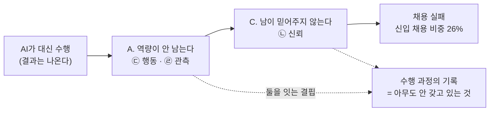

# 부록 A — 범용 AI 시대의 학습자 Pain 인벤토리 14건

탐색 시점: 2026년 8월 · 적용 방법론: [제로베이스 Pain 탐색](./methodology-zero-based-pain-discovery.md)

**근거 표기** — 🟢 실측 / 🟡 추론 / 🔴 가설 / **⚪ 2차 매체·정성 관찰**

> **먼저 읽어야 하는 것** — 이 문서는 **데스크 리서치만으로 작성됐고 1차 인터뷰가 0건**입니다. Pain의 **존재**는 공개 자료로 확인했으나 **강도·빈도·지불 의사는 확인하지 못했습니다.** 따라서 이 문서의 판정은 **"무엇을 인터뷰해야 하는가"의 우선순위**이지 "무엇을 만들어야 하는가"의 결론이 아닙니다 → [§7](#7-다음-단계--이-부록이-답하지-못한-것)
>
> **격리 선언** — [방법론 §1](./methodology-zero-based-pain-discovery.md#1-1단계--기존-가설-격리)에 따라 "복습"·"강의 녹음"·"국비 수강생"을 출발점으로 쓰지 않았습니다. 기존 제품과의 관계는 **[§6에서만](#6-기존-콕집-가설과의-관계--어디서-만나고-어디서-갈라지는가)** 다루며, 연결되지 않는 Pain도 삭제하지 않았습니다.

---

## 1. 이 탐색이 전제하는 2026년의 지형

문제를 찾기 전에 **무엇이 이미 해결됐는지**를 확정합니다. 이것이 [범용 AI 필터](./methodology-zero-based-pain-discovery.md#3-3단계--범용-ai-필터--이번-탐색의-핵심-관문)의 기준선입니다.

### 1-1. 범용 AI가 이미 무료로 하는 것

| 기능 | 상태 | 근거 |
|---|---|---|
| 지식 설명·요약·검색·리서치 | 전 플랜 기본 | — |
| **학습 계획 수립·소크라테스식 튜터링** | **ChatGPT Study Mode는 모든 플랜에 무료 제공** 🟢 · **Claude Learning Mode 2026.08.14 배포** 🟢 | [Tom's Guide 비교 테스트](https://www.tomsguide.com/ai/i-tested-chatgpt-5-study-mode-vs-claude-learning-mode-with-7-prompts-heres-the-winner) · [Claude Learning Mode](https://www.tomsguide.com/ai/claudes-new-learning-modes-take-on-chatgpts-study-mode-heres-what-they-do) |
| 퀴즈·플래시카드·학습 가이드·마인드맵 생성 | Gemini Notebook 무료 | [Ch08 §4-3](../08-competitor-value-declaration/case-01-kokjip-lecture-review-prioritizer-competitor-briefing.md#4-3-gemini-notebookgoogle--콕집이-팔려던-것을-이미-공짜로-나눠주고-있다) 🟢 |
| 실무 관행·현직자 기준 지식 | **사전학습으로 이미 보유** | [딥리서치 §4-1 후보 ②](../04-tam-sam-som-market-segment-map/deep-research/kokjip-research.md#4-1-판정-근거-후보-4개의-비교) — 방어력 0 판정 🟢 |

> **이 표가 이 부록의 출발점입니다.** 위 네 줄에 들어가는 Pain은 **아무리 아파도 사업 기회가 아닙니다.**

### 1-2. 학습자는 이미 전면적으로 AI를 쓰고 있다

| 지표 | 값 | 근거 |
|---|---|---|
| 대학생 AI 학습 활용률 | **91.7%** (한국직업능력연구원, 대학생 726명) 🟢 | [한국대학신문](https://news.unn.net/news/articleView.html?idxno=589375) |
| 향후 지속 이용 의향 | **84.2%** 🟢 | 동일 |
| 시험·과제 평가에 AI 사용 | **약 90%** (Nature 설문, 대학생 1,000명 이상) 🟢 | [교수신문](https://www.kyosu.net/news/articleView.html?idxno=147129) |
| AI 생성 텍스트를 편집 후 사용 / 원본 그대로 사용 | **25% / 8%** 🟢 | 동일 |
| 소속 기관이 AI 활용 방법을 명확히 제시하지 않았다고 답한 교수진 | **약 80%** 🟢 | 동일 |

### 1-3. 그런데 학습 성과는 반대로 움직인다

| 발견 | 내용 | 근거 |
|---|---|---|
| **인지 부채(cognitive debt)** | 참가자 54명 EEG 측정, 4개월 4세션. **LLM 사용군이 뇌 연결성 최약**이며 신경·언어·점수 전 층위에서 열위. **방금 쓴 에세이를 인용조차 못 함** 🟢 | [arXiv 2506.08872](https://arxiv.org/abs/2506.08872) · [MIT Media Lab](https://www.media.mit.edu/projects/your-brain-on-chatgpt/overview/) |
| **지연된 성적 하락** | 칭화대 사례 — AI 사용 학생이 **수업 직후에는 높은 점수**, **2~3주 후 오히려 더 낮아짐** 🟢 | [교수신문](https://www.kyosu.net/news/articleView.html?idxno=147129) |
| **학습자 본인의 자각** | *"AI를 통해 얻어낸 정보가 내 것이 되었는지는 모르겠다"* · *"내가 성장하는 것이 아닌 단순히 눈앞의 장애물을 넘을 뿐"* 🟢 | [한국대학신문](https://news.unn.net/news/articleView.html?idxno=589375) |
| **저작성 착각** | 프롬프트를 설계·수정했으므로 결과물 기여도가 **60~80%는 된다고 인식** 🟢 | 동일 |

### 1-4. 동시에 출구(취업)가 좁아졌다

| 지표 | 값 | 근거 |
|---|---|---|
| 국내 SW 인력 증가 | 64만 3,000명, 전년 대비 **+0.2%(1,400명)** — 직전 연도 +7.3%에서 급락 🟢 | [한국경제](https://www.hankyung.com/article/2026081275871) |
| 내년 충원 계획 구성 | 총 2만 300명 중 **경력 1만 5,000명(74%) vs 신입 5,300명(26%)** 🟢 | 동일 |
| "신규 채용으로 인력 확보" 응답 | 2022년 **62.6%** → 지난해 **24.0%** 🟢 | 동일 |
| "기존 인력 재배치" 응답 | **75.6% → 90.7%** 🟢 | 동일 |
| 훈련 비용 구조 변화 | **2026.01 이후 개강 KDT에 자부담 최대 10%(상한 60만 원) 도입** 🟢 | [부경대 KDT 안내](https://icms.pknu.ac.kr/kdt/6579?action=view&no=9979434) |

> **네 개 절을 겹치면 2026년 학습자의 좌표가 나옵니다.** AI로 **더 쉽게 통과하지만 덜 남고**(1-2·1-3), 그 상태로 **좁아진 문 앞에 서며**(1-4), 이제 **자기 돈까지 냅니다**(1-4). 이 세 압력이 만나는 곳이 Pain의 밀집 구역입니다 🟡.

---

## 2. Pain 인벤토리 — 14건 한눈에

| # | 단계 | Pain | 현재 해결 방식 | Q4 비용 | Q5 AI필터 | **판정** |
|---|---|---|---|:-:|:-:|---|
| P-01 | ① 진입 | 무엇을 배워야 하는지 시장이 계속 바뀐다 | ChatGPT에 물어봄 · 유튜브 로드맵 | △ | **✕** | AI가 먹은 시장 |
| P-02 | ① 진입 | 내가 이 길에 맞는 사람인지 모른다 | 무료 강의 맛보기 · 역량검사 | △ | △ | 단순 불편 |
| **P-03** | ② 이해 | **AI가 설명하면 이해된 것 같은데 내 것이 됐는지 모른다** | 없음 · 다시 물어봄 · 불안해서 재수강 | ○ | **○ ㉣㉢** | **기회 후보 1순위** |
| **P-04** | ② 이해 | AI 답이 맞는지 검증할 실력이 아직 없다 | 돌려보고 되면 넘어감 · 커뮤니티 질문 | ○ | **○ ㉣** | **기회 후보 3순위** |
| **P-05** | ③ 수행 | **손으로 해본 경험이 없다 — AI가 대신 해버려서** | 의식적으로 AI 끊기(자기규율) · 방치 | ○ | **○ ㉢㉣** | **기회 후보 2순위** |
| **P-06** | ③ 수행 | 쓰면 실력이 안 늘고, 안 쓰면 마감을 못 지킨다 | 그때그때 타협 · 기준 없음 | ○ | **○ ㉢** | **상위 프레임**(P-03·05의 원인) |
| P-07 | ④ 정착 | 배운 것을 3주 뒤에 못 쓴다 | Anki · Quizlet · Gemini Notebook 플래시카드 | ○ | **✕** | AI·기존 도구가 먹은 시장 |
| **P-08** | ④ 정착 | **혼자 하면 결국 안 하게 된다** | 스터디 · 디스코드 · 환급반 · **부트캠프 등록 자체** | **◎** | **○ ㉢** | **기회 후보 1순위**(지불 실증 최강) |
| **P-09** | ⑤ 증명 | **내가 만든 것을 AI가 만들었다고 의심받는다** | 라이브 코딩 연습 · 커밋 로그 공개 · 모의면접 | **◎** | **◎ ㉡㉠** | **기회 후보 1순위**(결과 최대) |
| P-10 | ⑤ 증명 | 이력서·자소서에 쓸 말이 없다 | AI로 문장 다듬기 | ○ | **✕** | AI가 먹은 시장 → P-09에 병합 |
| P-11 | ⑤ 증명 | 수료증·자격증이 실력을 증명하지 못한다 | 오픈배지 · 디지털배지 · 역량검사 플랫폼 | ○ | ○ ㉡ | 후보이나 **기존 플레이어 선점** |
| P-12 | ⑥ 전이 | 배운 것과 사내 실무 사이의 간격 | 사수에게 묻기 · 사내 위키 · 눈치 | ○ | **○ ㉠** | 후보이나 **지불자가 기업** |
| P-13 | 횡단(비용) | 2026년부터 국비 훈련에도 내 돈이 든다 | — | — | — | **Pain 아님 — 시장 조건 변화** |
| P-14 | 횡단(제도) | 기관·강사도 AI 시대의 기준을 모른다 | 개별 교수 재량 · 지침 부재 | ○ | ○ ㉡ | 후보이나 **표적이 기관** |

**범례** — Q4 비용: ◎ 이미 돈이 흐름 / ○ 시간·감정 비용 확인 / △ 미약. Q5: ㉠권한·폐쇄데이터 ㉡제3자 신뢰 ㉢행동 유발 ㉣관측([방법론 §3-2](./methodology-zero-based-pain-discovery.md#3-2-범용-ai가-구조적으로-못-하는-것--4범주))

---

## 3. 살아남은 Pain 상세

### P-03 — AI가 설명하면 이해된 것 같은데, 내 것이 됐는지 모른다 ★1순위

**구체적 상황**

> 백엔드 과정 3주차. 과제 중 인증 토큰 부분에서 막힌다. ChatGPT에 붙여넣으니 5분 만에 동작하는 코드와 함께 친절한 설명이 나온다. 읽으면 다 이해된다. 과제를 제출하고 넘어간다.
> **2주 뒤 같은 개념이 다시 나온다. 아무것도 기억나지 않는다.** 그런데 처음 배울 때보다 더 불안하다 — 나는 이걸 "배웠다"고 기록해 뒀기 때문이다.

**현재 해결 방식과 그 비용**

| 지금 하는 것 | 남는 비용 |
|---|---|
| **다시 물어본다** | 시간은 적게 들지만 **같은 자리를 무한 반복** — 세 번째에도 여전히 모른다 |
| **불안해서 강의를 처음부터 다시 듣는다** | 6개월 과정에서 **가장 큰 시간 낭비 항목** 🔴(빈도 미실측) |
| **아무것도 안 한다** | 감정 비용 — *"내가 성장하는 것이 아닌 단순히 눈앞의 장애물을 넘을 뿐"* 🟢 |

**근거** MIT EEG 연구 — LLM군은 **방금 쓴 글조차 인용 못 함** 🟢 / 칭화대 — **2~3주 후 점수 역전** 🟢 / 학습자 자기 진술 🟢 / 저작성 착각 60~80% 🟢

**5문 판정**

| Q1 빈도 | Q2 결과 | Q3 현재 해결 | Q4 비용 | Q5 AI 필터 |
|---|---|---|---|---|
| 과제마다 = **주 단위** 🟡 | 수료는 하되 **실력이 안 남음** → 면접에서 드러남 | 재질문 · 재수강 · 방치 | ○ 시간·감정 | **○ — ㉣ 관측**: AI는 내가 말해주지 않으면 **내가 못 한다는 사실 자체를 모른다.** ㉢ 행동: 다시 해보게 만들지 못한다 |

> **판정 — 사업 기회 후보 1순위.** Pain의 존재가 🟢으로 가장 두껍게 확인된 항목이고, ㉣ 관측이라는 **범용 AI의 구조적 공백**에 정확히 걸립니다. **약점은 Q4** — 시간·감정 비용은 확인되지만 **돈이 흐르는 것을 확인하지 못했습니다** 🔴.

---

### P-05 — 손으로 해본 경험이 없다, AI가 대신 해버려서 ★2순위

**구체적 상황**

> 포트폴리오 프로젝트를 2주에 끝냈다. 동작한다. 배포도 했다.
> 그런데 **왜 그 구조로 했는지 설명할 수 없다.** AI가 제안한 대로 따라갔고, 에러가 나면 다시 붙여넣었다. 코드는 내 저장소에 있지만 **내 머릿속에는 없다.**

**현재 해결 방식과 그 비용**

| 지금 하는 것 | 남는 비용 |
|---|---|
| **의식적으로 AI를 끊는다** | 순수한 **자기규율 비용**. 마감이 닥치면 무너진다 |
| **AI가 짠 코드를 다시 읽고 주석을 단다** | 시간 두 배. 그리고 **읽는 것은 하는 것이 아니다** |
| 방치 | *"10년 동안 1년짜리 경험을 반복하는 경로에 빠지기가 이전보다 훨씬 쉬워졌다"* ⚪ |

**근거** 인지 부채 연구 🟢 / *"AI를 가장 잘 쓰는 개발자는 AI 없이도 코드를 판단할 수 있는 개발자이며, AI에만 의존하면 그 판단력이 형성되지 않는다"* ⚪([개발자 블로그](https://evan-moon.github.io/2026/04/18/developers-who-stopped-growing-in-ai-era/)) / 코드를 통째로 맡긴 사람은 가장 빨리 끝냈으나 가장 적게 배움 ⚪ / 직원 86%가 AI를 쓰지만 **효과적으로 쓸 스킬을 갖췄다고 느끼는 사람은 24%** 🟢([Google Cloud](https://cloud.google.com/resources/report/content/ai-skills-ebook?hl=ko))

**5문 판정**

| Q1 | Q2 | Q3 | Q4 | Q5 |
|---|---|---|---|---|
| 프로젝트마다 | **면접에서 직접 탈락 사유가 된다**(→ P-09) | 자기규율 · 재독 · 방치 | ○ 시간·감정 | **○ — ㉢ 행동 유발**: AI는 나를 손으로 하게 만들 수 없다(창을 닫으면 끝). **㉣ 관측**: 내가 안 보고 짤 수 있는지 AI는 모른다 |

> **판정 — 사업 기회 후보 2순위.** P-03과 원인이 같고(㉢·㉣) **증상만 다릅니다** — P-03은 "기억이 안 남는다", P-05는 "손이 안 만들어진다". 제품 단위로는 **한 덩어리로 다뤄야 합니다** → [§5 덩어리 A](#5-살아남은-것을-묶으면-세-덩어리다)

---

### P-06 — 쓰면 실력이 안 늘고, 안 쓰면 마감을 못 지킨다 ★상위 프레임

**구체적 상황**

> 오늘 과제가 두 개다. AI로 하면 두 시간, 직접 하면 하루. 직접 하면 다음 과제를 못 낸다.
> **매일 이 선택을 하는데, 무엇이 맞는지 알려주는 사람이 없다.** 강사는 "직접 해보세요"라고만 하고, 커리큘럼 진도는 AI를 쓴 속도를 기준으로 짜여 있다.

**현재 해결 방식** 그때그때 타협 — 기준이 없음. 일부는 "쉬운 건 AI, 어려운 건 직접"이라는 자기 규칙을 만들지만 **어려운 것을 판별할 능력이 아직 없어 역전됩니다** 🟡.

**근거** 학습자 진술 *"이해하기 어려운 점을 AI로 너무 손쉽게 해결할 수 있어…"* 🟢 / 교수진 80%가 기관 지침 없음 🟢 → **개인의 판단에 전부 떠넘겨진 상태**

> **판정 — 독립 Pain이 아니라 P-03·P-05를 만드는 상위 프레임입니다.** 별도 제품으로 다루면 "AI 사용 가이드"라는 콘텐츠 상품이 되는데, 그것은 [§1-1](#1-1-범용-ai가-이미-무료로-하는-것)에서 이미 AI가 무료로 하는 범주입니다. **프레임으로만 유지하고 제품 단위에서는 P-03·P-05로 취급합니다.**

---

### P-08 — 혼자 하면 결국 안 하게 된다 ★1순위 (지불 실증 최강)

**구체적 상황**

> 인터넷 강의를 결제했다. 첫 주는 매일 들었다. 3주차에 한 번 빠졌다. 4주차부터 안 켠다.
> **문제는 강의가 나빠서가 아니다.** 무엇을 배울지도 알고, 계획도 AI가 짜줬고, 자료도 다 있다. **그냥 안 앉는다.**

**현재 해결 방식과 그 비용 — 이 항목만 돈이 명확히 흐릅니다**

| 지금 하는 것 | 비용 성격 |
|---|---|
| **스터디 모임·디스코드·오픈 카톡** | 시간 + 사회적 부담. 무료지만 **모임이 깨지면 같이 끝난다** |
| **환급 조건이 붙은 강의(환급반)** | **돈을 걸어 강제성을 산다** — 지불 의사의 직접 증거 |
| **부트캠프 등록 그 자체** | 출석·마감·동료가 강제성을 만든다. **부트캠프가 파는 것의 상당 부분이 사실 「강제성」** 🟡 |

**근거** OECD 2024 온라인 학습 보고서 — **자기조절학습(동기 통제·자기점검·목표 설정)이 온라인 학습 준비도의 핵심 예측 변수** ⚪(2차 인용) / *"혼자서 화면만 보는 구조는 완주 동기를 지속시키지 못하며, 등록하는 순간의 열의와 3주 뒤의 현실 사이 간격을 메우는 장치가 없다"* ⚪ / **피드백·동료 관계가 더해질 때 지속성이 높아진다** ⚪

**5문 판정**

| Q1 | Q2 | Q3 | Q4 | Q5 |
|---|---|---|---|---|
| 매일 | 중도포기 시 **훈련비 + 기회비용 전액 손실**. 2026년부터는 **자부담 최대 60만 원까지 날린다** 🟢 | 스터디 · 환급반 · 부트캠프 | **◎ 이미 돈이 흐른다** | **○ — ㉢ 행동 유발.** AI는 나를 강제하지 못한다 |

> **판정 — 사업 기회 후보 1순위. Q4가 유일하게 ◎인 항목입니다.**
>
> **⚠️ 그러나 차별화가 가장 어렵습니다.** 강제성은 복제가 쉽고(스터디·챌린지·환급반이 이미 포화), 진입장벽이 거의 없습니다. **"돈이 흐르는 곳"과 "우리가 이길 수 있는 곳"이 다르다는 것**이 이 항목의 교훈입니다 🟡.

---

### P-09 — 내가 만든 것을 AI가 만들었다고 의심받는다 ★1순위 (결과 최대)

**구체적 상황**

> 포트폴리오를 냈고 서류를 통과했다. 면접에서 **"이 부분 왜 이렇게 하셨어요?"** 를 듣는다.
> 설명이 막힌다. 면접관의 표정이 바뀐다. **문제는 내가 실제로 그 부분을 고민했는데도 증명할 방법이 없다는 것이다** — 결과물만 남아 있고 **과정은 어디에도 기록되지 않았다.**

**시장 쪽에서 같은 일이 벌어지고 있습니다**

| 관측 | 근거 |
|---|---|
| **과제형 면접이 신호를 잃었다** — 제출된 코드가 지원자의 사고인지 AI의 결과인지 구분 불가 → **라이브 면접·리뷰형 면접의 중요성 증가** 🟢 | [AI 시대의 개발자 면접 설계](https://velog.io/@okorion/AI-%EC%8B%9C%EB%8C%80%EC%9D%98-%EA%B0%9C%EB%B0%9C%EC%9E%90-%EB%A9%B4%EC%A0%91%EC%9D%84-%EC%96%B4%EB%96%BB%EA%B2%8C-%EC%84%A4%EA%B3%84%ED%95%B4%EC%95%BC-%ED%95%A0%EA%B9%8C-h3exijf9) · [CIO 칼럼](https://www.cio.com/article/4027594/%EC%B9%BC%EB%9F%BC-ai-%EA%B0%9C%EB%B0%9C-%EC%8B%9C%EB%8C%80-%EC%BD%94%EB%94%A9-%EB%A9%B4%EC%A0%91%EC%9D%80-%EC%A0%95%EB%A7%90-%ED%95%84%EC%9A%94%ED%95%A0%EA%B9%8C.html) |
| 평가 축이 *"AI 없이 얼마나 빨리 짜는가"* 에서 *"AI가 만든 코드를 이해하고 판단할 수 있는가"* 로 이동. 구글은 Gemini 활용 평가 파일럿, 메타·캔바 도입, 국내 컬리·무신사 반영 🟢 | [잡코리아](https://www.jobkorea.co.kr/goodjob/tip/view?News_No=22546) |
| **지원자 역량 검증에 AI를 전적으로 신뢰한다는 응답은 15%** 🟢 | [그리팅 HR](https://blog.greetinghr.com/2026-ai-recruitment-trends/) |
| 개발자 72%가 코딩 어시스턴트를 매일 쓰지만 **96%는 AI 생성 코드를 완전히 신뢰하지 않는다** 🟢 | [CIO](https://www.cio.com/article/4119666/ai-%EC%83%9D%EC%84%B1-%EC%BD%94%EB%93%9C-%EC%97%AC%EC%A0%84%ED%9E%88-%EB%AA%BB-%EB%AF%BF%EB%8A%94%EB%8B%A4%C2%B7%C2%B7%C2%B7%EA%B0%9C%EB%B0%9C-%EB%A6%AC%EB%8D%94%EA%B0%80-%EB%B0%9D%ED%9E%8C.html) |

**현재 해결 방식과 그 비용**

| 지금 하는 것 | 남는 비용 |
|---|---|
| **라이브 코딩·모의면접 연습** | 시간 + 유료 서비스 결제. **이미 돈이 흐르는 지점** |
| **커밋 로그·PR을 공개하고 과정을 블로그에 쓴다** | 상당한 추가 노동. 그리고 **커밋 로그도 AI로 꾸밀 수 있어 신뢰가 완결되지 않는다** 🟡 |
| 그냥 감수한다 | 탈락 — **잃는 것이 취업 그 자체** |

**5문 판정**

| Q1 | Q2 | Q3 | Q4 | Q5 |
|---|---|---|---|---|
| 지원 건마다 | **최대 — 취업 성패** 🟢 | 모의면접 · 로그 공개 · 감수 | **◎** | **◎ — ㉡ 제3자 신뢰 + ㉠ 권한.** 신뢰는 자기 선언으로 성립하지 않으므로 **범용 AI가 원리적으로 대체 불가** |

> **판정 — 사업 기회 후보 1순위이며, 범용 AI 필터를 가장 확실하게 통과하는 유일한 항목입니다.** ㉡ 제3자 신뢰는 AI가 **원리적으로** 못 하는 일입니다 — ChatGPT가 "이 사람이 직접 했습니다"라고 말해도 아무 효력이 없습니다.
>
> **⚠️ 다만 이것은 학습 도구가 아니라 검증·신뢰 사업입니다.** 고객이 학습자인지 기업인지, 지불자가 누구인지가 완전히 다른 문제로 바뀝니다 → [§6](#6-기존-콕집-가설과의-관계--어디서-만나고-어디서-갈라지는가)

---

### P-04 — AI 답이 맞는지 검증할 실력이 아직 없다 ★3순위

**구체적 상황**

> AI가 준 코드가 돌아간다. 그런데 이게 맞게 짠 건지, 운 좋게 돌아가는 건지 모른다.
> **"이거 맞아?"를 물어볼 대상이 또 AI뿐이다.** 순환이 끊기지 않는다.

**현재 해결 방식** 돌려보고 되면 넘어간다 / 커뮤니티·강사에게 묻는다(답이 늦고, 질문 자체를 만들 능력이 필요하다) / 여러 AI에 교차로 물어본다(**같은 오류를 공유할 수 있어 검증이 아니다** 🟡)

**근거** 96%가 AI 코드를 완전히 신뢰하지 않음 🟢 — 단 **이는 판단력을 가진 현직자의 수치**이고, 초보자는 **불신할 능력조차 없다**는 것이 이 Pain의 핵심 🟡

**5문 판정** Q1 상시 / Q2 잘못된 지식의 누적 / Q3 방치·질문·교차 확인 / **Q4 ○**(시간·재작업) / **Q5 ○ — ㉣ 관측**(내 수준을 AI가 모르므로 내 수준에 맞는 검증을 못 해준다)

> **판정 — 사업 기회 후보 3순위.** 방향은 맞지만 **P-03과 증상이 겹치고**, 독립 제품이 되기에는 Q2(결과의 크기)가 P-09보다 작습니다.

---

### P-11 · P-12 · P-14 — 후보이지만 조건이 붙는 것

| # | Pain | 상황과 현재 해결 | 붙는 조건 |
|---|---|---|---|
| **P-11** | 수료증·자격증이 실력을 증명하지 못한다 | 수료증을 냈는데 *"그래서 뭘 할 수 있죠?"* 를 듣는다. 현재 해결 = **오픈배지·디지털배지**(도입 대학 115 → **150개**, 850여 발행 단체, 1.4만 종, **누적 160만 개 발급** 🟢) | **기존 플레이어가 이미 선점.** 표준·검증 인프라는 규모 게임이라 신생 진입자에게 불리 🟡 |
| **P-12** | 배운 것과 사내 실무 사이의 간격 | 입사 3개월. 사내 코드베이스·도메인 규칙은 어느 강의에도 없다. 현재 해결 = **사수에게 묻기·사내 위키·눈치** | **㉠ 권한·폐쇄 데이터로 필터를 확실히 통과**하지만 **지불자가 기업**이다. 학습자 시장을 떠나는 결정을 요구 |
| **P-14** | 기관·강사도 AI 시대의 기준을 모른다 | 과제에 AI를 어디까지 허용할지 교수 개별 재량. **교수진 80%가 기관 지침 없음** 🟢 | 표적이 **학습자가 아니라 기관**. B2B이며 Ch08 §4-7의 엘리스 같은 플랫폼 사업자와 같은 판 |

---

## 4. 탈락한 것과 그 이유

**탈락 사유를 남기는 것이 이 문서에서 가장 재사용 가치가 높은 부분입니다.** 다음 라운드에서 같은 것을 다시 발굴하지 않기 위해서입니다.

| # | Pain | 상황 | 현재 해결 방식 | 탈락 사유 |
|---|---|---|---|---|
| **P-01** | 무엇을 배워야 하는지 계속 바뀐다 | 6개월 과정을 고르는데 수료 시점의 시장이 다를 것 같다 | ChatGPT에 물어봄 · 유튜브 로드맵 · 커뮤니티 | **Q5 ✕ — 범용 AI가 이미 잘 답한다.** 학습 계획 수립은 Study Mode의 기본 기능 🟢 |
| **P-02** | 내가 이 길에 맞는 사람인지 모른다 | 전향을 앞두고 적성을 확인하고 싶다 | 무료 강의 맛보기 · 역량검사 플랫폼 | **Q4 △ — 대가를 거의 치르지 않는다.** 그리고 역량검사 플랫폼이 이미 존재 |
| **P-07** | 배운 것을 3주 뒤에 못 쓴다 | 시험 직전에 다 날아갔음을 발견 | **Anki · Quizlet · Gemini Notebook 플래시카드** | **Q5 ✕ — 간격 반복(SRS)과 플래시카드 생성이 전부 무료.** Gemini Notebook이 학습 가이드까지 무료 배포 🟢 |
| **P-10** | 이력서·자소서에 쓸 말이 없다 | 제출 전날 문장이 안 나온다 | AI로 초안·다듬기 | **Q5 ✕ — 텍스트 생성은 AI의 본령.** 남는 문제는 "쓸 내용 자체"이고 그것은 **P-09**의 문제 |
| **P-13** | 국비 훈련에도 자부담이 생겼다 | 2026.01 이후 개강 과정, 최대 10%·상한 60만 원 🟢 | — | **Pain이 아니라 시장 조건 변화.** 단 파생 효과가 크다 → 아래 |

> **P-13은 탈락시키되 조건 변화로 기록합니다.** 개인이 처음으로 **자기 돈을 내는 지불자가 됐습니다.** 이는 두 가지를 만듭니다 — ㉠ **"내 돈 냈으니 성과를 확인하고 싶다"** 는 새 수요 🟡 ㉡ **중도포기의 손실이 커져 P-08(완주)의 절박도가 올라갑니다** 🟡. [Ch01 §2-2](../01-porters-five-forces/case-01-kokjip-lecture-review-prioritizer.md#2-2-구매자의-힘--매우-강-55)가 진단한 **"사용자와 지불자의 분리"가 부분적으로 완화되는 방향**이므로, 앞 챕터의 지배 조건을 흔드는 변수입니다.

---

## 5. 살아남은 것을 묶으면 세 덩어리다

| 덩어리 | 포함 Pain | 학습자의 말로 하면 | 걸리는 AI 공백 | Q4(돈) | 차별화 가능성 |
|---|---|---|---|:-:|:-:|
| **A. 했는데 안 남았다** | P-03 · P-05 · (P-06) | *"통과는 했는데 실력이 안 늘었다"* | **㉢ 행동 + ㉣ 관측** | ○ | **높음** |
| **B. 혼자서는 안 한다** | P-08 | *"알면서도 안 앉는다"* | ㉢ 행동 | **◎** | **낮음**(복제 쉬움) |
| **C. 내가 했다는 걸 못 믿게 한다** | P-09 · P-11 · P-04 | *"직접 했는데 증명할 방법이 없다"* | **㉡ 신뢰 + ㉠ 권한** | **◎** | **높음** |

### 5-1. A와 C는 같은 원인의 앞뒤다

**A와 C를 동시에 만드는 결핍은 하나입니다 — 「이 사람이 실제로 무엇을 어떻게 했는지의 기록」이 어디에도 없습니다.**

- 결과물(코드·과제·포트폴리오)은 남지만 **과정은 남지 않습니다.**
- 그래서 학습자 본인도 자기가 뭘 할 수 있는지 모르고(A), 남도 믿어주지 않습니다(C).
- 그리고 **이 기록은 범용 AI가 구조적으로 가질 수 없습니다** — ㉣ 관측. **내가 말해주지 않으면 AI는 내가 무엇을 어떻게 했는지 모릅니다.**

> **이 부록의 한 줄 결론** — **범용 AI 시대에 희소해진 것은 지식이 아니라 「수행의 기록」입니다.** 지식은 무료가 됐고, 계획도 무료가 됐고, 설명도 무료가 됐습니다. 무료가 되지 않은 것은 **"네가 실제로 그것을 했다"** 는 사실뿐입니다 🟡.

### 5-2. 그러나 B가 던지는 경고

**돈이 가장 확실히 흐르는 곳(B, Q4=◎)이 가장 이기기 어려운 곳입니다.** 강제성·챌린지·스터디는 진입장벽이 없고 이미 포화입니다. 반대로 A·C는 차별화 가능성이 높지만 **돈이 흐르는 것을 아직 확인하지 못했습니다**(A는 Q4=○, C는 모의면접 지출로만 간접 확인).

**즉 이 세 덩어리는 "무엇을 만들까"의 답이 아니라 "무엇을 먼저 물어볼까"의 지도입니다.** → [§7](#7-다음-단계--이-부록이-답하지-못한-것)

---

## 6. 기존 「콕집」 가설과의 관계 — 어디서 만나고 어디서 갈라지는가

**[방법론 §1-2](./methodology-zero-based-pain-discovery.md#1-2-연결-검토의-시점을-뒤로-못박는다)에 따라 이 섹션에서만 다룹니다. 그리고 억지로 잇지 않습니다.**

### 6-1. 만나는 지점 — 하나뿐이다

콕집은 이미 **관측 장치**를 만들려 했습니다. 강의를 녹음해 타임스탬프로 신호를 뽑는다는 설계는, 이 부록이 지목한 **㉣ 관측의 공백**을 겨눈 접근과 방향이 같습니다.

### 6-2. 갈라지는 지점 — 관측 대상이 다르다

| | 콕집이 관측하려 한 것 | 이 부록이 요구하는 관측 대상 |
|---|---|---|
| 대상 | **강사의 발화** | **학습자의 수행** |
| 질문 | "무엇이 중요한가" | **"이 사람이 무엇을 할 수 있는가"** |
| 자산 | 강의 녹음 | 학습자가 실제로 손으로 한 일의 궤적 |

**강의 녹음 자산은 학습자 수행 기록으로 전용되지 않습니다.** 강사가 무엇을 말했는지는 학습자가 무엇을 할 수 있는지에 대해 아무것도 알려주지 않습니다 🟡. **따라서 A·C 덩어리를 겨누려면 관측 대상을 바꿔야 하고, 관측 대상이 바뀌면 그것은 다른 제품입니다.**

### 6-3. Ch08의 3안 중 살아남는 것

| 08장 §6-8의 안 | 이 부록의 판정 |
|---|---|
| **A안 「시간」** — 남은 시간에 맞춰 분량을 정한다 | **여전히 범용 AI 사정권.** Study Mode에 "3시간 남았어"라고 말하면 같은 것을 해준다 🟡 |
| **B안 「출처」** — 판정 근거는 강사의 말 | **범용 AI 사정권.** 실무 관행 지식은 사전학습에 이미 있음([딥리서치 §4-1](../04-tam-sam-som-market-segment-map/deep-research/kokjip-research.md#4-1-판정-근거-후보-4개의-비교) 후보 ② 방어력 0) 🟢 |
| **C안 「결과」** — 먼저 합격한 사람이 붙잡았던 것 | **유일하게 이 부록의 덩어리 C와 방향이 같다.** 이유도 같다 — **우리 안에서만 생성되는 폐쇄 데이터(㉠)이고, 제3자 신뢰(㉡)를 만든다** 🟡 |

> **정직한 결론** — 이 부록의 발굴 결과는 **콕집의 A안·B안을 지지하지 않습니다.** 살아남는 것은 C안의 방향뿐이고, C안조차 **관측 대상을 강사에서 학습자로 옮겨야** 성립합니다. **즉 "콕집을 고친다"가 아니라 "다른 것을 만든다"가 이 부록의 함의입니다.** 그 결정은 이 문서의 권한이 아니므로 판단 재료만 올려 둡니다.

---

## 7. 다음 단계 — 이 부록이 답하지 못한 것

**모든 판정의 약한 고리는 Q4(비용·지불 의사)입니다.** 데스크 리서치로는 실측이 불가능하므로, 다음 단계는 전부 **인터뷰와 1일짜리 실험**입니다.

### 7-1. 인터뷰 1순위 — 전환 행동을 묻는다

[Ch07 방법론](../07-jtbd/methodology.md)의 전환 행동 기반 설계를 그대로 재사용합니다. **의견을 묻지 않고 이미 한 행동을 묻습니다.**

| 덩어리 | 물어야 하는 것 | 무엇을 판정하는가 |
|---|---|---|
| **A** 했는데 안 남았다 | *"AI로 넘어간 개념을 나중에 다시 붙잡으려고 **실제로 무엇을 하셨나요?** 시간은 얼마나 들었나요?"* | Q4 — 시간 비용의 크기 |
| **A** | *"그걸 위해 **돈을 써 본 적이 있나요?** 무엇에요?"* | Q4 — 지불 의사의 유일한 실측 |
| **B** 혼자서는 안 한다 | *"완주하려고 돈을 걸어본 적 있나요?(환급반·스터디·부트캠프) **얼마였나요?**"* | Q4 — 이미 ◎이지만 단가 확인 |
| **C** 못 믿게 한다 | *"면접에서 '직접 하셨어요?'를 들은 적 있나요? **그 뒤에 무엇을 바꿨나요?**"* | Q2·Q4 — 결과의 크기와 대응 지출 |
| **C** | *"모의면접·코칭에 돈을 쓴 적 있나요? 얼마요?"* | Q4 |

### 7-2. 1일짜리 실험 3개

| 실험 | 방법 | 갈리는 것 |
|---|---|---|
| **A 덩어리 — 관측이 가능한가** | 학습자 3~5명에게 하루치 학습 로그(막힌 지점·AI에 물은 횟수·직접 짠 비율)를 수집해 본다 | **㉣ 관측이 실제로 데이터로 잡히는가.** 안 잡히면 A 덩어리는 성립하지 않는다 |
| **C 덩어리 — 기업이 믿어주는가** | 채용 담당자 3~5명에게 *"과정 기록이 첨부된 포트폴리오"* 를 보여주고 서류 통과 판단이 바뀌는지 본다 | **㉡ 신뢰가 실제로 이전되는가.** 안 바뀌면 C는 학습자만 좋아하는 기능 |
| **표적 판정** | P-12(온보딩)·P-14(기관)를 포함할지 결정 | **학습자 시장에 머무는가, 기업·기관으로 옮기는가** |

### 7-3. 미해소 항목

| 순위 | 항목 | 등급 |
|---|---|---|
| **1** | **A·C 덩어리에 실제로 돈이 흐르는가** — 이 부록 전체가 여기에 걸려 있다 | 🔴 |
| **2** | **수행 과정의 기록을 어떤 형태로 수집할 수 있는가** — 학습자가 감시로 느끼면 즉시 실패 | 🔴 |
| **3** | 기업이 "과정 기록"을 채용 판단에 반영할 의향 | 🔴 |
| **4** | P-03의 재수강·중복 학습 빈도(시간 비용의 크기) | 🔴 |
| **5** | 2026 자부담 도입 이후 개인의 성과 확인 수요가 실제로 생기는가 | 🔴 |
| 6 | 오픈배지 등 기존 검증 인프라와 협력 가능성(P-11의 선점 우회) | 🔴 |
| 7 | 학습 로그 수집의 개인정보·동의 요건 | 🔴 |

> **1번과 2번이 이 부록의 결론을 완전히 뒤집을 수 있습니다.** 2번이 특히 위험합니다 — **수행 과정을 관측한다는 것은 학습자를 감시한다는 뜻이 될 수 있고**, 그렇게 느껴지는 순간 아무도 쓰지 않습니다. [Ch08 §6-4](../08-competitor-value-declaration/case-01-kokjip-lecture-review-prioritizer-competitor-briefing.md#6-4-뺄셈-선언에는-치명적인-부작용이-있다--비어-있는-데는-이유가-있을-수-있다)에서 "뺄셈의 목적어"가 문제였던 것과 **같은 종류의 함정**입니다.

---

## 8. 출처

### 학습자의 AI 사용 실태와 학습 성과
- [Your Brain on ChatGPT: Accumulation of Cognitive Debt when Using an AI Assistant for Essay Writing Task — arXiv 2506.08872](https://arxiv.org/abs/2506.08872)
- [Project Overview: Your Brain on ChatGPT — MIT Media Lab](https://www.media.mit.edu/projects/your-brain-on-chatgpt/overview/)
- [Media Lab Brain Study on ChatGPT Sparks Global Media Coverage — MIT Media Lab](https://www.media.mit.edu/posts/your-brain-on-chatgpt-in-the-news/)
- ["공부는 쉬워지고 사고의 필요성은 줄었다" — 대학생 AI 활용 방법 들여다보니 (한국직업능력연구원 726명 조사) — 한국대학신문](https://news.unn.net/news/articleView.html?idxno=589375)
- [대학생 86%, AI로 공부한다 (Nature·영국 고등교육정책연구소 설문, 칭화대 사례) — 교수신문](https://www.kyosu.net/news/articleView.html?idxno=147129)
- [대학생의 메타인지 수준에 따른 생성형 AI 질문 프롬프트 생성 및 활용 경험 연구 — KCI](https://www.kci.go.kr/kciportal/ci/sereArticleSearch/ciSereArtiView.kci?sereArticleSearchBean.artiId=ART003281737)
- [AI 시대, 대학생의 글쓰기 딜레마 — AI 활용 인식 및 실태 — KCI](https://www.kci.go.kr/kciportal/ci/sereArticleSearch/ciSereArtiView.kci?sereArticleSearchBean.artiId=ART003310962)
- [생성형 AI 시대, AI를 어떻게 활용할 것인가?: 인지적 외주화의 위험과 교육적 해법 — 한림대](https://www.hallym.ac.kr/CrossEditor/binary/files/000006/%EC%83%9D%EC%84%B1%ED%98%95AI%EC%8B%9C%EB%8C%80_AI%EB%A5%BC_%EC%96%B4%EB%96%BB%EA%B2%8C_%ED%99%9C%EC%9A%A9%ED%95%A0_%EA%B2%83%EC%9D%B8%EA%B0%80(%EC%B5%9C%EC%8A%B9%EB%9D%BD_%EA%B5%90%EC%88%98).pdf)

### 범용 AI의 학습 기능
- [ChatGPT-5 Study Mode vs Claude Learning Mode 비교 테스트 — Tom's Guide](https://www.tomsguide.com/ai/i-tested-chatgpt-5-study-mode-vs-claude-learning-mode-with-7-prompts-heres-the-winner)
- [Claude's new 'learning modes' take on ChatGPT's Study Mode — Tom's Guide](https://www.tomsguide.com/ai/claudes-new-learning-modes-take-on-chatgpts-study-mode-heres-what-they-do)
- [I Tested Three Different AI "Study" Modes — Why Try AI](https://www.whytryai.com/p/ai-study-modes)

### 채용 시장과 증명의 붕괴
- [개발자 쓸어가던 SW업계도 신입 안뽑아 — 한국경제](https://www.hankyung.com/article/2026081275871)
- ["AI 시대, 프로그래머 역할이 바뀐다" 신입 개발자 수요는 급감 중 — CIO](https://www.cio.com/article/4062887/ai-%EC%8B%9C%EB%8C%80-%ED%94%84%EB%A1%9C%EA%B7%B8%EB%9E%98%EB%A8%B8-%EC%97%AD%ED%95%A0%EC%9D%B4-%EB%B0%94%EB%80%90%EB%8B%A4-%EC%8B%9C%EC%9E%85-%EA%B0%9C%EB%B0%9C%EC%9E%90-%EC%88%98.html)
- [AI 생성 코드 여전히 못 믿는다 — 개발 리더가 밝힌 실태(72% 매일 사용 / 96% 완전 신뢰 안 함) — CIO](https://www.cio.com/article/4119666/ai-%EC%83%9D%EC%84%B1-%EC%BD%94%EB%93%9C-%EC%97%AC%EC%A0%84%ED%9E%88-%EB%AA%BB-%EB%AF%BF%EB%8A%94%EB%8B%A4%C2%B7%C2%B7%C2%B7%EA%B0%9C%EB%B0%9C-%EB%A6%AC%EB%8D%94%EA%B0%80-%EB%B0%9D%ED%9E%8C.html)
- [칼럼 | AI 개발 시대, 코딩 면접은 계속 필요할까 — CIO](https://www.cio.com/article/4027594/%EC%B9%BC%EB%9F%BC-ai-%EA%B0%9C%EB%B0%9C-%EC%8B%9C%EB%8C%80-%EC%BD%94%EB%94%A9-%EB%A9%B4%EC%A0%91%EC%9D%80-%EC%A0%95%EB%A7%90-%ED%95%84%EC%9A%94%ED%95%A0%EA%B9%8C.html)
- [AI 시대의 개발자 면접을 어떻게 설계해야 할까 — velog](https://velog.io/@okorion/AI-%EC%8B%9C%EB%8C%80%EC%9D%98-%EA%B0%9C%EB%B0%9C%EC%9E%90-%EB%A9%B4%EC%A0%91%EC%9D%84-%EC%96%B4%EB%96%BB%EA%B2%8C-%EC%84%A4%EA%B3%84%ED%95%B4%EC%95%BC-%ED%95%A0%EA%B9%8C-h3exijf9)
- [구글부터 컬리까지, 확산되는 AI 활용 코딩 테스트 현황 — 잡코리아](https://www.jobkorea.co.kr/goodjob/tip/view?News_No=22546)
- [2026 AI 채용 전략(역량 검증에 AI 전적 신뢰 15%) — 그리팅 HR](https://blog.greetinghr.com/2026-ai-recruitment-trends/)
- ["경력보다 스킬" AI 시대 2026년 인재 선발 기준의 변화](https://www.speak.com/ko/b2b-blog/ai-era-skills-based-hiring-2026)
- [2026년 채용절차법, AI 채용은 어디까지 규제될까? — 그리팅 HR](https://blog.greetinghr.com/recruitment-procedure-act-ai-hiring-2026/)

### 개발자의 성장 정체 (정성 관찰 ⚪)
- [AI 코딩 시대, 더이상 성장하지 않는 개발자들 — evan-moon](https://evan-moon.github.io/2026/04/18/developers-who-stopped-growing-in-ai-era/)
- [더이상 사람이 코딩하지 않는 시대, 개발자는 무엇을 해야 할까? — velog](https://velog.io/@teo/ai-era-developer-role)
- [개발자는 AI에게 대체될 것인가 — Toss Tech](https://toss.tech/article/will-ai-replace-developers)
- [위기의 SW 개발자들, AI의 물결에 올라탈 것인가 휩쓸릴 것인가? — 삼성 테크블로그](https://techblog.samsung.com/blog/article/18)
- [AI 기술 플레이북(직원 86% 사용 / 스킬 보유 체감 24%) — Google Cloud](https://cloud.google.com/resources/report/content/ai-skills-ebook?hl=ko)

### 검증·자격 인프라
- [오픈 배지 도입 대학 115개→150개 — 한국대학신문](https://news.unn.net/news/articleView.html?idxno=545050)
- ["평생교육시대, 역량·스킬을 한 눈에" 오픈배지 3.0 — 한국대학신문](https://news.unn.net/news/articleView.html?idxno=576967)
- [오픈배지 서비스 소개 — 한국오픈배지](https://www.kopenbadge.com/badge/serviceintroduction.do)
- [잡다 — 역량검사 기반 매칭 플랫폼](https://www.jobda.im/)

### 훈련 제도·완주
- [2026년부터 달라지는 K-디지털트레이닝 국비지원(자부담 최대 10%·상한 60만 원) — 부경대](https://icms.pknu.ac.kr/kdt/6579?action=view&no=9979434)
- [2026년 국민내일배움카드·국민취업지원제도 개편안 — 이젠아카데미](https://blog.ezenac.co.kr/%EA%B5%AD%EB%AF%BC%EB%82%B4%EC%9D%BC%EB%B0%B0%EC%9B%80%EC%B9%B4%EB%93%9C-%EA%B5%AD%EB%AF%BC%EC%B7%A8%EC%97%85%EC%A7%80%EC%9B%90%EC%A0%9C%EB%8F%84-%EB%82%B4%EC%9D%BC%EB%B0%B0%EC%9B%80-%EC%B7%A8%EC%97%85%EA%B5%90%EC%9C%A1-%EB%82%B4%EB%B0%B0%EC%B9%B4-K%EB%94%94%EC%A7%80%ED%84%B8%ED%8A%B8%EB%A0%88%EC%9D%B4%EB%8B%9D-%EA%B5%AD%EB%B9%84%EC%A7%80%EC%9B%90-%EC%A0%84%EC%95%A1%EC%A7%80%EC%9B%90-%ED%95%99%EC%9B%90-%EC%A7%81%EB%AC%B4%EA%B5%90%EC%9C%A1-%EC%9E%AC%EC%A7%81%EC%9E%90-%EC%98%A8%EB%9D%BC%EC%9D%B8%EA%B5%90%EC%9C%A1)
- [시니어 평생학습 완주 조건(OECD 2024 온라인 학습 연구 인용) — 한국시니어신문](https://www.kseniornews.com/news/articleView.html?idxno=26824) ⚪

### 저장소 내부 참조
- [Ch01 5가지 힘](../01-porters-five-forces/case-01-kokjip-lecture-review-prioritizer.md) · [Ch04 딥리서치](../04-tam-sam-som-market-segment-map/deep-research/kokjip-research.md) · [Ch07 JTBD 방법론](../07-jtbd/methodology.md) · [Ch08 경쟁사 가치 선언](../08-competitor-value-declaration/case-01-kokjip-lecture-review-prioritizer-competitor-briefing.md)
