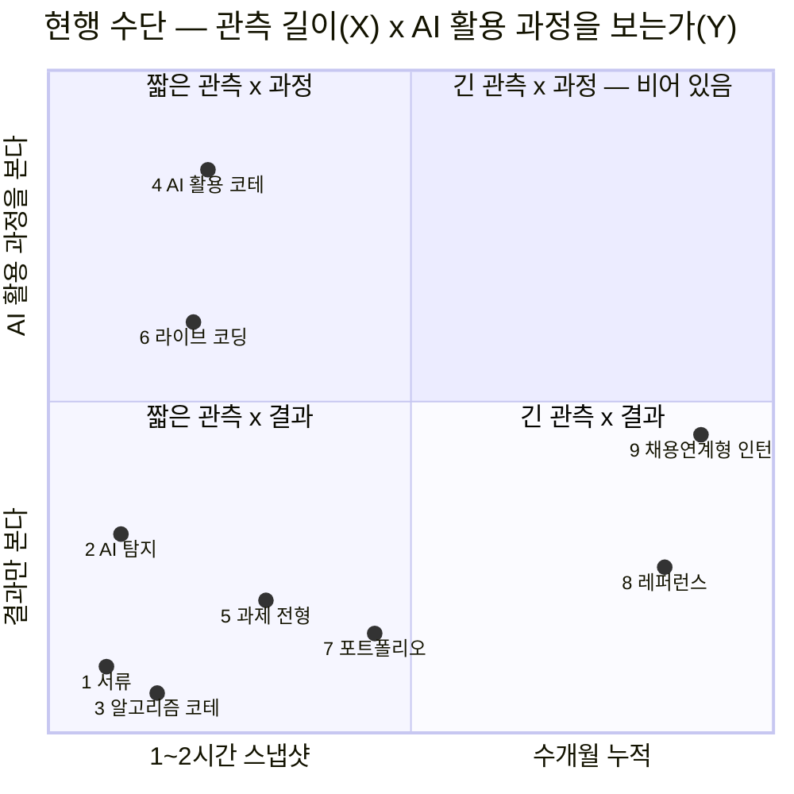

# 부록 A-5 — 기업 Pain과 취업자 Pain의 분리 분석, 그리고 현행 대체 수단 9종 비교

입력: [A-4 P-09 재검토](./p09-rehypothesis-korean-hiring.md) · 조사 시점: 2026년 8월 · **국내 자료 우선**

**근거 표기** — 🟢 실측(조사기관 원자료·공식 발표) / 🟡 추론 / 🔴 가설 / ⚪ 2차 매체 · **[미확인]** = 근거를 확보하지 못한 가정

---

## 0. 검증한 두 가설과 판정

| | 가설 | **판정** | 결정적 근거 |
|---|---|---|---|
| **H1** | 기업은 AI 활용 역량을 **중요하게 여기지만 평가하기 어렵다** | **전반부 부분 지지 · 후반부 강하게 지지** | 채용전문면접관 414명 중 **46%가 「AI 리터러시 검증」을 2026 과제로 지목** 🟢 · 자소서 **48.5%가 생성 AI 의심** 🟢 · 코딩테스트 **변별력 상실** ⚪ · **채용연계형 인턴 공고 비율 35% → 64%** 🟢 |
| **H2** | 취업자는 자신의 AI 활용 역량을 **포트폴리오·면접만으로 증명하기 어렵다** | **간접 지지 · 직접 증거는 미확보** ⚠ | 구직자 **51%가 AI로 자소서 작성**하면서도 **52.9%는 AI 작성에 불이익을 줘야 한다**고 답함 🟢(모순) · 취준 사교육비 **연 455만 원** 🟢 · **그러나 "AI 활용 역량을 증명하고 싶다"는 직접 진술은 확인 못 함** **[미확인]** |

> **가장 중요한 정정** — H1과 H2는 **같은 문제의 양면이 아닙니다.** 기업은 **판별**하고 싶고 취업자는 **차별화**하고 싶으며, **결정적으로 기업은 이 문제를 회피할 수 있고 취업자는 회피할 수 없습니다** → [§3](#3-두-pain은-같은-문제가-아니다)

---

## 1. 기업 측 — H1 검증

### 1-1. 「중요하게 여긴다」 — 부분 지지

| 조사 | 표본 | 결과 |
|---|---|---|
| **한국바른채용인증원 「2026년 채용 트렌드 전망」** 🟢 | **채용전문면접관 자격 보유자 414명** | ① **조직적합성(인성·협력·책임감) 검증 67%** — 3년 연속 1위 ② AI 확대에 따른 인력 축소·질적 채용 전환 63% ③ **AI 리터러시(이해·활용 능력) 검증 46%** ④ **AI로 포장된 지원자의 진정성·표절 검증 41%** |
| **원티드랩 2026 채용 트렌드 서베이** 🟢 | 국내 기업 153곳 인사담당자 | 중요 역량 — 직무 전문성 64.7% > 팀워크 37.9% > 조직 기여 의지 28.1% > **AI·데이터 활용 역량 24.2%(4위)** |

**두 조사가 같은 방향을 가리킵니다 — 중요하지만 1위가 아닙니다.**

> **그런데 ③과 ④를 함께 읽으면 다른 그림이 나옵니다.** 면접관 414명이 꼽은 과제 중 **③ AI 리터러시 검증(46%)과 ④ AI 포장 검증(41%)이 나란히 상위에 있습니다** 🟢. 즉 기업은 **「AI를 잘 쓰는 사람을 찾는 일」과 「AI로 부풀린 사람을 거르는 일」을 동시에 과제로 안고 있습니다.**
>
> **이는 [A-4](./p09-rehypothesis-korean-hiring.md)의 판정을 미세 조정합니다** — A-4는 시장이 *"의심에서 활용 평가로"* 이동한다고 봤는데, 실제로는 **둘이 동시에 존재**합니다. 다만 **④(탐지)의 수단은 실패가 실증된 반면 ③(활용 평가)의 수단은 아직 없습니다**([§4](#4-현행-대체-수단-9종-비교)).

### 1-2. 「평가하기 어렵다」 — 강하게 지지

**증거가 네 층으로 쌓여 있습니다.**

| 층 | 관측 | 근거 |
|---|---|---|
| **① 서류 신호의 붕괴** | 기업이 받은 자소서 중 **48.5%가 생성 AI 활용 의심**(무하유 검사 문서 기준) 🟢. 별도 리포트는 **64.4% 추정** ⚪. **AI 의심 자소서가 2024년 대비 75.6% 증가** ⚪ | [AI타임스](https://www.aitimes.com/news/articleView.html?idxno=168290) · [링커리어 정리](https://community.linkareer.com/employment_data/5049201) |
| **② 탐지 수단의 한계** | AI 탐지기 평균 정확도 **60~85%** ⚪. 하이브리드 글은 자주 통과. 해외에서는 **25개+ 대학이 탐지 도구를 금지·제한**([A-2 §5-1](./ai-substitutability-and-viability.md#5-1-p-09--검증은-이미-산업이다-단-채용-시점의-1회-시험으로만-존재한다)) 🟢 | 동일 |
| **③ 코딩테스트의 변별력 상실** | 과거 **40~50%만 맞춰도 통과**했으나 지금은 **대부분 맞아야** 다음 전형으로 감. 실력 상향평준화 + 부정행위로 통과율이 올라 **코딩테스트 기반 면접의 변별력이 사라짐** ⚪ | [코딩 테스트 — 나무위키](https://namu.wiki/w/%EC%BD%94%EB%94%A9%20%ED%85%8C%EC%8A%A4%ED%8A%B8) |
| **④ 기업의 행동 — 가장 강한 증거** | **채용연계형 인턴 공고 비율이 2024년 5월 약 35% → 2026년 2월 64%로 역대 최고** 🟢. *"서류·면접만으로 판단하기보다 실제 업무 수행 능력과 조직 적응력을 확인하기 위해"* ⚪ | [자소설닷컴 뉴스룸](https://jasoseol.com/blog/post/%EC%9D%B4%EC%A0%9C-%EC%9D%B8%ED%84%B4%EC%9D%B4-%EA%B3%A7-%EC%8B%A0%EC%9E%85-%EC%9E%90%EC%86%8C%EC%84%A4%EB%8B%B7%EC%BB%B4-%EC%B1%84%EC%9A%A9%EC%97%B0%EA%B3%84%ED%98%95-%EC%9D%B8%ED%84%B4/) · [링커리어](https://community.linkareer.com/employment_data/5726278) |

> **④가 왜 가장 강한 증거인가** — 앞의 세 층은 *"어렵다"* 는 진술이지만, **인턴 전환형으로의 이동은 기업이 실제로 치른 비용**입니다. **수개월치 급여와 관리 공수를 들여 사람을 옆에 두고 보겠다는 결정**은, **짧은 전형으로는 못 본다는 실토**입니다 🟡.
>
> **⚠️ 단, 대체 해석이 있습니다.** 인턴 확대는 **검증 목적이 아니라 인건비 절감·채용 유연성 확보**일 수 있습니다. **어느 쪽이 주된 동기인지는 확인하지 못했습니다** **[미확인]** → [§6](#6-확인되지-않은-가정)

### 1-3. H1 판정

> **「중요하게 여긴다」는 부분 지지(46%·24.2%로 상위권이나 1위 아님), 「평가하기 어렵다」는 강하게 지지.**
> **그리고 두 부분의 강도가 다르다는 것이 핵심입니다** — 기업은 **평가가 어렵다는 것은 확실히 겪고 있지만, 그 어려움의 대상이 「AI 활용 역량」인지 「역량 일반」인지는 갈라지지 않았습니다** 🟡. 414명 조사에서 1위는 여전히 **조직적합성 검증(67%)** 입니다.

---

## 2. 취업자 측 — H2 검증

### 2-1. 「증명하기 어렵다」 — 간접 지지

**직접 증거는 못 찾았고, 정황 증거 세 가지를 찾았습니다.**

**정황 ① — 스스로 쓰면서 스스로 불이익을 지지하는 모순**

| 지표 | 값 |
|---|---|
| AI로 자기소개서를 작성한 경험이 있는 구직자 | **51%** 🟢 |
| AI 활용을 긍정적으로 보는 비율 | **64.9%** 🟢 |
| **AI로 작성한 자소서에 불이익을 주는 것에 동의** | **52.9%** 🟢 |

> **셋을 함께 읽으면 모순이 드러납니다 — 절반이 쓰고, 3분의 2가 괜찮다고 하면서, 절반이 불이익을 줘야 한다고 답합니다.** 이 모순은 *"다들 쓰니까 나도 쓰는데, 그래서 아무도 구별되지 않는다"* 는 상태의 표현으로 읽힙니다 🟡. **단 이것은 이 문서의 해석이고, 응답자가 그렇게 진술한 것은 아닙니다** **[미확인]**.

**정황 ② — 서류가 이미 신호를 잃었다**

제출 자소서의 **48.5%가 AI 생성 의심** 🟢인 환경에서는, **직접 쓴 사람도 의심 대상**이 됩니다. 탐지 정확도가 60~85% ⚪라는 것은 **오탐이 상시 존재한다**는 뜻입니다.

**정황 ③ — 문 자체가 좁아졌다**

| 지표 | 값 |
|---|---|
| 기업이 적극 채용할 연차 중 **신입** | **12.4%(최하위)** 🟢 |
| 내년 충원 계획 중 신입 비중 | **26%**(경력 74%) 🟢 |

### 2-2. 취업자는 이미 큰 비용을 치르고 있다

| 지표 | 값 | 근거 |
|---|---|---|
| **취준생 1인 연평균 사교육비** | **455만 원** — 2022년 227만 원에서 **3년 새 약 2배** 🟢 | [문화일보](https://www.munhwa.com/article/11594280) · [산업종합저널](https://industryjournal.co.kr/news/246273) |
| 월평균 | 약 **38만 원** 🟢 | 동일 |
| **취업 준비 중 경제적 어려움을 겪었다** | **71.1%** 🟢 | 동일 |
| 구직과 아르바이트를 병행 | **73.8%** 🟢 | 동일 |
| 지출 항목 1위 | **자격증 준비 64.9%** 🟢 | 동일 |

> **지불 의사는 실증됩니다 — 연 455만 원을 이미 쓰고 있습니다.** 그러나 **지불 능력은 반대 방향**입니다 — 71.1%가 경제적 어려움을 겪고 73.8%가 알바를 병행합니다 🟢. **그리고 지출 1위가 자격증(64.9%)이라는 사실이 중요합니다** — 취업자가 돈을 쓰는 대상은 **「제3자가 인정하는 형식적 증표」** 입니다 🟡.

### 2-3. H2 판정

> **「증명이 어렵다」는 정황으로 지지되지만, 「AI 활용 역량을 증명하고 싶은데 방법이 없다」는 형태의 직접 진술은 확보하지 못했습니다.**
>
> **이것이 이 문서의 가장 큰 공백입니다.** 확인된 것은 ㉠ 서류가 신호를 잃었다 ㉡ 취업자가 증명에 큰 돈을 쓴다 ㉢ 문이 좁아졌다 — **세 가지 모두 「증명 일반」의 어려움이고, 「AI 활용 역량」이라는 특정 항목의 어려움이 아닙니다** ⚠. [A-3 §4-3](./opportunity-map-and-validation-plan.md#4-3-검증-과제--p-03p-05-개인이-역량이-안-남는-문제에-돈을-쓴-적이-있는가)의 인터뷰가 정확히 이 지점을 겨눠야 합니다.

---

## 3. 두 Pain은 같은 문제가 아니다

**분리해서 보면 방향이 다릅니다.**

| | **기업** | **취업자** |
|---|---|---|
| 원하는 것 | **판별** — 여럿 중 누가 잘 쓰는지 가려내기 | **차별화** — 내가 잘 쓴다는 것을 보이기 |
| 실패의 결과 | 잘못 뽑음 → **채용 비용·이탈** | 탈락 → **생계** |
| 이미 쓰는 돈 | 인턴 급여 · 평판조회(회당 3만~100만 원) · 탐지 솔루션 | **연 455만 원 사교육** 🟢 |
| 지불 **능력** | **크다** | **작다** — 71.1%가 경제적 어려움 🟢 |
| 급한 정도 | 중 | **최상** |
| **회피 가능성** | **가능하다 — 신입을 안 뽑으면 된다**(신입 채용 의향 12.4%) 🟢 | **불가능하다** |

> **「회피 가능성」이 가장 중요한 비대칭입니다.** 기업은 이 문제를 풀지 않고도 살 수 있습니다 — 경력직을 뽑으면 됩니다. 실제로 그렇게 하고 있습니다(경력 74% vs 신입 26%) 🟢. **취업자는 그 선택지가 없습니다.**
>
> **사업적 함의는 불편합니다** — **돈이 있는 쪽(기업)은 안 사도 되고, 절실한 쪽(취업자)은 살 돈이 부족합니다** 🟡. [A-3 §6-1](./opportunity-map-and-validation-plan.md#6-1-조합이-순위보다-중요합니다)이 *"학습자 무료 + 기업 과금"* 을 유일한 형태로 지목했는데, **이 절이 그 판단의 취약점을 드러냅니다 — 기업의 회피 옵션을 계산에 넣지 않았습니다.**

---

## 4. 현행 대체 수단 9종 비교

**해결 정도** — ●● 상당히 해결 / ● 부분 / ○ 거의 못 함 / ✕ 오히려 악화

| # | 수단 | 무엇을 보는가 | **H1** 기업의 판별 | **H2** 취업자의 증명 | 핵심 한계 | 비용·규모 |
|:-:|---|---|:-:|:-:|---|---|
| 1 | **서류·자기소개서** | 서술된 경험 | **○** | **○** | **48.5%가 AI 생성 의심** 🟢 — 신호 자체가 붕괴 | 저 |
| 2 | **AI 탐지 솔루션**(무하유 GPT킬러·프리즘) | AI 생성 여부 | **●** | **✕** | **탐지는 "안 썼음"만 보고 "잘 씀"은 못 본다.** 정확도 60~85% ⚪, 오탐이 지원자를 해침 | 프리즘 도입사의 **68% 이상이 GPT킬러 사용** 🟢 |
| 3 | **알고리즘 코딩테스트** | 문제 해결 속도 | **○** | **○** | **변별력 상실** — 과거 40~50%에서 지금은 대부분 맞아야 통과 ⚪. 그리고 **AI 시대 실무 역량과 상관이 약해짐** | 저 (자동화) |
| 4 | **AI 활용 코딩테스트**(컬리·무신사형) | **AI 출력 검증·프롬프트·설명** | **●●** | **●●** | **국내 2곳뿐** 🟢 · **1~2시간 스냅샷** · **채점 기준 미공개** **[미확인]** | 중 |
| 5 | **과제 전형** | 결과물 | **○** | **●** | **누가 만들었는지 알 수 없어 신호가 약해짐**([A-2](./ai-substitutability-and-viability.md)) 🟢 | 중 |
| 6 | **라이브 코딩·기술 면접** | 실시간 사고·설명 | **●●** | **●** | **비용이 가장 큰 병목.** 면접관 시간이 인당 소모돼 **대규모 신입 전형에 못 씀** 🟡 | **Karat이 이 비용을 대행으로 사업화 — ARR $73.6M** ⚪ |
| 7 | **포트폴리오·GitHub** | 결과물·커밋 | **○** | **●** | **결과만 남고 과정이 없다.** 커밋 로그도 꾸밀 수 있음 🟡 | 저 |
| 8 | **레퍼런스 체크**(스펙터 등) | 함께 일한 사람의 증언 | **●●** | **✕** | **신입에게는 레퍼런스가 존재하지 않는다** — 구조적 배제 | 회당 **3만 원**(과거 100만 원) · 스펙터 누적 평판 **40만 건**, 고객사 **5,000곳+** ⚪ |
| 9 | **채용연계형 인턴** | 수개월의 실제 업무 | **●●** | **●** | **가장 비싼 방법.** 지원자에게는 **도박** — 전환율 대기업 20~35%·IT 30~60% ⚪ | 공고 비율 **35%(2024.5) → 64%(2026.2)** 🟢 |

### 4-1. 두 축으로 정리하면

---

## 5. 아홉 수단이 공통으로 못 하는 것

**표를 세로로 읽으면 빈칸이 하나 보입니다.**

| 조건 | 이 조건을 만족하는 수단 |
|---|---|
| **AI 활용 과정**을 본다 | 4(AI 활용 코테) · 6(라이브 코딩) — **둘 다 1~2시간 스냅샷** |
| **긴 시간**을 관측한다 | 8(레퍼런스) · 9(인턴) — **둘 다 AI 활용 과정은 안 봄** |
| **신입에게 적용**된다 | 1·3·4·5·6·7·9 — **8은 구조적으로 불가** |
| **비용이 낮다** | 1·2·3·7 — **전부 신호가 약하거나 붕괴** |

> **네 조건을 동시에 만족하는 수단이 없습니다.** 특히 **「신입 + 긴 관측 + AI 활용 과정」** 칸이 비어 있고, 이는 [A-2 §5-1](./ai-substitutability-and-viability.md#5-1-p-09--검증은-이미-산업이다-단-채용-시점의-1회-시험으로만-존재한다)이 *"학습 기간 전체에 걸친 누적 관측은 미발견"* 이라고 적은 자리와 **같은 칸**입니다 🟡.

### 5-1. 그리고 기업은 그 빈칸을 가장 비싼 방법으로 메우고 있다

**채용연계형 인턴 공고가 35% → 64%로 늘어난 것**은, 기업이 **「긴 관측」에 수개월치 급여를 지불하기 시작했다**는 뜻입니다 🟢.

> **이것이 이 문서에서 찾은 가장 강한 수요 신호입니다** — 의견 조사가 아니라 **지출로 표현된 수요**입니다 🟡.
>
> **⚠️ 다만 두 가지를 동시에 적어야 합니다.**
> ㉠ **인턴 확대의 동기가 검증인지 비용 절감인지 확정되지 않았습니다** **[미확인]**.
> ㉡ **인턴이 관측하는 것은 「AI 활용 과정」이 아니라 「업무 수행 전반」입니다.** 빈칸의 절반만 메우고 있습니다 🟡.

---

## 6. 확인되지 않은 가정

**아래는 이 문서의 결론에 영향을 주지만 근거를 확보하지 못했습니다.**

| # | 가정 | 왜 중요한가 | 확보 경로 |
|:-:|---|---|---|
| **1** | **취업자가 「AI 활용 역량을 증명하고 싶다」고 실제로 느낀다** | **H2 전체가 여기 걸려 있다.** 확인된 것은 "증명 일반"의 어려움뿐 | 취준생 인터뷰 — *"AI를 어떻게 썼는지 보여주고 싶었던 순간이 있었나요?"* |
| **2** | **채용연계형 인턴 확대의 주된 동기가 「검증」이다** | §5-1의 수요 신호가 여기 걸려 있다. **비용 절감이 동기면 신호가 아니다** | 채용 담당자 인터뷰 · 기업 IR·채용 공지 원문 |
| **3** | **기업이 외부에서 만든 기록을 인정한다** | [A-3](./opportunity-map-and-validation-plan.md)·[A-4](./p09-rehypothesis-korean-hiring.md)에서 계속 미해소. **㉡ 제3자 신뢰는 우리가 만들 수 없다** | A-3 §4-2 실험 |
| **4** | 무신사·컬리의 **AI 활용 능력 채점 기준** | 4번 수단의 재현 가능성 | 기업 공개 자료·인터뷰 |
| 5 | 자소서 AI 생성 비율 **48.5%(무하유) vs 64.4%(별도 리포트)** 의 불일치 | 서류 붕괴의 크기 | 원자료 대조 |
| 6 | **AI 탐지기 정확도 60~85%** 의 원자료 | 2번 수단의 한계 정량화 | 벤더 백서·독립 검증 |
| 7 | 기업이 **신입 채용을 계속 줄일 것인가** | §3의 「회피 가능성」이 지속되는지 | 시계열 추적 |
| 8 | **취준 사교육비 455만 원 중 「증명」 목적 지출의 비중** | 지불 의사의 크기. 자격증 64.9%는 형식 증표라 근접 지표이나 동일하지 않음 | 원조사 세부 항목 |

### 6-1. 이 문서가 「확인했다」고 말할 수 있는 것과 없는 것

| 확인했다 🟢 | 확인하지 못했다 ⚠ |
|---|---|
| 기업이 서류·코테로 판별하기 어려워졌다 | 그 어려움의 대상이 **「AI 활용 역량」인지 「역량 일반」인지** |
| 기업이 긴 관측(인턴)으로 이동했다 | 그 이동의 **동기가 검증인지 비용인지** |
| 취업자가 증명에 연 455만 원을 쓴다 | 그 지출 중 **AI 활용 역량 증명에 해당하는 몫** |
| 취업자 51%가 AI로 자소서를 쓴다 | 그들이 **AI 활용을 보여주고 싶어 하는지** |
| 아홉 수단 중 「신입 + 긴 관측 + AI 과정」이 비어 있다 | **그 빈칸을 메우는 것에 누가 얼마를 낼지** |

---

## 7. 앞 문서로 되돌리는 것

| 되돌리는 결론 | 반영 대상 |
|---|---|
| **기업의 Pain은 회피 가능하다**(경력직 전환). *"학습자 무료 + 기업 과금"* 구조는 **기업의 회피 옵션을 계산에 넣지 않았다** 🟡 | [A-3 §6-1](./opportunity-map-and-validation-plan.md#6-1-조합이-순위보다-중요합니다) — 조합 결론에 **회피 가능성** 항 추가 |
| **탐지(④)와 활용 평가(③)는 동시에 존재한다** — 면접관 조사에서 46%·41%로 나란히 상위 🟢. A-4가 *"의심 → 활용"* 의 **대체**로 본 것은 과장 | [A-4 §6-1](./p09-rehypothesis-korean-hiring.md#6-1-무엇이-틀렸는가) — "역행"을 **"병존"** 으로 완화 |
| **채용연계형 인턴 35% → 64%** 는 긴 관측에 대한 **지출로 표현된 수요** 🟢 | [A-3 §1-2](./opportunity-map-and-validation-plan.md#1-2-점수표) — P-09 지불 의사 근거에 **간접 실증**으로 추가(단 동기 미확정) |
| **레퍼런스 체크는 신입을 구조적으로 배제한다** — 경력자에게만 존재하는 검증 자산 🟢 | 신규 — 신입 표적의 **구조적 공백** 근거 |
| **취업자의 지출 1위는 자격증(64.9%)** — 돈을 쓰는 대상은 **제3자가 인정하는 형식 증표** 🟡 | [A-2 §6-1](./ai-substitutability-and-viability.md#6-1-조합이-순위보다-중요합니다) — 개인 과금 노선의 형태 단서 |
| **H2의 직접 증거가 없다** | [A-3 §4-3](./opportunity-map-and-validation-plan.md#4-3-검증-과제--p-03p-05-개인이-역량이-안-남는-문제에-돈을-쓴-적이-있는가) — 인터뷰 문항에 §6 1번 추가 |

---

## 8. 출처

### 기업 측
- [2026년 채용트렌드…소규모 질적 채용 전환·AI 잘 활용하는 인재 — 한경 매거진 잡앤조이](https://magazine.hankyung.com/job-joy/article/202512290531d) *(한국바른채용인증원, 채용전문면접관 414명)*
- [원티드랩 "2026년 채용 핵심은 중간 경력직·AI 활용 역량" — 전자신문](https://www.etnews.com/20251208000036)
- [무하유 "기업에서 받은 자소서 89만건 중 절반이 챗GPT 생성" — AI타임스](https://www.aitimes.com/news/articleView.html?idxno=168290)
- ["챗GPT로 쓴 자소서 잡아낸다" 무하유, AI 서류 평가 솔루션 프리즘에 GPT킬러 연동 — CIO](https://www.cio.com/article/3507869/%EC%B1%97gpt%EB%A1%9C-%EC%93%B4-%EC%9E%90%EC%86%8C%EC%84%9C-%EC%9E%A1%EC%95%84%EB%82%B8%EB%8B%A4-%EB%AC%B4%ED%95%98%EC%9C%A0-ai-%EC%84%9C%EB%A5%98-%ED%8F%89%EA%B0%80.html)
- [무하유, 'GPT킬러'에 GPT-5 탐지 기능 업데이트 — 뉴스탭](https://www.newstap.co.kr/news/articleView.html?idxno=311004)
- [코딩 테스트(변별력 관련 서술) — 나무위키](https://namu.wiki/w/%EC%BD%94%EB%94%A9%20%ED%85%8C%EC%8A%A4%ED%8A%B8) ⚪
- [AI 툴로 아마존 코딩 테스트 통과? 실력 검증, 이대로 괜찮을까 — 코드트리](https://www.codetree.ai/blog/ai-%ED%88%B4%EB%A1%9C-%EC%95%84%EB%A7%88%EC%A1%B4-%EC%BD%94%EB%94%A9-%ED%85%8C%EC%8A%A4%ED%8A%B8-%ED%86%B5%EA%B3%BC-%EC%BD%94%EB%94%A9-%ED%85%8C%EC%8A%A4%ED%8A%B8-%EC%8B%A4%EB%A0%A5-%EA%B2%80/) ⚪

### 취업자 측
- [AI 구직·채용 코앞에…구직자 절반은 "AI로 자기소개서 작성" — 월간노동법률](https://www.worklaw.co.kr/view/view.asp?in_cate=124&gopage=1&bi_pidx=37391)
- [2026 자소서 AI 총정리(탐지 정확도·의심 자소서 증가율) — 링커리어](https://community.linkareer.com/employment_data/5049201) ⚪
- ["취업도 돈있어야 한다고?"…구직 사교육비 1인 연평균 455만원 — 문화일보](https://www.munhwa.com/article/11594280)
- [연 455만원 쓰는 취업 준비…AI·직무경험 앞에 더 높아진 채용 문턱 — 산업종합저널](https://industryjournal.co.kr/news/246273)
- [취준생 사교육비 평균 455만원…3년 새 두 배 증가 — 기독일보](https://www.christiandaily.co.kr/news/160870)

### 대체 수단
- [구글부터 컬리까지, 확산되는 AI 활용 코딩 테스트 현황 — 잡코리아](https://www.jobkorea.co.kr/goodjob/tip/view?News_No=22546)
- [무신사, 'AI 네이티브' 신입 개발자 66명 선발 — 무신사 뉴스룸](https://newsroom.musinsa.com/newsroom-menu/2026-0330)
- [레퍼런스체크, 실제로는 '이렇게' 합니다 — 잡플래닛](https://www.jobplanet.co.kr/contents/news-5009/%EB%A0%88%ED%8D%BC%EB%9F%B0%EC%8A%A4%EC%B2%B4%ED%81%AC-%EC%8B%A4%EC%A0%9C%EB%A1%9C%EB%8A%94-%EC%9D%B4%EB%A0%87%EA%B2%8C-%ED%95%A9%EB%8B%88%EB%8B%A4)
- [스펙터(지원자 평판조회) — 나무위키](https://namu.wiki/w/%EC%8A%A4%ED%8E%99%ED%84%B0(%EC%A7%80%EC%9B%90%EC%9E%90%20%ED%8F%89%ED%8C%90%EC%A1%B0%ED%9A%8C)) ⚪ · [스펙터 공식](https://www.specter.co.kr/)
- [자소설닷컴, 채용연계형 인턴 비중 60% 돌파 — 자소설닷컴 뉴스룸](https://jasoseol.com/blog/post/%EC%9D%B4%EC%A0%9C-%EC%9D%B8%ED%84%B4%EC%9D%B4-%EA%B3%A7-%EC%8B%A0%EC%9E%85-%EC%9E%90%EC%86%8C%EC%84%A4%EB%8B%B7%EC%BB%B4-%EC%B1%84%EC%9A%A9%EC%97%B0%EA%B3%84%ED%98%95-%EC%9D%B8%ED%84%B4/)
- [2026 채용형 인턴 전환율 정리 — 링커리어](https://community.linkareer.com/employment_data/5726278) ⚪
- [Karat Revenue 2024: $73.6M ARR — Latka](https://getlatka.com/companies/karat) ⚪

### 부록 A 내부 참조
- [A-1 Pain 인벤토리](./pain-inventory-post-ai-era.md) · [A-2 AI 대체 가능성·사업성](./ai-substitutability-and-viability.md) · [A-3 Opportunity Map·검증 과제](./opportunity-map-and-validation-plan.md) · [A-4 P-09 재검토](./p09-rehypothesis-korean-hiring.md)
