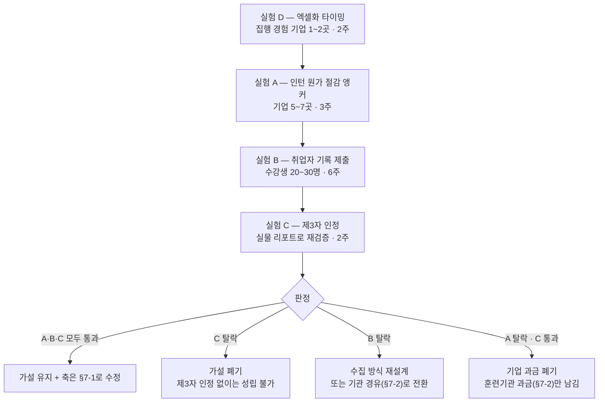

# 부록 A-6 — 「AI 활용 역량의 증명·평가」는 사업 기회인가: 종합 판정

입력: [A-1](./pain-inventory-post-ai-era.md) · [A-2](./ai-substitutability-and-viability.md) · [A-3](./opportunity-map-and-validation-plan.md) · [A-4](./p09-rehypothesis-korean-hiring.md) · [A-5](./two-sided-pain-employer-vs-jobseeker.md)
작성 시점: 2026년 8월

**근거 표기** — 🟢 실측 / 🟡 추론 / 🔴 가설 / ⚪ 2차 매체 · **[미확인]**

---

## 0. 판정

| | |
|---|---|
| **판정** | **수정(Revise)** — 폐기도 유지도 아니다 |
| **폐기하지 않는 이유** | 빈칸이 실재하고(**신입 + 긴 관측 + AI 활용 과정**), 기업이 그 칸을 **가장 비싼 방법(인턴 35%→64%)** 으로 메우고 있으며, 탐지 수단의 실패는 실증됐다 🟢 |
| **유지하지 않는 이유** | ㉠ **「AI 활용 역량」이라는 평가 축 자체가 3~5년 내 소멸할 위험**(엑셀화) 🟡 ㉡ 취업자 단독으로는 성립 불가 — **제3자가 인정해야만 가치가 생긴다** ㉢ 기업은 **회피(경력직)와 내재화(무신사 자체 전형)로 둘 다 빠져나갈 수 있다** 🟢 |
| **수정 방향** | ① 평가 축을 **「AI 활용」에서 「판단의 흔적」으로** ② 고객을 **기업에서 훈련기관·부트캠프로** ③ 포지션을 **「새 서비스」에서 「인턴 비용의 앞단 절감」으로** → [§7](#7-수정의-세-방향) |

> **한 줄로** — **「AI 활용 역량이 중요하다」는 확인됐지만, 「그것을 증명하는 새 서비스에 돈을 낼 필요가 있다」는 확인되지 않았습니다.** 둘 사이에는 다섯 개의 관문이 있고, 현재 가설은 **그중 넷에서 막힙니다** → [§1](#1-중요하다와-돈을-낼-필요가-있다를-가르는-5문)

---

## 1. 「중요하다」와 「돈을 낼 필요가 있다」를 가르는 5문

**중요한 문제가 곧 지출을 만들지는 않습니다.** 사이에 다섯 개의 관문이 있고, **하나라도 막히면 지출이 생기지 않습니다.**

| # | 관문 | 막히면 벌어지는 일 | **현재 가설의 상태** |
|:-:|---|---|---|
| **Q1** | **이미 쓰는 수단으로 해결되는가?** | 새 예산이 생기지 않는다 | **부분 해결됨** — 인턴·라이브코딩·AI 활용 코테로 대응 중 🟢 **→ 막힘** |
| **Q2** | **문제를 회피할 수 있는가?** | 안 사고 피한다 | **회피 가능** — 신입을 안 뽑으면 된다(신입 채용 의향 12.4%) 🟢 **→ 막힘** |
| **Q3** | **내재화가 쉬운가?** | 직접 만든다 | **내재화 실증** — 무신사가 **2차 전형 자체를 자체 설계**해 66명 선발 🟢 **→ 막힘** |
| **Q4** | **예산 우선순위에서 몇 위인가?** | 1순위가 아니면 뒤로 밀린다 | **AI 리터러시 검증 46% · AI 활용 역량 24.2%** — 각각 조직적합성 67%, 직무 전문성 64.7%에 밀림 🟢 **→ 막힘** |
| **Q5** | **고통을 겪는 자와 지불하는 자가 같은가?** | 지불 논리를 따로 만들어야 한다 | **분리됨** — 고통은 취업자, 지불 능력은 기업 🟢 **→ 막힘** |

> **다섯 관문 중 다섯 개가 막혀 있습니다.** 이것이 *"중요한데 왜 아무도 안 만들었나"* 에 대한 답일 수 있습니다 — **못 만든 게 아니라 지출이 생기지 않는 구조**입니다 🟡.
>
> **§7의 수정은 이 다섯 관문 중 Q1·Q4를 뒤집는 것을 목표로 합니다.**

---

## 2. 기준 ① — 기업의 지불 가능성

### 2-1. 지불 「능력」은 확실히 있다

**채용 검증에 돈을 쓰는 시장은 실재하며 규모도 확인됩니다.**

| 사업자 | 규모 | 무엇에 대한 지불인가 |
|---|---|---|
| **Karat** | 2024 ARR **$73.6M** ⚪ · 기업가치 $1.1B 🟢 | **면접 대행**(사람 시간의 외주) |
| **HackerRank·CodeSignal** | 기업 유료 운영 🟢 | **시험 + 부정행위 탐지** |
| **스펙터** | 누적 평판 **40만 건**, 고객사 **5,000곳+** ⚪ · 회당 3만 원(과거 100만 원) | **경력자 평판 조회** |
| **무하유 프리즘·GPT킬러** | 프리즘 도입사의 **68% 이상이 GPT킬러 사용** 🟢 | **AI 생성 탐지** |

### 2-2. 그러나 지불 「필요」는 약하다

**위 네 사업자가 파는 것은 전부 「AI 활용 역량 평가」가 아닙니다.** 면접 대행·부정 탐지·경력자 평판입니다.

| 막는 요인 | 근거 |
|---|---|
| **회피 가능** | 경력 74% vs 신입 26% 🟢 — **신입을 안 뽑으면 이 문제가 사라진다** |
| **내재화 실증** | 무신사는 **1,700 → 400 → 100 → 66명** 전형을 자체 설계·집행 🟢 |
| **대체 수단 보유** | 인턴 공고 비율 **35% → 64%** 🟢 — 비싸지만 이미 쓰고 있다 |
| **우선순위 4위** | 원티드랩 153곳에서 AI·데이터 활용 역량 **24.2%** 🟢 |

> **판정 — 지불 능력 ○ / 지불 필요 △.** *"돈은 있는데 굳이 이걸로 쓸 이유가 아직 없다"* 가 정확한 상태입니다 🟡.

---

## 3. 기준 ② — 취업자의 사용 의사

### 3-1. 지출 실적은 크다

취준생 1인 연평균 사교육비 **455만 원**(2022년 227만 원의 약 2배), 지출 1위는 **자격증 64.9%** 🟢. **돈을 쓰는 대상이 「제3자가 인정하는 형식 증표」** 라는 점은 이 가설에 유리한 단서입니다 🟡.

### 3-2. 그러나 세 가지가 막는다

| 막는 요인 | 근거 |
|---|---|
| **지불 능력이 없다** | 취준생 **71.1%가 경제적 어려움**, **73.8%가 알바 병행** 🟢 |
| **직접 수요가 미확인** | *"AI 활용 역량을 증명하고 싶다"* 는 진술을 **하나도 찾지 못함** **[미확인]** — [A-5 §2-3](./two-sided-pain-employer-vs-jobseeker.md#2-3-h2-판정) |
| **단독으로 성립 불가** | 취업자가 만든 증명은 **기업이 인정해야만 가치가 생긴다.** 자기 선언은 무효 — ㉡ 제3자 신뢰 |

> **판정 — 사용 의사는 있을 가능성이 높으나 「지불」과 「효력」 둘 다 취업자 쪽에 없습니다.** 이 가설을 **개인 과금 사업으로 세우는 것은 성립하지 않습니다** 🟡.

---

## 4. 기준 ③ — 기존 경쟁·대체재

| 층 | 상태 |
|---|---|
| **직접 경쟁**(신입 + 긴 관측 + AI 활용 과정) | **미발견** — 단 부재의 증명은 아님 🟡 |
| **인접 대체재** | **두껍다** — 인턴(64%) · 라이브 코딩 · AI 활용 코테(컬리·무신사) · 레퍼런스(경력 한정) · 탐지 솔루션([A-5 §4](./two-sided-pain-employer-vs-jobseeker.md#4-현행-대체-수단-9종-비교)) |
| **확장 위협** | **최상** — HackerRank·CodeSignal·Karat은 **기업 채널과 관측 인프라를 이미 둘 다 보유** 🔴. 무신사·컬리는 **자체 수행 중** 🟢 |

> **판정 — "빈칸이 있다"와 "그 빈칸이 우리 것이 될 수 있다"는 다른 문제입니다.** 빈칸에 가장 가까이 서 있는 것은 우리가 아니라 **이미 기업과 계약된 검증 사업자들**입니다. [Ch01 §2-5](../01-porters-five-forces/case-01-kokjip-lecture-review-prioritizer.md#2-5-산업-내-경쟁-강도--중-35)가 다글로에 내린 판정 — *"유효기간이 있는 기회"* — 와 같은 구조입니다 🟡.

---

## 5. 기준 ④ — AI 발전에 따른 지속 가능성

### 5-1. 유리한 방향

| 요인 | 근거 |
|---|---|
| **결과물과 역량의 괴리가 커진다** | AI가 좋아질수록 산출물만으로는 판별 불가 🟡 |
| **탐지는 더 실패한다** | 생성 품질 상승 → 탐지 정확도 하락. 이미 25개+ 대학이 탐지 도구 금지 🟢 |
| **평가 항목이 수렴 중** | 구글·메타·쇼피파이·캔바가 **출력 검증·구조화·설명**으로 모임 🟢([A-4 §3-3](./p09-rehypothesis-korean-hiring.md#3-3-평가-항목을-겹쳐-보면-하나로-모인다)) |

### 5-2. ⚠️ 불리한 방향 — 「엑셀화」

**이것이 이 문서에서 가장 무거운 반론입니다.**

> **AI 활용이 완전히 보편화되면 「AI 활용 역량」이라는 변별 축 자체가 사라집니다.**
>
> 1990년대에 *"엑셀을 쓸 줄 안다"* 는 이력서에 쓰는 스펙이었습니다. 지금은 아무도 평가하지 않습니다 — **못 쓰는 사람이 없어졌기 때문**입니다. 변별력은 **격차에서 나오고, 보급이 끝나면 격차가 사라집니다** 🟡.

**이 시나리오를 지지하는 신호가 이미 있습니다.**

| 신호 | 근거 |
|---|---|
| 대학생 AI 학습 활용률 **91.7%** 🟢 | [A-1 §1-2](./pain-inventory-post-ai-era.md#1-2-학습자는-이미-전면적으로-ai를-쓰고-있다) |
| 구직자 **51%가 AI로 자소서 작성** 🟢 | [A-5 §2-1](./two-sided-pain-employer-vs-jobseeker.md#2-1-증명하기-어렵다--간접-지지) |
| 개발자 **72%가 코딩 어시스턴트를 매일 사용** 🟢 | [A-2](./ai-substitutability-and-viability.md) |
| **AI가 「잘 쓰는 법」을 스스로 가르친다** — Study Mode·Learning Mode 무료 🟢 | 진입장벽이 계속 낮아짐 |

> **판정 — 중기(1~3년) 상승, 장기(3~5년) 소멸 위험.** 즉 **창(window)이 있는 기회**이며, **창이 닫히기 전에 「AI 활용」이 아닌 다른 축으로 갈아타야 합니다** 🟡 → [§7-1](#7-1-수정--평가-축을-ai-활용에서-판단의-흔적으로)

---

## 6. 종합 판정 — 수정(Revise)

| 기준 | 판정 | 한 줄 |
|---|:-:|---|
| ① 기업의 지불 **가능성** | **△** | 능력은 있으나 **회피·내재화·대체 수단**으로 필요가 약함 |
| ② 취업자의 **사용 의사** | **△ / [미확인]** | 의사는 있을 수 있으나 **지불 능력과 효력이 둘 다 없음** |
| ③ 기존 경쟁·대체재 | **△** | 직접 경쟁은 미발견이나 **확장 위협이 최상**, 인접 대체재 두꺼움 |
| ④ AI 발전 지속 가능성 | **△** | 중기 상승·**장기 소멸 위험(엑셀화)** |

**넷 다 △입니다. 하나도 ○이 없고, 하나도 ✕가 없습니다.**

> **이 패턴이 「수정」 판정의 근거입니다.**
> ✕가 하나도 없으므로 **폐기는 과합니다** — 빈칸은 실재하고 기업의 지출(인턴 64%)도 실재합니다.
> ○이 하나도 없으므로 **유지는 근거가 없습니다** — 어느 기준도 단독으로 사업을 지탱하지 못합니다.
> **네 개의 △를 ○으로 바꾸는 변형이 있는지 찾는 것**이 다음 할 일이고, 그것이 §7입니다.

---

## 7. 수정의 세 방향

**세 방향 모두 §1의 다섯 관문 중 하나 이상을 뒤집는 것을 목표로 합니다.**

### 7-1. 수정 ① — 평가 축을 「AI 활용」에서 「판단의 흔적」으로

| | 기존 | 수정 |
|---|---|---|
| 축 | **AI를 얼마나 잘 쓰는가** | **무엇을 판단했는가** — AI를 쓰든 안 쓰든 |
| 관측 대상 | 프롬프트·도구 사용 | **AI 출력을 어디서 의심했고, 무엇을 버렸고, 왜 그렇게 정했는가** |
| 엑셀화 위험 | **높음** — 보급되면 축이 사라짐 | **낮음** — 판단력은 보급으로 평준화되지 않음 🟡 |

> **AI 활용은 평가 축이 아니라 관측 수단입니다.** AI를 쓰는 과정에서 **판단이 가장 많이 노출되기 때문에** 그것을 보는 것이지, *"AI를 잘 쓴다"* 자체가 목적이 아닙니다. **이 재정의가 §5-2의 엑셀화 반론을 회피하는 유일한 길입니다** 🟡.
>
> **그리고 이것은 시장이 이미 말하고 있는 것과 같습니다** — 구글·메타·캔바의 평가 항목이 *출력 검증·구조화·설명* 이지 *프롬프트 숙련도* 가 아니었습니다 🟢.

### 7-2. 수정 ② — 고객을 「기업」에서 「훈련기관·부트캠프」로

**§1의 Q2(회피 가능)와 Q5(고통·지불 분리)를 동시에 뒤집습니다.**

| | 기업 | **훈련기관·부트캠프** |
|---|---|---|
| 회피 가능한가 | **가능** — 경력직을 뽑으면 됨 🟢 | **불가능** — 교육이 본업이고 **취업률로 평가·지정받는다** 🟢 |
| 예산이 있는가 | 있음 | 있음 — **KDT 예산 3,068억(2022) → 4,731억(2024)** 🟢 |
| 고통이 있는가 | 중 | **최상** — KDT 수료생 취업률 **62.6% → 54.2%(8.4%p 하락)** 🟢 |
| 이 자산이 왜 필요한가 | 판별 | **취업률 방어 + 성과 증빙** |

> **[Ch01 §2-2](../01-porters-five-forces/case-01-kokjip-lecture-review-prioritizer.md#2-2-구매자의-힘--매우-강-55)가 이미 지목한 지렛대입니다** — *"취업률을 방어하는 도구라는 명분은 기관에게 마케팅이 아니라 생존 문제"*.
>
> **⚠️ 다만 [Ch08 §4-7](../08-competitor-value-declaration/case-01-kokjip-lecture-review-prioritizer-competitor-briefing.md#4-7-엘리스엘리스그룹--우리가-팔러-갈-기관에-이미-들어가-있다)의 경고가 그대로 적용됩니다** — 엘리스LXP가 **1,800여 기관·대학 50여 곳**에 이미 들어가 있어, 이 경로는 **개척이 아니라 벤더 교체 영업**입니다 🟢.

### 7-3. 수정 ③ — 「새 서비스」가 아니라 「인턴 비용의 앞단 절감」으로

**§1의 Q1(이미 쓰는 수단)과 Q4(예산 우선순위)를 뒤집는 유일한 프레임입니다.**

| | "새 서비스를 사세요" | **"이미 쓰는 비싼 수단을 싸게 만듭니다"** |
|---|---|---|
| 예산 출처 | **신규 예산** — 4순위라 안 생김 | **기존 인턴 예산의 절감분** |
| 설득 논리 | *"AI 활용 역량이 중요하니까"* | *"인턴 3개월 × N명 중 절반을 앞단에서 거른다"* |
| 근거 | 의견 | **인턴 공고 35% → 64%라는 실제 지출** 🟢 |

> **채용연계형 인턴은 「긴 관측」의 가장 비싼 형태입니다.** 수개월 급여 + 관리 공수를 들여 사람을 옆에 두고 봅니다. **학습 기간의 판단 기록이 그 앞단 필터로 작동하면, 우리가 파는 것은 새 역량 평가가 아니라 인턴 원가 절감입니다** 🟡.
>
> **⚠️ 이 프레임의 전제 두 가지가 모두 미확인입니다** — ㉠ 인턴 확대의 동기가 **검증**인가 **비용 절감**인가 **[미확인]** ㉡ 기업이 **외부 기록을 앞단 필터로 신뢰**하는가 **[미확인]**. **㉠이 비용 절감이면 이 프레임은 오히려 강해지고, ㉡이 부정이면 세 방향 전부가 무너집니다.**

---

## 8. 다음 단계 — 검증 질문과 행동 실험

### 8-1. 원칙

**§1의 다섯 관문을 하나씩 겨냥합니다.** 그리고 **말이 아니라 서명·제출·참석 같은 행동으로 측정합니다.**

### 8-2. 실험 A — 「인턴 원가 절감」 프레임의 가격 앵커 *(Q1·Q4를 겨냥)*

| 항목 | 내용 |
|---|---|
| **대상** | **채용연계형 인턴을 최근 1년 내 운영한 기업 5~7곳**의 채용 책임자 |
| **먼저 묻는 것(행동)** | *"작년에 인턴 몇 명을 뽑아 몇 명이 전환됐나요?"* → *"**전환 안 된 인원 1명당 회사가 쓴 비용은 대략 얼마인가요?**"* ← **먼저 상대가 숫자를 말하게 한다** |
| **그다음 제안** | *"인턴 시작 전에 **학습 기간의 판단 기록**으로 후보를 절반으로 줄일 수 있다면, 1인당 얼마까지 지불하시겠습니까?"* |
| **관찰할 행동** | 가격을 말하는가(말 회피 = 관심 없음) · **무료 파일럿 참여 의향서에 서명하는가** · **다음 채용 일정을 공유하는가** |
| **통과 임계값** | 7곳 중 **3곳 이상이 구체적 금액을 제시**하고, **2곳 이상이 파일럿 의향서에 서명** |
| **탈락 신호** | *"인턴은 검증이 아니라 **저렴한 인력 확보**"* 가 과반 → **§7-3 프레임 폐기** (동시에 §5-1의 수요 신호도 무효) |
| **기간** | 3주 |

### 8-3. 실험 B — 취업자의 기록 제출 의사 *(Q5를 겨냥)*

**의향이 아니라 실제 제출과 지속을 봅니다.**

| 항목 | 내용 |
|---|---|
| **대상** | KDT·부트캠프 수강 중 **20~30명** |
| **제안** | *"학습 중 AI를 어떻게 썼는지 기록해 **취업 때 제출할 수 있는 리포트**로 만들어 드립니다. 무료입니다."* |
| **측정 1 — 동의율** | 데이터 수집에 **실제 동의(서명)하는 비율** |
| **측정 2 — 지속률** | **4주 뒤에도 기록이 계속 쌓이는 비율** ← **감시 인식 여부의 실측** |
| **측정 3 — 제출률** | 완성된 리포트를 **실제 지원 시 첨부하겠다는 비율**(그리고 실제 첨부 여부 추적) |
| **통과 임계값** | 동의율 **60% 이상** · 4주 지속률 **50% 이상** · 제출 의사 **70% 이상** |
| **탈락 신호** | 4주 지속률 30% 미만 → **감시로 인식되거나 귀찮음이 이김.** [A-3 §6](./opportunity-map-and-validation-plan.md#6-이-문서의-한계)이 최대 위험으로 지목한 항목의 실현 |
| **기간** | 6주 |

### 8-4. 실험 C — 제3자 인정 *(가장 중요 · Q1~Q5 전체의 전제)*

| 항목 | 내용 |
|---|---|
| **대상** | 실험 A의 기업 + **컬리·무신사처럼 AI 허용 전형을 이미 집행한 곳 1~2곳** |
| **관찰물** | **실험 B에서 실제로 나온 리포트**(목업 아님) 2건 + 결과물만 있는 포트폴리오 2건 |
| **관찰할 행동** | 어느 쪽을 **먼저 여는가** · **더 오래 보는가** · **서류 통과 판단이 바뀌는가** · **사내에 공유하겠다고 하는가** |
| **핵심 질문** | *"이 기록에서 **무엇을 보셨나요?**"* ← 우리가 설계한 지표가 아니라 **그들이 스스로 찾아낸 것**을 듣는다 |
| **통과 임계값** | 절반 이상이 판단 변화를 인정 + **1곳 이상이 실제 전형에 시범 적용 동의** |
| **탈락 신호** | *"이것도 꾸밀 수 있지 않나"* 가 과반 → **가설 전체 폐기** |
| **기간** | 실험 B 이후 2주 |

### 8-5. 실험 D — 엑셀화 타이밍 *(§5-2를 겨냥)*

| 항목 | 내용 |
|---|---|
| **대상** | **컬리·무신사** 등 AI 활용 전형을 **이미 1회 이상 집행한 곳** |
| **묻는 것(행동)** | ㉠ *"**다음 기수에도 2차 전형을 유지하시나요?**"* ㉡ *"**채점 항목이 바뀌었나요? 무엇이 빠지고 무엇이 들어갔나요?**"* ㉢ *"1기와 2기의 **지원자 점수 분포가 어떻게 달라졌나요?**"* |
| **무엇을 읽는가** | ㉢에서 **점수 분포가 위로 몰렸다면 변별력이 이미 사라지는 중** = **엑셀화가 시작됨** 🟡 |
| **판정** | 유지 + 항목 정교화 → **창이 열려 있음** / 폐지 또는 항목 축소 → **창이 닫히는 중, §7-1로 즉시 이동** |
| **기간** | 2주 |

### 8-6. 실행 순서와 판정 규칙

**D를 먼저 하는 이유** — **2주짜리이고, 결과에 따라 A·B·C의 설계가 바뀝니다.** 엑셀화가 이미 시작됐다면 「AI 활용 역량」이라는 말 자체를 실험 문구에서 빼야 합니다 🟡.

---

## 9. 이 가설이 죽는 세 가지 방식

**사망 조건을 미리 적어 둡니다. 사후에 정하면 어떤 결과든 살릴 수 있습니다.**

| # | 죽는 방식 | 감지 신호 |
|:-:|---|---|
| **1** | **기업이 외부 기록을 인정하지 않는다** | 실험 C에서 *"이것도 꾸밀 수 있다"* 가 과반 → **㉡ 제3자 신뢰는 우리가 만들 수 없다.** 즉시 폐기 |
| **2** | **학습자가 관측을 감시로 느낀다** | 실험 B의 4주 지속률 30% 미만 → **원재료 자체가 확보되지 않는다** |
| **3** | **엑셀화가 이미 시작됐다** | 실험 D에서 점수 분포 상향 집중 또는 전형 축소 → **축을 §7-1로 갈아타지 못하면 3년 내 소멸** |

> **1번이 가장 위험합니다.** 2·3번은 설계 변경으로 대응할 수 있지만, **1번은 우리가 통제할 수 없는 조건**입니다. 그래서 **실험 C를 가장 늦게가 아니라 「실물이 나오자마자」 배치**했습니다.

---

## 10. 이 판정의 한계

- **네 기준이 모두 △인 것은 「근거가 중간」이 아니라 「근거가 갈린다」는 뜻**입니다. 각 기준 안에서 유리한 증거와 불리한 증거가 대칭에 가깝게 있으며, **A-5 §6의 [미확인] 8건이 해소되면 판정이 ○이나 ✕ 어느 쪽으로도 이동할 수 있습니다.**
- **§5-2의 「엑셀화」는 이 문서의 추론(🟡)이며 실증이 아닙니다.** 반대 시나리오(AI가 고도화될수록 잘 쓰는 사람과 아닌 사람의 격차가 오히려 벌어짐)도 같은 정도로 가능합니다. **실험 D가 이를 가릅니다.**
- **§7-2(훈련기관 경로)는 [Ch08](../08-competitor-value-declaration/case-01-kokjip-lecture-review-prioritizer-competitor-briefing.md)이 이미 「벤더 교체 영업」이라고 판정한 길**입니다. 수정 방향으로 제시했지만 **난이도는 낮아지지 않습니다.**
- **모든 실험의 표본이 5~30명이라 통계적 유의성이 없습니다.** *"확실히 아니다"* 를 거르는 용도이며 *"확실히 맞다"* 를 증명하지 못합니다.
- **개인정보·동의 요건을 여전히 다루지 않았습니다** — 실험 B는 이 검토 없이 착수할 수 없습니다 🔴.
