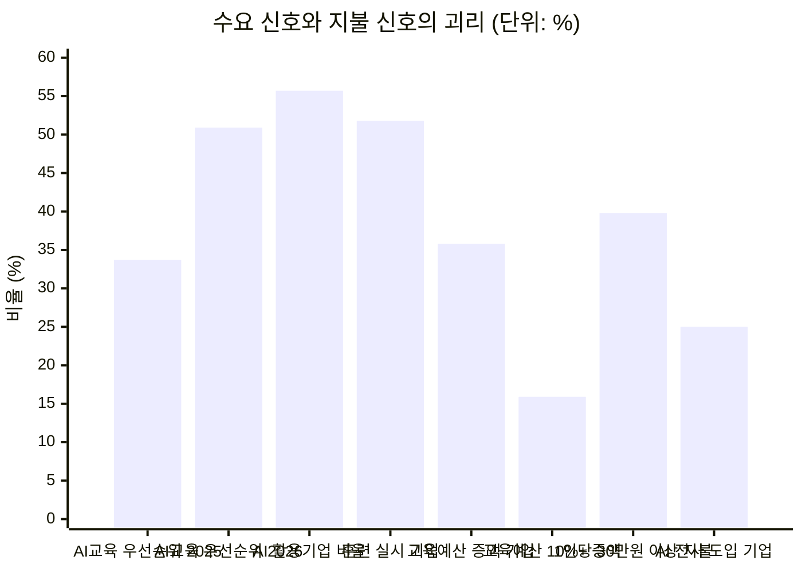
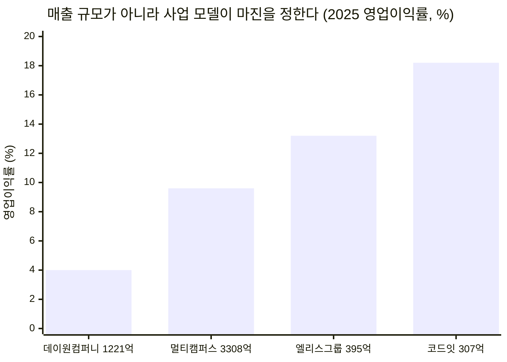
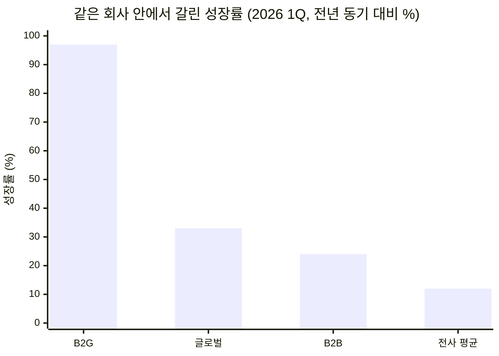
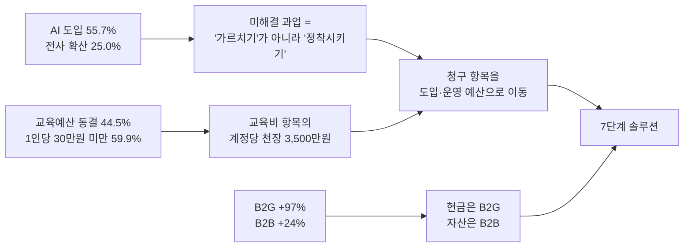

# 딥 리서치 — AI AX/DX 교육 중심 에듀테크 산업 (1~6단계)

리서치 수행 시점: 2026년 8월 · 적용 방법론: [딥 리서치 7단계](./methodology.md)

선행 문서
- [Ch01 5가지 힘 — AX/DX 교육 산업](../01-porters-five-forces/case-01-ai-education-edtech.md) (압박 23/25) — 이하 **[1A]**
- [Ch02 가치사슬 — AX/DX 교육 사업자](../02-value-chain/case-01-ai-education-edtech.md) — 이하 **[2A]**
- [Ch03 신규 진입자 Top 5 KSF](../03-ksf/new-entrant-top5-ksf.md) — 이하 **[3]**

7단계 솔루션은 별도 문서 → **[AX 정착·성과 계측 플랫폼 솔루션 및 SRS](./solution-ax-adoption-platform.md)**

---

## 0. 이 리서치가 하는 일

Ch01과 Ch02는 구조 분석이었고, 둘 다 마지막 절이 **"검증이 필요한 가정"** 체크리스트로 끝났습니다. 구조는 그렸지만 숫자가 없다는 자기 고백입니다. 이 문서는 그 빈칸을 채웁니다.

Ch01의 핵심 진단은 한 문장이었습니다. **"시장은 빠르게 커지는데, 그 성장이 이익으로 남지 않는 구조다."** 이 문장은 두 개의 주장을 담고 있습니다.

1. 시장이 빠르게 커진다
2. 그 성장이 이익으로 남지 않는다

리서치의 목표는 이 두 주장을 각각 숫자로 확인하는 것입니다. 그리고 실제로 확인해보니 **첫 번째 주장부터 수정이 필요**했습니다.

---

## 1단계 — 광범위한 탐색

### 던진 질문

> "국내 기업이 AI 역량 확보에 실제로 얼마를 쓰고 있으며, 그 지출이 어디로(교육·툴·컨설팅) 흘러가고, 왜 교육 사업자들은 그 성장을 이익으로 바꾸지 못하는가?"

원인(왜 이익이 안 남는가)과 규모(얼마를 쓰는가)를 한 질문에 결합했습니다. 두 축을 분리하면 원인은 Ch01의 반복이 되고, 규모는 맥락 없는 시장조사 숫자가 됩니다.

### 이 단계에서 드러난 지형

탐색 결과 이 주제는 **서로 다른 방향을 가리키는 신호가 공존**하는 영역이었습니다.

| 방향 | 관찰된 신호 |
|---|---|
| 확장 신호 | 기업 교육훈련 실시율 3년 연속 상승, 생성형 AI 활용 기업 과반 돌파, 정부 AI 훈련 예산 대폭 증액 |
| 수축 신호 | 국내 매출 상위 기업교육 사업자들의 **역성장**, 교육 예산 동결 응답이 최다, 1인당 교육비 기대치는 연 30만 원 미만 |

이 공존이 리서치할 가치가 있는 지점입니다. 신호가 한 방향이면 확인만 하면 되지만, 갈라지면 그 사이에 구조가 있습니다.

---

## 2단계 — 범위 축소

깔때기 제약 네 가지를 확정했습니다.

| 제약 | 확정 내용 | 확정 근거 |
|---|---|---|
| **대상** | 국내 **B2B 기업교육** 중심. B2G·구독형 플랫폼은 보조 축 | [1A] §0의 시장 정의를 승계. B2C 성인교육과 K-12는 구매 의사결정 구조가 완전히 달라 같은 축에 놓을 수 없음 |
| **지역** | 국내(한국). 글로벌은 **비교 기준선**으로만 사용 | 구매 단위(HRD 예산·정부 훈련 예산)가 국가 제도에 종속됨 |
| **기간** | 2022~2026년 (실적 5개년, 전망 1개년) | 생성형 AI 상용화 이전(2022)을 기준선으로 포함해야 '증가분'이 계산됨 |
| **핵심 지표** | **비율 우선, 절대량 보조** | 국내 AI 교육만 분리한 공식 통계가 존재하지 않음. 따라서 "교육 예산 중 AI 교육 비중", "역성장 여부" 같은 비율 지표가 절대 규모 추정보다 신뢰도가 높음 |

**핵심 지표를 비율로 잡은 것이 이 리서치의 가장 중요한 방법론적 결정입니다.** 국내에는 "AX 교육 시장 규모 O조 원" 같은 공식 수치가 없습니다. 없는 숫자를 추정으로 만들어내면 이후 모든 논증이 그 추정 위에 얹힙니다. 대신 실측 가능한 비율을 쌓아 규모를 후행적으로 좁히는 방식을 택했습니다.

### 의도적으로 제외한 것

- **K-12 AI 교육·AI 디지털교과서**: 공교육 예산 사이클과 B2G 조달 구조가 별개
- **개인 대상 B2C 강의**: [1A]에서 이미 무료 대체재에 붕괴한다고 결론
- **어학·법정의무교육**: AI 역량과 무관하나 기업교육 예산을 잠식하므로 §6에서 경합 관계로만 다룸

---

## 3단계 — 1차 분석: 수요는 실재하는가

먼저 거시 토대를 깝니다. **"기업이 AI 교육을 원한다"가 인상이 아니라 사실인지**부터 확인했습니다.

### 3-1. 교육 수요 자체가 커지고 있다 (사실)

| 지표 | 2022 | 2023 | 2024(최신 기준) | 출처 |
|---|---|---|---|---|
| 재직자 교육훈련 실시 기업 비율 | 39.4% | 43.7% | **51.8%** | 기업직업훈련 실태조사(2025년 공표) |
| 원격훈련 도입 기업 비율 | — | 38.6% | **58.4%** (+19.8%p) | 동일 |
| 현장훈련(OJT) 실시 기업 비율 | — | 60.4% | **71.1%** (+10.7%p) | 동일 |
| 2026년 훈련 실시 계획 기업 | — | — | **52.8%** | 동일 |

3년 연속 상승이고 상승폭도 커지고 있습니다. 교육 수요의 확대는 논쟁의 여지가 없습니다.

### 3-2. AI가 교육 의제의 1순위가 됐다 (사실)

371개 기업 인사·교육 담당자 조사 결과입니다.

| 항목 | 결과 |
|---|---|
| 2025년 가장 많이 투자한 교육 분야 | **AI 교육 33.7%** (1위) |
| 2026년 중점 투자 예정 분야 | **AI 교육 50.9%** (1위) |

1년 만에 **+17.2%p**입니다. 기업교육 안에서 AI의 지분이 절반을 넘어섭니다.

### 3-3. 수요의 원인도 확인된다 (사실)

| 지표 | 값 |
|---|---|
| 국내 기업 생성형 AI 활용률 | **55.7%** (2025) → 85% 전망 (2026) |
| 활용 기업 중 **전사** 도입 | **25.0%** (126/503개사) |
| 활용 기업 중 **일부 부서만** 도입 | 75.0% (378/503개사) |
| 대기업 전사 활용률 | 35.1% (중소·중견의 2배 이상) |
| AI 도입 저해요인 1위 | **AI 기술·지식·전문성 부족 45%** |
| AI 도입 저해요인 2위 | 도구·플랫폼 부족 39% |
| AI 도입 저해요인 3위 | 지나치게 높은 가격 33% |

**여기서 이 리서치 전체를 관통하는 사실이 하나 나옵니다.** 도입률은 55.7%인데 전사 확산은 25%에 그칩니다. 도입한 기업의 4분의 3이 "일부 부서에서만" 쓰고 있고, 그 정체의 1순위 원인으로 기업들이 직접 지목한 것이 **전문성 부족(45%)**입니다.

즉 고객의 문제는 "AI를 모른다"가 아니라 **"도입했는데 퍼지지 않는다"** 입니다. [1A]가 정의한 고객의 진짜 욕구 — "임직원이 AI로 실제 성과를 내는 것" — 가 실측 데이터로 확인된 셈입니다.

### 3-4. 그런데 사업자 실적은 반대 방향이다 (이상 신호)

수요가 이만큼 확실한데, 국내 매출 상위 사업자들은 2025년 결산에서 역성장했습니다.

| 사업자 | 2025 매출 | 전년 대비 | 2025 영업이익 |
|---|---|---|---|
| 멀티캠퍼스 | 3,308억 원 | **-6.2%** | 약 319억 원(감소율 역산) / **-18.1%** |
| 데이원컴퍼니(패스트캠퍼스) | 1,220.9억 원 | **-4.4%** | 48.5억 원 (상장 후 첫 흑자) |

수요 지표는 전부 상승, 상위 사업자 매출은 하락. 3단계는 여기서 멈추고 4단계로 넘어갑니다. **이 모순이 가설이 서는 자리입니다.**

---

## 4단계 — 가설 수립

3단계가 남긴 질문은 이것입니다. *"수요가 확실히 커졌는데 왜 파는 쪽 매출은 줄었는가?"*

가능한 설명은 여러 개입니다. ① 성장이 신규 사업자에게 갔다 ② 단가가 무너졌다 ③ 예산이 교육 밖으로 샜다 ④ 애초에 예산 총액이 안 늘었다. 이 중 하나를 골라 명제로 세웁니다.

### 주 가설 (H1) — 대체 성장 가설

> **"AI 교육의 성장은 신규 예산의 유입이 아니라, 고정된 교육 예산 안에서 다른 교육 항목을 밀어낸 자리 이동이다."**

**반증 조건**: 2026년 교육 예산을 늘리겠다는 기업이 과반이면 이 가설은 기각된다.

### 보조 가설

| # | 가설 | 반증 조건 |
|---|---|---|
| **H2** | 지불 의사의 상한은 1인당 연 30만 원 수준이며, 이것이 계정당 매출에 천장을 만든다 | 1인당 연 50만 원 이상 응답이 다수면 기각 |
| **H3** | 성장의 유무를 가르는 것은 사업 규모가 아니라 **사업 모델**이다. 강사 시간을 파는 쪽은 역성장하고, 자산·플랫폼으로 파는 쪽은 성장한다 | 소규모·자산형 사업자도 함께 역성장하면 기각 |
| **H4** | 민간 B2B 예산이 정체된 동안 실제 성장은 **B2G로 이동**했다 | B2G 성장률이 전체 성장률과 비슷하면 기각 |

H1이 참이면 [1A]의 진단 첫 줄 — "시장은 빠르게 커진다" — 을 **"수요는 커지지만 지출 총액은 커지지 않는다"** 로 수정해야 합니다. 신규 진입자에게 이 차이는 결정적입니다. 커지는 파이에 들어가는 것과 고정된 파이에서 남의 몫을 빼앗는 것은 완전히 다른 전략을 요구하기 때문입니다.

---

## 5단계 — 정량 검증과 시각화

### 5-1. H1 검증 — 예산은 늘지 않는다

371개사에 물은 2026년 교육 예산 계획입니다.

| 응답 | 비율 |
|---|---|
| 동결 | **44.5%** |
| 0~10% 증가 | 19.9% |
| 10% 이상 증가 | 15.9% |
| 0~10% 감소 | 8.6% |
| 10% 이상 감소 | 4.3% |
| 미정 | 6.7% |
| **증액 합계** | **35.8%** |
| **동결·감액 합계** | **57.4%** |

**H1 지지.** 예산을 늘리겠다는 기업은 3분의 1을 겨우 넘고, 동결·감액이 과반입니다. 반증 조건("증액이 과반")은 충족되지 않았습니다.

같은 조사에서 AI 교육 비중은 33.7% → 50.9%로 뛰었습니다. 두 숫자를 나란히 놓으면 결론은 하나뿐입니다.

**차트 읽는 법** — 왼쪽 네 개는 수요 신호, 오른쪽 네 개는 지불 신호입니다. 수요 지표는 전부 30~56% 구간에서 상승 중인데, 지불 지표는 예산 10% 이상 증액이 15.9%, 전사 도입이 25.0%로 주저앉습니다. 방법론에서 말한 **병치**의 전형입니다. 따로 보면 "AI 교육이 뜬다"와 "예산은 빠듯하다"라는 두 개의 사실이지만, 같은 축에 올리면 **하나의 구조**가 됩니다.

**해석**: AI 교육의 성장분 +17.2%p는 새 돈이 아니라 리더십·직무·조직문화 교육에서 빼앗아 온 자리입니다. 신규 진입자에게 이것은 "성장 시장 진입"이 아니라 **기존 교육 항목과의 예산 쟁탈전**입니다.

### 5-2. H2 검증 — 계정당 매출에는 천장이 있다

| 1인당 연간 적정 교육비 | 응답 비율 |
|---|---|
| 10만 원 미만 | 15.4% |
| 10~30만 원 | **44.5%** |
| 30~50만 원 | 26.1% |
| 50만 원 이상 | 13.7% |
| **30만 원 미만 합계** | **59.9%** |

**H2 지지.** 60%가 1인당 연 30만 원 미만을 적정선으로 봅니다.

이 숫자에서 **계정당 매출 상한**을 계산할 수 있습니다. (모든 항목이 실측이 아닌 **구조적 추정**임을 명시합니다.)

| 단계 | 계산 | 결과 |
|---|---|---|
| 1,000명 규모 기업의 연간 교육 예산 | 1,000명 × 20만 원(10~30만 구간 중앙) | **2.0억 원** |
| 그중 AI 교육 몫 | 2.0억 × 50.9% | **1.02억 원** |
| 복수 벤더 경쟁 반영 | 1.02억 ÷ 2~4개 벤더 | **2,500만~5,000만 원** |
| 연 매출 30억을 만들려면 | 30억 ÷ 계정당 3,500만 원 | **약 86개 대기업 계정** |

[1A]는 구매자 교섭력을 5/5로 매기며 "구매자는 복수 벤더를 항상 옆에 세워둔다"고 진단했습니다. 그 진단이 여기서 금액으로 번역됩니다. **1,000명 규모 대기업 한 곳에서 뽑을 수 있는 AI 교육 매출이 연 3,500만 원 안팎**이라면, 신규 진입자가 교육비 항목만으로 의미 있는 규모에 도달하는 경로는 산술적으로 막혀 있습니다.

> **이 계산이 7단계 솔루션의 출발점입니다.** 문제는 제품 품질이 아니라 **청구하는 예산 항목**입니다.

### 5-3. H3 검증 — 규모가 아니라 사업 모델이 갈랐다

2025년 결산 기준 국내 주요 사업자입니다.

| 사업자 | 2025 매출 | 매출 증감 | 영업이익 | 영업이익률 | 지배적 수익 형태 |
|---|---|---|---|---|---|
| 멀티캠퍼스 | 3,308억 원 | -6.2% | 약 319억 원(역산) | 약 9.6% | 대기업 계열 종합 기업교육 |
| 데이원컴퍼니 | 1,220.9억 원 | -4.4% | 48.5억 원 | **4.0%** | B2C 성인교육 중심 |
| 휴넷 | 826.6억 원 | 미확인 | 미확인 | — | 구독형 멤버십·법정의무교육 |
| 엘리스그룹 | 395억 원(연결) | 증가 | 52억 원 | **13.2%** | AI 교육 SaaS·클라우드 |
| 코드잇 | 307억 원 | **2023년 41억 → 7.5배** | 56억 원 | **18.2%** | 콘텐츠 자산 + 대기업 임직원 AI 교육 |

**H3 지지.** 매출 순서와 이익률 순서가 **정확히 반대**입니다. 매출 1위 멀티캠퍼스는 역성장했고, 매출 최하위 코드잇은 2년 만에 7.5배 성장하며 이익률 18.2%로 1위입니다.

이것은 [2A]의 마진 진단을 실적으로 확인해 준 결과입니다.

> "이 사업의 수익성은 강의를 잘하는 정도가 아니라, **사람이 하던 일을 재사용 가능한 자산으로 바꾼 정도**로 결정된다." ([2A] §4)

**반증도 함께 기록합니다.** 엘리스그룹은 영업이익이 2022년 83억에서 2025년 52억으로 37% 감소했고, 원인은 감가상각비가 52억 → 126억으로 두 배 이상 늘어난 것입니다. **자산화는 곧바로 마진이 되지 않으며, 선투자 구간에서는 오히려 이익을 깎습니다.** H3은 방향으로는 맞지만 "자산화하면 즉시 남는다"는 단순 명제로 읽어서는 안 됩니다.

### 5-4. H4 검증 — 성장은 B2G로 이동했다

데이원컴퍼니의 2026년 1분기 부문별 실적입니다. 전사 매출이 감소했던 회사에서 부문별로는 전혀 다른 그림이 나옵니다.

| 부문 | 매출 | 전년 동기 대비 |
|---|---|---|
| **B2G** | 71억 원 | **+97%** |
| 글로벌 | 51억 원 | +33% |
| B2B | 28억 원 | +24% |
| 전사 | 303억 원 | +12% |
| 공헌이익률 | — | 53.1% (역대 최고) |

**H4 지지.** B2G 성장률 97%는 전사 평균 12%의 8배입니다.

정책 측 데이터도 같은 방향입니다.

| 항목 | 규모 |
|---|---|
| 2026년 고용노동부 예산 | 37조 6,761억 원 (+6.6%, +2조 3,309억) |
| K-디지털 트레이닝 'AI 캠퍼스' | 연 약 **1,300억 원**, AI 전문인력 1만 명 목표 |
| 2026년 추경 K-디지털 트레이닝 | **+524억 원** |

민간 HRD 예산이 44.5% 동결인 동안, 정부는 AI 훈련에 두 자릿수로 증액하고 있습니다. **현재 국내 AX 교육 시장에서 예산이 실제로 늘어나는 곳은 정부 한 곳뿐입니다.**

### 5-5. 글로벌 기준선 — 성장률과 규모를 혼동하지 않기

| 지표 | 2026년 | 전망 | CAGR |
|---|---|---|---|
| 글로벌 기업교육 시장 전체 | $458.7B | $777.5B (2033) | 7.8% |
| 글로벌 AI 기반 기업교육 | **$7.49B** | $18.19B (2031) | **19.43%** |
| AI 교육이 전체에서 차지하는 비중 | **1.63%** | — | — |

성장률만 보면 AI 교육은 전체 기업교육의 2.5배 속도로 큽니다. 하지만 **절대 규모는 아직 전체의 1.6%**입니다.

이 두 숫자를 함께 봐야 하는 이유는 [1A] §3이 이미 경고한 그대로입니다. "성장률과 수익성은 다른 축이다." 여기에 하나를 더합니다. **성장률과 규모도 다른 축입니다.** 19.43%라는 CAGR은 사업계획서를 설득력 있게 만들지만, 1.63%라는 비중은 그 위에 세울 수 있는 사업의 크기를 제한합니다.

---

## 6단계 — 반복 정제

초기 결론은 "AI 교육 시장은 수요는 있으나 돈이 안 된다"였습니다. 세분화해 보니 이 문장은 **너무 뭉뚱그려져 있어 실행에 쓸 수 없었습니다.** 세 번 쪼갰습니다.

### 정제 1 — "시장"을 구매 주체로 분해

| 세그먼트 | 예산 방향 | 성장률 | 전환비용 형성 | 신규 진입자 관점 |
|---|---|---|---|---|
| **B2C 성인교육** | 축소 | 역성장 | 없음 | 진입 금지 — 무료 대체재에 직접 노출 |
| **B2B (HRD 예산)** | **동결 44.5%** | 저성장 | **가능** | 규모는 안 나오나 **자산이 쌓이는 유일한 곳** |
| **B2B (현업·DX 예산)** | 증가 추정 | 미측정 | 가능 | **미탐색 영역 — 7단계의 표적** |
| **B2G (정부 훈련)** | **증액** | **+97%** | 없음(매년 재입찰) | 현금흐름원이나 자산은 안 쌓임 |

**Ch01 결론 하나를 수정합니다.** [1A] §4는 "하면 안 되는 것"에 **"B2G 매출 의존"**을 넣었습니다. 논거는 단일 구매자에게 가격 결정권을 넘긴다는 것이었고, 그 논거 자체는 데이터로도 여전히 옳습니다. 다만 데이터는 B2G가 **현재 유일하게 예산이 증가하는 세그먼트**임을 보여줍니다.

수정된 결론:

> **B2G는 의존 대상이 아니라 감가상각 회수 수단이다.** 모델 세대 교체로 콘텐츠가 조기 폐기되는 원가 구조([1A] 2-1, [2A] §4)에서, B2G는 이미 만든 콘텐츠의 제작비를 회수해 주는 채널로 쓸 수 있다. 그러나 **전환비용과 축적 루프는 B2G에서 생기지 않는다.** 매년 재입찰이므로 관계가 리셋되기 때문이다. 따라서 **현금은 B2G에서, 자산은 B2B에서** — 두 세그먼트의 역할을 분리해야 한다.

이것은 [3]의 KSF 3번(전환비용의 인위적 설계)과 4번(축적 루프)에 세그먼트 조건을 붙인 것입니다. 두 KSF는 **B2B 계정에서만 성립합니다.**

### 정제 2 — "돈이 안 된다"를 예산 항목으로 분해

5-2의 계정당 상한 계산은 **암묵적 전제 하나** 위에 서 있었습니다. 우리가 HRD 교육비 항목에서 청구한다는 전제입니다. 이 전제를 풀면 그림이 달라집니다.

| 청구 항목 | 예산 소유자 | 예산 방향 | 계정당 규모(1,000명 기업 추정) | 심사 기준 |
|---|---|---|---|---|
| 교육훈련비 | HRD | **동결** | 2,500만~5,000만 원 | 이수율·만족도 |
| AI 도입·운영비 | DX·IT | 증가 | 교육비의 수 배 | 도입 성과·활용률 |
| 현업 부서 사업예산 | 현업 부서장 | 성과 연동 | 부서 재량 | 업무 지표 개선 |
| 컨설팅·구축비 | 경영기획·DX | 증가 | 교육비의 수 배 | 프로젝트 산출물 |

[1A]는 컨설팅·SI를 **대체재**로 분류하며 "같은 예산을 두고 경합한다"고 했습니다. 정제해 보면 이 서술은 부정확합니다. **같은 예산이 아니라 더 큰 예산입니다.** 컨설팅·구축은 교육비가 아닌 도입·운영 예산에서 나가며, 그 예산은 동결되지 않았습니다.

> **정제된 진단: 이 산업이 돈이 안 되는 것이 아니라, 교육비 항목이 돈이 안 되는 것이다.** 같은 고객, 같은 문제인데 청구서를 어느 부서에 보내느냐로 상한이 달라진다.

[2A]가 이미 이 경로를 설계해 두었습니다. "진단 → 파일럿 교육 → 전사 확산 → 사내 AI 도입 컨설팅"이라는 확장 경로이고, "Ch01에서 대체재였던 컨설팅·구축을 자기 매출로 흡수하는 경로"라고 명시되어 있습니다([2A] 2-4). 리서치는 이 설계가 **선택지가 아니라 생존 조건**임을 숫자로 확인했습니다.

### 정제 3 — 고객의 문제를 다시 정의

3-3의 두 숫자를 다시 붙입니다.

| 관찰 | 값 |
|---|---|
| AI를 도입한 기업 | 55.7% |
| 그중 전사로 확산된 기업 | 25.0% |
| 확산을 막는 1순위 원인 | 전문성 부족 45% |

**미해결 과업은 "가르치는 것"이 아니라 "도입한 AI가 실제로 쓰이게 만드는 것"입니다.** 교육은 그 과업의 수단 중 하나일 뿐이며, 고객은 수단이 아니라 결과에 예산을 배정합니다.

그리고 이 재정의는 5-2의 천장 문제를 동시에 풉니다. **"AI 정착률을 올린다"는 도입·운영 예산에서 청구할 수 있는 명분이지만, "AI 교육을 한다"는 교육비 항목을 벗어나지 못합니다.**

### 정제 4 — 결론 문장의 교체

| | 문장 |
|---|---|
| **Ch01의 결론** | 시장은 빠르게 커지는데, 그 성장이 이익으로 남지 않는 구조다 |
| **리서치 후 수정** | **수요는 확실히 커졌지만 교육 예산 총액은 커지지 않았다. 성장은 ① 정부 예산과 ② 도입·운영 예산으로 갔고, 교육비 항목에 남은 것은 자리 이동뿐이다.** |

Ch01은 "커지는 파이에서 이익이 안 남는다"고 봤고, 리서치는 "**파이 자체가 안 커졌고, 커진 파이는 옆 접시에 있다**"는 것을 보여줍니다. 신규 진입자에게 이 차이는 전략의 방향을 바꿉니다. 전자라면 원가와 차별화의 문제이고, 후자라면 **어느 접시에 앉을 것인가의 문제**입니다.

---

## 7. 검증 결과 종합

| 가설 | 판정 | 결정적 근거 |
|---|---|---|
| **H1** AI 교육 성장은 신규 예산이 아닌 자리 이동 | **지지** | AI 교육 비중 +17.2%p vs 예산 증액 기업 35.8%(동결·감액 57.4%) |
| **H2** 1인당 연 30만 원이 계정당 매출 천장을 만든다 | **지지** | 30만 원 미만 응답 59.9% → 1,000명 기업 계정당 2,500만~5,000만 원(추정) |
| **H3** 규모가 아니라 사업 모델이 성패를 가른다 | **지지(단서 있음)** | 매출 순서와 이익률 순서가 역전. 단 엘리스 사례가 자산화 선투자 구간의 이익 감소를 보여줌 |
| **H4** 성장은 B2G로 이동했다 | **지지** | 데이원컴퍼니 B2G +97% vs 전사 +12%, KDT AI캠퍼스 연 1,300억 |

### Ch01·Ch02 체크리스트 해소 현황

| 검증 항목 | 상태 | 결과 |
|---|---|---|
| 국내 기업교육 중 AI/AX 지출 규모와 성장률 | **부분 해소** | 절대 규모는 공식 통계 부재. 비중(33.7→50.9%)과 예산 방향(동결 44.5%)으로 대체 검증 |
| 정부 재정지원 훈련 예산 추이 | **해소** | 고용부 2026년 37.7조(+6.6%), KDT AI캠퍼스 1,300억, 추경 +524억 |
| 기업 HRD의 벤더 교체 주기 / 전환비용 | **미해소** | 공개 데이터 없음. 계정당 매출 상한 계산에 벤더 2~4개 분할을 가정으로 사용 |
| AX 예산의 교육/컨설팅/툴 배분 비율 | **미해소** | 정성적 구조(정제 2)까지만 확인. **다음 리서치 1순위** |
| 모델 제공사 무료 교육의 국내 채택률 | **미해소** | 공개 데이터 없음 |
| 매출원가 중 강사료 비중 | **간접 해소** | 데이원컴퍼니 공헌이익률 53.1%가 변동비 구조의 대리 지표 |

---

## 8. 이 리서치의 한계

결론을 쓰기 전에 무엇을 믿으면 안 되는지 먼저 적습니다.

1. **국내 AI 교육 시장의 절대 규모는 여전히 미확정입니다.** 공식 분류 통계가 없어 비율 지표로 우회했습니다. §5-2의 계정당 매출 상한은 **실측이 아니라 구조적 추정**이며, 벤더 분할 수(2~4개)는 가정입니다.
2. **휴넷 설문(371개사)은 표본 편향 가능성이 있습니다.** 응답 기업이 이미 기업교육에 관심 있는 집단일 수 있어, 예산 동결 비율은 오히려 실제보다 낙관적일 수 있습니다.
3. **멀티캠퍼스 2025년 영업이익은 감소율에서 역산한 값**이며 공시 원문 대조를 하지 않았습니다.
4. **엘리스그룹 매출은 출처마다 351억(2024)·386억·395억(2025 연결)으로 상이합니다.** 연결/별도 기준 차이로 보이며, 본문은 2025년 연결 기준을 채택했습니다.
5. **B2B 현업·DX 예산 규모는 측정하지 못했습니다.** 정제 2의 핵심 주장이 이 미측정 값 위에 서 있으므로, 7단계 솔루션의 **첫 PoC가 곧 이 가설의 실증 실험**이 되도록 설계했습니다.

---

## 9. 6단계까지의 결론

**하나의 문장**

> AX 교육 시장에서 팔아야 할 것은 교육이 아니라 **AI 정착률**이고, 청구서를 보낼 곳은 HRD가 아니라 **AI 도입 예산을 쥔 부서**다.

**근거 사슬**

**Ch03 KSF와의 접속** — 리서치는 [3]의 5대 KSF를 부정하지 않고 **조건을 붙였습니다.**

| KSF | 리서치가 추가한 조건 |
|---|---|
| 1. 교두보의 극단적 협소화 | 도메인뿐 아니라 **예산 항목**까지 좁혀야 한다 (§정제 2) |
| 2. 지불 근거의 선증명 | 지불 주체는 HRD가 아니라 **AI 도입 예산 소유자** (§정제 3) |
| 3. 전환비용의 인위적 설계 | **B2B 계정에서만 성립.** B2G는 매년 리셋됨 (§정제 1) |
| 4. 축적 루프의 조기 가동 | 축적 대상은 콘텐츠가 아니라 **정착률·성과 계측 데이터** (§정제 3) |
| 5. 원가 결정권의 내부화 | 자산화 선투자는 **일시적 이익 감소를 동반**한다 (§5-3 엘리스 사례) |

→ 이 조건들을 반영한 실행 계획: **[7단계 솔루션 및 SRS](./solution-ax-adoption-platform.md)**

---

## 10. 선행 리서치와의 대조

같은 주제·같은 방법론으로 수행된 선행 리서치 2건이 저장소에 있습니다. 결론이 겹치는 부분과 갈리는 부분을 밝힙니다.

- [Gemini 판](../리서치%20원문/AI_AX_EdTech_Research_Report_Gemini.md)
- [GPT 판](../리서치%20원문/AI_AX_교육_에듀테크_산업_리서치_GPT.md)

### 세 리서치가 독립적으로 도달한 같은 결론

| 결론 | Gemini | GPT | 본 문서 |
|---|---|---|---|
| 범용 AI 툴 강의는 가치가 붕괴했다 | ○ | ○ | ○ ([1A] 2-4 재확인) |
| 미해결 과업은 '학습'이 아니라 '정착' | ○ (실행 격차) | ○ (AI 교육 ≠ AI 전환) | ○ (§정제 3) |
| 해법은 진단 → 업무 과제 → 성과 측정 → 확산의 파이프라인 | ○ | ○ | ○ (§솔루션 §3-3) |
| 방어력은 콘텐츠가 아니라 도메인·프로세스 결합에서 나온다 | ○ | ○ | ○ ([3] KSF1) |

세 경로가 각각 다른 자료로 같은 제품 구조에 도달했다는 점은 이 방향에 대한 **수렴적 지지**로 볼 수 있습니다.

### 본 문서가 다르게 본 지점

| 쟁점 | 선행 리서치 | 본 문서 |
|---|---|---|
| 시장 성장 | "AI 교육 시장 연 30% 이상 성장"(Gemini), "국내 에듀테크 7.9조→10.8조"(GPT) | **교육 예산 총액은 늘지 않았다.** 증액 기업 35.8%, 동결·감액 57.4% (§5-1) |
| 5단계 검증 방식 | Gemini는 가설 모델 간 **비교표**를 제시(정착률 50% 이상 등은 가설값), GPT는 글로벌 설문(WEF·McKinsey) 인용 | 국내 사업자 **2025년 실적 실측**과 국내 기업 **설문 원수치**로 검증 (§5-3) |
| 수익 구조 | 리테이너·구독 전환으로 해결된다고 봄 | 구독 전환만으로는 부족. **청구 예산 항목 자체를 바꿔야** 계정당 천장(3,500만 원 추정)을 넘는다 (§정제 2) |
| B2G | Gemini는 B2G를 성장 타깃에 포함 | B2G는 성장하나 **전환비용이 안 생긴다.** 현금흐름원과 자산 축적처를 분리 (§정제 1) |
| 선투자 | 플랫폼·샌드박스 선구축을 전제 | 자산화 선투자는 **이익을 먼저 깎는다**(엘리스 감가상각 52→126억). 컨시어지 선행 (§5-3) |

**보완적으로 채택한 선행 자료** — 본 문서의 범위(국내 B2B) 밖이라 본문 논증에는 쓰지 않았으나 기록해 둡니다.

| 지표 | 값 | 출처 |
|---|---|---|
| 국내 에듀테크 시장 전망(K-12 포함) | 2022년 약 7.9조 원 → 2026년 약 10.8조 원 | HolonIQ 인용 국내 공시 (GPT 판) |
| 2030년까지 변화하는 핵심 스킬 | 약 39% | WEF Future of Jobs 2025 |
| 스킬 격차를 사업 전환의 장애물로 보는 기업 | 63% | 동일 |
| 기존 인력 업스킬링을 계획하는 기업 | 77% | 동일 |

WEF 수치는 §3-3의 "AI 도입 저해요인 1위 = 전문성 부족 45%"와 같은 방향이며, 이 리서치의 수요 측 진단이 국내 특수성이 아니라 **글로벌 공통 현상**임을 보여줍니다. 반대로 **지불 측 제약(예산 동결·1인당 단가 상한)은 국내 실측치에서만 확인**됐으므로, 해외 확장 시 이 부분은 재검증이 필요합니다.

---

## 출처

**공공 통계·정책**
- [2025년 기업직업훈련 실태조사 결과 — 고용노동부](https://www.moel.go.kr/info/publicdata/majorpublish/majorPublishView.do?bbs_seq=20260301088&searchDivCd=3) (2024년 기준, 10인 이상 기업)
- [한국산업인력공단 기업직업훈련 실태조사 결과 공표 — 정책브리핑](https://www.korea.kr/briefing/pressReleaseView.do?newsId=156750376)
- [기업 51.8%, 재직자 교육훈련 실시…3년 연속 증가 — 헤럴드경제](https://biz.heraldcorp.com/article/10700025)
- [K-디지털 트레이닝 'AI 캠퍼스' — 고용노동부](https://www.moel.go.kr/news/enews/report/enewsView.do?news_seq=18833)
- [K-디지털트레이닝 추경 +524억 원 — 정책브리핑](https://www.korea.kr/news/policyNewsView.do?newsId=148963353)
- [2024년 이러닝산업 실태조사 — SPRi](https://spri.kr/posts/view/23880?code=stat_sw_e-learning_reports)
- [국내기업, 근로자 1명에 월 636만원 — 뉴시스(기업체노동비용조사)](https://www.newsis.com/view/NISX20250930_0003349865)

**기업 조사·설문**
- [휴넷 '2026 기업교육 전망' 설문(371개사) — 에듀플러스](https://www.eduplusnews.com/news/articleView.html?idxno=16925)
- [생성형 AI 활용 국내 기업 2025년 55.7% → 2026년 85% 전망 — 디지털경제뉴스](http://www.denews.co.kr/news/articleView.html?idxno=33506)
- [기업의 AI 도입 현황 및 촉진 방안 분석 — KIAT 정책브리프 2025-06](https://katechtest.co.kr/assets/upload/information/%5B%EC%A0%95%EC%B1%85%EB%B8%8C%EB%A6%AC%ED%94%84%202025-06%5D%20%EA%B8%B0%EC%97%85%EC%9D%98%20AI%20%EB%8F%84%EC%9E%85%20%ED%98%84%ED%99%A9%20%EB%B0%8F%20%EC%B4%89%EC%A7%84%20%EB%B0%A9%EC%95%88%20%EB%B6%84%EC%84%9D_KIAT.pdf)
- [한국 기업, '효율성 및 비용 절감'이 주요 AI 도입 요인 — 보안뉴스](https://m.boannews.com/html/detail.html?idx=107290)
- [2025 HRD 트렌드 리포트 — 한국생산성본부](https://www.kpc.or.kr/download/pt/KPC_2025_HRD_Trend_Report.pdf)

**사업자 실적**
- [멀티캠퍼스 Snapshot — FnGuide](https://comp.fnguide.com/SVO2/ASP/SVD_Main.asp?pGB=1&gicode=A067280&MenuYn=Y&ReportGB=B&NewMenuID=Y&stkGb=701)
- [멀티캠퍼스 1분기 영업이익 47억원 — 디지털투데이](https://www.digitaltoday.co.kr/news/articleView.html?idxno=563267)
- [데이원컴퍼니 기업정보 — 혁신의숲](https://www.innoforest.co.kr/company/CP00000793/%EB%8D%B0%EC%9D%B4%EC%9B%90%EC%BB%B4%ED%8D%BC%EB%8B%88)
- [데이원컴퍼니 1Q 매출 303억·B2G 97% 급성장 — 베타뉴스](https://www.betanews.net/article/view/beta202605180008)
- [데이원컴퍼니 1분기 매출 303억, 공헌이익률 역대 최고 — 벤처스퀘어](https://www.venturesquare.net/1083101)
- [휴넷 2025년 재무정보 — 사람인](https://m.saramin.co.kr/job-search/company-info-view/finance?csn=VEZ6R05ScWZydzd2VDI2Wm9NSHluZz09)
- [코드잇, 매출 307억·영업이익 56억 — 아웃스탠딩](https://outstanding.kr/press/1828/20260318)
- [코드잇, 2년 만에 매출 7.5배 첫 흑자 전환 — 플래텀](https://platum.kr/archives/283645)
- [엘리스그룹 IPO — 디지털데일리](https://www.ddaily.co.kr/page/view/2026060610072367600)
- [엘리스그룹 비즈니스모델 분석 — 데모데이](https://demoday.co.kr/bm-analysis/246)
- [코드스테이츠 인력 절반 감축 — 한국경제](https://www.hankyung.com/article/202308258485i)

**글로벌 기준선**
- [Corporate Training Market Size & Growth Report, 2026-2033 — Grand View Research](https://www.grandviewresearch.com/industry-analysis/corporate-training-market-report)
- [AI-Powered Corporate Training Market — Mordor Intelligence](https://www.mordorintelligence.com/industry-reports/ai-powered-corporate-training-market)
- [Corporate Training Statistics 2026 — Skillademia](https://www.skillademia.com/statistics/corporate-training-statistics)
