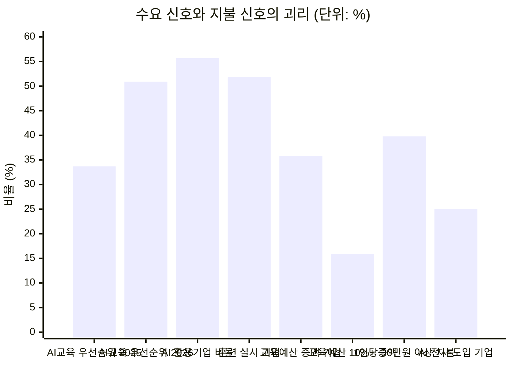
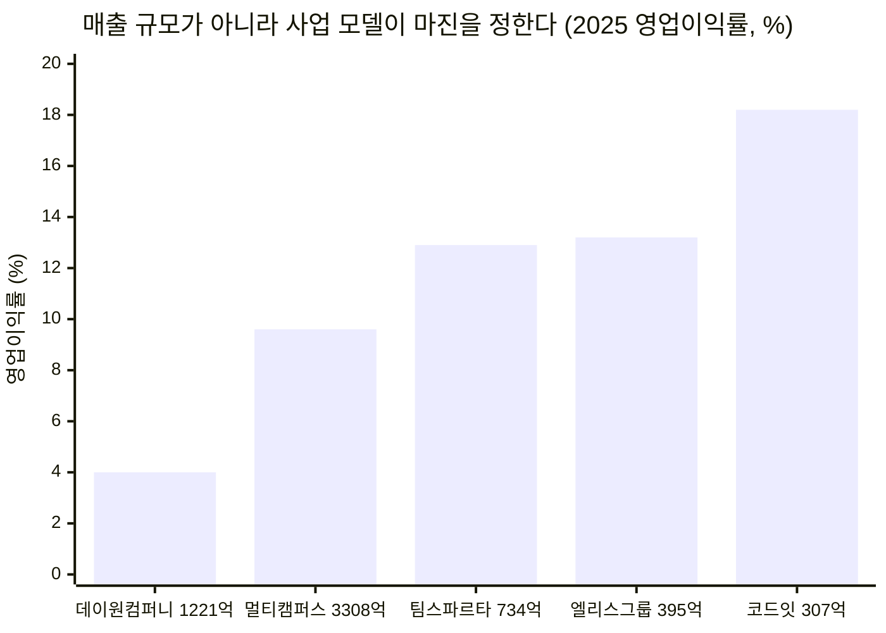
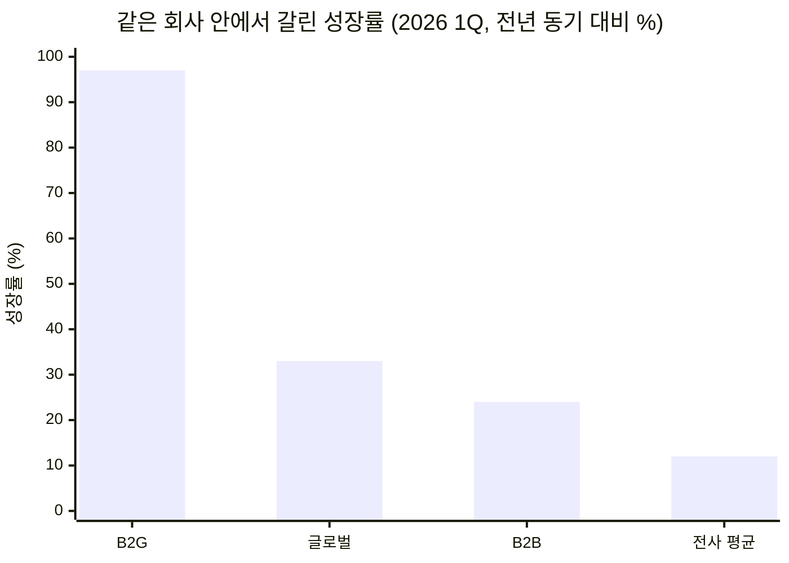
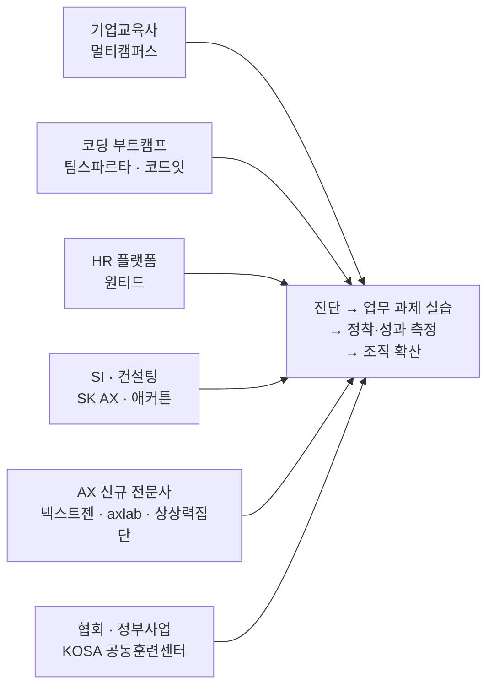
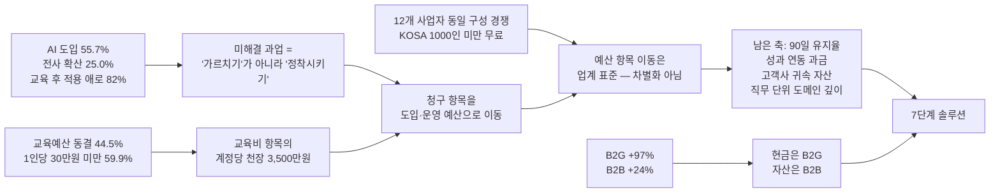
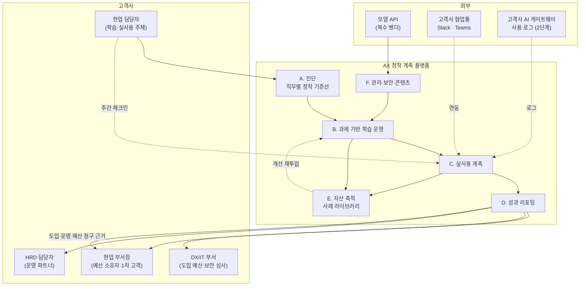

# 딥 리서치 — AI AX/DX 교육 중심 에듀테크 산업

리서치 수행 시점: 2026년 8월 · 적용 방법론: [딥 리서치 7단계](./methodology.md)

선행 문서
- [Ch01 5가지 힘 — AX/DX 교육 산업](../01-porters-five-forces/case-01-ai-education-edtech.md) (압박 23/25) — 이하 **[1A]**
- [Ch02 가치사슬 — AX/DX 교육 사업자](../02-value-chain/case-01-ai-education-edtech.md) — 이하 **[2A]**
- [Ch03 신규 진입자 Top 5 KSF](../03-ksf/new-entrant-top5-ksf.md) — 이하 **[3]**

이 문서는 1단계 탐색부터 7단계 SRS까지 한 편에 담았습니다.

| 구간 | 내용 |
|---|---|
| [1~6단계](#1단계--광범위한-탐색) | 문제 제기 → 범위 축소 → 원인 분석 → 가설 5개 → 정량 검증 → 정제 6회 |
| [중간 정산](#중간-정산--검증-결과와-한계) | 가설 판정, Ch01 평가 수정, 체크리스트 해소 현황, 리서치의 한계 8개 |
| [7단계](#7단계--솔루션-도출) | 솔루션 정의, 경쟁 포지셔닝, PoC 설계, SRS |
| [부록](#부록-a-선행-리서치와의-대조) | 선행 리서치 대조, 벤치마크 조사 설계, 출처 |

### 개정 이력

| 판 | 변경 |
|---|---|
| 초판 | 가설 H1~H4 검증, 7단계 SRS 작성 |
| **개정판(현재)** | 저장소의 선행 리서치가 남긴 단서를 추적해 **국내 AX 사업자 12개를 실사**했고, 그 결과 초판이 전제로 깔았던 "미탐색 영역" 판정이 **기각**됐습니다(H5 신설, [5-6](#5-6-h5-검증--빈-땅이-아니었다)). 이에 따라 정제 5·6을 신설하고 솔루션의 차별화 축과 PoC 목표치를 다시 세웠습니다. 경위는 [부록 A](#선행-리서치의-단서를-추적한-결과)에 기록했습니다. |

---

## 0. 이 리서치가 하는 일

Ch01과 Ch02는 구조 분석이었고, 둘 다 마지막 절이 **"검증이 필요한 가정"** 체크리스트로 끝났습니다. 구조는 그렸지만 숫자가 없다는 자기 고백입니다. 이 문서는 그 빈칸을 채웁니다.

Ch01의 핵심 진단은 한 문장이었습니다. **"시장은 빠르게 커지는데, 그 성장이 이익으로 남지 않는 구조다."** 이 문장은 두 개의 주장을 담고 있습니다.

1. 시장이 빠르게 커진다
2. 그 성장이 이익으로 남지 않는다

리서치의 목표는 이 두 주장을 각각 숫자로 확인하는 것입니다. 그리고 실제로 확인해보니 **첫 번째 주장부터 수정이 필요**했습니다.

---

## 1단계 — 광범위한 탐색

### 던진 질문

> "국내 기업이 AI 역량 확보에 실제로 얼마를 쓰고 있으며, 그 지출이 어디로(교육·툴·컨설팅) 흘러가고, 왜 교육 사업자들은 그 성장을 이익으로 바꾸지 못하는가?"

원인(왜 이익이 안 남는가)과 규모(얼마를 쓰는가)를 한 질문에 결합했습니다. 두 축을 분리하면 원인은 Ch01의 반복이 되고, 규모는 맥락 없는 시장조사 숫자가 됩니다.

### 이 단계에서 드러난 지형

탐색 결과 이 주제는 **서로 다른 방향을 가리키는 신호가 공존**하는 영역이었습니다.

| 방향 | 관찰된 신호 |
|---|---|
| 확장 신호 | 기업 교육훈련 실시율 3년 연속 상승, 생성형 AI 활용 기업 과반 돌파, 정부 AI 훈련 예산 대폭 증액 |
| 수축 신호 | 국내 매출 상위 기업교육 사업자들의 **역성장**, 교육 예산 동결 응답이 최다, 1인당 교육비 기대치는 연 30만 원 미만 |

이 공존이 리서치할 가치가 있는 지점입니다. 신호가 한 방향이면 확인만 하면 되지만, 갈라지면 그 사이에 구조가 있습니다.

---

## 2단계 — 범위 축소

깔때기 제약 네 가지를 확정했습니다.

| 제약 | 확정 내용 | 확정 근거 |
|---|---|---|
| **대상** | 국내 **B2B 기업교육** 중심. B2G·구독형 플랫폼은 보조 축 | [1A] §0의 시장 정의를 승계. B2C 성인교육과 K-12는 구매 의사결정 구조가 완전히 달라 같은 축에 놓을 수 없음 |
| **지역** | 국내(한국). 글로벌은 **비교 기준선**으로만 사용 | 구매 단위(HRD 예산·정부 훈련 예산)가 국가 제도에 종속됨 |
| **기간** | 2022~2026년 (실적 5개년, 전망 1개년) | 생성형 AI 상용화 이전(2022)을 기준선으로 포함해야 '증가분'이 계산됨 |
| **핵심 지표** | **비율 우선, 절대량 보조** | 국내 AI 교육만 분리한 공식 통계가 존재하지 않음. 따라서 "교육 예산 중 AI 교육 비중", "역성장 여부" 같은 비율 지표가 절대 규모 추정보다 신뢰도가 높음 |

**핵심 지표를 비율로 잡은 것이 이 리서치의 가장 중요한 방법론적 결정입니다.** 국내에는 "AX 교육 시장 규모 O조 원" 같은 공식 수치가 없습니다. 없는 숫자를 추정으로 만들어내면 이후 모든 논증이 그 추정 위에 얹힙니다. 대신 실측 가능한 비율을 쌓아 규모를 후행적으로 좁히는 방식을 택했습니다.

### 의도적으로 제외한 것

- **K-12 AI 교육·AI 디지털교과서**: 공교육 예산 사이클과 B2G 조달 구조가 별개
- **개인 대상 B2C 강의**: [1A]에서 이미 무료 대체재에 붕괴한다고 결론
- **어학·법정의무교육**: AI 역량과 무관하나 기업교육 예산을 잠식하므로 [6단계 정제 2](#정제-2--돈이-안-된다를-예산-항목으로-분해)에서 경합 관계로만 다룸

---

## 3단계 — 1차 분석: 수요는 실재하는가

먼저 거시 토대를 깝니다. **"기업이 AI 교육을 원한다"가 인상이 아니라 사실인지**부터 확인했습니다.

### 3-1. 교육 수요 자체가 커지고 있다 (사실)

| 지표 | 2022 | 2023 | 2024(최신 기준) | 출처 |
|---|---|---|---|---|
| 재직자 교육훈련 실시 기업 비율 | 39.4% | 43.7% | **51.8%** | 기업직업훈련 실태조사(2025년 공표) |
| 원격훈련 도입 기업 비율 | — | 38.6% | **58.4%** (+19.8%p) | 동일 |
| 현장훈련(OJT) 실시 기업 비율 | — | 60.4% | **71.1%** (+10.7%p) | 동일 |
| 2026년 훈련 실시 계획 기업 | — | — | **52.8%** | 동일 |

3년 연속 상승이고 상승폭도 커지고 있습니다. 교육 수요의 확대는 논쟁의 여지가 없습니다.

### 3-2. AI가 교육 의제의 1순위가 됐다 (사실)

371개 기업 인사·교육 담당자 조사 결과입니다.

| 항목 | 결과 |
|---|---|
| 2025년 가장 많이 투자한 교육 분야 | **AI 교육 33.7%** (1위) |
| 2026년 중점 투자 예정 분야 | **AI 교육 50.9%** (1위) |

1년 만에 **+17.2%p**입니다. 기업교육 안에서 AI의 지분이 절반을 넘어섭니다.

### 3-3. 수요의 원인도 확인된다 (사실)

| 지표 | 값 |
|---|---|
| 국내 기업 생성형 AI 활용률 | **55.7%** (2025) → 85% 전망 (2026) |
| 활용 기업 중 **전사** 도입 | **25.0%** (126/503개사) |
| 활용 기업 중 **일부 부서만** 도입 | 75.0% (378/503개사) |
| 대기업 전사 활용률 | 35.1% (중소·중견의 2배 이상) |
| AI 도입 저해요인 1위 | **AI 기술·지식·전문성 부족 45%** |
| AI 도입 저해요인 2위 | 도구·플랫폼 부족 39% |
| AI 도입 저해요인 3위 | 지나치게 높은 가격 33% |

**여기서 이 리서치 전체를 관통하는 사실이 하나 나옵니다.** 도입률은 55.7%인데 전사 확산은 25%에 그칩니다. 도입한 기업의 4분의 3이 "일부 부서에서만" 쓰고 있고, 그 정체의 1순위 원인으로 기업들이 직접 지목한 것이 **전문성 부족(45%)**입니다.

즉 고객의 문제는 "AI를 모른다"가 아니라 **"도입했는데 퍼지지 않는다"** 입니다. [1A]가 정의한 고객의 진짜 욕구 — "임직원이 AI로 실제 성과를 내는 것" — 가 실측 데이터로 확인된 셈입니다.

### 3-4. 교육을 해도 적용이 안 된다 (사실)

3-3이 "도입은 했으나 확산이 안 된다"를 보여줬다면, 다음 조사는 **"교육을 해도 적용이 안 된다"** 를 보여줍니다. HRD 담당자·교육기획자·C레벨 등 의사결정권자 330명 조사입니다.

| 지표 | 값 |
|---|---|
| AI 교육의 필요성에 동의 | **97%** |
| 교육을 시행한 기업 중 **실무 적용 애로를 경험** | **82%** |
| AI 전환 장애요인 1위 | **직원 간 AI 활용 수준 차이 55%** |
| 현업 적용률 — **전사 동일 교육** | **11%** |
| 현업 적용률 — **역량 진단 기반 수준별 교육** | **32%** |
| AX 성숙도 — IT 대기업 / 제조·생산 중소기업 | 68점 / 28점 |
| AI 도입 실행률 — 대기업 / 중견 / 중소 | 76% / 50% / 46% |

**이 조사에서 나온 가장 값진 숫자는 11%와 32%입니다.** 진단 없이 전사에 같은 교육을 뿌리면 현업 적용률이 11%, 진단해서 수준별로 나누면 32%. **3배 차이**이고, 이것이 진단·개인화의 효과 크기에 대한 국내 실측치입니다.

동시에 이 숫자는 경고이기도 합니다. **가장 잘한 경우도 32%**입니다. 나머지 68%는 여전히 적용되지 않습니다. 뒤에서 설계하는 솔루션의 목표치는 이 실측 상한을 알고 세워야 합니다.

### 3-5. 그런데 사업자 실적은 반대 방향이다 (이상 신호)

수요가 이만큼 확실한데, 국내 매출 상위 사업자들은 2025년 결산에서 역성장했습니다.

| 사업자 | 2025 매출 | 전년 대비 | 2025 영업이익 |
|---|---|---|---|
| 멀티캠퍼스 | 3,308억 원 | **-6.2%** | 약 319억 원(감소율 역산) / **-18.1%** |
| 데이원컴퍼니(패스트캠퍼스) | 1,220.9억 원 | **-4.4%** | 48.5억 원 (상장 후 첫 흑자) |

수요 지표는 전부 상승, 상위 사업자 매출은 하락. 3단계는 여기서 멈추고 4단계로 넘어갑니다. **이 모순이 가설이 서는 자리입니다.**

---

## 4단계 — 가설 수립

3단계가 남긴 질문은 이것입니다. *"수요가 확실히 커졌는데 왜 파는 쪽 매출은 줄었는가?"*

가능한 설명은 여러 개입니다. ① 성장이 신규 사업자에게 갔다 ② 단가가 무너졌다 ③ 예산이 교육 밖으로 샜다 ④ 애초에 예산 총액이 안 늘었다. 이 중 하나를 골라 명제로 세웁니다.

### 주 가설 (H1) — 대체 성장 가설

> **"AI 교육의 성장은 신규 예산의 유입이 아니라, 고정된 교육 예산 안에서 다른 교육 항목을 밀어낸 자리 이동이다."**

**반증 조건**: 2026년 교육 예산을 늘리겠다는 기업이 과반이면 이 가설은 기각된다.

### 보조 가설

| # | 가설 | 반증 조건 |
|---|---|---|
| **H2** | 지불 의사의 상한은 1인당 연 30만 원 수준이며, 이것이 계정당 매출에 천장을 만든다 | 1인당 연 50만 원 이상 응답이 다수면 기각 |
| **H3** | 성장의 유무를 가르는 것은 사업 규모가 아니라 **사업 모델**이다. 강사 시간을 파는 쪽은 역성장하고, 자산·플랫폼으로 파는 쪽은 성장한다 | 소규모·자산형 사업자도 함께 역성장하면 기각 |
| **H4** | 민간 B2B 예산이 정체된 동안 실제 성장은 **B2G로 이동**했다 | B2G 성장률이 전체 성장률과 비슷하면 기각 |
| **H5** | 현업 밀착형 AX 영역(진단·업무 과제 실습·정착 계측)은 아직 **선점되지 않은 빈 땅**이다 | 다수 사업자가 이미 같은 구성으로 영업 중이면 기각 |

**H5는 뒤늦게 추가된 가설입니다.** 처음 리서치에서는 이것을 가설이 아니라 전제로 깔았습니다. 검증하지 않은 전제 위에 솔루션을 세운 것을 발견하고 [5-6](#5-6-h5-검증--빈-땅이-아니었다)에서 별도로 검증했으며, **결과는 기각**입니다.

H1이 참이면 [1A]의 진단 첫 줄 — "시장은 빠르게 커진다" — 을 **"수요는 커지지만 지출 총액은 커지지 않는다"** 로 수정해야 합니다. 신규 진입자에게 이 차이는 결정적입니다. 커지는 파이에 들어가는 것과 고정된 파이에서 남의 몫을 빼앗는 것은 완전히 다른 전략을 요구하기 때문입니다.

---

## 5단계 — 정량 검증과 시각화

### 5-1. H1 검증 — 예산은 늘지 않는다

371개사에 물은 2026년 교육 예산 계획입니다.

| 응답 | 비율 |
|---|---|
| 동결 | **44.5%** |
| 0~10% 증가 | 19.9% |
| 10% 이상 증가 | 15.9% |
| 0~10% 감소 | 8.6% |
| 10% 이상 감소 | 4.3% |
| 미정 | 6.7% |
| **증액 합계** | **35.8%** |
| **동결·감액 합계** | **57.4%** |

**H1 지지.** 예산을 늘리겠다는 기업은 3분의 1을 겨우 넘고, 동결·감액이 과반입니다. 반증 조건("증액이 과반")은 충족되지 않았습니다.

같은 조사에서 AI 교육 비중은 33.7% → 50.9%로 뛰었습니다. 두 숫자를 나란히 놓으면 결론은 하나뿐입니다.

**차트 읽는 법** — 왼쪽 네 개는 수요 신호, 오른쪽 네 개는 지불 신호입니다. 수요 지표는 전부 30~56% 구간에서 상승 중인데, 지불 지표는 예산 10% 이상 증액이 15.9%, 전사 도입이 25.0%로 주저앉습니다. 방법론에서 말한 **병치**의 전형입니다. 따로 보면 "AI 교육이 뜬다"와 "예산은 빠듯하다"라는 두 개의 사실이지만, 같은 축에 올리면 **하나의 구조**가 됩니다.

**해석**: AI 교육의 성장분 +17.2%p는 새 돈이 아니라 리더십·직무·조직문화 교육에서 빼앗아 온 자리입니다. 신규 진입자에게 이것은 "성장 시장 진입"이 아니라 **기존 교육 항목과의 예산 쟁탈전**입니다.

### 5-2. H2 검증 — 계정당 매출에는 천장이 있다

| 1인당 연간 적정 교육비 | 응답 비율 |
|---|---|
| 10만 원 미만 | 15.4% |
| 10~30만 원 | **44.5%** |
| 30~50만 원 | 26.1% |
| 50만 원 이상 | 13.7% |
| **30만 원 미만 합계** | **59.9%** |

**H2 지지.** 60%가 1인당 연 30만 원 미만을 적정선으로 봅니다.

이 숫자에서 **계정당 매출 상한**을 계산할 수 있습니다. (모든 항목이 실측이 아닌 **구조적 추정**임을 명시합니다.)

| 단계 | 계산 | 결과 |
|---|---|---|
| 1,000명 규모 기업의 연간 교육 예산 | 1,000명 × 20만 원(10~30만 구간 중앙) | **2.0억 원** |
| 그중 AI 교육 몫 | 2.0억 × 50.9% | **1.02억 원** |
| 복수 벤더 경쟁 반영 | 1.02억 ÷ 2~4개 벤더 | **2,500만~5,000만 원** |
| 연 매출 30억을 만들려면 | 30억 ÷ 계정당 3,500만 원 | **약 86개 대기업 계정** |

[1A]는 구매자 교섭력을 5/5로 매기며 "구매자는 복수 벤더를 항상 옆에 세워둔다"고 진단했습니다. 그 진단이 여기서 금액으로 번역됩니다. **1,000명 규모 대기업 한 곳에서 뽑을 수 있는 AI 교육 매출이 연 3,500만 원 안팎**이라면, 신규 진입자가 교육비 항목만으로 의미 있는 규모에 도달하는 경로는 산술적으로 막혀 있습니다.

> **이 계산이 7단계 솔루션의 출발점입니다.** 문제는 제품 품질이 아니라 **청구하는 예산 항목**입니다.

### 5-3. H3 검증 — 규모가 아니라 사업 모델이 갈랐다

2025년 결산 기준 국내 주요 사업자입니다.

| 사업자 | 2025 매출 | 매출 증감 | 영업이익 | 영업이익률 | 지배적 수익 형태 |
|---|---|---|---|---|---|
| 멀티캠퍼스 | 3,308억 원 | **-6.2%** | 약 319억 원(역산) | 약 9.6% | 대기업 계열 종합 기업교육 |
| 데이원컴퍼니 | 1,220.9억 원 | **-4.4%** | 48.5억 원 | **4.0%** | B2C 성인교육 중심 |
| 휴넷 | 826.6억 원 | 미확인 | 미확인 | — | 구독형 멤버십·법정의무교육 |
| 팀스파르타 | 733.9억 원 | **+21.0%** | 95.0억 원 | **12.9%** | 부트캠프 + B2B AI 교육(**B2B 2.5배**) |
| 엘리스그룹 | 395억 원(연결) | 증가 | 52억 원 | **13.2%** | AI 교육 SaaS·클라우드 |
| 코드잇 | 307억 원 | **2023년 41억 → 7.5배** | 56억 원 | **18.2%** | 콘텐츠 자산 + 대기업 임직원 AI 교육 |

**H3 지지.** 매출 순서와 이익률 순서가 **정확히 반대**입니다. 매출 1위 멀티캠퍼스는 역성장했고, 매출 최하위 코드잇은 2년 만에 7.5배 성장하며 이익률 18.2%로 1위입니다.

**경계선이 뚜렷합니다.** 매출 1,000억 원 이상 두 곳은 모두 역성장(-6.2%, -4.4%)이고, 1,000억 원 미만 세 곳은 모두 성장(+21.0%, 증가, 7.5배)입니다. 규모가 클수록 잘 안 되는 것이 아니라, **큰 사업자들이 파는 것이 축소되는 상품(범용 집합교육·B2C 성인교육)** 이라는 뜻입니다.

이것은 [2A]의 마진 진단을 실적으로 확인해 준 결과입니다.

> "이 사업의 수익성은 강의를 잘하는 정도가 아니라, **사람이 하던 일을 재사용 가능한 자산으로 바꾼 정도**로 결정된다." ([2A] §4)

**반증도 함께 기록합니다.** 엘리스그룹은 영업이익이 2022년 83억에서 2025년 52억으로 37% 감소했고, 원인은 감가상각비가 52억 → 126억으로 두 배 이상 늘어난 것입니다. **자산화는 곧바로 마진이 되지 않으며, 선투자 구간에서는 오히려 이익을 깎습니다.** H3은 방향으로는 맞지만 "자산화하면 즉시 남는다"는 단순 명제로 읽어서는 안 됩니다.

### 5-4. H4 검증 — 성장은 B2G로 이동했다

데이원컴퍼니의 2026년 1분기 부문별 실적입니다. 전사 매출이 감소했던 회사에서 부문별로는 전혀 다른 그림이 나옵니다.

| 부문 | 매출 | 전년 동기 대비 |
|---|---|---|
| **B2G** | 71억 원 | **+97%** |
| 글로벌 | 51억 원 | +33% |
| B2B | 28억 원 | +24% |
| 전사 | 303억 원 | +12% |
| 공헌이익률 | — | 53.1% (역대 최고) |

**H4 지지.** B2G 성장률 97%는 전사 평균 12%의 8배입니다.

정책 측 데이터도 같은 방향입니다.

| 항목 | 규모 |
|---|---|
| 2026년 고용노동부 예산 | 37조 6,761억 원 (+6.6%, +2조 3,309억) |
| K-디지털 트레이닝 'AI 캠퍼스' | 연 약 **1,300억 원**, AI 전문인력 1만 명 목표 |
| 2026년 추경 K-디지털 트레이닝 | **+524억 원** |

민간 HRD 예산이 44.5% 동결인 동안, 정부는 AI 훈련에 두 자릿수로 증액하고 있습니다. **현재 국내 AX 교육 시장에서 예산이 실제로 늘어나는 곳은 정부 한 곳뿐입니다.**

### 5-5. 글로벌 기준선 — 성장률과 규모를 혼동하지 않기

| 지표 | 2026년 | 전망 | CAGR |
|---|---|---|---|
| 글로벌 기업교육 시장 전체 | $458.7B | $777.5B (2033) | 7.8% |
| 글로벌 AI 기반 기업교육 | **$7.49B** | $18.19B (2031) | **19.43%** |
| AI 교육이 전체에서 차지하는 비중 | **1.63%** | — | — |

성장률만 보면 AI 교육은 전체 기업교육의 2.5배 속도로 큽니다. 하지만 **절대 규모는 아직 전체의 1.6%**입니다.

이 두 숫자를 함께 봐야 하는 이유는 [1A] §3이 이미 경고한 그대로입니다. "성장률과 수익성은 다른 축이다." 여기에 하나를 더합니다. **성장률과 규모도 다른 축입니다.** 19.43%라는 CAGR은 사업계획서를 설득력 있게 만들지만, 1.63%라는 비중은 그 위에 세울 수 있는 사업의 크기를 제한합니다.

### 5-6. H5 검증 — 빈 땅이 아니었다

앞의 다섯 절은 **수요와 지불**을 봤습니다. 정작 확인하지 않은 것이 하나 있었습니다. **누가 이미 거기서 팔고 있는가.**

국내 AX 교육·컨설팅 사업자를 직접 조사한 결과입니다.

| 사업자 | 출신 | 제공 구성 | 청구 예산 | 공개 성과 주장 |
|---|---|---|---|---|
| 멀티캠퍼스 | 기업교육 1위 | KAIST 공동개발 **AX 역량진단(8대 역량·40개 항목)** → 풀스택 교육 → AI 스튜디오 실습 → **현업 해커톤·적용** | 교육비 | — |
| 팀스파르타 (스파르타AX) | 코딩 부트캠프 | 진단 기반 수준별 교육 + **에이전트 구축(무료 PoC)** | 교육비 + 구축비 | 실무 적용 성공률 98%, AI 역량 +160% |
| 원티드 AX | HR 플랫폼 | AI 인재 채용 + AX 플랫폼(Ennoia) + **4~9주 업무 중심 실습** + 맞춤 에이전트 개발(평균 6주) | 채용비 + 구축비 | 비개발 직원이 에이전트 150개 이상 구축 |
| 넥스트젠 AI | AX 전문 | **AI-Q·AI Gain으로 구성원 AI 활용 수준 L1~L5 등급화**, 분기 평가, 평가·보상·코칭 연결 | 진단·평가 | — |
| 상상력집단 | AX 원스톱 | 실습 교육 + **진단·정착·성과 측정 컨설팅** + AI 구매대행 + 솔루션 개발 | 복합 | — |
| axlab | AX 특화 | 맞춤 기업교육 + AI 전환 컨설팅 + 2~3일 합숙 워크숍 | 교육비 + 컨설팅 | **AI 활용률 8%→67%**, 업무효율 +34%, 주 8시간 절감 |
| 한국AX교육연구원 | AX 특화 | 교육 + 컨설팅 + 구축, 제조·창업 특화, **현업 적용 결과물(MVP) 도출** | 미공개 | 미공개 |
| SK AX | 대기업 SI | AX 컨설팅 (전략 수립~구현) | 구축비 | — |
| 애커튼파트너스 / JYT AI / MSAP.ai | 컨설팅·SI | AX 전략·로드맵, 진단부터 전사 확산 | 컨설팅·구축비 | — |
| **KOSA AI AX 공동훈련센터** | 협회 (정부사업) | **① AI 워크플로 진단 ② 실무자 AI 활용 훈련 ③ 실제 업무 과제 PBL 프로젝트** | **전액 무료**(고용부·산인공 지원) | — |

**H5 기각.** 빈 땅이 아니었습니다. 세 가지가 확인됩니다.

**첫째, 서로 다른 출신이 같은 지점으로 수렴하고 있습니다.**

[1A] 2-4는 컨설팅·SI를 교육의 **대체재**로 분류했습니다. 실사 결과 이들은 대체재를 넘어 **같은 제품을 파는 직접 경쟁자**가 됐습니다. 반대로 교육사(멀티캠퍼스)는 컨설팅 쪽으로, HR 플랫폼(원티드)은 교육·구축 쪽으로 넘어왔습니다. 대체재와 경쟁자의 경계가 사라진 상태입니다.

**둘째, 기능 단위로 보면 이미 전부 선점돼 있습니다.**

| 기능 | 선점 사업자 | 상태 |
|---|---|---|
| 직무·역량 진단 | 멀티캠퍼스(KAIST 8대 역량·40항목), 넥스트젠(L1~L5) | **레드오션** |
| 자기 업무 과제 기반 실습 | 팀스파르타, 원티드(4~9주), KOSA(PBL) | **레드오션 + 무료 공급 존재** |
| AI 활용률 계측 | 넥스트젠(AI-Q·AI Gain), axlab(8%→67% 판매 언어화) | **레드오션** |
| 에이전트·워크플로 구축 | 원티드(Ennoia), 팀스파르타, SI 전반 | **레드오션** |
| 성과 측정·ROI 리포트 | 상상력집단, axlab | 경쟁 존재 |
| **종료 후 유지율(90일) 계측** | **확인된 사업자 없음** | **미선점** |
| **성과 연동 과금(risk-sharing)** | **확인된 사업자 없음** | **미선점** |
| **고객사 귀속 사례 라이브러리** | 원티드 Ennoia는 자사 플랫폼 락인 | **미선점** |
| **직무 단위 도메인 깊이**(제조 품질검사·금융 규제문서 등) | 한국AX교육연구원이 제조·창업 특화 주장(레퍼런스 미공개) | 부분 미선점 |

**셋째, 무료 대체재가 이미 이 영역에 들어와 있습니다.**

KOSA AI AX 공동훈련센터는 고용노동부·한국산업인력공단 지원으로 **상시근로자 1,000인 미만 기업 재직자에게 전액 무료**로 ①AI 워크플로 진단 ②실무자 AI 활용 훈련 ③실제 업무 과제 PBL 프로젝트를 제공합니다.

이 구성은 유료 AX 교육의 핵심 구성과 실질적으로 같습니다. [1A] 2-4가 "무료 콘텐츠가 가격 상한을 0 근처로 눌러버린다"고 경고한 현상이, 범용 강의뿐 아니라 **현업 밀착형 AX 영역에서도 이미 발생**하고 있습니다.

> **5-2의 계정당 상한 계산에 하방 압력이 추가됩니다.** 1,000인 미만 구간은 무료 공급이 덮고 있으므로, 유료 사업의 실질 표적은 **1,000인 이상 기업**으로 더 좁혀집니다.

### 5-7. 정량 검증 단계에서 확인된 진입장벽 재평가

[1A]는 기존 경쟁 강도를 **4/5**로 매기며 "지금은 고성장이 경쟁 강도를 가려주고 있다"고 했습니다. 5-6의 실사는 **AX 영역에서는 이미 가려지지 않는다**는 것을 보여줍니다.

| [1A]의 평가 | 실사 결과 | 조정 |
|---|---|---|
| 기존 경쟁 강도 4/5 ("성장에 가려진 강") | 최소 12개 사업자가 동일 구성으로 경쟁, 무료 공급까지 진입 | **5/5로 상향** |
| 대체재 위협 5/5 (컨설팅·SI는 대체재) | 컨설팅·SI가 대체재가 아니라 **직접 경쟁자**로 전환 | 점수 유지, 성격 변경 |
| 신규 진입자 위협 5/5 | 확인. 다만 진입 주체가 개인 강사보다 **인접 산업의 기존 기업** | 점수 유지 |

압박 총점은 23/25에서 **24/25**로 올라갑니다. 이 산업의 구조적 매력도는 리서치 후 더 낮아졌습니다.

---

## 6단계 — 반복 정제

초기 결론은 "AI 교육 시장은 수요는 있으나 돈이 안 된다"였습니다. 세분화해 보니 이 문장은 **너무 뭉뚱그려져 있어 실행에 쓸 수 없었습니다.** 세 번 쪼갰습니다.

### 정제 1 — "시장"을 구매 주체로 분해

| 세그먼트 | 예산 방향 | 성장률 | 전환비용 형성 | 신규 진입자 관점 |
|---|---|---|---|---|
| **B2C 성인교육** | 축소 | 역성장 | 없음 | 진입 금지 — 무료 대체재에 직접 노출 |
| **B2B (HRD 예산)** | **동결 44.5%** | 저성장 | **가능** | 규모는 안 나오나 **자산이 쌓이는 유일한 곳** |
| **B2B (현업·DX 예산)** | 증가 추정 | 미측정 | 가능 | ~~미탐색 영역~~ → **최소 12개 사업자가 이미 분할 점유** (5-6) |
| **B2G (정부 훈련)** | **증액** | **+97%** | 없음(매년 재입찰) | 현금흐름원이나 자산은 안 쌓임. **무료 공급으로 민간 단가를 누르는 압력원**이기도 함 (5-6) |

**Ch01 결론 하나를 수정합니다.** [1A] §4는 "하면 안 되는 것"에 **"B2G 매출 의존"**을 넣었습니다. 논거는 단일 구매자에게 가격 결정권을 넘긴다는 것이었고, 그 논거 자체는 데이터로도 여전히 옳습니다. 다만 데이터는 B2G가 **현재 유일하게 예산이 증가하는 세그먼트**임을 보여줍니다.

수정된 결론:

> **B2G는 의존 대상이 아니라 감가상각 회수 수단이다.** 모델 세대 교체로 콘텐츠가 조기 폐기되는 원가 구조([1A] 2-1, [2A] §4)에서, B2G는 이미 만든 콘텐츠의 제작비를 회수해 주는 채널로 쓸 수 있다. 그러나 **전환비용과 축적 루프는 B2G에서 생기지 않는다.** 매년 재입찰이므로 관계가 리셋되기 때문이다. 따라서 **현금은 B2G에서, 자산은 B2B에서** — 두 세그먼트의 역할을 분리해야 한다.

이것은 [3]의 KSF 3번(전환비용의 인위적 설계)과 4번(축적 루프)에 세그먼트 조건을 붙인 것입니다. 두 KSF는 **B2B 계정에서만 성립합니다.**

### 정제 2 — "돈이 안 된다"를 예산 항목으로 분해

[5-2](#5-2-h2-검증--계정당-매출에는-천장이-있다)의 계정당 상한 계산은 **암묵적 전제 하나** 위에 서 있었습니다. 우리가 HRD 교육비 항목에서 청구한다는 전제입니다. 이 전제를 풀면 그림이 달라집니다.

| 청구 항목 | 예산 소유자 | 예산 방향 | 계정당 규모(1,000명 기업 추정) | 심사 기준 |
|---|---|---|---|---|
| 교육훈련비 | HRD | **동결** | 2,500만~5,000만 원 | 이수율·만족도 |
| AI 도입·운영비 | DX·IT | 증가 | 교육비의 수 배 | 도입 성과·활용률 |
| 현업 부서 사업예산 | 현업 부서장 | 성과 연동 | 부서 재량 | 업무 지표 개선 |
| 컨설팅·구축비 | 경영기획·DX | 증가 | 교육비의 수 배 | 프로젝트 산출물 |

[1A]는 컨설팅·SI를 **대체재**로 분류하며 "같은 예산을 두고 경합한다"고 했습니다. 정제해 보면 이 서술은 부정확합니다. **같은 예산이 아니라 더 큰 예산입니다.** 컨설팅·구축은 교육비가 아닌 도입·운영 예산에서 나가며, 그 예산은 동결되지 않았습니다.

> **정제된 진단: 이 산업이 돈이 안 되는 것이 아니라, 교육비 항목이 돈이 안 되는 것이다.** 같은 고객, 같은 문제인데 청구서를 어느 부서에 보내느냐로 상한이 달라진다.

[2A]가 이미 이 경로를 설계해 두었습니다. "진단 → 파일럿 교육 → 전사 확산 → 사내 AI 도입 컨설팅"이라는 확장 경로이고, "Ch01에서 대체재였던 컨설팅·구축을 자기 매출로 흡수하는 경로"라고 명시되어 있습니다([2A] 2-4). 리서치는 이 설계가 **선택지가 아니라 생존 조건**임을 숫자로 확인했습니다.

### 정제 3 — 고객의 문제를 다시 정의

[3-3](#3-3-수요의-원인도-확인된다-사실)의 두 숫자를 다시 붙입니다.

| 관찰 | 값 |
|---|---|
| AI를 도입한 기업 | 55.7% |
| 그중 전사로 확산된 기업 | 25.0% |
| 확산을 막는 1순위 원인 | 전문성 부족 45% |

**미해결 과업은 "가르치는 것"이 아니라 "도입한 AI가 실제로 쓰이게 만드는 것"입니다.** 교육은 그 과업의 수단 중 하나일 뿐이며, 고객은 수단이 아니라 결과에 예산을 배정합니다.

그리고 이 재정의는 5-2의 천장 문제를 동시에 풉니다. **"AI 정착률을 올린다"는 도입·운영 예산에서 청구할 수 있는 명분이지만, "AI 교육을 한다"는 교육비 항목을 벗어나지 못합니다.**

### 정제 4 — 결론 문장의 교체

| | 문장 |
|---|---|
| **Ch01의 결론** | 시장은 빠르게 커지는데, 그 성장이 이익으로 남지 않는 구조다 |
| **리서치 후 수정** | **수요는 확실히 커졌지만 교육 예산 총액은 커지지 않았다. 성장은 ① 정부 예산과 ② 도입·운영 예산으로 갔고, 교육비 항목에 남은 것은 자리 이동뿐이다.** |

Ch01은 "커지는 파이에서 이익이 안 남는다"고 봤고, 리서치는 "**파이 자체가 안 커졌고, 커진 파이는 옆 접시에 있다**"는 것을 보여줍니다. 신규 진입자에게 이 차이는 전략의 방향을 바꿉니다. 전자라면 원가와 차별화의 문제이고, 후자라면 **어느 접시에 앉을 것인가의 문제**입니다.

### 정제 5 — 차별화 축을 다시 잡는다

정제 2까지의 결론은 **"청구 항목을 교육비에서 도입·운영 예산으로 옮기면 된다"** 였습니다. 5-6의 경쟁 실사는 이 결론이 **불충분**하다는 것을 보여줍니다. 이미 팀스파르타는 구축비로, 원티드는 채용비·구축비로, SI들은 컨설팅비로 청구하고 있습니다. **예산 항목 이동은 차별화가 아니라 이미 진행된 업계 표준**입니다.

그러면 무엇이 남는지를 다시 세워야 합니다.

| 차별화 후보 | 상태 | 판정 |
|---|---|---|
| 좋은 커리큘럼 | 목차 공개 시 수주 내 복제([1A] 2-3) | 탈락 |
| 진단 체계 | 멀티캠퍼스가 KAIST와 8대 역량·40항목, 넥스트젠이 L1~L5 | 탈락 — **통과 요건**이지 차별화 아님 |
| 업무 과제 기반 실습 | 다수 + KOSA 무료 공급 | 탈락 |
| 활용률 계측 | 넥스트젠·axlab이 이미 판매 언어화 | 탈락 |
| 예산 항목 이동 | 업계가 이미 이동 완료 | 탈락 |
| **종료 후 지속성 계측(90일 유지율)** | 확인된 사업자 없음 | **유효** |
| **성과 연동 과금** | 확인된 사업자 없음 | **유효** |
| **고객사 귀속 자산 구조** | 경쟁사는 자사 플랫폼 락인 지향 | **유효** |
| **직무 단위 도메인 깊이** | 대부분 '직군별·수준별'이라는 범용 축에서 경쟁 | **유효** |

> **정제된 차별화 명제: 경쟁자들은 모두 "교육 중"과 "교육 직후"를 판다. 아무도 "교육이 끝난 뒤"를 팔지 않는다.**

이 명제가 왜 방어력을 갖는지는 원가 구조에서 나옵니다. 90일 유지율을 계측하려면 계약이 종료된 뒤에도 고객사 안에 데이터 수집 경로가 남아 있어야 하고, 성과 연동 과금을 하려면 **자기 매출을 고객사 지표에 걸어야** 합니다. 둘 다 단기 매출에 불리하므로 경쟁자들이 자발적으로 하지 않는 일이며, 바로 그래서 신규 진입자가 선점할 수 있는 자리입니다.

동시에 3-4의 실측치를 기억해야 합니다. **가장 잘한 경우의 현업 적용률이 32%**입니다. 성과 연동 과금은 이 상한을 아는 상태에서 산식을 짜야 하며, 모르고 걸면 자기 매출을 스스로 깎습니다.

### 정제 6 — 표적 고객 규모를 좁힌다

5-6의 무료 공급 발견은 표적 재조정을 강제합니다.

| 기업 규모 | 무료 공급(KOSA 등) | 유료 사업 성립 |
|---|---|---|
| 1,000인 미만 | **전액 무료 대상** | 성립 어려움 — 가격 상한이 0 |
| 1,000인 이상 | 대상 아님 | **유일한 유료 표적** |

5-2의 계정당 상한 계산이 1,000명 규모 기업을 기준으로 삼은 것은 우연히 맞았습니다. 다만 이제 그것은 예시가 아니라 **하한선**입니다. 1,000인 미만은 무료 공급과 경쟁해야 하므로 표적에서 제외해야 합니다.

---

## 중간 정산 — 검증 결과와 한계

### 가설 판정

| 가설 | 판정 | 결정적 근거 |
|---|---|---|
| **H1** AI 교육 성장은 신규 예산이 아닌 자리 이동 | **지지** | AI 교육 비중 +17.2%p vs 예산 증액 기업 35.8%(동결·감액 57.4%) |
| **H2** 1인당 연 30만 원이 계정당 매출 천장을 만든다 | **지지** | 30만 원 미만 응답 59.9% → 1,000명 기업 계정당 2,500만~5,000만 원(추정) |
| **H3** 규모가 아니라 사업 모델이 성패를 가른다 | **지지(단서 있음)** | 매출 순서와 이익률 순서가 역전. 단 엘리스 사례가 자산화 선투자 구간의 이익 감소를 보여줌 |
| **H4** 성장은 B2G로 이동했다 | **지지** | 데이원컴퍼니 B2G +97% vs 전사 +12%, KDT AI캠퍼스 연 1,300억 |
| **H5** 현업 밀착형 AX는 선점되지 않은 빈 땅이다 | **기각** | 최소 12개 사업자가 동일 구성으로 영업 중. 진단·업무과제 실습·활용률 계측이 모두 선점 상태이고 **정부 지원 무료 공급까지 존재** |

**H5의 기각이 이 리서치에서 가장 값진 결과입니다.** 처음에는 이것을 검증 대상이 아니라 전제로 깔았고, 그 전제 위에 7단계 솔루션을 세웠습니다. 검증해 보니 전제가 틀렸으므로 솔루션의 차별화 축을 [정제 5](#정제-5--차별화-축을-다시-잡는다)에서 다시 세웠습니다.

### Ch01의 평가 수정

| 항목 | [1A] 원래 평가 | 리서치 후 |
|---|---|---|
| 기존 경쟁 강도 | 4/5 ("성장에 가려진 강") | **5/5** — AX 영역은 이미 가려지지 않음 (5-7) |
| 대체재 위협 | 5/5 (컨설팅·SI는 대체재) | 5/5 유지, 성격 변경 — **직접 경쟁자로 전환** |
| 압박 총점 | 23/25 | **24/25** |
| "시장은 빠르게 커진다" | — | **"수요는 커졌으나 교육 예산 총액은 커지지 않았다"** (정제 4) |
| "B2G 매출 의존 금지" | — | **"현금은 B2G, 자산은 B2B"** (정제 1) |

### Ch01·Ch02 체크리스트 해소 현황

| 검증 항목 | 상태 | 결과 |
|---|---|---|
| 국내 기업교육 중 AI/AX 지출 규모와 성장률 | **부분 해소** | 절대 규모는 공식 통계 부재. 비중(33.7→50.9%)과 예산 방향(동결 44.5%)으로 대체 검증 |
| 정부 재정지원 훈련 예산 추이 | **해소** | 고용부 2026년 37.7조(+6.6%), KDT AI캠퍼스 1,300억, 추경 +524억 |
| 기업 HRD의 벤더 교체 주기 / 전환비용 | **미해소** | 공개 데이터 없음. 계정당 매출 상한 계산에 벤더 2~4개 분할을 가정으로 사용 |
| AX 예산의 교육/컨설팅/툴 배분 비율 | **미해소** | 정성적 구조(정제 2)까지만 확인. **다음 리서치 1순위** |
| 모델 제공사 무료 교육의 국내 채택률 | **미해소** | 공개 데이터 없음. 단 **협회·정부 채널의 무료 공급은 확인**(KOSA 공동훈련센터, 5-6) |
| 매출원가 중 강사료 비중 | **간접 해소** | 데이원컴퍼니 공헌이익률 53.1%가 변동비 구조의 대리 지표 |
| 교육 후 현업 적용률의 실제 수준 | **해소** | 전사 동일 교육 11%, 진단 기반 수준별 32% (3-4) |
| 경쟁 사업자의 실제 제공 구성 | **해소** | 12개 사업자 실사 (5-6) |

### 이 리서치의 한계

7단계로 넘어가기 전에 무엇을 믿으면 안 되는지 먼저 적습니다.

1. **국내 AI 교육 시장의 절대 규모는 여전히 미확정입니다.** 공식 분류 통계가 없어 비율 지표로 우회했습니다. 5-2의 계정당 매출 상한은 **실측이 아니라 구조적 추정**이며, 벤더 분할 수(2~4개)는 가정입니다.
2. **휴넷 설문(371개사)은 표본 편향 가능성이 있습니다.** 응답 기업이 이미 기업교육에 관심 있는 집단일 수 있어, 예산 동결 비율은 오히려 실제보다 낙관적일 수 있습니다.
3. **멀티캠퍼스 2025년 영업이익은 감소율에서 역산한 값**이며 공시 원문 대조를 하지 않았습니다.
4. **엘리스그룹 매출은 출처마다 351억(2024)·386억·395억(2025 연결)으로 상이합니다.** 연결/별도 기준 차이로 보이며, 본문은 2025년 연결 기준을 채택했습니다.
5. **B2B 현업·DX 예산 규모는 측정하지 못했습니다.** 정제 2의 핵심 주장이 이 미측정 값 위에 서 있으므로, 7단계의 **첫 PoC가 곧 이 가설의 실증 실험**이 되도록 설계했습니다.
6. **5-6의 경쟁사 정보는 대부분 자사 웹사이트·보도자료 기반입니다.** axlab의 "AI 활용률 8%→67%", 팀스파르타의 "실무 적용 성공률 98%" 같은 수치는 **판매용 자기 보고**이며 산식·표본·측정 시점이 공개되지 않았습니다. 3-4의 독립 조사 결과(최선의 경우 32%)와 크게 벌어지므로, 경쟁사 공개 수치는 성과의 증거가 아니라 **마케팅 언어의 증거**로만 읽었습니다.
7. **"미선점"으로 판정한 세 항목(90일 유지율·성과 연동 과금·고객사 귀속 자산)은 공개 정보에 없다는 뜻이며, 아무도 하지 않는다는 증명이 아닙니다.** 비공개 계약 형태로 존재할 수 있습니다. PoC 단계의 경쟁사 인터뷰로 재확인이 필요합니다.
8. **3-4의 조사(330명)는 AI 교육 사업자가 발간한 벤치마크 리포트입니다.** "AI 교육 필요성 동의 97%"처럼 발간 주체의 이해관계와 방향이 일치하는 항목은 상향 편향을 감안해야 합니다. 다만 "전사 동일 교육 적용률 11%"는 발간 주체에게 불리한 방향의 수치이므로 상대적으로 신뢰했습니다.

### 1~6단계의 결론

**하나의 문장**

> 팔아야 할 것은 교육이 아니라 **AI 정착률**이고 청구서는 **AI 도입 예산을 쥔 부서**로 보내야 한다. **다만 거기까지는 이미 모두가 와 있다.** 남은 자리는 "교육이 끝난 뒤"를 계측하고 그 결과에 자기 매출을 거는 것뿐이다.

**근거 사슬**

**Ch03 KSF와의 접속** — 리서치는 [3]의 5대 KSF를 부정하지 않고 **조건을 붙였습니다.**

| KSF | 리서치가 추가한 조건 |
|---|---|
| 1. 교두보의 극단적 협소화 | 도메인·**예산 항목**·**기업 규모(1,000인 이상)** 세 축으로 좁혀야 한다 (정제 2·6). 경쟁 실사 결과 이 KSF의 중요도가 **더 올라갔다** |
| 2. 지불 근거의 선증명 | 지불 주체는 HRD가 아니라 **AI 도입 예산 소유자** (정제 3). 단 그 이동만으로는 차별화가 안 된다 (정제 5) |
| 3. 전환비용의 인위적 설계 | **B2B 계정에서만 성립.** B2G는 매년 리셋됨 (정제 1) |
| 4. 축적 루프의 조기 가동 | 축적 대상은 콘텐츠도 활용률도 아니라 **종료 후 유지율 시계열** — 경쟁사가 안 가진 유일한 데이터 (정제 5) |
| 5. 원가 결정권의 내부화 | 자산화 선투자는 **일시적 이익 감소를 동반**한다 (5-3 엘리스 사례) |

---

# 7단계 — 솔루션 도출

가칭: **AX 정착 계측 플랫폼 (AX Adoption & Impact Platform)**

방법론 7단계의 연결 규칙을 그대로 적용합니다.

> **검증된 문제 구조의 각 항목이 솔루션의 각 기능에 1:1로 대응해야 한다. 대응되지 않는 기능은 리서치가 아니라 취향에서 나온 것이다.**

따라서 [7-2 대응표](#7-2-문제--기능-대응표)에 근거가 없는 기능은 이 문서에 포함하지 않았습니다. "있으면 좋을 것 같은" 기능은 [7-7](#7-7-의도적으로-만들지-않는-것)의 제외 목록에 이유와 함께 적었습니다.

## 7-1. 문제 정의 — 리서치가 확정한 것

### 고객의 미해결 과업

| 관찰 | 값 | 출처 |
|---|---|---|
| 생성형 AI를 도입한 국내 기업 | 55.7% | [3-3](#3-3-수요의-원인도-확인된다-사실) |
| 그중 **전사로 확산**된 기업 | **25.0%** | 동일 |
| 확산을 막는 1순위 원인 | **전문성 부족 45%** | 동일 |
| 교육을 시행한 기업 중 **실무 적용 애로 경험** | **82%** | [3-4](#3-4-교육을-해도-적용이-안-된다-사실) |
| 현업 적용률 — 전사 동일 교육 / 진단 기반 수준별 | **11% / 32%** | 동일 |

**과업 진술**: 고객이 해결하지 못한 것은 "AI를 배우는 일"이 아니라 **"도입한 AI가 특정 직무에서 실제로 반복 사용되게 만드는 일"** 입니다.

### 기존 방식이 실패하는 이유

| 제약 | 값 | 함의 |
|---|---|---|
| 2026년 교육 예산 동결·감액 | **57.4%** | 교육비 항목에서는 신규 예산을 못 받는다 |
| 1인당 연 교육비 30만 원 미만 | **59.9%** | 단가 상한이 고정돼 있다 |
| 1,000명 기업 계정당 AI 교육 매출(추정) | **2,500만~5,000만 원** | 교육비만으로는 사업 규모가 안 나온다 |
| 구매자 교섭력 | 5/5 | 복수 벤더 병기가 기본 |
| **동일 구성으로 경쟁하는 사업자** | **최소 12개** | 진단·업무과제 실습·활용률 계측은 **차별화가 아니라 통과 요건** (5-6) |
| **1,000인 미만 기업 대상 무료 공급** | KOSA 등 | 그 구간에서는 **가격 상한이 0** (5-6) |

**진단**: 이 산업이 돈이 안 되는 것이 아니라 **교육비라는 예산 항목이 돈이 안 됩니다**(정제 2). 다만 **예산 항목을 옮기는 일은 이미 업계가 다 했습니다**(정제 5). 남은 문제는 옮긴 자리에서 무엇으로 이기느냐입니다.

### 솔루션이 반드시 만족해야 할 조건

1. **교육비가 아닌 예산 항목에서 청구 가능해야 한다** — 그러려면 산출물이 '이수'가 아니라 '정착률·업무 지표'여야 한다
2. **B2B 계정에 자산이 남아야 한다** — B2G는 매년 재입찰로 리셋되므로 전환비용이 안 생긴다(정제 1)
3. **선투자를 최소화해야 한다** — 자산화 선투자는 이익을 먼저 깎는다(엘리스그룹 감가상각 52억→126억, 영업이익 -37%, 5-3)
4. **경쟁사가 안 하는 것으로 이겨야 한다** — 종료 후 유지율 계측, 성과 연동 과금, 고객사 귀속 자산. 세 가지 모두 단기 매출에 불리해 경쟁자가 자발적으로 하지 않는 일이다(정제 5)
5. **표적을 1,000인 이상 기업으로 한정해야 한다** — 그 아래는 무료 공급과 경쟁한다(정제 6)

## 7-2. 문제 → 기능 대응표

이 표가 7단계의 중심입니다. 왼쪽에 근거가 없는 오른쪽은 만들지 않습니다.

| # | 검증된 문제 | 근거 | 솔루션 기능 | FR |
|---|---|---|---|---|
| P1 | 도입은 했으나 전사 확산 25%에 정체 | 3-3 | 직무 단위 **AI 실사용 계측** 및 기준선 대비 추적 | FR-C |
| P2 | 정체 원인 1위가 전문성 부족(45%) | 3-3 | 범용 강의가 아닌 **자기 업무 과제 기반 실습** | FR-B |
| P3 | 교육 예산 동결(57.4%) → 계정당 천장 | 5-1·5-2 | **도입·운영 예산 청구용 ROI 리포트** (경영진·DX 부서 대상) | FR-D |
| P4 | 전환비용 0 (제품 표준화 + 벤더 교체 자유) | [1A] 2-2 | **사내 사례 라이브러리** + 직무 인증의 사내 제도 편입 | FR-E |
| P5 | 시간이 지나도 커지는 자산이 없음 | [3] KSF4 | **정착률·산출물 데이터 축적 루프** | FR-E |
| P6 | 모델 세대 교체로 콘텐츠 조기 폐기 | [1A] 2-1 | 콘텐츠 **모듈 태깅·부분 갱신**, 모델 추상화 계층 | FR-F |
| P7 | 강사 시간에 매출이 선형으로 묶임 | [2A] §4 | 자동 채점·AI 코칭으로 **사람 개입 구간 축소** | FR-B4 |
| P8 | B2G는 성장하나 자산이 안 쌓임 | 정제 1 | B2G는 **콘텐츠 감가상각 회수 채널**로 분리 운영 | 사업 구조 |
| P9 | 자산화 선투자가 이익을 먼저 깎음 | 5-3 | MVP는 **컨시어지 방식**(수동 운영) 우선, 반복 확인 후 자동화 | 로드맵 |
| **P10** | **진단·실습·활용률 계측이 이미 12개 사업자에 선점됨** | 5-6, 정제 5 | 이 세 기능은 통과 요건으로만 구현. 차별화는 **종료 후 90일 유지율 계측**(FR-C4)과 **성과 연동 과금**(FR-D6)에 둔다 | FR-C4·FR-D6 |
| **P11** | **경쟁사는 자사 플랫폼 락인을 지향** | 5-6 | 사례 라이브러리를 **고객사 자산으로 귀속** — 락인을 포기하고 신뢰를 얻는 역방향 설계 | FR-E2 |
| **P12** | **1,000인 미만은 무료 공급이 덮고 있음** | 5-6, 정제 6 | 표적을 **1,000인 이상 기업**으로 한정 | PoC 범위 |
| **P13** | **경쟁사 성과 주장(98%·8→67%)과 독립 조사(최선 32%)의 괴리** | 3-4, 한계 6 | 리포트에 **산식·표본·측정시점 병기 의무화** — 검증 가능성 자체를 차별화로 | FR-D3·NFR-6 |

## 7-3. 솔루션 개요

### 한 문장 정의

> **하나의 직무에서 AI 정착률을 계약 종료 후 90일까지 계측하고, 그 수치에 자기 매출을 걸고, 축적된 사례를 고객사 자산으로 남기는 플랫폼.**

교육은 제품이 아니라 **정착률을 올리는 수단 중 하나**로 격하됩니다. 이 격하는 이제 차별화가 아니라 최소 요건입니다 — 멀티캠퍼스도, 팀스파르타도, 원티드도 같은 방향으로 와 있습니다(5-6). **차별화는 "언제까지 책임지는가"와 "무엇을 남기는가"에서만 발생합니다.**

### 경쟁 포지셔닝 — 무엇이 다른가

5-6의 실사 결과를 축으로 정리하면, 이 솔루션이 차지하는 자리는 다음과 같습니다.

| 축 | 멀티캠퍼스 | 팀스파르타 | 원티드 AX | 넥스트젠 | KOSA(무료) | **이 솔루션** |
|---|---|---|---|---|---|---|
| 역량·업무 진단 | ○ (KAIST 8대·40항목) | ○ | ○ | ○ (L1~L5) | ○ | ○ (통과 요건) |
| 업무 과제 기반 실습 | ○ (해커톤) | ○ | ○ (4~9주) | — | ○ (PBL) | ○ (통과 요건) |
| 활용률 계측 | — | ○ | — | ○ | — | ○ (통과 요건) |
| 에이전트·워크플로 구축 | ○ | ○ | ○ (Ennoia) | — | — | **× (의도적 제외)** |
| **종료 후 90일 유지율** | — | — | — | 분기 평가(계약 중) | — | **○ 핵심** |
| **성과 연동 과금** | — | — | — | — | — | **○ 핵심** |
| **고객사 귀속 자산** | — | — | × (자사 플랫폼) | — | — | **○ 핵심** |
| **산식·표본 공개 의무** | — | — | — | — | — | **○ 핵심** |
| 도메인 단위 | 직군별 | 수준별 | 직무별 | 직무별 | 직무별 | **단일 직무 심층** |
| 표적 규모 | 대기업 전반 | 전 규모 | 전 규모 | 전 규모 | 1,000인 미만 | **1,000인 이상만** |

**에이전트 구축을 의도적으로 뺀 것이 이 표에서 가장 중요한 선택입니다.** 경쟁자 대부분이 구축으로 확장했고, 구축은 매출 단가가 높습니다. 그러나 구축을 하면 **자기가 만든 것의 정착률을 자기가 계측하는 이해상충**이 생깁니다. 성과 연동 과금과 산식 공개를 차별화로 삼는 사업이 그 상충을 안으면 차별화 자체가 무너집니다. 구축은 고객사나 제3자에게 남기고, 우리는 계측과 정착만 책임집니다.

### 기존 AX 교육과의 차이

| 축 | 통상적 AX 교육 | 이 솔루션 |
|---|---|---|
| 파는 것 | 과정·차시 | **정착률 개선폭** |
| 예산 항목 | 교육훈련비(HRD) | **AI 도입·운영비(DX·현업)** |
| 성공 지표 | 이수율·만족도 | 주간 실사용률, 업무 처리시간, 90일 유지율 |
| 계약 형태 | 회차 단위 발주 | 기준선 측정 + 기간 구독 + **성과 연동** |
| 종료 시점 | 수료식 | **90일 유지 측정 완료** |
| 남는 것 | 수료증 | **고객사 소유** 사례 라이브러리 + 직무별 정착률 시계열 |
| 성과 수치의 지위 | 마케팅 문구 | **산식·표본·측정시점 병기 의무** |

### 시스템 컨텍스트

**읽는 법**
- **1차 고객은 U2(현업 부서장)입니다.** [2A] 2-4가 "현업 예산이 더 크고 성과 지향적"이라고 지목했고, 정제 2가 예산 항목별 상한 차이로 이를 확인했습니다.
- **C(실사용 계측)는 가치의 원천이 아니라 통과 요건입니다.** 초안에서는 이 지점을 "대체재가 따라올 수 없는 유일한 곳"으로 썼지만, 실사 결과 넥스트젠(AI-Q·AI Gain)과 axlab이 이미 활용률을 판매 언어로 쓰고 있었습니다(5-6). **차별화는 C 안에서도 FR-C4(종료 후 90일 유지율) 하나에만 남아 있습니다.**
- **E(자산 축적)의 설계 방향이 경쟁사와 반대입니다.** 경쟁사는 자사 플랫폼 락인을 지향하지만 이 솔루션은 라이브러리를 고객사 자산으로 귀속시킵니다(FR-E2). 락인을 포기하는 대신 얻는 것은 데이터 접근 권한과 신뢰이며, [3] KSF3의 전환비용은 락인이 아니라 **사내 제도 편입**(FR-E3)으로 만듭니다.
- **E → B 되먹임 고리가 유일한 축적 구조**입니다([2A] §1). 여기가 끊기면 이 제품은 계측 기능이 붙은 교육 상품으로 되돌아갑니다.

## 7-4. PoC 설계

### PoC의 진짜 목적

기능 검증이 아닙니다. **[리서치의 한계](#이-리서치의-한계)가 미측정으로 남긴 값을 실증하는 것**입니다.

> "B2B 현업·DX 예산 규모는 측정하지 못했다. 정제 2의 핵심 주장이 이 미측정 값 위에 서 있다."

따라서 PoC의 1차 성공 기준은 학습 성과가 아니라 **"교육비가 아닌 예산에서 결제가 되는가"** 입니다.

### 범위

| 항목 | 확정 내용 | 근거 |
|---|---|---|
| 도메인 | **1개만** 선택 (후보: 제조 품질검사 / 금융 규제 문서 / 병원 행정) | [3] KSF1 — 경쟁사가 모두 '직군별·수준별'이라는 범용 축에 있으므로(5-6) 도메인 깊이가 유일한 비대칭 |
| 직무 | 도메인 내 **1개 직무** | 계측 기준선을 비교 가능하게 만들려면 직무가 고정돼야 함 |
| **기업 규모** | **상시근로자 1,000인 이상만** | P12 — 그 아래는 KOSA 등 무료 공급이 덮고 있음(5-6) |
| 고객사 | **3개사** | 1개사는 우연을 배제 못 하고, 5개사는 컨시어지 운영 한계 초과 |
| 인원 | 고객사당 20~40명 (해당 직무 전원) | 부서 단위 확산률을 측정하려면 표본이 아니라 전수여야 함 |
| 기간 | **12주** (기준선 2주 + 운영 8주 + 유지 관찰은 별도 90일) | |
| 운영 방식 | **컨시어지** — 계측·리포트는 수작업, 자동화 없음 | P9: 선투자로 이익을 먼저 깎지 않기 위해 |
| **병행 조사** | 경쟁사 5개 이상에 대한 **비공개 계약 형태 확인** (유지율 계측·성과 연동 과금 존재 여부) | 한계 7 — "미선점" 판정이 공개 정보의 한계일 수 있음 |

### 성공 기준 (착수 전 확정)

[3] KSF2의 요구 — "누가, 어떤 지표가 얼마나 개선되면, 얼마를 낸다"를 개발 착수 전에 문서로 확정 — 를 이행합니다.

| 층위 | 지표 | 목표 | 실패 시 판단 |
|---|---|---|---|
| **사업 (1차)** | 3개사 중 **교육비가 아닌 예산 항목**으로 후속 계약한 곳 | **≥ 2개사** | 정제 2 기각 → 솔루션 방향 재설계 |
| **차별화 (1차)** | 3개사 중 **성과 연동 조항**을 계약에 수용한 곳 | **≥ 1개사** | 정제 5의 유효 차별화 축이 무너짐 → 재설계 |
| 사업 (2차) | 계정당 후속 계약 금액 | ≥ 8,000만 원/년 | 교육비 천장(3,500만)을 못 넘으면 차별화 실패 |
| **성과** | 대상 직무 주 1회 이상 AI 실사용률 | 기준선 대비 **+30%p 또는 40% 이상** | 계측은 되나 효과 없음 → B(학습 설계) 재설계 |
| 성과 | 대상 업무 처리시간 절감 | **≥ 20%** (자기보고 + 표본 실측) | ROI 리포트의 근거가 사라짐 |
| **지속** | 종료 90일 후 실사용 유지율 | **≥ 50%** | 정착이 아니라 이벤트였음 |
| 운영 | 인당 운영 투입 시간 | ≤ 3시간/12주 | 자동화 없이는 확장 불가 판정 |
| 경쟁 | 경쟁사 5개 조사에서 유지율 계측·성과 연동 확인 건수 | **0~1건** | 2건 이상이면 차별화 축을 다시 찾아야 함 |

**목표치를 하향 조정했습니다.** 초안의 실사용률 목표는 "60% 이상"이었습니다. 3-4의 독립 조사에서 **진단 기반 수준별 교육의 현업 적용률 최선값이 32%**로 확인됐으므로, 60%는 업계 최선의 2배를 첫 PoC에서 달성한다는 비현실적 전제였습니다. **40%로 낮추되 그것도 업계 최선을 상회하는 값**임을 명시합니다. 경쟁사가 내건 "98%", "8%→67%" 같은 수치는 산식·표본이 공개되지 않은 자기 보고이므로 목표 설정의 기준으로 쓰지 않았습니다(한계 6).

**반증을 우선합니다.** 위 여덟 개 중 **사업(1차)과 차별화(1차)가 함께 실패하면 나머지가 모두 성공해도 이 솔루션은 기각**입니다. 성과는 좋은데 교육비에서 결제되고 성과 연동도 거부된다면, 그것은 잘 만든 교육 상품일 뿐 5-6의 포화된 시장에서 이길 근거가 없기 때문입니다.

### MVP 범위 (PoC 통과 후)

| 기능 | MVP | 근거 |
|---|---|---|
| A. 진단 | 포함 (템플릿 기반) | 계측 기준선이 없으면 나머지가 전부 무의미 |
| B. 과제 기반 학습 운영 | 포함 (최소) | P2 |
| C. 실사용 계측 — 자기보고·협업툴 연동 | 포함 | P1, 제품의 심장 |
| C. 실사용 계측 — AI 게이트웨이 로그 연동 | **제외** | 고객사 보안 심사 리드타임이 MVP 일정을 지배함 |
| C. 실사용 계측 — **종료 후 90일 유지율** | 포함 | **P10 — 유일한 계측 차별화. 빼면 제품의 근거가 사라짐** |
| D. 성과 리포팅 (경영진 1페이지) | 포함 | P3, 재계약을 만드는 산출물 |
| D. **성과 연동 정산 산식(FR-D6)** | 포함 | **P10 — PoC 차별화 기준의 실행 수단** |
| E. 사례 라이브러리 | 포함 (수동 큐레이션, **고객사 귀속**) | P4·P5·**P11** |
| E. AI 튜터 | **제외** | P7의 해법이나 선투자 부담(P9). 반복 문의 패턴이 확인된 뒤 착수 |
| F. 콘텐츠 모듈 태깅 | 포함 (메타데이터만) | P6 |
| F. 다중 모델 추상화 계층 | 포함 | P6, 나중에 넣으면 전면 재작업 |

## 7-5. SRS — 소프트웨어 요구사항 명세서

### 문서 정보

| 항목 | 내용 |
|---|---|
| 제품명 | AX 정착 계측 플랫폼 (가칭) |
| 버전 | 0.1 (MVP 기준) |
| 대상 릴리스 | PoC 통과 후 12주 내 MVP |
| 근거 | 본 문서 1~6단계, [Ch02 가치사슬](../02-value-chain/case-01-ai-education-edtech.md), [Ch03 KSF](../03-ksf/new-entrant-top5-ksf.md) |

### 사용자 정의

| ID | 사용자 | 핵심 목표 | 성공의 정의 |
|---|---|---|---|
| U1 | 현업 담당자 (학습자) | 내 업무를 AI로 실제로 처리하기 | 반복 사용할 만한 방법 1개를 얻는다 |
| **U2** | **현업 부서장 (1차 고객·예산 소유자)** | 부서 업무 지표 개선 | 지표 개선을 숫자로 보고할 수 있다 |
| U3 | HRD 담당자 (운영 파트너) | 교육 운영 부담 없이 성과 증빙 확보 | 예산 집행 근거 문서가 자동으로 나온다 |
| U4 | DX/IT 부서 | 도입한 AI의 활용률 제고, 보안 준수 | 활용률 지표와 데이터 처리 근거를 확보한다 |
| U5 | 자사 운영자 | 다수 계정 동시 운영 | 인당 운영 시간이 규모에 비례해 늘지 않는다 |
| U6 | 자사 콘텐츠 담당 | 모델 세대 교체 대응 | 영향받는 모듈만 골라 갱신한다 |

### 기능 요구사항

우선순위: **M**(Must, MVP 필수) / **S**(Should) / **C**(Could, 후속)

#### A. 진단 — 정착 기준선 수립

| ID | 요구사항 | 우선순위 | 대응 문제 |
|---|---|---|---|
| FR-A1 | 대상 직무의 **업무 단위(task) 목록**을 등록하고, 각 업무의 현재 처리시간·빈도·AI 사용 여부를 기준선으로 수집한다 | M | P1 |
| FR-A2 | 개인이 아닌 **직무 단위로 집계**하며, 개인 식별 정보 없이 리포트를 생성할 수 있어야 한다 | M | 보안·[2A] 2-1 |
| FR-A3 | 진단 결과를 학습 과제 추천의 입력으로 전달한다 (진단 데이터를 두 번 받지 않는다) | M | [2A] 2-1 중복 수집 제거 |
| FR-A4 | 동일 직무의 타 고객사 익명 집계값과 비교한 **벤치마크**를 제시한다 | C | P5 축적 효과 |

#### B. 과제 기반 학습 운영

| ID | 요구사항 | 우선순위 | 대응 문제 |
|---|---|---|---|
| FR-B1 | 학습자가 **자기 실제 업무 과제**를 등록하고, 그 과제를 해결하는 형태로 실습이 진행된다 | M | P2 |
| FR-B2 | 고객사 데이터를 사용하는 실습은 **격리된 환경**에서만 수행되며, 외부 모델로의 전송 여부를 정책으로 제어한다 | M | 보안·[2A] 2-2 |
| FR-B3 | 산출물 제출·리뷰 흐름을 제공하고, **첫 과제 제출 단계의 이탈**을 별도 지표로 추적한다 | M | [2A] 2-2 이탈 구간 |
| FR-B4 | 자동 채점 및 1차 피드백을 제공해 사람 리뷰 대상을 축소한다 | S | P7 |
| FR-B5 | 진단 결과에 따라 학습자별 과제 난이도·경로를 조정한다 | C | |

#### C. 실사용 계측 — 제품의 심장

| ID | 요구사항 | 우선순위 | 대응 문제 |
|---|---|---|---|
| FR-C1 | 학습자의 **주간 실사용 체크인**(어떤 업무에 무엇을 썼는가, 소요 시간)을 수집한다 | M | P1 |
| FR-C2 | 협업툴(Slack/Teams) 연동으로 체크인을 업무 흐름 안에서 수행한다 | M | 응답률 확보 |
| FR-C3 | 기준선 대비 **직무별 실사용률 시계열**을 산출한다 | M | P1·P3 |
| **FR-C4** | 교육 종료 후 **90일 유지율**을 자동 측정한다 (종료 시점이 수료식이 아니라 90일 후). 계약 종료 후에도 계측 경로가 유지되도록 데이터 수집 동의를 계약에 포함한다 | M | **P10 — 경쟁사 미선점 항목. 이 제품의 유일한 계측 차별화** |
| FR-C5 | 고객사 AI 게이트웨이·툴 사용 로그를 연동해 자기보고를 교차 검증한다 | C | 신뢰도 |
| FR-C6 | 실사용률 하락·미제출을 **이탈 신호**로 감지해 선제 개입 대상을 알린다 | S | [2A] 2-5 문의 전 탐지 |

#### D. 성과 리포팅 — 예산 항목을 바꾸는 산출물

| ID | 요구사항 | 우선순위 | 대응 문제 |
|---|---|---|---|
| FR-D1 | **경영진·부서장용 1페이지 리포트**를 자동 생성한다: 기준선 대비 실사용률, 처리시간 절감 추정, 환산 금액, 유지율 | M | P3 |
| FR-D2 | 리포트 수신자를 **3종으로 분리**한다 (학습자 / HRD / 경영진·DX). 동일 문서를 돌리지 않는다 | M | [2A] 2-3 |
| **FR-D3** | 절감 추정의 **계산식·표본수·측정시점·자기보고 여부를 리포트 본문에 병기**한다 | M | **P13 — 경쟁사 성과 주장이 검증 불가한 상태이므로 검증 가능성 자체가 차별화** |
| FR-D4 | 리포트 생성은 수작업 없이 완료되어야 한다 (목표 소요 5분 이내) | M | [2A] §4 마진 누수 |
| FR-D5 | 교육으로 해결되지 않는 원인(도구 미도입·데이터 미비·프로세스)을 **별도 항목으로 분리 제시**한다 | S | [2A] 2-3 한계의 설명 |
| **FR-D6** | **성과 연동 과금을 위한 정산 산식을 시스템이 계산한다.** 계약 시 합의한 기준선·목표·할인율·상하한을 입력받아 청구액을 산출하고, 근거 데이터를 함께 출력한다 | M | **P10 — 경쟁사 미선점. 성과 연동의 전제는 산식이 자동 계산 가능해야 한다는 것** |

#### E. 자산 축적 — 전환비용과 축적 루프

| ID | 요구사항 | 우선순위 | 대응 문제 |
|---|---|---|---|
| FR-E1 | 검증된 산출물·프롬프트를 **고객사 사내 사례 라이브러리**로 축적하고 사내 검색을 제공한다 | M | P4 |
| **FR-E2** | 라이브러리는 **고객사 자산으로 계약상 귀속**되며, 익명·집계 형태의 재사용 권리를 자사가 보유한다. 자사 플랫폼 밖으로 반출 가능한 포맷을 제공한다 | M | **P11 — 경쟁사는 자사 플랫폼 락인 지향. 반대 방향 설계**, [3] KSF4 |
| FR-E3 | 직무별 인증 체계를 제공하고 **고객사 사내 직무 등급·평가 제도에 편입**할 수 있는 데이터 포맷을 제공한다 | S | P4, [2A] 2-3 |
| FR-E4 | 학습자 질문·오답 패턴을 익명화해 콘텐츠 개선 백로그로 자동 분류한다 | S | P5 순환 고리 |

#### F. 관리·보안·콘텐츠 운영

| ID | 요구사항 | 우선순위 | 대응 문제 |
|---|---|---|---|
| FR-F1 | 콘텐츠 모듈에 **의존 모델·API·버전을 태깅**하고, 모델 세대 교체 시 영향받는 모듈을 조회한다 | M | P6 |
| FR-F2 | 모델 호출은 **추상화 계층을 경유**하며, 벤더 교체 시 실습 콘텐츠 수정이 발생하지 않아야 한다 | M | P6, [3] KSF5 |
| FR-F3 | 작업 난이도에 따라 저비용 모델로 **라우팅**한다 (자동 채점·요약에 최상위 모델 금지) | S | [2A] 3-4 단가 최적화 |
| FR-F4 | 고객사별 데이터 격리, 접근 권한 관리, 데이터 반환·삭제 기능 | M | 보안 |
| FR-F5 | 다계정 동시 운영 대시보드 (U5) | S | 운영 확장성 |

### 데이터 요구사항

핵심 엔티티만 정의합니다. **이 스키마가 곧 축적 자산의 형태**이므로 초기 확정이 필요합니다([3] KSF4 — "나중에 추가하려면 이미 체결한 계약을 다시 열어야 한다").

| 엔티티 | 핵심 속성 | 비고 |
|---|---|---|
| `Account` | 고객사, 산업, 규모, 계약 예산항목(교육비/도입운영비/현업예산) | **예산항목 필드가 정제 2 가설의 실증 데이터** |
| `JobRole` | 직무 코드, 도메인, 소속 부서 | 집계의 최소 단위 |
| `Task` | 업무명, 기준 처리시간, 빈도, AI 적용 가능성 등급 | FR-A1 |
| `Baseline` | 직무별 측정 시점, AI 사용률, 평균 처리시간 | 모든 성과 주장의 분모 |
| `UsageCheckin` | 주차, 직무, 사용 업무, 도구, 체감 절감시간, 자기보고 여부 | FR-C1. **개인 식별자 미저장** |
| `Deliverable` | 산출물, 검증 상태, 재사용 가능 여부 | FR-E1 |
| `PromptAsset` | 프롬프트, 적용 업무, 검증자, 모델 버전 | 모델 교체 시 영향 추적 |
| `ContentModule` | 모듈, 의존 모델·API·버전, 최종 갱신일 | FR-F1 |
| `ImpactReport` | 기간, 직무, 실사용률, 절감 추정, 계산 가정 | FR-D1·D3 |

**개인정보 원칙**: 성과 측정에 필요한 최소 항목만 수집하고, 리포트는 직무 단위 집계로만 산출합니다([2A] 2-1). 개인 단위 데이터는 학습자 본인 피드백 목적으로만 보관하며 계약 종료 시 삭제합니다.

### 비기능 요구사항

| ID | 분류 | 요구사항 |
|---|---|---|
| NFR-1 | 보안 | 고객사 데이터는 테넌트 단위 논리적 격리. 실습 데이터의 외부 모델 전송 여부를 계약 단위로 설정 가능 |
| NFR-2 | 개인정보 | 고객사에 대해 **처리 수탁자** 지위. 위탁 계약·마스킹 규칙·삭제 절차를 제품 기능으로 지원 |
| NFR-3 | 가용성 | 학습 운영 기간 중 업무시간 가용률 99.5%. 주 모델 벤더 장애 시 **대체 모델로 자동 전환** (FR-F2 전제) |
| NFR-4 | 성능 | 리포트 생성 5분 이내(FR-D4), 체크인 응답 3초 이내 |
| NFR-5 | 확장성 | 동시 20개 계정 / 2,000명 운영 시 자사 운영 인력 증가가 **선형 이하** |
| NFR-6 | 감사성 | 모든 성과 수치는 원천 데이터로 역추적 가능해야 한다. 리포트에 산식·표본수·수집방식 병기 |
| NFR-7 | 이식성 | 특정 클라우드·LMS에 종속되지 않는다. 고객사 데이터 **반출 포맷 제공** |
| NFR-8 | 접근성 | 비개발 직군이 이해할 수 있는 용어로 UI·리포트를 작성한다 |

### 외부 인터페이스

| 인터페이스 | 방향 | 우선순위 |
|---|---|---|
| 모델 API (복수 벤더, 추상화 계층 경유) | 송신 | M |
| Slack / MS Teams (체크인·알림) | 양방향 | M |
| 고객사 SSO (SAML/OIDC) | 수신 | M |
| 고객사 LMS (이수 데이터 반출) | 송신 | S |
| 고객사 AI 게이트웨이 사용 로그 | 수신 | C |
| 고객사 HR 시스템 (직무 등급 연계, FR-E3) | 송신 | C |

### 제약 및 가정

**제약**
- 고객사 보안 심사가 도입 리드타임을 지배한다. AI 게이트웨이 로그 연동(FR-C5)을 MVP에 넣으면 일정이 심사에 종속된다 — 그래서 뺐다.
- 기업교육은 상·하반기 집중이라는 계절성이 있다([2A] 3-2). 운영 인력 계획이 이 곡선을 전제해야 한다.
- 정부 재정지원 훈련(B2G)은 회계·단가 규제가 별도이므로 **원가와 조직을 분리**한다([2A] 3-1).

**가정** (틀리면 설계가 바뀌는 것들)
- A1. 현업 부서장이 AI 도입·운영 예산에 대한 실질 집행 권한을 갖는다 → **PoC 1차 기준으로 검증**
- A2. 자기보고 기반 실사용률이 의사결정에 쓸 만한 신뢰도를 갖는다 → 표본 실측으로 교차 검증
- A3. 처리시간 절감을 금액으로 환산하는 방식을 고객사 재무 부서가 수용한다 → PoC에서 조기 확인
- A4. 도메인 특화와 모듈 재사용률은 상충한다([2A] §5) → 재사용률 상한을 실측해 원가 모델에 반영

### 수용 기준 (MVP 릴리스 판정)

| # | 기준 |
|---|---|
| AC-1 | 신규 계정의 기준선 수립부터 첫 리포트 발행까지 **자사 운영 투입 8시간 이내** |
| AC-2 | 리포트 생성이 **수작업 0건**으로 완료 (FR-D4) |
| AC-3 | 직무별 실사용률·90일 유지율이 원천 데이터로 역추적 가능 (NFR-6) |
| AC-4 | 모델 벤더 1개를 교체해도 실습 콘텐츠 수정이 **0건** (FR-F2) |
| AC-5 | 고객사 데이터 반출·삭제 요청이 제품 기능으로 처리 (NFR-2·NFR-7) |
| AC-6 | 계정 3개 동시 운영 시 운영 인력 증가 없음 (NFR-5) |

### 릴리스 로드맵

| 단계 | 기간 | 산출물 | 게이트 |
|---|---|---|---|
| **0. 도메인 확정** | 2주 | 도메인·직무 1개 확정 문서, 지불 주체 인터뷰 5건 | [3] KSF1·KSF2 충족 |
| **1. PoC (컨시어지)** | 12주 | 3개사 운영, 수작업 계측·리포트 | 사업 1차 기준 통과 |
| **2. MVP** | 12주 | FR 중 M 항목 전부 | 수용 기준 전부 |
| **3. 확장** | 이후 | AI 튜터(FR-B4), 게이트웨이 연동(FR-C5), 벤치마크(FR-A4) | 반복 문의·요구 패턴 실측 후 착수 |

**단계 3을 뒤로 미룬 것이 이 로드맵의 핵심 결정입니다.** AI 튜터는 [2A]가 "최대 마진 레버"로 지목한 기능이지만, 엘리스그룹 사례(5-3)는 자산화 선투자가 이익을 먼저 깎는다는 것을 보여줍니다. **반복 패턴이 데이터로 확인되기 전의 자동화는 감가상각비만 만듭니다.**

### 미결 사항

- **성과 연동 과금의 구체적 산식** — FR-D6이 계산 기능을 규정했으나 계수는 미정. 절감 금액의 몇 %를 청구할 것인가, 상·하한은. 3-4의 실측 상한(적용률 32%)을 반영해야 함
- 사례 라이브러리의 지식재산권 귀속 — 고객사 자산이면서 자사가 익명 재사용하는 구조의 계약 문구(FR-E2)
- 자기보고 절감시간의 인정 범위 — 고객사 재무 부서가 수용하는 할인율
- 계약 종료 후 90일 계측을 위한 데이터 수집 동의의 법적 형태(FR-C4) — 계약이 끝난 뒤의 처리 근거를 무엇으로 둘 것인가
- B2G 사업의 법인·회계 분리 시점

## 7-6. KSF 이행 점검

[3]의 5대 KSF가 이 솔루션에서 실제로 실행되는지 확인합니다. 대응되지 않는 KSF가 있으면 솔루션이 아직 미완성이라는 뜻입니다.

| KSF | 리서치가 붙인 조건 | 이 솔루션에서의 이행 |
|---|---|---|
| 1. 교두보의 극단적 협소화 | 도메인 + **예산 항목** + **기업 규모** 3축 | 로드맵 단계 0(도메인·직무 각 1개) + 청구 항목 고정 + **1,000인 이상 한정**(P12) |
| 2. 지불 근거의 선증명 | 지불 주체는 **AI 도입 예산 소유자** | 성공 기준을 착수 전 확정, 1차 기준을 '예산 항목'과 '성과 연동 조항 수용'으로 이원화 |
| 3. 전환비용의 인위적 설계 | **B2B 계정에서만** 성립 | FR-E3(사내 제도 편입)으로 형성. **플랫폼 락인은 의도적으로 포기**(FR-E2, P11) |
| 4. 축적 루프의 조기 가동 | 축적 대상은 **종료 후 유지율 시계열** | FR-C4(90일 유지율)를 축적 자산의 중심에 둠. `Baseline`·`UsageCheckin` 스키마 초기 확정 |
| 5. 원가 결정권의 내부화 | 자산화 선투자는 **이익을 먼저 깎는다** | FR-F2·F3(모델 추상화·라우팅) + 로드맵의 컨시어지 선행 원칙 |

**경쟁 실사 후 KSF의 상대 중요도가 바뀌었습니다.** 초안에서는 KSF2(지불 근거)를 가장 시급하게 봤습니다. 5-6에서 12개 사업자가 이미 같은 지불 근거를 확보한 것이 확인되면서, **KSF1(협소화)이 다시 1순위**가 됐습니다. 경쟁자 전원이 '직군별·수준별'이라는 범용 축에 있는 상태에서 신규 진입자가 가질 수 있는 비대칭은 단일 직무의 깊이뿐입니다.

## 7-7. 의도적으로 만들지 않는 것

| 제외 항목 | 이유 |
|---|---|
| 범용 AI 강의 카탈로그 | 무료 대체재가 가격 상한을 0 근처로 누른다([1A] 2-4). 이 축으로는 이길 수 없다 |
| 자체 LMS | 외부 조달 대상이다([2A] 2-1). 경쟁력의 원천이 아닌 것을 만들면 원가만 늘어난다 |
| 자체 모델 파인튜닝 | 모델 세대 교체 주기가 투자 회수 주기보다 짧다([1A] 2-1) |
| 개인(B2C) 구독 상품 | 정제 1 — B2C는 역성장 세그먼트이며 계측할 '업무'가 없다 |
| B2G 전용 제품군 | B2G는 **기존 콘텐츠의 감가상각 회수 채널**로만 쓴다. 전용 개발은 자산이 안 남는 곳에 투자하는 것(P8) |
| 만족도·이수율 대시보드 | 고객사가 돈을 낸 이유를 설명하지 못한다([2A] 2-2). 계측하면 그 지표로 평가받게 된다 |
| **AI 에이전트·워크플로 구축 수임** | 경쟁사 대부분이 확장한 고단가 영역이지만(5-6), **자기가 만든 것의 정착률을 자기가 계측하는 이해상충**이 생긴다. 성과 연동 과금과 산식 공개를 차별화로 삼는 사업은 이 상충을 안을 수 없다 |
| **1,000인 미만 기업 대상 영업** | KOSA 등 정부 지원 무료 공급이 같은 구성을 덮고 있다(5-6). 가격 상한이 0인 구간에서 유료 사업은 성립하지 않는다(P12) |
| **자사 플랫폼 락인** | 경쟁사의 기본 전략이지만 의도적으로 포기한다(FR-E2). 락인 대신 사내 제도 편입(FR-E3)으로 전환비용을 만든다 |
| **검증 불가한 성과 수치 마케팅** | 경쟁사의 "98%", "8%→67%" 같은 주장은 산식·표본이 없다. 같은 방식으로 경쟁하면 우리의 계측 신뢰도가 유일한 자산인데 그것을 스스로 훼손한다(P13) |

---

## 부록 A. 선행 리서치와의 대조

같은 주제·같은 방법론으로 수행된 선행 리서치 2건이 저장소에 있습니다. 결론이 겹치는 부분과 갈리는 부분을 밝힙니다.

- [Gemini 판](../리서치%20원문/AI_AX_EdTech_Research_Report_Gemini.md)
- [GPT 판](../리서치%20원문/AI_AX_교육_에듀테크_산업_리서치_GPT.md)

### 세 리서치가 독립적으로 도달한 같은 결론

| 결론 | Gemini | GPT | 본 문서 |
|---|---|---|---|
| 범용 AI 툴 강의는 가치가 붕괴했다 | ○ | ○ | ○ ([1A] 2-4 재확인) |
| 미해결 과업은 '학습'이 아니라 '정착' | ○ (실행 격차) | ○ (AI 교육 ≠ AI 전환) | ○ (정제 3) |
| 해법은 진단 → 업무 과제 → 성과 측정 → 확산의 파이프라인 | ○ | ○ | ○ (7-3) |
| 방어력은 콘텐츠가 아니라 도메인·프로세스 결합에서 나온다 | ○ | ○ | ○ ([3] KSF1) |

세 경로가 각각 다른 자료로 같은 제품 구조에 도달했다는 점은 이 방향에 대한 **수렴적 지지**로 볼 수 있습니다. 다만 5-6의 실사는 이 수렴에 다른 해석을 붙입니다. **세 AI가 같은 답에 도달한 이유는 그 답이 옳기 때문일 수도 있고, 그것이 이미 시장의 공통 언어이기 때문일 수도 있습니다.** 실제로 국내 12개 사업자가 같은 구성으로 영업하고 있었으므로, 후자의 비중이 작지 않습니다. **수렴은 정답의 증거가 아니라 포화의 증거일 수 있습니다.**

### 선행 리서치의 단서를 추적한 결과

초판에서는 두 선행 문서를 대조 목적으로만 인용했고, GPT 판이 참고 사례로 남긴 국내 사업자 두 곳(axlab, 한국AX교육연구원)은 확인하지 않았습니다. 그 두 링크를 실제로 열어본 것이 **이 리서치의 결론을 바꿨습니다.**

| 추적한 단서 | 출처 | 결과 |
|---|---|---|
| axlab, 한국AX교육연구원 | GPT 판 4-2 참고 사례 | 국내 AX 특화 사업자 조사로 확장 → **12개 사업자 실사(5-6)** → H5 기각, 정제 5·6 신설 |
| "국내외 AX 교육 서비스 10~15개를 13개 항목으로 비교" | GPT 판 15장 다음 리서치 과제 | **부록 B의 벤치마크 틀로 채택**하고 5-6에서 부분 실행 |
| B2B/B2G 밀착형으로 자금이 쏠린다는 관찰 | Gemini 판 1단계 | 방향은 확인. 다만 **쏠린 결과가 이미 포화**라는 점은 두 선행 문서 모두 다루지 않음 |

**교훈을 기록합니다.** 초판은 "미탐색 영역"이라는 판정을 **검증 없이 전제로 깔았고**, 그 전제를 반증할 단서가 이미 저장소 안에 있었습니다. 방법론 2단계에서 범위를 좁힐 때 경쟁 구도 실사를 별도 항목으로 넣지 않은 것이 원인입니다. 다음 리서치에서는 **"이 시장에 이미 누가 있는가"를 3단계 1차 분석의 필수 항목**으로 고정해야 합니다.

### 본 문서가 다르게 본 지점

| 쟁점 | 선행 리서치 | 본 문서 |
|---|---|---|
| 시장 성장 | "AI 교육 시장 연 30% 이상 성장"(Gemini), "국내 에듀테크 7.9조→10.8조"(GPT) | **교육 예산 총액은 늘지 않았다.** 증액 기업 35.8%, 동결·감액 57.4% (5-1) |
| 5단계 검증 방식 | Gemini는 가설 모델 간 **비교표**를 제시(정착률 50% 이상 등은 가설값), GPT는 글로벌 설문(WEF·McKinsey) 인용 | 국내 사업자 **2025년 실적 실측**과 국내 기업 **설문 원수치**로 검증 (5-3) |
| 수익 구조 | 리테이너·구독 전환으로 해결된다고 봄 | 구독 전환만으로는 부족. **청구 예산 항목 자체를 바꿔야** 계정당 천장(3,500만 원 추정)을 넘는다 (정제 2) |
| B2G | Gemini는 B2G를 성장 타깃에 포함 | B2G는 성장하나 **전환비용이 안 생긴다.** 현금흐름원과 자산 축적처를 분리 (정제 1) |
| 선투자 | 플랫폼·샌드박스 선구축을 전제 | 자산화 선투자는 **이익을 먼저 깎는다**(엘리스 감가상각 52→126억). 컨시어지 선행 (5-3) |
| 경쟁 구도 | 두 문서 모두 **경쟁사 실사를 하지 않음**. Gemini는 "가치가 급락한 범용 강의" 대비 AX가 기회라고만 봄 | 12개 사업자가 이미 동일 구성으로 경쟁하고 **정부 무료 공급까지 진입**. 기존 경쟁 강도를 4/5→5/5로 상향 (5-6·5-7) |
| 에이전트 구축 | Gemini는 에이전트 프로토타이핑을 핵심 모듈로 포함, GPT는 AI Workflow 구축을 파이프라인에 포함 | **의도적으로 제외.** 자기가 만든 것의 정착률을 자기가 계측하는 이해상충 때문 (7-7) |

**보완적으로 채택한 선행 자료** — 본 문서의 범위(국내 B2B) 밖이라 본문 논증에는 쓰지 않았으나 기록해 둡니다.

| 지표 | 값 | 출처 |
|---|---|---|
| 국내 에듀테크 시장 전망(K-12 포함) | 2022년 약 7.9조 원 → 2026년 약 10.8조 원 | HolonIQ 인용 국내 공시 (GPT 판) |
| 2030년까지 변화하는 핵심 스킬 | 약 39% | WEF Future of Jobs 2025 |
| 스킬 격차를 사업 전환의 장애물로 보는 기업 | 63% | 동일 |
| 기존 인력 업스킬링을 계획하는 기업 | 77% | 동일 |

WEF 수치는 3-3의 "AI 도입 저해요인 1위 = 전문성 부족 45%"와 같은 방향이며, 이 리서치의 수요 측 진단이 국내 특수성이 아니라 **글로벌 공통 현상**임을 보여줍니다. 반대로 **지불 측 제약(예산 동결·1인당 단가 상한)은 국내 실측치에서만 확인**됐으므로, 해외 확장 시 이 부분은 재검증이 필요합니다.

---

## 부록 B. 다음 리서치로 넘기는 질문

### B-1. 미해소 항목

솔루션의 성패에 직접 영향을 주는 순서입니다.

- [ ] **기업 AI 예산의 교육/툴/구축 배분 비율** — 정제 2의 핵심 주장이 이 값 위에 서 있다. PoC 1차 기준이 1차 실증이지만 3개사 표본으로는 부족하다
- [ ] **1,000인 이상 국내 기업의 실제 수** — 5-2의 "86개 계정" 목표가 현실적인지 판단하는 분모. 정제 6에서 표적을 이 구간으로 한정했으므로 **TAM의 분모 그 자체**가 됐다
- [ ] **경쟁사의 비공개 계약 형태** — 유지율 계측·성과 연동 과금이 실제로 미선점인지(한계 7). PoC 병행 조사 항목
- [ ] 기업 HRD의 벤더 교체 주기 — 전환비용 설계(FR-E)의 효과 크기를 추정하는 값
- [ ] 자기보고 절감시간과 실측치의 괴리 — FR-D3의 신뢰도가 여기 달려 있다
- [ ] 모델 제공사 무료 교육·인증의 국내 기업 채택률 — 공급자 전방 통합([1A] 2-1)의 실제 위협 크기
- [ ] **정부 무료 공급(KOSA 등)의 실제 훈련 인원과 커버리지** — 1,000인 미만 구간을 정말 다 덮는지, 그 경계가 어디인지

### B-2. 경쟁사 벤치마크 조사 설계

GPT 판이 다음 리서치 과제로 제시한 13개 항목 비교표를 채택했습니다. 5-6에서 부분 실행했으나, 아래 표를 **국내외 사업자 10~15개로 채우는 것**이 다음 리서치의 핵심 작업입니다.

| 비교 항목 | 5-6에서 확인된 범위 | 추가 확인 필요 |
|---|---|---|
| 대상 (기업/개인/공공) | 확인 | 규모별 세분 |
| 가격 | **대부분 미공개** | 계정당 실제 계약 금액 |
| 교육 방식 (온·오프·혼합) | 확인 | — |
| 교육 기간 | 부분 (원티드 4~9주, axlab 2~3일) | 전체 |
| 커리큘럼 단계 (Literacy/Tool/Workflow/AX) | 확인 | — |
| 업무 진단 유무 | 확인 | 진단 항목 수·방법론 |
| 실습 유무 | 확인 | 고객사 데이터 사용 여부 |
| 프로젝트 유무 | 확인 | 산출물 정의 |
| 자동화·에이전트 구축 | 확인 | — |
| **사후관리 기간** | **미확인** | **최우선 — 차별화 축의 검증** |
| **성과측정 방식·산식** | 주장만 확인, 산식 미공개 | **최우선** |
| 조직 확산 지원 | 부분 | — |
| B2B 모델 (계약/구독/프로젝트) | 부분 | **성과 연동 존재 여부 — 최우선** |
| 차별화 주장 | 확인 | — |

**표적 질문**: *"현재 AX 교육 시장에서 아직 해결되지 않은 문제는 무엇인가?"* — 5-6은 이 질문에 세 개의 후보 답(종료 후 유지·성과 연동·고객사 귀속 자산)을 냈고, 위 표의 세 '최우선' 행이 그 답을 확정하거나 기각합니다.

### B-3. Ch04로 넘기는 것

- 정제 6이 표적을 **1,000인 이상 기업**으로 한정했으므로 SAM의 경계가 정해졌습니다
- 5-2의 계정당 상한(2,500만~5,000만 원)이 SOM 계산의 단가입니다
- B-1의 첫 두 항목이 확정되면 **SOM이 추정이 아니라 산술**이 됩니다

---

## 출처

**공공 통계·정책**
- [2025년 기업직업훈련 실태조사 결과 — 고용노동부](https://www.moel.go.kr/info/publicdata/majorpublish/majorPublishView.do?bbs_seq=20260301088&searchDivCd=3) (2024년 기준, 10인 이상 기업)
- [한국산업인력공단 기업직업훈련 실태조사 결과 공표 — 정책브리핑](https://www.korea.kr/briefing/pressReleaseView.do?newsId=156750376)
- [기업 51.8%, 재직자 교육훈련 실시…3년 연속 증가 — 헤럴드경제](https://biz.heraldcorp.com/article/10700025)
- [K-디지털 트레이닝 'AI 캠퍼스' — 고용노동부](https://www.moel.go.kr/news/enews/report/enewsView.do?news_seq=18833)
- [K-디지털트레이닝 추경 +524억 원 — 정책브리핑](https://www.korea.kr/news/policyNewsView.do?newsId=148963353)
- [2024년 이러닝산업 실태조사 — SPRi](https://spri.kr/posts/view/23880?code=stat_sw_e-learning_reports)
- [국내기업, 근로자 1명에 월 636만원 — 뉴시스(기업체노동비용조사)](https://www.newsis.com/view/NISX20250930_0003349865)

**기업 조사·설문**
- [휴넷 '2026 기업교육 전망' 설문(371개사) — 에듀플러스](https://www.eduplusnews.com/news/articleView.html?idxno=16925)
- [생성형 AI 활용 국내 기업 2025년 55.7% → 2026년 85% 전망 — 디지털경제뉴스](http://www.denews.co.kr/news/articleView.html?idxno=33506)
- [기업의 AI 도입 현황 및 촉진 방안 분석 — KIAT 정책브리프 2025-06](https://katechtest.co.kr/assets/upload/information/%5B%EC%A0%95%EC%B1%85%EB%B8%8C%EB%A6%AC%ED%94%84%202025-06%5D%20%EA%B8%B0%EC%97%85%EC%9D%98%20AI%20%EB%8F%84%EC%9E%85%20%ED%98%84%ED%99%A9%20%EB%B0%8F%20%EC%B4%89%EC%A7%84%20%EB%B0%A9%EC%95%88%20%EB%B6%84%EC%84%9D_KIAT.pdf)
- [한국 기업, '효율성 및 비용 절감'이 주요 AI 도입 요인 — 보안뉴스](https://m.boannews.com/html/detail.html?idx=107290)
- [2025 HRD 트렌드 리포트 — 한국생산성본부](https://www.kpc.or.kr/download/pt/KPC_2025_HRD_Trend_Report.pdf)

**사업자 실적**
- [멀티캠퍼스 Snapshot — FnGuide](https://comp.fnguide.com/SVO2/ASP/SVD_Main.asp?pGB=1&gicode=A067280&MenuYn=Y&ReportGB=B&NewMenuID=Y&stkGb=701)
- [멀티캠퍼스 1분기 영업이익 47억원 — 디지털투데이](https://www.digitaltoday.co.kr/news/articleView.html?idxno=563267)
- [데이원컴퍼니 기업정보 — 혁신의숲](https://www.innoforest.co.kr/company/CP00000793/%EB%8D%B0%EC%9D%B4%EC%9B%90%EC%BB%B4%ED%8D%BC%EB%8B%88)
- [데이원컴퍼니 1Q 매출 303억·B2G 97% 급성장 — 베타뉴스](https://www.betanews.net/article/view/beta202605180008)
- [데이원컴퍼니 1분기 매출 303억, 공헌이익률 역대 최고 — 벤처스퀘어](https://www.venturesquare.net/1083101)
- [휴넷 2025년 재무정보 — 사람인](https://m.saramin.co.kr/job-search/company-info-view/finance?csn=VEZ6R05ScWZydzd2VDI2Wm9NSHluZz09)
- [코드잇, 매출 307억·영업이익 56억 — 아웃스탠딩](https://outstanding.kr/press/1828/20260318)
- [코드잇, 2년 만에 매출 7.5배 첫 흑자 전환 — 플래텀](https://platum.kr/archives/283645)
- [엘리스그룹 IPO — 디지털데일리](https://www.ddaily.co.kr/page/view/2026060610072367600)
- [엘리스그룹 비즈니스모델 분석 — 데모데이](https://demoday.co.kr/bm-analysis/246)
- [코드스테이츠 인력 절반 감축 — 한국경제](https://www.hankyung.com/article/202308258485i)

**경쟁 구도 실사 (5-6)**
- [팀스파르타 '2026 기업 AX 벤치마크 리포트'(의사결정권자 330명) — beSUCCESS](https://besuccess.com/?p=185237)
- [팀스파르타, 2025년 매출 전년比 2.5배 성장 — 애크로팬](https://kr.acrofan.com/detail.php?number=418122)
- [팀스파르타, B2B AI 교육 매출 2.5배·누적 수강생 2만 명 — 플래텀](https://platum.kr/archives/278777)
- [팀스파르타 재무평가 — 캐치](https://www.catch.co.kr/Comp/CompInfo/LD8514)
- ["배우는 AI에서 실행하는 AI로" 멀티캠퍼스 AX 교육 4단계 — 전자신문](https://www.etnews.com/20260622000408)
- [멀티캠퍼스 AX 교육체계](https://www.multicampus.com/b2b/kr/ax/integration/)
- [원티드 AX — AI 전환 컨설팅·교육·에이전트 개발](https://ax.wanted.co.kr/)
- [스파르타AX — 기업 맞춤형 AI 에이전트 솔루션](https://ax.spartaclub.kr/)
- [넥스트젠 AI — AI-Q·AI Gain 기반 AX 컨설팅](https://www.nextgenai.kr/)
- [상상력집단 — AX 원스톱](https://imaginationgroup.co.kr/)
- [axlab — AI 전환 교육·컨설팅](https://axlab.kr/)
- [한국AX교육연구원](https://www.sugolab.kr/education)
- [SK AX — AX 컨설팅](https://www.skax.co.kr/ax-services/ax-consulting)
- [애커튼파트너스 — AX 컨설팅](https://www.ackerton.com/business/ax)
- [**KOSA AI AX 공동훈련센터 — 1,000인 미만 기업 재직자 무료 AI 교육**](https://axedu.kr/ax-center)
- ["AI 도입은 끝났다"…기업 경쟁력 가르는 건 '활용 역량' — 벤처스퀘어](https://www.venturesquare.net/1104216)

**글로벌 기준선**
- [Corporate Training Market Size & Growth Report, 2026-2033 — Grand View Research](https://www.grandviewresearch.com/industry-analysis/corporate-training-market-report)
- [AI-Powered Corporate Training Market — Mordor Intelligence](https://www.mordorintelligence.com/industry-reports/ai-powered-corporate-training-market)
- [Corporate Training Statistics 2026 — Skillademia](https://www.skillademia.com/statistics/corporate-training-statistics)
