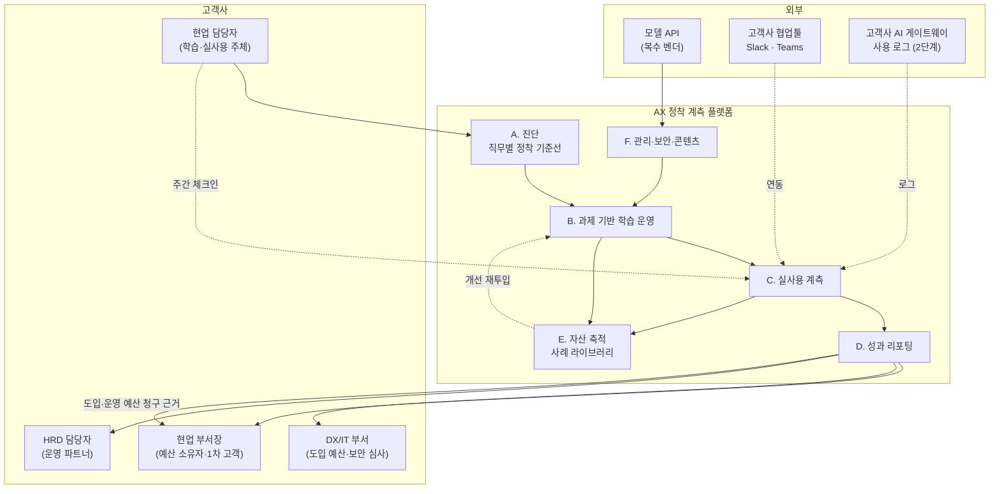

# 딥 리서치 7단계 — 솔루션 도출 및 SRS

작성 시점: 2026년 8월 · 선행 리서치: [1~6단계 리서치](./case-ai-ax-edtech.md) (이하 **[R]**)

가칭: **AX 정착 계측 플랫폼 (AX Adoption & Impact Platform)**

---

## 0. 이 문서의 규칙

방법론 7단계의 연결 규칙을 그대로 적용합니다.

> **검증된 문제 구조의 각 항목이 솔루션의 각 기능에 1:1로 대응해야 한다. 대응되지 않는 기능은 리서치가 아니라 취향에서 나온 것이다.**

따라서 §2의 대응표에 근거가 없는 기능은 이 문서에 포함하지 않았습니다. "있으면 좋을 것 같은" 기능은 §7의 제외 목록에 이유와 함께 적었습니다.

---

## 1. 문제 정의 — 리서치가 확정한 것

### 1-1. 고객의 미해결 과업

| 관찰 | 값 | 출처 |
|---|---|---|
| 생성형 AI를 도입한 국내 기업 | 55.7% | [R] §3-3 |
| 그중 **전사로 확산**된 기업 | **25.0%** | [R] §3-3 |
| 확산을 막는 1순위 원인 | **전문성 부족 45%** | [R] §3-3 |

**과업 진술**: 고객이 해결하지 못한 것은 "AI를 배우는 일"이 아니라 **"도입한 AI가 특정 직무에서 실제로 반복 사용되게 만드는 일"** 입니다.

### 1-2. 기존 방식이 실패하는 이유

| 제약 | 값 | 함의 |
|---|---|---|
| 2026년 교육 예산 동결·감액 | **57.4%** | 교육비 항목에서는 신규 예산을 못 받는다 |
| 1인당 연 교육비 30만 원 미만 | **59.9%** | 단가 상한이 고정돼 있다 |
| 1,000명 기업 계정당 AI 교육 매출(추정) | **2,500만~5,000만 원** | 교육비만으로는 사업 규모가 안 나온다 |
| 구매자 교섭력 | 5/5 | 복수 벤더 병기가 기본 |

**진단**: 이 산업이 돈이 안 되는 것이 아니라 **교육비라는 예산 항목이 돈이 안 됩니다**([R] §정제 2). 같은 고객·같은 문제인데 청구서를 어느 부서에 보내느냐가 상한을 결정합니다.

### 1-3. 그래서 솔루션이 반드시 만족해야 할 조건

1. **교육비가 아닌 예산 항목에서 청구 가능해야 한다** — 그러려면 산출물이 '이수'가 아니라 '정착률·업무 지표'여야 한다
2. **B2B 계정에 자산이 남아야 한다** — B2G는 매년 재입찰로 리셋되므로 전환비용이 안 생긴다([R] §정제 1)
3. **선투자를 최소화해야 한다** — 자산화 선투자는 이익을 먼저 깎는다(엘리스그룹 감가상각 52억→126억, 영업이익 -37%, [R] §5-3)

---

## 2. 문제 → 기능 대응표

이 표가 이 문서의 중심입니다. 왼쪽에 근거가 없는 오른쪽은 만들지 않습니다.

| # | 검증된 문제 | 근거 | 솔루션 기능 | FR |
|---|---|---|---|---|
| P1 | 도입은 했으나 전사 확산 25%에 정체 | [R] §3-3 | 직무 단위 **AI 실사용 계측** 및 기준선 대비 추적 | FR-C |
| P2 | 정체 원인 1위가 전문성 부족(45%) | [R] §3-3 | 범용 강의가 아닌 **자기 업무 과제 기반 실습** | FR-B |
| P3 | 교육 예산 동결(57.4%) → 계정당 천장 | [R] §5-1·5-2 | **도입·운영 예산 청구용 ROI 리포트** (경영진·DX 부서 대상) | FR-D |
| P4 | 전환비용 0 (제품 표준화 + 벤더 교체 자유) | [1A] 2-2 | **사내 사례 라이브러리** + 직무 인증의 사내 제도 편입 | FR-E |
| P5 | 시간이 지나도 커지는 자산이 없음 | [3] KSF4 | **정착률·산출물 데이터 축적 루프** | FR-E |
| P6 | 모델 세대 교체로 콘텐츠 조기 폐기 | [1A] 2-1 | 콘텐츠 **모듈 태깅·부분 갱신**, 모델 추상화 계층 | FR-F |
| P7 | 강사 시간에 매출이 선형으로 묶임 | [2A] §4 | 자동 채점·AI 코칭으로 **사람 개입 구간 축소** | FR-B4 |
| P8 | B2G는 성장하나 자산이 안 쌓임 | [R] §정제 1 | B2G는 **콘텐츠 감가상각 회수 채널**로 분리 운영 | 사업 구조 |
| P9 | 자산화 선투자가 이익을 먼저 깎음 | [R] §5-3 | MVP는 **컨시어지 방식**(수동 운영) 우선, 반복 확인 후 자동화 | 로드맵 |

---

## 3. 솔루션 개요

### 3-1. 한 문장 정의

> **직무 단위로 AI 실사용률을 계측하고, 그 수치를 올리는 데 필요한 만큼만 교육을 붙여, 개선된 업무 지표를 도입·운영 예산의 청구 근거로 만드는 플랫폼.**

교육은 제품이 아니라 **정착률을 올리는 수단 중 하나**로 격하됩니다. 이 격하가 이 솔루션의 핵심 설계 결정입니다.

### 3-2. 기존 AX 교육과의 차이

| 축 | 통상적 AX 교육 | 이 솔루션 |
|---|---|---|
| 파는 것 | 과정·차시 | **정착률 개선폭** |
| 예산 항목 | 교육훈련비(HRD) | **AI 도입·운영비(DX·현업)** |
| 성공 지표 | 이수율·만족도 | 주간 실사용률, 업무 처리시간, 90일 유지율 |
| 계약 형태 | 회차 단위 발주 | 기준선 측정 + 기간 구독 + 성과 연동 |
| 종료 시점 | 수료식 | **90일 유지 측정 완료** |
| 남는 것 | 수료증 | 사내 사례 라이브러리 + 직무별 정착률 시계열 |

### 3-3. 시스템 컨텍스트

**읽는 법**
- **1차 고객은 U2(현업 부서장)입니다.** [2A] 2-4가 "현업 예산이 더 크고 성과 지향적"이라고 지목했고, [R] §정제 2가 예산 항목별 상한 차이로 이를 확인했습니다.
- **가치는 C(실사용 계측)에서 만들어집니다.** 무료 강의도, 모델 제공사의 공식 교육도 고객사 내부의 실사용률은 측정할 수 없습니다. 대체재가 따라올 수 없는 유일한 지점입니다.
- **E → B 되먹임 고리가 유일한 축적 구조**입니다([2A] §1). 여기가 끊기면 이 제품은 계측 기능이 붙은 교육 상품으로 되돌아갑니다.

---

## 4. PoC 설계

### 4-1. PoC의 진짜 목적

기능 검증이 아닙니다. **[R] §8이 한계로 남긴 미측정 값을 실증하는 것**입니다.

> "B2B 현업·DX 예산 규모는 측정하지 못했다. 정제 2의 핵심 주장이 이 미측정 값 위에 서 있다."

따라서 PoC의 1차 성공 기준은 학습 성과가 아니라 **"교육비가 아닌 예산에서 결제가 되는가"** 입니다.

### 4-2. 범위

| 항목 | 확정 내용 | 근거 |
|---|---|---|
| 도메인 | **1개만** 선택 (후보: 제조 품질검사 / 금융 규제 문서 / 병원 행정) | [3] KSF1 — 도메인 지식이 신규 진입자의 유일한 장벽 |
| 직무 | 도메인 내 **1개 직무** | 계측 기준선을 비교 가능하게 만들려면 직무가 고정돼야 함 |
| 고객사 | **3개사** | 1개사는 우연을 배제 못 하고, 5개사는 컨시어지 운영 한계 초과 |
| 인원 | 고객사당 20~40명 (해당 직무 전원) | 부서 단위 확산률을 측정하려면 표본이 아니라 전수여야 함 |
| 기간 | **12주** (기준선 2주 + 운영 8주 + 유지 관찰은 별도 90일) | |
| 운영 방식 | **컨시어지** — 계측·리포트는 수작업, 자동화 없음 | P9: 선투자로 이익을 먼저 깎지 않기 위해 |

### 4-3. 성공 기준 (착수 전 확정)

[3] KSF2의 요구 — "누가, 어떤 지표가 얼마나 개선되면, 얼마를 낸다"를 개발 착수 전에 문서로 확정 — 를 이행합니다.

| 층위 | 지표 | 목표 | 실패 시 판단 |
|---|---|---|---|
| **사업 (1차)** | 3개사 중 **교육비가 아닌 예산 항목**으로 후속 계약한 곳 | **≥ 2개사** | 정제 2 기각 → 솔루션 방향 재설계 |
| 사업 (2차) | 계정당 후속 계약 금액 | ≥ 8,000만 원/년 | 교육비 천장(3,500만)을 못 넘으면 차별화 실패 |
| **성과** | 대상 직무 주 1회 이상 AI 실사용률 | 기준선 대비 **+30%p 또는 60% 이상** | 계측은 되나 효과 없음 → B(학습 설계) 재설계 |
| 성과 | 대상 업무 처리시간 절감 | **≥ 20%** (자기보고 + 표본 실측) | ROI 리포트의 근거가 사라짐 |
| **지속** | 종료 90일 후 실사용 유지율 | **≥ 50%** | 정착이 아니라 이벤트였음 |
| 운영 | 인당 운영 투입 시간 | ≤ 3시간/12주 | 자동화 없이는 확장 불가 판정 |

**반증을 우선합니다.** 위 여섯 개 중 **사업(1차) 기준이 실패하면 나머지가 모두 성공해도 이 솔루션은 기각**입니다. 성과는 좋은데 교육비에서 결제된다면, 그것은 잘 만든 교육 상품일 뿐 [R]이 찾던 답이 아니기 때문입니다.

### 4-4. MVP 범위 (PoC 통과 후)

| 기능 | MVP | 근거 |
|---|---|---|
| A. 진단 | 포함 (템플릿 기반) | 계측 기준선이 없으면 나머지가 전부 무의미 |
| B. 과제 기반 학습 운영 | 포함 (최소) | P2 |
| C. 실사용 계측 — 자기보고·협업툴 연동 | 포함 | P1, 제품의 심장 |
| C. 실사용 계측 — AI 게이트웨이 로그 연동 | **제외** | 고객사 보안 심사 리드타임이 MVP 일정을 지배함 |
| D. 성과 리포팅 (경영진 1페이지) | 포함 | P3, 재계약을 만드는 산출물 |
| E. 사례 라이브러리 | 포함 (수동 큐레이션) | P4·P5 |
| E. AI 튜터 | **제외** | P7의 해법이나 선투자 부담(P9). 반복 문의 패턴이 확인된 뒤 착수 |
| F. 콘텐츠 모듈 태깅 | 포함 (메타데이터만) | P6 |
| F. 다중 모델 추상화 계층 | 포함 | P6, 나중에 넣으면 전면 재작업 |

---

## 5. SRS — 소프트웨어 요구사항 명세서

### 5-1. 문서 정보

| 항목 | 내용 |
|---|---|
| 제품명 | AX 정착 계측 플랫폼 (가칭) |
| 버전 | 0.1 (MVP 기준) |
| 대상 릴리스 | PoC 통과 후 12주 내 MVP |
| 근거 문서 | [1~6단계 리서치](./case-ai-ax-edtech.md), [Ch02 가치사슬](../02-value-chain/case-01-ai-education-edtech.md), [Ch03 KSF](../03-ksf/new-entrant-top5-ksf.md) |

### 5-2. 사용자 정의

| ID | 사용자 | 핵심 목표 | 성공의 정의 |
|---|---|---|---|
| U1 | 현업 담당자 (학습자) | 내 업무를 AI로 실제로 처리하기 | 반복 사용할 만한 방법 1개를 얻는다 |
| **U2** | **현업 부서장 (1차 고객·예산 소유자)** | 부서 업무 지표 개선 | 지표 개선을 숫자로 보고할 수 있다 |
| U3 | HRD 담당자 (운영 파트너) | 교육 운영 부담 없이 성과 증빙 확보 | 예산 집행 근거 문서가 자동으로 나온다 |
| U4 | DX/IT 부서 | 도입한 AI의 활용률 제고, 보안 준수 | 활용률 지표와 데이터 처리 근거를 확보한다 |
| U5 | 자사 운영자 | 다수 계정 동시 운영 | 인당 운영 시간이 규모에 비례해 늘지 않는다 |
| U6 | 자사 콘텐츠 담당 | 모델 세대 교체 대응 | 영향받는 모듈만 골라 갱신한다 |

### 5-3. 기능 요구사항

우선순위: **M**(Must, MVP 필수) / **S**(Should) / **C**(Could, 후속)

#### A. 진단 — 정착 기준선 수립

| ID | 요구사항 | 우선순위 | 대응 문제 |
|---|---|---|---|
| FR-A1 | 대상 직무의 **업무 단위(task) 목록**을 등록하고, 각 업무의 현재 처리시간·빈도·AI 사용 여부를 기준선으로 수집한다 | M | P1 |
| FR-A2 | 개인이 아닌 **직무 단위로 집계**하며, 개인 식별 정보 없이 리포트를 생성할 수 있어야 한다 | M | 보안·[2A] 2-1 |
| FR-A3 | 진단 결과를 학습 과제 추천의 입력으로 전달한다 (진단 데이터를 두 번 받지 않는다) | M | [2A] 2-1 중복 수집 제거 |
| FR-A4 | 동일 직무의 타 고객사 익명 집계값과 비교한 **벤치마크**를 제시한다 | C | P5 축적 효과 |

#### B. 과제 기반 학습 운영

| ID | 요구사항 | 우선순위 | 대응 문제 |
|---|---|---|---|
| FR-B1 | 학습자가 **자기 실제 업무 과제**를 등록하고, 그 과제를 해결하는 형태로 실습이 진행된다 | M | P2 |
| FR-B2 | 고객사 데이터를 사용하는 실습은 **격리된 환경**에서만 수행되며, 외부 모델로의 전송 여부를 정책으로 제어한다 | M | 보안·[2A] 2-2 |
| FR-B3 | 산출물 제출·리뷰 흐름을 제공하고, **첫 과제 제출 단계의 이탈**을 별도 지표로 추적한다 | M | [2A] 2-2 이탈 구간 |
| FR-B4 | 자동 채점 및 1차 피드백을 제공해 사람 리뷰 대상을 축소한다 | S | P7 |
| FR-B5 | 진단 결과에 따라 학습자별 과제 난이도·경로를 조정한다 | C | |

#### C. 실사용 계측 — 제품의 심장

| ID | 요구사항 | 우선순위 | 대응 문제 |
|---|---|---|---|
| FR-C1 | 학습자의 **주간 실사용 체크인**(어떤 업무에 무엇을 썼는가, 소요 시간)을 수집한다 | M | P1 |
| FR-C2 | 협업툴(Slack/Teams) 연동으로 체크인을 업무 흐름 안에서 수행한다 | M | 응답률 확보 |
| FR-C3 | 기준선 대비 **직무별 실사용률 시계열**을 산출한다 | M | P1·P3 |
| FR-C4 | 교육 종료 후 **90일 유지율**을 자동 측정한다 (종료 시점이 수료식이 아니라 90일 후) | M | [2A] 2-5 |
| FR-C5 | 고객사 AI 게이트웨이·툴 사용 로그를 연동해 자기보고를 교차 검증한다 | C | 신뢰도 |
| FR-C6 | 실사용률 하락·미제출을 **이탈 신호**로 감지해 선제 개입 대상을 알린다 | S | [2A] 2-5 문의 전 탐지 |

#### D. 성과 리포팅 — 예산 항목을 바꾸는 산출물

| ID | 요구사항 | 우선순위 | 대응 문제 |
|---|---|---|---|
| FR-D1 | **경영진·부서장용 1페이지 리포트**를 자동 생성한다: 기준선 대비 실사용률, 처리시간 절감 추정, 환산 금액, 유지율 | M | P3 |
| FR-D2 | 리포트 수신자를 **3종으로 분리**한다 (학습자 / HRD / 경영진·DX). 동일 문서를 돌리지 않는다 | M | [2A] 2-3 |
| FR-D3 | 절감 추정의 **계산식과 가정을 리포트에 명시**한다 (자기보고 기반임을 숨기지 않는다) | M | 과대 약속은 해지로 돌아옴 |
| FR-D4 | 리포트 생성은 수작업 없이 완료되어야 한다 (목표 소요 5분 이내) | M | [2A] §4 마진 누수 |
| FR-D5 | 교육으로 해결되지 않는 원인(도구 미도입·데이터 미비·프로세스)을 **별도 항목으로 분리 제시**한다 | S | [2A] 2-3 한계의 설명 |

#### E. 자산 축적 — 전환비용과 축적 루프

| ID | 요구사항 | 우선순위 | 대응 문제 |
|---|---|---|---|
| FR-E1 | 검증된 산출물·프롬프트를 **고객사 사내 사례 라이브러리**로 축적하고 사내 검색을 제공한다 | M | P4 |
| FR-E2 | 라이브러리는 **고객사 자산으로 계약상 귀속**되며, 익명·집계 형태의 재사용 권리를 자사가 보유한다 | M | P5, [3] KSF4 |
| FR-E3 | 직무별 인증 체계를 제공하고 **고객사 사내 직무 등급·평가 제도에 편입**할 수 있는 데이터 포맷을 제공한다 | S | P4, [2A] 2-3 |
| FR-E4 | 학습자 질문·오답 패턴을 익명화해 콘텐츠 개선 백로그로 자동 분류한다 | S | P5 순환 고리 |

#### F. 관리·보안·콘텐츠 운영

| ID | 요구사항 | 우선순위 | 대응 문제 |
|---|---|---|---|
| FR-F1 | 콘텐츠 모듈에 **의존 모델·API·버전을 태깅**하고, 모델 세대 교체 시 영향받는 모듈을 조회한다 | M | P6 |
| FR-F2 | 모델 호출은 **추상화 계층을 경유**하며, 벤더 교체 시 실습 콘텐츠 수정이 발생하지 않아야 한다 | M | P6, [3] KSF5 |
| FR-F3 | 작업 난이도에 따라 저비용 모델로 **라우팅**한다 (자동 채점·요약에 최상위 모델 금지) | S | [2A] 3-4 단가 최적화 |
| FR-F4 | 고객사별 데이터 격리, 접근 권한 관리, 데이터 반환·삭제 기능 | M | 보안 |
| FR-F5 | 다계정 동시 운영 대시보드 (U5) | S | 운영 확장성 |

### 5-4. 데이터 요구사항

핵심 엔티티만 정의합니다. **이 스키마가 곧 축적 자산의 형태**이므로 초기 확정이 필요합니다([3] KSF4 — "나중에 추가하려면 이미 체결한 계약을 다시 열어야 한다").

| 엔티티 | 핵심 속성 | 비고 |
|---|---|---|
| `Account` | 고객사, 산업, 규모, 계약 예산항목(교육비/도입운영비/현업예산) | **예산항목 필드가 정제 2 가설의 실증 데이터** |
| `JobRole` | 직무 코드, 도메인, 소속 부서 | 집계의 최소 단위 |
| `Task` | 업무명, 기준 처리시간, 빈도, AI 적용 가능성 등급 | FR-A1 |
| `Baseline` | 직무별 측정 시점, AI 사용률, 평균 처리시간 | 모든 성과 주장의 분모 |
| `UsageCheckin` | 주차, 직무, 사용 업무, 도구, 체감 절감시간, 자기보고 여부 | FR-C1. **개인 식별자 미저장** |
| `Deliverable` | 산출물, 검증 상태, 재사용 가능 여부 | FR-E1 |
| `PromptAsset` | 프롬프트, 적용 업무, 검증자, 모델 버전 | 모델 교체 시 영향 추적 |
| `ContentModule` | 모듈, 의존 모델·API·버전, 최종 갱신일 | FR-F1 |
| `ImpactReport` | 기간, 직무, 실사용률, 절감 추정, 계산 가정 | FR-D1·D3 |

**개인정보 원칙**: 성과 측정에 필요한 최소 항목만 수집하고, 리포트는 직무 단위 집계로만 산출합니다([2A] 2-1). 개인 단위 데이터는 학습자 본인 피드백 목적으로만 보관하며 계약 종료 시 삭제합니다.

### 5-5. 비기능 요구사항

| ID | 분류 | 요구사항 |
|---|---|---|
| NFR-1 | 보안 | 고객사 데이터는 테넌트 단위 논리적 격리. 실습 데이터의 외부 모델 전송 여부를 계약 단위로 설정 가능 |
| NFR-2 | 개인정보 | 고객사에 대해 **처리 수탁자** 지위. 위탁 계약·마스킹 규칙·삭제 절차를 제품 기능으로 지원 |
| NFR-3 | 가용성 | 학습 운영 기간 중 업무시간 가용률 99.5%. 주 모델 벤더 장애 시 **대체 모델로 자동 전환** (FR-F2 전제) |
| NFR-4 | 성능 | 리포트 생성 5분 이내(FR-D4), 체크인 응답 3초 이내 |
| NFR-5 | 확장성 | 동시 20개 계정 / 2,000명 운영 시 자사 운영 인력 증가가 **선형 이하** |
| NFR-6 | 감사성 | 모든 성과 수치는 원천 데이터로 역추적 가능해야 한다. 리포트에 산식·표본수·수집방식 병기 |
| NFR-7 | 이식성 | 특정 클라우드·LMS에 종속되지 않는다. 고객사 데이터 **반출 포맷 제공** |
| NFR-8 | 접근성 | 비개발 직군이 이해할 수 있는 용어로 UI·리포트를 작성한다 |

### 5-6. 외부 인터페이스

| 인터페이스 | 방향 | 우선순위 |
|---|---|---|
| 모델 API (복수 벤더, 추상화 계층 경유) | 송신 | M |
| Slack / MS Teams (체크인·알림) | 양방향 | M |
| 고객사 SSO (SAML/OIDC) | 수신 | M |
| 고객사 LMS (이수 데이터 반출) | 송신 | S |
| 고객사 AI 게이트웨이 사용 로그 | 수신 | C |
| 고객사 HR 시스템 (직무 등급 연계, FR-E3) | 송신 | C |

### 5-7. 제약 및 가정

**제약**
- 고객사 보안 심사가 도입 리드타임을 지배한다. AI 게이트웨이 로그 연동(FR-C5)을 MVP에 넣으면 일정이 심사에 종속된다 — 그래서 뺐다.
- 기업교육은 상·하반기 집중이라는 계절성이 있다([2A] 3-2). 운영 인력 계획이 이 곡선을 전제해야 한다.
- 정부 재정지원 훈련(B2G)은 회계·단가 규제가 별도이므로 **원가와 조직을 분리**한다([2A] 3-1).

**가정** (틀리면 설계가 바뀌는 것들)
- A1. 현업 부서장이 AI 도입·운영 예산에 대한 실질 집행 권한을 갖는다 → **PoC 1차 기준으로 검증**
- A2. 자기보고 기반 실사용률이 의사결정에 쓸 만한 신뢰도를 갖는다 → 표본 실측으로 교차 검증
- A3. 처리시간 절감을 금액으로 환산하는 방식을 고객사 재무 부서가 수용한다 → PoC에서 조기 확인
- A4. 도메인 특화와 모듈 재사용률은 상충한다([2A] §5) → 재사용률 상한을 실측해 원가 모델에 반영

### 5-8. 수용 기준 (MVP 릴리스 판정)

| # | 기준 |
|---|---|
| AC-1 | 신규 계정의 기준선 수립부터 첫 리포트 발행까지 **자사 운영 투입 8시간 이내** |
| AC-2 | 리포트 생성이 **수작업 0건**으로 완료 (FR-D4) |
| AC-3 | 직무별 실사용률·90일 유지율이 원천 데이터로 역추적 가능 (NFR-6) |
| AC-4 | 모델 벤더 1개를 교체해도 실습 콘텐츠 수정이 **0건** (FR-F2) |
| AC-5 | 고객사 데이터 반출·삭제 요청이 제품 기능으로 처리 (NFR-2·NFR-7) |
| AC-6 | 계정 3개 동시 운영 시 운영 인력 증가 없음 (NFR-5) |

### 5-9. 릴리스 로드맵

| 단계 | 기간 | 산출물 | 게이트 |
|---|---|---|---|
| **0. 도메인 확정** | 2주 | 도메인·직무 1개 확정 문서, 지불 주체 인터뷰 5건 | [3] KSF1·KSF2 충족 |
| **1. PoC (컨시어지)** | 12주 | 3개사 운영, 수작업 계측·리포트 | §4-3 사업 1차 기준 통과 |
| **2. MVP** | 12주 | FR 중 M 항목 전부 | §5-8 수용 기준 전부 |
| **3. 확장** | 이후 | AI 튜터(FR-B4), 게이트웨이 연동(FR-C5), 벤치마크(FR-A4) | 반복 문의·요구 패턴 실측 후 착수 |

**단계 3을 뒤로 미룬 것이 이 로드맵의 핵심 결정입니다.** AI 튜터는 [2A]가 "최대 마진 레버"로 지목한 기능이지만, 엘리스그룹 사례([R] §5-3)는 자산화 선투자가 이익을 먼저 깎는다는 것을 보여줍니다. **반복 패턴이 데이터로 확인되기 전의 자동화는 감가상각비만 만듭니다.**

### 5-10. 미결 사항

- 성과 연동 과금의 구체적 산식 — 절감 금액의 몇 %를 청구할 것인가, 상·하한은
- 사례 라이브러리의 지식재산권 귀속 — 고객사 자산이면서 자사가 익명 재사용하는 구조의 계약 문구
- 자기보고 절감시간의 인정 범위 — 고객사 재무 부서가 수용하는 할인율
- B2G 사업의 법인·회계 분리 시점

---

## 6. KSF 이행 점검

[3]의 5대 KSF가 이 솔루션에서 실제로 실행되는지 확인합니다. 대응되지 않는 KSF가 있으면 솔루션이 아직 미완성이라는 뜻입니다.

| KSF | 리서치가 붙인 조건 | 이 솔루션에서의 이행 |
|---|---|---|
| 1. 교두보의 극단적 협소화 | 도메인 + **예산 항목**까지 좁힐 것 | 로드맵 단계 0(도메인 1개) + 청구 항목을 도입·운영 예산으로 고정 |
| 2. 지불 근거의 선증명 | 지불 주체는 **AI 도입 예산 소유자** | §4-3 성공 기준을 착수 전 확정, 1차 기준을 '예산 항목'으로 설정 |
| 3. 전환비용의 인위적 설계 | **B2B 계정에서만** 성립 | FR-E1~E3 (사례 라이브러리·사내 제도 편입), B2G는 별도 운영(P8) |
| 4. 축적 루프의 조기 가동 | 축적 대상은 **정착률·성과 데이터** | FR-E2(재사용 권리를 첫 계약에), FR-E4, `Baseline`·`UsageCheckin` 스키마 초기 확정 |
| 5. 원가 결정권의 내부화 | 자산화 선투자는 **이익을 먼저 깎는다** | FR-F2·F3(모델 추상화·라우팅) + 로드맵의 컨시어지 선행 원칙 |

---

## 7. 의도적으로 만들지 않는 것

| 제외 항목 | 이유 |
|---|---|
| 범용 AI 강의 카탈로그 | 무료 대체재가 가격 상한을 0 근처로 누른다([1A] 2-4). 이 축으로는 이길 수 없다 |
| 자체 LMS | 외부 조달 대상이다([2A] 2-1). 경쟁력의 원천이 아닌 것을 만들면 원가만 늘어난다 |
| 자체 모델 파인튜닝 | 모델 세대 교체 주기가 투자 회수 주기보다 짧다([1A] 2-1) |
| 개인(B2C) 구독 상품 | [R] §정제 1 — B2C는 역성장 세그먼트이며 계측할 '업무'가 없다 |
| B2G 전용 제품군 | B2G는 **기존 콘텐츠의 감가상각 회수 채널**로만 쓴다. 전용 개발은 자산이 안 남는 곳에 투자하는 것(P8) |
| 만족도·이수율 대시보드 | 고객사가 돈을 낸 이유를 설명하지 못한다([2A] 2-2). 계측하면 그 지표로 평가받게 된다 |

---

## 8. 다음 리서치로 넘기는 질문

[R] §8이 남긴 미해소 항목 중 이 솔루션의 성패에 직접 영향을 주는 것들입니다.

- [ ] **기업 AI 예산의 교육/툴/구축 배분 비율** — 정제 2의 핵심 주장이 이 값 위에 서 있다. PoC 1차 기준이 1차 실증이지만 3개사 표본으로는 부족하다
- [ ] 1,000명 이상 국내 기업의 실제 수 — §5-2의 "86개 계정" 목표가 현실적인지 판단하는 분모
- [ ] 기업 HRD의 벤더 교체 주기 — 전환비용 설계(FR-E)의 효과 크기를 추정하는 값
- [ ] 자기보고 절감시간과 실측치의 괴리 — FR-D3의 신뢰도가 여기 달려 있다
- [ ] 모델 제공사 무료 교육·인증의 국내 기업 채택률 — 공급자 전방 통합([1A] 2-1)의 실제 위협 크기

이 질문들은 **Ch04 TAM-SAM-SOM**의 입력이기도 합니다. 특히 첫 두 항목이 확정되면 SOM 계산이 추정이 아니라 산술이 됩니다.
